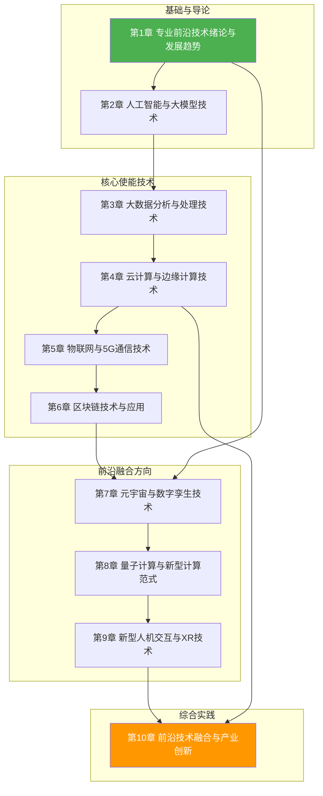

# 专业前沿技术

> [!abstract] 课程定位
> 专业前沿技术是计算机科学与技术专业的综合前沿课程，系统讲解新一代信息技术的概念体系、架构演进、产业生态与应用场景。课程以 ABCD5G（AI、Blockchain、Cloud、Data、5G）技术体系为主线，覆盖物联网、元宇宙、量子计算、数字孪生等颠覆性技术，帮助学生在已掌握的人工智能、大数据、云计算等单科知识基础上，建立跨技术域的融合认知与产业视角，培养面向未来的技术研判与创新能力。

## 课程结构

## 章节导航

| 章节 | 主题 | 核心知识点 |
|-----|------|-----------|
| [[第1章 专业前沿技术绪论与发展趋势/MOC - 第1章]] | 前沿技术定义、架构演进、产业生态 | ABCD5G体系、Gartner曲线、四层架构 |
| [[第2章 人工智能与大模型技术/MOC - 第2章]] | AI前沿、大模型、AIGC | Transformer、GPT、多模态、Agent |
| [[第3章 大数据分析与处理技术/MOC - 第3章]] | 大数据前沿、实时计算、数据治理 | 数据湖、湖仓一体、流批一体 |
| [[第4章 云计算与边缘计算技术/MOC - 第4章]] | 云原生、边缘计算、云边端协同 | K8s、Serverless、边缘AI |
| [[第5章 物联网与5G通信技术/MOC - 第5章]] | IoT体系、5G/6G、协议栈 | NB-IoT、网络切片、URLLC |
| [[第6章 区块链技术与应用/MOC - 第6章]] | 区块链原理、共识、智能合约 | PoW/PoS、DeFi、联盟链 |
| [[第7章 元宇宙与数字孪生技术/MOC - 第7章]] | 元宇宙、数字孪生、Web3 | 虚拟世界、XR融合、数字资产 |
| [[第8章 量子计算与新型计算范式/MOC - 第8章]] | 量子计算、类脑、光子计算 | 量子比特、量子算法、NISQ |
| [[第9章 新型人机交互与XR技术/MOC - 第9章]] | XR、BCI、自然交互 | VR/AR/MR、脑机接口、多模态交互 |
| [[第10章 前沿技术融合与产业创新/MOC - 第10章]] | 技术融合、产业创新、伦理治理 | 跨域融合、创新方法论、技术伦理 |

## 学习目标

| 阶段 | 能力要求 |
|-----|---------|
| 基础 | 理解前沿技术定义、特征与技术体系，掌握新一代信息技术架构 |
| 进阶 | 掌握 ABCD5G 各技术域的核心原理、关键能力与适用场景 |
| 综合 | 能够分析技术融合趋势，理解产业链分工与产业生态演进 |
| 前瞻 | 具备前沿技术研判能力，关注量子计算、元宇宙等颠覆性方向 |

## 关联知识

- [[人工智能与前沿技术/人工智能技术]] - 本课程 AI 章节的理论基础与先修
- [[人工智能与前沿技术/大数据分析技术]] - 本课程大数据章节的理论基础与先修
- [[人工智能与前沿技术/云计算技术]] - 本课程云边端章节的理论基础与先修
- [[编程与算法/Python程序设计]] - 技术实践与案例验证的编程基础
- [[人工智能与前沿技术/嵌入式系统]] - 物联网与边缘计算的硬件基础
- [[人工智能与前沿技术/数字图像处理]] - XR与计算机视觉的算法基础

## 工具与技术推荐

| 工具/技术 | 用途 | 对应章节 |
|----------|------|---------|
| Hugging Face Transformers | 大模型调用与微调 | 第2章 |
| Apache Spark | 大数据处理 | 第3章 |
| Kubernetes | 云原生容器编排 | 第4章 |
| KubeEdge | 边缘计算框架 | 第4、5章 |
| MQTT/CoAP | 物联网通信协议 | 第5章 |
| Hyperledger Fabric | 联盟链开发 | 第6章 |
| Unity / Unreal Engine | 元宇宙与数字孪生建模 | 第7、9章 |
| Qiskit | 量子计算模拟 | 第8章 |
| OpenXR / WebXR | XR应用开发 | 第9章 |
| Gartner Hype Cycle | 技术成熟度研判 | 第1、10章 |
