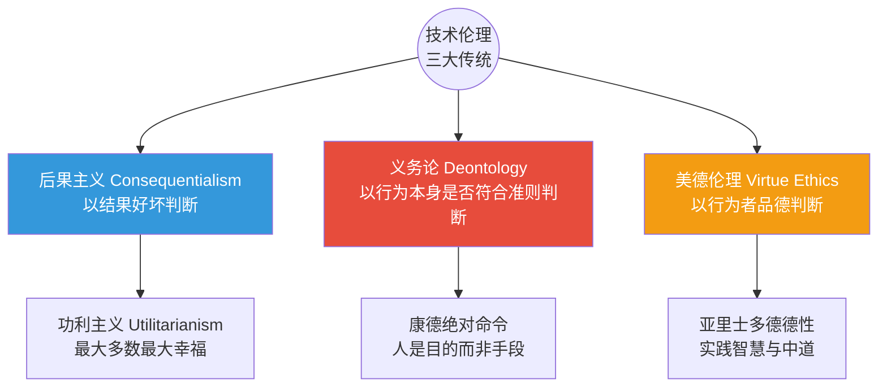
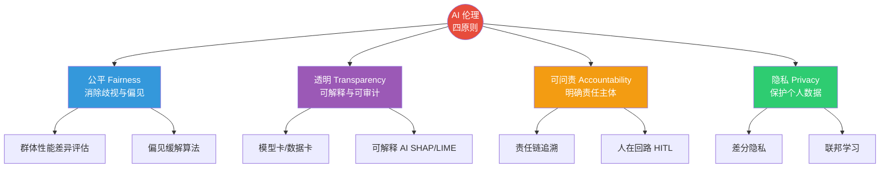
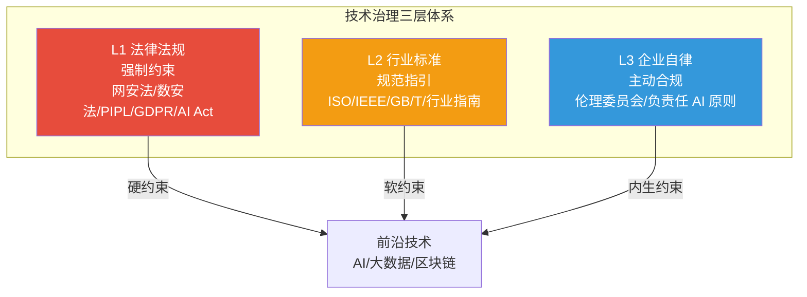
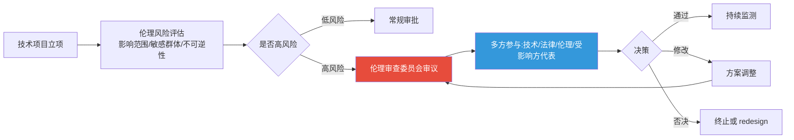

# 10.1 技术伦理框架与治理体系

> [!abstract] 本节导读
> 本节解决"前沿技术为何需要伦理约束、如何构建治理体系"的问题。从技术伦理的三大哲学传统（后果主义、义务论、美德伦理）入手，阐述各自的判断标准与适用边界；进而展开 AI 伦理的公平、透明、可问责、隐私四原则及其工程落地；最后论述技术治理的三层体系（法律、标准、自律）与伦理审查委员会机制。本节是 [[第10章 前沿技术伦理与行业规范/MOC - 第10章]] 的纲领，承接 [[9.3 AI安全与深度伪造防护]] 的负责任 AI 原则，为 [[10.2 数据合规与法律法规]] 提供伦理基础。

## 一、技术伦理三大传统

技术伦理并非主观偏好，而是建立在三大经典哲学传统之上，三者从不同维度回答"什么是对的、什么是好的"。



| 传统 | 核心主张 | 判断标准 | 在技术伦理中的应用 |
|-----|---------|---------|-------------------|
| **后果主义** | 行为道德性由其结果决定 | 是否带来最大总效用（幸福） | 风险—收益评估、技术影响评估 |
| **义务论** | 某些行为本身对错与结果无关 | 是否符合普遍道德准则与义务 | 不得侵犯人的尊严、知情同意 |
| **美德伦理** | 关注行为者品德而非行为本身 | 是否体现勇敢、公正、谨慎等德性 | 工程师职业操守、负责任创新文化 |

> [!important] 三传统的互补
> 三大传统并非互斥，而是互补：后果主义擅长总体效益评估但易牺牲少数人；义务论保护个体尊严但不灵活；美德伦理关注长期文化与操守但缺乏明确规则。技术伦理治理需结合三者——既做风险收益评估（后果主义），又坚守"不得侵犯人"的红线（义务论），还培育工程师的负责任文化（美德伦理）。

### 1.1 应用：自动驾驶电车难题

自动驾驶"电车难题"是三大传统分歧的典型场景：车辆失控时，是撞向 5 个路人还是转向撞向 1 个行人？

- **后果主义**：选择伤害更少的一方（转向撞 1 人），最大化总效用
- **义务论**：主动转向导致伤害属于"作为"，不转向属于"不作为"，二者道德责任不同；且不得将人作为"工具"
- **美德伦理**：关注设计者是否以谨慎、负责的态度预防此类困境，而非仅在事后抉择

> [!note] 电车难题的现实局限
> 电车难题是高度抽象的伦理思想实验，现实自动驾驶事故远比其复杂——存在不确定性、法律责任、技术可行性等多维因素。工程实践中更关注"可追溯的责任划分""透明决策逻辑"与"前置风险评估"，而非追求一个"标准答案"。

## 二、AI 伦理四原则

AI 因其自主决策能力与广泛社会影响，需要专门的伦理原则。OECD、欧盟 AI Act、中国《新一代人工智能伦理规范》均提出相近的核心原则。



| 原则 | 含义 | 工程实践 |
|-----|------|---------|
| **公平** | 不同群体受到同等对待，无系统性歧视 | 分群体性能评估、偏见检测与缓解、代表性数据 |
| **透明** | 决策逻辑可解释、可审计 | 模型卡/数据卡、可解释 AI（SHAP/LIME）、日志留存 |
| **可问责** | 明确责任主体，可追溯决策 | 责任链、人在回路（HITL）、审计日志 |
| **隐私** | 保护个人数据，最小必要采集 | 差分隐私、联邦学习、最小化数据采集 |

> [!important] 公平的多重定义
> "公平"并非单一概念，存在相互冲突的定义：①**群体公平**——不同群体错误率相等；②**个体公平**——相似个体得到相似结果；③**程序公平**——决策过程无歧视特征。三者往往无法同时满足（如群体公平与校准公平冲突），工程中需根据场景明确"采用哪种公平"并公开声明，避免"公平"沦为口号。

### 2.1 工程落地：模型卡与数据卡

模型卡（Model Card）与数据卡（Data Sheet）是透明原则的关键工程实践：

| 文档 | 内容 | 用途 |
|-----|------|------|
| **模型卡** | 用途、训练数据、性能（分群体）、伦理限制、推荐/不推荐场景 | 让使用者理解模型边界 |
| **数据卡** | 来源、采集方式、标注流程、推荐/不推荐用途、已知偏见 | 让使用者评估数据适用性 |

## 三、技术治理三层体系

技术治理是法律、标准与自律三个层面的协同体系，单靠任一层都无法有效约束前沿技术。



| 层级 | 性质 | 特点 | 局限 |
|-----|------|------|------|
| **法律法规** | 强制 | 事后惩戒、底线约束 | 滞后于技术、跨域难统一 |
| **行业标准** | 引导 | 事前指引、技术细节 | 自愿性、约束力弱 |
| **企业自律** | 主动 | 灵活、内生、前瞻 | 缺乏外部监督、易妥协 |

> [!important] 三层协同的必要性
> 法律滞后于技术迭代——AI Act 立法耗时数年而生成式 AI 已迭代多代；标准灵活但约束力弱；企业自律缺乏外部监督。唯有三层协同：法律划底线、标准给方法、自律补空白，才能形成可持续治理。例如深度合成标识既需法律规定（数安法）、也需标准细化（深度合成管理规定）、还需企业主动落实（平台审核机制）。

## 四、伦理审查委员会

伦理审查委员会（Ethics Review Board / IRB）是前置评估技术项目伦理风险的机制，源自医学研究伦理审查，现已扩展至 AI、数据科学等领域。



| 审查要素 | 说明 |
|---------|------|
| **影响范围** | 受影响人群规模与脆弱性 |
| **不可逆性** | 后果是否可挽回（如人脸识别、生物特征） |
| **自主性影响** | 是否限制人的自主选择 |
| **公平性** | 是否对特定群体歧视 |
| **透明性** | 决策是否可解释 |
| **救济机制** | 受害者是否有申诉与救济途径 |

> [!tip] 多方参与原则
> 伦理审查不应只由技术专家或法务人员决定，而需纳入受影响群体的代表。例如医疗 AI 需患者代表、教育 AI 需师生代表、城市监控需社区代表。多方参与能避免"技术精英视角"的盲区，是审查公正性的关键。

## 五、示例：AI 伦理影响评估

```python
# 简化演示 AI 项目伦理影响评估的评分逻辑
# 运行环境：Python 3.10，仅标准库
# 工作目录：任意
from dataclasses import dataclass

@dataclass
class AIProject:
    name: str
    affects_vulnerable: bool       # 是否影响脆弱群体
    biometric_data: bool           # 是否涉及生物特征
    autonomous_decision: bool      # 是否自主决策
    irreversible: bool             # 后果是否不可逆
    explainable: bool              # 是否可解释
    has_redress: bool              # 是否有救济机制

def ethics_risk_score(p: AIProject) -> tuple:
    """基于风险要素评分，返回 (总分, 风险等级, 建议)"""
    score = 0
    reasons = []
    if p.affects_vulnerable:
        score += 2; reasons.append("影响脆弱群体 +2")
    if p.biometric_data:
        score += 3; reasons.append("涉及生物特征 +3")
    if p.autonomous_decision:
        score += 2; reasons.append("自主决策 +2")
    if p.irreversible:
        score += 3; reasons.append("后果不可逆 +3")
    if not p.explainable:
        score += 2; reasons.append("不可解释 +2")
    if not p.has_redress:
        score += 2; reasons.append("无救济机制 +2")

    if score >= 8:
        level, advice = "高风险", "需伦理审查委员会审议，建议 redesign"
    elif score >= 4:
        level, advice = "中风险", "需标准化评估与缓解措施"
    else:
        level, advice = "低风险", "常规审批，持续监测"
    return score, level, advice, reasons

# 评估一个"人脸识别考勤"项目
project = AIProject(
    name="校园人脸识别考勤",
    affects_vulnerable=True,    # 涉及未成年学生
    biometric_data=True,        # 人脸生物特征
    autonomous_decision=False,
    irreversible=True,          # 生物特征一旦泄露不可更换
    explainable=True,
    has_redress=True,
)
score, level, advice, reasons = ethics_risk_score(project)
print(f"项目: {project.name}")
print(f"风险评分: {score} 等级: {level}")
for r in reasons:
    print(f"  - {r}")
print(f"建议: {advice}")

# 关键结论：伦理评估应前置且量化，避免事后补救。
# 涉及生物特征与脆弱群体的项目天然高风险，需委员会多方审议。
```

```bash
# 参考欧盟 AI Act 高风险 AI 系统清单与合规流程（伪流程）
# 工作环境：浏览器
# 工作目录：项目根目录
# 访问 https://artificialintelligenceact.eu/high-risk-ai-systems/
# 对照项目是否落入"高风险"清单，若是则需满足风险管理、数据治理、
# 技术文档、人工监督、透明度与注册等强制义务。
```

> [!summary] 本节要点回顾
> 1. **三大传统**：后果主义（结果）、义务论（准则）、美德伦理（品德），三者互补
> 2. **电车难题**：三传统给出不同答案，工程更关注可追溯责任与前置评估
> 3. **AI 伦理四原则**：公平、透明、可问责、隐私，各有工程落地手段
> 4. **公平多重定义**：群体/个体/程序公平常冲突，需明确声明采用哪种
> 5. **模型卡/数据卡**：透明原则的关键工程实践，也是合规审计依据
> 6. **治理三层**：法律（硬约束）+ 标准（软约束）+ 自律（内生约束）协同
> 7. **伦理审查**：前置评估影响范围、不可逆性、自主性、公平性、救济机制，多方参与

## 关联知识点

| 关联知识点 | 关系 |
|-----------|------|
| [[10.2 数据合规与法律法规]] | 伦理原则的法律落地 |
| [[10.3 可持续发展与绿色计算]] | 技术责任的环境维度 |
| [[9.3 AI安全与深度伪造防护]] | 负责任 AI 原则的展开 |
| [[第4章 人工智能智能赋能技术/4.3 AI工程化与行业落地]] | AI 工程化需纳入伦理审查 |
| [[MOC - 第10章]] | 返回本章导航 |
