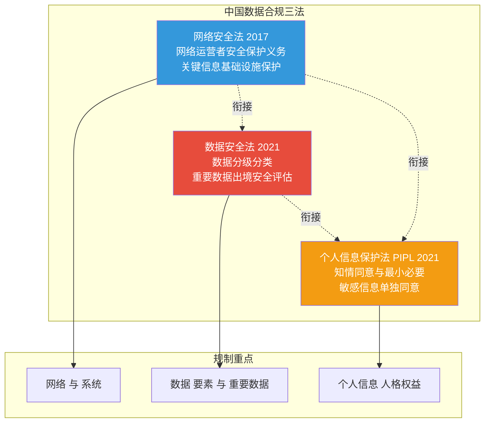
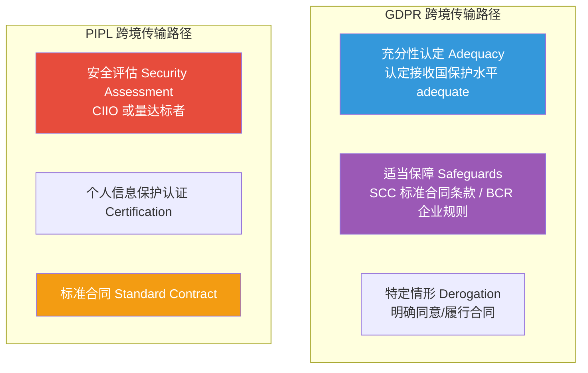

# 10.2 数据合规与法律法规

> [!abstract] 本节导读
> 本节解决"前沿技术数据处理活动应遵循哪些法律与标准"的问题。从中国"网络安全法—数据安全法—个人信息保护法"三法体系入手，阐述各自规制重点与衔接关系；对比国际 GDPR、CCPA；展开跨境数据传输规则；最后介绍 ISO 27001 与 27701 等行业标准。本节承接 [[10.1 技术伦理框架与治理体系]] 的伦理基础，与 [[9.2 数据安全治理与隐私保护]] 的隐私保护技术协同，为 [[9.1 零信任架构与安全模型]] 的访问控制提供合规依据。

## 一、中国数据合规三法体系

中国已形成以"网络安全法—数据安全法—个人信息保护法"为核心的数据合规法律体系，三者各有侧重又相互衔接。



| 法律 | 施行时间 | 规制对象 | 核心义务 |
|-----|---------|---------|---------|
| **网络安全法** | 2017-06-01 | 网络运营者、关键信息基础设施运营者 | 等级保护、安全监测、个人信息保护 |
| **数据安全法** | 2021-09-01 | 数据处理者 | 分级分类、风险监测、重要数据出境评估 |
| **个人信息保护法** | 2021-11-01 | 个人信息处理者 | 知情同意、最小必要、单独同意、跨境传输 |

> [!important] 三法的衔接关系
> 三法并非孤立：网络安全法管"网络与系统安全"（基础设施数据保护）；数据安全法管"数据本身"（要素流通与重要数据）；PIPL 管"个人信息"（人格权益）。同一数据处理活动可能同时受三法规制——如某 App 处理用户个人信息，既需履行网安法网络安全等级保护义务，又需按数安法做数据分级，还需按 PIPL 取得知情同意。合规时需三法协同评估。

### 1.1 网络安全法核心要点

| 制度 | 内容 |
|-----|------|
| **网络安全等级保护** | 网络运营者按等级履行安全保护义务（等保 2.0） |
| **关键信息基础设施保护** | 能源、金融、交通等领域 CII 加强保护 |
| **个人信息保护** | 收集使用个人信息需明示并取得同意 |
| **数据留存** | 网络日志留存不少于六个月 |

### 1.2 数据安全法核心要点

| 制度 | 内容 |
|-----|------|
| **数据分类分级** | 按重要程度分类（一般/重要/核心）分级保护 |
| **重要数据保护** | 重要数据处理者需定期风险评估并报告 |
| **数据交易中介** | 数据交易服务提供者需核验数据来源 |
| **跨境传输** | 重要数据出境需安全评估 |

### 1.3 个人信息保护法核心要点

| 制度 | 内容 |
|-----|------|
| **知情同意** | 处理个人信息需告知并取得同意 |
| **最小必要** | 仅采集与处理目的直接相关的必要信息 |
| **单独同意** | 敏感信息、跨境、公开、向第三方提供等场景 |
| **敏感个人信息** | 生物识别、宗教信仰、医疗健康、金融账户、14 岁以下儿童 |
| **数据主体权利** | 查询、复制、更正、删除、撤回同意 |

## 二、国际数据保护法

### 2.1 GDPR 欧盟通用数据保护条例

GDPR（General Data Protection Regulation）于 2018 年 5 月生效，是全球最严格的个人信息保护法，确立"以数据主体权利为中心"的规制范式。

| 维度 | 内容 |
|-----|------|
| **适用范围** | 处理欧盟主体数据或向其提供服务（域外效力） |
| **合法基础** | 同意、合同、法定义务、重大利益、公共利益、正当利益 |
| **数据主体权利** | 知情、访问、更正、删除（被遗忘权）、限制、可携、反对 |
| **数据保护官 DPO** | 大规模处理敏感数据需任 DPO |
| **数据保护影响评估 DPIA** | 高风险处理需做影响评估 |
| **跨境传输** | 充分性认定 / SCC / BCR |
| **处罚** | 最高 4% 全球营收或 2000 万欧元 |

### 2.2 CCPA 加州消费者隐私法

CCPA（California Consumer Privacy Act）于 2020 年生效，是美国最严格的州级隐私法，赋予加州居民对个人信息的控制权。

| 维度 | 内容 |
|-----|------|
| **适用范围** | 年营收超 2500 万美元或处理超 5 万消费者信息的企业 |
| **消费者权利** | 知晓、删除、选择不出售、不歧视 |
| **个人信息的出售** | 企业需提供"请勿出售我的个人信息"链接 |
| **处罚** | 每项违规 7500 美元 |

## 三、跨境数据传输

跨境传输是数据合规的焦点，各国均设有限制机制以保护本国数据主权与安全。



| 路径 | GDPR | PIPL |
|-----|------|------|
| **认定/评估** | 充分性认定 | 安全评估（CIIO 或量达标者必经） |
| **合同** | SCC 标准合同条款 | 标准合同 |
| **认证/规则** | BCR 企业约束规则 | 个人信息保护认证 |
| **特殊场景** | 明确同意、公共利益 | 单独同意 |

> [!important] 中国跨境传输的量级触发
> PIPL 与《数据出境安全评估办法》规定，处理 100 万人以上个人信息或 10 万人以上敏感个人信息的数据处理者向境外提供信息，必须通过国家网信办安全评估。这是基于规模的风险分级——量大则风险高，需更严格审批。

## 四、行业标准：ISO 27001 与 27701

### 4.1 ISO 27001 信息安全管理体系

ISO/IEC 27001 是信息安全管理体系（ISMS）的国际标准，基于"计划—执行—检查—改进"（PDCA）循环，提供系统化的安全管理框架。

| 维度 | 内容 |
|-----|------|
| **核心** | 建立、实施、维护、持续改进 ISMS |
| **风险评估** | 识别资产、威胁、脆弱性与风险 |
| **控制项** | 附录 A 列出 93 项控制措施（2022 版） |
| **认证** | 第三方认证机构审核颁发证书 |
| **适用** | 任何规模、任何行业 |

### 4.2 ISO 27701 隐私信息管理体系

ISO/IEC 27701 是 27001 在隐私维度的扩展，专门针对个人信息处理，作为 PIMS（隐私信息管理体系）标准。

| 维度 | 内容 |
|-----|------|
| **关系** | 27001 的扩展，需先有 27001 |
| **关注** | 个人信息收集、处理、共享的隐私保护 |
| **角色** | 控制者（PII Controller）与处理者（PII Processor） |
| **价值** | 证明隐私合规能力，支持 GDPR/PIPL 举证 |

## 五、合规框架对比

| 法律/标准 | 适用地区 | 核心机制 | 处罚力度 |
|----------|---------|---------|---------|
| **网络安全法** | 中国 | 等级保护、CII 保护 | 警告—罚款—停业整顿 |
| **数据安全法** | 中国 | 数据分级、重要数据保护 | 最高 10 倍违法所得/1000 万 |
| **PIPL** | 中国 | 知情同意、最小必要 | 最高 5% 营收/5000 万 |
| **GDPR** | 欧盟 | 数据主体权利、DPIA | 最高 4% 营收/2000 万欧元 |
| **CCPA** | 美国加州 | 知晓、删除、选择退出 | 每项 7500 美元 |
| **ISO 27001** | 国际 | ISMS 体系、PDCA | 无强制处罚（认证） |
| **ISO 27701** | 国际 | PIMS 隐私扩展 | 无强制处罚（认证） |

> [!tip] 合规的"软硬"结合
> 法律是"硬约束"（违规即处罚），ISO 等标准是"软约束"（不认证不违法，但缺乏认证难举证合规能力）。优秀的企业合规策略是"法律划底线 + 标准给方法 + 内部制度落地"——以 ISO 27001/27701 作为方法论建立体系，以法律为底线持续审计，以内部制度确保执行。

## 六、示例：合规自检清单

```python
# 简化演示一个面向中国与欧盟双合规的数据处理自检清单
# 运行环境：Python 3.10，仅标准库
# 工作目录：任意
from dataclasses import dataclass

@dataclass
class DataProcessing:
    has_consent: bool                 # 是否取得同意
    separate_consent_sensitive: bool  # 敏感信息单独同意
    minimal_necessary: bool            # 最小必要
    data_classification_done: bool     # 是否完成分级分类
    cross_border_assessment: bool      # 跨境是否完成安全评估/合同
    retention_limit_set: bool          # 是否设定留存期限
    has_dpo: bool                       # 是否任 DPO（GDPR）
    has_dpia: bool                      # 是否完成 DPIA（GDPR 高风险）

def compliance_check(p: DataProcessing) -> dict:
    """返回中欧双合规的检查结果"""
    pipl_issues, gdpr_issues = [], []
    # PIPL 检查
    if not p.has_consent: pipl_issues.append("未取得知情同意")
    if not p.separate_consent_sensitive: pipl_issues.append("敏感信息未单独同意")
    if not p.minimal_necessary: pipl_issues.append("违反最小必要原则")
    if not p.data_classification_done: pipl_issues.append("未完成数据分级分类")
    if not p.cross_border_assessment: pipl_issues.append("跨境未走安全评估/标准合同")
    if not p.retention_limit_set: pipl_issues.append("未设定留存期限")
    # GDPR 检查
    if not p.has_consent: gdpr_issues.append("缺乏合法基础")
    if not p.cross_border_assessment: gdpr_issues.append("跨境无适当保障 SCC/BCR")
    if not p.has_dpo: gdpr_issues.append("未任命数据保护官 DPO")
    if not p.has_dpia: gdpr_issues.append("高风险处理未做 DPIA")
    return {"PIPL": pipl_issues or "通过", "GDPR": gdpr_issues or "通过"}

# 一个不合规的处理场景
case = DataProcessing(
    has_consent=True,
    separate_consent_sensitive=False,
    minimal_necessary=True,
    data_classification_done=False,
    cross_border_assessment=False,
    retention_limit_set=False,
    has_dpo=False,
    has_dpia=False,
)
result = compliance_check(case)
print("PIPL 检查:", result["PIPL"])
print("GDPR 检查:", result["GDPR"])

# 关键结论：同一处理活动往往需同时满足多法要求，
# 合规自检应覆盖知情同意、最小必要、分级分类、跨境、
# 留存期限、DPO、DPIA 等关键义务，缺一不可。
```

```bash
# 参考 ISO 27001 附录 A 控制项进行差距分析（伪流程）
# 工作环境：浏览器
# 工作目录：项目根目录
# 访问 https://www.iso.org/standard/27001 获取标准文本
# 对照附录 A 93 项控制（2022 版）逐项自评：已实施/部分/未实施
# 形成差距分析报告，制定整改计划与时间表。
```

> [!summary] 本节要点回顾
> 1. **三法体系**：网安法（网络系统）、数安法（数据要素）、PIPL（个人信息）相互衔接
> 2. **PIPL 核心**：知情同意、最小必要、敏感信息单独同意、跨境传输限制
> 3. **GDPR**：被遗忘权、数据可携权、DPO、DPIA，最高 4% 营收处罚
> 4. **CCPA**：选择不出售权，美国州级最严
> 5. **跨境**：GDPR 充分性/SCC/BCR；PIPL 安全评估/认证/标准合同，量大需评估
> 6. **ISO 27001**：ISMS 信息安全管理体系，PDCA 循环，93 项控制
> 7. **ISO 27701**：27001 隐私扩展，PIMS，支持 GDPR/PIPL 合规举证
> 8. **合规策略**：法律划底线 + 标准给方法 + 内部制度落地

## 关联知识点

| 关联知识点 | 关系 |
|-----------|------|
| [[10.1 技术伦理框架与治理体系]] | 法律是伦理原则的强制落地 |
| [[10.3 可持续发展与绿色计算]] | ESG 合规与数据合规协同 |
| [[9.1 零信任架构与安全模型]] | 等保 2.0 与零信任的合规协同 |
| [[9.2 数据安全治理与隐私保护]] | 数据分级与差分隐私的合规要求 |
| [[第3章 大数据前沿技术/MOC - 第3章]] | 大数据治理的法定要求 |
| [[MOC - 第10章]] | 返回本章导航 |
