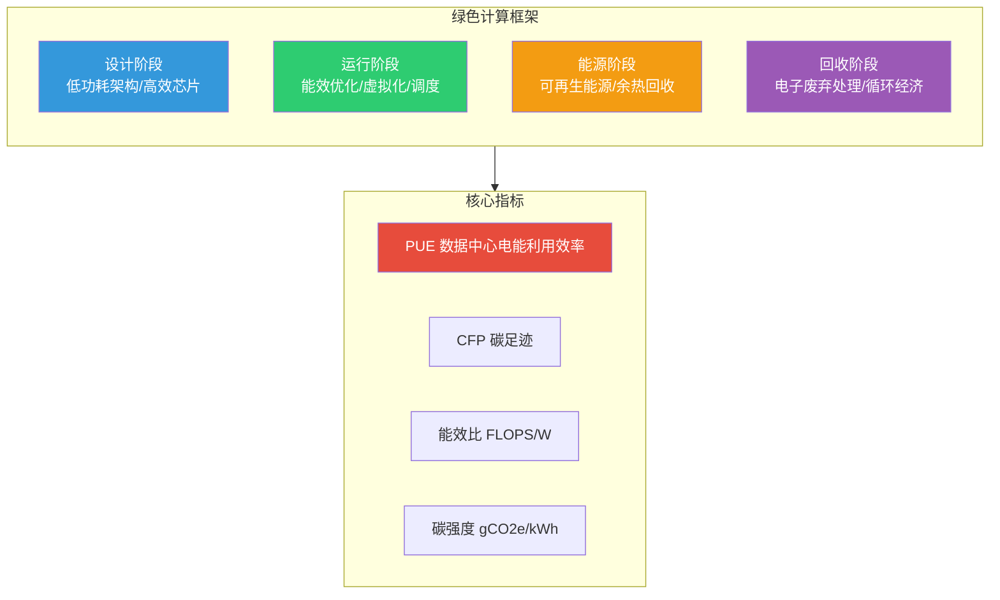
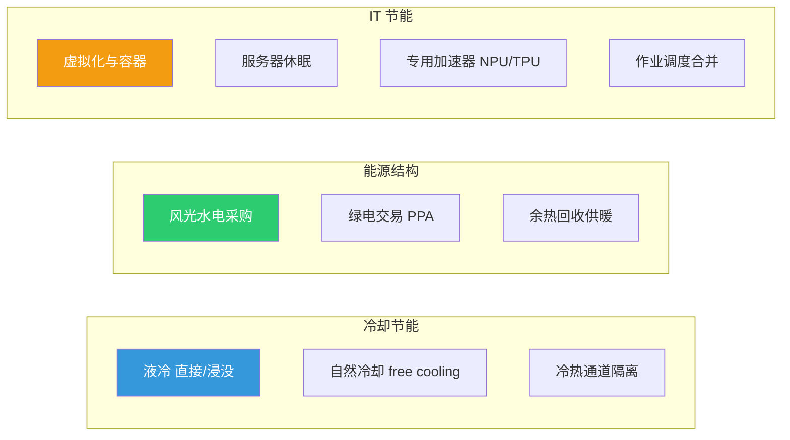
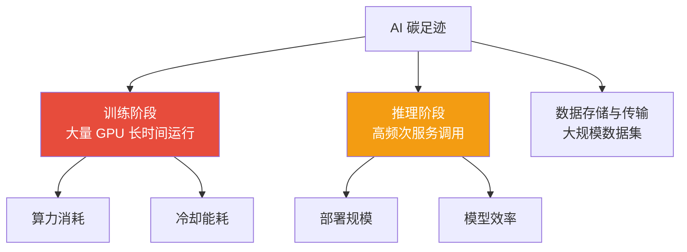
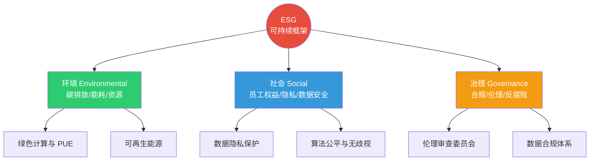

# 10.3 可持续发展与绿色计算

> [!abstract] 本节导读
> 本节解决"前沿技术如何降低能耗与碳排放、实现可持续发展"的问题。从绿色计算的概念与核心目标入手，阐述数据中心能效指标 PUE 与可再生能源应用；进而展开"绿色 AI"在训练与推理阶段降低碳足迹的策略（高效架构、稀疏化、量化、知识蒸馏）；最后论述 ESG 框架与循环经济在 IT 领域的应用。本节承接 [[10.1 技术伦理框架与治理体系]] 与 [[10.2 数据合规与法律法规]] 的治理体系，将环境责任纳入技术决策，与 [[第2章 云计算技术体系/MOC - 第2章]] 的数据中心实践协同。

## 一、绿色计算的概念

绿色计算（Green Computing）是以降低信息技术全生命周期（设计、制造、使用、回收）能耗与环境影响为目标的工程实践与设计哲学。其核心目标是"用更少的能源与资源完成等量或更多的计算"，并在退役阶段减少电子废弃物。



| 维度 | 策略 | 价值 |
|-----|------|------|
| **芯片设计** | 低功耗架构、专用加速器（NPU/TPU） | 提升 FLOPS/W |
| **虚拟化** | 容器、虚拟机、超分 | 提升资源利用率 |
| **调度优化** | 作业合并、休眠、动态频率调节 | 降低空载能耗 |
| **冷却** | 液冷、自然冷却、余热回收 | 降低冷却能耗 |
| **能源** | 可再生能源采购、绿电交易 | 降低碳强度 |

## 二、数据中心能效

数据中心是 IT 能耗的主体，其能效以 PUE（Power Usage Effectiveness）为核心指标。

### 2.1 PUE 定义

PUE = 数据中心总耗电 / IT 设备耗电

$$
\text{PUE} = \frac{\text{Total Facility Power}}{\text{IT Equipment Power}} = 1 + \frac{\text{Non-IT Power (cooling/lighting/UPS)}}{\text{IT Power}}
$$

| PUE 值 | 能效水平 | 含义 |
|--------|---------|------|
| **1.0** | 理论极限 | 全部电能用于 IT 设备，无冷却损耗 |
| **< 1.2** | 优秀 | 大型云厂商先进数据中心 |
| **1.2~1.5** | 良好 | 主流现代化数据中心 |
| **1.5~2.0** | 一般 | 传统数据中心 |
| **> 2.0** | 较差 | 老旧或小型机房 |

> [!important] PUE 的局限
> PUE 仅衡量"非 IT 损耗"占比，不能反映 IT 设备本身的能效。一个 PUE=1.1 的数据中心若 IT 设备能效低下，总能耗仍可能很高。因此需结合"碳利用效率 CUE""能源生产率 ERE"等多指标综合评估。另外，PUE 越接近 1 越好是常识，但"冷却能耗为零"在物理上不可达，先进数据中心通过液冷与自然冷却逼近 1.1。

### 2.2 数据中心节能策略



| 策略 | 节能原理 | 典型效果 |
|-----|---------|---------|
| **液冷** | 液体比热容与导热远高于空气 | 冷却能耗降 30%~50% |
| **自然冷却** | 利用外部低温空气/水冷却 | 寒冷地区年节能 40% |
| **冷热通道隔离** | 防止冷热气流混合 | 提升 10%~15% |
| **可再生能源** | 降低碳强度 | 碳排放降至接近 0 |
| **虚拟化** | 提升服务器利用率 | 减少物理机数量 |
| **专用加速器** | NPU/TPU 能效比通用 CPU 高数十倍 | AI 推理能耗大幅降低 |

## 三、绿色 AI

绿色 AI（Green AI）指在 AI 模型训练与推理中降低能耗与碳排放的实践。随着大模型规模爆炸式增长，AI 碳足迹问题日益突出——训练一个超大模型的碳排放可达数百吨二氧化碳当量。

### 3.1 AI 碳足迹来源



> [!important] 训练 vs 推理的能耗权衡
> 大模型单次训练能耗极高（GPT-3 训练据估算耗电约 190 万千瓦时），但模型一旦训练完成可服务数十亿次推理。从全生命周期看，推理阶段的总能耗可能远超训练——例如一个每天服务 10 亿次的大模型，推理能耗一年可达训练的数倍。因此"绿色 AI"既要优化训练也要优化推理，且推理优化影响更大。

### 3.2 绿色 AI 策略

| 策略 | 原理 | 适用阶段 |
|-----|------|---------|
| **高效架构** | Transformer 替代品（Mamba/RWKV）、稀疏注意力 | 训练 + 推理 |
| **模型压缩** | 剪枝、量化、低秩分解 | 推理 |
| **知识蒸馏** | 大模型蒸馏出小模型 | 推理 |
| **混合精度** | FP16/BF16/INT8 替代 FP32 | 训练 + 推理 |
| **早停与动态推理** | 按输入难度调整计算量 | 推理 |
| **边缘部署** | 推理下沉降低传输能耗 | 推理 |
| **绿电采购** | 训练中心选址于可再生能源富集区 | 训练 |

### 3.3 模型碳足迹估算

模型训练碳排放可粗略估算为：

$$
\text{CO}_2\text{e} = P \times T \times \text{CI}
$$

其中 $P$ 为平均功率（kW），$T$ 为训练时长（h），$\text{CI}$ 为电网碳强度（gCO₂e/kWh）。

| 地区 | 电网碳强度 gCO₂e/kWh（约） | 影响 |
|-----|---------------------------|------|
| 挪威（水电为主） | ~30 | 极低 |
| 法国（核电为主） | ~60 | 低 |
| 中国（煤电占比较高） | ~550 | 较高 |
| 美国（混合） | ~400 | 中等 |

> [!tip] 训练中心选址的绿色意义
> 同样的训练任务，在挪威（水电）训练的碳排放仅为在煤电主导地区的 5% 左右。Google、Microsoft 等公司将训练中心选址于可再生能源富集地区，并按"碳感知调度"把训练任务调度到当前绿电充足的区域，是绿色 AI 的代表性实践。

## 四、ESG 与循环经济

### 4.1 ESG 框架

ESG（Environmental, Social, Governance）是衡量企业可持续发展与社会责任的三大维度框架，被投资者广泛用于评估企业长期价值。



| 维度 | 在技术企业的体现 |
|-----|----------------|
| **E 环境** | 数据中心 PUE、可再生能源占比、设备回收率 |
| **S 社会** | 隐私保护、算法公平、用户权益、员工多元 |
| **G 治理** | 合规体系、伦理委员会、数据治理、反垄断 |

### 4.2 循环经济

循环经济（Circular Economy）以"减量化（Reduce）、再使用（Reuse）、再循环（Recycle）"3R 原则减少资源消耗与废弃物，对抗"获取—制造—废弃"的线性经济。

| 原则 | 在 IT 领域的实践 |
|-----|----------------|
| **Reduce 减量** | 延长设备寿命、按需扩容、虚拟化提升利用率 |
| **Reuse 再用** | 二手服务器再利用、数据中心设备翻新 |
| **Recycle 循环** | 电子废弃物回收、稀有金属回收 |

> [!important] 电子废弃物的挑战
> 全球每年产生超 5000 万吨电子废弃物（e-waste），其中仅约 17% 被正规回收。电子废弃物含铅、汞等重金属，不当处理严重污染环境，又含金、钴、稀土等可回收资源。IT 企业需建立"产品全生命周期责任"（EPR），从设计阶段考虑可回收性，并在退役阶段提供回收服务，这是 ESG 环境维度的硬指标。

## 五、示例：PUE 与碳足迹计算

```python
# 简化演示数据中心 PUE 与模型训练碳足迹计算
# 运行环境：Python 3.10，仅标准库
# 工作目录：任意

def compute_pue(it_power_kw: float, cooling_kw: float,
                lighting_kw: float, ups_loss_kw: float) -> dict:
    """计算 PUE 与各项损耗占比"""
    non_it = cooling_kw + lighting_kw + ups_loss_kw
    total = it_power_kw + non_it
    pue = total / it_power_kw
    return {
        "PUE": round(pue, 3),
        "IT 占比": f"{it_power_kw/total:.1%}",
        "冷却占比": f"{cooling_kw/total:.1%}",
        "UPS 损耗占比": f"{ups_loss_kw/total:.1%}",
    }

def training_carbon(gpu_count: int, gpu_power_w: float,
                    hours: float, carbon_intensity: float) -> dict:
    """估算模型训练碳排放
    carbon_intensity 单位 gCO2e/kWh"""
    energy_kwh = gpu_count * gpu_power_w / 1000 * hours
    carbon_kg = energy_kwh * carbon_intensity / 1000
    return {
        "耗电(kWh)": round(energy_kwh, 1),
        "碳排放(kgCO2e)": round(carbon_kg, 1),
        "碳排放(tCO2e)": round(carbon_kg / 1000, 2),
    }

# 1. PUE 对比：传统风冷 vs 液冷
print("== 传统风冷数据中心 ==")
for k, v in compute_pue(it_power_kw=1000, cooling_kw=600,
                        lighting_kw=50, ups_loss_kw=150).items():
    print(f"  {k}: {v}")
print("== 液冷数据中心 ==")
for k, v in compute_pue(it_power_kw=1000, cooling_kw=150,
                        lighting_kw=50, ups_loss_kw=100).items():
    print(f"  {k}: {v}")

# 2. 训练 GPT-3 规模模型在不同地区的碳足迹
print("\n== 1024 张 A100 训练 30 天 ==")
for region, ci in [("挪威", 30), ("法国", 60), ("美国", 400), ("中国", 550)]:
    r = training_carbon(gpu_count=1024, gpu_power_w=400,
                        hours=30*24, carbon_intensity=ci)
    print(f"  {region}: {r}")

# 关键结论：液冷可把 PUE 从 1.8 降到 1.3；
# 同样训练任务在挪威的碳排放仅为中国的约 5%，
# 训练中心选址与绿电采购是绿色 AI 的关键杠杆。
```

```bash
# 使用 ML CO2 Impact 工具估算模型训练碳足迹（伪流程）
# 工作环境：Python 3.10、codecarbon 库
# 工作目录：项目根目录
pip install codecarbon
# 在训练脚本中嵌入 CarbonTracker，自动记录耗电与碳排放
# from codecarbon import OfflineCarbonTracker; tracker.start()
```

> [!warning] 绿色计算的"漂绿"风险
> 部分企业以"购买碳信用"而非真实减排来标榜碳中和，这属于"漂绿"（greenwashing）。真正可持续的做法是优先自身减排（提升 PUE、用绿电、模型压缩），再以碳信用抵消剩余排放。ESG 评估与第三方审计需区分"实质减排"与"抵消"，避免绿色承诺流于形式。

> [!summary] 本节要点回顾
> 1. **绿色计算**：全生命周期降能耗与环境影响，核心是用更少能源做更多计算
> 2. **PUE**：总耗电/IT 耗电，越接近 1 越优，先进数据中心 < 1.2
> 3. **PUE 局限**：仅衡量非 IT 损耗，需结合 CUE 等多指标
> 4. **节能策略**：液冷、自然冷却、虚拟化、专用加速器、可再生能源
> 5. **绿色 AI**：训练与推理降碳，高效架构 + 压缩 + 蒸馏 + 量化 + 绿电
> 6. **碳足迹**：CO₂e = 功率 × 时长 × 碳强度，选址决定碳强度差异巨大
> 7. **ESG**：环境、社会、治理三维，技术企业需关注 PUE、隐私、伦理、合规
> 8. **循环经济**：3R 原则（减量、再用、循环），对抗电子废弃物
> 9. **反漂绿**：优先自身减排再碳信用抵消

## 关联知识点

| 关联知识点 | 关系 |
|-----------|------|
| [[10.1 技术伦理框架与治理体系]] | 环境责任是技术伦理的延伸 |
| [[10.2 数据合规与法律法规]] | ESG 合规与数据合规协同 |
| [[第2章 云计算技术体系/MOC - 第2章]] | 数据中心能效是云计算的核心场景 |
| [[第4章 人工智能智能赋能技术/4.2 大模型与生成式AI技术]] | 大模型碳足迹是绿色 AI 的焦点 |
| [[第7章 新一代移动通信技术（5G6G）/7.1 5G网络架构与关键技术]] | 5G 能效较 4G 提升 100× |
| [[MOC - 第10章]] | 返回本章导航 |
