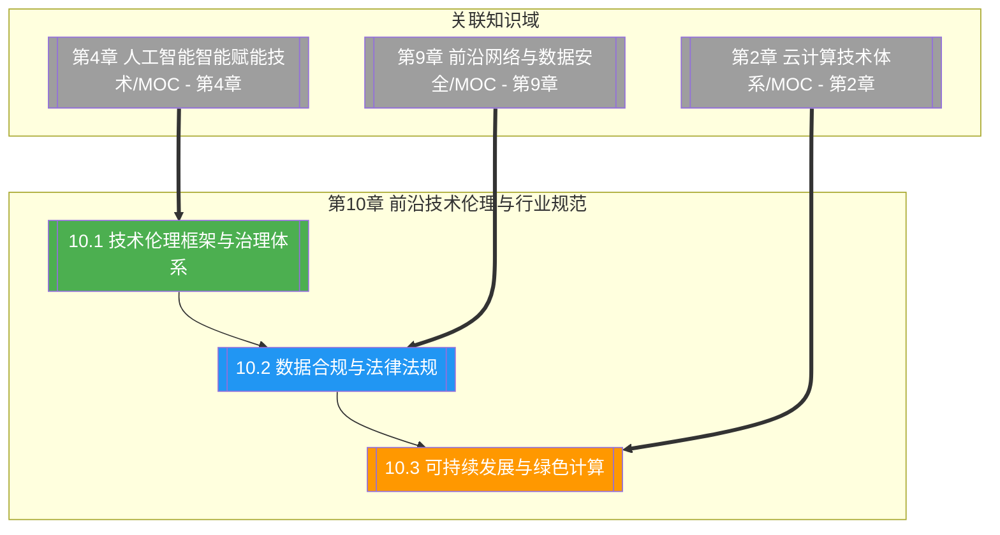

# 第10章 前沿技术伦理与行业规范

> [!abstract] 章节概述
> 本章在 [[1.1 前沿技术定义、特征与技术体系]] 的体系框架下，深入展开"技术伦理与行业规范"这一决定前沿技术能否可持续落地的治理主线。从技术伦理的三大哲学传统（后果主义、义务论、美德伦理）入手，阐述 AI 伦理的公平、透明、可问责、隐私四原则与治理体系；进而展开中外数据合规与法律法规（网络安全法、数据安全法、PIPL、GDPR、CCPA）及跨境传输规则；最后聚焦可持续发展与绿色计算，覆盖数据中心 PUE、绿色 AI、ESG 与循环经济。本章承接 [[第9章 前沿网络与数据安全/MOC - 第9章]] 的安全合规技术基础，将法律、伦理与可持续要求贯穿至工程实践，是本课程的收束章节。

## 学习路线图

## 知识点导航

| 编号 | 知识点 | 核心内容 | 重要程度 |
|-----|--------|---------|---------|
| 10.1 | [[10.1 技术伦理框架与治理体系]] | 伦理三传统、AI 伦理原则、治理体系、伦理审查 | ⭐⭐⭐⭐⭐ |
| 10.2 | [[10.2 数据合规与法律法规]] | 网安法/数安法/PIPL、GDPR/CCPA、跨境、ISO | ⭐⭐⭐⭐⭐ |
| 10.3 | [[10.3 可持续发展与绿色计算]] | 绿色计算、PUE、绿色 AI、ESG、循环经济 | ⭐⭐⭐⭐ |

## 核心概念速览

> [!tip] 本章必须掌握的核心概念
> - **后果主义**：以行为结果的好坏判断道德性（功利主义）
> - **义务论**：以行为本身是否符合道德准则判断（康德）
> - **美德伦理**：以行为者品德与德性为判断核心（亚里士多德）
> - **AI 伦理四原则**：公平、透明、可问责、隐私
> - **技术治理三层**：法律法规强制、行业标准规范、企业自律
> - **伦理审查委员会**：前置评估技术项目伦理风险的机制
> - **网络安全法**：2017 施行，网络运营者安全保护义务
> - **数据安全法**：2021 施行，数据分级分类与重要数据保护
> - **PIPL**：个人信息保护法，2021 施行，知情同意与最小必要
> - **GDPR**：欧盟通用数据保护条例，被遗忘权与数据可携权
> - **CCPA**：加州消费者隐私法，选择退出出售权
> - **跨境传输**：GDPR 充分性/SCC/BCR，PIPL 安全评估/认证/标准合同
> - **ISO 27001**：信息安全管理体系国际标准
> - **ISO 27701**：隐私信息管理体系，27001 的隐私扩展
> - **PUE**：数据中心电能利用效率，越接近 1 越优
> - **绿色 AI**：降低 AI 训练与推理碳排放
> - **ESG**：环境、社会、治理，可持续投资与评估框架
> - **循环经济**：Reduce/Reuse/Recycle 减少电子废弃物

## 核心考点

> [!important] 期末高频考点

| 考点 | 所属知识点 | 考查形式 | 难度 |
|-----|-----------|---------|------|
| 伦理三大传统对比 | 10.1 | 对比题/论述题 | ★★★ |
| AI 伦理四原则 | 10.1 | 简答题/论述题 | ★★★ |
| 技术治理三层体系 | 10.1 | 简答题/论述题 | ★★★★ |
| 伦理审查委员会作用 | 10.1 | 简答题 | ★★★ |
| 网安法/数安法/PIPL 三法关系 | 10.2 | 简答题/论述题 | ★★★★ |
| GDPR 与 PIPL 对比 | 10.2 | 对比题/论述题 | ★★★★ |
| 跨境传输规则 | 10.2 | 简答题/案例分析 | ★★★★ |
| ISO 27001 与 27701 | 10.2 | 简答题 | ★★★ |
| 绿色计算与 PUE | 10.3 | 简答题/计算题 | ★★★ |
| 绿色 AI 与模型碳足迹 | 10.3 | 论述题 | ★★★★ |
| ESG 在技术领域应用 | 10.3 | 论述题 | ★★★ |
| 循环经济与电子废弃 | 10.3 | 简答题 | ★★★ |

## 自测题

> [!question] 章节自测
> 1. 阐述后果主义、义务论、美德伦理三大伦理传统的核心主张与判断标准，并以此分析"自动驾驶电车难题"应如何抉择；说明 AI 伦理的公平、透明、可问责、隐私四原则如何在工程中落地（如偏见检测、模型卡、责任链、差分隐私）。
> 2. 论述中国"网络安全法—数据安全法—个人信息保护法"三法的关系与各自规制重点，对比 GDPR 与 PIPL 在适用范围、同意机制、被遗忘权、跨境传输与处罚力度上的异同，并说明 ISO 27001 与 27701 在合规体系中的作用。
> 3. 阐述绿色计算的概念与核心目标，说明数据中心 PUE 的定义与计算方法，论述"绿色 AI"在训练与推理阶段降低碳足迹的主要策略（高效架构、稀疏化、量化、知识蒸馏、可再生能源），并指出 ESG 框架如何引导企业承担技术责任。
> 4. 以一个"AI 医疗影像诊断系统"为例，设计一个涵盖伦理审查、数据合规与可持续部署的综合方案，说明伦理审查委员会如何前置评估、数据如何分级分类与脱敏跨境、推理服务如何通过边缘部署与模型压缩降低能耗与碳排放。

## 章节导航

| 方向 | 链接 |
|-----|------|
| ⬆ 返回课程总览 | [[MOC - 专业前沿技术]] |
| ⬅ 上一章 | [[第9章 前沿网络与数据安全/MOC - 第9章]] |
| ➡ 课程总览 | [[MOC - 专业前沿技术]] |

## 关联知识

- [[第9章 前沿网络与数据安全/MOC - 第9章]] - 安全合规是伦理治理的法律落地
- [[第4章 人工智能智能赋能技术/MOC - 第4章]] - AI 伦理直接对应大模型与生成式 AI
- [[第2章 云计算技术体系/MOC - 第2章]] - 数据中心能效是绿色计算的核心场景
- [[第3章 大数据前沿技术/MOC - 第3章]] - 数据合规是大数据治理的法定要求
- [[1.1 前沿技术定义、特征与技术体系]] - 技术研判需结合伦理与可持续视角
