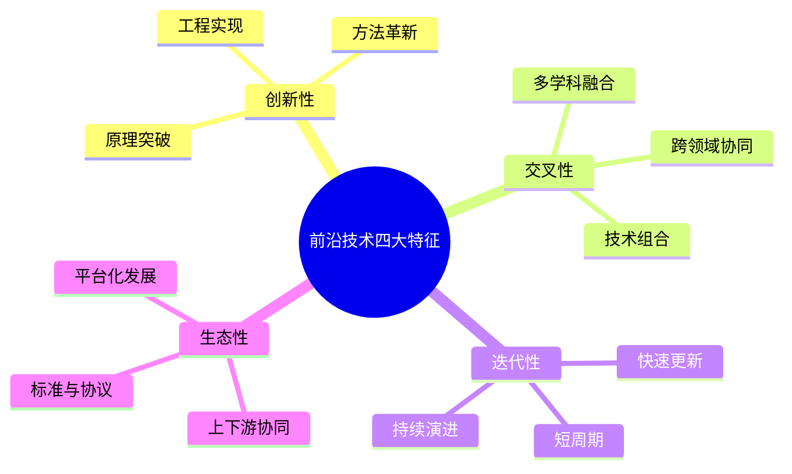
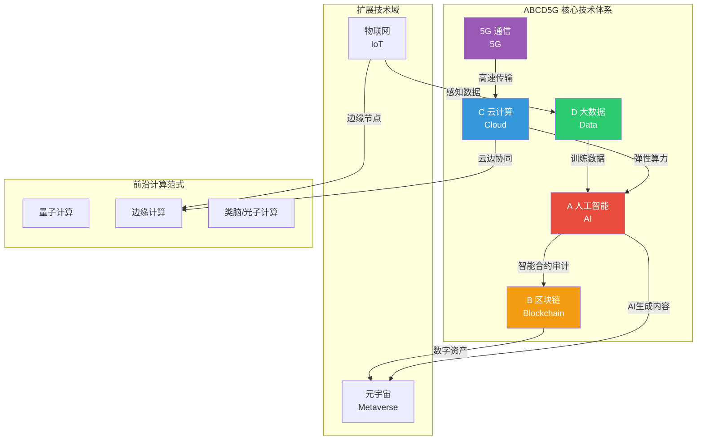
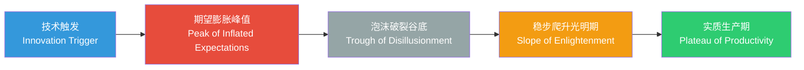
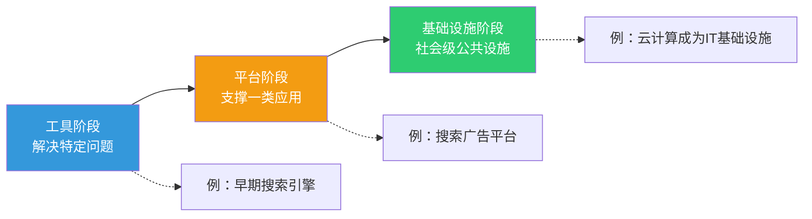

# 1.1 前沿技术定义、特征与技术体系

> [!abstract] 本节导读
> 本节解决"什么是前沿技术、如何识别与分类前沿技术"这一基础问题。从新一代信息技术、颠覆性技术、使能技术三个维度界定前沿技术内涵，提炼其创新性、交叉性、迭代性、生态性四大特征，并以 ABCD5G 体系为核心框架构建技术分类图谱，最后借助 Gartner 技术成熟度曲线建立技术研判的方法论。

## 一、前沿技术的定义

### 1.1.1 三类定义视角

前沿技术（Frontier Technology）并非单一概念，而是从不同维度对处于技术发展前沿、具有变革潜力的技术群体的统称。常见定义分为三类：

| 定义视角 | 英文术语 | 核心内涵 | 典型代表 |
|---------|---------|---------|---------|
| 新一代信息技术 | New Generation IT | 在传统信息技术基础上演进、以数字化智能化为特征的技术集群 | 云计算、大数据、AI、5G、物联网 |
| 颠覆性技术 | Disruptive Technology | 能够从根本上改变现有产业格局、替代既有技术路线的技术 | 大模型AIGC、量子计算、自动驾驶 |
| 使能技术 | Enabling Technology | 作为底层能力支撑多行业多场景应用的技术 | 5G、区块链、云计算、传感器 |

> [!note] 三类定义的关系
> 三类定义并非互斥，而是观察视角的差异：新一代信息技术强调**技术代际**，颠覆性技术强调**产业影响**，使能技术强调**赋能作用**。同一技术可同时归属多类，如 5G 既是新一代信息技术，也是使能技术；大模型既是颠覆性技术，也是新一代信息技术。

### 1.1.2 前沿技术与相关概念辨析

| 概念 | 侧重点 | 与前沿技术关系 |
|-----|--------|--------------|
| 新兴技术（Emerging Technology） | 处于早期发展阶段 | 前沿技术包含部分新兴技术 |
| 高新技术（High-Tech） | 研发投入高、技术密集 | 前沿技术多为高新技术，但反之不必然 |
| 关键技术（Critical Technology） | 对国家/产业安全关键 | 前沿技术中部分被列为关键技术 |

## 二、前沿技术的四大核心特征

> [!important] 前沿技术核心特征

| 特征 | 含义 | 体现 |
|-----|------|------|
| **创新性**（Innovation） | 在原理、方法或工程实现上具有突破 | 量子计算利用叠加态实现并行计算 |
| **交叉性**（Interdisciplinary） | 融合多学科多领域知识 | 元宇宙融合XR、AI、区块链、通信 |
| **迭代性**（Iterative） | 技术快速更新换代，周期短 | 大模型从GPT-1到GPT-4仅约5年 |
| **生态性**（Ecosystem） | 依赖上下游协同形成技术生态 | 云计算依赖芯片、操作系统、应用协同 |

## 三、技术体系分类：ABCD5G + IoT + 元宇宙

### 3.1 ABCD5G 技术体系

ABCD5G 是当前业界对新一代信息技术核心体系的高度概括，五个字母分别代表五大技术域：

| 字母 | 技术域 | 英文全称 | 核心能力 | 本课程章节 |
|-----|--------|---------|---------|-----------|
| **A** | 人工智能 | Artificial Intelligence | 认知、感知、决策、生成 | [[第2章 人工智能与大模型技术/MOC - 第2章]] |
| **B** | 区块链 | Blockchain | 去中心化信任、不可篡改、可追溯 | [[第6章 区块链技术与应用/MOC - 第6章]] |
| **C** | 云计算 | Cloud Computing | 弹性算力、资源共享、按需服务 | [[第4章 云计算与边缘计算技术/MOC - 第4章]] |
| **D** | 大数据 | Data（Big Data） | 海量采集、存储、分析、挖掘 | [[第3章 大数据分析与处理技术/MOC - 第3章]] |
| **5G** | 第五代移动通信 | 5th Generation Mobile Networks | 高带宽、低时延、大连接 | [[第5章 物联网与5G通信技术/MOC - 第5章]] |

### 3.2 扩展技术域

除 ABCD5G 核心体系外，前沿技术还包含两类重要扩展：

- **物联网（IoT, Internet of Things）**：连接物理世界与数字世界的桥梁，负责感知与采集。详见 [[第5章 物联网与5G通信技术/MOC - 第5章]]。
- **元宇宙（Metaverse）**：融合 VR/AR、数字孪生、区块链、AI 的新型互联网形态。详见 [[第7章 元宇宙与数字孪生技术/MOC - 第7章]]。

### 3.3 技术体系图谱

> [!tip] 技术体系理解要点
> ABCD5G 不是孤立技术的简单并列，而是以**数据为血液、算力为骨骼、网络为神经、智能为大脑**的有机整体。其中大数据（D）和云计算（C）提供数据与算力底座，5G 和物联网负责数据采集与传输，人工智能（A）实现数据到智能的转化，区块链（B）保障数据与资产的可信流转。

## 四、Gartner 技术成熟度曲线

### 4.1 曲线五阶段

Gartner 技术成熟度曲线（Hype Cycle）是研判技术发展阶段的经典工具，将技术演进划分为五个阶段：

| 阶段 | 英文名称 | 特征 | 典型行为 |
|-----|---------|------|---------|
| 技术触发期 | Innovation Trigger | 技术概念提出，媒体关注 | 早期概念验证，无成熟产品 |
| 期望膨胀期 | Peak of Inflated Expectations | 过度宣传，期望被放大 | 大量投资涌入，概念泡沫 |
| 泡沫破裂谷底 | Trough of Disillusionment | 实践遇挫，关注度下降 | 部分项目失败，投资收缩 |
| 稳步爬升期 | Slope of Enlightenment | 理性认知，场景聚焦 | 找到最佳实践，二次发展 |
| 实质生产期 | Plateau of Productivity | 规模应用，价值兑现 | 主流采用，产业成熟 |

### 4.2 典型技术研判（参考 2024-2025 年 Gartner 报告）

> [!example] 前沿技术成熟度研判（参考 Gartner Hype Cycle，待核实最新版本）
> - **生成式 AI（Generative AI）**：期望膨胀期峰值附近，正向稳步爬升过渡
> - **元宇宙**：处于泡沫破裂谷底，短期热度下降但长期价值仍在
> - **量子计算**：期望膨胀期，距离实质生产仍需 5-10 年
> - **自动驾驶（L4+）**：稳步爬升期，限定场景已商用
> - **云计算**：实质生产期，已成为主流基础设施

## 五、技术演进规律

### 5.1 从单点到融合

前沿技术演进呈现明显的**从单点技术突破到多技术融合**的规律：

| 演进阶段 | 特征 | 典型代表 |
|---------|------|---------|
| 单点突破 | 单一技术独立发展 | 早期云计算、独立AI模型 |
| 双技术组合 | 两项技术协同 | AI+大数据、云+物联网 |
| 多技术融合 | 三项以上技术深度集成 | 智能制造（AI+IoT+5G+云） |
| 生态级融合 | 跨域全栈融合 | 元宇宙（AI+区块链+XR+5G+云） |

### 5.2 从工具到基础设施

技术角色的演进遵循"**工具→平台→基础设施**"路径：

> [!note] 演进规律的启示
> 技术从工具演进为基础设施后，其价值不再体现在自身，而体现在对上层应用的赋能。判断一项前沿技术是否成熟，关键看它是否已"隐形"为基础设施的一部分。

## 六、小结

> [!summary] 本节要点回顾
> 1. **定义**：前沿技术可从新一代信息技术、颠覆性技术、使能技术三个视角界定，三者观察维度不同但不互斥
> 2. **特征**：创新性、交叉性、迭代性、生态性是前沿技术区别于一般技术的本质标志
> 3. **体系**：ABCD5G（AI、区块链、云计算、大数据、5G）是核心技术体系，物联网和元宇宙是重要扩展
> 4. **研判**：Gartner 技术成熟度曲线提供五阶段技术研判框架，是技术选型与投资决策的参考工具
> 5. **规律**：技术演进遵循从单点到融合、从工具到基础设施的总体趋势

## 关联知识点

| 关联知识点 | 关系 |
|-----------|------|
| [[1.2 新一代信息技术架构与演进规律]] | 本节技术体系在架构层面的展开 |
| [[1.3 前沿技术产业生态与应用场景]] | 本节技术体系在产业层面的落地 |
| [[第2章 人工智能与大模型技术/MOC - 第2章]] | ABCD5G 中 A（AI）的深入展开 |
| [[第4章 云计算与边缘计算技术/MOC - 第4章]] | ABCD5G 中 C（云计算）的深入展开 |
| [[MOC - 第1章]] | 返回本章导航 |
