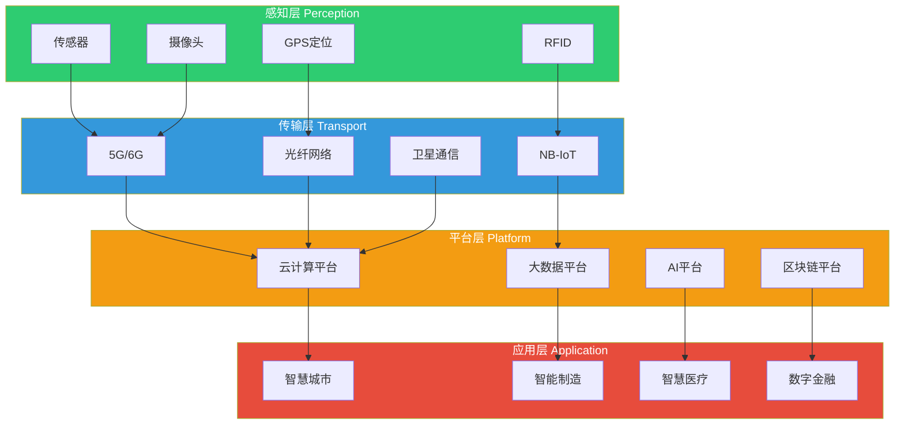
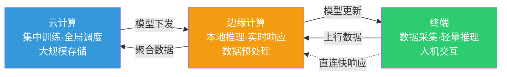
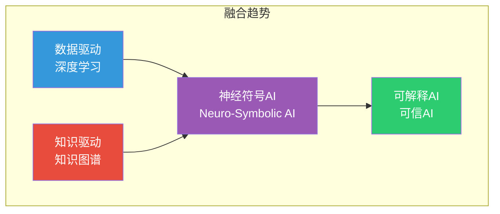
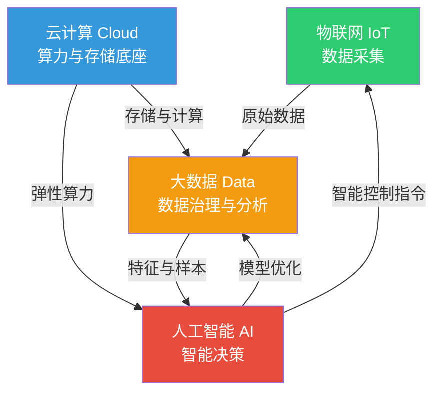
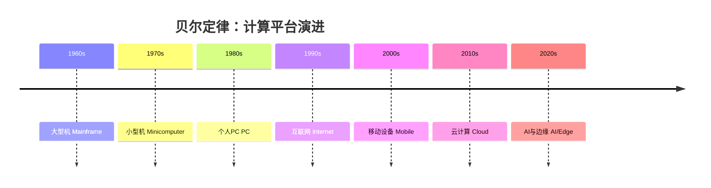

# 1.2 新一代信息技术架构与演进规律

> [!abstract] 本节导读
> 本节解决"前沿技术如何在架构层面组织协同、遵循什么规律演进"的问题。从新一代信息技术四层架构入手，阐述感知、传输、平台、应用各层职责；进而分析云-边-端协同这一新型计算范式，对比数据驱动与知识驱动两种方法论，归纳技术融合趋势；最后以摩尔定律、梅特卡夫定律、贝尔定律揭示信息技术演进的底层规律。

## 一、新一代信息技术四层架构

新一代信息技术采用分层解耦架构，自下而上分为感知层、传输层、平台层、应用层。各层职责明确、通过标准接口协作。

### 各层功能与典型技术

| 层级 | 核心职责 | 典型技术 | 关键指标 |
|-----|---------|---------|---------|
| **感知层** | 采集物理世界数据，实现物物互联 | 传感器、RFID、摄像头、GPS、MEMS | 采样精度、功耗、响应时间 |
| **传输层** | 高效可靠传输数据，连接感知与平台 | 5G/6G、光纤、NB-IoT、LoRa、卫星通信 | 带宽、时延、连接密度 |
| **平台层** | 提供算力、存储、分析与智能能力 | 云计算、大数据平台、AI框架、区块链 | 算力FLOPS、吞吐量、模型精度 |
| **应用层** | 面向行业与用户提供具体服务 | 智慧城市、智能制造、智慧医疗、数字金融 | 用户体验、业务价值 |

> [!note] 四层架构的设计哲学
> 四层架构遵循"**关注点分离**"原则：感知层解决"看得见"，传输层解决"传得快"，平台层解决"算得准"，应用层解决"用得好"。层间通过标准协议（如 MQTT、HTTP、gRPC）解耦，使各层可独立演进。

## 二、云-边-端协同架构

### 2.1 三层计算范式

随着物联网与 5G 发展，单纯云计算已无法满足低时延、大带宽、数据安全的诉求，形成**云-边-端协同**的新型计算架构：

| 层级 | 位置 | 算力 | 时延 | 典型任务 |
|-----|------|------|------|---------|
| **云（Cloud）** | 数据中心 | 强（GPU集群） | 高（10-100ms） | 模型训练、全局调度、大数据分析 |
| **边（Edge）** | 边缘节点/网关 | 中（边缘服务器） | 低（1-10ms） | 本地推理、数据预处理、实时决策 |
| **端（End）** | 终端设备 | 弱（MCU/NPU） | 极低（<1ms） | 数据采集、轻量推理、交互反馈 |

### 2.2 协同优势

> [!important] 云-边-端协同的核心价值
> 1. **降低时延**：边缘就近处理，避免数据往返云端，满足实时性要求（如自动驾驶需 <10ms）
> 2. **节省带宽**：边缘过滤与压缩，仅上传有效数据，降低传输成本
> 3. **数据安全**：敏感数据本地处理，不出边缘节点，满足合规要求
> 4. **弹性扩展**：云端集中训练模型，边缘分布式部署，终端灵活接入

## 三、数据驱动 vs 知识驱动

前沿技术的方法论基础存在数据驱动与知识驱动两条路线，当前趋势是二者融合。

| 维度 | 数据驱动（Data-Driven） | 知识驱动（Knowledge-Driven） |
|-----|----------------------|--------------------------|
| **核心思想** | 从数据中统计学习规律 | 基于专家知识与规则推理 |
| **代表技术** | 深度学习、统计机器学习 | 专家系统、知识图谱、符号推理 |
| **优势** | 自动提取特征，适应复杂场景 | 可解释性强，逻辑透明 |
| **劣势** | 黑箱模型，依赖大量标注数据 | 知识获取瓶颈，泛化能力弱 |
| **适用场景** | 图像识别、NLP、推荐 | 医疗诊断、法律推理、风控规则 |
| **融合方向** | 知识增强的大模型、神经符号计算 |

> [!tip] 当前趋势
> 大模型（如 GPT-4、文心一言）已开始融合数据驱动与知识驱动：以海量数据训练为基础，通过知识图谱增强事实准确性（RAG 检索增强生成），兼具学习能力与可解释性。详见 [[第2章 人工智能与大模型技术/MOC - 第2章]]。

## 四、技术融合趋势

### 4.1 云+AI+大数据+IoT 融合关系

新一代信息技术的核心融合范式为"**云+AI+大数据+IoT**"四位一体：

### 4.2 融合的三个层次

| 融合层次 | 含义 | 典型案例 |
|---------|------|---------|
| **数据融合** | 多源异构数据汇聚与治理 | 工业物联网多传感器数据融合 |
| **平台融合** | 技术栈在平台层集成 | 云原生AI开发平台（如ModelArts） |
| **应用融合** | 多技术联合解决业务问题 | 智慧交通（5G+AI+云+大数据+IoT） |

## 五、技术演进三大定律

新一代信息技术的演进遵循三条经典经验定律，理解这些定律有助于把握技术发展趋势。

### 5.1 摩尔定律（Moore's Law）

> [!important] 摩尔定律
> 集成电路上可容纳的晶体管数目约每 **18-24 个月**翻一番，性能提升一倍，而成本下降一半。

$$
\text{性能}(t) = \text{性能}_0 \times 2^{\,t / 1.5}, \quad t \text{ 为年数}
$$

- **提出者**：Gordon Moore（英特尔创始人），1965 年
- **影响**：驱动算力持续增长，是云计算、AI 大规模发展的硬件基础
- **现状**：随工艺逼近物理极限（3nm 以下），摩尔定律趋缓，产业转向架构创新（如 NPU、Chiplet）

### 5.2 梅特卡夫定律（Metcalfe's Law）

> [!important] 梅特卡夫定律
> 网络的价值与网络节点数的**平方**成正比。

$$
V \propto N^2, \quad N \text{ 为网络节点数}
$$

- **提出者**：Robert Metcalfe（以太网发明者），约 1980 年
- **影响**：解释了互联网、社交网络、物联网的网络效应；节点越多价值越大
- **应用**：5G 与物联网的大规模连接使网络价值呈指数增长

### 5.3 贝尔定律（Bell's Law）

> [!important] 贝尔定律
> 大约每 **10 年**出现一代新的计算平台，形成新的计算范式。

| 年代 | 计算平台 | 主导范式 |
|-----|---------|---------|
| 1960s | 大型机 | 集中式计算 |
| 1970s | 小型机 | 分时计算 |
| 1980s | 个人PC | 桌面计算 |
| 1990s | 互联网 | 网络计算 |
| 2000s | 移动设备 | 移动计算 |
| 2010s | 云计算 | 云端计算 |
| 2020s | AI/边缘 | 智能泛在计算 |

> [!note] 三大定律的协同
> 摩尔定律提供算力基础，梅特卡夫定律驱动网络连接扩张，贝尔定律刻画平台代际跃迁。三者共同解释了信息技术从单机到网络、从集中到分布、从计算到智能的演进逻辑。

## 六、小结

> [!summary] 本节要点回顾
> 1. **四层架构**：感知层采集、传输层传输、平台层计算、应用层服务，层间解耦独立演进
> 2. **云边端协同**：云端训练、边缘推理、终端感知，兼顾时延、带宽与安全
> 3. **方法论**：数据驱动与知识驱动各有优劣，当前走向神经符号融合
> 4. **技术融合**：云+AI+大数据+IoT 四位一体，分数据、平台、应用三个层次融合
> 5. **演进定律**：摩尔定律（算力）、梅特卡夫定律（网络）、贝尔定律（平台）共同驱动技术演进

## 关联知识点

| 关联知识点 | 关系 |
|-----------|------|
| [[1.1 前沿技术定义、特征与技术体系]] | 本节架构是技术体系的组织方式 |
| [[1.3 前沿技术产业生态与应用场景]] | 本节架构在产业场景中的落地 |
| [[第4章 云计算与边缘计算技术/MOC - 第4章]] | 云-边-端协同的深入展开 |
| [[第5章 物联网与5G通信技术/MOC - 第5章]] | 感知层与传输层的深入展开 |
| [[MOC - 第1章]] | 返回本章导航 |
