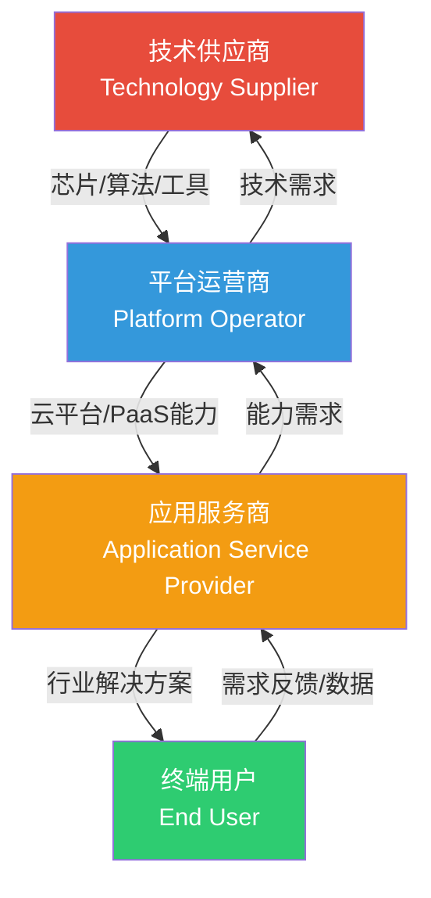
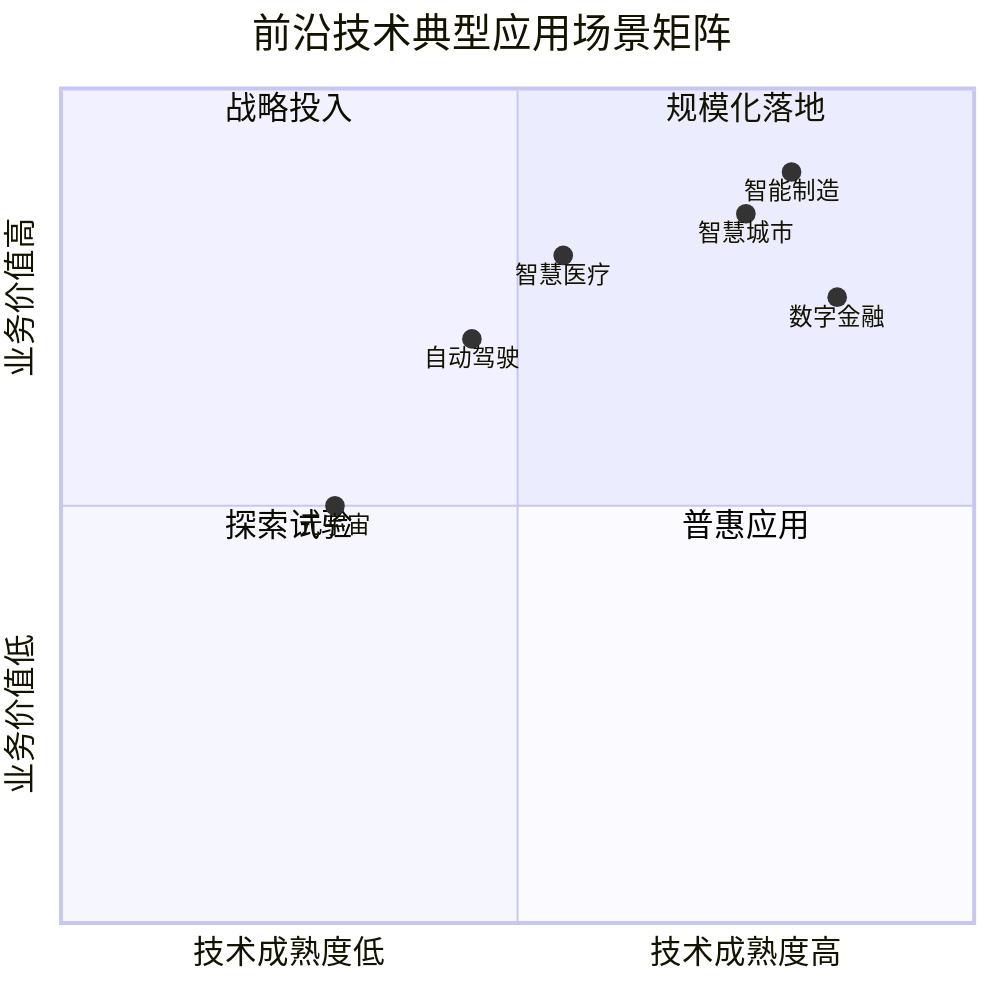
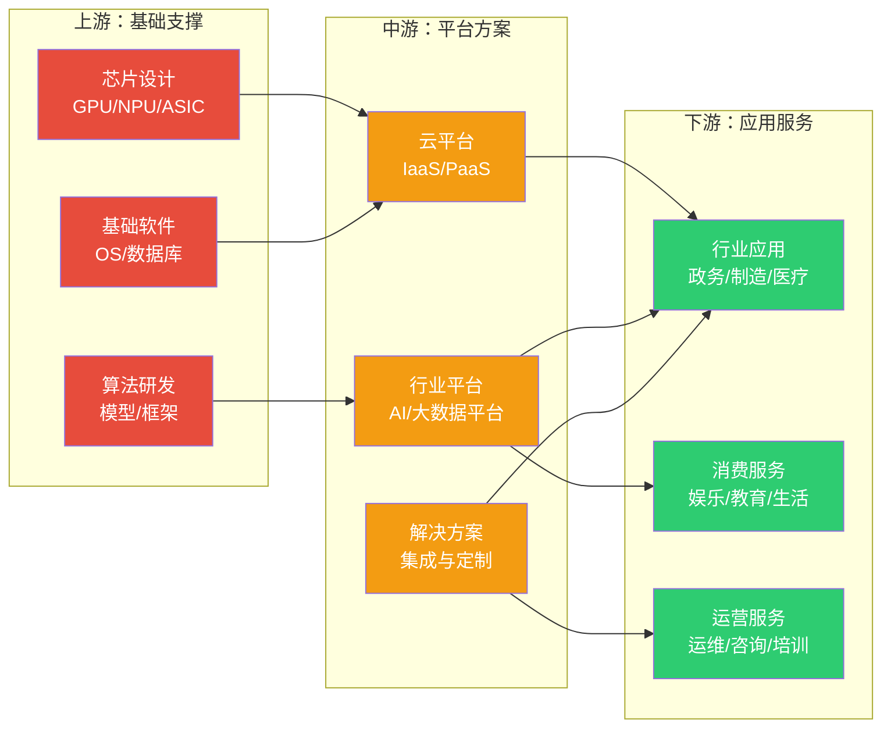
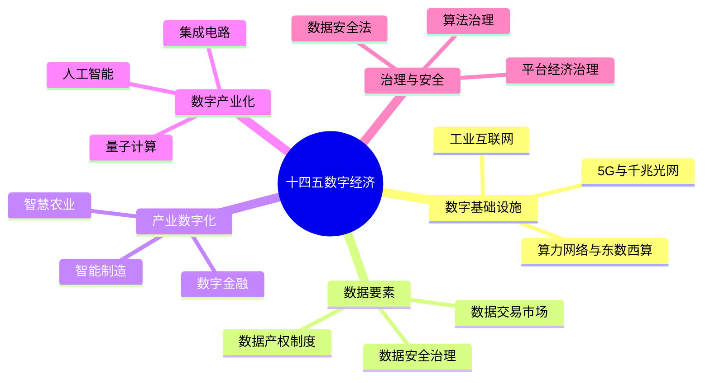

# 1.3 前沿技术产业生态与应用场景

> [!abstract] 本节导读
> 本节解决"前沿技术如何在产业中组织、落地到哪些场景"的问题。从产业生态四类参与者入手，分析技术供应商、平台运营商、应用服务商与终端用户的角色与价值链；进而梳理产业链上中下游分工，结合智慧城市、智能制造、智慧医疗、数字金融四大典型场景说明技术落地路径；最后以中国"十四五"数字经济发展规划为例阐述产业政策导向。

## 一、产业生态参与者

前沿技术产业生态由四类核心参与者构成，形成"技术供给—平台运营—应用服务—终端消费"的价值链条。

### 各参与者定位

| 参与者 | 核心定位 | 典型代表 | 价值贡献 |
|-------|---------|---------|---------|
| **技术供应商** | 提供底层芯片、算法、开发工具 | 英伟达、AMD、华为海思、OpenAI | 算力与算法基础 |
| **平台运营商** | 构建云平台与PaaS能力 | AWS、阿里云、腾讯云、华为云 | 资源调度与开发者服务 |
| **应用服务商** | 面向行业提供解决方案 | 商汤、海康、用友、东软 | 行业定制与交付 |
| **终端用户** | 消费前沿技术服务 | 政府、企业、个人 | 需求驱动与数据反馈 |

> [!note] 生态协同关系
> 四类参与者并非简单线性链，而是形成**双向反馈循环**：终端用户的需求驱动应用服务商创新，应用服务商的能力需求反推平台运营商升级，平台运营商的技术需求牵引技术供应商研发。数据与价值在全链路流动。

## 二、典型应用场景

### 2.1 应用场景矩阵

前沿技术在四大典型场景中呈现"技术组合—业务价值"的映射关系：

### 2.2 四大场景详解

#### 智慧城市

| 技术组合 | 应用方向 | 价值 |
|---------|---------|------|
| IoT + 5G + 大数据 | 城市感知与交通调度 | 提升治理效率 |
| AI + 云计算 | 安防监控与应急响应 | 降低安全隐患 |
| 区块链 | 政务数据共享与存证 | 数据可信流转 |

#### 智能制造

| 技术组合 | 应用方向 | 价值 |
|---------|---------|------|
| IoT + 边缘计算 | 设备状态监测与预测性维护 | 降低停机损失 |
| AI + 大数据 | 质量检测与工艺优化 | 提升良品率 |
| 数字孪生 + 5G | 产线仿真与远程运维 | 缩短试产周期 |

#### 智慧医疗

| 技术组合 | 应用方向 | 价值 |
|---------|---------|------|
| AI + 大数据 | 医学影像辅助诊断 | 提高诊断效率 |
| 5G + 云计算 | 远程手术与会诊 | 优质资源下沉 |
| 区块链 | 电子病历共享与药品溯源 | 数据安全合规 |

#### 数字金融

| 技术组合 | 应用方向 | 价值 |
|---------|---------|------|
| AI + 大数据 | 智能风控与反欺诈 | 降低坏账率 |
| 区块链 + 云计算 | 跨境支付与供应链金融 | 信任与效率提升 |
| 大模型 | 智能客服与投顾 | 降低运营成本 |

> [!example] 技术组合规律
> 四大场景的共同规律是"**感知（IoT/5G）→ 计算（云/AI）→ 信任（区块链）**"三位一体。不同场景的差异在于技术权重：智慧城市重感知，智能制造重边缘，智慧医疗重AI，数字金融重区块链。

## 三、产业链分析

前沿技术产业链分为上游、中游、下游三层，各层承担不同价值环节：

### 产业链各层对比

| 层级 | 核心环节 | 价值特点 | 竞争焦点 |
|-----|---------|---------|---------|
| **上游** | 芯片、算法、基础软件 | 技术壁垒高、投入大、周期长 | 制程工艺、生态绑定 |
| **中游** | 云平台、行业平台、解决方案 | 规模效应强、平台化 | 生态规模、行业Know-how |
| **下游** | 行业应用、消费服务、运营服务 | 贴近用户、差异化强 | 场景理解、用户体验 |

> [!important] 产业链价值分布
> 前沿技术产业链呈现"**微笑曲线**"特征：上游（芯片/算法）与下游（应用/服务）附加值高，中游（平台/集成）附加值相对较低但规模效应显著。中国在前沿技术产业链中，中游平台层（如阿里云、华为云）已具全球竞争力，上游芯片层（如华为海思、寒武纪）正在突破，下游应用层场景丰富。

## 四、产业政策与发展规划

### 4.1 中国"十四五"数字经济发展规划

中国《"十四五"数字经济发展规划》（2021年12月发布）是指导前沿技术产业发展的纲领性文件，核心目标与重点方向如下：

| 维度 | 2025年目标 | 重点方向 |
|-----|-----------|---------|
| **数字经济规模** | 占GDP比重达10% | 数字产业化与产业数字化双轮驱动 |
| **数字基础设施** | 5G普及与千兆光网覆盖 | 算力网络、工业互联网、物联网 |
| **数据要素市场** | 建立数据要素流通体系 | 数据产权、交易、治理、安全 |
| **产业数字化转型** | 制造业数字化普及 | 智能制造、智慧农业、数字金融 |
| **数字技术攻关** | 突破关键核心技术 | AI、量子计算、集成电路、区块链 |

### 4.2 重点政策方向

> [!note] "东数西算"工程
> "东数西算"是中国数字基础设施的标志性工程，将东部算力需求引导至西部可再生能源丰富地区，构建全国一体化算力网络。其本质是通过**云-边-端协同**的跨区域布局，平衡算力供需与能耗成本。详见 [[第4章 云计算与边缘计算技术/MOC - 第4章]]。

## 五、小结

> [!summary] 本节要点回顾
> 1. **生态参与者**：技术供应商、平台运营商、应用服务商、终端用户四类，形成双向反馈价值链
> 2. **应用场景**：智慧城市、智能制造、智慧医疗、数字金融为四大典型场景，遵循"感知→计算→信任"技术组合规律
> 3. **产业链**：上中下游三层分工，呈微笑曲线特征，中国在中游平台层具备竞争力
> 4. **产业政策**：十四五规划以数字基础设施、数据要素、产业数字化、数字产业化为重点方向
> 5. **工程实践**：东数西算是云-边-端协同的国家级实践

## 关联知识点

| 关联知识点 | 关系 |
|-----------|------|
| [[1.1 前沿技术定义、特征与技术体系]] | 本节场景是技术体系的具体落地 |
| [[1.2 新一代信息技术架构与演进规律]] | 本节产业生态基于四层架构组织 |
| [[第2章 人工智能与大模型技术/MOC - 第2章]] | 智慧医疗、智能制造中AI的深入 |
| [[第4章 云计算与边缘计算技术/MOC - 第4章]] | 东数西算与云边端协同的深入 |
| [[第6章 区块链技术与应用/MOC - 第6章]] | 数字金融中区块链的深入 |
| [[MOC - 第1章]] | 返回本章导航 |
