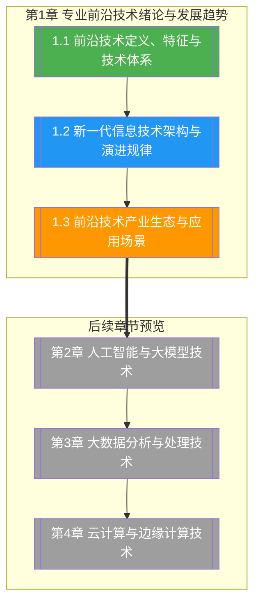

# 第1章 专业前沿技术绪论与发展趋势

> [!abstract] 章节概述
> 本章是专业前沿技术课程的开篇，系统阐述前沿技术的定义、核心特征与技术体系分类，梳理新一代信息技术的四层架构与演进规律，并从产业生态与应用场景维度建立全局视角。通过本章学习，读者可形成对 ABCD5G 技术体系的整体认知，为后续各技术域的深入学习奠定框架基础。

## 学习路线图

## 知识点导航

| 编号 | 知识点 | 核心内容 | 重要程度 |
|-----|--------|---------|---------|
| 1.1 | [[1.1 前沿技术定义、特征与技术体系]] | 前沿技术定义、四大特征、ABCD5G体系、Gartner曲线 | ⭐⭐⭐⭐⭐ |
| 1.2 | [[1.2 新一代信息技术架构与演进规律]] | 四层架构、云边端协同、技术融合、三大定律 | ⭐⭐⭐⭐⭐ |
| 1.3 | [[1.3 前沿技术产业生态与应用场景]] | 产业生态、产业链、典型场景、十四五规划 | ⭐⭐⭐⭐ |

## 核心概念速览

> [!tip] 本章必须掌握的核心概念
> - **前沿技术（Frontier Technology）**：新一代信息技术、颠覆性技术与使能技术的统称
> - **四大特征**：创新性、交叉性、迭代性、生态性
> - **ABCD5G 体系**：AI（人工智能）、Blockchain（区块链）、Cloud（云计算）、Data（大数据）、5G（通信）
> - **Gartner 技术成熟度曲线**：技术触发期→期望膨胀期→泡沫破裂谷底→稳步爬升期→实质生产期
> - **新一代信息技术四层架构**：感知层、传输层、平台层、应用层
> - **云-边-端协同**：云计算集中训练、边缘计算本地推理、终端感知交互的协同范式
> - **三大演进定律**：摩尔定律、梅特卡夫定律、贝尔定律

## 核心考点

> [!important] 期末高频考点

| 考点 | 所属知识点 | 考查形式 | 难度 |
|-----|-----------|---------|------|
| 前沿技术的三类定义与区别 | 1.1 | 简答题/选择题 | ★★ |
| 前沿技术四大特征及含义 | 1.1 | 简答题 | ★★ |
| ABCD5G 技术体系组成与对应技术 | 1.1 | 填空题/选择题 | ★★★ |
| Gartner 曲线五阶段及技术研判 | 1.1 | 论述题/案例分析 | ★★★ |
| 新一代信息技术四层架构及各层功能 | 1.2 | 简答题/论述题 | ★★★ |
| 云-边-端协同架构原理与优势 | 1.2 | 简答题/案例分析 | ★★★★ |
| 摩尔定律、梅特卡夫定律、贝尔定律 | 1.2 | 填空题/简答题 | ★★ |
| 前沿技术产业链上中下游分析 | 1.3 | 论述题/案例分析 | ★★★ |
| 十四五数字经济发展规划要点 | 1.3 | 选择题/简答题 | ★★ |

## 自测题

> [!question] 章节自测
> 1. 阐述前沿技术中"新一代信息技术""颠覆性技术""使能技术"三类定义的内涵，并各举一例说明其区别。
> 2. 绘制新一代信息技术四层架构图，说明感知层、传输层、平台层、应用层各自的功能与典型技术，并解释云-边-端协同如何贯穿这四层。
> 3. 利用 Gartner 技术成熟度曲线，分析当前大模型（LLM）、元宇宙、量子计算三项技术分别处于哪个阶段，并说明判断依据。
> 4. 结合中国"十四五"数字经济发展规划，分析前沿技术产业生态中技术供应商、平台运营商、应用服务商与终端用户各自的定位与价值。

## 章节导航

| 方向 | 链接 |
|-----|------|
| ⬆ 返回课程总览 | [[MOC - 专业前沿技术]] |
| ⬅ 上一章 | （课程开篇） |
| ➡ 下一章 | [[第2章 人工智能与大模型技术/MOC - 第2章]] |
