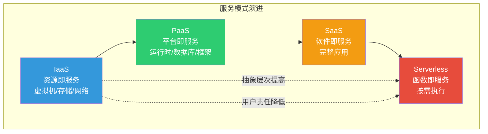
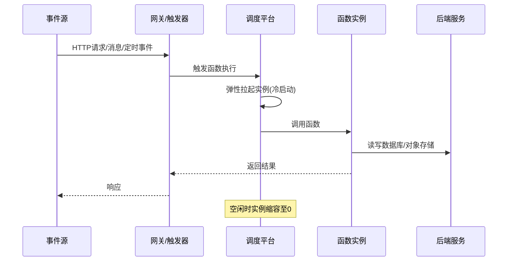
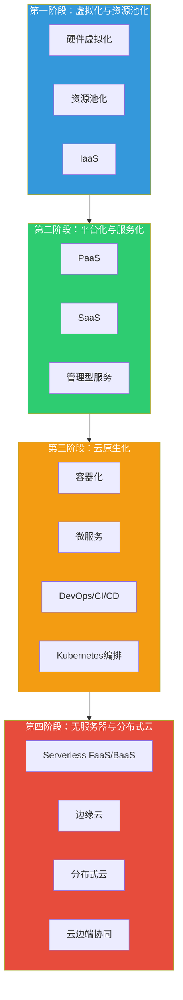

# 2.1 云计算架构与服务模式演进

> [!abstract] 本节导读
> 本节解决"云计算架构如何从基础资源服务演进到云原生与无服务器范式"的问题。先回顾 IaaS/PaaS/SaaS 三种服务模式及其演进逻辑，再深入云原生架构的四大核心要素（容器、微服务、DevOps、CI/CD），进而分析 Serverless 的 FaaS 与 BaaS 模型，最后讨论多云与混合云策略。理解这一演进脉络是把握云计算从"资源上云"走向"应用云原生化"的关键。

## 一、云计算架构回顾：IaaS/PaaS/SaaS 演进

### 1.1 三种服务模式

云计算通过按需自助服务、广泛网络访问、资源池化、快速弹性、可计量服务五大特征（NIST 定义）向用户提供能力。其服务模式自下而上分为三层：

| 服务模式 | 英文全称 | 用户获得 | 用户负责 | 典型产品 |
|---------|---------|---------|---------|---------|
| **IaaS** | Infrastructure as a Service | 虚拟机、存储、网络等基础资源 | 操作系统、中间件、应用 | AWS EC2、阿里云 ECS、OpenStack |
| **PaaS** | Platform as a Service | 运行时、数据库、开发框架 | 应用代码与数据 | Heroku、Google App Engine、云函数 |
| **SaaS** | Software as a Service | 完整可用的应用 | 仅使用与配置 | Salesforce、Office 365、钉钉 |

> [!note] 共享责任模型
> 服务模式越往上，云服务商承担的责任越多，用户关注点越聚焦于业务。IaaS 用户需自行管理操作系统及以上全部栈；SaaS 用户几乎只需关注使用。这一"责任上移"正是云服务演进的核心驱动力之一。

### 1.2 服务模式演进逻辑

演进的内在逻辑是**抽象层次不断提高、用户责任不断降低**：从管理硬件资源，到管理运行平台，到直接使用软件，再到仅编写函数逻辑。每次抽象提升都让开发者更聚焦业务本身。

## 二、云原生架构

云原生（Cloud Native）是构建和运行云上应用的一套方法论与技术体系的统称，由 CNCF（Cloud Native Computing Foundation）倡导。其目标是以容器、微服务、DevOps、持续交付为核心，构建松耦合、可弹性、可观测、可移植的应用系统。

### 2.1 云原生四大核心要素

> [!important] 云原生核心特征

| 要素 | 英文 | 含义 | 代表技术 |
|-----|------|------|---------|
| **容器** | Container | 将应用与依赖打包为标准化可移植单元 | Docker、containerd |
| **微服务** | Microservices | 将单体应用拆分为独立部署的小型服务 | Spring Cloud、Dubbo |
| **DevOps** | DevOps | 开发与运维一体化，自动化协作 | GitLab CI、Jenkins |
| **持续交付** | CI/CD | 持续集成与持续交付，频繁可靠发布 | ArgoCD、Tekton |

### 2.2 单体架构与微服务架构对比

| 维度 | 单体架构 | 微服务架构 |
|-----|---------|-----------|
| 部署单元 | 单一 WAR/JAR 包 | 多个独立服务 |
| 技术栈 | 统一技术栈 | 各服务可异构 |
| 扩展方式 | 整体水平扩展 | 按服务独立扩展 |
| 故障影响 | 局部故障可能拖垮整体 | 故障可被隔离在单服务内 |
| 运维复杂度 | 低 | 高（需服务发现、配置中心、链路追踪） |

> [!tip] 何时采用微服务
> 微服务并非银弹。团队规模小、业务复杂度低时，单体架构更高效；当团队扩张、业务领域边界清晰、需要独立扩展与故障隔离时，微服务才显现价值。过早微服务化会引入分布式系统的全部复杂度。

### 2.3 DevOps 与 CI/CD 流水线

DevOps 通过文化、实践与工具打破开发与运维壁垒，CI/CD 是其工程落地的核心：

- **CI（Continuous Integration，持续集成）**：开发人员频繁将代码合并到主干，每次合并自动触发构建与单元测试，尽早发现集成问题。
- **CD（Continuous Delivery/Deployment，持续交付/部署）**：将持续集成的产物自动部署到测试、预发乃至生产环境，实现小步快跑、可回滚的发布。

## 三、Serverless 计算

Serverless（无服务器）并非"没有服务器"，而是将服务器 provision（供应）、扩缩容、运维等责任完全交给云平台，开发者只需编写业务逻辑，按实际执行次数与资源消耗计费。

### 3.1 两种形态：FaaS 与 BaaS

| 形态 | 英文全称 | 含义 | 典型产品 |
|-----|---------|------|---------|
| **FaaS** | Function as a Service | 函数即服务，开发者上传函数，由事件触发执行 | AWS Lambda、阿里云函数计算、Azure Functions |
| **BaaS** | Backend as a Service | 后端即服务，提供认证、存储、数据库等后端能力 API | Firebase、AWS Amplify、Supabase |

### 3.2 Serverless 工作机制

### 3.3 Serverless 优势与局限

> [!example] Serverless 适用与不适用场景
> - **适用**：事件驱动、突发流量、短时任务，如图片处理、Webhook、IoT 数据预处理、定时批处理
> - **不适用**：长连接、高稳态负载、强依赖本地状态的服务，如数据库、视频流媒体转码常驻服务

| 优势 | 局限 |
|-----|------|
| 按需计费，零运行成本 | 冷启动时延（毫秒至秒级） |
| 自动弹性，无需容量规划 | 有状态管理困难 |
| 运维负担极低 | 厂商绑定（厂商 API 不一致） |
| 天生事件驱动 | 长时任务受执行时长上限约束 |

## 四、多云与混合云策略

### 4.1 部署模式演进

| 模式 | 定义 | 适用场景 |
|-----|------|---------|
| **公有云** | 云服务商向公众提供资源共享服务 | 互联网业务、初创公司 |
| **私有云** | 单一组织专属的云基础设施 | 政企核心系统、强合规 |
| **混合云** | 公有云与私有云组合，可通过专线打通 | 核心数据私有、弹性业务上公有 |
| **多云** | 同时使用多家公有云服务商 | 避免厂商锁定、全球部署、容灾 |

### 4.2 多云/混合云的动机与挑战

> [!important] 采用多云/混合云的核心动机
> 1. **避免厂商锁定**：关键能力跨云可迁移，议价能力强
> 2. **合规与数据主权**：敏感数据留在私有云/本地，普通业务上公有云
> 3. **容灾与高可用**：跨云异地多活，单云故障不影响整体
> 4. **全球部署与就近访问**：利用不同云在不同区域的节点覆盖

挑战主要在于：跨云 API 与服务差异、数据一致性与传输成本、统一监控运维、安全策略统一。这正是 Kubernetes 与云原生技术成为跨云事实标准的重要原因——通过容器与编排屏蔽底层差异。

## 五、云计算架构演进总览

> [!summary] 本节要点回顾
> 1. **服务模式演进**：IaaS→PaaS→SaaS→Serverless，抽象层次提高、用户责任降低，驱动力是聚焦业务
> 2. **云原生**：以容器、微服务、DevOps、CI/CD 为核心，构建可弹性、可移植、可观测的云上应用范式
> 3. **Serverless**：FaaS 处理事件驱动函数逻辑，BaaS 提供后端能力 API，实现按需计费与零运维，但受冷启动与状态管理局限
> 4. **多云/混合云**：以避免厂商锁定、合规、容灾为核心动机，云原生技术成为跨云事实标准
> 5. **演进规律**：从资源池化→平台服务化→应用云原生化→无服务器与分布式云，云能力持续向边缘延伸

## 关联知识点

| 关联知识点 | 关系 |
|-----------|------|
| [[2.2 云原生技术栈与容器编排]] | 本节云原生要素的技术栈深入展开 |
| [[2.3 边缘云与分布式云架构]] | 本节分布式云与边缘云的方向延伸 |
| [[人工智能与前沿技术/云计算技术/MOC - 云计算技术]] | 云计算技术体系的单科深入课程 |
| [[人工智能与前沿技术/云计算技术/知识点/第1章 云计算基础概论/1.2 云计算服务模式：IaaS_PaaS_SaaS]] | IaaS/PaaS/SaaS 的基础定义 |
| [[人工智能与前沿技术/云计算技术/知识点/第10章 主流云平台与云原生技术/10.2 云原生技术体系]] | 云原生技术体系的深入展开 |
| [[1.2 新一代信息技术架构与演进规律]] | 云-边-端协同框架的来源 |
| [[MOC - 第2章]] | 返回本章导航 |
