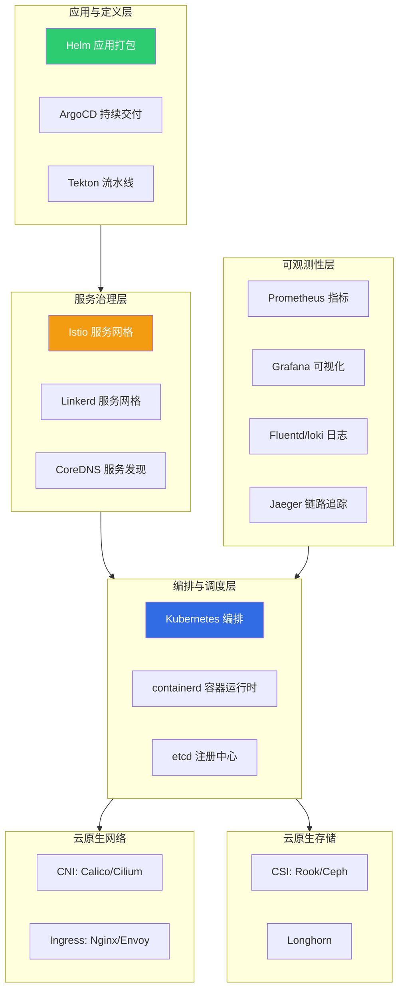
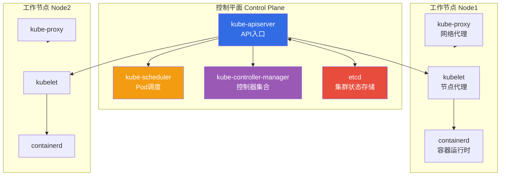
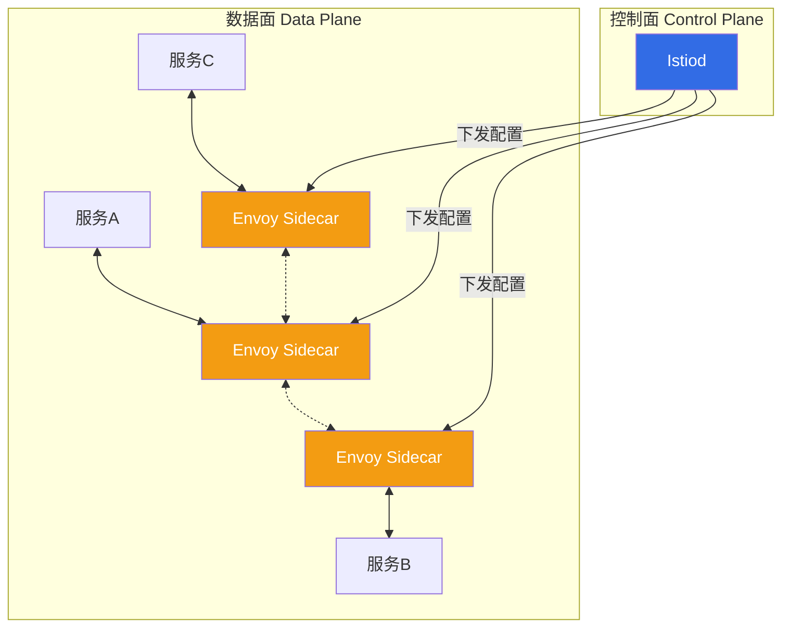

# 2.2 云原生技术栈与容器编排

> [!abstract] 本节导读
> 本节解决"云原生应用如何被标准化构建、编排与治理"的问题。从 CNCF 全景图入手，梳理云原生技术栈的分层结构；以 Kubernetes 为核心阐述容器编排的标准范式与关键组件；进而分析 Service Mesh 如何解耦服务间通信治理；最后覆盖云原生存储与网络。本节是云原生工程实践的核心，理解 K8s 与 Service Mesh 是把握现代云架构的关键。

## 一、CNCF 全景图概览

CNCF（Cloud Native Computing Foundation，云原生计算基金会）是 Linux 基金会下的子基金会，致力于云原生技术的标准化与生态建设。CNCF Landscape（全景图）按功能将云原生项目分为多个领域，并按成熟度分为 Graduated（毕业）、Incubating（孵化）、Sandbox（沙箱）三级。

### 1.1 CNCF 技术栈分层



### 1.2 项目成熟度分级

| 级别 | 含义 | 代表项目 |
|-----|------|---------|
| **Graduated** | 毕业项目，广泛生产验证、治理成熟 | Kubernetes、Prometheus、Envoy、containerd、etcd |
| **Incubating** | 孵化项目，已被采用但生态待完善 | Istio、Cilium、Argo、Linkerd |
| **Sandbox** | 沙箱项目，早期探索 | 大量新兴项目 |

> [!tip] CNCF 生态的核心地位
> CNCF 已成为云原生事实标准。Graduated 项目（Kubernetes、Prometheus、Envoy 等）几乎构成所有云原生平台的底层骨架。掌握 CNCF 全景图有助于在选型时快速定位成熟方案。

## 二、Kubernetes 容器编排标准

Kubernetes（简称 K8s）是 Google 基于 Borg 系统开源的容器编排系统，现已成为容器编排的事实标准。其核心能力包括：自动调度、弹性伸缩、自愈滚动升级、服务发现与负载均衡、配置与密钥管理。

### 2.1 K8s 架构与核心组件



| 组件 | 角色 | 职责 |
|-----|------|------|
| kube-apiserver | 控制平面 | 集群统一 API 入口，所有组件经它通信 |
| etcd | 控制平面 | 强一致 KV 存储，保存集群全部状态 |
| kube-scheduler | 控制平面 | 根据资源、亲和性等策略为 Pod 选择节点 |
| kube-controller-manager | 控制平面 | 运行副本、节点、端点等控制器，维持期望状态 |
| kubelet | 工作节点 | 管理本节点 Pod 生命周期，上报状态 |
| kube-proxy | 工作节点 | 维护服务转发规则，实现服务发现与负载均衡 |
| containerd | 工作节点 | 容器运行时，负责镜像与容器执行 |

### 2.2 核心资源对象

| 对象 | 英文 | 作用 |
|-----|------|------|
| **Pod** | Pod | K8s 最小调度单元，包含一个或多个容器 |
| **Deployment** | Deployment | 无状态应用副本集管理与滚动发布 |
| **Service** | Service | 提供稳定访问入口与负载均衡 |
| **ConfigMap/Secret** | ConfigMap/Secret | 配置与敏感信息管理 |
| **StatefulSet** | StatefulSet | 有状态应用（如数据库）管理 |
| **DaemonSet** | DaemonSet | 每节点运行一个副本（如日志采集） |
| **Ingress** | Ingress | 七层路由与域名接入 |

### 2.3 K8s 声明式模型

K8s 采用**声明式（Declarative）**模型：用户提交期望状态（YAML），控制器持续将实际状态向期望状态收敛，而非命令式逐步操作。

> [!important] 声明式 vs 命令式
> 命令式告诉系统"做什么步骤"；声明式告诉系统"要什么状态"。声明式模型天然支持自愈——节点故障后，控制器会发现副本数低于期望值并自动在新节点拉起新 Pod。

### 2.4 示例：Kubernetes Deployment YAML

```yaml
# nginx-deployment.yaml
# 声明一个运行 nginx 的 Deployment，期望 3 副本
apiVersion: apps/v1
kind: Deployment
metadata:
  name: nginx-deployment
  namespace: default
  labels:
    app: nginx
spec:
  replicas: 3                  # 期望副本数
  selector:
    matchLabels:
      app: nginx               # 选择器：匹配下面的 Pod
  strategy:
    type: RollingUpdate        # 滚动更新策略
    rollingUpdate:
      maxSurge: 1              # 滚动时最多超出期望副本数
      maxUnavailable: 0        # 滚动时不可用副本数为 0
  template:                    # Pod 模板
    metadata:
      labels:
        app: nginx
    spec:
      containers:
        - name: nginx
          image: nginx:1.25
          ports:
            - containerPort: 80
          resources:
            requests:          # 调度所需最小资源
              cpu: "100m"
              memory: "128Mi"
            limits:            # 资源上限
              cpu: "500m"
              memory: "256Mi"
          livenessProbe:       # 存活探针：失败则重启容器
            httpGet:
              path: /
              port: 80
            initialDelaySeconds: 10
            periodSeconds: 5
```

```bash
# 应用部署、查看与扩缩容
kubectl apply -f nginx-deployment.yaml   # 声明式应用
kubectl get deployments,pods -l app=nginx
kubectl scale deployment nginx-deployment --replicas=5   # 在线扩容
kubectl rollout status deployment/nginx-deployment       # 查看滚动状态
kubectl set image deployment/nginx-deployment nginx=nginx:1.26  # 更新镜像
kubectl rollout undo deployment/nginx-deployment         # 回滚上一版本
```

## 三、Service Mesh 服务网格

### 3.1 问题背景

微服务化后，服务间通信治理（负载均衡、熔断限流、加密认证、链路追踪）若由业务代码实现，会导致治理逻辑与业务逻辑强耦合、多语言难以统一。Service Mesh 通过引入 sidecar（边车）代理，将治理能力下沉为独立基础设施层。

### 3.2 Service Mesh 架构



> [!note] 数据面与控制面分离
> - **数据面**：由 sidecar 代理（如 Envoy）组成，拦截所有进出服务的流量，执行路由、负载均衡、熔断、加密
> - **控制面**：统一配置与下发策略（如 Istiod），不参与实际流量转发
> 业务进程只感知到本地 sidecar，所有跨服务流量经 sidecar 之间转发并施加治理。

### 3.3 主流实现对比

| 项目 | 数据面代理 | 语言 | 特点 |
|-----|-----------|------|------|
| **Istio** | Envoy | Go | 功能最全，策略丰富，社区主流，复杂度较高 |
| **Linkerd** | Linkerd2-proxy | Rust | 轻量极简，资源占用低，易上手 |

> [!tip] Service Mesh 与 K8s 的关系
> Service Mesh 不是 K8s 的替代，而是建立在 K8s 之上的治理层。K8s 提供 Service 提供四层负载均衡与基本服务发现；Service Mesh 在其上补充七层治理（重试、熔断、金丝雀路由、mTLS）。两者分工互补。

## 四、云原生存储与网络

### 4.1 云原生存储

云原生存储通过 **CSI（Container Storage Interface，容器存储接口）** 标准化，使存储系统可插拔接入 K8s。存储分三类：

| 类型 | 英文 | 用途 | 代表 |
|-----|------|------|------|
| 块存储 | Block | 数据库、低时延 IO | Ceph RBD、云盘 |
| 文件存储 | File | 共享文件系统 | NFS、CephFS |
| 对象存储 | Object | 海量非结构化数据 | S3、MinIO、Ceph RGW |

### 4.2 云原生网络

K8s 网络通过 **CNI（Container Network Interface）** 插件实现，要求每个 Pod 拥有独立 IP、Pod 间可直接通信：

| CNI 插件 | 模式 | 特点 |
|---------|------|------|
| **Calico** | BGP/Overlay | 策略丰富，性能稳定，主流选择 |
| **Cilium** | eBPF | 基于 eBPF，可观测性强，高性能 |
| **Flannel** | Overlay | 简单易用，适合入门 |

Ingress Controller（如 Nginx Ingress、Envoy Gateway）提供七层域名路由与 TLS 终止，是外部流量进入集群的标准入口。

> [!summary] 本节要点回顾
> 1. **CNCF 全景图**：以编排、服务治理、可观测性、存储网络、应用定义为分层，毕业项目构成云原生骨架
> 2. **Kubernetes**：容器编排事实标准，控制平面（apiserver/etcd/scheduler/controller-manager）+ 工作节点（kubelet/kube-proxy/containerd），声明式模型实现自愈与弹性
> 3. **核心对象**：Pod 为最小调度单元，Deployment 管无状态，StatefulSet 管有状态，Service 提供稳定访问，Ingress 接入七层流量
> 4. **Service Mesh**：数据面（Envoy sidecar）+ 控制面（Istiod），将通信治理从业务代码解耦，Istio 功能全、Linkerd 轻量
> 5. **存储与网络**：CSI 标准化存储接入，CNI（Calico/Cilium）实现 Pod 网络，Ingress 接入外部流量

## 关联知识点

| 关联知识点 | 关系 |
|-----------|------|
| [[2.1 云计算架构与服务模式演进]] | 本节云原生技术栈的上游概念 |
| [[2.3 边缘云与分布式云架构]] | K8s 与云原生向边缘延伸（如 KubeEdge） |
| [[人工智能与前沿技术/云计算技术/知识点/第3章 容器与Docker技术/3.1 容器技术基础]] | 容器技术基础 |
| [[人工智能与前沿技术/云计算技术/知识点/第8章 高可用与云运维技术/8.3 容器编排Kubernetes]] | Kubernetes 深入展开 |
| [[人工智能与前沿技术/云计算技术/知识点/第10章 主流云平台与云原生技术/10.2 云原生技术体系]] | 云原生技术体系单科展开 |
| [[MOC - 第2章]] | 返回本章导航 |
