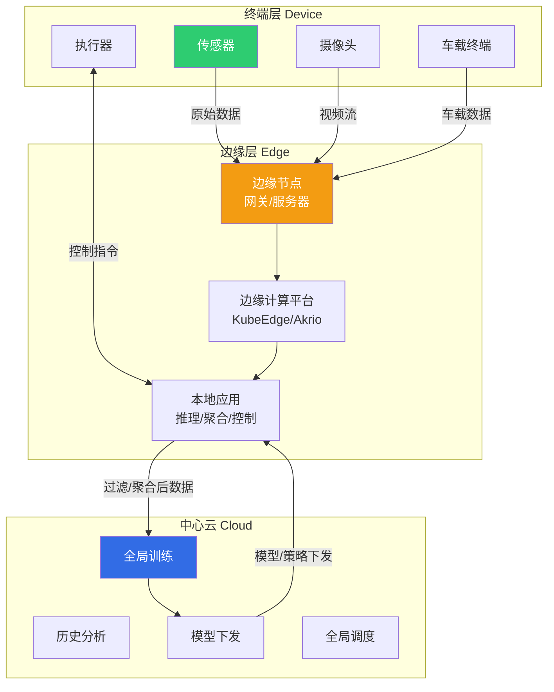
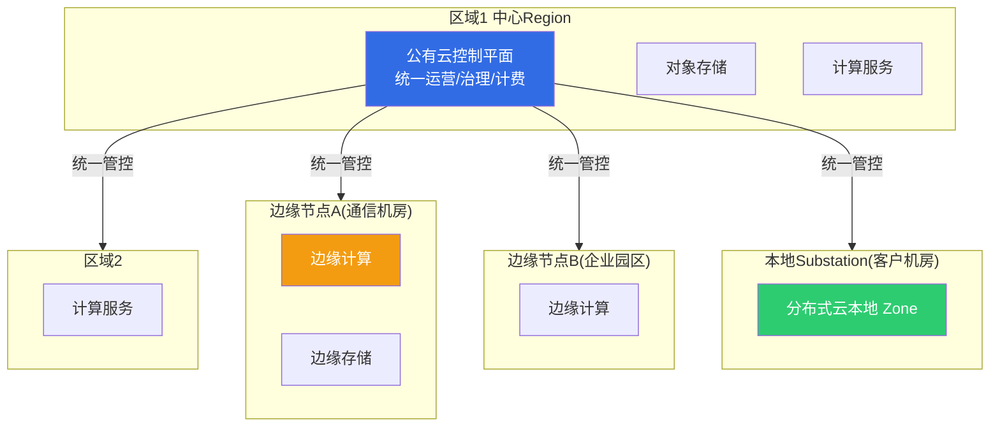
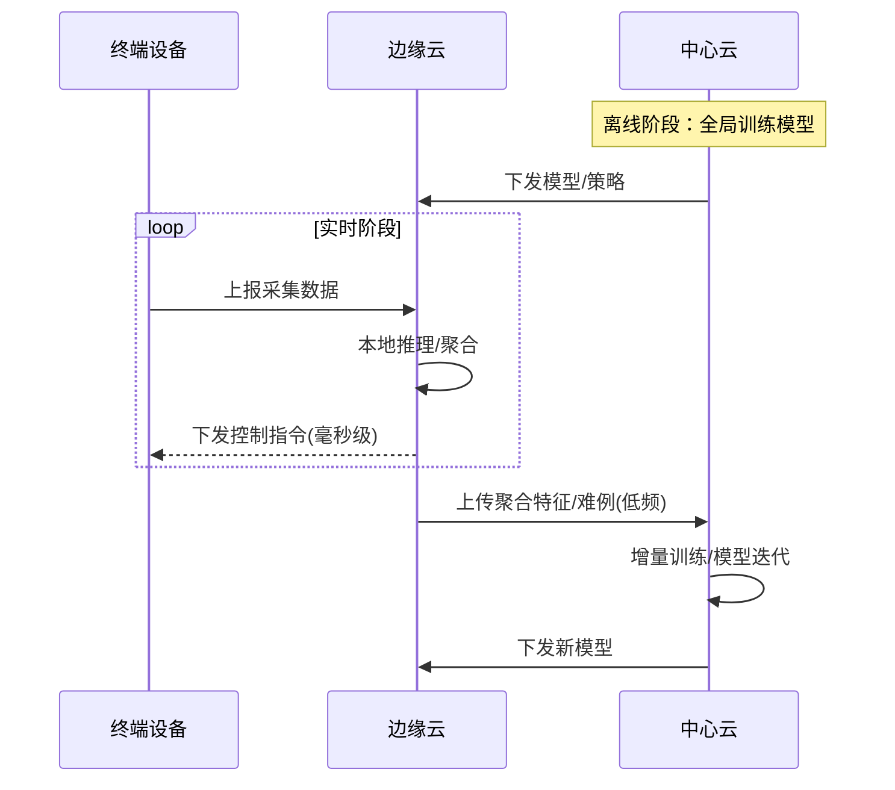
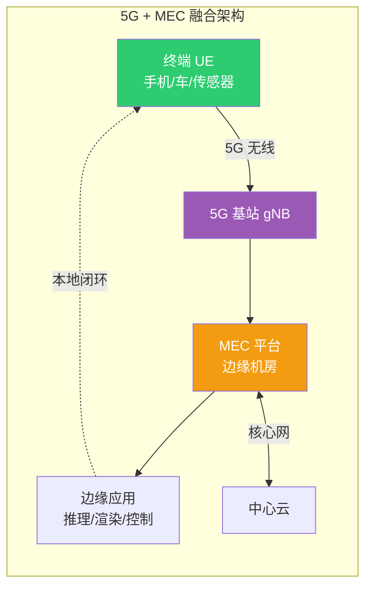

# 2.3 边缘云与分布式云架构

> [!abstract] 本节导读
> 本节解决"云计算如何从集中式数据中心走向分布式边缘"的问题。从边缘计算的动因与架构入手，阐明边缘云将云能力下沉到网络边缘的价值；进而引入 Gartner 提出的分布式云概念，辨析其与混合云、边缘计算的关系；阐述云-边-端三层协同范式；最后分析 5G 与边缘云融合的典型场景。本节是云计算从"集中"走向"分布"的前沿方向。

## 一、边缘计算

### 1.1 定义与动因

边缘计算（Edge Computing）是一种将数据处理从集中式数据中心下沉到靠近数据源的网络边缘执行的计算范式。其核心动因包括：

| 动因 | 集中式云计算的局限 | 边缘计算的价值 |
|-----|------------------|--------------|
| **时延** | 数据往返云端时延高（数十至数百毫秒） | 本地处理，毫秒级响应 |
| **带宽** | 海量原始数据上云消耗骨干带宽 | 就近过滤聚合，节省回传带宽 |
| **数据隐私** | 敏感数据出域存在合规风险 | 敏感数据本地闭环处理 |
| **可靠性** | 断网即失效 | 边缘可离线自治运行 |
| **成本** | 持续上云传输与存储成本高 | 本地处理降低云出口费用 |

### 1.2 边缘计算架构

### 1.3 边缘计算典型应用场景

> [!example] 边缘计算落地场景
> - **智能制造**：产线视觉质检本地推理，毫秒级缺陷识别，避免停线
> - **自动驾驶**：路侧边缘节点（RSU）协同感知，降低车端算力需求与 V2X 时延
> - **智慧城市**：摄像头视频就近结构化分析，仅回传特征而非原始视频流
> - **AR/VR**：渲染与位姿计算在边缘完成，降低终端重量与晕眩感
> - **工业 IoT**：设备状态本地监测与预测性维护，断网仍可报警

## 二、分布式云

### 2.1 Gartner 定义

分布式云（Distributed Cloud）由 Gartner 在 2020 年提出，并连续列为重要战略技术趋势。其核心定义是：**将公有云服务分布到不同的物理位置，而由原公有云服务商统一负责运营、治理、更新与演进**。

> [!important] 分布式云的关键特征
> 分布式云的本质是"**云服务的位置分布化 + 治理责任集中化**"。云服务的消费者可指定云服务部署的物理位置（如本地、边缘节点、其他区域），但运维与责任仍归属云服务商。这是与传统混合云、私有云的根本区别。

### 2.2 分布式云与其他模式辨析

| 模式 | 部署位置 | 运维责任 | 与分布式云区别 |
|-----|---------|---------|--------------|
| 公有云 | 云商数据中心 | 云商 | 集中部署，非分布式 |
| 私有云 | 用户自建机房 | 用户自管 | 用户自行运维，非云商统一 |
| 混合云 | 公有+私有组合 | 分别由云商与用户管理 | 治理割裂，非单一责任主体 |
| 边缘计算 | 网络边缘 | 视实现而定（用户或云商） | 强调位置，分布式云强调云商统一治理 |
| **分布式云** | 多物理位置（含边缘） | **云商统一** | 位置分布 + 责任集中 |

### 2.3 分布式云架构

## 三、云-边-端协同

云-边-端协同是 [[1.2 新一代信息技术架构与演进规律]] 提出的新型计算范式，将云计算、边缘云、终端设备按职责分工协同。

### 3.1 三层职责分工

| 层级 | 职责 | 典型能力 | 资源特征 |
|-----|------|---------|---------|
| **云（中心云）** | 全局训练、历史分析、模型演进 | 大规模训练、长周期存储、全局调度 | 算力强、时延高 |
| **边（边缘云）** | 本地推理、实时控制、数据聚合 | 模型推理、规则引擎、本地缓存 | 算力中、时延低 |
| **端（终端设备）** | 感知、采集、轻量执行 | 传感采集、简单预处理、人机交互 | 算力弱、贴近场景 |

### 3.2 协同工作流

> [!tip] 云边端协同的核心价值
> 云边端协同打破了"全部上云"的简单思路：云端负责"重而慢"的训练与全局优化，边缘负责"快而精"的实时推理，终端负责"近而广"的感知。三者形成数据与模型的闭环：云端训练的模型下发到边缘执行，边缘的难例样本回流云端迭代，实现越用越智能的良性循环。

## 四、5G 与边缘云融合

### 4.1 5G 三大场景与边缘云契合度

| 5G 场景 | 英文 | 关键指标 | 与边缘云契合度 |
|--------|------|---------|--------------|
| **eMBB** | Enhanced Mobile Broadband | 大带宽 | 高（视频渲染、AR/VR） |
| **URLLC** | Ultra-Reliable Low Latency | 低时延高可靠 | 极高（工业控制、自动驾驶） |
| **mMTC** | Massive Machine Type Comm. | 大连接 | 高（物联网海量接入） |

### 4.2 MEC：多接入边缘计算

5G 与边缘云融合的典型形态是 **MEC（Multi-Access Edge Computing，多接入边缘计算）**，由 ETSI 标准化。MEC 将计算与存储能力部署在 5G 基站或边缘机房，使应用在靠近用户的网络边缘运行。

### 4.3 典型融合场景

> [!example] 5G+边缘云落地场景
> - **车联网（V2X）**：路侧 MEC 协同感知，实现红绿灯推送、盲区预警，端到端时延 < 20ms
> - **云游戏**：游戏渲染在 MEC 完成，终端仅接收视频流，降低终端配置要求
> - **智慧园区**：5G 专网 + MEC，视频分析与 AGV 调度本地闭环，数据不出园区
> - **远程医疗**：MEC 提供本地低时延图像处理，支撑远程会诊与术中辅助

## 五、边缘云关键技术栈

| 能力 | 代表技术/项目 | 说明 |
|-----|-------------|------|
| 边缘容器编排 | KubeEdge、Akri、OpenYurt | 将 K8s 能力延伸到边缘，支持离线自治 |
| 边缘函数 | OpenFaaS、Knative | 在边缘运行 Serverless 函数 |
| 边缘 AI 推理 | TensorFlow Lite、ONNX Runtime、TensorRT | 轻量化模型在边缘设备推理 |
| 边缘消息总线 | MQTT、EdgeX Foundry | 边缘设备协议接入与南向数据 |
| 边云协同 | kubeedge-cloudcore/edgecore | 云端控制、边缘执行的统一编排 |

> [!note] 边缘自治的重要性
> 边缘节点常处于弱网或断网环境（如偏远基站、车联网移动场景）。边缘云平台必须支持**离线自治**：即使与中心云断连，边缘节点仍能维持本地业务运行、数据缓存与策略执行，待网络恢复后再同步状态。这是 KubeEdge 等边缘编排系统区别于标准 K8s 的关键设计。

## 六、小结

> [!summary] 本节要点回顾
> 1. **边缘计算**：将计算下沉到数据源附近，解决时延、带宽、隐私、可靠性、成本五类问题
> 2. **分布式云**：Gartner 定义，云服务位置分布化 + 治理责任集中化，是公有云向边缘的自然延伸
> 3. **云-边-端协同**：云负责全局训练、边负责本地推理、端负责感知采集，形成数据与模型的闭环
> 4. **5G+边缘云**：MEC 是融合典型形态，URLLC 场景对边缘云依赖最高，车联网、云游戏、智慧园区是落地热点
> 5. **边缘自治**：弱网断网下边缘节点需独立运行，KubeEdge 等边缘编排系统是关键支撑

## 关联知识点

| 关联知识点 | 关系 |
|-----------|------|
| [[2.1 云计算架构与服务模式演进]] | 分布式云是云计算架构演进的第四阶段 |
| [[2.2 云原生技术栈与容器编排]] | K8s 向边缘延伸形成 KubeEdge 等边缘编排 |
| [[1.2 新一代信息技术架构与演进规律]] | 云-边-端协同框架的提出来源 |
| [[第5章 物联网与5G通信技术/MOC - 第5章]] | 5G 与 MEC 融合的通信基础 |
| [[人工智能与前沿技术/云计算技术/知识点/第6章 云网络与虚拟网络技术/6.3 云网络互联与SD-WAN]] | 边缘网络互联技术 |
| [[MOC - 第2章]] | 返回本章导航 |
