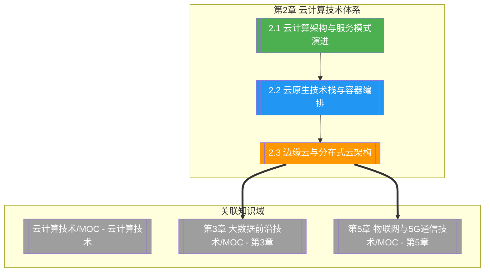

# 第2章 云计算技术体系

> [!abstract] 章节概述
> 本章在 [[1.2 新一代信息技术架构与演进规律]] 提出的"云-边-端协同"框架基础上，系统阐述云计算技术体系的演进脉络与前沿架构。从 IaaS/PaaS/SaaS 服务模式的回顾出发，深入云原生架构、容器编排、Serverless 等新一代云范式，进而延伸至边缘云与分布式云架构，揭示云计算从集中式资源池走向云边端一体化分布的演进规律。本章是 ABCD5G 体系中 C（Cloud）的深入展开，为后续物联网与 5G 章节的云边协同奠定基础。

## 学习路线图

## 知识点导航

| 编号 | 知识点 | 核心内容 | 重要程度 |
|-----|--------|---------|---------|
| 2.1 | [[2.1 云计算架构与服务模式演进]] | IaaS/PaaS/SaaS 演进、云原生、Serverless、多云混合云 | ⭐⭐⭐⭐⭐ |
| 2.2 | [[2.2 云原生技术栈与容器编排]] | CNCF 生态、Kubernetes、Service Mesh、云原生存储网络 | ⭐⭐⭐⭐⭐ |
| 2.3 | [[2.3 边缘云与分布式云架构]] | 边缘计算、分布式云、云边端协同、5G+边缘云 | ⭐⭐⭐⭐ |

## 核心概念速览

> [!tip] 本章必须掌握的核心概念
> - **云原生（Cloud Native）**：以容器、微服务、DevOps、持续交付为核心特征的应用构建与运行范式
> - **Serverless 计算**：包含 FaaS（函数即服务）与 BaaS（后端即服务），实现按需计费与自动弹性
> - **CNCF 技术栈**：以 Kubernetes 为编排标准，覆盖编排、服务网格、存储、网络、可观测性的云原生生态
> - **Service Mesh**：以 Istio/Linkerd 为代表的服务间通信治理层，解耦业务逻辑与通信治理
> - **边缘云（Edge Cloud）**：将云能力下沉至网络边缘，实现低时延、本地化处理与带宽节省
> - **分布式云（Distributed Cloud）**：Gartner 定义，将公有云服务分布到不同物理位置并由云服务商统一管理
> - **云-边-端协同**：云集中训练、边缘本地推理、终端感知交互的三层协同范式
> - **多云/混合云策略**：避免厂商锁定、满足合规与容灾需求的跨云部署模式

## 核心考点

> [!important] 期末高频考点

| 考点 | 所属知识点 | 考查形式 | 难度 |
|-----|-----------|---------|------|
| IaaS/PaaS/SaaS 三种服务模式的区别与演进 | 2.1 | 简答题/选择题 | ★★ |
| 云原生四大核心特征及含义 | 2.1 | 简答题 | ★★★ |
| Serverless 的 FaaS 与 BaaS 区别及适用场景 | 2.1 | 简答题/论述题 | ★★★ |
| 多云与混合云的动机与挑战 | 2.1 | 论述题/案例分析 | ★★★ |
| Kubernetes 核心组件与编排原理 | 2.2 | 简答题 | ★★★★ |
| Service Mesh 架构与 Istio 工作原理 | 2.2 | 论述题 | ★★★★ |
| CNCF 技术栈分层及代表项目 | 2.2 | 选择题/简答题 | ★★★ |
| 边缘计算架构与典型应用场景 | 2.3 | 简答题/案例分析 | ★★★ |
| 分布式云定义与云计算架构演进 | 2.3 | 论述题 | ★★★★ |
| 云-边-端协同的工作机制 | 2.3 | 简答题/论述题 | ★★★★ |
| 5G 与边缘云融合的价值与场景 | 2.3 | 案例分析 | ★★★ |

## 自测题

> [!question] 章节自测
> 1. 阐述云计算从 IaaS、PaaS、SaaS 到 Serverless 的服务模式演进脉络，说明每次演进解决了什么问题，并分析 Serverless 相对传统 PaaS 的核心优势与局限。
> 2. 绘制云原生技术栈分层图，说明 Kubernetes 在其中的核心地位，并解释 Service Mesh 如何将通信治理逻辑从业务代码中解耦。
> 3. 结合 Gartner 分布式云定义，分析"分布式云"与传统"混合云""边缘计算"的区别与联系，并举一个 5G+边缘云的典型应用场景说明其价值。
> 4. 论述云-边-端协同架构中云计算、边缘云、终端设备各自的职责分工，并分析该架构在自动驾驶或智能制造场景下如何降低时延、保障数据隐私。

## 章节导航

| 方向 | 链接 |
|-----|------|
| ⬆ 返回课程总览 | [[MOC - 专业前沿技术]] |
| ⬅ 上一章 | [[第1章 专业前沿技术绪论与发展趋势/MOC - 第1章]] |
| ➡ 下一章 | [[第3章 大数据前沿技术/MOC - 第3章]] |

## 关联知识

- [[人工智能与前沿技术/云计算技术/MOC - 云计算技术]] - 云计算技术体系深入展开的单科课程
- [[人工智能与前沿技术/大数据分析技术]] - 云计算与大数据在存储、计算层面的协同
- [[第1章 专业前沿技术绪论与发展趋势/1.2 新一代信息技术架构与演进规律]] - 四层架构与云-边-端协同框架
- [[第5章 物联网与5G通信技术/MOC - 第5章]] - 5G 与边缘云融合的通信基础
