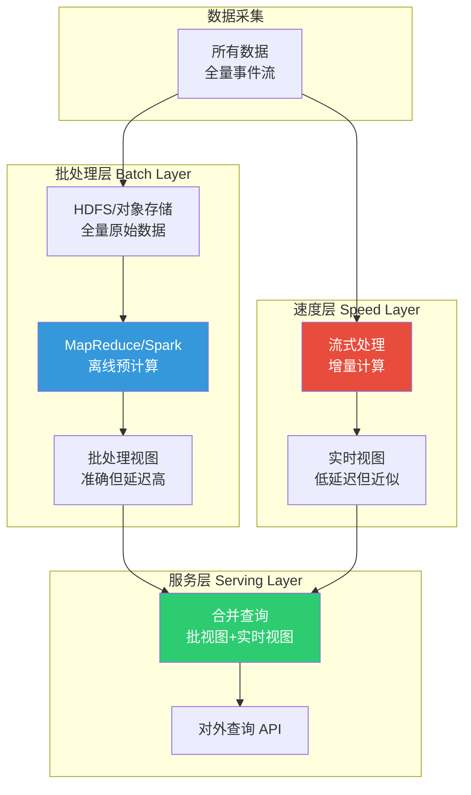
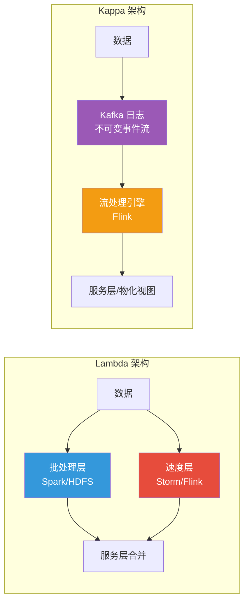
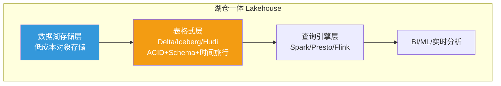
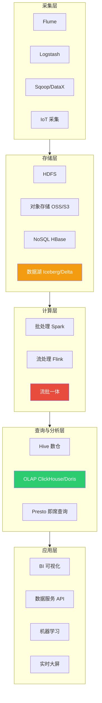

# 3.1 大数据技术体系与Lambda架构

> [!abstract] 本节导读
> 本节解决"海量数据如何被分层处理以兼顾准确性与实时性"的问题。从大数据 5V 特征入手明确大数据的技术挑战，进而阐述 Lambda 架构通过批处理层、速度层、服务层并存的批流协同思想，再分析 Kappa 架构以单一流式引擎简化 Lambda 的演进，最后辨析数据湖与数据仓库两类数据存储范式。本节是大数据架构思想的纲领，为 [[3.2 实时计算与流处理引擎]] 的引擎选型奠定理论基础。

## 一、大数据 5V 特征

大数据的经典定义以 5V 特征刻画，它揭示了传统数据处理技术在数据规模、速度、多样性、真实性与价值挖掘上的全面挑战。

| 特征 | 英文 | 含义 | 技术挑战 |
|-----|------|------|---------|
| **大量** | Volume | 数据规模从 TB 级迈向 PB、EB 级 | 分布式存储、横向扩展 |
| **高速** | Velocity | 数据产生与处理速度快，要求实时/近实时 | 流处理、低时延计算 |
| **多样** | Variety | 结构化、半结构化、非结构化并存 | 多模态存储、Schema-on-Read |
| **真实性** | Veracity | 数据来源多、噪声大，需保证质量与可信 | 数据治理、清洗、血缘 |
| **价值** | Value | 价值密度低但总体价值高，需深度挖掘 | 数据挖掘、机器学习 |

> [!note] 从 4V 到 5V 的演进
> 早期大数据定义仅有 Volume、Velocity、Variety、Value 四个 V。随着数据规模膨胀，数据质量与可信问题凸显，业界补充了第五个 V——Veracity（真实性）。它强调：在海量数据中，错误、缺失、噪声、虚假数据会显著影响分析结论，数据治理与数据质量成为大数据的关键命题。

## 二、Lambda 架构

Lambda 架构由 Nathan Marz 提出，是大数据处理"批流协同"的经典范式。其核心思想是：**批处理保证准确性与全量历史，流处理保证低延迟，两者结果在服务层合并对外提供**。

### 2.1 三层结构

| 层级 | 职责 | 技术选型 | 特点 |
|-----|------|---------|------|
| **批处理层** | 存储全量原始数据并离线预计算批视图 | HDFS、Spark、MapReduce | 准确、可重算，但延迟高（小时~天级） |
| **速度层** | 处理近期增量数据，产出实时视图 | Storm、Flink、Spark Streaming | 低延迟（秒~毫秒级），但近似、可能修正 |
| **服务层** | 合并批视图与实时视图响应查询 | HBase、Druid、ClickHouse | 对外提供低延迟随机读 |

### 2.2 批流合并查询原理

> [!important] Lambda 的核心公式
> 查询结果 = 批处理视图（截至某时间点的全量准确结果）+ 速度层视图（该时间点之后的增量实时结果）
>
> 批处理层定期重算并覆盖批视图，速度层处理批视图时间点之后的增量。由于批视图"权威但滞后"，实时视图"及时但近似"，两者相加既保证低延迟又保证最终准确。当批处理追上后，速度层的增量即被吸收进批视图。

### 2.3 Lambda 的优缺点

| 优点 | 缺点 |
|-----|------|
| 同时满足低延迟与高准确 | 批流双路维护两套代码，逻辑重复 |
| 批处理可全量重算容错 | 系统复杂，运维与一致性成本高 |
| 适合复杂历史分析+实时监控 | 批流结果可能存在口径差异 |

## 三、Kappa 架构

Kappa 架构由 LinkedIn 的 Jay Kreps 提出，旨在解决 Lambda 批流双路带来的复杂度。其核心思想是：**用单一流式处理引擎同时承担批处理与实时处理，移除独立的批处理层**。

### 3.1 架构对比

### 3.2 Kappa 的核心机制

Kappa 的关键在于以 Kafka 等分布式日志作为唯一数据源，所有数据以不可变事件流形式长期保存：

- **批处理即重放**：当需要"批处理"时，只需从 Kafka 历史_offset 重新消费整个数据流，相当于"流的批处理"
- **单一引擎**：批与流使用同一套流处理代码，避免逻辑重复
- **重算容错**：需要修正历史结果时，启动新版本作业从头重放 Kafka，切换结果后停掉旧作业

> [!important] Kappa 架构的适用前提
> Kappa 依赖消息队列能长期保存全量数据（Kafka 的 log retention）且支持重放。这对存储成本与消息系统能力提出要求。若历史数据规模极大、批处理逻辑极重，纯流式重算的代价可能高于离线批处理，此时 Lambda 仍有价值。

### 3.3 Lambda vs Kappa 选型

| 维度 | Lambda | Kappa |
|-----|--------|-------|
| 架构复杂度 | 高（批流双路） | 低（单流式引擎） |
| 代码重复 | 严重 | 无 |
| 准确性 | 批处理层保证 | 依赖流引擎 Exactly-Once |
| 历史重算 | 离线批处理高效 | 流式重放，可能较慢 |
| 适用场景 | 历史分析重+实时需求并存 | 实时为主、历史可重放 |

> [!tip] 流批一体的现代趋势
> 现代 Flink 等引擎支持"流批一体"（Batch on Streaming），在同一 API 与引擎下统一批与流处理，使 Kappa 架构的工程门槛大幅降低。流批一体已成为大数据计算引擎的主流演进方向。

## 四、数据湖与数据仓库

### 4.1 概念辨析

| 维度 | 数据仓库 | 数据湖 |
|-----|---------|--------|
| **数据结构** | 结构化为主，Schema-on-Write | 结构化/半结构化/非结构化，Schema-on-Read |
| **存储时机** | ETL 清洗后入库 | 原始数据直接入库 |
| **使用者** | 业务分析师、BI | 数据科学家、算法工程师 |
| **灵活性** | 低，模式固定 | 高，按需解析 |
| **成本** | 清洗加工成本高 | 存储成本低，但治理不善易成"数据沼泽" |

> [!warning] 数据湖的"数据沼泽"风险
> 数据湖若缺乏元数据管理、数据目录与治理策略，原始数据堆积后将无法被有效检索与信任，沦为"数据沼泽"（Data Swamp）。这正是 [[3.3 数据中台与智能数据分析]] 中数据治理要解决的核心问题。

### 4.2 湖仓一体

湖仓一体（Lakehouse）是 Databricks 提出的新范式，融合数据湖的灵活存储与数据仓库的事务、治理能力：

- 在数据湖低成本存储之上，叠加 ACID 事务、模式管理、时间旅行
- 代表技术：Delta Lake、Apache Iceberg、Apache Hudi
- 解决"数据湖治理弱、数仓灵活性低"的折中方案

## 五、大数据技术体系全景

> [!summary] 本节要点回顾
> 1. **5V 特征**：Volume、Velocity、Variety、Veracity、Value；相比 4V 新增 Veracity 强调数据质量与可信
> 2. **Lambda 架构**：批处理层（准确滞后）+ 速度层（低延迟近似）+ 服务层（合并查询），查询=批视图+实时视图
> 3. **Kappa 架构**：单一流式引擎+Kafka 日志重放，消除批流双路复杂度，依赖流引擎 Exactly-Once 与日志重放
> 4. **流批一体**：现代引擎（Flink）统一批流，是 Kappa 落地的关键支撑
> 5. **数据湖 vs 数仓**：数仓 Schema-on-Write 面向分析，数据湖 Schema-on-Read 面向原始数据；湖仓一体融合两者
> 6. **技术体系**：采集→存储→计算→查询→应用五层，流批一体与湖仓一体是两大演进主线

## 关联知识点

| 关联知识点 | 关系 |
|-----------|------|
| [[3.2 实时计算与流处理引擎]] | 本节 Lambda/Kappa 架构的引擎实现 |
| [[3.3 数据中台与智能数据分析]] | 本节数据湖治理与数仓建模的深化 |
| [[人工智能与前沿技术/大数据分析技术]] | 大数据技术体系单科课程 |
| [[人工智能与前沿技术/大数据分析技术/知识点/第1章-大数据基础概念与技术栈/1.1-大数据4V特征]] | 4V 特征基础与 5V 的关系 |
| [[人工智能与前沿技术/大数据分析技术/知识点/第4章-Spark分布式计算引擎/4.1-Spark架构与核心概念]] | 批处理引擎基础 |
| [[第2章 云计算技术体系/MOC - 第2章]] | 大数据计算的云算力底座 |
| [[MOC - 第3章]] | 返回本章导航 |
