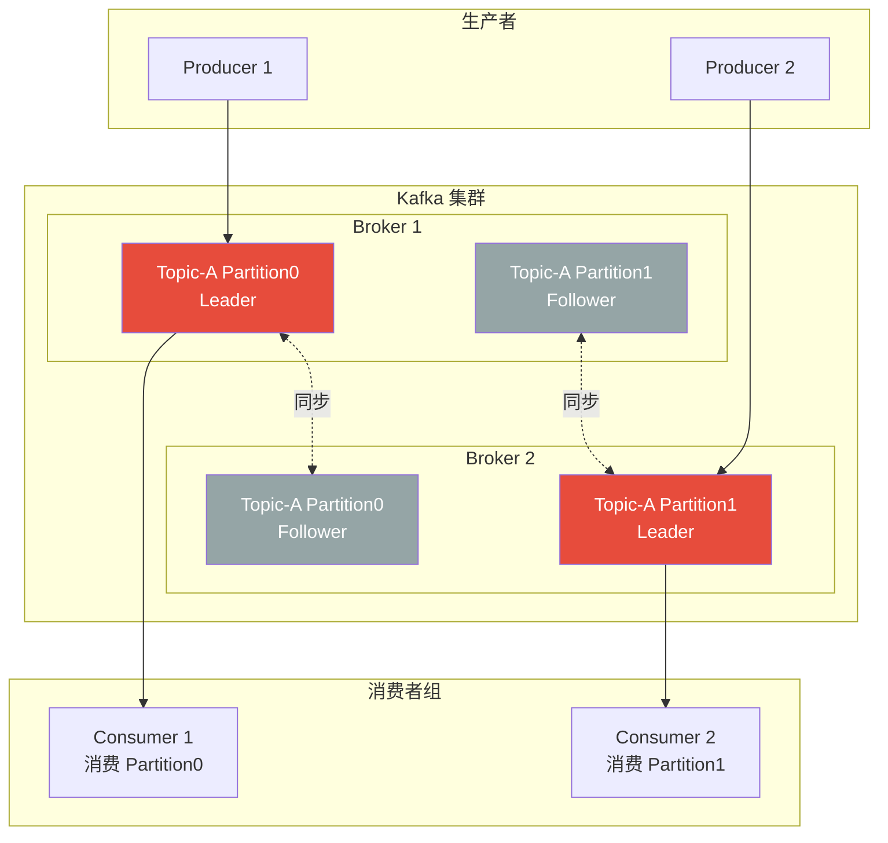
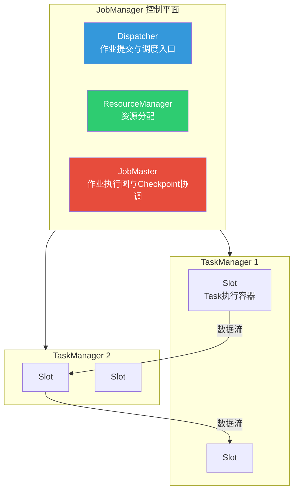
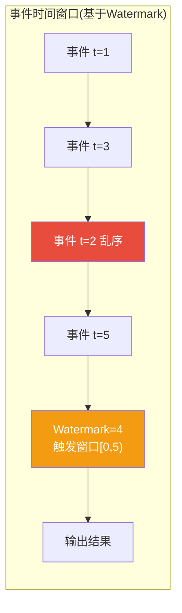
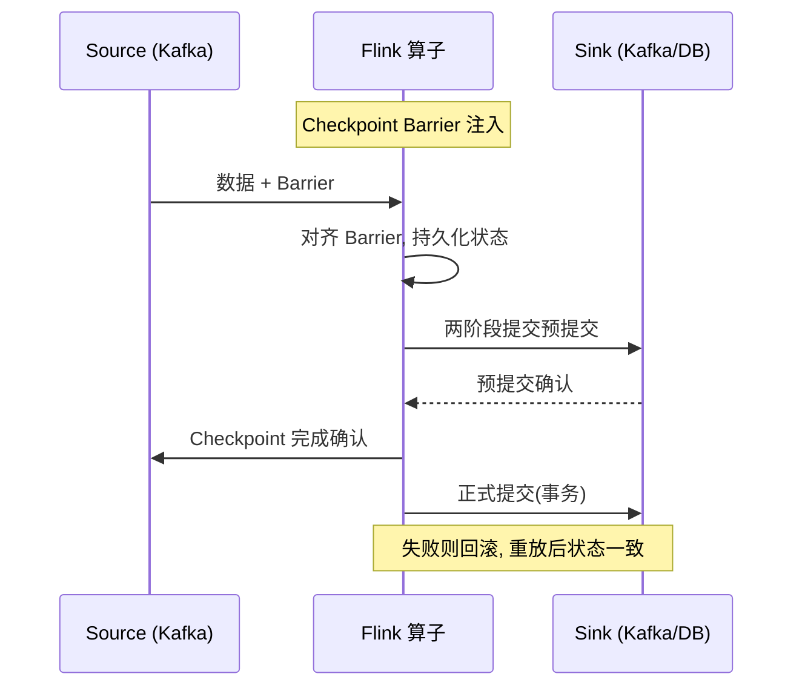

# 3.2 实时计算与流处理引擎

> [!abstract] 本节导读
> 本节解决"海量实时数据流如何被高吞吐、低延迟、不重不丢地处理"的问题。从流处理的基本概念切入，系统阐述 Kafka 作为流式数据管道的核心架构，深入 Flink 的原生流处理模型与事件时间机制，对比 Spark Streaming 的微批模型，最后剖析 Exactly-Once 端到端语义的实现原理。本节是 [[3.1 大数据技术体系与Lambda架构]] 中速度层与 Kappa 架构的引擎落地。

## 一、流处理概述

流处理（Stream Processing）是对无界数据流（unbounded data stream）进行持续、增量处理的计算范式。与批处理处理有界静态数据不同，流处理的数据随时间持续到达，需要在线处理。

| 维度 | 批处理 Batch | 流处理 Stream |
|-----|-------------|--------------|
| 数据特征 | 有界、静态 | 无界、持续到达 |
| 处理时机 | 数据积累后统一处理 | 数据到达即处理 |
| 延迟 | 分钟~小时 | 毫秒~秒 |
| 状态管理 | 通常无状态 | 需要状态管理与 Checkpoint |
| 典型场景 | 离线报表、历史ETL | 实时风控、监控大屏、推荐 |

主流流处理生态以 **Kafka（数据管道）+ Flink（计算引擎）** 为黄金组合，Spark Streaming 作为微批方案广泛存在。

## 二、Kafka 分布式消息队列

Apache Kafka 是 LinkedIn 开源的高吞吐分布式消息发布订阅系统，现已成为流式数据管道的事实标准。它在 Lambda/Kappa 架构中承担数据采集与持久化日志的核心角色。

### 2.1 核心概念

| 概念 | 英文 | 含义 |
|-----|------|------|
| **生产者** | Producer | 发布消息的客户端 |
| **消费者** | Consumer | 订阅消费消息的客户端 |
| **代理** | Broker | Kafka 服务节点，集群由多 Broker 组成 |
| **主题** | Topic | 消息逻辑分类，生产者向 Topic 写、消费者从 Topic 读 |
| **分区** | Partition | Topic 的物理分片，是并行度与扩展性的基本单位 |
| **副本** | Replica | 分区的副本，主副本（Leader）读写、从副本（Follower）同步 |
| **消费者组** | Consumer Group | 一组消费者共同消费一个 Topic，分区在组内分配 |
| **偏移量** | Offset | 分区内消息的单调递增序号，标识消费位置 |

### 2.2 Kafka 架构



> [!important] Kafka 高吞吐与扩展性的关键设计
> 1. **分区并行**：Topic 被切分为多个 Partition，分布在不同 Broker，生产/消费可并行扩展
> 2. **顺序写磁盘**：消息追加写入日志文件，顺序 IO 性能接近内存
> 3. **零拷贝**：使用 sendfile 将数据从页缓存直接送到网卡，避免用户态拷贝
> 4. **消费者组**：同一组内一个 Partition 只被一个消费者消费，保证分区内顺序；组间可广播
> 5. **副本与 ISR**：Leader 挂掉后从 ISR（同步副本）选举新 Leader，保证高可用

### 2.3 Kafka 作为日志与重放

在 Kappa 架构中，Kafka 不仅是消息管道，更是"不可变事件日志"。通过设置足够的 log retention，Kafka 可长期保存全量数据，支持消费者按 offset 回溯重放——这是流批一体的基础。

## 三、Flink 流处理引擎

Apache Flink 是原生流处理（native streaming）引擎，以事件时间、状态计算与 Checkpoint 机制著称。与微批模型不同，Flink 逐条处理事件，实现真正的低延迟流处理。

### 3.1 Flink 架构



| 组件 | 职责 |
|-----|------|
| **JobManager** | 控制平面，包含 Dispatcher、ResourceManager、JobMaster |
| **Dispatcher** | 接收作业提交，启动 JobMaster |
| **ResourceManager** | 管理 TaskManager 资源与 Slot 分配 |
| **JobMaster** | 协调作业执行图，驱动 Checkpoint 与故障恢复 |
| **TaskManager** | 工作进程，提供 Slot 执行 Task，负责任务实际计算与状态维护 |
| **Slot** | TaskManager 内的资源切片，一个 Slot 可运行多个 Task |

### 3.2 事件时间与水位线

> [!important] 处理时间 vs 事件时间 vs 摄取时间
> - **处理时间（Processing Time）**：数据被引擎处理的系统时间，受延迟与乱序影响，结果不确定
> - **事件时间（Event Time）**：数据实际产生的时间（事件自带的时间戳），结果确定但需处理乱序
> - **摄取时间（Ingestion Time）**：数据进入流系统的时间，介于两者之间

Flink 以**事件时间**为核心，通过 **Watermark（水位线）** 机制处理乱序数据：

- Watermark 是一个单调递增的时间戳，表示"小于该时间的事件已基本到齐"
- 当 Watermark 推进到窗口结束时间，触发该窗口计算
- 允许设置"延迟容忍度"，对迟到数据延迟触发或路由到侧输出



### 3.3 状态与 Checkpoint

Flink 是有状态流处理引擎，支持算子状态（Operator State）与键控状态（Keyed State，如 ValueState、ListState、MapState）。通过 **Checkpoint 机制**实现 Exactly-Once：

- 基于 Chandy-Lamport 分布式快照算法
- JobManager 周期性向数据源注入 Checkpoint Barrier（屏障）
- Barrier 随数据流流动，算子收到所有上游 Barrier 后对齐并持久化当前状态
- 故障恢复时从最近成功的 Checkpoint 恢复状态并重放数据

## 四、Spark Streaming 微批模型

Spark Streaming 将流处理建模为**微批（Micro-Batch）**：将时间切分为小间隔（如 1 秒），每个间隔的数据作为一个 RDD 批处理。

| 维度 | Flink | Spark Streaming |
|-----|--------|----------------|
| 处理模型 | 原生流（逐条） | 微批（按间隔切分 RDD） |
| 延迟 | 毫秒~秒 | 秒级 |
| 事件时间支持 | 原生完整 | 后期增强（Structured Streaming） |
| 状态管理 | 原生状态算子 | 基于 updateStateByKey/mapWithState |
| Exactly-Once | Checkpoint + 事务Sink | 需配合幂等/事务Sink |
| 生态 | 流计算为主 | 复用 Spark SQL/MLlib 生态 |

> [!tip] 微批 vs 原生流的选型
> 微批模型实现简单、与批处理生态统一，适合秒级延迟可接受、需复用 Spark 生态的场景；原生流模型延迟更低、事件时间语义更强，适合严格低延迟与复杂窗口计算场景。Flink 已成为实时计算主流，但 Spark Structured Streaming 在统一 API 上仍有优势。

## 五、Exactly-Once 端到端语义

### 5.1 三种语义

| 语义 | 英文 | 含义 |
|-----|------|------|
| **At-Most-Once** | 至多一次 | 可能丢失，不重复 |
| **At-Least-Once** | 至少一次 | 不丢失，可能重复 |
| **Exactly-Once** | 恰好一次 | 不丢失不重复，端到端一致 |

> [!important] Exactly-Once 的真正含义
> Exactly-Once 指**端到端**的恰好一次效果，而非"数据只被处理一次"。底层可能涉及重放，但通过幂等 Sink 或事务性 Sink 保证最终结果既不丢失也不重复。它依赖三要素：可重放的数据源（如 Kafka offset）+ 状态快照（Checkpoint）+ 幂等或事务性输出。

### 5.2 端到端 Exactly-Once 实现



- **Source 可重放**：Kafka 通过 offset 提交与 Checkpoint 绑定，失败后从记录的 offset 重放
- **状态快照**：Flink Checkpoint 持久化算子状态，恢复后状态与 offset 对齐
- **Sink 事务性**：采用两阶段提交（2PC），预提交成功后才正式提交，保证输出与 Checkpoint 原子

## 六、示例：Flink Word Count

```python
# Flink Python API (PyFlink) 词频统计示例
# 输入：文本流；输出：每个单词的累计计数
# 运行前提：已安装 pyflink，连接到 Kafka source

from pyflink.datastream import StreamExecutionEnvironment
from pyflink.datastream.connectors import KafkaSource
from pyflink.common import WatermarkStrategy

env = StreamExecutionEnvironment.get_execution_environment()

# 1. 定义 Kafka 数据源（可重放，支持 Exactly-Once）
kafka_source = (
    KafkaSource.builder()
    .set_bootstrap_servers("localhost:9092")
    .set_topics("text-input")
    .set_group_id("wordcount-group")
    .set_starting_offsets("earliest")  # 支持回放
    .build()
)

# 2. 读取流并按事件时间分配水位线
ds = env.from_source(
    kafka_source,
    WatermarkStrategy.for_monotonous_timestamps(),
    "kafka-source"
)

# 3. 拆词 -> 分组 -> 滚动窗口统计
result = (
    ds
    .flat_map(lambda line: line.lower().split())          # 拆分为单词
    .map(lambda word: (word, 1), output_type="TUPLE<STRING,INT>")
    .key_by(lambda x: x[0])                                # 按单词分组
    .sum(1)                                                # 累计计数
)

# 4. 输出到控制台
result.print()

env.execute("word-count-streaming")
```

> [!note] 代码说明
> 上述示例展示 Flink 流处理的基本范式：可重放 Source → 事件时间水位线 → 算子链 → 状态聚合。实际生产中需配置 Checkpoint 间隔、状态后端（RocksDB）与事务性 Sink 才能实现端到端 Exactly-Once。运行环境需 PyFlink ≥ 1.15，并保证 Kafka 集群可达。

## 七、小结

> [!summary] 本节要点回顾
> 1. **流处理**：对无界数据流持续增量处理，与批处理在数据特征、延迟、状态管理上不同
> 2. **Kafka**：以 Topic/Partition 为核心的分布式日志，高吞吐依赖分区并行、顺序写、零拷贝；既是消息管道也是可重放日志
> 3. **Flink**：原生流引擎，JobManager+TaskManager 架构，事件时间+Watermark 处理乱序，Checkpoint 实现状态快照
> 4. **Spark Streaming**：微批模型，秒级延迟，与 Spark 生态统一
> 5. **Exactly-Once**：端到端语义，依赖可重放 Source + 状态快照 + 事务/幂等 Sink，Flink 用两阶段提交实现
> 6. **黄金组合**：Kafka（管道）+ Flink（计算）是实时计算主流，支撑 Kappa 架构与流批一体

## 关联知识点

| 关联知识点 | 关系 |
|-----------|------|
| [[3.1 大数据技术体系与Lambda架构]] | 本节是 Lambda 速度层与 Kappa 架构的引擎实现 |
| [[3.3 数据中台与智能数据分析]] | 实时计算结果服务化与指标平台的基础 |
| [[人工智能与前沿技术/大数据分析技术/知识点/第7章-大数据采集与数据预处理/7.2-消息队列Kafka]] | Kafka 深入展开 |
| [[人工智能与前沿技术/大数据分析技术/知识点/第4章-Spark分布式计算引擎/4.1-Spark架构与核心概念]] | Spark 与流处理对比基础 |
| [[第2章 云计算技术体系/MOC - 第2章]] | 流计算集群的云原生部署底座 |
| [[MOC - 第3章]] | 返回本章导航 |
