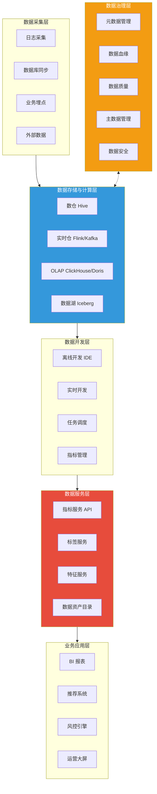
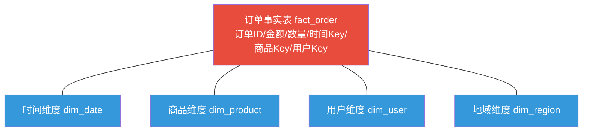
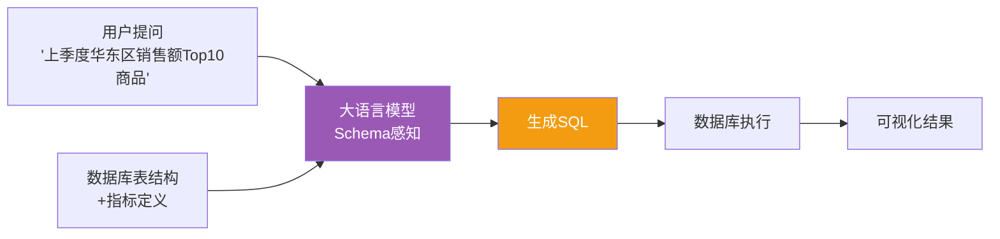

# 3.3 数据中台与智能数据分析

> [!abstract] 本节导读
> 本节解决"企业如何沉淀共性数据能力、并以 AI 增强数据分析实现数据价值变现"的问题。从数据中台的核心理念与架构入手，阐述数据治理（质量、血缘、元数据）的保障作用；对比 Kimball 与 Inmon 两类数仓建模方法论；分析 ClickHouse、Doris、Presto 等 OLAP 引擎的定位与选型；最后延伸至 NLP to SQL、增强分析等 AI 驱动的智能分析方向。本节是大数据从"技术"走向"业务价值"的关键环节。

## 一、数据中台

### 1.1 概念与价值

数据中台（Data Middle Platform）是企业级的数据能力沉淀与服务平台，通过统一数据采集、治理、开发与服务化，将分散在各部门的共性数据能力抽象为可复用的数据服务，支撑前端业务快速创新。

> [!important] 数据中台的核心特征
> 数据中台不是单一的数据库或数仓，而是"**数据 + 治理 + 服务**"的整体。其本质是把数据从"项目附属品"沉淀为"企业级资产"：通过统一指标体系、统一数据服务 API、统一数据开发平台，避免各业务线重复造轮子，实现"数据一次加工、多处复用"。

### 1.2 数据中台架构

> [!note] 数据中台 vs 数据仓库
> 数据仓库聚焦"分析"，是把数据加工后供查询的存储系统；数据中台聚焦"复用"，是在数仓之上叠加治理、开发与服务化能力，强调数据资产化与服务化。数仓是数据中台存储计算层的一个组成部分，而非全部。

## 二、数据治理

数据治理是数据中台的保障层，目标是确保数据"可用、可信、可管、安全"。它贯穿数据全生命周期。

| 治理域 | 英文 | 核心内容 |
|-------|------|---------|
| **数据质量** | Data Quality | 完整性、准确性、一致性、及时性、唯一性的度量与监控 |
| **数据血缘** | Data Lineage | 数据从产生到消费的全链路追踪，支持影响分析与问题定位 |
| **元数据管理** | Metadata Management | 技术元数据（表/字段）、业务元数据（指标定义）、管理元数据（权限）的统一目录 |
| **主数据管理** | Master Data Mgmt, MDM | 跨系统共享的核心实体数据（如客户、商品）的一致性维护 |
| **数据安全** | Data Security | 分级分类、脱敏、访问控制、审计，详见 [[大数据治理与数据安全]] |

> [!tip] 数据血缘的价值
> 当某个报表数据异常时，数据血缘能快速定位是上游哪个表的 ETL 出错；当下游要下线某字段时，血缘能评估影响范围。血缘是数据治理"可追溯"能力的核心。

## 三、数据仓库建模：Kimball vs Inmon

数据仓库建模是数据中台存储层的核心设计，两大主流方法论各有侧重。

| 维度 | Kimball（维度建模） | Inmon（范式建模） |
|-----|--------------------|------------------|
| **核心思想** | 自下而上，以业务过程为中心构建星型/雪花模型 | 自上而下，先建企业级第三范式(3NF)总线，再派生数据集市 |
| **建模方式** | 事实表 + 维度表（星型模型） | 第三范式关系模型 |
| **数据冗余** | 较高（维度反规范化） | 低（规范化） |
| **查询性能** | 高（针对分析优化） | 较低（需多表关联） |
| **实施周期** | 短，快速见效 | 长，整体规划 |
| **适用场景** | 业务导向、敏捷分析 | 大型企业、强一致性要求 |

> [!example] Kimball 星型模型示例
> 以电商为例：以"订单事实表"为中心，外接"时间维度""商品维度""用户维度""地域维度"等维度表，形成星型结构。分析师可沿任意维度对订单金额、数量进行聚合，查询高效直观。

> [!tip] 现代数据中台的建模选择
> 现代数据中台通常采用"分层建模"折中方案：ODS（原始层）保留原始数据 → DWD（明细层）按 Kimball 维度建模清洗 → DWS（汇总层）按主题预聚合 → ADS（应用层）面向场景。这样既保证一致性，又保证查询性能。

## 四、OLAP 引擎

OLAP（Online Analytical Processing，联机分析处理）引擎面向分析查询，支撑数据中台的服务层快速响应聚合分析。

| 引擎 | 类型 | 特点 | 适用场景 |
|-----|------|------|---------|
| **ClickHouse** | MPP 列式 | 单表聚合极快，压缩比高，不支持精细事务 | 日志分析、大屏、用户行为分析 |
| **Apache Doris** | MPP 列式 | 兼顾实时与离线，Join 能力强，易运维 | 实时报表、统一数仓查询 |
| **Presto/Trino** | MPP 内存 | 联邦查询多数据源，无存储，纯计算 | 跨源即席查询、临时分析 |
| **Druid** | 时序预聚合 | 实时摄入、亚秒级查询，适合时序 | 实时监控大屏、时序分析 |

> [!important] OLAP 引擎选型要点
> - 单表聚合为主、数据量极大：**ClickHouse**
> - 实时+离线统一、需多表 Join 与物化视图：**Doris**
> - 跨多数据源即席查询、不强求低延迟：**Presto/Trino**
> - 时序数据实时大屏：**Druid**
> 实际中常多引擎并存，由数据中台统一编排与路由。

## 五、AI 增强分析

### 5.1 NLP to SQL

NLP to SQL（Text-to-SQL）利用大语言模型将自然语言问题转化为 SQL 查询，让业务人员不写 SQL 即可自助分析数据。

> [!note] NLP to SQL 的挑战
> 自然语言的歧义、业务术语与字段映射、复杂多表关联、SQL 正确性验证是核心难点。生产系统通常结合指标平台（统一业务口径）、Few-shot 示例、Schema 检索增强与执行结果校验来提升准确率。

### 5.2 增强分析

增强分析（Augmented Analytics）是 Gartner 提出的概念，指利用 AI 与机器学习自动化数据准备、洞察发现与解释，降低数据分析门槛。

| 能力 | 说明 |
|-----|------|
| **自动洞察** | 自动识别异常、趋势、相关性，无需用户手动探索 |
| **自然语言查询** | NLP to SQL 问答式分析 |
| **自动数据准备** | 自动清洗、特征工程、Schema 推断 |
| **智能解释** | 用自然语言解释图表背后的原因与建议 |
| **预测与归因** | 基于模型的预测、关键驱动因素归因 |

> [!example] 增强分析典型应用
> 业务人员问"为什么本周 GMV 下降？"，系统自动拆解各维度（地区、品类、渠道），定位"华南区母婴品类转化率下降"是主因，并给出归因贡献度排序——这正是增强分析从"看数据"到"懂原因"的跃迁。

## 六、小结

> [!summary] 本节要点回顾
> 1. **数据中台**：数据+治理+服务的整体，把数据沉淀为可复用资产，核心是统一指标、统一服务、统一开发平台
> 2. **数据治理**：质量、血缘、元数据、主数据、安全五大域，保障数据可用可信可管
> 3. **数仓建模**：Kimball 自下而上维度建模（事实+维度，星型），Inmon 自上而下范式建模；现代中台采用 ODS-DWD-DWS-ADS 分层
> 4. **OLAP 引擎**：ClickHouse 单表聚合强、Doris 实时统一、Presto 跨源即席、Druid 时序实时，按场景选型
> 5. **AI 增强分析**：NLP to SQL 让自然语言转查询，增强分析自动洞察与归因，推动分析从"看数"到"懂因"
> 6. **价值闭环**：数据中台沉淀能力 → 治理保障可信 → OLAP 加速查询 → AI 增强降低门槛，实现数据价值变现

## 关联知识点

| 关联知识点 | 关系 |
|-----------|------|
| [[3.1 大数据技术体系与Lambda架构]] | 本节数据中台存储层的架构基础 |
| [[3.2 实时计算与流处理引擎]] | 实时数据服务与指标平台的计算支撑 |
| [[人工智能与前沿技术/大数据分析技术/知识点/第5章-分布式数据仓库Hive/5.1-Hive架构与核心组件]] | 数仓引擎基础 |
| [[人工智能与前沿技术/大数据分析技术/知识点/第9章-大数据治理与数据安全/9.1-数据治理概述]] | 数据治理深入展开 |
| [[人工智能与前沿技术/大数据分析技术/知识点/第8章-数据挖掘与大数据分析算法/8.1-数据挖掘概述]] | 智能分析的算法基础 |
| [[第2章 人工智能与大模型技术/MOC - 第2章]] | NLP to SQL 的大模型基础 |
| [[MOC - 第3章]] | 返回本章导航 |
