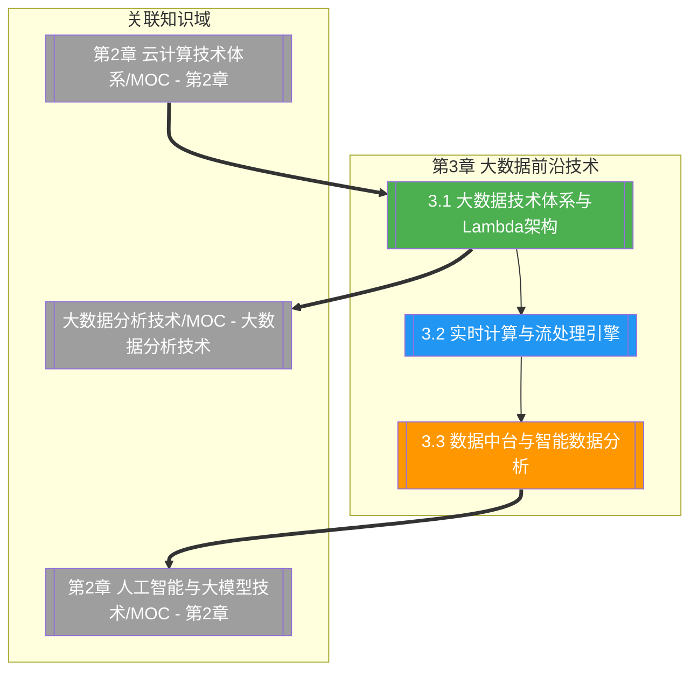

# 第3章 大数据前沿技术

> [!abstract] 章节概述
> 本章在 [[1.1 前沿技术定义、特征与技术体系]] 的 ABCD5G 体系框架下，深入展开 D（大数据）技术域的前沿方向。从大数据 5V 特征出发，系统阐述 Lambda 与 Kappa 架构的批流协同思想；进而聚焦实时计算与流处理引擎（Kafka、Flink、Spark Streaming）的核心架构与 Exactly-Once 语义；最后延伸至数据中台、数据治理、OLAP 引擎与 AI 增强分析。本章揭示大数据从"海量存储批处理"走向"实时流计算+智能分析"的演进规律，与 [[第2章 云计算技术体系/MOC - 第2章]] 的算力底座形成协同。

## 学习路线图

## 知识点导航

| 编号 | 知识点 | 核心内容 | 重要程度 |
|-----|--------|---------|---------|
| 3.1 | [[3.1 大数据技术体系与Lambda架构]] | 5V 特征、Lambda/Kappa 架构、数据湖与数仓 | ⭐⭐⭐⭐⭐ |
| 3.2 | [[3.2 实时计算与流处理引擎]] | Kafka、Flink、Spark Streaming、Exactly-Once | ⭐⭐⭐⭐⭐ |
| 3.3 | [[3.3 数据中台与智能数据分析]] | 数据中台、数据治理、OLAP、AI 增强分析 | ⭐⭐⭐⭐ |

## 核心概念速览

> [!tip] 本章必须掌握的核心概念
> - **大数据 5V 特征**：Volume（大量）、Velocity（高速）、Variety（多样）、Veracity（真实性）、Value（价值）
> - **Lambda 架构**：批处理层 + 速度层 + 服务层，批流并存保证延迟与准确性
> - **Kappa 架构**：以流处理为核心，用单一流式引擎替代批流双路，简化架构
> - **数据湖（Data Lake）**：以原始格式存储海量结构化/半结构化/非结构化数据
> - **Kafka**：分布式消息队列，以 Topic/Partition 为核心的高吞吐流式数据管道
> - **Flink**：原生流处理引擎，基于事件时间与 Checkpoint 实现 Exactly-Once
> - **Exactly-Once 语义**：端到端恰好处理一次，既不丢失也不重复
> - **数据中台**：沉淀共性数据能力，统一数据采集、治理、服务化的企业级平台
> - **数据治理**：覆盖数据质量、血缘、元数据、主数据、安全的全生命周期管理
> - **OLAP 引擎**：ClickHouse、Doris、Presto 等面向分析查询的高性能引擎
> - **增强分析（Augmented Analytics）**：NLP to SQL、自动洞察等 AI 驱动的智能分析

## 核心考点

> [!important] 期末高频考点

| 考点 | 所属知识点 | 考查形式 | 难度 |
|-----|-----------|---------|------|
| 大数据 5V 特征及含义 | 3.1 | 简答题/填空题 | ★★ |
| Lambda 架构三层结构与原理 | 3.1 | 简答题/论述题 | ★★★★ |
| Kappa 架构对 Lambda 的改进 | 3.1 | 论述题/对比题 | ★★★★ |
| 数据湖与数据仓库的区别 | 3.1 | 简答题/选择题 | ★★★ |
| Kafka 核心概念与架构 | 3.2 | 简答题 | ★★★★ |
| Flink 架构与事件时间处理 | 3.2 | 简答题/论述题 | ★★★★ |
| Exactly-Once 语义实现机制 | 3.2 | 论述题 | ★★★★★ |
| Kafka、Flink、Spark Streaming 对比 | 3.2 | 对比题/论述题 | ★★★ |
| 数据中台的概念与价值 | 3.3 | 简答题/论述题 | ★★★ |
| Kimball 与 Inmon 数仓建模对比 | 3.3 | 对比题 | ★★★★ |
| OLAP 引擎选型（ClickHouse/Doris/Presto） | 3.3 | 简答题/案例分析 | ★★★ |
| AI 增强分析（NLP to SQL）应用 | 3.3 | 案例分析 | ★★★ |

## 自测题

> [!question] 章节自测
> 1. 阐述大数据 5V 特征的内涵，并说明相比传统 4V 模型新增的"Veracity（真实性）"为何在大数据时代尤为重要。
> 2. 绘制 Lambda 架构图，说明批处理层、速度层、服务层各自职责；进而阐述 Kappa 架构如何用单一流式引擎替代批流双路，并分析其适用前提与局限。
> 3. 对比 Kafka、Flink、Spark Streaming 三者在架构定位、处理模型（批/微批/流）、Exactly-Once 支持上的差异，并为"实时风控"场景选择合适引擎并说明理由。
> 4. 论述数据中台的核心理念与关键能力（数据治理、数据服务化、指标体系），并结合 Kimball 与 Inmon 两种数仓建模思路，分析数据中台应如何选择建模方法论。

## 章节导航

| 方向 | 链接 |
|-----|------|
| ⬆ 返回课程总览 | [[MOC - 专业前沿技术]] |
| ⬅ 上一章 | [[第2章 云计算技术体系/MOC - 第2章]] |
| ➡ 下一章 | [[第4章 云计算与边缘计算技术/MOC - 第4章]] |

## 关联知识

- [[人工智能与前沿技术/大数据分析技术]] - 大数据技术体系深入展开的单科课程
- [[第2章 云计算技术体系/MOC - 第2章]] - 大数据计算的云算力底座
- [[第1章 专业前沿技术绪论与发展趋势/1.1 前沿技术定义、特征与技术体系]] - ABCD5G 体系与大数据定位
- [[人工智能与前沿技术/人工智能技术]] - AI 增强分析与智能数据分析的基础
