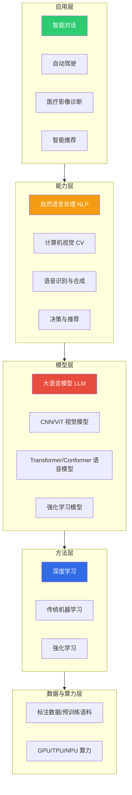
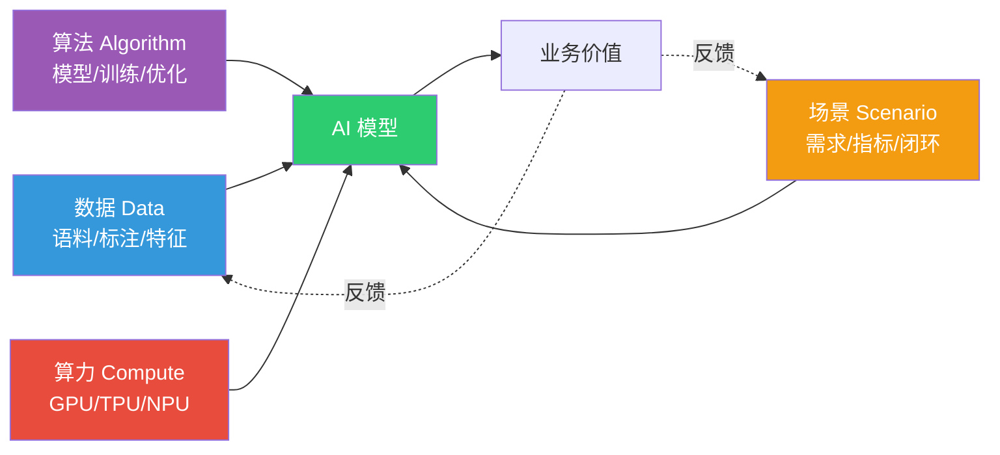
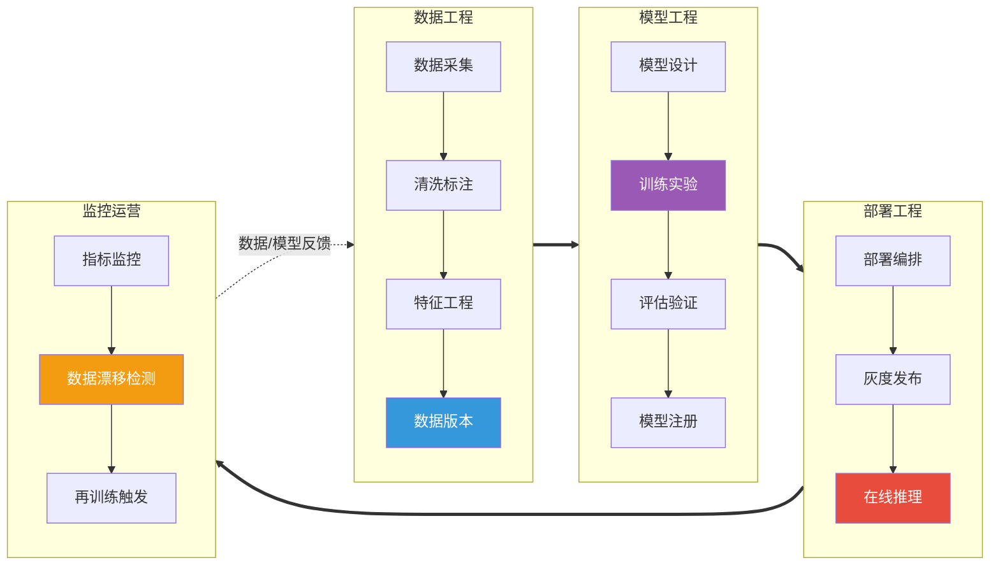

# 4.1 AI技术体系与赋能框架

> [!abstract] 本节导读
> 本节解决"AI 技术如何被分层组织并通过什么机制赋能千行百业"的问题。从 AI 技术栈（机器学习、深度学习、NLP、CV、语音）的分层结构出发，提炼 AI 赋能的"数据+算法+算力+场景"四要素框架；进而阐述 AIaaS 如何以云服务形式交付 AI 能力，以及 MLOps 如何管理模型的全生命周期。本节是本章的纲领，为 [[4.2 大模型与生成式AI技术]] 的算法前沿与 [[4.3 AI工程化与行业落地]] 的工程实践奠定框架基础。

## 一、AI 技术栈分层

人工智能技术体系自上而下可分为"应用—能力—模型—数据"多层，其中以机器学习为核心方法论，深度学习为当前主流实现路径，并向 NLP、CV、语音等垂直领域延伸。



### 1.1 核心技术方向

| 技术方向 | 英文 | 核心问题 | 代表方法 |
|---------|------|---------|---------|
| **机器学习** | Machine Learning | 从数据中学习规律与模型 | 监督/无监督/半监督/强化学习 |
| **深度学习** | Deep Learning | 用多层神经网络建模复杂函数 | CNN、RNN、Transformer |
| **自然语言处理** | NLP | 让机器理解与生成人类语言 | BERT、GPT、LLaMA |
| **计算机视觉** | CV | 让机器从图像/视频获取语义 | ResNet、ViT、YOLO、SAM |
| **语音技术** | Speech | 语音识别（ASR）与语音合成（TTS） | Whisper、VITS、Conformer |

> [!note] 从"判别式"到"生成式"
> 传统机器学习以判别式建模为主（分类、回归），目标是学习 $P(y\|x)$；近年生成式 AI 兴起，目标是建模 $P(x)$ 或条件分布 $P(x\|c)$，从而生成文本、图像、视频等内容。这一转变是 [[4.2 大模型与生成式AI技术]] 的主线。

## 二、AI 赋能框架：四要素模型

AI 落地不是单纯的算法问题，而是数据、算法、算力、场景四要素的协同闭环。任一要素短板都会形成"木桶效应"。



| 要素 | 内涵 | 关键指标 | 短板风险 |
|-----|------|---------|---------|
| **数据** | 训练语料、标注样本、特征工程、数据治理 | 规模、质量、多样性、时效 | 模型偏差、过拟合、幻觉 |
| **算法** | 模型结构、训练策略、优化算法 | 精度、收敛速度、泛化 | 表达能力不足 |
| **算力** | 训练与推理所需的计算资源 | FLOPS、显存、带宽、能耗 | 训练周期长、成本高 |
| **场景** | 业务需求、成功指标、部署约束、反馈闭环 | 业务 KPI、时延、吞吐 | 模型与业务脱节、无法落地 |

> [!important] 赋能闭环的核心
> AI 赋能不是"训练完即结束"的一次性项目，而是"数据→模型→部署→反馈→数据"的持续闭环。真实场景中的样本回流与模型再训练，是模型持续有效的关键。这一思想在 MLOps 中被制度化。

## 三、AI as a Service（AIaaS）

AIaaS 将 AI 能力以云服务形式通过 API 交付，使用户无需自建模型与算力即可调用 AI 能力，显著降低 AI 使用门槛。

### 3.1 AIaaS 的层次

| 层次 | 英文 | 交付内容 | 代表 |
|-----|------|---------|------|
| **模型即服务** | MaaS | 预训练大模型 API 调用 | OpenAI GPT-4 API、Claude API、文心一言 |
| **能力 API** | API | 通用 AI 能力接口 | 阿里云视觉智能、腾讯云 NLP、AWS Rekognition |
| **平台即服务** | PaaS | 训练/部署平台 | SageMaker、PAI、Vertex AI |
| **基础设施** | IaaS | GPU/TPU 算力租赁 | 阿里云 GPU、AWS EC2 P5 |

### 3.2 AIaaS 的价值与局限

> [!tip] AIaaS 的核心价值
> - **低门槛**：无需深厚 AI 背景即可集成 AI 能力
> - **弹性计费**：按调用次数或时长付费，避免重资产投入
> - **快速试错**：业务侧可快速验证 AI 价值后再决定是否自研

> [!warning] AIaaS 的局限
> - **数据合规**：敏感数据出域风险，金融、医疗场景需私有化部署
> - **能力同质化**：通用 API 难以形成差异化竞争力
> - **厂商锁定**：长期依赖单一供应商存在风险
> - **时延与成本**：高频调用下 API 成本可能高于自部署

## 四、MLOps：模型生命周期管理

MLOps（Machine Learning Operations）是 DevOps 在机器学习领域的延伸，旨在通过自动化与工程化手段管理模型从数据、训练、部署到监控、再训练的全生命周期。

### 4.1 MLOps 生命周期



### 4.2 MLOps 核心环节

| 环节 | 关键实践 | 工具代表 |
|-----|---------|---------|
| **数据版本** | 数据集快照、血缘追踪 | DVC、Pachyderm、Delta Lake |
| **实验管理** | 超参追踪、可复现实验 | MLflow、Weights & Biases、Comet |
| **模型注册** | 模型版本、阶段管理（Staging/Prod） | MLflow Model Registry、Vertex AI Model Registry |
| **CI/CD** | 训练流水线、部署流水线自动化 | Kubeflow Pipelines、GitHub Actions、Argo Workflows |
| **服务部署** | 在线/批量推理、灰度发布 | KServe、Seldon Core、Triton Inference Server |
| **监控** | 性能、延迟、数据漂移、概念漂移 | Evidently、Arize、Prometheus + Grafana |

### 4.3 MLOps 成熟度模型

Google 提出的 MLOps 成熟度分为三级：

- **Level 0**：手动流程，训练与部署脱节，无 CI/CD
- **Level 1**：ML 流水线自动化，实验可复现，模型持续训练（CT）
- **Level 2**：CI/CD 流水线完整，训练与部署全自动化，多环境治理

> [!important] 数据漂移与概念漂移
> 模型上线后性能退化常源于两类漂移：
> - **数据漂移（Data Drift）**：输入特征分布 $P(X)$ 变化，如用户画像偏移
> - **概念漂移（Concept Drift）**：输入与输出的关系 $P(Y\|X)$ 变化，如风控规则随欺诈手段演变
> 两者均需通过监控触发再训练，是 MLOps 闭环的核心动因。

## 五、示例：基于 MLflow 的实验追踪

```python
# 使用 MLflow 追踪训练实验，确保模型可复现、可比较
# 运行环境：Python 3.10 + mlflow 2.x，需先启动 mlflow tracking server
import mlflow
import mlflow.sklearn
from sklearn.datasets import load_iris
from sklearn.ensemble import RandomForestClassifier
from sklearn.model_selection import train_test_split
from sklearn.metrics import accuracy_score

# 关联实验名，不存在则自动创建
mlflow.set_experiment("iris-rf-baseline")

# 自动记录参数、指标、模型
with mlflow.start_run(run_name="rf-n200-depth8") as run:
    X, y = load_iris(return_X_y=True)
    X_tr, X_te, y_tr, y_te = train_test_split(X, y, test_size=0.2, random_state=42)

    n_estimators = 200
    max_depth = 8
    mlflow.log_params({"n_estimators": n_estimators, "max_depth": max_depth})

    clf = RandomForestClassifier(n_estimators=n_estimators, max_depth=max_depth, random_state=42)
    clf.fit(X_tr, y_tr)

    acc = accuracy_score(y_te, clf.predict(X_te))
    mlflow.log_metric("test_accuracy", acc)
    mlflow.sklearn.log_model(clf, artifact_path="model")  # 注册模型产物

    print(f"run_id={run.info.run_id}, test_accuracy={acc:.4f}")
```

```bash
# 启动 MLflow Tracking Server（本地演示）
# 工作目录：项目根目录；依赖：pip install mlflow
mlflow server --host 127.0.0.1 --port 5000 --backend-store-uri sqlite:///mlflow.db
# 浏览器访问 http://127.0.0.1:5000 查看实验对比与模型注册
```

> [!summary] 本节要点回顾
> 1. **AI 技术栈**：应用→能力→模型→方法→数据算力五层，机器学习是核心方法，深度学习是主流实现，NLP/CV/语音是垂直能力
> 2. **四要素框架**：数据+算法+算力+场景构成 AI 赋能闭环，任一短板都会形成木桶效应
> 3. **AIaaS**：以 MaaS/API/PaaS/IaaS 形式云端交付 AI 能力，降低门槛但存在合规、同质化、锁定等局限
> 4. **MLOps**：管理数据→训练→部署→监控→再训练全生命周期，核心是数据/概念漂移触发持续训练
> 5. **工程化趋势**：从手动流程（L0）走向完整 CI/CD 与持续训练（L2），MLflow、Kubeflow、KServe 是关键工具

## 关联知识点

| 关联知识点 | 关系 |
|-----------|------|
| [[4.2 大模型与生成式AI技术]] | 本节 AI 技术栈的前沿算法展开 |
| [[4.3 AI工程化与行业落地]] | 本节 MLOps 的工程化与行业落地深化 |
| [[人工智能与前沿技术/人工智能技术/MOC - 人工智能技术]] | AI 算法与模型体系单科课程，本节为其上层框架 |
| [[人工智能与前沿技术/人工智能技术/知识点/第6章-深度学习基础神经网络/6.2-卷积神经网络CNN]] | 深度学习模型基础 |
| [[人工智能与前沿技术/人工智能技术/知识点/第8章-自然语言处理NLP/8.3-Transformer与BERT]] | Transformer 与 BERT 基础 |
| [[第3章 大数据前沿技术/3.3 数据中台与智能数据分析]] | 数据治理与 AI 增强分析的协同 |
| [[MOC - 第4章]] | 返回本章导航 |
