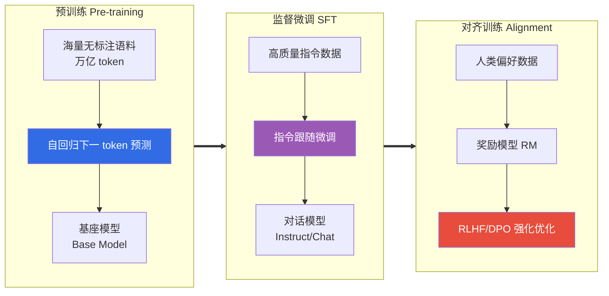
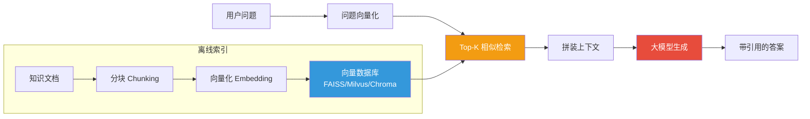
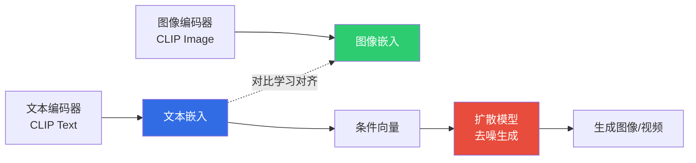

# 4.2 大模型与生成式AI技术

> [!abstract] 本节导读
> 本节解决"大模型如何工作、如何被有效使用并生成多模态内容"的问题。从 Transformer 架构的自注意力机制出发，梳理 GPT、BERT、LLaMA 三类大语言模型的差异与训练范式；进而阐述 Prompt 工程（zero-shot、few-shot、Chain-of-Thought）与 RAG 检索增强生成如何激发并约束大模型能力；最后延伸至 DALL-E、Stable Diffusion 等多模态生成模型。本节是 [[4.1 AI技术体系与赋能框架]] 的算法前沿，也是 [[4.3 AI工程化与行业落地]] 的模型基础。

## 一、Transformer 架构

Transformer 由 Vaswani 等人在 2017 年《Attention is All You Need》中提出，摒弃了 RNN 的循环结构，完全基于自注意力机制实现序列建模，是现代大模型的统一基石。

### 1.1 自注意力机制

自注意力（Self-Attention）让序列中每个位置都能直接关注其他所有位置，建模长程依赖能力远超 RNN。其核心是 Scaled Dot-Product Attention：

$$
\text{Attention}(Q, K, V) = \text{softmax}\!\left(\frac{QK^{\top}}{\sqrt{d_k}}\right) V
$$

其中 $Q$（查询）、$K$（键）、$V$（值）均由输入 $X$ 经线性变换得到：$Q = XW_Q,\ K = XW_K,\ V = XW_V$。$\sqrt{d_k}$ 用于缓解点积随维度增大而放大梯度消失的问题。

多头注意力（Multi-Head Attention）将 $Q/K/V$ 投影到 $h$ 个子空间并行计算注意力后拼接，使模型能从不同表示子空间联合建模：

$$
\text{MultiHead}(Q,K,V) = \text{Concat}(\text{head}_1, \dots, \text{head}_h) W^O
$$

### 1.2 Transformer 整体结构

```mermaid
graph TD
    subgraph Enc["编码器 Encoder（BERT 类）"]
        EI[输入序列 Token Embedding<br/>+ 位置编码] --> EA[多头自注意力]
        EA --> EADD[残差 + LayerNorm]
        EADD --> EFF[前馈网络 FFN]
        EFF --> EOUT[残差 + LayerNorm]
    end

    subgraph Dec["解码器 Decoder（GPT 类）"]
        DI[目标序列 Embedding<br/>+ 位置编码] --> DM[掩码多头自注意力<br/>Masked Attention]
        DM --> DADD[残差 + LayerNorm]
        DADD --> DC[编码-解码交叉注意力]
        DC --> DFF[前馈网络 FFN]
        DFF --> DOUT[残差 + LayerNorm]
    end

    style EA fill:#326ce5,color:#fff
    style DM fill:#e74c3c,color:#fff
    style DC fill:#f39c12,color:#fff
```



> [!important] 三类注意力
> - **自注意力**：Q/K/V 来自同一序列，建模序列内部依赖
> - **掩码自注意力**：解码时屏蔽未来位置，保证自回归生成不"偷看"未来
> - **交叉注意力**：Q 来自解码端，K/V 来自编码端，用于 seq2seq 交互

## 二、大语言模型（LLM）

大语言模型指参数规模达百亿至万亿级、在海量语料上预训练的语言模型。其核心能力是"预训练-微调"范式带来的通用语言理解与生成能力。

### 2.1 三类代表模型对比

| 维度 | GPT 系列 | BERT 系列 | LLaMA 系列 |
|-----|---------|-----------|-----------|
| **架构** | 仅解码器（Decoder-only） | 仅编码器（Encoder-only） | 仅解码器（Decoder-only） |
| **训练目标** | 自回归语言建模 $P(x_t\|x_{<t})$ | 掩码语言建模（MLM）+ 下一句预测 | 自回归语言建模 |
| **方向** | 单向（从左到右） | 双向 | 单向 |
| **擅长** | 文本生成、对话、代码 | 文本理解、分类、抽取 | 开源可定制、研究友好 |
| **代表** | GPT-3、GPT-4、ChatGPT | BERT、RoBERTa、DeBERTa | LLaMA 2/3、Alpaca、Vicuna |
| **开源** | 闭源 API | 权重开源 | 权重开源 |

> [!note] Encoder-only vs Decoder-only 的本质
> - **Encoder-only（BERT）**：双向注意力，看到完整上下文，适合"理解"任务（分类、抽取），但不擅长生成
> - **Decoder-only（GPT）**：单向掩码注意力，天然适合"生成"任务，逐 token 自回归
> 大模型时代因"生成即通用接口"的趋势，Decoder-only 架构成为主流（GPT、LLaMA、Claude 均为 Decoder-only）。

### 2.2 LLM 训练流程



| 阶段 | 目标 | 数据 | 产出 |
|-----|------|------|------|
| **预训练** | 学习语言与世界知识 | 万亿级无标注语料 | 基座模型（Base） |
| **SFT（监督微调）** | 学会跟随指令 | 万~百万级指令-回答对 | 对话模型（Instruct） |
| **对齐（RLHF/DPO）** | 对齐人类偏好，降低有害输出 | 人类偏好排序数据 | 对齐模型（Chat） |

> [!important] RLHF 与 DPO
> - **RLHF（Reinforcement Learning from Human Feedback）**：训练奖励模型拟合人类偏好，再用 PPO 等强化学习优化策略模型
> - **DPO（Direct Preference Optimization）**：直接用偏好数据优化策略，省略显式奖励模型与强化学习，工程更简单
> 两者都用于让模型输出更"有用、诚实、无害"（HHH）。

## 三、Prompt 工程

Prompt 工程是通过设计输入提示引导大模型输出期望结果的方法论，是使用大模型的核心技能。

### 3.1 三种核心范式

| 范式 | 英文 | 工作方式 | 适用场景 |
|-----|------|---------|---------|
| **零样本** | Zero-shot | 仅给指令，不提供示例 | 通用任务、能力测试 |
| **少样本** | Few-shot | 在 Prompt 中提供少量输入-输出示例 | 任务模式特定、需稳定输出格式 |
| **思维链** | Chain-of-Thought, CoT | 引导模型"一步步思考"再给答案 | 数学推理、多步逻辑、复杂决策 |

### 3.2 Prompt 示例

```text
# 示例 1：Zero-shot 情感分类
请判断下面评论的情感倾向（正向/负向），只输出标签：
"这家店上菜太慢，菜品味道也一般。"
# 期望输出：负向

# 示例 2：Few-shot 信息抽取
从句子中抽取"实体-关系"三元组，参考以下示例：
输入："苹果公司总部位于库比蒂诺。" 输出：[苹果公司, 总部位于, 库比蒂诺]
输入："马斯克创立了 SpaceX。" 输出：[马斯克, 创立了, SpaceX]
输入："清华大学坐落于北京。" 输出：

# 示例 3：Chain-of-Thought 数学推理
小明有 12 个苹果，送给小红一半，又从树上摘了 8 个，最后吃掉 3 个。
请一步一步思考，然后给出最终数量。
# 引导：先算送出后剩余 12/2=6；再算摘取后 6+8=14；最后算吃掉后 14-3=11。
```

> [!tip] CoT 的价值与变体
> CoT 通过让模型显式输出中间推理步骤，显著提升数学、逻辑、规划类任务准确率。常见变体：
> - **Zero-shot CoT**：在 Prompt 末尾加"让我们一步一步思考"
> - **Self-Consistency**：采样多条推理链，对最终答案投票
> - **Tree-of-Thoughts（ToT）**：构建推理树，支持回溯与搜索

## 四、RAG：检索增强生成

RAG（Retrieval-Augmented Generation）通过在生成前检索外部知识库，将相关片段作为上下文注入 Prompt，从而缓解大模型的幻觉、过时与领域知识不足问题。

### 4.1 RAG 工作流程



### 4.2 RAG 的核心组件

| 组件 | 作用 | 代表技术 |
|-----|------|---------|
| **文档分块** | 将长文档切分为可检索的语义块 | 滑窗、按段落、按语义 |
| **嵌入模型** | 将文本映射为向量 | BGE、text-embedding-ada-002、M3E |
| **向量数据库** | 存储与近似最近邻检索 | Milvus、FAISS、Chroma、Pinecone |
| **检索策略** | 召回相关片段 | 稠密检索、稀疏检索（BM25）、混合检索、重排序 |
| **生成模型** | 基于上下文生成答案 | GPT-4、Claude、文心一言、通义千问 |

> [!important] RAG vs 微调
> - **RAG**：适合知识频繁更新、需引用来源、领域知识庞大的场景（如企业知识库问答）
> - **微调**：适合改变模型风格、领域表达方式、固定任务模式的场景
> 两者并非互斥，可组合使用：先微调领域适配，再用 RAG 注入实时知识。

### 4.3 示例：最小 RAG 流程

```python
# 最小 RAG 演示：基于 Chroma 向量库 + OpenAI 风格 LLM
# 运行环境：Python 3.10，依赖：pip install chromadb sentence-transformers
import chromadb
from chromadb.utils import embedding_functions

# 1. 构建向量库并写入知识片段
client = chromadb.Client()
ef = embedding_functions.SentenceTransformerEmbeddingFunction(model_name="BAAI/bge-small-zh")
collection = client.create_collection(name="kb", embedding_function=ef)

docs = [
    "Transformer 由 Vaswani 等人在 2017 年提出，基于自注意力机制。",
    "GPT 是 Decoder-only 架构，采用自回归语言建模训练。",
    "RAG 通过检索外部知识库缓解大模型幻觉问题。",
]
collection.add(documents=docs, ids=["d1", "d2", "d3"])

# 2. 检索 Top-K 相关片段
query = "RAG 解决什么问题？"
results = collection.query(query_texts=[query], n_results=2)
context = "\n".join(results["documents"][0])

# 3. 拼装 Prompt 交由 LLM 生成（伪代码，需替换为实际 LLM 调用）
prompt = f"根据以下资料回答问题，并在答案中引用资料编号。\n资料：\n{context}\n\n问题：{query}\n答案："
print(prompt)
# 后续：llm.generate(prompt) -> 输出带引用的答案
```

## 五、多模态生成 AI

多模态 AI 实现跨文本、图像、音频、视频的统一理解与生成。本节聚焦文本生成图像与文本生成视频两类典型生成任务。

### 5.1 文本生成图像

| 模型 | 技术路线 | 特点 |
|-----|---------|------|
| **DALL-E / DALL-E 2** | 自回归 + 扩散 | OpenAI 闭源，文本理解强 |
| **Stable Diffusion** | 潜空间扩散模型（LDM） | 开源权重，社区生态丰富，可本地部署 |
| **Midjourney** | 扩散模型 | 艺术风格突出，以服务形式提供 |
| **文心一格 / 通义万相** | 扩散模型 | 国产中文优化 |

> [!note] 扩散模型原理概要
> 扩散模型（Diffusion Model）通过两个过程建模生成：
> - **前向扩散**：逐步对图像加噪，最终变为纯高斯噪声：$q(x_t\|x_{t-1}) = \mathcal{N}(x_t;\, \sqrt{1-\beta_t}x_{t-1},\, \beta_t \mathbf{I})$
> - **反向去噪**：训练神经网络预测噪声，从纯噪声逐步去噪还原图像
> Stable Diffusion 在潜空间（Latent Space）而非像素空间执行扩散，大幅降低计算成本，是开源文生图的主流方案。

### 5.2 文本生成视频

文本生成视频在文生图基础上引入时间维度建模，核心挑战是时序一致性与计算成本。代表工作包括 Sora（OpenAI）、Runway Gen-2、Stable Video Diffusion、可灵（快手）等。其技术路径多采用"时空扩散 Transformer + 文本条件控制"。

### 5.3 多模态对齐

多模态生成的关键是将不同模态映射到统一语义空间：



> [!summary] 本节要点回顾
> 1. **Transformer**：基于自注意力 $QK^T/\sqrt{d_k}$ 与多头机制，是现代大模型统一基石；三类注意力为自、掩码、交叉注意力
> 2. **LLM 三类**：GPT（Decoder-only，自回归生成）、BERT（Encoder-only，双向理解）、LLaMA（开源 Decoder-only）；预训练→SFT→RLHF/DPO 三阶段训练
> 3. **Prompt 工程**：zero-shot 通用、few-shot 稳格式、CoT 强推理；CoT 变体含 Self-Consistency、ToT
> 4. **RAG**：检索+生成缓解幻觉与过时，组件含分块、嵌入、向量库、检索、生成；与微调互补
> 5. **多模态生成**：扩散模型是主流，Stable Diffusion 在潜空间扩散降本；CLIP 实现图文对齐；文生视频引入时序建模

## 关联知识点

| 关联知识点 | 关系 |
|-----------|------|
| [[4.1 AI技术体系与赋能框架]] | 本节大模型是 AI 技术栈的前沿模型层 |
| [[4.3 AI工程化与行业落地]] | 本节大模型的工程压缩与行业部署 |
| [[人工智能与前沿技术/人工智能技术/知识点/第8章-自然语言处理NLP/8.3-Transformer与BERT]] | Transformer 与 BERT 基础原理 |
| [[人工智能与前沿技术/人工智能技术/知识点/第10章-生成式大模型与AIGC/10.1-GPT系列模型]] | GPT 系列模型深入展开 |
| [[人工智能与前沿技术/人工智能技术/知识点/第10章-生成式大模型与AIGC/10.2-扩散模型与生成图像]] | 扩散模型与生成图像深入展开 |
| [[第3章 大数据前沿技术/3.3 数据中台与智能数据分析]] | RAG 的知识库与向量检索底座 |
| [[MOC - 第4章]] | 返回本章导航 |
