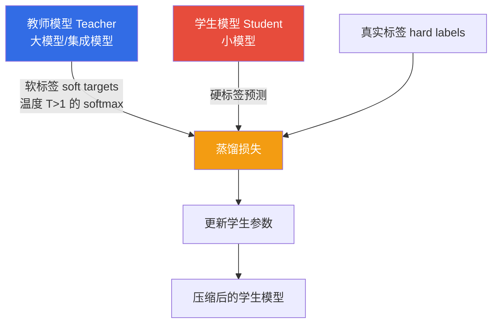
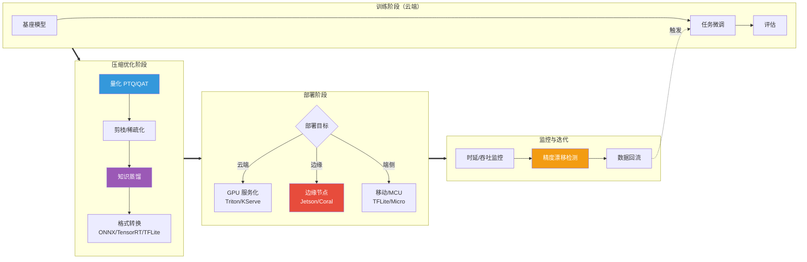

# 4.3 AI工程化与行业落地

> [!abstract] 本节导读
> 本节解决"大模型如何被压缩部署到资源受限环境，并安全落地到千行百业"的问题。从模型压缩三件套（量化、剪枝、蒸馏）出发，阐述边缘 AI 的部署策略与挑战；进而聚焦自动驾驶、智能制造、医疗影像三类典型行业落地；最后讨论 AI 伦理与安全的风险与治理。本节是 [[4.2 大模型与生成式AI技术]] 的工程化延伸，也是与 [[第5章 物联网与边缘智能技术/MOC - 第5章]] 衔接的桥梁。

## 一、AI 工程化的挑战

大模型动辄百亿参数、GB 级显存占用，而真实部署环境（手机、车机、IoT 设备）算力、内存、功耗均受限。AI 工程化的核心目标是在精度损失可控的前提下，把模型"塞进"资源受限设备并满足时延/吞吐/成本约束。

| 部署约束 | 典型阈值 | 受影响场景 |
|---------|---------|-----------|
| **显存/内存** | < 4GB（手机）、< 1GB（MCU） | 模型加载、批处理 |
| **推理时延** | 毫秒级（自动驾驶）、百毫秒级（对话） | 实时交互 |
| **功耗** | 瓦级（电池设备） | 续航、散热 |
| **带宽** | 弱网/离线 | 端侧推理 vs 云端推理 |
| **成本** | 单次推理费用 | 商业可持续 |

## 二、模型压缩三件套

模型压缩是在精度与体积间权衡的工程方法，主流包括量化、剪枝、蒸馏三类，常组合使用。

### 2.1 三类方法对比

| 方法 | 原理 | 压缩比 | 精度损失 | 工程难度 |
|-----|------|--------|---------|---------|
| **量化（Quantization）** | 降低权重/激活的数值精度 | 4×~8× | 中 | 中 |
| **剪枝（Pruning）** | 移除冗余权重或通道 | 2×~10× | 低~中 | 中~高 |
| **知识蒸馏（Distillation）** | 用大模型（教师）训练小模型（学生） | 由学生定 | 低 | 中 |

### 2.2 量化

量化将模型权重从 FP32（32 位浮点）降到 INT8 或 INT4，直接缩减存储与计算开销。

> [!important] 量化的关键概念
> - **PTQ（Post-Training Quantization，训练后量化）**：训练完成后用少量校准数据统计激活范围，直接量化，速度快但精度损失略大
> - **QAT（Quantization-Aware Training，量化感知训练）**：在训练中模拟量化误差，精度更高但需重新训练
> - **量化公式**：$q = \text{round}\!\left(\frac{x}{s}\right) + z$，其中 $s$ 为缩放因子，$z$ 为零点

### 2.3 剪枝

剪枝移除对输出贡献小的权重或结构，分为非结构化剪枝（逐权重，稀疏但不利于硬件加速）与结构化剪枝（按通道/层，硬件友好）。

### 2.4 知识蒸馏

知识蒸馏让"学生"小模型模仿"教师"大模型的输出分布（软标签），在保持接近教师精度的同时大幅降低参数规模。代表性应用：DistilBERT 将 BERT 压缩 40% 参数，保留 97% 性能。

> [!note] 蒸馏的损失函数
> 蒸馏损失结合软标签 KL 散度与硬标签交叉熵：
> $$\mathcal{L} = \alpha \cdot T^2 \cdot \mathrm{KL}(p_T^{\tau} \| p_S^{\tau}) + (1-\alpha) \cdot \mathrm{CE}(y, p_S)$$
> 其中 $\tau$ 为温度，$T^2$ 用于补偿温度对梯度尺度的缩放。

## 三、边缘 AI

边缘 AI 指将 AI 推理部署在边缘设备（手机、车机、IoT 网关、摄像头）上，实现低时延、隐私本地化、节省带宽。

### 3.1 边缘 AI 部署策略

| 策略 | 描述 | 适用场景 |
|-----|------|---------|
| **端侧推理** | 模型完全在设备上运行 | 隐私敏感、离线、低时延（人脸解锁） |
| **边侧推理** | 模型在边缘网关/边缘服务器运行 | 多设备汇聚、中等算力（智慧门店） |
| **云边协同** | 大模型云上、小模型边端，按需卸载 | 复杂任务分级处理（自动驾驶感知） |
| **模型分割** | 模型按层切分，端边云协作推理 | 显存不足或算力不均 |

### 3.2 边缘 AI 部署工具链

| 工具 | 厂商 | 特点 |
|-----|------|------|
| **TensorRT** | NVIDIA | GPU 推理加速，层融合、INT8 量化 |
| **ONNX Runtime** | 微软 | 跨平台、跨框架推理引擎 |
| **TFLite / TFLite Micro** | Google | 移动端与 MCU 端轻量推理 |
| **OpenVINO** | Intel | CPU/iGPU/VPU 优化推理 |
| **Triton Inference Server** | NVIDIA | 多模型多框架服务化 |

## 四、AI 工程化工作流

## 五、行业落地典型场景

### 5.1 自动驾驶

自动驾驶是 AI 工程化的集大成场景，对时延、安全、冗余要求极高。

- **感知**：多摄像头 + 激光雷达 + 毫米波雷达融合，目标检测、车道线、可行驶区域
- **预测**：预测他车/行人未来轨迹
- **规划与控制**：路径规划、行为决策、横纵向控制
- **工程约束**：感知时延 < 100ms，功能安全 ASIL-D，车规级芯片（NVIDIA Orin、地平线征程、华为 MDC）

> [!warning] 自动驾驶的安全冗余
> 自动驾驶要求"失效降级"而非"失效即停"。典型冗余包括：感知冗余（多传感器互备）、计算冗余（双 SoC 互为热备）、电源与制动冗余。这是 AI 在安全关键场景落地的核心工程要求。

### 5.2 智能制造

| 应用 | 技术栈 | 价值 |
|-----|--------|------|
| **表面缺陷检测** | CV（YOLO/分割模型） + 边缘部署 | 替代人工质检，检出率与一致性提升 |
| **预测性维护** | 时序异常检测 + 振动/温度信号 | 提前预警故障，减少非计划停机 |
| **工艺优化** | 强化学习 / 数字孪生 | 参数寻优，降低能耗与不良率 |
| **视觉引导机器人** | 3D 视觉 + 抓取规划 | 柔性分拣、上下料 |

### 5.3 医疗影像

医疗影像 AI 已在肺结节、糖网、骨折、病理切片等场景获批三类医疗器械证。其工程化关键在于：

- **数据合规**：患者隐私保护、数据脱敏、跨院数据治理
- **可解释性**：医生需理解模型判断依据（如 Grad-CAM 热力图）
- **监管审批**：医疗器械软件（SaMD）需通过临床试验与注册审查
- **泛化性**：跨设备、跨人群的模型鲁棒性

## 六、AI 伦理与安全

> [!important] AI 伦理的核心议题
> - **公平性（Fairness）**：模型不应基于种族、性别、地域等产生歧视性决策
> - **可解释性（Explainability）**：高风险决策需可被人类理解与追溯
> - **隐私保护（Privacy）**：训练与推理中保护个人数据，技术如差分隐私、联邦学习
> - **鲁棒性（Robustness）**：抵抗对抗样本、分布外样本、数据投毒攻击
> - **价值对齐（Alignment）**：模型行为符合人类意图与价值观，避免有害输出
> - **问责（Accountability）**：明确 AI 决策失败时的责任归属

### 6.1 典型安全风险

| 风险 | 描述 | 缓解手段 |
|-----|------|---------|
| **对抗样本** | 微小扰动使模型误判 | 对抗训练、输入净化 |
| **数据投毒** | 训练阶段注入恶意样本 | 数据清洗、来源审计 |
| **模型抽取** | 通过 API 查询窃取模型 | 查询限速、输出扰动 |
| **成员推断** | 推断某样本是否在训练集 | 差分隐私训练 |
| **提示注入** | 构造恶意 Prompt 绕过安全约束 | 输入过滤、对齐训练 |

### 6.2 治理框架

AI 治理已从"自律"走向"合规"。代表性法规与框架：欧盟《AI 法案》（AI Act）按风险分级监管、中国《生成式人工智能服务管理暂行办法》、NIST AI RMF 风险管理框架。核心趋势是"全生命周期治理"——覆盖数据采集、模型训练、部署上线、监控反馈各环节。

> [!summary] 本节要点回顾
> 1. **AI 工程化目标**：在精度损失可控下满足显存、时延、功耗、成本约束
> 2. **模型压缩三件套**：量化（PTQ/QAT 降数值精度）、剪枝（移除冗余）、蒸馏（教师教学生），常组合使用
> 3. **边缘 AI**：端侧/边侧/云边协同/模型分割四种策略；工具链含 TensorRT、ONNX Runtime、TFLite、OpenVINO
> 4. **行业落地**：自动驾驶（感知-预测-规划，安全冗余 ASIL-D）、智能制造（缺陷检测/预测维护）、医疗影像（合规/可解释/监管）
> 5. **AI 伦理安全**：公平、可解释、隐私、鲁棒、对齐、问责六议题；治理走向全生命周期合规

## 关联知识点

| 关联知识点 | 关系 |
|-----------|------|
| [[4.1 AI技术体系与赋能框架]] | 本节 MLOps 的工程化深化 |
| [[4.2 大模型与生成式AI技术]] | 本节压缩与部署的模型来源 |
| [[第5章 物联网与边缘智能技术/MOC - 第5章]] | 边缘 AI 在物联网与端云协同的延伸 |
| [[第5章 物联网与边缘智能技术/5.2 边缘智能与端云协同]] | 边缘 AI 硬件与端云协同深入展开 |
| [[人工智能与前沿技术/人工智能技术/知识点/第11章-人工智能伦理安全与行业规范/11.1-AI伦理与公平性]] | AI 伦理深入展开 |
| [[人工智能与前沿技术/人工智能技术/知识点/第11章-人工智能伦理安全与行业规范/11.2-AI安全与对抗攻击]] | AI 安全与对抗攻击深入展开 |
| [[人工智能与前沿技术/嵌入式系统/知识点/第8章-嵌入式AI部署/8.1-边缘计算与轻量化模型]] | MCU 端 AI 部署基础 |
| [[MOC - 第4章]] | 返回本章导航 |
