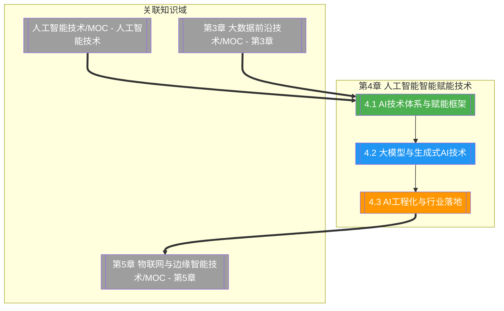

# 第4章 人工智能智能赋能技术

> [!abstract] 章节概述
> 本章在 [[1.1 前沿技术定义、特征与技术体系]] 的 ABCD5G 体系框架下，深入展开 A（AI）技术域的前沿方向与赋能机制。从 AI 技术体系与赋能框架（数据+算法+算力+场景）出发，系统阐述大模型与生成式 AI 的核心技术——Transformer、LLM、Prompt 工程、RAG 与多模态生成；进而聚焦 AI 工程化与行业落地，覆盖模型压缩、边缘部署、自动驾驶、智能制造、医疗影像等场景与 AI 伦理安全。本章揭示 AI 从"模型算法"走向"工程化赋能"的演进规律，与 [[人工智能与前沿技术/人工智能技术/MOC - 人工智能技术]] 的算法基础形成协同，为 [[第5章 物联网与边缘智能技术/MOC - 第5章]] 的端云协同智能奠定基础。

## 学习路线图

## 知识点导航

| 编号 | 知识点 | 核心内容 | 重要程度 |
|-----|--------|---------|---------|
| 4.1 | [[4.1 AI技术体系与赋能框架]] | AI技术栈、赋能框架四要素、AIaaS、MLOps | ⭐⭐⭐⭐ |
| 4.2 | [[4.2 大模型与生成式AI技术]] | Transformer、LLM、Prompt工程、RAG、多模态AI | ⭐⭐⭐⭐⭐ |
| 4.3 | [[4.3 AI工程化与行业落地]] | 模型压缩量化蒸馏、边缘AI、行业落地、AI伦理安全 | ⭐⭐⭐⭐ |

## 核心概念速览

> [!tip] 本章必须掌握的核心概念
> - **AI 赋能四要素**：数据（Data）+ 算法（Algorithm）+ 算力（Compute）+ 场景（Scenario），构成 AI 落地的完整闭环
> - **AIaaS（AI as a Service）**：将 AI 能力以 API 形式经云端交付，降低 AI 使用门槛
> - **MLOps**：机器学习生命周期管理，覆盖数据、训练、部署、监控、再训练的闭环
> - **Transformer**：基于自注意力机制的通用序列建模架构，是现代大模型的基石
> - **LLM（大语言模型）**：参数规模达百亿至万亿级的语言模型，代表 GPT、BERT、LLaMA 系列
> - **Prompt 工程**：通过设计输入提示引导大模型输出，含 zero-shot、few-shot、CoT 等范式
> - **RAG（检索增强生成）**：结合外部知识库检索与生成模型，缓解幻觉、补充最新知识
> - **多模态 AI**：跨文本、图像、音频、视频的统一理解与生成，如 DALL-E、Stable Diffusion
> - **模型压缩**：通过量化、蒸馏、剪枝降低模型体积与推理成本
> - **边缘 AI**：在边缘设备上部署 AI 推理，实现低时延、隐私本地化
> - **AI 伦理与安全**：覆盖公平性、可解释性、隐私保护、对抗鲁棒性与价值对齐

## 核心考点

> [!important] 期末高频考点

| 考点 | 所属知识点 | 考查形式 | 难度 |
|-----|-----------|---------|------|
| AI 赋能四要素及相互关系 | 4.1 | 简答题/选择题 | ★★ |
| AIaaS 服务模式与典型能力 | 4.1 | 简答题 | ★★★ |
| MLOps 生命周期与核心环节 | 4.1 | 简答题/论述题 | ★★★★ |
| Transformer 自注意力机制原理 | 4.2 | 论述题/简答题 | ★★★★★ |
| GPT 与 BERT 架构与训练范式对比 | 4.2 | 对比题/论述题 | ★★★★ |
| Prompt 工程的 zero/few-shot 与 CoT | 4.2 | 简答题/案例分析 | ★★★★ |
| RAG 工作流程与价值 | 4.2 | 简答题/论述题 | ★★★★ |
| 多模态生成模型原理与代表 | 4.2 | 简答题 | ★★★ |
| 模型量化与知识蒸馏的区别 | 4.3 | 对比题/简答题 | ★★★★ |
| 边缘 AI 部署的挑战与策略 | 4.3 | 论述题/案例分析 | ★★★★ |
| AI 行业落地典型场景分析 | 4.3 | 案例分析 | ★★★ |
| AI 伦理风险与治理原则 | 4.3 | 论述题 | ★★★ |

## 自测题

> [!question] 章节自测
> 1. 阐述 AI 赋能四要素（数据、算法、算力、场景）的内涵与相互关系，并结合 MLOps 说明企业如何实现 AI 模型从训练到上线再到持续优化的全生命周期闭环。
> 2. 说明 Transformer 自注意力机制的计算过程，对比 GPT（自回归解码）与 BERT（掩码编码）在架构与训练目标上的差异，并分析它们各自适合的下游任务。
> 3. 解释 Prompt 工程中 zero-shot、few-shot、Chain-of-Thought 三种范式的工作方式与适用场景；进而阐述 RAG 如何通过"检索+生成"缓解大模型幻觉问题，并绘制 RAG 的典型流程图。
> 4. 论述模型量化与知识蒸馏的原理及区别，分析边缘 AI 部署的主要挑战（算力、内存、功耗、网络），并结合自动驾驶或医疗影像场景说明 AI 工程化落地的关键环节与伦理考量。

## 章节导航

| 方向 | 链接 |
|-----|------|
| ⬆ 返回课程总览 | [[MOC - 专业前沿技术]] |
| ⬅ 上一章 | [[第3章 大数据前沿技术/MOC - 第3章]] |
| ➡ 下一章 | [[第5章 物联网与边缘智能技术/MOC - 第5章]] |

## 关联知识

- [[人工智能与前沿技术/人工智能技术/MOC - 人工智能技术]] - AI 算法与模型体系深入展开的单科课程
- [[第3章 大数据前沿技术/MOC - 第3章]] - AI 赋能的数据底座与智能分析
- [[第5章 物联网与边缘智能技术/MOC - 第5章]] - 边缘 AI 与端云协同的延伸
- [[1.1 前沿技术定义、特征与技术体系]] - ABCD5G 体系中 A（AI）的定位
