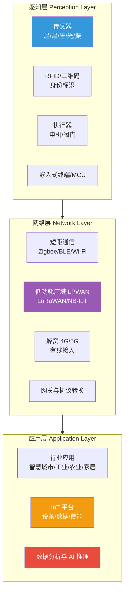
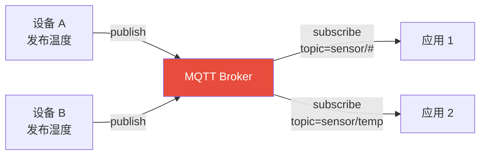
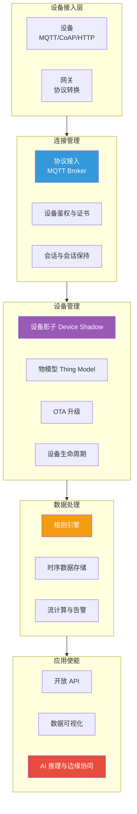

# 5.1 物联网体系架构与通信协议

> [!abstract] 本节导读
> 本节解决"海量物联终端如何被分层组织并经何种协议互联"的问题。从物联网三层架构（感知—网络—应用）入手明确各层职责；系统对比 MQTT、CoAP、LoRaWAN、NB-IoT、Zigbee、BLE 六类主流通信协议的定位与适用场景；进而阐述 IoT 平台的连接管理、设备管理、数据处理与使能能力。本节是物联网的体系纲领，为 [[5.2 边缘智能与端云协同]] 的智能下沉与 [[5.3 工业互联网与数字孪生基础]] 的工业落地奠定基础。

## 一、物联网三层架构

物联网（Internet of Things, IoT）通过传感器、RFID、通信模组将物理世界对象连接到网络，实现"万物互联"与数据驱动决策。其经典体系结构为感知层、网络层、应用层三层。



### 1.1 各层职责

| 层级 | 职责 | 代表技术 |
|-----|------|---------|
| **感知层** | 采集物理世界信息、标识物体、执行控制 | 传感器、RFID、二维码、MCU、执行器 |
| **网络层** | 把感知数据可靠传输到平台，支持异构网络互联 | 短距（Zigbee/BLE/Wi-Fi）、LPWAN（LoRaWAN/NB-IoT）、蜂窝（4G/5G）、网关 |
| **应用层** | 数据处理、业务逻辑、行业应用与智能决策 | IoT 平台、大数据分析、AI 推理、行业 SaaS |

> [!note] 四层与七层架构变体
> 业界除三层架构外，还常见"感知—网络—平台—应用"四层架构（把 IoT 平台独立成层），以及更细的七层参考模型。本节沿用主流三层架构，平台能力并入应用层叙述。分层只是观察视角，本质都是"采集—传输—处理—应用"的数据流。

## 二、主流通信协议

物联网通信协议按传输距离与功耗可分为短距局域、低功耗广域（LPWAN）、蜂窝三大类。

### 2.1 协议全景对比

| 协议 | 类别 | 介质/频段 | 速率 | 距离 | 功耗 | 典型场景 |
|-----|------|---------|------|------|------|---------|
| **MQTT** | 应用层消息协议 | 承载于 TCP/IP | 中~高 | 依赖底层 | 中 | 平台消息总线、设备到云 |
| **CoAP** | 应用层受限协议 | UDP | 低 | 依赖底层 | 低 | 受限设备 RESTful 通信 |
| **LoRaWAN** | LPWAN | Sub-GHz 免授权 | 低（<50 kbps） | 远（2~15 km） | 极低 | 抄表、农业、户外监测 |
| **NB-IoT** | LPWAN 蜂窝 | 授权蜂窝频段 | 低（~250 kbps） | 远（1~10 km） | 极低 | 智能表计、共享单车、井盖 |
| **Zigbee** | 短距局域 | 2.4 GHz | 中（250 kbps） | 短（10~100 m） | 低 | 智能家居 Mesh、楼宇 |
| **BLE** | 短距局域 | 2.4 GHz | 中~高 | 短（10~50 m） | 低 | 可穿戴、健康设备、信标 |

### 2.2 MQTT：发布/订阅消息协议

MQTT（Message Queuing Telemetry Transport）是 IBM 提出的轻量级发布/订阅消息协议，专为带宽有限、网络不稳定的物联网场景设计，已成为事实标准。



| 核心概念 | 说明 |
|---------|------|
| **Broker** | 消息中介，接收发布并按主题分发给订阅者 |
| **Topic** | 主题层级，支持通配符 `+`/`#`，如 `home/room1/temp` |
| **QoS** | 服务质量：0 至多一次、1 至少一次、2 恰好一次 |
| **Retained** | 保留消息，新订阅者立即收到最后一条 |
| **Last Will** | 遗嘱消息，设备异常断开时由 Broker 发布 |

> [!important] MQTT QoS 三级语义
> - **QoS 0**：至多一次（发即忘），不保证送达，开销最小
> - **QoS 1**：至少一次，通过 PUBACK 确认，可能重复，需业务幂等
> - **QoS 2**：恰好一次，通过四步握手（PUBREC/PUBREL/PUBCOMP）保证不丢不重，开销最大
> 选型原则：低价值遥测用 QoS 0，普通业务用 QoS 1，计费/控制指令用 QoS 2。

### 2.3 CoAP：受限设备 RESTful 协议

CoAP（Constrained Application Protocol）是 IETF 为受限设备设计的 Web 协议，基于 UDP，类似 HTTP 的 REST 风格（GET/POST/PUT/DELETE），支持资源发现与组播。

> [!tip] MQTT vs CoAP 选型
> - **MQTT**：长连接、发布订阅、QoS 保障，适合"多设备汇聚到平台"的星型场景
> - **CoAP**：无连接、RESTful、资源发现，适合"端到端直接交互"或受限 M2M 场景
> 二者也可组合：端侧用 CoAP，网关汇聚后转 MQTT 上云。

### 2.4 LoRaWAN：低功耗广域网

LoRaWAN 基于 LoRa 物理层调制技术，采用星型拓扑：终端 → 网关 → 网络服务器 → 应用服务器。

| 终端类别 | 唤醒时机 | 时延 | 典型用途 |
|---------|---------|------|---------|
| **Class A** | 发送后才接收 | 高 | 抄表（功耗最低） |
| **Class B** | 按约定时隙接收 | 中 | 需定时下行 |
| **Class C** | 持续接收 | 低 | 阀控、告警 |

### 2.5 NB-IoT：蜂窝物联网

NB-IoT（Narrow Band IoT）由 3GPP 标准化，运行于授权蜂窝频段，运营商部署。其核心特性：广覆盖（比 GSM 提升 20dB）、低功耗（电池寿命可达 10 年）、大连接（单小区 5 万设备）、低成本模组。典型应用于智能表计、共享单车、智慧井盖、烟感等。

### 2.6 Zigbee 与 BLE：短距局域

| 维度 | Zigbee | BLE（蓝牙低功耗） |
|-----|--------|------------------|
| **组网** | 全 Mesh 网状网 | 星型/点对点（BLE Mesh 较弱） |
| **节点数** | 大（数百~上千） | 小 |
| **优势** | 自愈合 Mesh、家控制标准 | 手机生态好、传输速率较高 |
| **典型** | 智能家居灯控、楼宇传感 | 可穿戴、健康、信标定位 |

## 三、IoT 平台架构

IoT 平台是连接设备与行业应用的中枢，承担连接管理、设备管理、数据处理与使能能力。



### 3.1 核心能力

| 能力 | 说明 |
|-----|------|
| **连接管理** | 多协议接入（MQTT/CoAP/HTTP）、设备鉴权、会话管理 |
| **设备管理** | 设备注册、分组、生命周期、OTA 固件升级 |
| **设备影子** | 缓存设备期望与实际状态，解决设备离线时控制问题 |
| **物模型** | 定义设备属性、服务、事件的标准化 schema |
| **规则引擎** | SQL 风格规则，将数据路由到数据库、函数或告警 |
| **时序存储** | 高写入吞吐的时序数据库（TSDB）存储遥测数据 |
| **开放 API** | 供行业应用调用设备能力与数据 |

> [!important] 设备影子（Device Shadow）的价值
> 物联网设备常处于弱网或休眠状态，应用下发指令时设备可能离线。设备影子在云端维护一份"期望状态"与"实际状态"的 JSON 镜像：应用写期望状态，设备上线后拉取并报告实际状态，平台据此触发规则。这是云控设备的核心机制。

## 四、示例：MQTT 发布订阅

```python
# 使用 paho-mqtt 演示 MQTT 发布与订阅
# 运行环境：Python 3.10，依赖：pip install paho-mqtt
# 需先启动一个 MQTT Broker，如本地 mosquitto（默认 1883 端口）
import paho.mqtt.client as mqtt
import json
import time

BROKER = "127.0.0.1"
PORT = 1883
TOPIC = "home/room1/temp"

# 订阅端：收到消息的回调
def on_message(client, userdata, msg):
    payload = json.loads(msg.payload.decode())
    print(f"[订阅] topic={msg.topic}, payload={payload}")

sub = mqtt.Client(client_id="subscriber-1")
sub.on_message = on_message
sub.connect(BROKER, PORT, keepalive=60)
sub.subscribe(TOPIC, qos=1)  # QoS 1：至少一次
sub.loop_start()

# 发布端：每秒上报一次温度
pub = mqtt.Client(client_id="publisher-1")
pub.connect(BROKER, PORT, keepalive=60)

for i in range(3):
    payload = json.dumps({"temp": 23.5 + i * 0.1, "ts": int(time.time())})
    pub.publish(TOPIC, payload, qos=1)
    print(f"[发布] {payload}")
    time.sleep(1)

sub.loop_stop()
```

```bash
# 使用 mosquitto 启动本地 MQTT Broker（Windows 可下载 mosquitto.exe）
# 工作目录：任意；监听默认 1883 端口
mosquitto -v -p 1883
# 另开终端用命令行订阅/发布验证：
mosquitto_sub -h 127.0.0.1 -t "home/room1/temp" -q 1
mosquitto_pub -h 127.0.0.1 -t "home/room1/temp" -m '{"temp":24.0}' -q 1
```

> [!summary] 本节要点回顾
> 1. **三层架构**：感知层（采集/标识/执行）、网络层（短距+LPWAN+蜂窝+网关）、应用层（平台+应用+AI）
> 2. **MQTT**：发布/订阅 + Broker/Topic，QoS 0/1/2 分别为至多/至少/恰好一次，是 IoT 事实标准
> 3. **CoAP**：基于 UDP 的 RESTful 受限设备协议，与 MQTT 互补
> 4. **LPWAN**：LoRaWAN（免授权、Class A/B/C、星型）与 NB-IoT（授权蜂窝、广覆盖大连接）主打远距离低功耗
> 5. **短距**：Zigbee（Mesh 家控）、BLE（手机生态、可穿戴）
> 6. **IoT 平台**：连接/设备/数据/使能四大能力；设备影子解决离线控制，物模型标准化属性服务事件

## 关联知识点

| 关联知识点 | 关系 |
|-----------|------|
| [[5.2 边缘智能与端云协同]] | 本节 IoT 平台向边缘下沉智能的延伸 |
| [[5.3 工业互联网与数字孪生基础]] | 本节协议在工业场景的特化（OPC UA 等） |
| [[人工智能与前沿技术/嵌入式系统/知识点/第4章-中断定时器与通信总线/4.3-串行通信总线]] | 嵌入式端短距总线基础 |
| [[人工智能与前沿技术/嵌入式系统/知识点/第7章-嵌入式人机交互与传感器采集/7.3-传感器数据采集]] | 感知层传感器采集基础 |
| [[第2章 云计算技术体系/MOC - 第2章]] | IoT 平台的云底座 |
| [[MOC - 第5章]] | 返回本章导航 |
