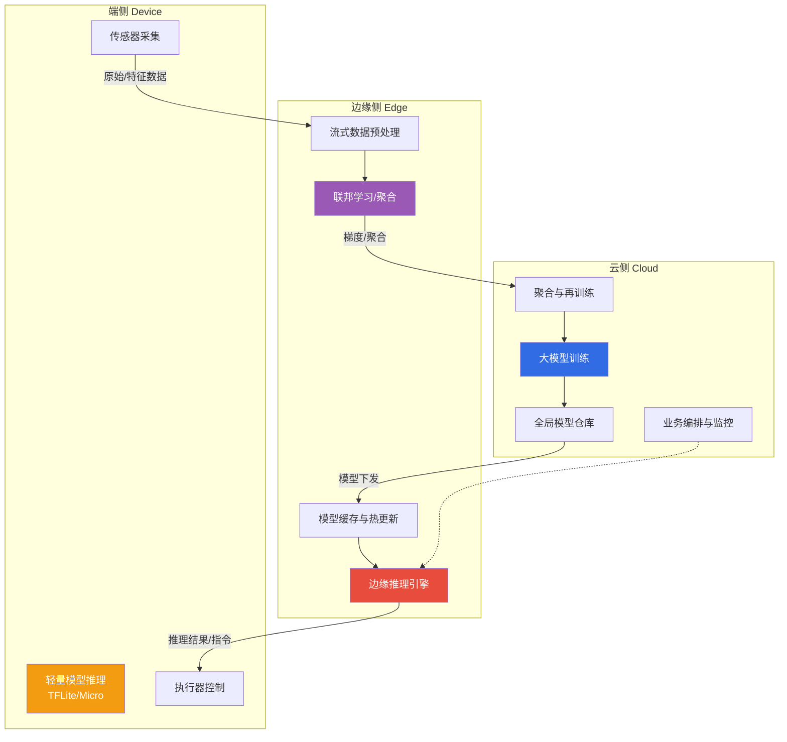

# 5.2 边缘智能与端云协同

> [!abstract] 本节导读
> 本节解决"AI 推理如何在端、边、云之间被合理分布以兼顾时延、带宽、隐私与精度"的问题。从边缘智能的动机出发，阐述云-边-端三层协同的职责分工与典型模式；进而深入模型分割与计算卸载策略，在时延、带宽、能耗间权衡；最后介绍 NVIDIA Jetson、Google Coral、华为 Ascend 三类主流边缘 AI 硬件。本节承接 [[4.3 AI工程化与行业落地]] 的模型压缩成果，是 [[5.3 工业互联网与数字孪生基础]] 工业智能化的技术底座。

## 一、边缘智能的动机

传统"端采集—云推理—端执行"模式在以下场景失效：自动驾驶需毫秒级时延、医疗影像涉及隐私出域、工厂海量表计数据上传带宽爆炸。边缘智能（Edge Intelligence）将 AI 推理能力下沉到边缘节点，与云端协同。

> [!important] 边缘智能的核心价值
> - **低时延**：本地推理避免网络往返，满足实时控制（自动驾驶、工业控制）
> - **省带宽**：原始数据本地处理，仅上传结果或特征，降低回传流量
> - **隐私保护**：敏感数据不出域（医疗影像、家庭摄像头）
> - **离线可用**：断网时仍可本地决策
> - **云端减负**：边缘过滤与聚合，降低云端算力压力

## 二、云-边-端协同架构

云-边-端协同是物联网与边缘智能的主流范式：云端集中训练与全局调度，边缘节点本地推理与聚合，终端负责感知与轻量推理。



### 2.1 三层职责分工

| 层级 | 训练职责 | 推理职责 | 典型能力 |
|-----|---------|---------|---------|
| **云** | 大模型训练、全局聚合、再训练 | 复杂大模型推理、长尾任务 | 大算力、大数据、全局视角 |
| **边** | 局部微调、联邦聚合 | 区域推理、流式预处理、模型缓存 | 中等算力、低时延、本地化 |
| **端** | （极少）在线学习 | 轻量推理、感知执行 | 极低功耗、本地感知 |

### 2.2 典型协同模式

| 模式 | 描述 | 适用 |
|-----|------|------|
| **云训练—边推理** | 云端训练后下发模型到边缘推理 | 主流模式，模型相对稳定 |
| **端训练—云聚合（联邦学习）** | 端侧本地训练，云端聚合梯度 | 数据隐私敏感、分布异构 |
| **边聚合—云再训练** | 边缘节点聚合多端梯度，云端周期再训练 | 中等规模联邦学习 |
| **模型分割推理** | 模型按层切分，端边云协作推理 | 单点算力/显存不足 |

## 三、模型分割与计算卸载

### 3.1 模型分割（Model Partition）

将深度学习模型按层切分，前几层在端/边计算，中间特征上传继续推理，降低端侧算力需求与原始数据上传量。


> [!important] 分割点的权衡
> 分割点靠前：端侧算力/能耗低，但中间特征上传量大；分割点靠后：上传量小但端侧负担重。最优分割点取决于带宽 $B$、端侧算力 $C_d$、云/边算力 $C_c$、模型结构，是一个端-边-云联合优化问题。

### 3.2 计算卸载（Computation Offloading）

计算卸载指端侧决定将任务"本地执行"还是"卸载到边缘/云执行"，目标函数通常为时延 $T$ 与能耗 $E$ 的加权和：

$$
\min\ T_{\text{total}} = \min\ \big(\alpha \cdot T_{\text{local}} + (1-\alpha) \cdot T_{\text{offload}}\big)
$$

其中卸载时延包含传输时延 $T_{\text{tx}}$、排队时延 $T_{\text{queue}}$、执行时延 $T_{\text{exec}}$：

$$
T_{\text{offload}} = T_{\text{tx}} + T_{\text{queue}} + T_{\text{exec}}
$$

| 卸载策略 | 决策方式 | 优缺点 |
|---------|---------|--------|
| **本地执行** | 全部本地 | 时延稳定、隐私好，但算力受限 |
| **全部卸载** | 全部上云 | 算力强，但时延受网络影响、隐私风险 |
| **动态卸载** | 按网络/负载自适应 | 性能最优，但决策复杂 |

## 四、边缘 AI 硬件

边缘 AI 硬件是边缘智能的物理基础，主流厂商均推出面向边缘推理的专用芯片与开发板。

| 硬件 | 厂商 | 芯片/加速器 | 算力 | 特点 |
|-----|------|-----------|------|------|
| **Jetson 系列** | NVIDIA | GPU（Orin/Nano） | 0.5~275 TOPS | CUDA 生态、通用性强、社区大 |
| **Coral** | Google | Edge TPU | 4 TOPS | 极低功耗、TFLite 优化、边缘专用 |
| **Ascend** | 华为 | 达芬奇架构 NPU | 8~280 TOPS | 国产、昇腾生态、云边端统一 |
| **地平线征程** | 地平线 | BPU | 数十 TOPS | 车规级、自动驾驶专用 |
| **瑞芯微 RK3588** | 瑞芯微 | NPU | 6 TOPS | 国产 SoC、性价比高、通用边缘 |

> [!tip] 边缘 AI 硬件选型原则
> - **算力匹配**：按模型 FLOPs 与目标时延选 TOPS，预留 30%~50% 余量
> - **生态匹配**：CUDA 生态选 Jetson，TFLite 选 Coral，国产化要求选 Ascend
> - **功耗约束**：电池供电优先 Coral/Ascend 低功耗档，市电可选 Jetson 高性能档
> - **部署环境**：车规/工规温湿度、抗震、防护等级
> - **工具链**：量化、编译、推理引擎是否完善（TensorRT、TFLite、CANN）

## 五、示例：边缘部署轻量模型

```python
# 将 PyTorch 训练的图像分类模型转换为 ONNX，再在边缘侧用 ONNX Runtime 推理
# 运行环境：Python 3.10，依赖：torch、onnx、onnxruntime
# 工作目录：模型文件所在目录
import torch
import torch.nn as nn
import onnxruntime as ort
import numpy as np
from PIL import Image

# 1. 定义并加载一个轻量分类模型（示例结构）
class MobileClassifier(nn.Module):
    def __init__(self, num_classes=10):
        super().__init__()
        self.net = nn.Sequential(
            nn.Conv2d(3, 16, 3, stride=2, padding=1), nn.ReLU(),
            nn.Conv2d(16, 32, 3, stride=2, padding=1), nn.ReLU(),
            nn.AdaptiveAvgPool2d(1), nn.Flatten(),
            nn.Linear(32, num_classes)
        )
    def forward(self, x):
        return self.net(x)

model = MobileClassifier(num_classes=10)
model.eval()
dummy = torch.randn(1, 3, 64, 64)

# 2. 导出 ONNX（边缘侧跨框架推理的事实标准）
torch.onnx.export(
    model, dummy, "model.onnx",
    input_names=["input"], output_names=["logits"],
    dynamic_axes={"input": {0: "batch"}, "logits": {0: "batch"}},
    opset_version=14
)

# 3. 边缘侧推理：使用 ONNX Runtime（可在 Jetson/Ascend/CPU 上运行）
sess = ort.InferenceSession("model.onnx", providers=["CPUExecutionProvider"])
img = np.random.randn(1, 3, 64, 64).astype(np.float32)  # 实际中读取并预处理图像
logits = sess.run(["logits"], {"input": img})[0]
pred = int(np.argmax(logits, axis=1)[0])
print(f"边缘推理完成，预测类别：{pred}")
```

```bash
# 进一步用 TensorRT 在 NVIDIA Jetson 上加速推理（伪流程）
# 工作目录：模型目录；环境：Jetson + TensorRT
# 1) ONNX -> TensorRT engine（INT8 量化加速）
trtexec --onnx=model.onnx --saveEngine=model.trt --int8
# 2) 在 C++/Python 中加载 model.trt 进行低时延推理
```

> [!note] 边缘部署的关键工程步骤
> 1. **模型导出**：训练框架（PyTorch/TF）→ ONNX 中间表示
> 2. **优化量化**：ONNX Runtime 量化或 TensorRT INT8
> 3. **硬件编译**：转成硬件专属引擎（.trt/.om/.tflite）
> 4. **推理服务**：在边缘节点以服务或进程形式运行，对接设备数据流
> 5. **监控更新**：监控时延/精度，支持模型热更新

> [!summary] 本节要点回顾
> 1. **边缘智能动机**：低时延、省带宽、隐私保护、离线可用、云端减负
> 2. **云-边-端协同**：云训练—边推理—端感知为主流；联邦学习实现"端训练—云聚合"
> 3. **模型分割**：按层切分协作推理，分割点由带宽/算力/模型结构联合决定
> 4. **计算卸载**：本地 vs 卸载 vs 动态卸载，目标为时延与能耗加权和最小
> 5. **边缘硬件**：Jetson（CUDA 通用）、Coral（Edge TPU 低功耗）、Ascend（国产统一栈）、征程（车规）
> 6. **部署链路**：训练→ONNX→量化→硬件编译→推理服务→监控热更新

## 关联知识点

| 关联知识点 | 关系 |
|-----------|------|
| [[5.1 物联网体系架构与通信协议]] | 本节边缘节点承接 IoT 协议接入的数据 |
| [[5.3 工业互联网与数字孪生基础]] | 本节边缘智能是工业数字孪生的算力底座 |
| [[4.3 AI工程化与行业落地]] | 本节承接模型压缩成果在边缘侧部署 |
| [[第2章 云计算技术体系/2.3 边缘云与分布式云架构]] | 边缘云架构基础 |
| [[人工智能与前沿技术/嵌入式系统/知识点/第8章-嵌入式AI部署/8.1-边缘计算与轻量化模型]] | MCU 端 AI 部署深入展开 |
| [[人工智能与前沿技术/嵌入式系统/知识点/第8章-嵌入式AI部署/8.2-TensorFlow Lite Micro]] | TFLite Micro 端侧推理 |
| [[MOC - 第5章]] | 返回本章导航 |
