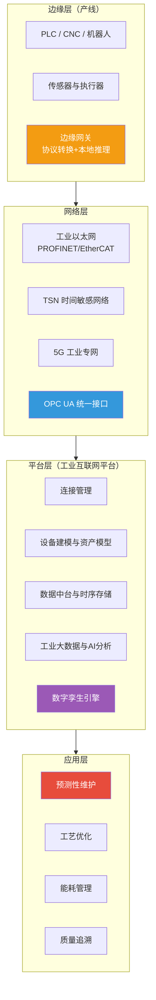
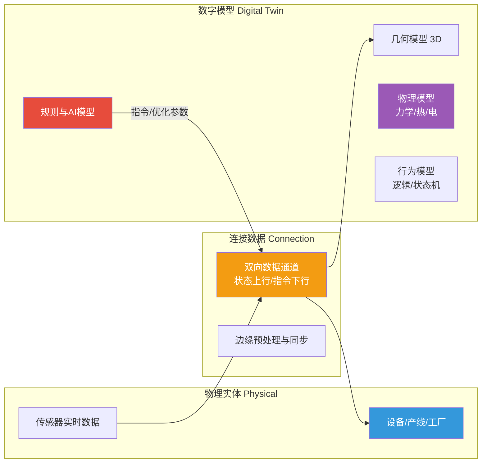
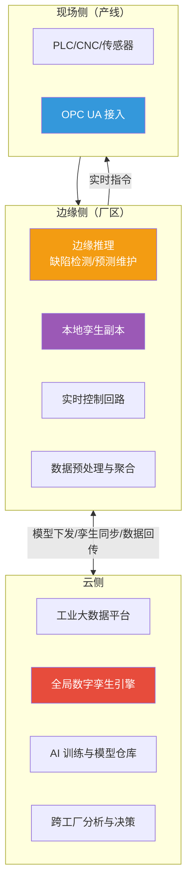
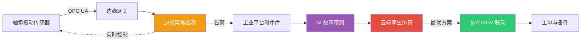

# 5.3 工业互联网与数字孪生基础

> [!abstract] 本节导读
> 本节解决"物联网与边缘智能如何在工业场景落地并构建物理实体的数字镜像"的问题。从工业互联网（IIoT）体系架构与 OPC UA 等工业协议出发，阐述数字孪生的定义、建模与同步机制；进而分析工业互联网平台的云边协同能力；最后以智慧工厂为例串接感知—连接—平台—孪生—优化的完整闭环。本节是 [[5.1 物联网体系架构与通信协议]] 与 [[5.2 边缘智能与端云协同]] 在工业领域的综合应用。

## 一、工业互联网（IIoT）

工业互联网是物联网在工业领域的深化，通过连接机器、物料、人、信息系统，实现数据驱动的智能制造。其本质是"工业 + IoT + 大数据 + AI"的融合。

### 1.1 IIoT 体系架构

### 1.2 工业协议对比

工业现场长期存在多种现场总线与工业以太网协议，OPC UA 作为统一通信标准被广泛采用。

| 协议 | 类型 | 特点 | 典型用途 |
|-----|------|------|---------|
| **Modbus** | 串行/以太网 | 简单主从、开放 | 通用 PLC 通信 |
| **PROFINET** | 工业以太网 | 实时、确定性 | 西门子生态产线 |
| **EtherCAT** | 工业以太网 | 超低时延、主从环 | 运动控制、机器人 |
| **OPC UA** | 统一架构 | 平台无关、信息模型、安全 | 跨厂商统一数据接入 |

> [!important] OPC UA 的核心作用
> OPC UA（OPC Unified Architecture）不仅是通信协议，更是"工业统一架构"。其三大支柱：
> - **统一信息模型**：用对象/属性/方法建模设备，自描述语义
> - **平台无关**：基于 TCP 的二进制或 HTTP/WebSocket，跨操作系统与厂商
> - **内置安全**：证书认证、签名加密、用户权限
> OPC UA 解决了工业现场"协议孤岛"问题，是工业互联网互联互通的事实标准。其与 TSN（时间敏感网络）结合的 OPC UA TSN 是未来工业网络方向。

### 1.3 5G 工业专网

5G 工业专网为 IIoT 提供 uRLLC（超可靠低时延通信）与 mMTC（大连接），典型能力：端到端时延 < 10ms、可靠性 99.999%、每平方公里百万连接。应用场景包括 AGV 调度、机器视觉质检、远程操控、柔性产线重构。

## 二、数字孪生

数字孪生（Digital Twin）是物理实体或过程在数字空间的实时动态镜像，由物理实体、数字模型、连接数据三要素构成。它不仅是 3D 可视化，更强调"实时同步—仿真预测—反馈优化"的闭环。

### 2.1 三要素与生命周期

| 要素 | 内容 | 作用 |
|-----|------|------|
| **物理实体** | 设备、产线、产品、工厂 | 孪生对象，产生真实状态 |
| **数字模型** | 几何 + 物理 + 行为 + 规则模型 | 描述实体形态、机理与逻辑 |
| **连接数据** | 双向实时数据通道 | 状态同步与指令回控 |

### 2.2 数字孪生的"建模—同步—仿真"

> [!important] 数字孪生三要素机制
> - **建模（Modeling）**：构建多物理场、多尺度的数字模型。几何模型描述形状，物理模型描述力学/热/电等机理，行为模型描述状态机与逻辑，规则与 AI 模型描述决策
> - **同步（Synchronization）**：通过传感数据实时驱动数字模型，使数字孪生体状态与物理实体一致；同步频率从毫秒（运动控制）到秒（能耗）分级
> - **仿真（Simulation）**：基于孪生体进行"假如……会怎样"的预测仿真，支持故障预测、工艺优化、人员培训，结果可回控物理实体

### 2.3 数字孪生与相关概念辨析

| 概念 | 与数字孪生的关系 |
|-----|----------------|
| **3D 建模 / CAD** | 提供几何模型，但无实时数据与闭环 |
| **仿真** | 数字孪生包含仿真，且强调实时同步与回控 |
| **数字主线（Digital Thread）** | 贯穿产品全生命周期的数据流，是孪生的数据底座 |
| **CPS（信息物理系统）** | 数字孪生是 CPS 的核心实现形式 |

## 三、工业互联网平台：云边协同

工业互联网平台是工业版 IoT 平台，强调工业协议接入、资产建模与工业机理模型，并采用云边协同架构。

> [!tip] 工业互联网平台的云边分工
> - **边缘侧**：毫秒级实时控制、本地推理、本地孪生副本、断网可用
> - **云侧**：跨厂区全局分析、复杂孪生仿真、大模型训练、长周期优化
> 二者通过"模型下发、孪生同步、数据回传"形成闭环，体现 [[5.2 边缘智能与端云协同]] 的工业落地。

## 四、智慧工厂数字孪生用例

以某离散制造工厂为例，说明数字孪生如何串接完整闭环。

| 环节 | 实现 | 价值 |
|-----|------|------|
| **感知接入** | 产线 PLC、机器人、传感器经 OPC UA 接入边缘网关 | 全要素数据采集 |
| **边缘推理** | 边缘节点运行视觉缺陷检测模型，毫秒级剔除不良品 | 质量实时管控 |
| **本地孪生** | 边缘维护产线孪生副本，实时反映设备状态与节拍 | 实时可视化与异常定位 |
| **预测维护** | 振动/温度时序数据 + AI 模型预测轴承剩余寿命 | 减少非计划停机 |
| **云端仿真** | 云端孪生体仿真不同排产方案，预测产线节拍与能耗 | 排产与能耗优化 |
| **反馈优化** | 仿真最优参数回控 PLC 与机器人 | 闭环优化 |

> [!example] 完整闭环示例
> 1. 轴承振动数据经 OPC UA → 边缘网关上传至工业平台
> 2. 边缘推理模型实时判定振动异常等级
> 3. 平台时序数据库存储历史数据，AI 模型预测 72 小时内故障概率
> 4. 云端孪生体仿真"是否切换备用产线"，对比停机损失
> 5. 决策结果下发边缘，AGV 与排产系统协同切换产线
> 6. 维修工单自动生成，备件库存联动

> [!summary] 本节要点回顾
> 1. **IIoT 架构**：边缘（PLC/网关）—网络（工业以太网/TSN/5G/OPC UA）—平台—应用四层
> 2. **OPC UA**：工业统一架构，含信息模型、平台无关、内置安全，是互联互通事实标准
> 3. **5G 工业专网**：uRLLC 低时延、mMTC 大连接，支撑 AGV/视觉质检/远程操控
> 4. **数字孪生三要素**：物理实体 + 数字模型（几何/物理/行为/规则）+ 双向连接数据
> 5. **孪生机制**：建模—同步—仿真闭环，支持预测与回控，区别于纯 3D/仿真/CPS
> 6. **工业平台云边协同**：边缘负责实时控制与本地孪生，云端负责全局仿真与训练
> 7. **智慧工厂闭环**：感知接入→边缘推理→本地孪生→预测维护→云端仿真→反馈优化

## 关联知识点

| 关联知识点 | 关系 |
|-----------|------|
| [[5.1 物联网体系架构与通信协议]] | 本节工业协议是 IoT 协议的工业特化 |
| [[5.2 边缘智能与端云协同]] | 本节云边协同的工业落地 |
| [[第4章 人工智能智能赋能技术/4.3 AI工程化与行业落地]] | 本节边缘 AI 与智能制造的衔接 |
| [[第2章 云计算技术体系/2.3 边缘云与分布式云架构]] | 工业平台的云边架构基础 |
| [[第3章 大数据前沿技术/3.3 数据中台与智能数据分析]] | 工业数据中台与智能分析 |
| [[MOC - 第5章]] | 返回本章导航 |
