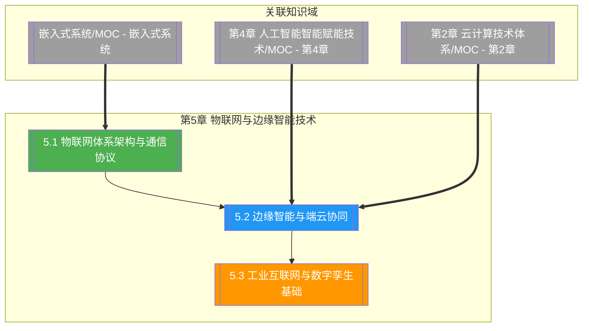

# 第5章 物联网与边缘智能技术

> [!abstract] 章节概述
> 本章在 [[1.1 前沿技术定义、特征与技术体系]] 的 ABCD5G 体系框架下，深入展开"I（IoT）+ A（AI）"在端侧的融合方向。从物联网三层体系架构与主流通信协议（MQTT、CoAP、LoRaWAN、NB-IoT、Zigbee、BLE）出发，阐述边缘智能与端云协同的推理架构、模型分割卸载与边缘 AI 硬件；进而聚焦工业互联网与数字孪生，覆盖 IIoT 架构、OPC UA、工业协议与数字孪生建模同步机制。本章揭示"感知—连接—智能—孪生"的演进规律，与 [[第4章 人工智能智能赋能技术/MOC - 第4章]] 的边缘 AI 形成承接，与 [[第2章 云计算技术体系/MOC - 第2章]] 的云边端协同呼应。

## 学习路线图

## 知识点导航

| 编号 | 知识点 | 核心内容 | 重要程度 |
|-----|--------|---------|---------|
| 5.1 | [[5.1 物联网体系架构与通信协议]] | 三层架构、MQTT/CoAP/LoRaWAN/NB-IoT/Zigbee/BLE、IoT 平台 | ⭐⭐⭐⭐⭐ |
| 5.2 | [[5.2 边缘智能与端云协同]] | 边缘推理、云边端协同、模型分割卸载、边缘 AI 硬件 | ⭐⭐⭐⭐⭐ |
| 5.3 | [[5.3 工业互联网与数字孪生基础]] | IIoT 架构、OPC UA、数字孪生建模同步、智慧工厂 | ⭐⭐⭐⭐ |

## 核心概念速览

> [!tip] 本章必须掌握的核心概念
> - **物联网三层架构**：感知层（传感器/RFID）、网络层（连接与传输）、应用层（业务与智能）
> - **MQTT**：基于发布/订阅的轻量物联网消息协议，核心概念 Broker/Topic/QoS
> - **CoAP**：REST 风格的受限设备通信协议，基于 UDP，支持资源发现
> - **LoRaWAN**：LPWAN 远距离低功耗广域网技术，星型拓扑、Class A/B/C 终端
> - **NB-IoT**：蜂窝物联网技术，广覆盖、低功耗、大连接，运营商频段部署
> - **Zigbee/BLE**：短距低功耗局域通信，分别主打 Mesh 网状网与点对点
> - **边缘智能**：在边缘侧完成 AI 推理，降低时延、保护隐私、节省带宽
> - **端云协同**：云训练—边推理—端感知的三层协作范式
> - **模型分割（Model Partition）**：将模型按层切分，端边云协作推理
> - **IIoT**：工业物联网，连接工业资产实现数据驱动的智能制造
> - **OPC UA**：工业统一架构通信标准，含信息模型与安全机制
> - **数字孪生**：物理实体在数字空间的实时镜像，含建模、同步与仿真

## 核心考点

> [!important] 期末高频考点

| 考点 | 所属知识点 | 考查形式 | 难度 |
|-----|-----------|---------|------|
| 物联网三层架构及各层职责 | 5.1 | 简答题/填空题 | ★★ |
| MQTT 工作原理与 QoS 三级语义 | 5.1 | 简答题/论述题 | ★★★★ |
| CoAP 与 MQTT 的区别与选型 | 5.1 | 对比题/简答题 | ★★★ |
| LoRaWAN 与 NB-IoT 对比 | 5.1 | 对比题/论述题 | ★★★★ |
| Zigbee 与 BLE 的适用场景 | 5.1 | 选择题/简答题 | ★★★ |
| IoT 平台核心功能与架构 | 5.1 | 简答题 | ★★★ |
| 边缘智能的动机与价值 | 5.2 | 简答题/论述题 | ★★★ |
| 云边端协同的职责分工 | 5.2 | 论述题 | ★★★★ |
| 模型分割与卸载策略 | 5.2 | 论述题/案例分析 | ★★★★ |
| 边缘 AI 硬件选型（Jetson/Coral/Ascend） | 5.2 | 简答题/案例分析 | ★★★ |
| IIoT 架构与 OPC UA 作用 | 5.3 | 简答题/论述题 | ★★★★ |
| 数字孪生定义、建模与同步机制 | 5.3 | 论述题/案例分析 | ★★★★ |
| 智慧工厂数字孪生应用 | 5.3 | 案例分析 | ★★★ |

## 自测题

> [!question] 章节自测
> 1. 绘制物联网三层架构图，说明感知层、网络层、应用层各自的职责与代表性技术；并阐述 MQTT 的发布/订阅模型与 QoS 0/1/2 三级语义的区别。
> 2. 对比 LoRaWAN 与 NB-IoT 在技术定位、组网方式、频谱、功耗、速率与典型应用上的差异，并为"智能水表抄表"与"共享单车定位"两个场景分别选择合适协议并说明理由。
> 3. 论述边缘智能的动机与价值，说明云-边-端三层协同中各自职责；进而解释模型分割（Model Partition）与计算卸载的策略，并分析其在时延、带宽、隐私上的权衡。
> 4. 阐述工业互联网的体系架构与 OPC UA 的核心作用，说明数字孪生的"建模—同步—仿真"三要素；并举一个智慧工厂数字孪生用例，分析其如何实现物理设备与数字模型的实时联动与优化。

## 章节导航

| 方向 | 链接 |
|-----|------|
| ⬆ 返回课程总览 | [[MOC - 专业前沿技术]] |
| ⬅ 上一章 | [[第4章 人工智能智能赋能技术/MOC - 第4章]] |
| ➡ 下一章 | [[第6章 区块链技术与应用/MOC - 第6章]] |

## 关联知识

- [[人工智能与前沿技术/嵌入式系统/MOC - 嵌入式系统]] - 物联网终端的硬件与 MCU 基础
- [[第4章 人工智能智能赋能技术/MOC - 第4章]] - 边缘 AI 的模型压缩与工程化基础
- [[第2章 云计算技术体系/MOC - 第2章]] - 云边端协同的云侧底座
- [[1.1 前沿技术定义、特征与技术体系]] - ABCD5G 体系中 IoT 的定位
