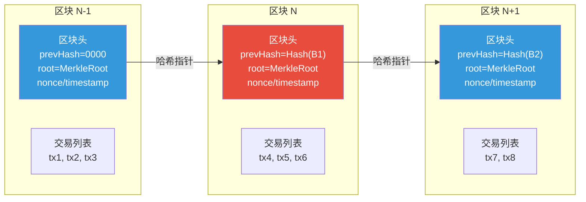
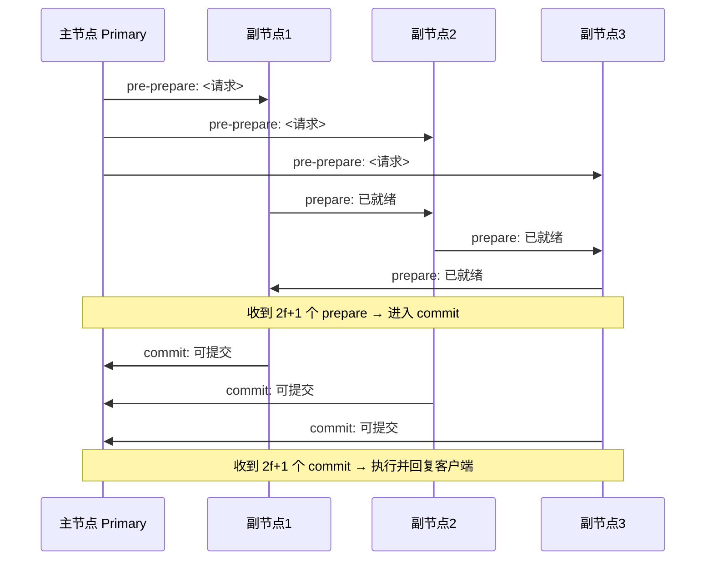

# 6.1 区块链原理与共识机制

> [!abstract] 本节导读
> 本节解决"无信任中介的多方如何就一份共享账本达成一致"的问题。从区块链的数据结构（区块—链—哈希—Merkle 树）入手，说明只增不改的防篡改原理与轻节点 SPV 验证；系统对比 PoW、PoS、DPoS、PBFT 四类共识机制的选举方式、能耗、最终性与容错阈值；进而比较公链、联盟链、私链三种部署形态，以比特币与以太坊为典型实例。本节是区块链的体系纲领，为 [[6.2 智能合约与去中心化应用]] 的可编程账本与 [[6.3 可信计算与隐私计算]] 的链下可信计算奠定基础。

## 一、区块链数据结构

区块链（Blockchain）是一个由区块按哈希指针链式连接组成的分布式只增账本。其本质是用密码学手段把"历史记录"变成"不可篡改的链表"，再由分布式共识保证多副本一致，从而在没有可信中介的前提下建立去中心化信任。



### 1.1 区块头关键字段

| 字段 | 含义 | 作用 |
|-----|------|------|
| **prevHash** | 前一区块头的哈希 | 形成链式结构，篡改前块导致后块哈希失效 |
| **MerkleRoot** | 区块内所有交易的 Merkle 树根哈希 | 一键验证交易集合完整性 |
| **timestamp** | 出块时间戳 | 难度调整与时序依据 |
| **nonce** | 工作量证明随机数 | PoW 中调整以寻找满足难度的哈希 |
| **difficulty** | 当前难度目标 | 控制出块速率（比特币约 10 分钟） |
| **version** | 版本号 | 协议升级标识 |

> [!important] 防篡改的链式原理
> 区块头中 `prevHash = SHA256(前一区块头)`。若攻击者篡改区块 N 中的交易，则其 MerkleRoot 变化 → 区块 N 头哈希变化 → 区块 N+1 的 prevHash 失配 → 区块 N+1 头哈希变化 → ……后续所有区块全部失效。攻击者必须重新计算从被篡改区块到最新区块的全部工作量，代价极高。这是区块链"只增不改"的根本保证。

### 1.2 Merkle 树与 SPV 验证

Merkle 树是区块内交易的二叉哈希树：叶子节点为各交易的哈希，父节点为子节点哈希拼接后再哈希，最终汇聚到 MerkleRoot。

```mermaid
graph TD
    T1[tx1] --> H1[H tx1]
    T2[tx2] --> H2[H tx2]
    T3[tx3] --> H3[H tx3]
    T4[tx4] --> H4[H tx4]
    H1 --> H12[H12 = H(H1+H2)]
    H2 --> H12
    H3 --> H34[H34 = H(H3+H4)]
    H4 --> H34
    H12 --> ROOT[MerkleRoot = H(H12+H34)]
    H34 --> ROOT

    style ROOT fill:#e74c3c,color:#fff
    style H12 fill:#f39c12,color:#fff
    style H34 fill:#f39c12,color:#fff
```

轻节点（SPV，Simplified Payment Verification）无需下载全部交易，只需区块头。验证某交易 tx3 是否被打包，只需提供路径 $\{H4, H12\}$：

$$
\text{MerkleRoot} \stackrel{?}{=} H\big(H12 \,\|\, H(H3 \,\|\, H4)\big)
$$

其中 $H3 = H(\text{tx3})$。若根哈希匹配则证明交易存在，复杂度 $O(\log n)$。

## 二、共识机制

分布式系统中多个节点如何就"下一个区块是谁"达成一致，是区块链的核心问题。共识机制需同时满足安全性（一致性）与活性（ liveness，账本持续增长）。

### 2.1 共识机制全景对比

| 共识 | 全称 | 出块者选举 | 能耗 | 最终性 | 容错 | 代表 |
|-----|------|-----------|------|--------|------|------|
| **PoW** | 工作量证明 | 算力解哈希难题 | 极高 | 概率最终性 | <50% 算力 | 比特币 |
| **PoS** | 权益证明 | 按持币量+时间随机选 | 极低 | 近似最终性 | <33% 权益 | 以太坊 2.0 |
| **DPoS** | 委托权益证明 | 持币者投票选少量节点 | 低 | 快速最终性 | <33% 节点 | EOS |
| **PBFT** | 实用拜占庭容错 | 轮换或预选 | 低 | 即时最终性 | $f < n/3$ | Hyperledger Fabric |

### 2.2 PoW：工作量证明

PoW（Proof of Work）要求出块者寻找一个 nonce，使区块头哈希小于目标值：

$$
\text{SHA256}(\text{prevHash} \,\|\, \text{MerkleRoot} \,\|\, \text{nonce}) < \text{target}
$$

找到合法 nonce 的概率与算力成正比，难度通过调整 target 控制平均出块时间。


> [!important] PoW 的 51% 攻击与概率最终性
> PoW 不存在即时最终性，只有"概率最终性"：区块越深越难被回滚，比特币通常以 6 个确认（约 60 分钟）视为安全。若攻击者掌握超过 50% 算力，可构造更长链实施双花，但经济上往往不划算。

### 2.3 PoS：权益证明

PoS（Proof of Stake）按验证者所质押的代币数量与持币时间选举出块者，无需算力竞赛。以太坊 2.0 采用 Casper FFG，验证者需质押 32 ETH，作恶（双签、长程攻击）将被罚没（slashing）质押金。

| 维度 | PoW | PoS |
|-----|-----|-----|
| **选举依据** | 算力 | 权益（质押币量） |
| **能耗** | 极高 | 极低（节能 99%） |
| **安全假设** | 算力不可垄断 | 大多数权益诚实 |
| **作恶代价** | 算力浪费 | 质押被罚没 |
| **最终性** | 概率 | 可显式最终化 |

### 2.4 DPoS：委托权益证明

DPoS（Delegated Proof of Stake）由持币者投票选出少量（如 21 个）出块节点轮流产块，牺牲一定去中心化换取高吞吐。EOS 每秒可处理数千笔交易，但被批评为"21 个超级节点"的中心化倾向。

### 2.5 PBFT：实用拜占庭容错

PBFT（Practical Byzantine Fault Tolerance）适用于许可链，节点数 $n = 3f + 1$ 时可容忍 $f$ 个拜占庭节点。共识经三阶段完成：



> [!note] PBFT 容错阈值
> PBFT 在 $n \geq 3f + 1$ 时可容忍 $f$ 个拜占庭节点。三阶段（pre-prepare / prepare / commit）每阶段需收集 $2f + 1$ 个一致消息才能推进，确保诚实节点达成一致。代价是通信复杂度 $O(n^2)$，节点规模通常限于数百。

## 三、区块链部署形态

| 维度 | 公有链 Public | 联盟链 Consortium | 私有链 Private |
|-----|--------------|------------------|---------------|
| **参与准入** | 任何人可读写 | 已授权机构参与 | 单一组织内部 |
| **共识** | PoW/PoS | PBFT/Raft 类 | 简化共识 |
| **去中心化** | 高 | 中 | 低 |
| **吞吐 TPS** | 低（7~30） | 高（千级） | 极高 |
| **隐私** | 交易全公开 | 可控可见 | 内部可见 |
| **典型** | 比特币、以太坊 | Hyperledger Fabric、FISCO BCOS | 内部账本 |
| **场景** | 加密货币、DeFi | 供应链金融、政务存证 | 审计、内部结算 |

> [!tip] 选型原则
> 公链追求"无信任去中心化"，适合对抗性强的开放场景；联盟链在"已知多方、需一定信任"的产业协作中平衡效率与去中心化；私链本质是带审计的分布式数据库，去中心化诉求弱。

## 四、典型实例：比特币与以太坊

| 维度 | 比特币 Bitcoin | 以太坊 Ethereum |
|-----|---------------|-----------------|
| **定位** | 点对点电子现金 | 去中心化应用平台 |
| **共识** | PoW（现仍为 PoW） | 由 PoW 转 PoS（The Merge 2022） |
| **账户模型** | UTXO 模型 | 账户/余额模型 |
| **脚本能力** | 非图灵完备脚本 | 图灵完备智能合约（EVM） |
| **出块时间** | ~10 分钟 | ~12 秒 |
| **通证** | BTC | ETH |
| **核心创新** | 数字货币、工作量证明 | 智能合约、DApp 生态 |

> [!note] UTXO vs 账户模型
> 比特币采用 UTXO（未花费交易输出）模型：每笔交易消费若干输入 UTXO 生成若干输出 UTXO，类似"现金找零"，便于并行验证与隐私。以太坊采用账户模型：维护账户余额与 nonce 状态，更贴近传统账户体系，便于智能合约状态管理。

## 五、示例：用 Python 模拟区块与链

```python
# 用 Python 最小化模拟区块链的区块结构与哈希链防篡改
# 运行环境：Python 3.10，依赖标准库 hashlib
# 工作目录：任意
import hashlib
import json
import time

def sha256(data: str) -> str:
    return hashlib.sha256(data.encode()).hexdigest()

class Block:
    def __init__(self, index, transactions, prev_hash, timestamp=None, nonce=0):
        self.index = index
        self.transactions = transactions
        self.prev_hash = prev_hash
        self.timestamp = timestamp or time.time()
        self.nonce = nonce
        self.hash = self.compute_hash()

    def compute_hash(self):
        # 序列化区块头关键字段后求哈希
        payload = json.dumps({
            "index": self.index,
            "transactions": self.transactions,
            "prev_hash": self.prev_hash,
            "timestamp": self.timestamp,
            "nonce": self.nonce,
        }, sort_keys=True)
        return sha256(payload)

# 构造一条含 3 个区块的链
genesis = Block(0, ["coinbase: 50 BTC -> satoshi"], "0" * 64)
block1 = Block(1, ["A->B 1 BTC", "B->C 0.5 BTC"], genesis.hash)
block2 = Block(2, ["C->D 0.2 BTC"], block1.hash)
chain = [genesis, block1, block2]

def verify_chain(chain):
    for i in range(1, len(chain)):
        if chain[i].prev_hash != chain[i - 1].hash:
            return False
    return True

print("初始链完整性:", verify_chain(chain))  # True

# 模拟篡改：修改区块 1 的交易
chain[1].transactions = ["A->B 100 BTC"]
print("篡改后链完整性:", verify_chain(chain))  # True（prev_hash 未重算）
# 注意：真实区块链会重算被篡改块的 hash 并尝试续接，否则后续 prev_hash 失配
chain[1].hash = chain[1].compute_hash()
print("重算后链完整性:", verify_chain(chain))  # False，区块2的 prev_hash 失配
```

```bash
# 使用比特币核心的 RPC 查询真实区块信息（需运行 bitcoind 测试网节点）
# 工作目录：任意；环境：Bitcoin Core 测试网
bitcoin-cli -testnet getblockhash 2000000          # 获取高度 2000000 的区块哈希
bitcoin-cli -testnet getblock <hash> 2              # 获取区块详情（verbosity=2 含交易）
```

> [!summary] 本节要点回顾
> 1. **数据结构**：区块头（prevHash/MerkleRoot/nonce）+ 交易列表，哈希指针形成链式结构，篡改一处导致后续全部失效
> 2. **Merkle 树**：交易二叉哈希树，支持轻节点 $O(\log n)$ SPV 验证
> 3. **PoW**：算力解难题，概率最终性，比特币代表，能耗高
> 4. **PoS**：按权益选举，罚没机制约束作恶，以太坊 2.0 代表
> 5. **DPoS**：投票选少量节点轮流出块，高吞吐但偏中心化
> 6. **PBFT**：三阶段投票即时最终性，$n \geq 3f+1$ 容忍 $f$ 拜占庭节点，联盟链常用
> 7. **部署形态**：公链（开放/低 TPS）、联盟链（许可/高 TPS）、私链（内部/审计）
> 8. **典型**：比特币（UTXO/电子现金）、以太坊（账户/智能合约平台）

## 关联知识点

| 关联知识点 | 关系 |
|-----------|------|
| [[6.2 智能合约与去中心化应用]] | 本节区块链作为可编程账本支撑智能合约 |
| [[6.3 可信计算与隐私计算]] | 本节链上信任与链下可信计算互补 |
| [[第5章 物联网与边缘智能技术/5.1 物联网体系架构与通信协议]] | 物联网设备身份与数据上链的源头 |
| [[第2章 云计算技术体系/2.1 云计算架构与服务模式演进]] | 分布式系统信任机制对比 |
| [[MOC - 第6章]] | 返回本章导航 |
