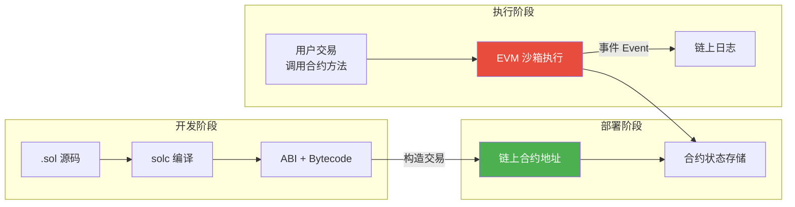
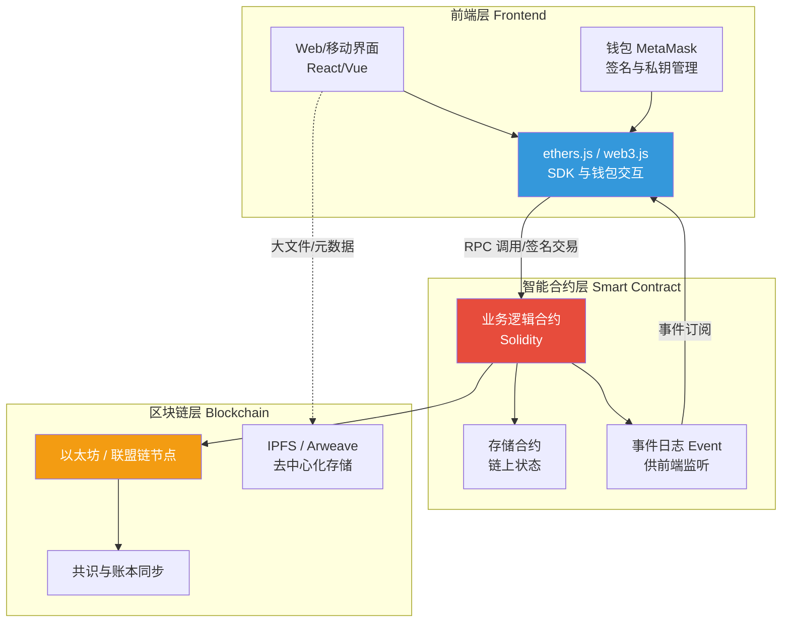

# 6.2 智能合约与去中心化应用

> [!abstract] 本节导读
> 本节解决"如何在不可信的多方之间自动执行预设业务逻辑而无需中介"的问题。从智能合约的定义与图灵完备特性入手，阐述 Solidity 语言与 EVM 沙箱执行模型；进而描绘 DApp 的"前端 + 智能合约 + 区块链"三层架构与传统应用的差异；聚焦 DeFi（Uniswap 自动做市、Aave 借贷）与 NFT（ERC-721 数字资产）两类典型链上应用范式。本节承接 [[6.1 区块链原理与共识机制]] 的可编程账本，与 [[6.3 可信计算与隐私计算]] 的链下隐私计算形成"链上 + 链下"协同。

## 一、智能合约

智能合约（Smart Contract）是部署在区块链上、由链上交易触发自动执行的图灵完备代码。其核心价值是"代码即法律"：业务规则以代码固化，无需可信中介即可按约定执行，违约在技术上不可能。

### 1.1 智能合约的核心特性

| 特性 | 说明 |
|-----|------|
| **自动执行** | 满足触发条件即执行，无需人工干预 |
| **不可篡改** | 部署后代码与状态上链，无法单方修改 |
| **公开透明** | 公链上合约代码与交易可被任意节点验证 |
| **确定性** | 相同输入在所有节点产生相同输出，保证多副本一致 |
| **沙箱隔离** | 在 EVM 等虚拟机内运行，无法直接访问网络或文件系统 |

> [!important] Gas 机制与停机问题
> 图灵完备带来"能否停机"的不可判定问题。以太坊通过 Gas 机制解决：每条指令消耗一定 Gas，交易发起者预付 Gas 上限，耗尽则回滚（revert）但已消耗的 Gas 不退。这既防止无限循环攻击，又为矿工/验证者提供执行激励。

### 1.2 Solidity 与 EVM

Solidity 是以太坊主流的智能合约编程语言，语法类似 JavaScript/Java，面向合约（contract）组织代码。EVM（Ethereum Virtual Machine）是其执行环境：所有节点运行相同字节码，保证状态一致。



## 二、DApp 去中心化应用架构

DApp（Decentralized Application）是运行在区块链网络上的应用，由前端界面 + 智能合约 + 底层区块链三层组成，与传统 Web 应用的最大区别是后端逻辑部署在链上而非中心化服务器。



### 2.1 DApp 与传统应用对比

| 维度 | 传统 Web 应用 | DApp |
|-----|-------------|------|
| **后端逻辑** | 中心化服务器 | 链上智能合约 |
| **数据存储** | 中心化数据库 | 链上状态 + 去中心化存储（IPFS） |
| **身份** | 账号密码 | 钱包地址 + 私钥签名 |
| **信任模型** | 信任服务商 | 信任合约代码与共识 |
| **可用性** | 依赖服务商 | 依赖区块链网络 |
| **升级** | 直接部署 | 需代理合约或治理投票 |
| **性能** | 高 | 受链 TPS 限制 |

> [!tip] 钱包的角色
> 钱包（如 MetaMask）不存储资产本身，而是管理私钥并对交易签名。资产记录在链上账本中，私钥即是对账户的控制权。前端通过 ethers.js/web3.js 把交易提交给钱包，用户确认签名后广播到节点。

## 三、DeFi 去中心化金融

DeFi（Decentralized Finance）是以智能合约重构金融服务的链上生态，无需银行或券商等中介，实现资产交易、借贷、衍生品等。其核心创新是用算法与合约替代信用中介。

### 3.1 Uniswap 自动做市商（AMM）

传统交易所依赖订单簿撮合，Uniswap 采用恒定乘积做市商模型：

$$
x \cdot y = k
$$

其中 $x$、$y$ 为流动性池中两种代币的储备量，$k$ 为常数。交易改变 $x$、$y$ 但保持 $k$ 不变，从而由储备比例自动决定价格。

> [!example] AMM 定价示意
> 设池中代币 A 储备 $x = 100$，代币 B 储备 $y = 1000$，则 $k = 100000$，初始价格 $P = y/x = 10$（1 A = 10 B）。若用户用 10 A 买入 B，新 $x' = 110$，则 $y' = k/x' = 100000/110 \approx 909.09$，用户获得 $1000 - 909.09 = 90.91$ B。买入导致 A 储备上升、B 下降，价格自动上移，滑点由交易规模相对池子大小决定。

### 3.2 Aave 借贷协议

Aave 采用资金池模型：存款人将资产存入池子获得利息，借款人超额抵押资产借出其他资产，利率由供需算法动态调整。关键机制：

- **超额抵押**：借款需抵押价值高于借款的资产（如 150% 抵押率）
- **清算**：抵押率低于阈值时任何人可清算借款，获得折扣抵押品奖励
- **闪电贷**：同一交易内借出并归还，无需抵押，用于套利与清算

### 3.3 DeFi 风险

| 风险类型 | 说明 | 典型案例 |
|---------|------|---------|
| **智能合约漏洞** | 代码漏洞被攻击盗取资金 | 2020 年 bZx 重入攻击 |
| **预言机操纵** | 依赖外部价格被恶意操纵 | 2020 年 Synthetix 闪电贷操纵 |
| **系统性风险** | 协议间借贷叠加引发连环清算 | 2022 年 Luna 崩盘连锁 |
| **治理攻击** | 持币集中者操控治理投票 | DeFi 治理权争夺 |

## 四、NFT 与数字资产

NFT（Non-Fungible Token，非同质化通证）是基于 ERC-721/ERC-1155 标准的数字资产，每个通证拥有唯一 ID 与元数据，不可互换。与 ERC-20 同质化代币（每枚等价）形成对比。

| 标准 | 类型 | 典型用途 |
|-----|------|---------|
| **ERC-20** | 同质化代币 | 稳定币、平台币（USDT、UNI） |
| **ERC-721** | 非同质化代币 | 艺术品、收藏品、游戏道具 |
| **ERC-1155** | 多代币标准 | 批量转移同质化与非同质化资产 |

> [!note] NFT 确权的边界
> NFT 通过链上通证 ID 标识资产的"所有权凭证"，但资产本体（图片、视频）通常存储在 IPFS 或中心化服务器，元数据 URI 指向该存储。NFT 确权的是"链上通证"而非"作品著作权"，著作权归属需额外法律约定。这是 NFT 争议的核心。

## 五、示例：Solidity 代币合约

```solidity
// SPDX-License-Identifier: MIT
pragma solidity ^0.8.20;

// 简化的 ERC-20 同质化代币合约示例
// 运行环境：Solidity 0.8.20，可在 Remix IDE 或 Hardhat 中编译部署
contract SimpleToken {
    string public name;
    string public symbol;
    uint8 public decimals = 18;
    uint256 public totalSupply;

    mapping(address => uint256) public balanceOf;
    mapping(address => mapping(address => uint256)) public allowance;

    event Transfer(address indexed from, address indexed to, uint256 value);
    event Approval(address indexed owner, address indexed spender, uint256 value);

    // 构造函数：部署时铸造初始总量到部署者
    constructor(string memory _name, string memory _symbol, uint256 _initialSupply) {
        name = _name;
        symbol = _symbol;
        totalSupply = _initialSupply * 10 ** uint256(decimals);
        balanceOf[msg.sender] = totalSupply;
        emit Transfer(address(0), msg.sender, totalSupply);
    }

    // 转账：扣除发送者余额并增加接收者余额
    function transfer(address to, uint256 value) public returns (bool) {
        require(balanceOf[msg.sender] >= value, "余额不足");
        balanceOf[msg.sender] -= value;
        balanceOf[to] += value;
        emit Transfer(msg.sender, to, value);
        return true;
    }

    // 授权：允许 spender 代为使用 value 数额
    function approve(address spender, uint256 value) public returns (bool) {
        allowance[msg.sender][spender] = value;
        emit Approval(msg.sender, spender, value);
        return true;
    }

    // 代扣转账：由被授权者从 from 转账给 to
    function transferFrom(address from, address to, uint256 value) public returns (bool) {
        require(balanceOf[from] >= value, "余额不足");
        require(allowance[from][msg.sender] >= value, "授权额度不足");
        balanceOf[from] -= value;
        balanceOf[to] += value;
        allowance[from][msg.sender] -= value;
        emit Transfer(from, to, value);
        return true;
    }
}
```

```bash
# 使用 Hardhat 在本地节点部署与测试合约
# 工作目录：合约项目根目录；环境：Node.js 18+、Hardhat
npx hardhat node                                  # 启动本地测试链节点（默认 8545 端口）
npx hardhat run scripts/deploy.js --network localhost  # 部署合约到本地链
# 前端通过 ethers.js 连接 http://127.0.0.1:8545 调用合约方法
```

> [!warning] 重入攻击与防护
> 经典的 DAO 攻击利用合约在更新余额前外部调用收款方回调，导致余额被反复提取。Solidity 0.8+ 默认防整数溢出，但重入仍需通过"检查—生效—交互"模式（先更新状态再外部调用）或 ReentrancyGuard 防护。

> [!summary] 本节要点回顾
> 1. **智能合约**：链上自动执行的图灵完备代码，代码即法律，Gas 机制解决停机问题
> 2. **EVM**：以太坊虚拟机沙箱，所有节点运行相同字节码保证一致性
> 3. **DApp 架构**：前端（ethers.js + 钱包）+ 智能合约 + 区块链三层，去中心化后端
> 4. **DeFi**：AMM 恒定乘积 $x \cdot y = k$ 自动做市、超额抵押借贷、闪电贷，风险含合约/预言机/系统性
> 5. **NFT**：ERC-721 唯一性通证，确权链上通证而非著作权本体
> 6. **Solidity 实践**：ERC-20 标准 + 防重入的"检查—生效—交互"模式

## 关联知识点

| 关联知识点 | 关系 |
|-----------|------|
| [[6.1 区块链原理与共识机制]] | 本节智能合约部署在区块链账本之上 |
| [[6.3 可信计算与隐私计算]] | 链上合约与链下隐私计算的协同 |
| [[第2章 云计算技术体系/2.1 云计算架构与服务模式演进]] | DApp 与传统中心化应用架构对比 |
| [[第4章 人工智能智能赋能技术/4.3 AI工程化与行业落地]] | 链上数据与 AI 模型可信来源 |
| [[MOC - 第6章]] | 返回本章导航 |
