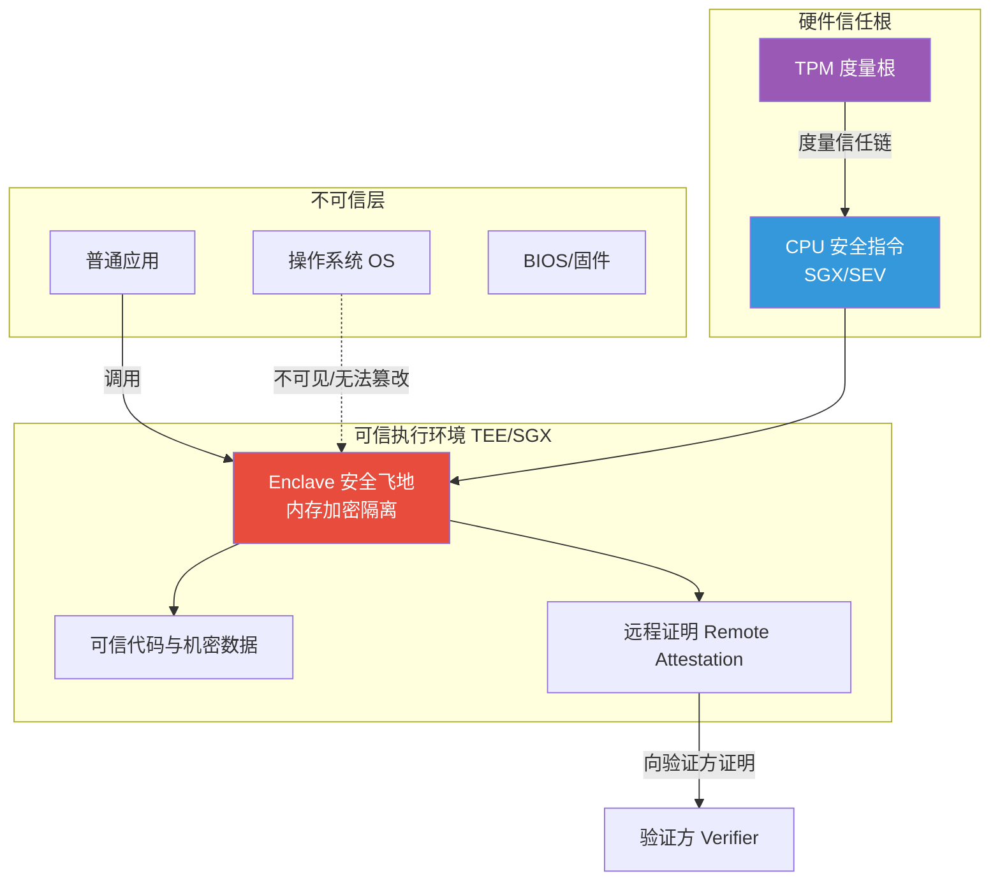
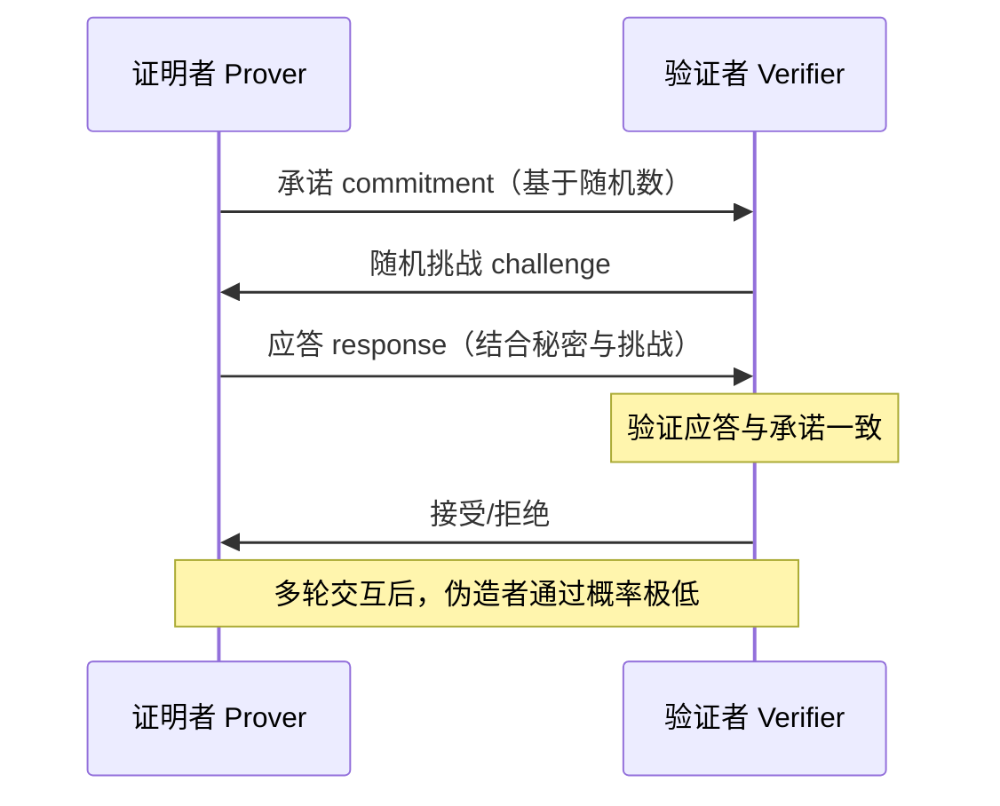
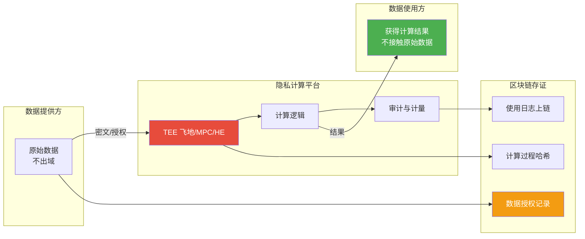

# 6.3 可信计算与隐私计算

> [!abstract] 本节导读
> 本节解决"如何在多方协作中既使用数据又保护数据机密性，实现数据可用不可见"的问题。从可信计算的硬件信任根（TPM/TEE/SGX）入手，阐述基于安全飞地的隔离执行机制；进而系统介绍隐私计算四类技术：多方安全计算（MPC）、同态加密、零知识证明与联邦学习，比较其原理与适用边界；最后讨论数据安全流通的典型方案。本节承接 [[6.2 智能合约与去中心化应用]] 的链上信任，与 [[第4章 人工智能智能赋能技术/4.3 AI工程化与行业落地]] 的联邦学习呼应，构建"链上可信 + 链下隐私"的完整数据协作范式。

## 一、可信计算

可信计算（Trusted Computing）通过硬件信任根建立可度量的可信执行环境，保证代码与数据在隔离环境中被正确执行且机密不被泄露。其核心思想是"从硬件根出发逐级度量信任链"。

### 1.1 核心组件

| 组件 | 全称 | 作用 |
|-----|------|------|
| **TPM** | Trusted Platform Module | 可信平台模块，硬件安全芯片，提供密钥存储、度量与远程证明 |
| **TEE** | Trusted Execution Environment | 可信执行环境，与富操作系统隔离的安全区域 |
| **SGX** | Software Guard Extensions | Intel CPU 指令扩展，创建名为 enclave 的安全飞地 |
| **SEV** | Secure Encrypted Virtualization | AMD 内存加密虚拟化技术 |



> [!important] SGX Enclave 的隔离保证
> Intel SGX 在 CPU 内创建 Enclave（安全飞地），其内存被硬件加密，即使操作系统、hypervisor、同机其他进程拥有最高权限也无法读取或篡改飞地内的代码与数据。通过远程证明，飞地可向远程验证方证明自身运行在真实 SGX 环境且代码未被篡改。这是机密计算（Confidential Computing）的硬件基础。

### 1.2 信任链与远程证明

可信计算通过度量建立信任链：从 CRTM（核心可信度量根）启动，逐级度量 BIOS、bootloader、OS、应用，将度量值扩展到 TPM 的平台配置寄存器（PCR）。远程证明把 PCR 签名后发送给验证方，证明平台状态可信。

## 二、隐私计算技术

隐私计算（Privacy-Preserving Computation）是在不暴露原始数据的前提下完成数据分析与计算的技术总称，实现"数据可用不可见，数据不动价值动"。

### 2.1 技术全景对比

| 技术 | 基本原理 | 安全假设 | 计算开销 | 典型应用 |
|-----|---------|---------|---------|---------|
| **MPC** | 多方在不交换原始数据下联合计算函数 | 半诚实/恶意模型 | 高（通信轮数多） | 联合统计、隐私求交 |
| **同态加密** | 密文上直接运算等价于明文运算 | RSA/RLWE 困难假设 | 极高（10~1000 倍） | 外包计算、医疗数据 |
| **零知识证明** | 证明命题成立而不泄露秘密 | 离散对数等假设 | 高（证明生成慢） | 隐私交易、身份认证 |
| **联邦学习** | 各方本地训练，仅交换梯度/参数 | 梯度不泄露假设 | 中（多轮通信） | 联合建模、推荐 |
| **TEE** | 硬件隔离安全飞地内计算 | 硬件可信 | 低（接近原生） | 机密计算、密钥处理 |

### 2.2 多方安全计算（MPC）

MPC（Secure Multi-Party Computation）允许多方在不泄露各自输入的情况下共同计算一个函数，各方只得到输出而不知他人输入。经典思想是秘密共享（Secret Sharing）。

> [!example] Shamir 秘密共享
> Shamir 的 $(k, n)$ 门限方案将秘密 $s$ 拆成 $n$ 份分发给 $n$ 方，任意 $k$ 份可重构 $s$，少于 $k$ 份得不到任何信息。基于 $k-1$ 次多项式：
> $$f(x) = s + a_1 x + a_2 x^2 + \dots + a_{k-1} x^{k-1}$$
> 每方得到点 $(x_i, f(x_i))$，收集 $k$ 个点即可通过拉格朗日插值恢复 $f(0) = s$。MPC 在此基础上实现多方协同计算。

### 2.3 同态加密

同态加密（Homomorphic Encryption, HE）允许在密文上直接执行运算，解密结果等价于在明文上执行相同运算。分为：

| 类型 | 支持运算 | 代表方案 |
|-----|---------|---------|
| **半同态（PHE）** | 仅加法或仅乘法 | RSA（乘法）、Paillier（加法） |
| **些许同态（SHE）** | 有限次加法+乘法 | BGN 方案 |
| **全同态（FHE）** | 任意加法+乘法 | Gentry、CKKS、BGV |

以 Paillier 加法同态为例：

$$
E(m_1) \cdot E(m_2) = E(m_1 + m_2), \quad E(m_1)^k = E(k \cdot m_1)
$$

> [!important] 全同态的"靴绊"问题
> 全同态加密在密文运算中会引入噪声，多次运算后噪声会淹没明文导致无法解密。Gentry 提出的 Bootstrapping（自举）技术通过对密文"再加密"重置噪声，实现任意深度计算，但代价是极大的计算开销，目前仍比明文慢 3~6 个数量级。

### 2.4 零知识证明

零知识证明（Zero-Knowledge Proof, ZKP）指证明者向验证者证明某个命题成立，却不泄露任何关于秘密本身的信息。需满足三个性质：

- **完备性**：若命题为真，诚实证明者能让验证者接受
- **可靠性**：若命题为假，任意证明者无法让验证者接受
- **零知识性**：验证者除"命题为真"外得不到任何额外信息



> [!tip] zk-SNARK 与区块链
> zk-SNARK（简洁非交互零知识证明）通过可信设置把多轮交互压缩为一份恒定大小证明，验证时间恒定。Zcash 用其隐藏交易金额与地址，以太坊 zk-Rollup 用其在链下批量交易后向链上提交有效性证明，大幅扩容。

### 2.5 联邦学习

联邦学习（Federated Learning）是一种分布式机器学习范式：数据保留在各方本地，各方训练本地模型后仅上传梯度或参数到中央服务器聚合，原始数据不出域。详见 [[4.3 AI工程化与行业落地]] 的延伸。

| 类型 | 数据划分 | 典型场景 |
|-----|---------|---------|
| **横向联邦** | 各方样本不同、特征相同 | 多银行联合建模（用户特征相同） |
| **纵向联邦** | 各方样本相同、特征不同 | 银行+电商联合建模（同用户不同特征） |
| **联邦迁移** | 样本与特征均不同 | 跨域迁移学习 |

> [!warning] 联邦学习的隐私隐患
> 联邦学习"梯度不泄露"假设并不绝对。研究表明通过梯度反演攻击可重构部分原始数据。实际系统常需结合差分隐私（DP）、安全聚合（Secure Aggregation）或同态加密来增强保护，形成"FL + DP"或"FL + MPC"组合方案。

## 三、数据安全流通

数据安全流通指在保障数据机密性与合规性的前提下实现数据要素跨组织流通与价值释放，是"数据要素化"的核心技术底座。



> [!important] 区块链 + 隐私计算的协同
> 区块链解决"可信存证与不可篡改"，隐私计算解决"数据可用不可见"，二者互补：链上记录数据授权、计算过程哈希与使用日志，链下在 TEE/MPC 中完成密态计算。这是当前数据要素流通的主流架构，被称为"可用不可见"的数据安全流通范式。

## 四、示例：Paillier 加法同态加密

```python
# 使用 phe 库演示 Paillier 加法同态加密
# 运行环境：Python 3.10，依赖：pip install phe
# 工作目录：任意
from phe import paillier

# 1. 生成密钥对（公钥用于加密，私钥用于解密）
public_key, private_key = paillier.generate_paillier_keypair()

# 2. 数据提供方各自加密自己的数值（明文不出域）
m_a = 80  # 提供方 A 的薪资
m_b = 90  # 提供方 B 的薪资
enc_a = public_key.encrypt(m_a)
enc_b = public_key.encrypt(m_b)

# 3. 聚合方在密文上直接计算（不知道任何一方明文）
enc_sum = enc_a + enc_b          # E(m_a + m_b)
enc_scaled = enc_a * 2           # E(2 * m_a)
enc_expr = enc_a + enc_b * 3     # E(m_a + 3*m_b)

# 4. 只有持有私钥的授权方才能解密最终结果
total = private_key.decrypt(enc_sum)        # 170 = 80 + 90
scaled = private_key.decrypt(enc_scaled)    # 160 = 2 * 80
expr = private_key.decrypt(enc_expr)        # 350 = 80 + 3*90

print(f"薪资和（密文计算）: {total}")
print(f"A 薪资两倍（密文计算）: {scaled}")
print(f"A + 3*B（密文计算）: {expr}")
# 聚合方全程未接触 80 与 90 的明文，仅得到授权后的最终结果
```

```bash
# 使用 FATE 进行纵向联邦学习训练（伪流程）
# 工作环境：Python 3.8、FATE 单机版 Standalone
# 工作目录：FATE 安装目录
source bin/init_env.sh                                    # 激活 FATE 环境
python examples/federatedml-1.x-examples/hetero_logistic_regression/run.sh  # 启动纵向逻辑回归联邦训练
# 各 guest/host 节点本地训练，仅交互中间梯度，原始数据不出域
```

> [!summary] 本节要点回顾
> 1. **可信计算**：TPM 硬件信任根 + TEE/SGX 安全飞地，硬件隔离保证代码与数据机密，支持远程证明
> 2. **MPC**：多方不交换原始数据联合计算，秘密共享实现门限拆分，通信开销大
> 3. **同态加密**：密文上运算等价明文运算，Paillier 加法同态、Gentry 全同态，靴绊问题导致开销极高
> 4. **零知识证明**：完备/可靠/零知识三性质，zk-SNARK 用于隐私交易与 zk-Rollup 扩容
> 5. **联邦学习**：数据不动模型动，横向/纵向/迁移三类，需结合 DP/安全聚合防梯度反演
> 6. **数据安全流通**：区块链存证 + 隐私计算密态处理，链上可信 + 链下隐私的"可用不可见"范式

## 关联知识点

| 关联知识点 | 关系 |
|-----------|------|
| [[6.1 区块链原理与共识机制]] | 区块链为隐私计算提供存证与信任锚点 |
| [[6.2 智能合约与去中心化应用]] | 链上合约触发链下可信计算 |
| [[第4章 人工智能智能赋能技术/4.3 AI工程化与行业落地]] | 联邦学习的工程化落地点 |
| [[第3章 大数据前沿技术/3.3 数据中台与智能数据分析]] | 数据流通与数据中台协同 |
| [[MOC - 第6章]] | 返回本章导航 |
