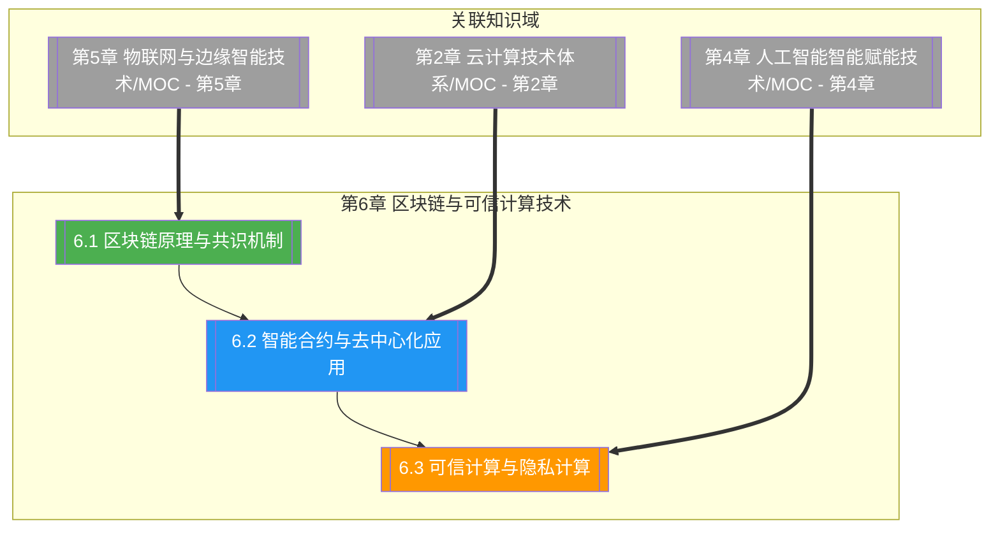

# 第6章 区块链与可信计算技术

> [!abstract] 章节概述
> 本章在 [[1.1 前沿技术定义、特征与技术体系]] 的 ABCD5G 体系框架下，深入展开"B（Blockchain）"主线及其与可信计算、隐私计算的融合方向。从区块链的区块—链—哈希—Merkle 树数据结构出发，系统对比 PoW、PoS、DPoS、PBFT 四类共识机制与公链/联盟链/私链三种部署形态，以比特币与以太坊为典型实例；进而阐述智能合约与去中心化应用（DApp）的架构、Solidity 与 EVM 执行模型，以及 DeFi、NFT 等链上应用范式；最后聚焦可信计算（TPM/TEE/SGX）与隐私计算（MPC、同态加密、零知识证明、联邦学习），揭示"数据可用不可见"的安全流通范式。本章承接 [[第5章 物联网与边缘智能技术/MOC - 第5章]] 的端侧可信需求，与 [[第2章 云计算技术体系/MOC - 第2章]] 的分布式信任形成对照。

## 学习路线图

## 知识点导航

| 编号 | 知识点 | 核心内容 | 重要程度 |
|-----|--------|---------|---------|
| 6.1 | [[6.1 区块链原理与共识机制]] | 区块/链/哈希/Merkle 树、PoW/PoS/DPoS/PBFT、公链/联盟链/私链 | ⭐⭐⭐⭐⭐ |
| 6.2 | [[6.2 智能合约与去中心化应用]] | Solidity、EVM、DApp 架构、DeFi、NFT | ⭐⭐⭐⭐⭐ |
| 6.3 | [[6.3 可信计算与隐私计算]] | TPM/TEE/SGX、MPC、同态加密、零知识证明、联邦学习 | ⭐⭐⭐⭐ |

## 核心概念速览

> [!tip] 本章必须掌握的核心概念
> - **区块链**：由区块按哈希链式连接组成的只增不改分布式账本，解决去中心化信任问题
> - **哈希链**：每个区块头包含前一区块哈希，篡改任一区块将导致后续所有哈希失效
> - **Merkle 树**：区块内交易的二叉哈希树，支持轻节点 SPV 高效验证交易存在性
> - **PoW**：工作量证明，通过算力难题竞争出块权，比特币代表，能耗高
> - **PoS**：权益证明，按持币量与时间选举验证者，以太坊 2.0 转向 PoS
> - **DPoS**：委托权益证明，持币者投票选出少量出块节点，EOS 代表
> - **PBFT**：实用拜占庭容错，三阶段投票达成最终性，联盟链常用
> - **智能合约**：部署在链上的图灵完备可执行代码，触发即自动执行
> - **EVM**：以太坊虚拟机，智能合约的沙箱执行环境
> - **DApp**：前端 + 智能合约 + 区块链的去中心化应用
> - **DeFi**：去中心化金融，Uniswap 自动做市、Aave 借贷协议
> - **NFT**：非同质化通证，基于 ERC-721 标识数字资产唯一性
> - **TEE/SGX**：可信执行环境与英特尔安全飞地，硬件隔离保护数据机密性
> - **同态加密**：密文上直接计算得到等价于明文计算结果的加密方案
> - **零知识证明**：证明者不泄露秘密本身即可使验证者确信命题成立
> - **联邦学习**：数据不动模型动，多方联合训练不交换原始数据

## 核心考点

> [!important] 期末高频考点

| 考点 | 所属知识点 | 考查形式 | 难度 |
|-----|-----------|---------|------|
| 区块链数据结构与防篡改原理 | 6.1 | 简答题/论述题 | ★★★ |
| Merkle 树与 SPV 验证 | 6.1 | 简答题/计算题 | ★★★★ |
| PoW 与 PoS 共识机制对比 | 6.1 | 对比题/论述题 | ★★★★ |
| PBFT 三阶段流程与容错阈值 | 6.1 | 简答题/论述题 | ★★★★ |
| 公链/联盟链/私链对比与选型 | 6.1 | 对比题/案例分析 | ★★★ |
| 智能合约定义与 EVM 执行模型 | 6.2 | 简答题/论述题 | ★★★★ |
| DApp 架构与传统应用差异 | 6.2 | 论述题/案例分析 | ★★★ |
| DeFi 自动做市与借贷原理 | 6.2 | 简答题/案例分析 | ★★★★ |
| NFT 标准与数字资产确权 | 6.2 | 简答题 | ★★★ |
| TEE/SGX 可信执行环境原理 | 6.3 | 简答题/论述题 | ★★★★ |
| 同态加密分类与原理 | 6.3 | 简答题/论述题 | ★★★★ |
| 零知识证明原理与应用 | 6.3 | 论述题 | ★★★★ |
| 联邦学习与隐私计算选型 | 6.3 | 对比题/案例分析 | ★★★★ |
| 数据安全流通技术方案 | 6.3 | 案例分析 | ★★★ |

## 自测题

> [!question] 章节自测
> 1. 绘制区块链的区块—链数据结构图，说明区块头字段、哈希链与 Merkle 树如何共同实现"只增不改"的防篡改特性；并解释轻节点如何通过 SPV 验证某笔交易已被打包。
> 2. 对比 PoW、PoS、DPoS、PBFT 四类共识机制在出块者选举、能耗、最终性、容错阈值（如 $f < n/3$）上的差异，并为"跨境支付结算"与"公链数字货币"两个场景分别选择合适共识并说明理由。
> 3. 阐述智能合约的执行模型与 EVM 沙箱机制，绘制 DApp 三层架构图；以 Uniswap 自动做市或 Aave 借贷为例，说明 DeFi 如何在无需信任中介的前提下实现资产交易或借贷。
> 4. 论述可信执行环境（TEE/SGX）、同态加密、零知识证明与联邦学习四类隐私计算技术的基本原理与适用边界，并为"多医院联合训练疾病预测模型"与"政务数据跨部门查询"两个场景分别设计数据安全流通方案。

## 章节导航

| 方向 | 链接 |
|-----|------|
| ⬆ 返回课程总览 | [[MOC - 专业前沿技术]] |
| ⬅ 上一章 | [[第5章 物联网与边缘智能技术/MOC - 第5章]] |
| ➡ 下一章 | [[第7章 新一代移动通信技术（5G6G）/MOC - 第7章]] |

## 关联知识

- [[第5章 物联网与边缘智能技术/MOC - 第5章]] - 物联网设备身份与数据上链的源头
- [[第2章 云计算技术体系/MOC - 第2章]] - 区块链作为分布式系统的信任对比
- [[第4章 人工智能智能赋能技术/MOC - 第4章]] - 联邦学习与 AI 模型训练的融合
- [[1.1 前沿技术定义、特征与技术体系]] - ABCD5G 体系中 Blockchain 的定位
