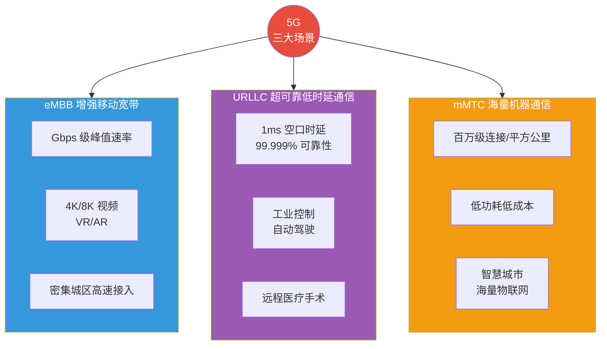
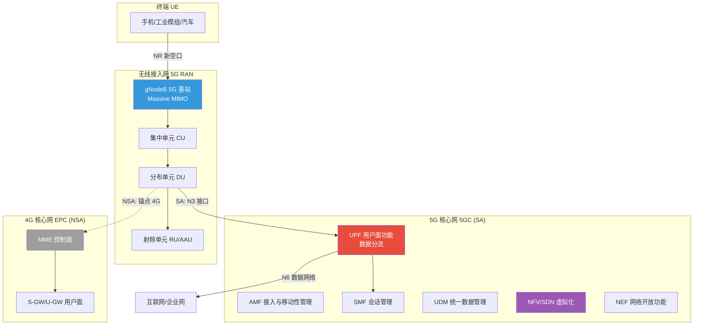
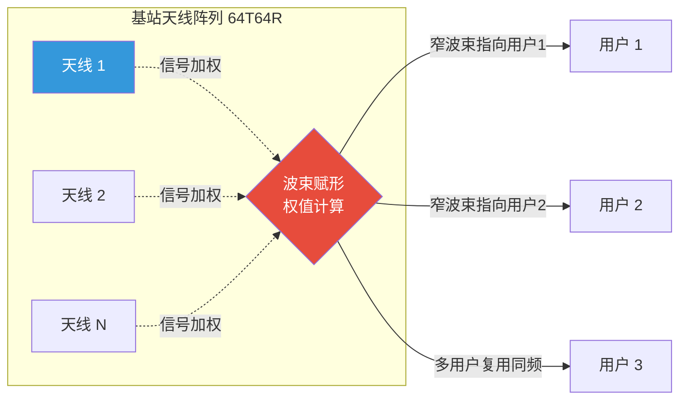
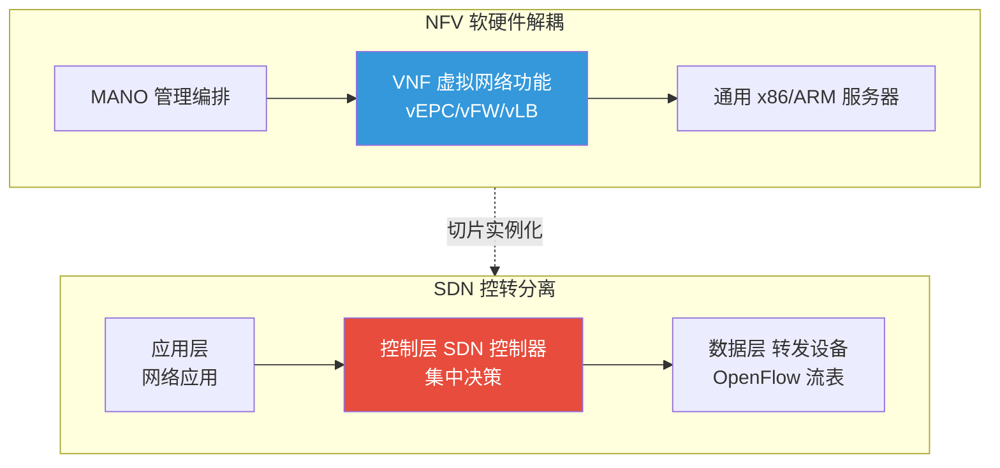

# 7.1 5G网络架构与关键技术

> [!abstract] 本节导读
> 本节解决"5G 如何用一套网络同时服务高速宽带、超低时延与海量连接三类差异巨大的业务"的问题。从 5G 三大场景（eMBB、URLLC、mMTC）的技术指标入手，阐述 SA/NSA 两种组网架构的差异与演进；进而深入大规模 MIMO、波束赋形、网络切片、NFV/SDN 四项关键技术；最后对比 5G 与 4G 的关键指标。本节是 5G 的体系纲领，为 [[7.2 网络切片与边缘计算MEC]] 的端到端切片与 MEC 部署、[[7.3 6G愿景与前沿技术]] 的代际演进奠定基础。

## 一、5G 三大场景

5G 由 ITU IMT-2020 定义三大应用场景，对应差异化的业务需求，是理解 5G 全部技术设计的起点。



### 1.1 三大场景指标

| 场景 | 全称 | 核心指标 | 典型应用 |
|-----|------|---------|---------|
| **eMBB** | Enhanced Mobile Broadband | 峰值速率下行 20 Gbps / 上行 10 Gbps，用户体验 100 Mbps | 4K/8K 视频、VR/AR、云游戏 |
| **URLLC** | Ultra-Reliable Low-Latency Communication | 空口时延 1 ms，可靠性 99.999%，移动性 500 km/h | 工业控制、自动驾驶、远程手术 |
| **mMTC** | Massive Machine Type Communication | 连接密度 $10^6$/km²，电池寿命 10 年 | 智慧城市、智能抄表、环境监测 |

> [!important] 场景间的技术张力
> 三大场景对网络的需求相互矛盾：eMBB 追求吞吐量而容忍一定时延，URLLC 追求极致时延与可靠性，mMTC 追求海量连接与低功耗。单一网络难以同时满足，这正是 5G 引入网络切片与灵活帧结构的根本动机。

## 二、5G 网络架构

5G 网络由无线接入网（RAN）与核心网（CN）两部分组成，按是否使用 4G 核心网分为 NSA 与 SA 两种组网方式。



### 2.1 SA 与 NSA 组网

| 维度 | SA 独立组网 | NSA 非独立组网 |
|-----|------------|---------------|
| **核心网** | 5GC（全新 5G 核心网） | 4G EPC（沿用 4G 核心网） |
| **空口** | 5G NR 新空口独立 | 5G NR 锚定 4G LTE 控制面 |
| **时延** | 可达 URLLC 1 ms | 受 4G 限制，难以满足 URLLC |
| **网络切片** | 完整支持 | 受限或不支持 |
| **MEC** | 原生支持 UPF 下沉 | 支持有限 |
| **部署成本** | 高（需新建核心网） | 低（利旧 4G 核心网） |
| **适用阶段** | 5G 成熟期、行业应用 | 5G 早期快速覆盖 |

> [!important] 为何 URLLC 必须用 SA
> NSA 的控制面锚定在 4G EPC，时延与可靠性受 4G 体系限制，无法达到 1 ms 空口时延与 99.999% 可靠性；NSA 也难以实现端到端网络切片与 UPF 下沉的边缘计算。因此工业互联网、自动驾驶等 URLLC 行业应用必须采用 SA 组网，这也是 5G ToB 行业落地的关键技术前提。

### 2.2 5G 核心网服务化架构

5GC 采用基于服务的架构（SBA），网络功能以服务形式通过 HTTP/2 交互，主要功能包括：

| 网络功能 | 全称 | 职责 |
|---------|------|------|
| **AMF** | Access and Mobility Management Function | 接入与移动性管理 |
| **SMF** | Session Management Function | 会话建立与管理 |
| **UPF** | User Plane Function | 用户面数据转发与分流 |
| **UDM** | Unified Data Management | 统一数据管理（用户签约） |
| **PCF** | Policy Control Function | 策略控制 |
| **NEF** | Network Exposure Function | 能力开放给第三方 |
| **NRF** | Network Repository Function | 网络功能注册与发现 |

## 三、5G 关键技术

### 3.1 大规模 MIMO 与波束赋形

Massive MIMO 在基站侧使用大规模天线阵列（如 64T64R、128T128R），通过空间复用与分集大幅提升频谱效率与小区容量。

波束赋形（Beamforming）通过对每根天线信号施加幅相加权，把能量聚焦到目标用户方向形成窄波束，而非全向广播，提升信号强度并降低干扰。



> [!note] Massive MIMO 的增益来源
> Massive MIMO 通过三方面提升性能：①**阵列增益**——多天线相干合并提升接收信噪比；②**空间复用**——同时同频服务多用户（MU-MIMO），提升频谱效率；③**干扰抑制**——利用大规模阵列的精细空间分辨力压零陷抑制干扰用户。

### 3.2 网络切片

网络切片（Network Slicing）在同一物理网络基础设施上按业务需求划分多个端到端逻辑网络，每个切片拥有独立的资源、配置与 SLA，互不干扰。其实现依赖 NFV/SDN 与 5GC 服务化架构。详见 [[7.2 网络切片与边缘计算MEC]] 的端到端展开。

### 3.3 NFV 与 SDN

| 技术 | 全称 | 核心思想 |
|-----|------|---------|
| **NFV** | Network Functions Virtualization | 网络功能从专用硬件解耦，以软件形式运行于通用服务器（COTS） |
| **SDN** | Software-Defined Networking | 控制面与数据面分离，控制面集中化、可编程 |



> [!important] NFV/SDN 是网络切片的使能技术
> 网络切片需要为不同业务动态组合所需的网络功能（AMF/SMF/UPF）并分配独立资源。NFV 让这些功能可软件化实例化，SDN 让链路与带宽可按需编程，二者共同支撑切片的弹性创建、隔离与生命周期管理。没有 NFV/SDN，5G 网络切片在工程上无法实现。

## 四、5G 与 4G 对比

| 指标 | 4G LTE | 5G NR | 提升倍数 |
|-----|--------|-------|---------|
| **峰值速率（下行）** | 1 Gbps | 20 Gbps | 20× |
| **用户体验速率** | 10 Mbps | 100 Mbps | 10× |
| **空口时延** | 10 ms | 1 ms（URLLC） | 10× |
| **连接密度** | $10^5$/km² | $10^6$/km² | 10× |
| **移动性** | 350 km/h | 500 km/h | 1.4× |
| **频谱效率** | 基准 | 3× | 3× |
| **能效** | 基准 | 100× | 100× |
| **核心网** | EPC | 5GC（SBA） | 架构重构 |
| **关键频段** | Sub-6GHz | Sub-6GHz + 毫米波 mmWave | 拓展 mmWave |

> [!tip] 5G 双频段策略
> 5G 同时使用 Sub-6GHz（6GHz 以下，覆盖广、容量中等）与毫米波 mmWave（24~52GHz，带宽超大、覆盖短、衰减快）。Sub-6GHz 用于广域连续覆盖，毫米波用于热点高容量，二者协同实现覆盖与容量的平衡。

## 五、示例：5G 时延预算分析

```python
# 简化分析 5G URLLC 端到端时延预算，对比 eMBB 与 URLLC 场景
# 运行环境：Python 3.10，仅标准库
# 工作目录：任意

def urlle_latency_budget():
    # URLLC 端到端时延预算（单位：毫秒）
    return {
        "终端处理": 0.3,
        "空口上下行传输": 1.0,   # 5G NR 短 TTI + mini-slot
        "基站处理": 0.2,
        "传输网": 0.5,           # 本地 UPF 下沉，传输距离短
        "核心网用户面 UPF": 0.5,
        "应用服务器": 0.5,
    }

def embb_latency_budget():
    # eMBB 端到端时延预算（单位：毫秒，相对宽松）
    return {
        "终端处理": 2.0,
        "空口上下行传输": 4.0,
        "基站处理": 1.0,
        "传输网": 5.0,           # UPF 在远端核心网，回传距离长
        "核心网用户面 UPF": 2.0,
        "应用服务器": 2.0,
    }

for scenario, budget in [("eMBB", embb_latency_budget()),
                         ("URLLC", urlle_latency_budget())]:
    total = sum(budget.values())
    print(f"\n{scenario} 端到端时延预算（共 {total:.1f} ms）:")
    for k, v in budget.items():
        print(f"  {k:20s}: {v:.1f} ms")

# 关键结论：URLLC 通过短 TTI、MEC 本地 UPF 下沉与精简协议栈，
# 把端到端时延压到 3~5 ms 量级，满足工业控制需求。
```

```bash
# 使用 srsRAN 开源项目在笔记本上搭建 5G NSA/SA 实验网络（伪流程）
# 工作环境：Ubuntu 22.04、srsRAN 4G/5G 套件、USRP 软件无线电
# 工作目录：srsRAN 安装目录
sudo srsenb --enb.n_prb 50 --rf.device_name zmq        # 启动 5G 基站
sudo srsgnb --gNB.n_prb 50 --rf.device_name zmq        # 启动 gNB
sudo srsue --rf.device_name zmq                        # 启动虚拟终端
```

> [!summary] 本节要点回顾
> 1. **三大场景**：eMBB（20 Gbps 高速宽带）、URLLC（1 ms 超低时延）、mMTC（$10^6$/km² 海量连接）
> 2. **SA/NSA**：SA 全新 5G 核心网支持切片与 URLLC，NSA 利旧 4G 核心网快速部署，行业应用必须 SA
> 3. **5GC SBA**：AMF/SMF/UPF 等服务化网络功能，UPF 下沉支持边缘计算
> 4. **Massive MIMO + 波束赋形**：大规模天线阵列 + 窄波束聚焦，提升容量与覆盖
> 5. **网络切片**：端到端逻辑网络隔离，依赖 NFV/SDN 实现弹性实例化
> 6. **NFV/SDN**：硬件解耦 + 控转分离，是切片的使能技术
> 7. **5G vs 4G**：速率 20×、时延 1/10、连接密度 10×，引入毫米波与全新核心网架构

## 关联知识点

| 关联知识点 | 关系 |
|-----------|------|
| [[7.2 网络切片与边缘计算MEC]] | 本节切片与 UPF 下沉的端到端展开 |
| [[7.3 6G愿景与前沿技术]] | 5G 向 6G 的代际演进方向 |
| [[第5章 物联网与边缘智能技术/5.1 物联网体系架构与通信协议]] | mMTC 是物联网海量连接的承载 |
| [[第2章 云计算技术体系/2.3 边缘云与分布式云架构]] | 5G MEC 的边缘云底座 |
| [[MOC - 第7章]] | 返回本章导航 |
