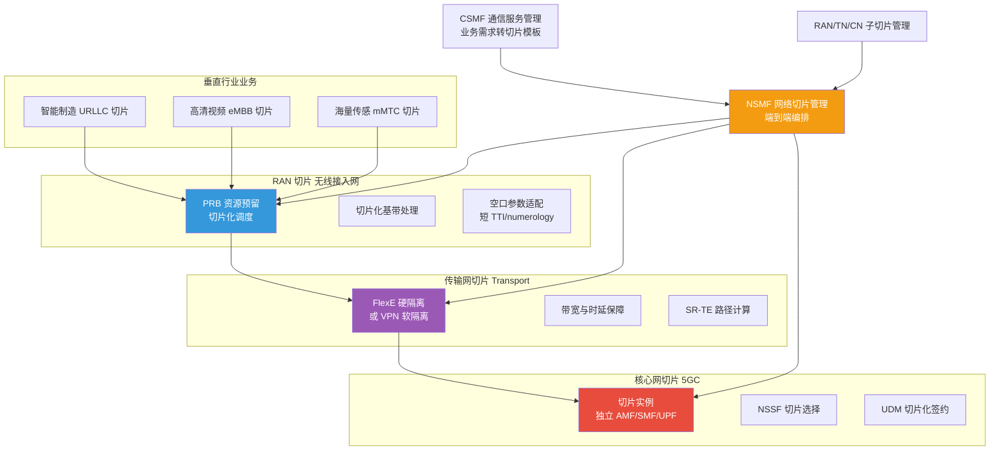
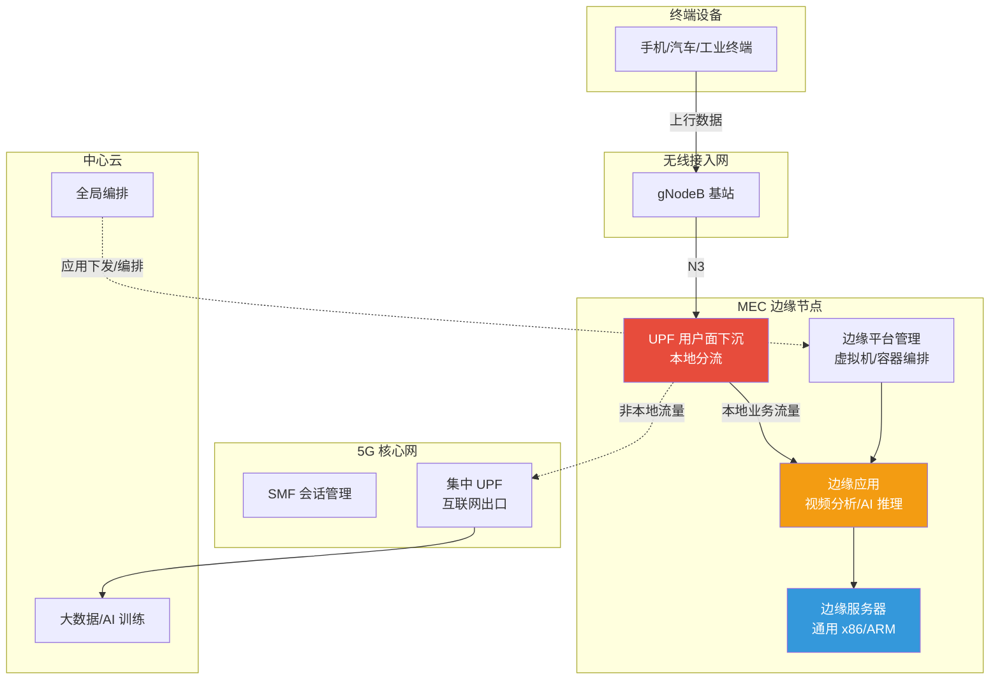
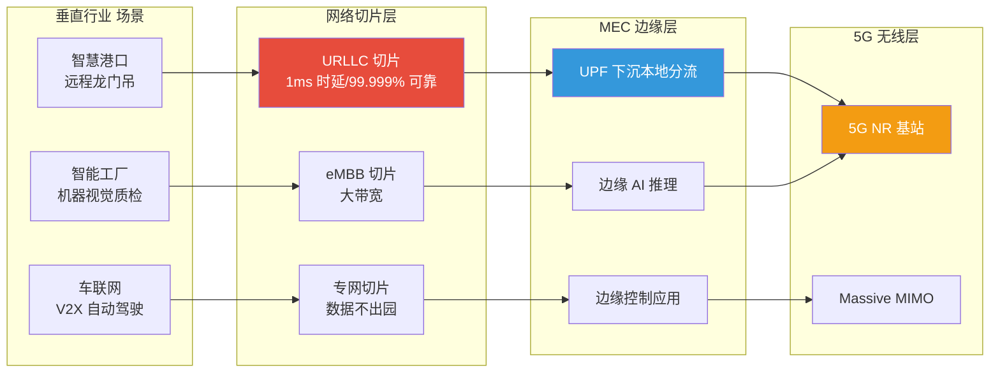

# 7.2 网络切片与边缘计算MEC

> [!abstract] 本节导读
> 本节解决"如何在一套 5G 物理网络上为不同垂直行业提供端到端逻辑隔离与本地化算力"的问题。从网络切片的定义与端到端三层架构（RAN 切片、传输切片、核心网切片）入手，说明切片的实例化与隔离机制；进而阐述 MEC（多接入边缘计算）的架构与部署模式，揭示 UPF 下沉如何把数据面推向边缘；最后聚焦"5G + 网络切片 + MEC"在垂直行业的协同方案。本节承接 [[7.1 5G网络架构与关键技术]] 的切片与 NFV/SDN 基础，与 [[第2章 云计算技术体系/2.3 边缘云与分布式云架构]] 的边缘云形成协同。

## 一、网络切片

网络切片（Network Slicing）是在同一物理网络基础设施上，按业务需求划分出多个端到端（End-to-End, E2E）的逻辑网络，每个切片拥有独立的资源、拓扑、配置与 SLA，彼此隔离运行。

### 1.1 切片的本质价值

| 价值 | 说明 |
|-----|------|
| **业务定制** | 为 eMBB/URLLC/mMTC 三类场景分别提供适配的网络能力 |
| **资源隔离** | 一个切片拥塞或故障不影响其他切片 |
| **弹性分配** | 按需动态扩缩切片资源，提升资源利用率 |
| **行业专网** | 为企业按需提供"专网级"服务，数据本地化不出园 |

> [!important] 网络切片 vs 传统 QoS
> 传统 QoS 仅在拥塞时按优先级调度流量，是单点行为；网络切片是端到端逻辑网络隔离，从无线、传输到核心网全程分配独立资源与功能实例，是结构性的"多网络合一"。QoS 是切片内的一种调度手段，而非切片本身。

### 1.2 端到端切片三层架构

E2E 切片需跨无线接入网（RAN）、传输网、核心网三层协同，任何一层缺失都不能构成端到端隔离。



### 1.3 切片管理与三层职责

| 管理功能 | 全称 | 职责 |
|---------|------|------|
| **CSMF** | Communication Service Management Function | 接收业务需求，转化为切片需求模板 |
| **NSMF** | Network Slice Management Function | 端到端切片编排与生命周期管理 |
| **NSSMF** | Network Slice Subnet Management Function | 各子域（RAN/TN/CN）切片管理 |

| 层级 | 切片隔离手段 |
|-----|-------------|
| **RAN 切片** | PRB（物理资源块）预留、切片化调度、numerology 与 TTI 适配 |
| **传输切片** | FlexE 硬隔离、MPLS/VPN 软隔离、SR-TE 显式路径 |
| **核心网切片** | 独立 AMF/SMF/UPF 实例、NSSF 切片选择、UDM 切片化签约 |

> [!note] 切片隔离的强度
> 切片隔离分硬隔离与软隔离：硬隔离（如 FlexE 时分、专用 UPF）资源独占不共享，隔离强但利用率低；软隔离（如 VPN、共享 UPF 加逻辑划分）资源共享按需调度，利用率高但隔离弱。实际部署按业务 SLA 等级组合使用。

## 二、MEC 多接入边缘计算

MEC（Multi-access Edge Computing）是把计算、存储与网络能力从中心云下沉到网络边缘（如基站侧、汇聚点）的架构，使数据就近处理，降低时延、节省回传带宽并保护数据本地化。

### 2.1 MEC 架构



> [!important] UPF 下沉是 5G MEC 的关键
> 5G 用户面功能 UPF 是数据转发的"水龙头"。传统部署 UPF 在核心网远端，所有数据回传中心处理。MEC 把 UPF 下沉到边缘节点，通过"本地分流"策略让园区/本地业务流量在边缘直接卸载给 MEC 应用，无需绕行中心核心网，时延从几十毫秒降到几毫秒，并实现数据本地化不出园。

### 2.2 MEC 部署模式

| 部署位置 | 时延 | 典型场景 |
|---------|------|---------|
| **基站侧（CU/DU 旁）** | 1~5 ms | 工业控制、AR/VR、自动驾驶 |
| **边缘数据中心（汇聚层）** | 5~15 ms | 视频监控分析、园区企业应用 |
| **区域中心（城域）** | 15~30 ms | CDN 缓存、区域性 AI 推理 |

### 2.3 MEC 核心能力

| 能力 | 说明 |
|-----|------|
| **本地分流** | UPF 下沉，本地流量就近卸载，降低回传时延 |
| **边缘计算** | 通用服务器运行容器化应用（视频分析、AI 推理） |
| **能力开放** | 通过 API 开放无线网络状态（位置、带宽、无线质量） |
| **低时延保障** | 数据面就近处理，端到端时延降至毫秒级 |
| **数据本地化** | 园区数据不出场，满足合规与隐私 |

## 三、5G + 网络切片 + MEC 行业协同

5G、网络切片与 MEC 三者协同是 5G ToB 行业落地的核心范式：5G 提供无线接入与移动性，切片提供端到端逻辑隔离与 SLA 保障，MEC 提供本地算力与数据分流。



### 3.1 典型行业方案

| 行业场景 | 切片类型 | MEC 作用 | 关键指标 |
|---------|---------|---------|---------|
| **智慧港口远程控制** | URLLC 专网切片 | UPF 下沉 + 远程控制应用 | 时延 < 20 ms，数据不出港 |
| **机器视觉质检** | eMBB 切片 | 边缘 AI 推理上传缺陷图 | 上行大带宽，时延 50 ms |
| **车联网 V2X** | URLLC 切片 | 边缘路况感知与决策 | 时延 < 10 ms，高可靠 |
| **AR 远程指导** | eMBB 切片 | 边缘渲染降低终端负载 | 下行大带宽，时延 < 20 ms |
| **智慧园区专网** | 专网切片 | 本地数据不出园 + 边缘应用 | 数据隔离、合规 |

> [!example] 智慧港口远程龙门吊控制方案
> 传统港口龙门吊需司机在驾驶室操作，环境恶劣且效率受限。5G + 切片 + MEC 方案：①部署 5G 专网基站覆盖港区；②开通 URLLC 切片保障 20 ms 内端到端时延与 99.999% 可靠性；③UPF 下沉到港口 MEC 节点，高清视频与控制指令本地分流不出港；④司机在远程控制中心通过多路高清视频回传实时操控。切片保障 SLA，MEC 保障时延与数据本地化，5G 保障无线移动性。

## 四、示例：5G 切片与 MEC 时延仿真

```python
# 简化仿真对比"传统集中式 UPF"与"MEC 本地 UPF 下沉"在端到端时延上的差异
# 运行环境：Python 3.10，仅标准库
# 工作目录：任意
import random

def latency_traditional_upf():
    # 传统部署：UPF 在远端核心网，回传距离长
    radio = random.uniform(8, 12)        # 空口时延 ms
    transport = random.uniform(8, 15)    # 长距离回传
    upf = random.uniform(2, 4)           # 远端 UPF 处理
    server = random.uniform(2, 5)        # 远端应用服务器
    return radio + transport + upf + server

def latency_mec_local_upf():
    # MEC 部署：UPF 下沉到基站旁，本地分流
    radio = random.uniform(0.8, 1.5)     # URLLC 短 TTI 空口
    transport = random.uniform(0.2, 0.5) # 本地短回传
    upf = random.uniform(0.3, 0.6)       # 本地 UPF 处理
    server = random.uniform(0.5, 1.0)    # 边缘应用服务器
    return radio + transport + upf + server

random.seed(42)
trad = [latency_traditional_upf() for _ in range(100)]
mec = [latency_mec_local_upf() for _ in range(100)]

print(f"传统集中式 UPF: 平均 {sum(trad)/len(trad):.1f} ms, P99 {sorted(trad)[98]:.1f} ms")
print(f"MEC 本地 UPF 下沉: 平均 {sum(mec)/len(mec):.1f} ms, P99 {sorted(mec)[98]:.1f} ms")
print(f"时延降幅: {sum(trad)/sum(mec):.1f} 倍")
# 关键结论：MEC + UPF 下沉把端到端时延从 20~35 ms 降到 2~4 ms，满足 URLLC 工业控制需求。
```

```bash
# 使用开源 5G 核心网 free5GC + srsRAN 验证切片与 UPF 下沉（伪流程）
# 工作环境：Ubuntu 22.04、free5GC v3、srsRAN、Docker
# 工作目录：free5GC 安装目录
docker-compose up -d                                     # 启动 free5GC 各网络功能
# 配置两个切片实例：SST=1 (eMBB)、SST=2 (URLLC)
./bin/amf -c ./config/amfcfg.yaml &                      # 启动 AMF
# 在 UPF 配置中启用本地分流，将上行流量导向 MEC 应用容器
```

> [!summary] 本节要点回顾
> 1. **网络切片**：端到端逻辑网络隔离，业务定制、资源隔离、弹性分配、行业专网，远超传统 QoS
> 2. **E2E 三层切片**：RAN（PRB 预留/numerology）+ 传输（FlexE/VPN）+ 核心网（独立 AMF/SMF/UPF）协同
> 3. **切片管理**：CSMF（业务转模板）→ NSMF（端到端编排）→ NSSMF（子域管理）
> 4. **MEC**：计算/存储/网络下沉到边缘，本地分流、边缘计算、能力开放、数据本地化
> 5. **UPF 下沉**：5G MEC 关键，把数据面"水龙头"推到边缘，时延降至毫秒级
> 6. **5G + 切片 + MEC**：5G 接入、切片隔离、MEC 算力三位一体赋能 ToB 行业
> 7. **典型方案**：智慧港口（URLLC+本地分流）、机器视觉（eMBB+边缘 AI）、V2X（URLLC+边缘决策）

## 关联知识点

| 关联知识点 | 关系 |
|-----------|------|
| [[7.1 5G网络架构与关键技术]] | 本节切片与 MEC 建立在 5G SA 架构与 NFV/SDN 之上 |
| [[7.3 6G愿景与前沿技术]] | 6G 切片将向 AI 原生自治切片演进 |
| [[第2章 云计算技术体系/2.3 边缘云与分布式云架构]] | MEC 是边缘云在通信网中的特化 |
| [[第5章 物联网与边缘智能技术/5.2 边缘智能与端云协同]] | MEC 是边缘智能的算力底座 |
| [[MOC - 第7章]] | 返回本章导航 |
