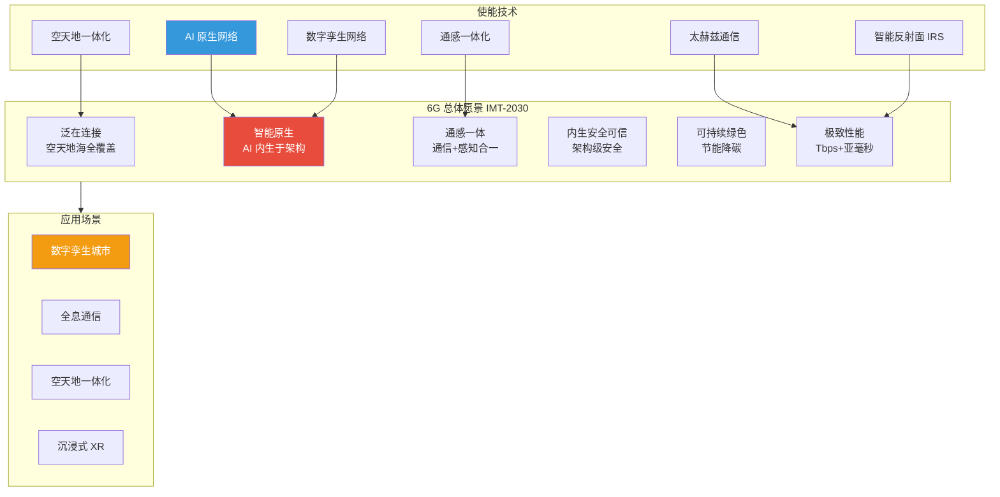
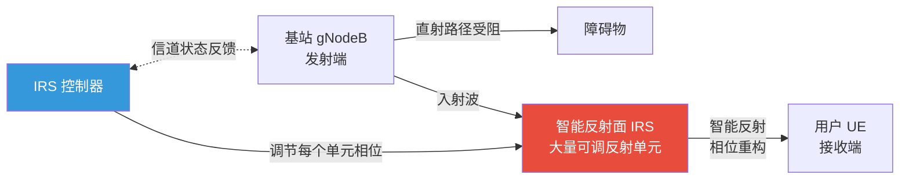
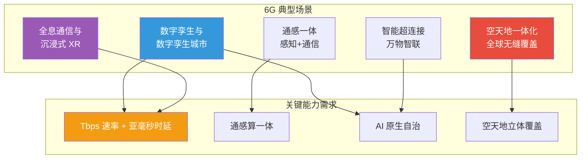

# 7.3 6G愿景与前沿技术

> [!abstract] 本节导读
> 本节解决"5G 之后移动通信如何向 2030 年代演进以支撑全息通信、数字孪生与空天地海全覆盖"的问题。从 6G 总体愿景（泛在连接、智能原生、通感一体、内生安全）入手，系统介绍太赫兹通信、智能反射面（IRS）、AI 原生网络、通感一体化四项前沿技术；对比 6G 与 5G 的代际指标；最后展望数字孪生、全息通信、空天地一体化等典型场景。本节承接 [[7.2 网络切片与边缘计算MEC]] 的切片与边缘能力，与 [[第4章 人工智能智能赋能技术/MOC - 第4章]] 的 AI 能力深度融合。

## 一、6G 总体愿景

6G 是面向 2030 年商用的新一代移动通信系统，ITU IMT-2030 愿景定义其六大目标：泛在连接、超低时延、智能原生、通感一体、内生安全与可持续发展。6G 不再只是"更快的 5G"，而是从"连接万物"升级为"连接智能"。



## 二、6G 关键前沿技术

### 2.1 太赫兹通信

太赫兹（Terahertz, THz）频段指 0.1~10 THz 的电磁波，介于微波与红外之间，6G 关注 100 GHz~1 THz 频段。

| 特性 | 说明 |
|-----|------|
| **超大带宽** | 可用带宽数十 GHz，支撑 Tbps 级峰值速率 |
| **超高速率** | 短距传输可达 100 Gbps~1 Tbps |
| **强方向性** | 波束窄、指向性强，利于安全传输 |
| **传播损耗大** | 路径损耗随频率平方增长，覆盖距离短（米级） |
| **绕射弱** | 几乎不能穿透障碍物，要求视距（LOS）传输 |

> [!important] 太赫兹的挑战
> 太赫兹通信的主要瓶颈是：①路径损耗极大，需超高增益天线与超大规模天线阵列补偿；②器件工艺不成熟（高功率 THz 源、低噪放大器难做）；③易被人体、雨雾遮挡，要求密集部署与 IRS 辅助。其应用定位是"短距超高速"（室内、数据中心间）与"超密集热点"，而非广域覆盖。

### 2.2 智能反射面（IRS）

智能反射面（Intelligent Reflecting Surface, IRS），又称可重构智能表面（RIS），是一块由大量低成本无源反射单元组成的超表面，每个单元可由控制器动态调整电磁波的相位/幅度，从而"重塑"无线信道。



> [!note] IRS 的价值
> IRS 是无源器件（不放大信号、不耗电），通过被动反射把原本被阻挡的信号"绕"到接收端，等效于在环境中部署了大量低成本"中继"。其优势：①低成本、低功耗、易大规模部署；②能在视距受阻场景提升覆盖；③与 Massive MIMO 协同增强波束。IRS 是 6G"智能无线环境"愿景的核心技术。

### 2.3 AI 原生网络

5G 中的 AI 多为"外挂式"——在网络外部做优化后下发配置。6G 迈向"AI 原生"（AI-Native）：AI 从设计之初就内生于网络架构，成为协议、信令与功能的一部分，实现自治、自优、自愈。

| 维度 | 5G 的 AI（外挂） | 6G AI 原生 |
|-----|----------------|-----------|
| **定位** | 局部优化外挂 | 架构内生能力 |
| **范围** | 单点优化（调度、切换） | 端到端智能（接入、路由、切片、运维） |
| **协议** | 旁路影响协议 | AI 信令融入协议栈 |
| **自治** | 人工配置为主 | 自治闭环（感知—决策—执行） |
| **数据** | 离线训练 | 在线持续学习与联邦学习 |

> [!important] AI 原生网络的关键能力
> 6G AI 原生网络通过"感知—建模—决策—执行"闭环实现：①**智能切片**——按业务与流量自适应调整切片资源；②**语义通信**——传输语义而非比特，提升效率；③**数字孪生网络**——物理网络的数字镜像用于仿真预测；④**自愈**——故障预测与自动恢复。AI 与网络深度融合，是 6G 区别于 5G 的本质特征。

### 2.4 通感一体化

通感一体化（Integrated Sensing and Communication, ISAC）让同一套频谱、天线与硬件同时承担通信与感知两种功能，实现"一张网既能通信又能像雷达一样感知环境"。

| 维度 | 传统分离 | 通感一体化 |
|-----|---------|-----------|
| **频谱** | 通信与雷达各自独立频段 | 共享频谱，提升利用率 |
| **硬件** | 两套独立设备 | 共用射频与天线 |
| **信号** | 通信波形 vs 雷达脉冲 | 统一波形同时承载数据与感知 |
| **协同** | 无 | 通信辅助感知定位，感知辅助波束 |

> [!tip] 通感一体的典型应用
> 通感一体让 6G 基站同时具备"通信 + 雷达"能力：①车辆高精度定位与测速，辅助自动驾驶；②无人机感知与避障；③室内呼吸心跳监测；④低空安防入侵检测。这是 6G 服务"通信 + 感知 + 控制"融合应用的基础。

## 三、6G 与 5G 代际对比

| 指标 | 5G | 6G | 提升倍数 |
|-----|-----|-----|---------|
| **峰值速率** | 20 Gbps | 1 Tbps | 50× |
| **用户体验速率** | 100 Mbps | 10 Gbps | 100× |
| **空口时延** | 1 ms | 0.1 ms | 10× |
| **连接密度** | $10^6$/km² | $10^7$/km² | 10× |
| **可靠性** | 99.999% | 99.99999% | 100× |
| **频段** | Sub-6GHz + mmWave | 拓展至太赫兹 100GHz~1THz | 频段拓展 |
| **覆盖** | 地面为主 | 空天地海一体化 | 立体覆盖 |
| **智能** | AI 外挂优化 | AI 原生内构 | 范式转变 |
| **感知能力** | 无 | 通感一体化 | 新增能力 |
| **商用时间** | 2020 | 2030 左右 | — |

## 四、6G 典型应用场景



| 场景 | 描述 | 关键技术支撑 |
|-----|------|-------------|
| **数字孪生城市** | 物理城市的实时数字镜像，支持仿真预测与智能治理 | 高速率回传 + AI 原生 + 数字孪生网络 |
| **全息通信** | 全息影像实时传输，远程呈现"身临其境" | Tbps 速率 + 亚毫秒时延 + 通感一体 |
| **沉浸式 XR** | 视网膜级 VR/AR，触觉、嗅觉多感官 | 超低时延 + 高带宽 + 边缘 AI 渲染 |
| **空天地一体化** | 地面蜂窝 + 低轨卫星 + 高空平台（HAPS）全球无缝覆盖 | 立体组网 + 统一空口 |
| **通感一体应用** | 通信即感知，辅助自动驾驶、低空安防 | 统一波形 + 共享硬件 |
| **智能超连接** | 万物智联，从连接数据到连接智能 | AI 原生 + 语义通信 |

> [!important] 空天地一体化的意义
> 传统地面蜂窝仅覆盖陆地约 20% 面积，海洋、沙漠、空中均无服务。6G 通过低轨卫星星座（如星链）、高空无人机/气球平台（HAPS）与地面 5G/6G 融合，实现全球无缝覆盖，支持航空、航海、远洋科考、应急救灾等场景，是 6G"泛在连接"愿景的核心。

## 五、示例：6G 太赫兹链路预算估算

```python
# 简化估算 6G 太赫兹通信链路预算与最大覆盖距离
# 运行环境：Python 3.10，依赖 math
# 工作目录：任意
import math

def freespace_loss_db(freq_hz: float, distance_m: float) -> float:
    """自由空间路径损耗（dB）: L = 20log10(d) + 20log10(f) - 147.55"""
    return 20 * math.log10(distance_m) + 20 * math.log10(freq_hz) - 147.55

def max_coverage(freq_ghz: float, pt_dbm: float, gt_dbi: float, gr_dbi: float,
                 noise_dbm: float, snr_min_db: float):
    freq_hz = freq_ghz * 1e9
    # 求解使接收信噪比恰为 snr_min_db 的距离
    target_loss_db = pt_dbm + gt_dbi + gr_dbi - noise_dbm - snr_min_db
    # target_loss = 20log10(d) + 20log10(f) - 147.55
    log_d = (target_loss_db - 20 * math.log10(freq_hz) + 147.55) / 20
    return 10 ** log_d

# 假设参数（仅说明数量级，非真实部署）
# 6G 太赫兹 300 GHz
d_6g = max_coverage(freq_ghz=300, pt_dbm=10, gt_dbi=25, gr_dbi=25,
                    noise_dbm=-70, snr_min_db=10)
# 5G 毫米波 28 GHz
d_5g = max_coverage(freq_ghz=28, pt_dbm=10, gt_dbi=25, gr_dbi=25,
                    noise_dbm=-70, snr_min_db=10)

print(f"6G 300 GHz 太赫兹估算覆盖: {d_6g:.1f} m")
print(f"5G 28 GHz 毫米波估算覆盖: {d_5g:.1f} m")
print(f"覆盖距离比: {d_5g/d_6g:.1f} 倍")
# 关键结论：相同功率与天线增益下，太赫兹因频率高、路径损耗大，
# 覆盖距离显著短于毫米波，需密集部署与 IRS 辅助。
```

```bash
# 使用开源 SIONNA 仿真太赫兹信道与 IRS 辅助（伪流程）
# 工作环境：Python 3.10、TensorFlow、NVIDIA Sionna
# 工作目录：Sionna 项目目录
python -c "import sionna; sionna.config.freq=300e9"   # 配置 300 GHz 载频
# 在场景中加载 IRS 反射面模型，对比有/无 IRS 的接收功率分布
```

> [!warning] 6G 技术成熟度
> 6G 当前处于愿景与关键技术预研阶段（3GPP Rel-21 起），太赫兹器件、IRS 大规模组网、AI 原生协议、通感一体标准均未成熟。本节内容为基于 ITU IMT-2030 与学术界研究的展望，具体指标与方案可能随标准化进展调整，引用时需标注核实时间。

> [!summary] 本节要点回顾
> 1. **6G 愿景**：泛在连接、智能原生、通感一体、内生安全、可持续、极致性能，从"连接万物"到"连接智能"
> 2. **太赫兹通信**：0.1~1 THz 超大带宽支撑 Tbps 速率，但路径损耗大、覆盖短、需密集部署与 IRS 辅助
> 3. **智能反射面 IRS**：低成本无源超表面动态重构信道，"智能无线环境"核心，绕障增强覆盖
> 4. **AI 原生网络**：AI 内生于架构而非外挂，实现智能切片、语义通信、数字孪生网络、自治闭环
> 5. **通感一体化**：通信与感知共享频谱与硬件，"一张网既通信又感知"，支撑定位、监测、安防
> 6. **6G vs 5G**：速率 50×、时延 1/10、可靠性 100×，新增 AI 原生与通感能力，立体覆盖
> 7. **典型场景**：数字孪生城市、全息通信、空天地一体化、沉浸式 XR、通感一体应用

## 关联知识点

| 关联知识点 | 关系 |
|-----------|------|
| [[7.1 5G网络架构与关键技术]] | 6G 在 5G 架构基础上的代际演进 |
| [[7.2 网络切片与边缘计算MEC]] | 6G 切片向 AI 原生自治切片演进，MEC 向通感算一体演进 |
| [[第4章 人工智能智能赋能技术/MOC - 第4章]] | 6G AI 原生网络的算法基础 |
| [[第5章 物联网与边缘智能技术/5.3 工业互联网与数字孪生基础]] | 6G 数字孪生网络的孪生建模基础 |
| [[MOC - 第7章]] | 返回本章导航 |
