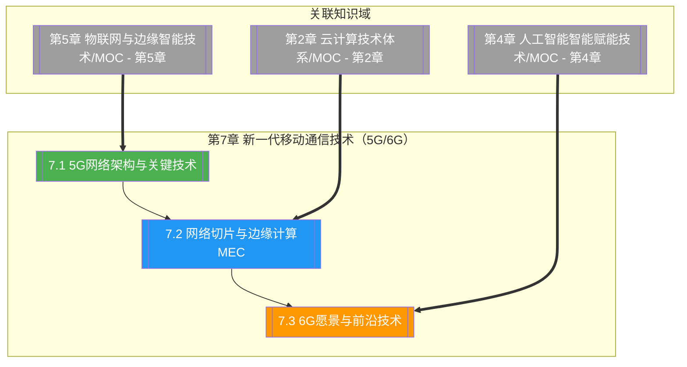

# 第7章 新一代移动通信技术（5G/6G）

> [!abstract] 章节概述
> 本章在 [[1.1 前沿技术定义、特征与技术体系]] 的 ABCD5G 体系框架下，深入展开"5G（通信）"主线及其向 6G 的演进方向。从 5G 三大场景（eMBB 增强移动宽带、URLLC 超可靠低时延通信、mMTC 海量机器通信）入手，阐述 SA/NSA 组网架构与大规模 MIMO、波束赋形、网络切片、NFV/SDN 等关键技术；进而聚焦网络切片端到端架构与 MEC 多接入边缘计算的融合部署，揭示"切片 + 边缘"如何赋能垂直行业；最后展望 6G 愿景，覆盖太赫兹通信、智能反射面（IRS）、AI 原生网络、通感一体化等前沿技术，以及数字孪生、全息通信、空天地一体化等应用场景。本章承接 [[第5章 物联网与边缘智能技术/MOC - 第5章]] 的海量连接需求，与 [[第2章 云计算技术体系/MOC - 第2章]] 的边缘云形成端边云协同。

## 学习路线图

## 知识点导航

| 编号 | 知识点 | 核心内容 | 重要程度 |
|-----|--------|---------|---------|
| 7.1 | [[7.1 5G网络架构与关键技术]] | eMBB/URLLC/mMTC、SA/NSA、Massive MIMO、波束赋形、NFV/SDN | ⭐⭐⭐⭐⭐ |
| 7.2 | [[7.2 网络切片与边缘计算MEC]] | 端到端切片、RAN/传输/核心网切片、MEC 架构、5G+MEC | ⭐⭐⭐⭐⭐ |
| 7.3 | [[7.3 6G愿景与前沿技术]] | 太赫兹、智能反射面、AI 原生、通感一体化、空天地一体 | ⭐⭐⭐⭐ |

## 核心概念速览

> [!tip] 本章必须掌握的核心概念
> - **5G 三大场景**：eMBB（增强移动宽带）、URLLC（超可靠低时延通信）、mMTC（海量机器通信）
> - **SA/NSA**：独立组网（全 5G 新空口+核心网）与非独立组网（5G NR 锚点 4G 核心网）
> - **Massive MIMO**：大规模多天线，提升容量与覆盖，配合波束赋形定向传输
> - **波束赋形**：通过天线阵列加权形成指向用户的窄波束，提升信号强度
> - **网络切片**：在同一物理网络上按业务需求划分多个端到端逻辑网络
> - **NFV/SDN**：网络功能虚拟化与软件定义网络，控制与转发分离、硬件解耦
> - **MEC**：多接入边缘计算，将计算与存储下沉到网络边缘，降低时延
> - **5G+MEC**：切片提供逻辑隔离，MEC 提供本地算力，协同赋能垂直行业
> - **6G 愿景**：泛在连接、智能原生、通感一体、空天地海全覆盖
> - **太赫兹通信**：0.1~10 THz 频段，超大带宽但传播损耗大
> - **智能反射面（IRS）**：可编程超表面动态反射/折射电磁波，重塑信道
> - **AI 原生网络**：AI 从外挂优化变为网络架构内生能力
> - **通感一体化**：通信与感知共享频谱与硬件，实现"一张网既能通信又能感知"
> - **数字孪生网络**：物理网络的数字镜像，支持仿真预测与智能运维
> - **空天地一体化**：地面蜂窝 + 卫星 + 高空平台的立体覆盖

## 核心考点

> [!important] 期末高频考点

| 考点 | 所属知识点 | 考查形式 | 难度 |
|-----|-----------|---------|------|
| 5G 三大场景及典型应用 | 7.1 | 简答题/填空题 | ★★ |
| SA 与 NSA 组网差异 | 7.1 | 对比题/简答题 | ★★★ |
| Massive MIMO 与波束赋形原理 | 7.1 | 简答题/论述题 | ★★★★ |
| 网络切片与 NFV/SDN 关系 | 7.1 | 简答题/论述题 | ★★★★ |
| 5G 与 4G 关键指标对比 | 7.1 | 对比题/简答题 | ★★★ |
| 端到端网络切片架构（RAN/传输/核心） | 7.2 | 简答题/论述题 | ★★★★ |
| MEC 架构与部署模式 | 7.2 | 简答题/案例分析 | ★★★★ |
| 5G + MEC 垂直行业方案 | 7.2 | 案例分析 | ★★★★ |
| 6G 愿景与典型场景 | 7.3 | 简答题/论述题 | ★★★ |
| 太赫兹通信特点与挑战 | 7.3 | 简答题/论述题 | ★★★★ |
| 智能反射面（IRS）原理 | 7.3 | 简答题/论述题 | ★★★★ |
| 通感一体化与 AI 原生网络 | 7.3 | 论述题 | ★★★★ |
| 6G 与 5G 技术代际对比 | 7.3 | 对比题/论述题 | ★★★ |

## 自测题

> [!question] 章节自测
> 1. 阐述 5G 三大场景（eMBB、URLLC、mMTC）的技术指标与典型应用，并说明 SA 与 NSA 两种组网架构在核心网、新空口、时延与切片支持上的差异，进一步解释为何工业互联网等 URLLC 场景必须采用 SA 组网。
> 2. 论述 Massive MIMO 与波束赋形的工作原理及其对容量与覆盖的提升机制；说明网络切片如何借助 NFV/SDN 实现端到端逻辑隔离，并绘制切片在 RAN、传输网、核心网三层的映射关系。
> 3. 阐述 MEC（多接入边缘计算）的架构与部署模式，说明"5G + 网络切片 + MEC"如何协同降低时延、保障带宽并隔离行业数据；以"智慧港口远程龙门吊控制"为例设计一个端到端行业方案。
> 4. 对比 6G 与 5G 在峰值速率、时延、连接密度、智能能力上的代际差异；阐述太赫兹通信、智能反射面（IRS）、AI 原生网络、通感一体化的基本原理，并说明它们如何支撑全息通信与空天地一体化等 6G 场景。

## 章节导航

| 方向 | 链接 |
|-----|------|
| ⬆ 返回课程总览 | [[MOC - 专业前沿技术]] |
| ⬅ 上一章 | [[第6章 区块链与可信计算技术/MOC - 第6章]] |
| ➡ 下一章 | [[第8章 量子计算与新型计算范式/MOC - 第8章]] |

## 关联知识

- [[第5章 物联网与边缘智能技术/MOC - 第5章]] - 物联网海量连接是 5G mMTC 的核心场景
- [[第2章 云计算技术体系/MOC - 第2章]] - MEC 是云计算向边缘的延伸
- [[第4章 人工智能智能赋能技术/MOC - 第4章]] - 6G AI 原生网络的算法基础
- [[1.1 前沿技术定义、特征与技术体系]] - ABCD5G 体系中 5G 的定位
