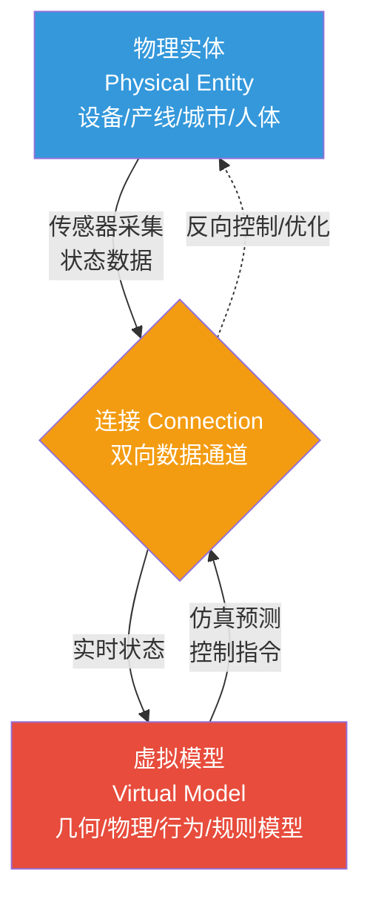
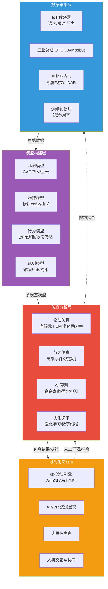
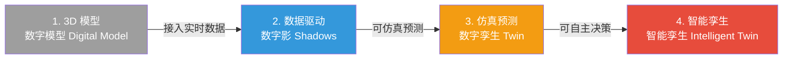

# 8.1 数字孪生技术体系

> [!abstract] 本节导读
> 本节解决"如何用数字镜像实时映射、仿真并预测物理世界"的问题。从数字孪生的定义与三要素（物理实体、虚拟模型、连接）入手，阐述四层架构（数据采集、模型构建、仿真分析、可视化）的数据闭环；进而展开从 3D 模型到智能孪生的四级成熟度演进；最后覆盖制造、城市、医疗三大典型应用。本节是数字孪生体系的纲领，为 [[8.2 元宇宙技术架构]] 的虚实融合空间与 [[8.3 虚拟现实与空间计算]] 的可视化交互奠定基础，并承接 [[第5章 物联网与边缘智能技术/5.3 工业互联网与数字孪生基础]] 的物联感知底座。

## 一、数字孪生的定义

数字孪生（Digital Twin）是物理实体在数字空间中的高保真动态映射，通过双向数据连接实现物理世界与虚拟世界的实时同步、仿真预测与智能决策。该概念由 Michael Grieves 于 2002 年在密歇根大学的产品全生命周期管理课程中首次提出，最初用于航天飞行器的健康维护。

### 1.1 三要素

数字孪生由三个不可分割的要素构成，缺一不可：



| 要素 | 含义 | 关键能力 |
|-----|------|---------|
| **物理实体** | 现实世界中被映射的对象，可以是设备、产线、建筑、城市乃至人体 | 提供真实状态与受控响应 |
| **虚拟模型** | 物理实体在数字空间的镜像，包含几何、物理、行为、规则等多维模型 | 表征、仿真、预测 |
| **连接** | 物理与虚拟之间的双向数据通道，是孪生"活"起来的关键 | 实时同步、闭环反馈 |

> [!important] 连接是数字孪生的灵魂
> 仅有一个 3D 模型不是数字孪生，仅做一次离线仿真也不是数字孪生。数字孪生区别于 CAD 建模与离线仿真的本质在于"双向连接"——物理状态实时流入虚拟，虚拟的仿真预测与优化决策反向作用于物理，形成闭环。无连接则只是"静态镜像"或"一次性仿真"。

### 1.2 数字孪生 vs 传统仿真

| 维度 | 传统仿真 | 数字孪生 |
|-----|---------|---------|
| **数据流向** | 单向输入参数 | 双向实时同步 |
| **生命周期** | 一次性、阶段化 | 全生命周期伴随 |
| **模型更新** | 静态、人工维护 | 随物理状态动态演化 |
| **决策闭环** | 人工解读结果 | 自动反馈控制物理 |
| **运行时机** | 离线、设计期 | 在线、运行期 |

## 二、数字孪生四层架构

数字孪生系统通常抽象为四层架构，自下而上完成"感知—建模—仿真—呈现"的闭环。



### 2.1 各层职责

| 层级 | 职责 | 关键技术 |
|-----|------|---------|
| **数据采集层** | 采集物理实体的多源异构数据并预处理 | IoT 传感器、OPC UA、LiDAR、边缘计算 |
| **模型构建层** | 构建几何、物理、行为、规则多维模型 | CAD/BIM、有限元、状态机、知识图谱 |
| **仿真分析层** | 基于模型做物理仿真、行为预测与优化决策 | FEM、离散事件仿真、AI 预测、强化学习 |
| **可视化交互层** | 以 3D/AR/VR 呈现孪生体并支持人机协同 | WebGL/WebGPU、Unity/Unreal、Three.js |

> [!note] 四类模型的层级
> 虚拟模型并非单一的三维几何，而是多维度模型的叠加：①**几何模型**——形状与尺寸；②**物理模型**——材料、力学、热学属性；③**行为模型**——状态转移与运行逻辑；④**规则模型**——领域约束与专家知识。模型维度越丰富，孪生体越接近真实，但构建与计算成本也越高。

### 2.2 数据闭环

数字孪生的核心价值来自"采集 → 建模 → 仿真 → 决策 → 反馈"的闭环，而非任何单层的能力：

1. **采集**：传感器实时采集物理状态（温度、振动、能耗等）
2. **建模**：将数据映射到虚拟模型，更新模型参数
3. **仿真**：在虚拟空间做物理仿真与 AI 预测（如剩余寿命、故障概率）
4. **决策**：基于仿真结果生成优化或控制策略
5. **反馈**：控制指令反向作用于物理实体，形成闭环

## 三、数字孪生成熟度等级

按模型保真度与智能程度，数字孪生呈现从低到高的四级演进。



| 等级 | 名称 | 特征 | 数据连接 | 典型应用 |
|-----|------|------|---------|---------|
| **L1** | 3D 模型 | 静态几何与外观，无实时数据 | 无 | 设计评审、可视化展示 |
| **L2** | 数据驱动 | 模型绑定实时数据，可反映当前状态 | 单向上行 | 远程监控、状态大屏 |
| **L3** | 仿真预测 | 可基于模型做物理仿真与故障预测 | 双向 | 预测性维护、工艺优化 |
| **L4** | 智能孪生 | AI 自主决策并反馈控制物理实体 | 双向闭环 | 自适应产线、自主优化系统 |

> [!important] 等级的本质差异
> L1 与 L2 看似都有"3D 模型"，但 L1 无数据连接、L2 单向上行；L3 的关键跃迁是"可仿真预测"——能基于物理模型推演未来状态；L4 的关键跃迁是"可自主决策"——AI 闭环控制物理实体。多数行业应用目前停留在 L2~L3，L4 智能孪生仍是前沿方向。

## 四、典型行业应用

### 4.1 智能制造

| 应用场景 | 孪生对象 | 价值 |
|---------|---------|------|
| 预测性维护 | 数控机床、风机齿轮箱 | 基于振动/温度预测故障，降低非计划停机 |
| 虚拟调试 | 整条产线 | 上线前在虚拟产线验证 PLC 程序，缩短调试周期 |
| 工艺优化 | 加工参数 | 仿真寻找最优切削参数，提升良率 |
| 质量追溯 | 单件产品 | 每件产品对应一个数字孪生，全流程可追溯 |

### 4.2 智慧城市

| 应用场景 | 孪生对象 | 价值 |
|---------|---------|------|
| 城市治理 | 建筑/路网/管网 | 可视化决策、应急推演 |
| 交通仿真 | 路网与车流 | 信号优化、拥堵预测 |
| 能源管理 | 电网/热网 | 负荷预测、调度优化 |
| 应急响应 | 灾害场景 | 洪涝/火灾蔓延仿真与疏散推演 |

### 4.3 智慧医疗

| 应用场景 | 孪生对象 | 价值 |
|---------|---------|------|
| 个体化医疗 | 患者器官 | 术前仿真、方案比选 |
| 药物研发 | 生理模型 | 虚拟临床试验，降低研发成本 |
| 远程手术 | 术区解剖结构 | 术中实时导航与风险预警 |

> [!example] 风机数字孪生预测性维护
> 大型风力发电机单台造价数千万元，齿轮箱故障会导致长时间停机。数字孪生方案：①在齿轮箱、主轴、叶片部署振动与温度传感器；②构建齿轮箱的几何+物理模型，输入材料属性与装配关系；③基于历史数据训练 AI 剩余寿命预测模型；④实时采集振动数据驱动模型，预测未来 30 天故障概率；⑤当概率超阈值自动告警并生成检修建议。该方案可将非计划停机时间降低 30%~50%。

## 五、示例：数字孪生数据流处理

```python
# 简化演示数字孪生"采集-建模-仿真-反馈"闭环的最小数据流
# 运行环境：Python 3.10，仅标准库
# 工作目录：任意
import random
from dataclasses import dataclass, field

@dataclass
class PhysicalEntity:
    """物理实体：模拟一台电机的运行状态"""
    temperature: float = 40.0     # 摄氏度
    vibration: float = 0.5        # mm/s
    running: bool = True

@dataclass
class DigitalTwin:
    """虚拟模型：电机的数字孪生"""
    model_temp: float = 40.0
    model_vib: float = 0.5
    history: list = field(default_factory=list)
    threshold_temp: float = 80.0
    threshold_vib: float = 4.0

    def sync(self, entity: PhysicalEntity):
        """从物理实体同步状态到虚拟模型"""
        self.model_temp = entity.temperature
        self.model_vib = entity.vibration
        self.history.append((self.model_temp, self.model_vib))

    def simulate_predict(self) -> dict:
        """仿真预测：基于当前状态推演未来故障概率"""
        temp_risk = min(1.0, max(0.0, (self.model_temp - 50) / 30))
        vib_risk = min(1.0, max(0.0, (self.model_vib - 2) / 2))
        fault_prob = max(temp_risk, vib_risk)
        return {"fault_prob": fault_prob,
                "predict_temp": self.model_temp + 2,
                "predict_vib": self.model_vib + 0.1}

    def decide(self, prediction: dict) -> str:
        """决策：生成控制指令"""
        if prediction["fault_prob"] > 0.8:
            return "停机检修"
        elif prediction["fault_prob"] > 0.5:
            return "降载运行"
        return "正常运行"

random.seed(42)
motor = PhysicalEntity()
twin = DigitalTwin()

# 模拟 10 个采样周期，温度与振动逐步升高
for t in range(10):
    motor.temperature += random.uniform(2, 5)
    motor.vibration += random.uniform(0.1, 0.4)
    twin.sync(motor)
    pred = twin.simulate_predict()
    action = twin.decide(pred)
    print(f"t={t:2d} 温度={motor.temperature:5.1f}℃ 振动={motor.vibration:4.2f}mm/s "
          f"故障概率={pred['fault_prob']:.2f} 决策={action}")
    if action == "停机检修":
        print("  -> 触发反向控制：电机停机，孪生闭环生效")
        motor.running = False
        break

# 关键结论：数字孪生通过"采集-建模-仿真-决策-反馈"闭环，
# 在故障发生前主动干预，体现了 L3~L4 的预测与决策能力。
```

```bash
# 使用开源数字孪生平台 Eclipse Ditto 搭建设备孪生（伪流程）
# 工作环境：Docker、Eclipse Ditto
# 工作目录：ditto 安装目录
docker-compose up -d                           # 启动 Ditto 策略与物模型服务
curl -X PUT http://localhost:8080/api/2/things  # 创建物模型 (Thing)
# 通过 MQTT 或 HTTP 将传感器数据写入 Ditto，Web 端订阅状态变化即可呈现孪生
```

> [!summary] 本节要点回顾
> 1. **定义**：数字孪生是物理实体在数字空间的动态高保真映射，三要素为物理实体、虚拟模型、连接
> 2. **本质区别**：与传统 CAD/仿真的核心差异在于双向连接与全生命周期在线闭环
> 3. **四层架构**：数据采集 → 模型构建（几何/物理/行为/规则）→ 仿真分析 → 可视化交互
> 4. **闭环价值**：采集—建模—仿真—决策—反馈，主动而非被动
> 5. **成熟度**：3D 模型（L1）→ 数据驱动（L2）→ 仿真预测（L3）→ 智能孪生（L4），多数应用在 L2~L3
> 6. **应用**：制造（预测性维护/虚拟调试）、城市（治理/交通）、医疗（个体化治疗）
> 7. **协同**：依赖 IoT 采集、5G 回传、AI 预测、XR 呈现，是多技术融合的产物

## 关联知识点

| 关联知识点 | 关系 |
|-----------|------|
| [[8.2 元宇宙技术架构]] | 数字孪生是元宇宙中"现实世界映射层"的核心技术 |
| [[8.3 虚拟现实与空间计算]] | 孪生的可视化交互层依赖 XR 与空间计算 |
| [[第5章 物联网与边缘智能技术/5.3 工业互联网与数字孪生基础]] | 物联网感知是数字孪生数据采集层的底座 |
| [[第4章 人工智能智能赋能技术/4.3 AI工程化与行业落地]] | AI 预测与决策是 L3~L4 智能孪生的核心 |
| [[第7章 新一代移动通信技术（5G6G）/7.2 网络切片与边缘计算MEC]] | 5G + MEC 提供孪生所需的低时延回传 |
| [[MOC - 第8章]] | 返回本章导航 |
