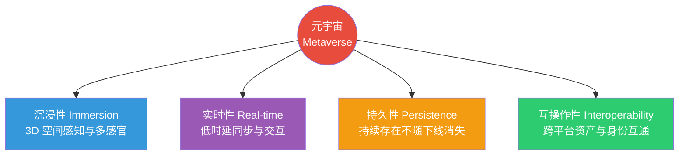
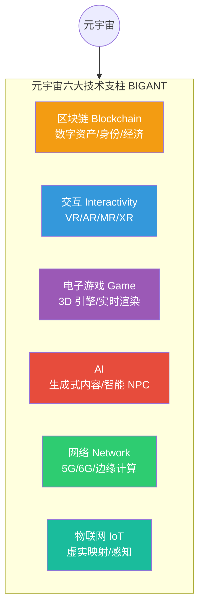
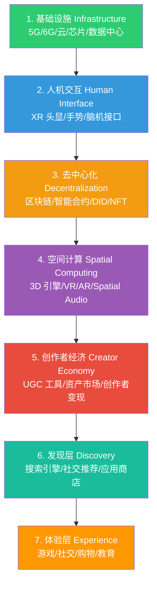

# 8.2 元宇宙技术架构

> [!abstract] 本节导读
> 本节解决"元宇宙如何用一组技术栈构建持久化、实时、沉浸、互操作的虚实融合数字空间"的问题。从元宇宙的定义与四大核心特征入手，阐述 VR/AR/MR、区块链、AI、云计算、5G、物联网六大技术支柱；进而展开 Matthew Ball 提出的元宇宙七层架构（基础设施、人机交互、去中心化、空间计算、创作者经济、发现、体验），揭示各层职责与技术映射。本节承接 [[8.1 数字孪生技术体系]] 的虚实映射基础，与 [[第6章 区块链与可信计算技术/MOC - 第6章]] 的数字资产体系和 [[第4章 人工智能智能赋能技术/4.2 大模型与生成式AI技术]] 的内容生成能力深度融合。

## 一、元宇宙的定义与特征

元宇宙（Metaverse）一词源自 Neal Stephenson 1992 年的科幻小说《Snow Crash》（雪崩），指一个持久化、实时、沉浸、互操作的虚实融合数字空间，用户以化身在其中社交、创作、交易与协作。当下语境中的元宇宙是互联网的下一代形态——从"二维信息网络"升级为"三维沉浸式体验网络"。

### 1.1 四大核心特征



| 特征 | 含义 | 技术支撑 |
|-----|------|---------|
| **沉浸性** | 用户以第一人称在三维空间中获得多感官沉浸 | VR/AR/MR、空间音频、触觉反馈 |
| **实时性** | 海量用户与对象的同步时延需低于人感知阈值 | 5G/6G、边缘计算、实时渲染 |
| **持久性** | 世界状态持续演进，不因用户下线而停止或重置 | 云端持久存储、分布式架构 |
| **互操作性** | 身份、资产、内容可跨平台流转，不被单一厂商封闭 | 区块链、开放标准、Web3 |

> [!important] 互操作性是元宇宙区别于"3D 游戏"的关键
> 传统大型 3D 游戏（如《魔兽世界》）也具备沉浸、实时、持久三大特征，但其资产、身份、世界完全被单一厂商封闭。元宇宙的"互操作性"要求用户的化身、数字资产、社交关系可跨平台携带，打破厂商围墙花园，这必须依赖区块链、开放标准与去中心化身份（DID）。缺乏互操作性的"元宇宙"实质上只是一个大型 3D 应用。

### 1.2 元宇宙 vs 互联网

| 维度 | 当前互联网 | 元宇宙 |
|-----|-----------|--------|
| **形态** | 二维网页/应用 | 三维沉浸式空间 |
| **交互** | 键鼠/触摸 | 多模态自然交互 |
| **内容** | 文本/图像/视频为主 | 实时 3D 与沉浸体验 |
| **经济** | 平台中介为主 | 原生数字资产与代币经济 |
| **身份** | 平台账号孤岛 | 去中心化身份 DID |
| **所有权** | 平台所有用户数据 | 用户拥有数据与资产 |

## 二、元宇宙技术栈

元宇宙不是单一技术，而是六大技术支柱的融合体，常被概括为"BIGANT"（Blockchain、Interactivity、Game、AI、Network、IoT）。



| 技术支柱 | 核心能力 | 在元宇宙中的职责 |
|---------|---------|----------------|
| **区块链** | 去中心化账本与智能合约 | 数字资产确权（NFT）、去中心化身份（DID）、经济系统 |
| **交互（XR）** | 沉浸式人机交互 | 沉浸感知、空间操作、化身表达 |
| **游戏引擎** | 3D 实时渲染与物理 | 世界构建、实时渲染、物理仿真 |
| **AI** | 生成与智能 | AIGC 内容生成、智能 NPC、自动建模 |
| **网络（5G/6G）** | 高带宽低时延通信 | 实时同步、边缘渲染、海量并发 |
| **物联网** | 物理世界感知与控制 | 虚实映射、数字孪生数据源 |

> [!note] 六大支柱并非等权
> 六大技术对元宇宙的贡献并非均等：交互（XR）解决"如何进入"，区块链解决"如何拥有"，AI 解决"如何创造"，游戏引擎解决"如何呈现"，网络解决"如何实时"，物联网解决"如何与现实对应"。任何一块短板都会让元宇宙体验崩塌——例如网络时延过高会让 VR 用户眩晕，缺乏区块链会让资产被厂商封闭。

## 三、元宇宙七层架构

Matthew Ball 提出的元宇宙七层架构是业界广泛引用的分层模型，自底向上描述元宇宙的完整价值链。



| 层级 | 名称 | 职责 | 代表技术/产品 |
|-----|------|------|-------------|
| **L1** | 基础设施 | 提供算力、网络与硬件底座 | 5G/6G、GPU/ASIC、云数据中心、边缘节点 |
| **L2** | 人机交互 | 沉浸式输入输出设备 | VR/AR 头显、手势识别、脑机接口、触觉手套 |
| **L3** | 去中心化 | 身份、资产与经济的去中心化 | 区块链、智能合约、DID、NFT、钱包 |
| **L4** | 空间计算 | 三维世界的计算与渲染 | Unity/Unreal 引擎、WebGL/WebGPU、空间音频 |
| **L5** | 创作者经济 | UGC 内容创作、分发与变现 | 创作工具、资产市场、创作者激励 |
| **L6** | 发现 | 内容与体验的分发发现 | 应用商店、社交推荐、搜索引擎 |
| **L7** | 体验 | 面向用户的具体应用 | 沉浸游戏、虚拟社交、虚拟会议、虚拟购物 |

> [!important] 七层的演进逻辑
> 七层并非简单堆叠，而是存在明确的因果链：基础设施（L1）的算力与带宽突破，催生了人机交互（L2）的沉浸设备；交互方式成熟后，去中心化（L3）解决了资产归属；空间计算（L4）让世界可被实时渲染；创作者经济（L5）让 UGC 大规模涌现；发现层（L6）让内容触达用户；最终汇聚为体验层（L7）的应用。任何一层断裂都会让上层失去支撑。

### 3.1 关键层展开

**L4 空间计算**是元宇宙区别于传统互联网的"承上启下"层，详见 [[8.3 虚拟现实与空间计算]]。其核心是把二维计算升级为三维空间计算：世界以 3D 形式存在并实时渲染，对象具备物理属性，用户可在空间中自由移动与操作。

**L3 去中心化**层支撑元宇宙的互操作性与经济体系：

| 机制 | 作用 |
|-----|------|
| **DID 去中心化身份** | 用户拥有跨平台统一的身份，不被厂商锁定 |
| **NFT 非同质化代币** | 数字资产（虚拟土地、道具、艺术品）确权与流转 |
| **智能合约** | 自动执行交易与规则，无需中心化中介 |
| **代币经济** | 原生经济激励，支撑创作者与用户间的价值流转 |

## 四、示例：元宇宙虚拟资产与身份

```python
# 简化演示元宇宙中去中心化身份与 NFT 资产的逻辑结构
# 运行环境：Python 3.10，仅标准库
# 工作目录：任意
import hashlib, json, time

class DID:
    """去中心化身份：基于公钥哈希生成，跨平台统一"""

    def __init__(self, public_key: str):
        self.id = "did:meta:" + hashlib.sha256(public_key.encode()).hexdigest()[:16]
        self.credentials = []

    def add_credential(self, issuer: str, claim: str):
        self.credentials.append({"issuer": issuer, "claim": claim,
                                 "time": time.time()})

class NFT:
    """非同质化代币：唯一标识元宇宙中的数字资产"""

    def __init__(self, token_id: int, metadata: dict, creator: str):
        self.token_id = token_id
        self.metadata = metadata
        self.creator = creator
        self.owner = creator

    def transfer(self, new_owner: str):
        print(f"NFT#{self.token_id} 从 {self.owner} 转移给 {new_owner}")
        self.owner = new_owner

class VirtualLand:
    """虚拟土地：元宇宙中的稀缺数字资产"""

    def __init__(self, x: int, y: int):
        self.coord = (x, y)
        self.nft = NFT(token_id=hash((x, y)) % 100000,
                       metadata={"type": "land", "coord": [x, y]},
                       creator="system")

# 用户创建去中心化身份
alice = DID("alice_public_key_xxx")
bob = DID("bob_public_key_yyy")
print(f"Alice DID: {alice.id}")
print(f"Bob   DID: {bob.id}")

# 系统铸造一块虚拟土地 NFT，初始归属 Alice
land = VirtualLand(x=10, y=20)
land.nft.transfer(new_owner=bob.id)
print(f"土地 {land.nft.metadata} 当前归属: {land.nft.owner}")

# 关键结论：DID 让身份跨平台，NFT 让资产可流转，
# 二者结合支撑了元宇宙"互操作性"与"创作者经济"两大特征。
```

```bash
# 使用 Hardhat 在本地以太坊测试网部署一个简单 NFT 合约（伪流程）
# 工作环境：Node.js 18、Hardhat
# 工作目录：metaverse-contracts
npx hardhat init                       # 初始化 Hardhat 项目
npx hardhat node                       # 启动本地测试链
# 编写 ERC-721 合约并部署，铸造成元宇宙虚拟资产
npx hardhat run scripts/deploy.js --network localhost
```

> [!warning] 元宇宙成熟度
> 当前元宇宙仍处于早期阶段：沉浸设备笨重且昂贵、互操作标准未统一、UGC 质量参差、监管与伦理框架缺位。业界对"元宇宙是下一代互联网"还是"过度炒作"存在分歧。本节描述的是目标架构，实际落地需结合 Gartner 技术成熟度曲线理性研判，引用时需标注核实时间。

> [!summary] 本节要点回顾
> 1. **定义**：元宇宙是持久、实时、沉浸、互操作的虚实融合数字空间，下一代互联网形态
> 2. **四大特征**：沉浸、实时、持久、互操作，互操作性是区别于 3D 游戏的关键
> 3. **六大技术栈 BIGANT**：区块链、交互、游戏、AI、网络、物联网，任一缺失都会崩塌
> 4. **七层架构**：基础设施 → 人机交互 → 去中心化 → 空间计算 → 创作者经济 → 发现 → 体验
> 5. **去中心化**：DID 统一身份、NFT 确权资产、智能合约自动执行，支撑互操作与经济
> 6. **空间计算**：三维实时渲染与物理，承上启下连接交互与体验
> 7. **现状**：早期阶段，标准未统一，需结合技术成熟度理性研判

## 关联知识点

| 关联知识点 | 关系 |
|-----------|------|
| [[8.1 数字孪生技术体系]] | 数字孪生是元宇宙中"现实世界映射"的核心技术 |
| [[8.3 虚拟现实与空间计算]] | 七层架构中 L2 人机交互与 L4 空间计算的展开 |
| [[第6章 区块链与可信计算技术/6.2 智能合约与去中心化应用]] | 区块链与智能合约支撑元宇宙 L3 去中心化层 |
| [[第4章 人工智能智能赋能技术/4.2 大模型与生成式AI技术]] | AIGC 是 L5 创作者经济的核心引擎 |
| [[第7章 新一代移动通信技术（5G6G）/7.1 5G网络架构与关键技术]] | 5G/6G 是 L1 基础设施层的关键 |
| [[MOC - 第8章]] | 返回本章导航 |
