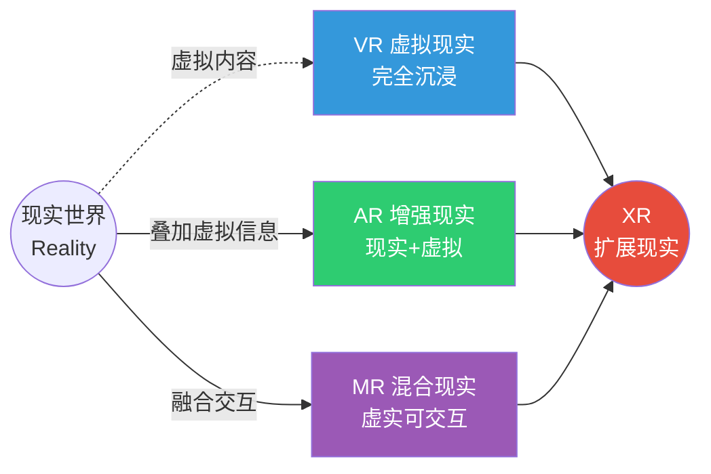
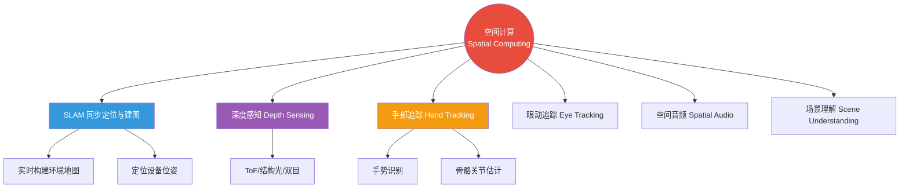
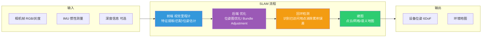
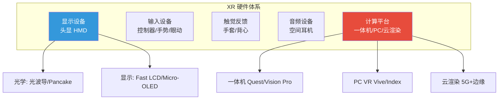

# 8.3 虚拟现实与空间计算

> [!abstract] 本节导读
> 本节解决"如何让用户以沉浸式方式进入并与三维数字世界交互"的问题。从 VR/AR/MR/XR 四种现实的概念辨析入手，阐述空间计算的核心能力（SLAM、深度感知、手部追踪）；进而展开 XR 硬件形态与内容创作范式，覆盖 3D 建模、摄影测量与神经辐射场（NeRF）；最后给出 Three.js/WebXR 的开发示例。本节是 [[8.2 元宇宙技术架构]] 中 L2 人机交互层与 L4 空间计算层的展开，与 [[第4章 人工智能智能赋能技术/4.2 大模型与生成式AI技术]] 的生成式 3D 内容能力协同。

## 一、VR/AR/MR/XR 的辨析

扩展现实（XR, Extended Reality）是 VR、AR、MR 等沉浸式技术的统称，其本质差异在于"虚拟与现实"的混合比例与融合方式。



| 类型 | 全称 | 定义 | 现实可见性 | 典型设备 |
|-----|------|------|-----------|---------|
| **VR** | Virtual Reality | 完全沉浸于虚拟世界，屏蔽现实 | 不可见 | Meta Quest、HTC Vive、PlayStation VR |
| **AR** | Augmented Reality | 在现实视图上叠加虚拟信息 | 可见 | Google Glass、Microsoft HoloLens、手机 AR |
| **MR** | Mixed Reality | 虚拟对象与现实环境可实时交互 | 可见且可交互 | Microsoft HoloLens、Magic Leap |
| **XR** | Extended Reality | VR/AR/MR 的统称 | — | 上述全部 |

> [!important] MR 与 AR 的关键区别
> AR 仅在现实视图上"叠加"虚拟信息，虚拟对象不理解现实环境；MR 让虚拟对象与现实环境发生交互——例如虚拟球能从真实桌面上滚落，虚拟角色能避开真实障碍物。MR 的核心是"环境理解"，依赖 SLAM 与深度感知，技术上比 AR 更复杂。Microsoft HoloLens 因具备环境理解能力而被归为 MR。

## 二、空间计算

空间计算（Spatial Computing）是让数字内容理解物理空间、并在其中定位与交互的计算范式，是 XR 与元宇宙的"操作系统"层。其核心能力包括同步定位与建图、深度感知、手部追踪等。

### 2.1 空间计算核心能力



| 能力 | 作用 | 实现方式 |
|-----|------|---------|
| **SLAM** | 在未知环境中同时定位自身并构建环境地图 | 视觉 SLAM（ORB-SLAM、VINS）、LiDAR SLAM |
| **深度感知** | 获取环境的距离信息 | ToF（飞行时间）、结构光、双目立体视觉 |
| **手部追踪** | 识别手部姿态与手势用于交互 | 深度相机 + 卷积神经网络 |
| **眼动追踪** | 获取注视点用于渲染优化与交互 | 红外摄像头 + 瞳孔检测 |
| **场景理解** | 识别平面、物体、语义标签 | 深度学习语义分割 |
| **空间音频** | 声音随头部方位变化的方向感 | 头相关传递函数 HRTF |

### 2.2 SLAM 原理

SLAM（Simultaneous Localization and Mapping）是空间计算的基础，使设备在陌生环境中一边定位自身位姿一边构建环境地图。



> [!note] SLAM 的难点
> SLAM 的核心难点是"累积漂移"——位姿估计的微小误差会随时间累积导致地图错位。回环检测通过识别曾经访问过的地点建立约束，将累积误差全局优化消除。视觉 SLAM（如 ORB-SLAM3）轻量但易受光照与纹理影响；LiDAR SLAM 精度高但设备昂贵。XR 设备多采用 VIO（视觉惯性里程计）融合相机与 IMU 提升鲁棒性。

## 三、XR 硬件体系



| 硬件类别 | 代表产品 | 关键指标 |
|---------|---------|---------|
| **VR 一体机** | Meta Quest 3、Apple Vision Pro | 分辨率、视场角 FOV、刷新率 |
| **AR 眼镜** | Microsoft HoloLens 2、Xreal Air | 透光率、视场角、重量 |
| **MR 头显** | Apple Vision Pro | EyeSight、手势交互、空间视频 |
| **触觉反馈** | bHaptics 触觉背心、SenseGlove 力反馈手套 | 自由度、力反馈强度 |
| **空间音频** | AirPods Pro 空间音频 | HRTF、头部追踪 |

> [!tip] XR 硬件的关键瓶颈
> XR 设备普及的主要瓶颈是"光学与算力的平衡"：①**视场角（FOV）与分辨率**——人眼理想 FOV 约 200°，主流 VR 仅 90~110°；②**重量与续航**——电池与光学模组让设备笨重，难以长时间佩戴；③**算力与渲染**——高分辨率双目渲染需高端 GPU，催生了云渲染与注视点渲染（foveated rendering）技术。

## 四、内容创作范式

XR 内容创作主要有三条技术路径：手工 3D 建模、摄影测量与神经辐射场（NeRF）。

| 方法 | 原理 | 优势 | 限制 |
|-----|------|------|------|
| **3D 建模** | 艺术家手工构建网格与材质 | 精确可控、风格化 | 周期长、成本高、依赖技能 |
| **摄影测量** | 多视角图像重建几何点云 | 真实场景还原 | 反光/透明物体失败、需大量照片 |
| **NeRF** | 神经网络学习场景辐射场 | 高质量新视角合成、可渲染反光 | 训练慢、难以编辑 |

### 4.1 NeRF 原理

神经辐射场（Neural Radiance Field, NeRF）用多层感知机（MLP）拟合一个连续函数 $(x, y, z, \theta, \phi) \to (c, \sigma)$，输入三维位置 $(x,y,z)$ 与观察方向 $(\theta, \phi)$，输出颜色 $c$ 与体密度 $\sigma$，通过体渲染方程合成任意视角图像。

$$
C(\mathbf{r}) = \int_{t_n}^{t_f} T(t) \sigma(\mathbf{r}(t)) \mathbf{c}(\mathbf{r}(t), \mathbf{d}) dt
$$

其中 $T(t) = \exp\left(-\int_{t_n}^{t} \sigma(\mathbf{r}(s)) ds\right)$ 是累积透射率，$\mathbf{r}(t)$ 是光线参数化方程。

> [!important] NeRF 的革命性
> 传统摄影测量重建的是稀疏点云或网格，难以处理反光、透明、半透明物体；NeRF 用神经网络隐式表示整个场景的辐射场，可合成任意视角的高保真图像，特别擅长镜面反射与半透明效果。后续工作（Instant-NGP、3D Gaussian Splatting）大幅提升了训练与渲染速度，使其逐步走向实时应用。

## 五、示例：Three.js 与 WebXR

```javascript
// 使用 Three.js 渲染一个可交互的 3D 场景，并接入 WebXR 沉浸模式
// 运行环境：现代浏览器（Chrome/Edge）、需 HTTPS 或 localhost
// 依赖：three.js（importmap 方式引入）
// 工作目录：任意静态资源目录

import * as THREE from 'three';
import { VRButton } from 'three/addons/webxr/VRButton.js';

// 1. 初始化场景、相机、渲染器
const scene = new THREE.Scene();
scene.background = new THREE.Color(0x1a1a2e);

const camera = new THREE.PerspectiveCamera(
  70, window.innerWidth / window.innerHeight, 0.1, 100
);
camera.position.set(0, 1.6, 3);

const renderer = new THREE.WebGLRenderer({ antialias: true });
renderer.setSize(window.innerWidth, window.innerHeight);
renderer.xr.enabled = true;                       // 启用 WebXR
document.body.appendChild(renderer.domElement);
document.body.appendChild(VRButton.createButton(renderer));  // VR 入口按钮

// 2. 添加环境光与方向光
scene.add(new THREE.AmbientLight(0xffffff, 0.4));
const dir = new THREE.DirectionalLight(0xffffff, 0.8);
dir.position.set(1, 2, 1);
scene.add(dir);

// 3. 构建一个可交互的立方体（数字孪生体的简化示例）
const cube = new THREE.Mesh(
  new THREE.BoxGeometry(0.5, 0.5, 0.5),
  new THREE.MeshStandardMaterial({ color: 0x4CAF50 })
);
cube.position.set(0, 1.2, -1);
scene.add(cube);

// 4. 添加地面网格辅助理解空间
const grid = new THREE.GridHelper(10, 20, 0x444466, 0x222244);
scene.add(grid);

// 5. 渲染循环（使用 setAnimationLoop 以兼容 WebXR）
renderer.setAnimationLoop(() => {
  cube.rotation.y += 0.01;                          // 持续旋转
  renderer.render(scene, camera);
});

// 关键结论：WebXR 让浏览器原生支持 VR/AR，
// 配合 Three.js 的高级 3D API 可快速构建跨设备沉浸式内容，
// 是元宇宙"空间计算"层低成本开发范式的代表。
```

```html
<!-- index.html：通过 importmap 加载 Three.js 模块 -->
<!DOCTYPE html>
<html lang="zh">
<head>
  <meta charset="UTF-8">
  <title>WebXR 数字孪生示例</title>
  <style>body { margin: 0; overflow: hidden; }</style>
  <script type="importmap">
  {
    "imports": {
      "three": "https://unpkg.com/three@0.160.0/build/three.module.js",
      "three/addons/": "https://unpkg.com/three@0.160.0/examples/jsm/"
    }
  }
  </script>
</head>
<body>
  <script type="module" src="./main.js"></script>
</body>
</html>
```

```bash
# 本地启动一个 HTTPS 静态服务器以支持 WebXR（伪流程）
# 工作环境：Node.js 18
# 工作目录：含 index.html 与 main.js 的目录
npx http-server -S -C cert.pem -K key.pem -p 8443
# 用 Chrome 访问 https://localhost:8443 并允许 VR/AR 权限
```

> [!warning] WebXR 兼容性
> WebXR 在不同浏览器与设备上的支持差异较大：Chrome/Edge 支持较好，Safari 部分支持，Firefox 有限。AR 模式需移动端 ARCore/ARKit 支持。开发时需做能力检测（`navigator.xr.isSessionSupported`）并优雅降级。

> [!summary] 本节要点回顾
> 1. **XR 辨析**：VR 完全沉浸、AR 现实叠加、MR 虚实交互、XR 统称；MR 的关键是环境理解
> 2. **空间计算**：让数字内容理解物理空间并交互，是元宇宙的"操作系统"层
> 3. **核心能力**：SLAM（定位建图）、深度感知、手部追踪、眼动追踪、场景理解、空间音频
> 4. **SLAM 难点**：累积漂移靠回环检测消除，VIO 融合提升鲁棒性
> 5. **硬件体系**：头显（VR/AR/MR）、控制器、触觉、空间音频、计算平台（一体机/PC/云渲染）
> 6. **瓶颈**：视场角、分辨率、重量续航、渲染算力的平衡
> 7. **内容创作**：3D 建模（精确）、摄影测量（真实）、NeRF（高质量新视角合成）
> 8. **NeRF**：神经网络隐式表示辐射场，擅长反光透明，后续 Instant-NGP/3DGS 走向实时
> 9. **WebXR**：浏览器原生 XR API，配合 Three.js 实现低成本跨设备沉浸式开发

## 关联知识点

| 关联知识点 | 关系 |
|-----------|------|
| [[8.1 数字孪生技术体系]] | XR 是孪生可视化交互层的呈现方式 |
| [[8.2 元宇宙技术架构]] | 本节对应七层架构的 L2 人机交互与 L4 空间计算 |
| [[第4章 人工智能智能赋能技术/4.2 大模型与生成式AI技术]] | AIGC 与 NeRF 是 3D 内容生成的基础 |
| [[第7章 新一代移动通信技术（5G6G）/7.2 网络切片与边缘计算MEC]] | 5G+MEC 支撑云渲染降低 XR 终端负载 |
| [[第5章 物联网与边缘智能技术/5.1 物联网体系架构与通信协议]] | 物联网感知是空间计算场景理解的输入源 |
| [[MOC - 第8章]] | 返回本章导航 |
