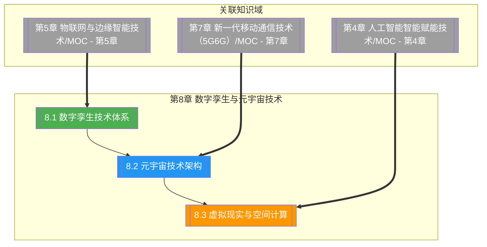

# 第8章 数字孪生与元宇宙技术

> [!abstract] 章节概述
> 本章在 [[1.1 前沿技术定义、特征与技术体系]] 的 ABCD5G 体系框架下，深入展开"数字孪生 + 元宇宙"这一虚实融合主线。从数字孪生的定义、四层架构与成熟度等级入手，阐述物理实体、虚拟模型与双向连接如何构成"虚实映射—实时仿真—智能决策"闭环；进而展开元宇宙的技术架构与沉浸式交互技术栈，覆盖 VR/AR/MR/XR、空间计算、SLAM、神经辐射场（NeRF）等关键技术；最后以虚拟现实与空间计算收束，揭示 XR 硬件、内容创作与 Three.js/WebXR 开发范式。本章承接 [[第5章 物联网与边缘智能技术/MOC - 第5章]] 的物联感知基础与 [[第7章 新一代移动通信技术（5G6G）/MOC - 第7章]] 的高带宽低时延通信，与 [[第4章 人工智能智能赋能技术/MOC - 第4章]] 的生成式 AI 深度融合。

## 学习路线图

## 知识点导航

| 编号 | 知识点 | 核心内容 | 重要程度 |
|-----|--------|---------|---------|
| 8.1 | [[8.1 数字孪生技术体系]] | 数字孪生定义、四层架构、成熟度等级、行业应用 | ⭐⭐⭐⭐⭐ |
| 8.2 | [[8.2 元宇宙技术架构]] | 元宇宙特征、技术栈、七层架构、虚实交互 | ⭐⭐⭐⭐⭐ |
| 8.3 | [[8.3 虚拟现实与空间计算]] | VR/AR/MR/XR、SLAM、NeRF、XR 硬件、WebXR | ⭐⭐⭐⭐ |

## 核心概念速览

> [!tip] 本章必须掌握的核心概念
> - **数字孪生**：物理实体、虚拟模型与双向连接构成的虚实映射与实时仿真系统
> - **数字孪生三要素**：物理实体（Physical Entity）、虚拟模型（Virtual Model）、连接（Connection）
> - **数字孪生四层架构**：数据采集层、模型构建层、仿真分析层、可视化交互层
> - **数字孪生成熟度**：3D 模型 → 数据驱动 → 仿真预测 → 智能孪生四级演进
> - **元宇宙**：持久化、实时、沉浸、互操作的虚实融合数字空间
> - **元宇宙七层架构**：基础设施、人机交互、去中心化、空间计算、创作者经济、发现、体验
> - **元宇宙技术栈**：XR、区块链、AI、云计算、5G/6G、物联网六大支柱
> - **VR/AR/MR/XR**：虚拟现实、增强现实、混合现实、扩展现实的统称
> - **空间计算**：让数字内容理解并与物理空间交互，核心是 SLAM 与深度感知
> - **SLAM**：同步定位与建图，设备在未知环境中同时定位自身并构建环境地图
> - **NeRF**：神经辐射场，用神经网络从多视角图像重建三维场景
> - **WebXR**：浏览器中的 XR 标准 API，支持跨设备沉浸式内容访问

## 核心考点

> [!important] 期末高频考点

| 考点 | 所属知识点 | 考查形式 | 难度 |
|-----|-----------|---------|------|
| 数字孪生定义与三要素 | 8.1 | 简答题/填空题 | ★★ |
| 数字孪生四层架构 | 8.1 | 简答题/论述题 | ★★★ |
| 数字孪生成熟度等级 | 8.1 | 简答题/对比题 | ★★★ |
| 数字孪生与仿真/CAD 的区别 | 8.1 | 论述题 | ★★★★ |
| 数字孪生典型行业应用 | 8.1 | 案例分析 | ★★★ |
| 元宇宙定义与核心特征 | 8.2 | 简答题/论述题 | ★★★ |
| 元宇宙七层架构 | 8.2 | 简答题/论述题 | ★★★★ |
| 元宇宙六大技术栈 | 8.2 | 简答题/填空题 | ★★★ |
| VR/AR/MR/XR 的区别 | 8.3 | 对比题/简答题 | ★★★ |
| SLAM 原理与作用 | 8.3 | 简答题/论述题 | ★★★★ |
| NeRF 与传统三维建模对比 | 8.3 | 论述题 | ★★★★ |
| WebXR 与空间计算 | 8.3 | 简答题 | ★★★ |

## 自测题

> [!question] 章节自测
> 1. 阐述数字孪生的定义与三要素（物理实体、虚拟模型、连接），说明数字孪生四层架构（数据采集、模型构建、仿真分析、可视化）的职责与数据流向，并解释数字孪生与传统 CAD 建模、离线仿真的本质区别。
> 2. 论述元宇宙的四大核心特征（沉浸、实时、持久、互操作），绘制元宇宙七层架构（基础设施、人机交互、去中心化、空间计算、创作者经济、发现、体验）并说明 VR/AR、区块链、AI、云计算、5G、物联网等技术如何分别支撑各层。
> 3. 对比 VR、AR、MR、XR 的定义、技术原理与典型设备，阐述空间计算的核心能力（SLAM、深度感知、手部追踪），并说明 NeRF 相较传统摄影测量与三维建模的优势与适用边界。
> 4. 以"数字孪生工厂"或"数字孪生城市"为例，设计一个端到端的数字孪生系统方案，说明数据采集、模型构建、仿真分析与可视化交互如何闭环，并指出该方案与元宇宙技术栈（XR 沉浸、AI 渲染、5G 回传）的协同点。

## 章节导航

| 方向 | 链接 |
|-----|------|
| ⬆ 返回课程总览 | [[MOC - 专业前沿技术]] |
| ⬅ 上一章 | [[第7章 新一代移动通信技术（5G6G）/MOC - 第7章]] |
| ➡ 下一章 | [[第9章 前沿网络与数据安全/MOC - 第9章]] |

## 关联知识

- [[第5章 物联网与边缘智能技术/MOC - 第5章]] - 物联网感知是数字孪生数据采集的来源
- [[第7章 新一代移动通信技术（5G6G）/MOC - 第7章]] - 5G/6G 提供元宇宙实时沉浸所需的带宽与时延
- [[第4章 人工智能智能赋能技术/MOC - 第4章]] - 生成式 AI 是元宇宙内容创作与智能孪生的核心引擎
- [[第6章 区块链与可信计算技术/MOC - 第6章]] - 区块链支撑元宇宙数字资产与经济体系
- [[1.1 前沿技术定义、特征与技术体系]] - ABCD5G 体系中数字孪生与元宇宙的定位
