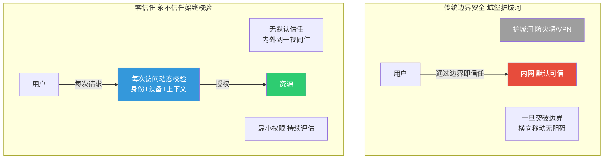
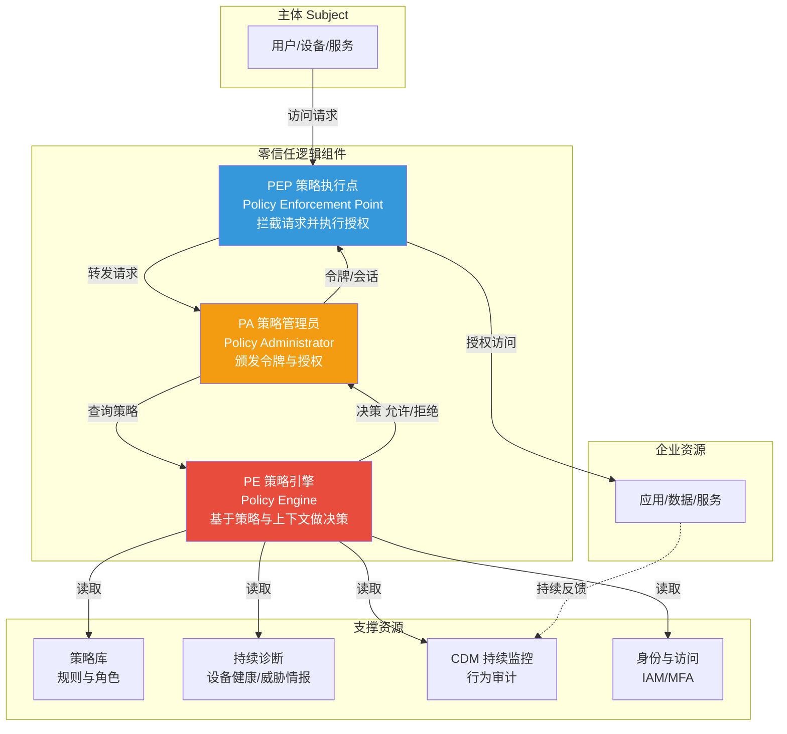
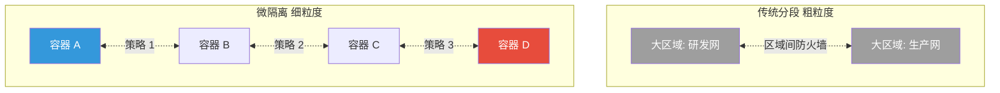
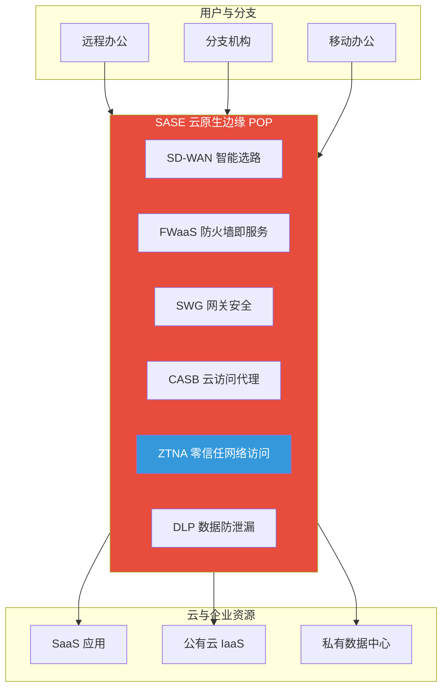

# 9.1 零信任架构与安全模型

> [!abstract] 本节导读
> 本节解决"在云原生与远程办公环境下，传统网络边界如何被瓦解并重建为以身份为中心的安全模型"的问题。从零信任"永不信任、始终校验"的核心原则入手，对比传统边界安全模型的失效原因；阐述 NIST SP 800-207 标准定义的三大逻辑组件（PE、PA、PEP）与零信任成熟度模型；进而展开身份中心安全、微隔离技术与 SASE 云原生安全接入架构。本节为 [[9.2 数据安全治理与隐私保护]] 与 [[9.3 AI安全与深度伪造防护]] 提供网络接入与访问控制底座，与 [[第2章 云计算技术体系/MOC - 第2章]] 的云原生架构协同。

## 一、零信任的核心原则

零信任（Zero Trust）由 Forrester Research 的 John Kindervag 于 2010 年提出，其核心思想是"永不信任、始终校验"（Never Trust, Always Verify）——默认网络内外任何主体都不可信，每次访问请求都必须经过身份、设备、上下文等多维动态校验后才授权。

### 1.1 与传统边界安全的对比

传统边界安全采用"城堡与护城河"（Castle and Moat）模型，信任内网、防御外网。该模型在云迁移、远程办公、移动办公、SaaS 服务普及后严重失效。



| 维度 | 传统边界安全 | 零信任架构 |
|-----|-------------|-----------|
| **信任假设** | 内网可信、外网不可信 | 任何位置都不可信 |
| **边界** | 网络边界（IP/子网） | 身份与资源 |
| **校验时机** | 一次登录进入内网 | 每次访问请求 |
| **校验维度** | 凭证（账号密码） | 身份 + 设备 + 上下文 + 行为 |
| **授权粒度** | 网络层粗粒度 | 应用/数据层细粒度 |
| **横向移动** | 突破边界后畅通 | 微隔离阻断 |
| **失效场景** | VPN 凭证泄露、内网失陷 | 单点失陷影响受限 |

> [!important] 边界模型为何失效
> 云迁移让数据与算力移出企业内网边界；远程办公让用户从任意位置接入；SaaS 服务让流量绕过企业网关。传统"信任内网"的假设被彻底瓦解——一旦攻击者通过钓鱼或 VPN 凭证泄露进入内网，即可横向移动窃取任意资源（如 SolarWinds 供应链攻击、Colonial Pipeline 勒索事件）。零信任正是对此的范式级回应。

### 1.2 零信任三大基本原则

| 原则 | 含义 |
|-----|------|
| **显式校验** | 每次访问都基于身份、设备健康、位置、行为等多维信号动态校验 |
| **最小权限** | 仅授予完成任务所需的最小权限，按需即时授予与回收 |
| **假定失陷** | 默认攻击者已在网络内部，设计上限制爆炸半径与横向移动 |

## 二、NIST SP 800-207 零信任架构

NIST SP 800-207 是零信任架构的权威标准，定义了逻辑组件、部署模式与成熟度等级。

### 2.1 三大逻辑组件



| 组件 | 全称 | 职责 |
|-----|------|------|
| **PE** | Policy Engine 策略引擎 | 综合策略库、设备健康、威胁情报、用户行为做出授权决策 |
| **PA** | Policy Administrator 策略管理员 | 根据 PE 决策颁发令牌、建立会话与回收授权 |
| **PEP** | Policy Enforcement Point 策略执行点 | 拦截主体与资源之间的请求，执行允许/拒绝 |

> [!note] 三组件的部署形态
> PE/PA/PEP 是逻辑组件，部署形态多样：①**设备代理**——PEP 部署在终端；②**网关**——PEP 部署在资源前作反向代理；③**微隔离**——PEP 部署在每个工作负载；④**资源门户**——统一门户做访问聚合。企业可按场景组合多种形态。

### 2.2 零信任成熟度

| 等级 | 名称 | 特征 |
|-----|------|------|
| **传统** | Traditional | 边界防御、静态信任 |
| **初始** | Initial | 部分身份集成、手动策略 |
| **进阶** | Advanced | 动态策略、设备健康联动 |
| **最优** | Optimal | 全自动化、AI 驱动持续评估 |

## 三、身份中心安全与微隔离

### 3.1 身份中心安全

零信任把"身份"作为新的控制平面，取代网络边界成为访问决策核心。身份中心安全涵盖：

| 能力 | 说明 |
|-----|------|
| **统一身份 IAM** | 集中管理用户、设备、服务的身份生命周期 |
| **多因素认证 MFA** | 结合密码、令牌、生物特征，提升凭证强度 |
| **单点登录 SSO** | 一次认证访问多应用，降低凭证疲劳 |
| **持续认证** | 会话期内反复评估风险，而非一次性信任 |
| **基于角色的访问 RBAC/ABAC** | 按角色或属性动态授予最小权限 |

### 3.2 微隔离

微隔离（Micro-segmentation）将网络细分为最小粒度的安全区域，每个工作负载（容器、虚拟机、进程）都有独立策略，限制横向移动。



> [!important] 微隔离是限制爆炸半径的关键
> 传统网络分段以子网/VLAN 为单位，一旦某容器失陷，同段资源几乎全部暴露。微隔离把策略下沉到每个工作负载，即使单个容器被攻破，攻击者也只能触达显式允许的少数资源，"爆炸半径"被压缩到最小。这是零信任"假定失陷"原则的核心落地手段。

## 四、SASE 安全访问服务边缘

SASE（Secure Access Service Edge）由 Gartner 于 2019 年提出，将广域网与网络安全融合为云原生服务，是零信任在云时代的典型交付形态。



| 组件 | 全称 | 职责 |
|-----|------|------|
| **SD-WAN** | Software-Defined WAN | 智能选路与流量调度 |
| **FWaaS** | Firewall as a Service | 云原生防火墙 |
| **SWG** | Secure Web Gateway | Web 流量过滤与恶意防护 |
| **CASB** | Cloud Access Security Broker | SaaS 访问控制与数据保护 |
| **ZTNA** | Zero Trust Network Access | 零信任应用访问 |
| **DLP** | Data Loss Prevention | 数据外发防泄漏 |

> [!tip] SASE 与 ZTNA 的关系
> ZTNA（零信任网络访问）是 SASE 的一个核心组件，专注于"以身份为中心的应用级访问"。SASE 是更完整的融合架构，把 ZTNA、SWG、CASB、FWaaS、SD-WAN 整合为单一云原生平台，让用户从任意位置、任意设备以一致的策略安全访问任意资源。可以理解为：ZTNA 是 SASE 中"接入控制"那一块。

## 五、示例：零信任访问决策

```python
# 简化演示零信任策略引擎基于多维信号做访问决策
# 运行环境：Python 3.10，仅标准库
# 工作目录：任意
from dataclasses import dataclass

@dataclass
class AccessRequest:
    user: str
    device_id: str
    resource: str
    ip: str
    mfa_passed: bool
    device_compliant: bool       # 设备健康（补丁/加密）
    risk_score: float            # 行为风险评分 0~1
    time_of_day: str             # 如 "02:00"

def zero_trust_decide(req: AccessRequest, policy: dict) -> tuple:
    """基于多维信号做决策，返回 (允许/拒绝/需MFA, 原因)"""
    # 1. 拒绝高风险用户
    if req.risk_score > policy["risk_threshold"]:
        return ("deny", "行为风险过高")
    # 2. 拒绝非合规设备
    if not req.device_compliant:
        return ("deny", "设备不合规")
    # 3. 资源敏感则强制 MFA
    if req.resource in policy["high_value_resources"] and not req.mfa_passed:
        return ("need_mfa", "高价值资源需 MFA")
    # 4. 异常时段访问敏感资源需二次校验
    if req.time_of_day < "06:00" and req.resource in policy["high_value_resources"]:
        return ("need_mfa", "异常时段访问需二次校验")
    # 5. 最小权限：检查用户对该资源是否显式授权
    allowed = req.user in policy["resource_acl"].get(req.resource, set())
    return ("allow" if allowed else "deny",
            "最小权限校验" + ("通过" if allowed else "未授权"))

policy = {
    "risk_threshold": 0.7,
    "high_value_resources": {"财务数据库", "客户PII", "源码仓库"},
    "resource_acl": {
        "财务数据库": {"alice", "bob"},
        "客户PII": {"alice"},
        "源码仓库": {"charlie"},
    },
}

# 测试四类典型场景
cases = [
    AccessRequest("alice", "dev1", "财务数据库", "10.0.0.1",
                  True, True, 0.2, "10:00"),
    AccessRequest("eve", "dev2", "客户PII", "203.0.113.5",
                  False, False, 0.8, "02:00"),
    AccessRequest("charlie", "dev3", "源码仓库", "10.0.0.2",
                  True, True, 0.1, "14:00"),
    AccessRequest("alice", "dev1", "源码仓库", "10.0.0.1",
                  True, True, 0.1, "14:00"),
]
for c in cases:
    decision, reason = zero_trust_decide(c, policy)
    print(f"{c.user} 访问 {c.resource}: {decision} ({reason})")

# 关键结论：零信任不是简单的"加 MFA"，而是基于身份、设备、上下文、行为
# 多维信号的动态决策，每次访问都重新评估，且默认最小权限。
```

```bash
# 使用开源 OpenZiti 部署零信任覆盖网络（伪流程）
# 工作环境：Docker、OpenZiti
# 工作目录：ziti 安装目录
docker run -d --name ziti-controller openziti/quickstart
# 在客户端与服务端注册身份，所有应用访问经 ZTNA 代理而非开放端口
ziti edge create identity device workload-frontend
```

> [!summary] 本节要点回顾
> 1. **零信任原则**：永不信任、始终校验，显式校验 + 最小权限 + 假定失险
> 2. **传统失效**：云迁移、远程办公、SaaS 让网络边界假设瓦解，横向移动畅通
> 3. **NIST SP 800-207**：PE 决策引擎 + PA 令牌颁发 + PEP 执行点三大逻辑组件
> 4. **身份中心**：IAM/MFA/SSO/持续认证/RBAC，身份取代网络边界作为控制平面
> 5. **微隔离**：策略下沉到每个工作负载，压缩爆炸半径，落地"假定失陷"
> 6. **SASE**：云原生融合 SD-WAN + ZTNA + SWG + CASB + FWaaS + DLP，单一平台交付
> 7. **ZTNA**：SASE 中的零信任接入组件，以身份为中心的应用级访问

## 关联知识点

| 关联知识点 | 关系 |
|-----------|------|
| [[9.2 数据安全治理与隐私保护]] | 数据分级与最小权限是零信任访问决策的输入 |
| [[9.3 AI安全与深度伪造防护]] | AI 服务的访问控制依赖零信任 |
| [[第2章 云计算技术体系/2.2 云原生技术栈与容器编排]] | 云原生是 SASE 与微隔离的部署底座 |
| [[第6章 区块链与可信计算技术/6.3 可信计算与隐私计算]] | 可信计算为零信任提供硬件信任根 |
| [[第7章 新一代移动通信技术（5G6G）/7.2 网络切片与边缘计算MEC]] | 5G 切片与 SASE 协同保障移动接入安全 |
| [[MOC - 第9章]] | 返回本章导航 |
