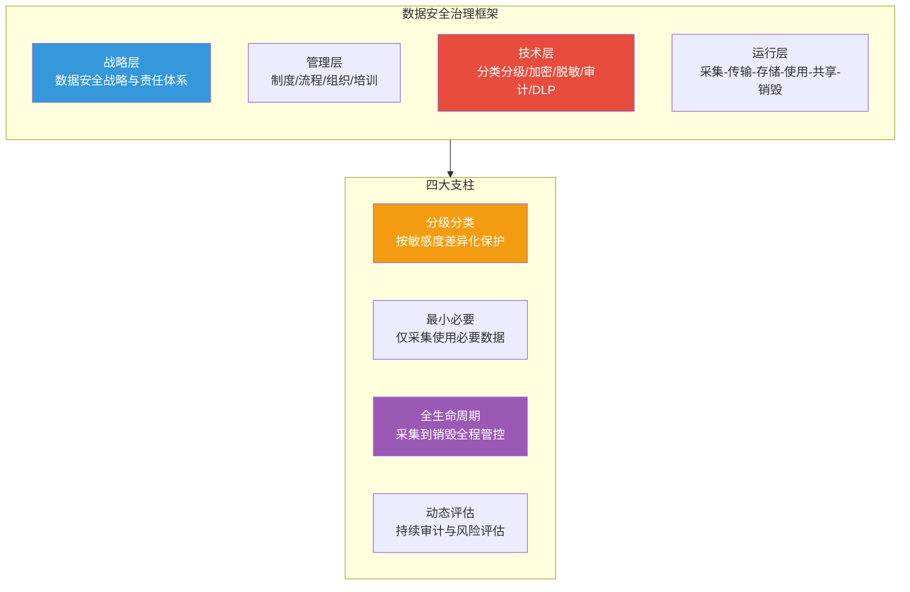
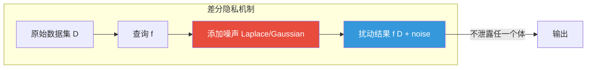
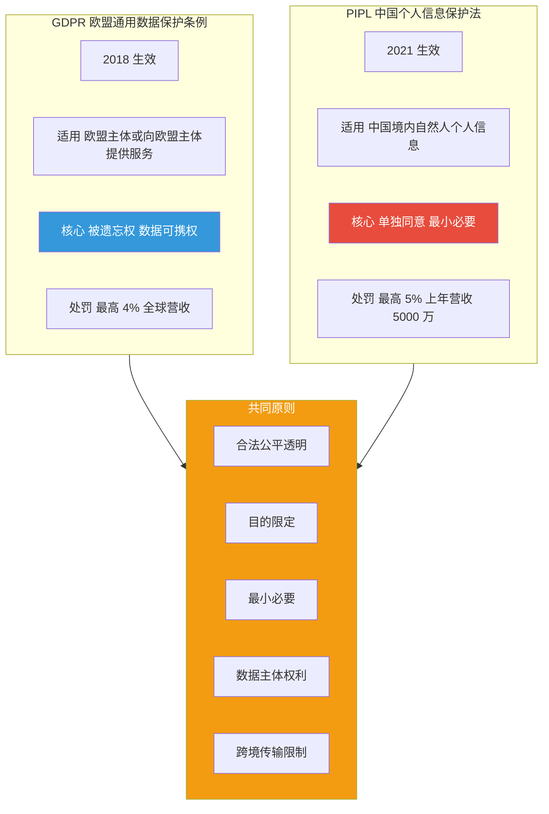

# 9.2 数据安全治理与隐私保护

> [!abstract] 本节导读
> 本节解决"在数据要素流通时代如何系统性地保护数据安全与个人隐私"的问题。从数据安全治理框架入手，阐述数据分级分类方法与数据全生命周期保护；进而展开差分隐私、k-匿名、l-多样性三大隐私保护技术的原理、强度与适用边界；最后对比 GDPR 与《个人信息保护法》（PIPL）的合规要求。本节承接 [[9.1 零信任架构与安全模型]] 的访问控制底座，与 [[第3章 大数据前沿技术/MOC - 第3章]] 的数据治理实践协同，为 [[第10章 前沿技术伦理与行业规范/MOC - 第10章]] 的法律法规落地提供技术基础。

## 一、数据安全治理框架

数据安全治理是从组织、制度、技术与流程四个维度对数据资产进行体系化保护的框架，其核心是"分级分类—最小必要—全生命周期—动态评估"。



### 1.1 数据分级分类

数据分级分类是治理的基础，按敏感度与重要性对数据差异化保护。

| 级别（参考 GB/T 38667） | 名称 | 示例 | 保护要求 |
|------------------------|------|------|---------|
| **L4** | 公开数据 | 官网公告、新闻 | 完整性保护 |
| **L3** | 内部数据 | 内部流程、组织架构 | 访问控制 |
| **L2** | 敏感数据 | 财务、经营数据 | 加密、审计 |
| **L1** | 核心数据/个人敏感信息 | 身份证、生物特征、健康档案 | 强加密、最小授权、脱敏 |

> [!important] 个人敏感信息需额外保护
> 个人信息中"敏感个人信息"（如生物识别、宗教信仰、医疗健康、金融账户、14 岁以下儿童信息）在《个人信息保护法》下需"单独同意"与更严格保护。技术层面通常采用字段级加密、不可逆脱敏与差分隐私相结合，避免"敏感信息 + 标识符"组合重识别。

### 1.2 数据全生命周期

| 阶段 | 安全措施 |
|-----|---------|
| **采集** | 知情同意、最小必要、来源登记 |
| **传输** | TLS 加密、链路可信 |
| **存储** | 静态加密、密钥管理、访问审计 |
| **使用** | 最小授权、脱敏、差分隐私 |
| **共享** | 数据使用协议、隐私计算、水印溯源 |
| **销毁** | 不可恢复销毁、销毁记录 |

## 二、隐私保护技术

### 2.1 k-匿名

k-匿名（k-anonymity）由 Latanya Sweeney 提出，通过对准标识符（Quasi-Identifier，如邮编、性别、生日）的泛化（Generalization）与隐匿（Suppression），使数据集中每条记录至少与 $k-1$ 条其他记录在准标识符上完全相同，从而无法将个体定位到少于 $k$ 人的组中。

| 准标识符 | 原始数据 | k=2 泛化后 |
|---------|---------|-----------|
| 邮编/性别/年龄 | 100080/男/28 | 1000*/男/2* |
| 邮编/性别/年龄 | 100082/男/29 | 1000*/男/2* |
| 邮编/性别/年龄 | 200120/女/45 | 2001*/女/4* |
| 邮编/性别/年龄 | 200125/女/46 | 2001*/女/4* |

> [!warning] k-匿名的弱点
> k-匿名只保证"不可区分"，不保证"敏感值不集中"。如果一个等价类中 9 成记录的敏感值相同（如某邮编+年龄段群体 90% 患某病），攻击者仍能高概率推断个体属性，这称为"同质性攻击"。此外"背景知识攻击"也难以防范。

### 2.2 l-多样性

l-多样性（l-diversity）在 k-匿名基础上，要求每个等价类中敏感值至少有 $l$ 种"良表示"（well-represented），缓解同质性攻击。

> [!note] l-多样性的局限
> l-多样性仍存在"偏斜攻击"问题——若等价类中某敏感值占绝对多数（如 95%），即使满足 l-多样性，攻击者仍能高概率推断。更进一步的 t-贴近性（t-closeness）要求等价类敏感值分布与整体分布的距离不超过阈值 $t$。

### 2.3 差分隐私

差分隐私（Differential Privacy, DP）由 Cynthia Dwork 提出，通过向查询结果或训练过程注入可控噪声，保证"数据集中是否包含任意单个个体，对最终输出分布的影响可被忽略"，提供可证明的隐私保证。

**形式化定义**：对于任意相邻数据集 $D$ 与 $D'$（仅差一条记录）和任意输出集合 $S$：

$$
\Pr[\mathcal{M}(D) \in S] \leq e^{\epsilon} \cdot \Pr[\mathcal{M}(D') \in S] + \delta
$$

其中 $\epsilon$ 为隐私预算（越小越隐私），$\delta$ 为失败概率。



| 噪声机制 | 适用场景 | 分布 |
|---------|---------|------|
| **Laplace 机制** | 数值查询，满足 $\epsilon$-DP | $\text{Lap}(b)$，$b = \Delta f / \epsilon$ |
| **Gaussian 机制** | 高维查询，$(\epsilon, \delta)$-DP | $\mathcal{N}(0, \sigma^2)$ |
| **指数机制** | 非数值输出选择 | 按效用函数指数采样 |

> [!important] 隐私预算的不可逆消耗
> 差分隐私的隐私预算 $\epsilon$ 具有可加性（"后处理不变性"与"组合定理"），同一数据集上多次查询会消耗预算。一旦累计超过预算，隐私保证失效。因此差分隐私系统需"预算管理"——为每个分析任务分配预算，长期监控累计消耗。

### 2.4 三种技术对比

| 维度 | k-匿名 | l-多样性 | 差分隐私 |
|-----|--------|---------|---------|
| **保护对象** | 准标识符不可区分 | 敏感值分布 | 个体存在性 |
| **强度** | 弱 | 中 | 强（可证明） |
| **抗重识别** | 弱 | 中 | 强 |
| **抗背景知识** | 不抗 | 部分抗 | 抗 |
| **数据效用** | 高 | 中 | 视噪声而定 |
| **适用场景** | 静态发布脱敏 | 静态发布脱敏 | 统计查询、ML 训练 |

## 三、合规：GDPR 与 PIPL



| 维度 | GDPR（欧盟） | PIPL（中国） |
|-----|-------------|-------------|
| **生效时间** | 2018-05-25 | 2021-11-01 |
| **适用范围** | 欧盟主体或向其提供服务 | 境内自然人信息及境外向境内提供 |
| **同意机制** | 明示同意 | 单独同意（敏感信息/跨境/公开等场景） |
| **被遗忘权** | 明确赋予 | 删除权（条件性） |
| **数据可携权** | 明确赋予 | 有限可携 |
| **跨境传输** | 充分性认定/SCC/BCR | 安全评估/认证/标准合同 |
| **罚款上限** | 4% 全球营收或 2000 万欧元 | 5% 上年营收或 5000 万元 |

> [!tip] 跨境传输的关键差异
> GDPR 跨境传输依赖"充分性认定"（认定接收国保护水平 adequate）或"适当保障"（如标准合同条款 SCC、约束性企业规则 BCR）。PIPL 跨境传输需满足"安全评估"（关键信息基础设施数据或量达标者）、"个人信息保护认证"或"标准合同"三条路径之一。中国数据出境还需结合《数据安全法》重要数据出境评估与《促进和规范数据跨境流动规定》。

## 四、示例：差分隐私与 k-匿名实现

```python
# 简化演示差分隐私 Laplace 机制与 k-匿名泛化
# 运行环境：Python 3.10，仅标准库
# 工作目录：任意
import random
import math

def laplace_mechanism(true_value: float, sensitivity: float,
                     epsilon: float) -> float:
    """Laplace 机制：f(D) + Lap(sensitivity/epsilon)"""
    b = sensitivity / epsilon
    noise = random.gauss(0, b / math.sqrt(2))  # Laplace 可由两个 Gamma 等价
    # 这里用 Gauss 近似演示，严格 Laplace 见下方 inverse CDF
    return true_value + noise

def laplace_strict(true_value: float, sensitivity: float,
                   epsilon: float) -> float:
    """严格 Laplace 噪声：利用逆变换采样"""
    b = sensitivity / epsilon
    u = random.uniform(-0.5, 0.5)
    return true_value - b * math.copysign(math.log(1 - 2 * abs(u)), u)

def k_anonymize(records: list, k: int) -> list:
    """简化 k-匿名：对邮编最后两位、年龄十位做泛化，使等价类 >= k"""
    from collections import defaultdict
    buckets = defaultdict(list)
    for r in records:
        # 泛化：邮编保留前 3 位，年龄按 10 取整
        key = (r["zip"][:3] + "**", r["gender"], (r["age"] // 10) * 10)
        buckets[key].append(r)
    out = []
    for key, group in buckets.items():
        if len(group) >= k:
            for r in group:
                out.append({**r, "zip": key[0], "age": key[2]})
        else:
            # 不足 k 则整体隐匿
            for r in group:
                out.append({**r, "zip": "***", "age": "*"})
    return out

# 1. 差分隐私：统计某病患病人数并加噪
random.seed(42)
true_count = 1234
for eps in [0.1, 1.0, 5.0]:
    noisy = laplace_strict(true_count, sensitivity=1.0, epsilon=eps)
    print(f"epsilon={eps:.1f} 真实值={true_count} 加噪后={noisy:.1f} "
          f"误差={abs(noisy-true_count):.1f}")

# 2. k-匿名：对样本数据做 k=2 泛化
records = [
    {"zip": "100080", "gender": "男", "age": 28, "disease": "感冒"},
    {"zip": "100082", "gender": "男", "age": 29, "disease": "流感"},
    {"zip": "200120", "gender": "女", "age": 45, "disease": "过敏"},
    {"zip": "200125", "gender": "女", "age": 46, "disease": "过敏"},
]
anon = k_anonymize(records, k=2)
for r in anon:
    print(r)

# 关键结论：epsilon 越小隐私越强但误差越大；k-匿名保证等价类 >= k，
# 但若同组敏感值高度集中（如全"过敏"）仍存在同质性攻击风险。
```

```bash
# 使用 Google TensorFlow Privacy 进行差分隐私训练（伪流程）
# 工作环境：Python 3.10、TensorFlow 2.x、tensorflow-privacy
# 工作目录：项目根目录
pip install tensorflow-privacy
# 使用 DPKerasSGDOptimizer 替换普通 SGD，设定 target_epsilon 与 noise_multiplier
```

> [!summary] 本节要点回顾
> 1. **治理框架**：战略—管理—技术—运行四层 + 分级分类、最小必要、全生命周期、动态评估
> 2. **分级分类**：按敏感度分 L1~L4，敏感个人信息需单独同意与额外保护
> 3. **k-匿名**：准标识符泛化使每条记录不可区分，弱点是同质性攻击与背景知识攻击
> 4. **l-多样性**：等价类敏感值至少 l 种，缓解同质性，但偏斜攻击仍存在
> 5. **差分隐私**：注入可控噪声，可证明保护，隐私预算消耗需管理
> 6. **GDPR vs PIPL**：欧盟/中国两大法，共同原则 + 跨境传输路径与处罚力度差异
> 7. **跨境**：GDPR 充分性/SCC/BCR，PIPL 安全评估/认证/标准合同

## 关联知识点

| 关联知识点 | 关系 |
|-----------|------|
| [[9.1 零信任架构与安全模型]] | 零信任最小权限是数据访问控制的技术落地 |
| [[9.3 AI安全与深度伪造防护]] | 差分隐私是 AI 训练阶段防成员推断的关键 |
| [[第3章 大数据前沿技术/MOC - 第3章]] | 数据治理是数据中台的基础职责 |
| [[第6章 区块链与可信计算技术/6.3 可信计算与隐私计算]] | 隐私计算（MPC/FL/TEE）与差分隐私协同 |
| [[第10章 前沿技术伦理与行业规范/10.2 数据合规与法律法规]] | GDPR/PIPL 在法律层面的展开 |
| [[MOC - 第9章]] | 返回本章导航 |
