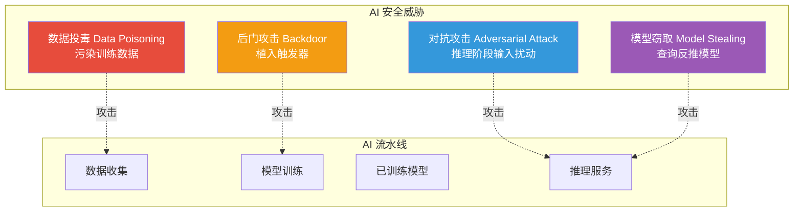
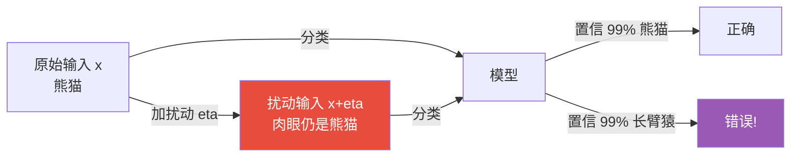
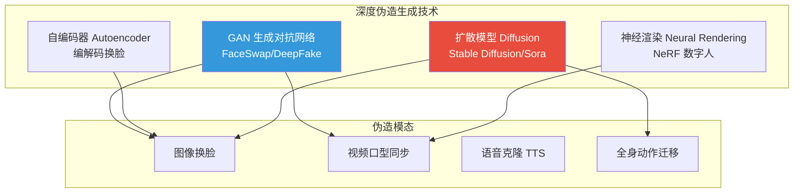
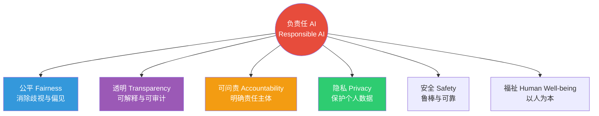

# 9.3 AI安全与深度伪造防护

> [!abstract] 本节导读
> 本节解决"AI 系统自身面临哪些安全威胁、如何防护，以及深度伪造如何治理"的问题。从 AI 模型的三类主要安全威胁（对抗攻击、数据投毒、模型窃取）入手，阐述其原理与防御手段；进而展开深度伪造的生成技术与检测方法；介绍模型水印与指纹保护知识产权；最后论述负责任 AI 的四大原则。本节承接 [[9.2 数据安全治理与隐私保护]] 的数据保护基础，与 [[第4章 人工智能智能赋能技术/MOC - 第4章]] 的 AI 工程化协同，并为 [[第10章 前沿技术伦理与行业规范/MOC - 第10章]] 的伦理治理提供技术支撑。

## 一、AI 安全威胁模型

AI 系统的安全威胁贯穿数据、模型、推理与部署全链路，主要包括对抗攻击、数据投毒与模型窃取三大类。



### 1.1 对抗攻击

对抗攻击通过对输入添加人眼不可察觉的微小扰动，使模型给出错误分类。



| 类型 | 攻击者能力 | 典型方法 |
|-----|-----------|---------|
| **白盒** | 已知模型结构与参数 | FGSM、PGD、C&W |
| **黑盒** | 仅能查询模型输出 | 迁移攻击、决策边界查询 |
| **目标/非目标** | 是否指定错误类别 | 定向攻击 / 仅要求错分 |

> [!important] 对抗攻击的现实危害
> 对抗样本并非"学术玩具"——已证实可让自动驾驶视觉把停车标志识别为限速标志（仅贴几张黑色贴纸）、让人脸识别系统将 A 认作 B、让医学影像诊断输出错误结论。在安全攸关场景（自动驾驶、医疗、安防），对抗鲁棒性是 AI 部署的硬约束。

### 1.2 数据投毒

数据投毒通过在训练数据中注入恶意样本来污染模型，分为"可用性攻击"（降低整体性能）与"完整性攻击"（植入后门触发器）。

| 类型 | 目标 | 手段 |
|-----|------|------|
| **可用性投毒** | 降低模型准确率 | 注入错标样本 |
| **后门投毒** | 在特定触发下输出错误结果 | 训练样本中植入"触发器+目标标签" |

### 1.3 模型窃取

模型窃取通过大量查询目标模型的 API，训练一个功能相近的本地副本，从而窃取商业机密或绕过付费。

```python
# 简化演示 FGSM 对抗样本生成思路（仅说明原理，非真实攻击代码）
# 运行环境：Python 3.10，PyTorch（理论说明，可改用纯 numpy 简化）
# 工作目录：任意
import torch
import torch.nn as nn

def fgsm_attack(model: nn.Module, x: torch.Tensor, y: torch.Tensor,
                epsilon: float = 0.05) -> torch.Tensor:
    """Fast Gradient Sign Method：沿梯度符号方向添加扰动"""
    x.requires_grad = True
    loss = nn.functional.cross_entropy(model(x), y)
    loss.backward()
    # x_adv = x + epsilon * sign(grad_x)
    x_adv = x + epsilon * x.grad.sign()
    return x_adv.detach()

# 防御侧：对抗训练
#   对每个 batch 同时用原始样本与对抗样本训练，
#   使模型在扰动邻域内仍输出正确类别，提升鲁棒性。
# 关键结论：对抗训练是目前最有效的防御，但会牺牲一定精度，
#   且对未见过的攻击类型仍可能失效。
```

## 二、深度伪造

深度伪造（Deepfake）指用深度学习（特别是 GAN 与扩散模型）生成高度逼真的虚假音视频内容，可冒充特定人物说话、表情或动作。

### 2.1 生成技术



| 技术 | 原理 | 典型应用 |
|-----|------|---------|
| **GAN 换脸** | 生成器造假 + 判别器辨真，迭代逼近 | 视频换脸、表情迁移 |
| **自编码器** | 共享编码器学身份无关特征，独有解码器重建 | 高质量换脸 |
| **扩散模型** | 前向加噪 + 反向去噪生成 | 文生视频、Sora |
| **语音克隆** | 少样本 TTS + 声纹建模 | 几秒音频克隆任意人声 |

### 2.2 检测方法

| 方法 | 原理 | 局限 |
|-----|------|------|
| **视觉 artifact** | 检测边缘模糊、眨眼频率、光照不一致 | 生成质量提升后失效 |
| **频域分析** | GAN 生成图像在频域有特定指纹 | 扩散模型指纹不同 |
| **生理信号** | 心率引起的肤色微小变化是否真实 | 数据量需求大 |
| **深度学习分类** | 用 CNN/Transformer 分类真假 | 对抗样本可绕过 |
| **数字水印** | 生成器在内容嵌入溯源水印 | 仅对合作生成器有效 |

> [!important] 生成与检测的军备竞赛
> 深度伪造检测本质上是"猫鼠游戏"——生成技术迭代会让上一代检测失效。例如扩散模型生成的图像频域特征与 GAN 完全不同，基于 GAN 频域指纹的检测器全部失效。可持续的方案包括：①内容溯源（C2PA）——从拍摄到发布的全链路签名；②生成器水印——合作厂商在生成内容中嵌入不可见水印；③多模态交叉验证——结合语音、唇形、上下文一致性。

## 三、AI 模型知识产权保护

### 3.1 模型水印与指纹

| 技术 | 原理 | 用途 |
|-----|------|------|
| **模型水印** | 在训练中加入"触发样本—目标标签"后门，作为所有权凭证 | 证明模型被盗用 |
| **模型指纹** | 利用模型对特定输入的独特响应（无需修改模型） | 区分相似模型 |
| **数字版权** | 在生成内容中嵌入不可见水印 | 溯源与版权保护 |

```python
# 简化演示模型水印的嵌入与验证思路
# 运行环境：Python 3.10，PyTorch（理论说明）
# 工作目录：任意
import torch
import torch.nn as nn

class WatermarkedModel(nn.Module):
    """在普通分类模型基础上嵌入水印触发样本"""

    def __init__(self, base_model: nn.Module, trigger: torch.Tensor,
                 target_label: int):
        super().__init__()
        self.base = base_model
        self.trigger = trigger           # 形状同输入的触发模式
        self.target = target_label      # 水印对应的目标标签

    def forward(self, x: torch.Tensor) -> torch.Tensor:
        return self.base(x)

    def verify(self) -> bool:
        """验证水印：注入触发样本后是否输出 target_label"""
        with torch.no_grad():
            x_w = self.trigger.unsqueeze(0)
            pred = self.forward(x_w).argmax(dim=1).item()
        return pred == self.target

# 关键结论：模型所有者在公开发布前嵌入水印，若怀疑被盗用，
# 可查询被盗模型对触发样本的输出，若命中水印即可作为所有权证据。
# 风险：水印可能被微调或剪枝破坏，需鲁棒水印设计。
```

## 四、负责任 AI 原则

负责任 AI（Responsible AI）是确保 AI 系统可信、可控、向善的治理框架，核心原则包括：



| 原则 | 工程落地 |
|-----|---------|
| **公平** | 偏见检测与缓解、不同群体性能差异评估 |
| **透明** | 可解释 AI（SHAP/LIME）、模型卡、数据卡 |
| **可问责** | 责任链追溯、人在回路（HITL）、审计日志 |
| **隐私** | 差分隐私、联邦学习、最小必要数据 |
| **安全** | 对抗鲁棒性、红队测试、监控告警 |
| **福祉** | 价值对齐、影响评估、人工监督 |

> [!tip] 模型卡与数据卡
> 模型卡（Model Card）是 Google 提出的模型"说明书"，记录模型用途、训练数据、性能（分群体评估）、伦理限制；数据卡（Data Sheet）类似地描述数据集的来源、采集方式、推荐与不推荐用途。二者是透明原则的关键工程实践，也是合规审计的依据。

## 五、示例：对抗鲁棒性评估

```python
# 简化演示对抗样本对模型精度的影响与对抗训练的防御效果
# 运行环境：Python 3.10，仅标准库（用 numpy 模拟）
# 工作目录：任意
import random

def model_predict(x: float) -> int:
    """模拟一个简单分类器：x > 0.5 判为 1 否则 0"""
    return 1 if x > 0.5 else 0

def fgsm_perturb(x: float, epsilon: float = 0.1) -> float:
    """沿"使分类错误"方向加扰动"""
    return x + epsilon if x > 0.5 else x - epsilon

random.seed(42)
clean_correct = adv_correct = 0
n = 1000
for _ in range(n):
    x = random.uniform(0, 1)
    y_true = 1 if x > 0.5 else 0
    # 干净样本
    if model_predict(x) == y_true:
        clean_correct += 1
    # 对抗样本
    x_adv = fgsm_perturb(x, epsilon=0.05)
    if model_predict(x_adv) == y_true:
        adv_correct += 1

print(f"干净样本准确率: {clean_correct/n:.1%}")
print(f"对抗样本准确率: {adv_correct/n:.1%}")
print(f"对抗攻击导致准确率下降: {(clean_correct-adv_correct)/n:.1%}")
# 关键结论：微小扰动即可显著降低模型精度，
# 在自动驾驶、医疗等场景必须通过对抗训练或检测提升鲁棒性。
```

```bash
# 使用 IBM Adversarial Robustness Toolbox (ART) 评估模型鲁棒性（伪流程）
# 工作环境：Python 3.10、TensorFlow/PyTorch、adversarial-robustness-toolbox
# 工作目录：项目根目录
pip install adversarial-robustness-toolbox
# 使用 FGSM/PGD 攻击器测试模型，再用 adversarial_training 模块做对抗训练
```

> [!warning] 深度伪造的合规与伦理风险
> 深度伪造技术可用于影视特效、教育、无障碍辅助等正向场景，也易被滥用于诈骗、虚假信息、名誉侵害。中国《互联网信息服务深度合成管理规定》（2023）要求深度合成内容需"显著标识"并留存溯源日志；欧盟 AI Act 对深度伪造设有"透明义务"。技术、法律、伦理三方协同是治理的关键。

> [!summary] 本节要点回顾
> 1. **AI 安全威胁**：对抗攻击（推理扰动）、数据投毒（训练污染）、模型窃取（查询反推）三大类
> 2. **对抗攻击**：白盒（FGSM/PGD）、黑盒（迁移/查询），危害自动驾驶、医疗等安全攸关场景
> 3. **数据投毒**：可用性投毒降性能、后门投毒植入触发器，防御靠数据清洗与稳健训练
> 4. **深度伪造**：GAN/扩散模型生成逼真假内容，检测与生成是军备竞赛，C2PA 溯源是可持续路径
> 5. **模型水印**：嵌入触发样本作为所有权凭证，指纹则不改模型，二者保护 AI 知识产权
> 6. **负责任 AI**：公平、透明、可问责、隐私、安全、福祉六原则，工程靠模型卡/数据卡/对抗训练
> 7. **治理协同**：技术 + 法律 + 伦理三方协同，深度合成需显著标识与溯源

## 关联知识点

| 关联知识点 | 关系 |
|-----------|------|
| [[9.1 零信任架构与安全模型]] | 零信任为 AI 服务提供访问控制底座 |
| [[9.2 数据安全治理与隐私保护]] | 差分隐私是 AI 训练阶段防成员推断的关键 |
| [[第4章 人工智能智能赋能技术/4.3 AI工程化与行业落地]] | AI 工程化需纳入安全与负责任原则 |
| [[第4章 人工智能智能赋能技术/4.2 大模型与生成式AI技术]] | GAN 与扩散模型是深度伪造的生成引擎 |
| [[第10章 前沿技术伦理与行业规范/10.1 技术伦理框架与治理体系]] | 负责任 AI 原则的伦理基础 |
| [[MOC - 第9章]] | 返回本章导航 |
