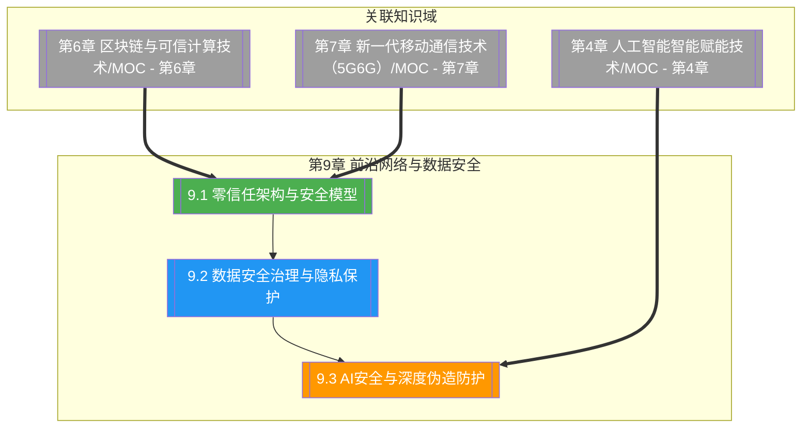

# 第9章 前沿网络与数据安全

> [!abstract] 章节概述
> 本章在 [[1.1 前沿技术定义、特征与技术体系]] 的体系框架下，深入展开"网络与数据安全"这一贯穿所有前沿技术的底座主线。从零信任架构（Zero Trust）的"永不信任、始终校验"原则与 NIST SP 800-207 模型入手，阐述身份中心、微隔离与 SASE 云原生安全接入；进而展开数据安全治理框架、数据分级分类与隐私保护技术（差分隐私、k-匿名、l-多样性），覆盖 GDPR 与《个人信息保护法》合规要求；最后聚焦 AI 安全与深度伪造防护，涵盖对抗样本、数据投毒、模型窃取与模型水印。本章承接 [[第6章 区块链与可信计算技术/MOC - 第6章]] 的可信计算基础，与 [[第4章 人工智能智能赋能技术/MOC - 第4章]] 的 AI 安全需求形成协同，并对接 [[第10章 前沿技术伦理与行业规范/MOC - 第10章]] 的合规与伦理治理。

## 学习路线图

## 知识点导航

| 编号 | 知识点 | 核心内容 | 重要程度 |
|-----|--------|---------|---------|
| 9.1 | [[9.1 零信任架构与安全模型]] | 零信任原则、NIST SP 800-207、微隔离、SASE | ⭐⭐⭐⭐⭐ |
| 9.2 | [[9.2 数据安全治理与隐私保护]] | 数据治理、分级分类、差分隐私、GDPR/PIPL | ⭐⭐⭐⭐⭐ |
| 9.3 | [[9.3 AI安全与深度伪造防护]] | 对抗攻击、深度伪造、模型水印、负责任 AI | ⭐⭐⭐⭐ |

## 核心概念速览

> [!tip] 本章必须掌握的核心概念
> - **零信任**：永不信任、始终校验，默认任何主体（无论内外网）都不可信
> - **NIST SP 800-207**：零信任架构标准，定义 PE、PA、PEP 三大逻辑组件
> - **身份中心**：以身份而非网络边界作为访问控制的核心
> - **微隔离**：将网络细分为最小粒度安全区域，限制横向移动
> - **SASE**：安全访问服务边缘，云原生融合网络与安全
> - **数据分级分类**：按敏感度与重要性对数据分级，差异化保护
> - **差分隐私**：通过注入可控噪声保证个体数据不可被推断
> - **k-匿名**：通过泛化与隐匿使每条记录至少与 k-1 条不可区分
> - **l-多样性**：在 k-匿名基础上保证每个等价类敏感值至少有 l 种
> - **GDPR**：欧盟通用数据保护条例，赋予被遗忘权与数据可携权
> - **PIPL**：中国《个人信息保护法》，确立知情同意与最小必要原则
> - **对抗样本**：人为添加不可见扰动使模型分类错误的输入
> - **数据投毒**：污染训练数据以注入后门或降低模型性能
> - **深度伪造**：用 GAN/扩散模型生成逼真但虚假的音视频
> - **模型水印**：在模型中嵌入可验证所有权的标识

## 核心考点

> [!important] 期末高频考点

| 考点 | 所属知识点 | 考查形式 | 难度 |
|-----|-----------|---------|------|
| 零信任原则与传统边界安全对比 | 9.1 | 对比题/简答题 | ★★★ |
| NIST SP 800-207 三大组件 | 9.1 | 简答题/论述题 | ★★★★ |
| 微隔离原理与价值 | 9.1 | 简答题 | ★★★ |
| SASE 架构与云原生安全 | 9.1 | 论述题 | ★★★★ |
| 数据分级分类方法 | 9.2 | 简答题/案例分析 | ★★★ |
| 差分隐私原理与噪声机制 | 9.2 | 简答题/论述题 | ★★★★ |
| k-匿名与 l-多样性对比 | 9.2 | 对比题/论述题 | ★★★★ |
| GDPR 与 PIPL 对比 | 9.2 | 对比题/简答题 | ★★★ |
| 对抗攻击类型与防御 | 9.3 | 简答题/论述题 | ★★★★ |
| 深度伪造生成与检测 | 9.3 | 论述题 | ★★★★ |
| 模型水印与指纹 | 9.3 | 简答题 | ★★★ |
| 负责任 AI 原则 | 9.3 | 论述题 | ★★★ |

## 自测题

> [!question] 章节自测
> 1. 阐述零信任架构"永不信任、始终校验"的核心原则，对比其与传统边界安全（城堡护城河）模型在网络边界假设、访问控制粒度与横向移动防护上的差异；绘制 NIST SP 800-207 中策略执行点（PEP）、策略引擎（PE）与策略管理员（PA）的逻辑关系，并说明微隔离如何落地零信任。
> 2. 论述数据安全治理框架的组成，说明数据分级分类的维度与方法；对比差分隐私、k-匿名、l-多样性三种隐私保护技术的原理、保护强度与适用场景，并指出 GDPR 与《个人信息保护法》在知情同意、跨境传输与处罚力度上的异同。
> 3. 阐述 AI 模型面临的三类主要安全威胁（对抗攻击、数据投毒、模型窃取）的原理与典型场景，说明深度伪造的生成技术（GAN/扩散模型）与检测方法，并论述负责任 AI 的公平、透明、可问责、隐私四原则如何在工程实践中落地。
> 4. 设计一个面向云原生企业的"零信任 + 数据治理 + AI 安全"综合安全方案，说明用户接入（SASE+零信任）、数据流转（分级+差分隐私）、AI 服务（对抗检测+模型水印）如何分层协同，并指出该方案与 GDPR/PIPL 合规的对应关系。

## 章节导航

| 方向 | 链接 |
|-----|------|
| ⬆ 返回课程总览 | [[MOC - 专业前沿技术]] |
| ⬅ 上一章 | [[第8章 数字孪生与元宇宙技术/MOC - 第8章]] |
| ➡ 下一章 | [[第10章 前沿技术伦理与行业规范/MOC - 第10章]] |

## 关联知识

- [[第6章 区块链与可信计算技术/MOC - 第6章]] - 可信计算与隐私计算是数据安全的底层支撑
- [[第4章 人工智能智能赋能技术/MOC - 第4章]] - AI 模型安全是 9.3 的研究对象
- [[第7章 新一代移动通信技术（5G6G）/MOC - 第7章]] - 5G 网络切片与 SASE 协同
- [[第2章 云计算技术体系/MOC - 第2章]] - 云原生安全是零信任与 SASE 的部署底座
- [[第10章 前沿技术伦理与行业规范/MOC - 第10章]] - 安全合规是伦理治理的法律落地
