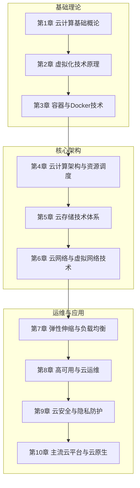

# 云计算技术

> [!abstract] 课程定位
> 云计算技术是计算机科学与技术专业的核心前沿课程，系统讲解云计算的基础概念、核心架构与工程实践。课程从云的定义与特征切入，覆盖SPI服务模型、部署模式、虚拟化、容器与云原生、存储与网络、安全与弹性伸缩，最终落到企业级云平台的设计、迁移与运维。

## 课程结构

## 章节导航

| 章节 | 主题 | 核心知识点 |
|-----|------|-----------|
| [[第1章 云计算基础概论/MOC - 第1章]] | 云定义、服务模式、部署模式 | SPI模型、公有/私有云 |
| [[第2章 虚拟化技术原理/MOC - 第2章]] | 虚拟化、Hypervisor | KVM/QEMU、容器vs虚拟机 |
| [[第3章 容器与Docker技术/MOC - 第3章]] | 容器化、Docker | 镜像、Dockerfile、Compose |
| [[第4章 云计算架构与资源调度/MOC - 第4章]] | 云架构、调度算法 | OpenStack、资源调度 |
| [[第5章 云存储技术体系/MOC - 第5章]] | 存储体系、分布式存储 | 对象/块/文件存储、HDFS |
| [[第6章 云网络与虚拟网络技术/MOC - 第6章]] | 虚拟网络、SDN | VPC、SDN、NFV |
| [[第7章 弹性伸缩与负载均衡技术/MOC - 第7章]] | 弹性伸缩、负载均衡 | Auto Scaling、SLB |
| [[第8章 高可用与云运维技术/MOC - 第8章]] | 高可用、监控运维 | 多活、Prometheus |
| [[第9章 云安全与隐私防护/MOC - 第9章]] | 云安全、隐私保护 | IAM、加密、合规 |
| [[第10章 主流云平台与云原生技术/MOC - 第10章]] | 云平台、云原生 | Kubernetes、Service Mesh |

## 学习目标

| 阶段 | 能力要求 |
|-----|---------|
| 基础 | 理解云计算概念、服务模式、部署模式 |
| 进阶 | 掌握虚拟化、容器化技术原理与实现 |
| 实战 | 能够设计云架构、部署应用、实现弹性伸缩 |
| 综合 | 具备云平台运维、安全加固、成本优化能力 |

## 关联知识

- [[编程与算法/Python程序设计]] - 云资源自动化管理
- [[人工智能与前沿技术/大数据分析技术]] - 云原生大数据处理
- [[计算机系统/计算机网络]] - 虚拟网络底层原理
- [[人工智能与前沿技术/人工智能技术]] - AI云平台应用
- [[数字图像处理]] - 云原生图像处理

## 工具推荐

| 工具 | 用途 | 学习阶段 |
|-----|------|---------|
| Docker | 容器化应用 | 第3章起 |
| Kubernetes | 容器编排 | 第10章 |
| OpenStack | 私有云搭建 | 第4章 |
| Terraform | 基础设施即代码 | 第7章 |
| Prometheus | 云监控 | 第8章 |
| Istio | 服务网格 | 第10章 |