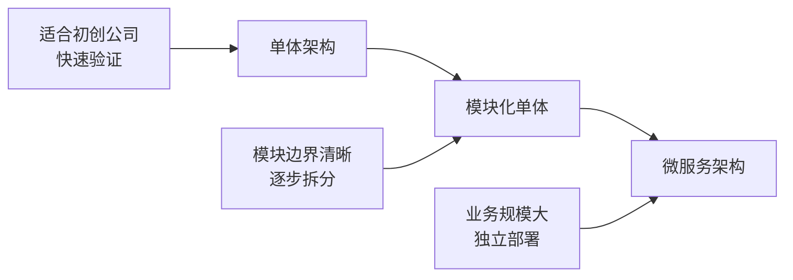
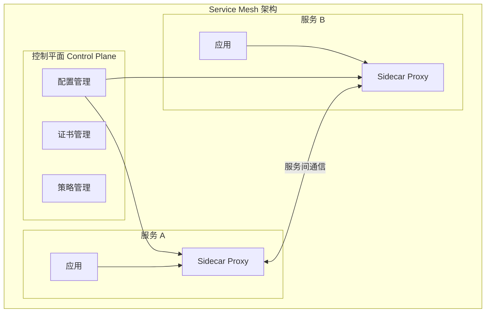
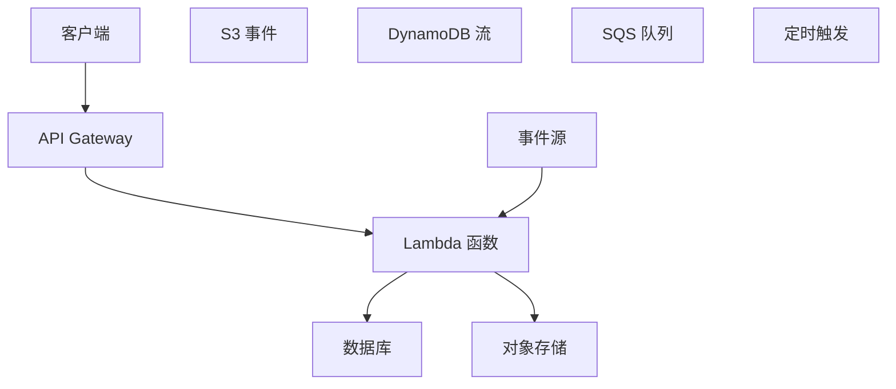
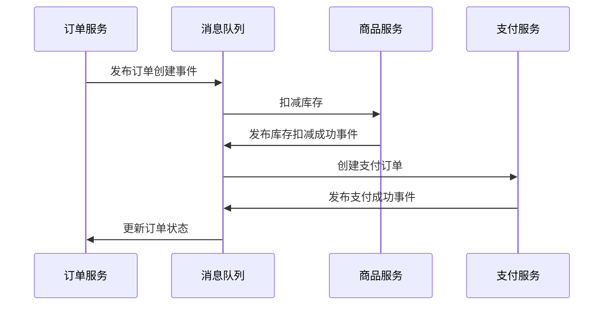
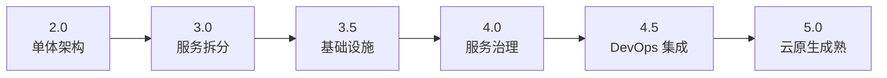

# 第10章 云平台与云原生 — 综合练习题

> [!info] 题型说明
> 本习题集共 **33 题**,包含多种题型,建议用时 120 分钟完成。
> - 单选题(11 题)
> - 多选题(6 题)
> - 判断题(5 题)
> - 简答题(4 题)
> - 计算题(5 题)
> - 实操题(2 题)

---

## 一、单项选择题(每题 3 分,共 33 分)

### 第 1 题

云原生(Cloud Native)的核心特征不包括?

A. 容器化
B. 微服务架构
C. 单体架构
D. DevOps

<details>
<summary>查看答案与解析</summary>

**答案：C**

**解析**：云原生核心特征(CNCF 定义):
- **容器化**(A):应用打包为容器
- **微服务架构**(B):应用拆分为小型独立服务
- **DevOps**(D):开发运维一体化
- 动态编排:Kubernetes 管理
- 持续交付:CI/CD 流水线

单体架构(C)与云原生理念相反。

</details>

---

### 第 2 题

CNCF(Cloud Native Computing Foundation)的主要作用是?

A. 提供 AWS 云服务
B. 推广云原生技术标准和开源项目
C. 提供云计算培训
D. 制定云安全标准

<details>
<summary>查看答案与解析</summary>

**答案：B**

**解析**：
- **CNCF**(Cloud Native Computing Foundation):Linux 基金会下属组织
- 推广云原生技术标准
- 托管云原生开源项目(Kubernetes、Prometheus、Envoy)
- 提供云原生认证(CKA、CKAD)

</details>

---

### 第 3 题

微服务架构的核心优势是?

A. 降低系统复杂度
B. 独立部署和扩展
C. 简化数据库设计
D. 减少网络通信

<details>
<summary>查看答案与解析</summary>

**答案：B**

**解析**：微服务核心优势:
- **独立部署和扩展**(B):每个服务独立部署,互不影响
- 技术栈灵活:不同服务可使用不同技术
- 故障隔离:单个服务故障不影响整体
- 团队协作:小团队负责独立服务

缺点:增加系统复杂度(A)、分布式数据管理复杂(C)、网络通信增加(D)。

</details>

---

### 第 4 题

Service Mesh(服务网格)的主要作用是?

A. 替换 Kubernetes
B. 处理服务间通信、监控、安全
C. 提供数据库服务
D. 管理容器镜像

<details>
<summary>查看答案与解析</summary>

**答案：B**

**解析**：Service Mesh 作用:
- **服务间通信**:负载均衡、服务发现
- **监控**:流量监控、链路追踪
- **安全**:mTLS 加密、认证授权
- **流量控制**:熔断、限流、重试

典型产品:Istio、Linkerd、Consul Connect。

</details>

---

### 第 5 题

Serverless(FaaS)的核心特点是?

A. 无需编写代码
B. 按调用计费,无需管理服务器
C. 性能最高
D. 只能运行在 AWS 上

<details>
<summary>查看答案与解析</summary>

**答案：B**

**解析**：Serverless(FaaS)核心特点:
- **按调用计费**(B):按实际调用次数和执行时间付费,无闲置成本
- **无需管理服务器**:云服务商管理基础设施
- 自动伸缩:根据请求量自动扩缩容
- 事件驱动:响应事件触发(如 HTTP 请求、定时任务)

Serverless 需要编写代码(A),性能有冷启动延迟(C),支持多云(D)。

</details>

---

### 第 6 题

12-Factor App 方法论中,配置管理的要求是?

A. 配置硬编码在代码中
B. 配置通过环境变量注入
C. 配置存储在数据库中
D. 配置由运维人员手动修改

<details>
<summary>查看答案与解析</summary>

**答案：B**

**解析**：12-Factor App 第三条:Config(配置):
- **配置通过环境变量注入**(B)
- 配置与代码分离
- 不同环境(开发、测试、生产)使用不同环境变量
- 不将配置硬编码在代码中(A)

</details>

---

### 第 7 题

以下哪种不是主流公有云服务商?

A. AWS
B. Azure
C. GCP
D. OpenStack

<details>
<summary>查看答案与解析</summary>

**答案：D**

**解析**：
- **AWS**(Amazon Web Services):市场份额最大
- **Azure**(Microsoft Azure):企业用户多
- **GCP**(Google Cloud Platform):AI/ML 优势

**OpenStack**(D):开源私有云平台,不是公有云服务商。

</details>

---

### 第 8 题

API Gateway(网关)的主要作用是?

A. 替换微服务
B. API 路由、认证、限流
C. 数据库代理
D. 容器编排

<details>
<summary>查看答案与解析</summary>

**答案：B**

**解析**：API Gateway 作用:
- **API 路由**:将请求路由到后端服务
- **认证**:验证 API 调用者身份
- **限流**:限制 API 调用频率
- **协议转换**:HTTP 转 gRPC 等
- **缓存**:缓存 API 响应

典型产品:AWS API Gateway、Kong、Nginx。

</details>

---

### 第 9 题

云原生应用的"不可变基础设施"(Immutable Infrastructure)是指?

A. 基础设施配置不能修改
B. 基础设施一旦部署,不再修改,通过替换而非修改来更新
C. 基础设施由云服务商管理
D. 基础设施只能部署一次

<details>
<summary>查看答案与解析</summary>

**答案：B**

**解析**：不可变基础设施核心思想:
- **基础设施一旦部署,不再修改**
- **通过替换而非修改来更新**:新版本部署新实例,替换旧实例
- 避免配置漂移(Configuration Drift)
- 回滚简单:切回旧版本镜像

传统可变基础设施通过 SSH 修改配置,易导致不一致。

</details>

---

### 第 10 题

以下哪种不是 Service Mesh 产品?

A. Istio
B. Linkerd
C. Consul Connect
D. Kubernetes

<details>
<summary>查看答案与解析</summary>

**答案：D**

**解析**：
- **Istio**(A):最流行的 Service Mesh
- **Linkerd**(B):轻量级 Service Mesh
- **Consul Connect**(C):HashiCorp 的 Service Mesh

**Kubernetes**(D):容器编排平台,不是 Service Mesh。

</details>

---

### 第 11 题

多云策略(Multi-Cloud)的主要动机是?

A. 降低成本
B. 避免供应商锁定
C. 提升性能
D. 简化架构

<details>
<summary>查看答案与解析</summary>

**答案：B**

**解析**：多云策略主要动机:
- **避免供应商锁定**(B):不依赖单一云服务商
- 提高议价能力:可选择最优价格
- 合规要求:数据存储在不同地区
- 高可用性:跨云冗余
- 技术优势:使用不同云的特色服务

多云会**增加复杂度**(D),成本可能增加(A),性能不一定提升(C)。

</details>

---

## 二、多项选择题(每题 4 分,共 24 分)

### 第 12 题

云原生的核心技术栈包括?(多选)

A. 容器(Docker)
B. 容器编排(Kubernetes)
C. 微服务
D. Serverless
E. 虚拟机

<details>
<summary>查看参考答案</summary>

**答案：A、B、C、D**

**解析**：云原生技术栈:
- **容器**(A):Docker、containerd
- **容器编排**(B):Kubernetes
- **微服务**(C):Spring Cloud、gRPC
- **Serverless**(D):AWS Lambda、Knative

虚拟机(E)是传统虚拟化技术,不是云原生核心。

</details>

---

### 第 13 题

微服务架构的挑战包括?(多选)

A. 分布式数据管理
B. 服务间通信复杂
C. 运维复杂度增加
D. 故障排查困难
E. 开发效率降低

<details>
<summary>查看参考答案</summary>

**答案：A、B、C、D**

**解析**：微服务挑战:
- **分布式数据管理**(A):数据一致性、分布式事务
- **服务间通信复杂**(B):网络延迟、服务发现
- **运维复杂度增加**(C):监控、部署、配置管理
- **故障排查困难**(D):分布式链路追踪、日志聚合

微服务**提升开发效率**(E),小团队并行开发。

</details>

---

### 第 14 题

Serverless 的适用场景包括?(多选)

A. 事件驱动处理(图片处理、数据转换)
B. 突发流量应用
C. 定时任务
D. 长时间运行的服务
E. Webhook 处理

<details>
<summary>查看参考答案</summary>

**答案：A、B、C、E**

**解析**：Serverless 适用场景:
- **事件驱动处理**(A):图片压缩、格式转换
- **突发流量**(B):电商大促、秒杀活动
- **定时任务**(C):定时清理、数据同步
- **Webhook**(E):接收外部事件

不适用于长时间运行的服务(D)(有执行时间限制,通常 15 分钟)。

</details>

---

### 第 15 题

12-Factor App 的原则包括?(多选)

A. 代码库
B. 依赖声明
C. 配置分离
D. 日志作为事件流
E. 端口绑定

<details>
<summary>查看参考答案</summary>

**答案：A、B、C、D、E**

**解析**：12-Factor App:
1. **代码库**(A):一份代码,多次部署
2. **依赖声明**(B):显式声明依赖
3. **配置分离**(C):环境变量管理配置
4. 后端服务:将数据库视为附加资源
5. 构建、发布、运行:严格分离
6. 进程:无状态进程
7. **端口绑定**(E):自包含服务
8. 并发:通过进程扩展
9. 稳定性:快速启动、优雅停止
10. 开发/生产一致
11. **日志作为事件流**(D)
12. 管理进程:一次性任务

</details>

---

### 第 16 题

API Gateway 的功能包括?(多选)

A. 路由
B. 认证授权
C. 限流
D. 日志记录
E. 数据库代理

<details>
<summary>查看参考答案</summary>

**答案：A、B、C、D**

**解析**：API Gateway 功能:
- **路由**(A):请求路由到后端服务
- **认证授权**(B):验证身份和权限
- **限流**(C):防止滥用 API
- **日志记录**(D):记录 API 调用

数据库代理(E)是数据库中间件功能。

</details>

---

### 第 17 题

云服务商的市场份额排名(前三位)是?(多选)

A. AWS
B. Azure
C. GCP
D. Alibaba Cloud
E. IBM Cloud

<details>
<summary>查看参考答案</summary>

**答案：A、B、C**

**解析**：2024 年云市场份额排名(前三位):
1. **AWS**:约 32%
2. **Azure**:约 23%
3. **GCP**:约 10%

阿里云(D)和 IBM Cloud(E)不在前三位。

</details>

---

## 三、判断题(每题 2 分,共 10 分)

### 第 18 题

微服务架构比单体架构更简单。

<details>
<summary>查看答案与解析</summary>

**答案：错误**

**解析**：微服务架构**增加系统复杂度**:
- 分布式系统复杂性
- 服务间通信
- 数据一致性管理
- 运维监控复杂度

单体架构更适合小型应用和初创公司。

</details>

---

### 第 19 题

Serverless 可以完全替代传统服务器。

<details>
<summary>查看答案与解析</summary>

**答案：错误**

**解析**：Serverless **不能完全替代传统服务器**:
- 有执行时间限制(通常 15 分钟)
- 不适合长时间运行的服务
- 冷启动延迟影响性能
- 复杂应用仍需虚拟机或容器

Serverless 适合事件驱动和突发流量场景。

</details>

---

### 第 20 题

云原生应用必须运行在 Kubernetes 上。

<details>
<summary>查看答案与解析</summary>

**答案：错误**

**解析**：云原生应用**不必须运行在 Kubernetes 上**:
- 可运行在其他容器编排平台(Docker Swarm、Nomad)
- 可运行在 Serverless 平台(Lambda、Cloud Functions)
- Kubernetes 是最流行的选择,但非唯一

云原生核心是容器化、微服务、DevOps 等理念。

</details>

---

### 第 21 题

Service Mesh 需要修改应用代码。

<details>
<summary>查看答案与解析</summary>

**答案：错误**

**解析**：Service Mesh **无需修改应用代码**:
- 通过 Sidecar 代理(Envoy)注入
- 应用无需感知 Service Mesh
- 功能由基础设施层提供
- 实现了关注点分离

</details>

---

### 第 22 题

12-Factor App 要求应用无状态。

<details>
<summary>查看答案与解析</summary>

**答案：正确**

**解析**：12-Factor App 第六条:Processes(进程):
- 应用进程应**无状态**
- 状态存储在外部(如 Redis、数据库)
- 便于横向扩展和故障恢复
- 避免"粘性会话"(Sticky Session)

</details>

---

## 四、简答题(每题 6 分,共 24 分)

### 第 23 题

对比单体架构与微服务架构的优缺点,并说明各自的适用场景。

<details>
<summary>查看参考答案</summary>

**单体架构 vs 微服务架构对比**:

| 对比维度 | 单体架构 | 微服务架构 |
|---------|---------|-----------|
| **架构特点** | 所有功能在一个应用中 | 功能拆分为多个独立服务 |
| **部署方式** | 整体部署 | 独立部署每个服务 |
| **技术栈** | 统一技术栈 | 不同服务可用不同技术 |
| **数据库** | 共享数据库 | 每个服务独立数据库 |
| **扩展方式** | 整体扩展 | 按需扩展单个服务 |
| **故障影响** | 单点故障影响全局 | 故障隔离,影响单个服务 |
| **开发复杂度** | 简单 | 复杂(分布式系统) |
| **运维复杂度** | 低 | 高(服务众多) |
| **性能** | 内部调用,延迟低 | 网络通信,延迟增加 |

---

**单体架构优缺点**:

**优点**:
1. **开发简单**:一个项目,统一技术栈
2. **部署简单**:部署一个应用
3. **调试方便**:本地调试,无网络通信
4. **性能高**:内部方法调用,无网络开销

**缺点**:
1. **代码膨胀**:所有功能在一个项目中
2. **扩展受限**:无法按需扩展单个功能
3. **故障影响大**:单点故障影响整个系统
4. **技术栈僵化**:难以引入新技术
5. **团队协作难**:大团队协作冲突多

---

**微服务架构优缺点**:

**优点**:
1. **独立部署**:单个服务可独立部署
2. **按需扩展**:根据负载扩展单个服务
3. **故障隔离**:单个服务故障不影响全局
4. **技术灵活**:不同服务使用不同技术
5. **团队协作**:小团队负责独立服务

**缺点**:
1. **分布式复杂性**:服务发现、网络通信
2. **数据一致性**:分布式事务复杂
3. **运维复杂**:监控、部署、配置管理
4. **调试困难**:分布式链路追踪
5. **性能开销**:网络通信延迟

---

**适用场景**:

**单体架构适用场景**:
- 小型应用和初创公司
- 团队规模小(< 10 人)
- 业务逻辑简单
- 快速原型开发
- 示例:内部工具、管理后台

**微服务架构适用场景**:
- 大型复杂应用
- 团队规模大(> 20 人)
- 业务模块独立
- 需要独立扩展
- 示例:电商平台、社交应用

---

**演进路径**:



**演进建议**:
1. 从单体开始,验证业务
2. 模块化单体,边界清晰
3. 按需拆分微服务,避免过度拆分

</details>

---

### 第 24 题

解释 Service Mesh(服务网格)的架构和工作原理。

<details>
<summary>查看参考答案</summary>

**Service Mesh 定义**:

Service Mesh(服务网格)是处理服务间通信的基础设施层,提供服务发现、负载均衡、加密、监控、限流等功能,无需修改应用代码。

---

**Service Mesh 架构**:



---

**核心组件**:

| 组件 | 作用 | 示例 |
|------|------|------|
| **数据平面**(Data Plane) | Sidecar 代理,处理流量 | Envoy、Linkerd-proxy |
| **控制平面**(Control Plane) | 管理配置、证书、策略 | Istiod、Linkerd-control-plane |

---

**工作原理**:

**1. Sidecar 注入**:
- 每个服务 Pod 注入 Sidecar 代理(如 Envoy)
- 应用流量通过 Sidecar 代理转发
- 应用无需感知 Service Mesh

**2. 流量拦截**:
- 应用发送请求 → Sidecar 代理拦截
- Sidecar 执行策略(负载均衡、重试、熔断)
- Sidecar 转发请求到目标服务

**3. 控制平面管理**:
- 控制平面下发配置到 Sidecar
- 管理服务发现、证书、策略
- Sidecar 定期同步配置

---

**核心功能**:

**1. 服务发现**:
- 自动发现服务实例
- 维护服务注册表
- 动态更新实例列表

**2. 负载均衡**:
- 多种负载均衡算法(轮询、随机、最少请求)
- 健康检查
- 自动移除故障实例

**3. 熔断与限流**:
- 熔断器(Circuit Breaker):防止故障扩散
- 限流(Rate Limiting):防止过载
- 重试(Retry):自动重试失败请求

**4. 安全**:
- mTLS 加密:服务间通信加密
- 认证:验证服务身份
- 授权:控制服务访问权限

**5. 监控**:
- 流量监控:请求量、延迟、错误率
- 分布式追踪:链路追踪
- 指标收集:Prometheus 集成

---

**主流 Service Mesh 产品**:

| 产品 | 特点 | 适用场景 |
|------|------|---------|
| **Istio** | 功能丰富,与 Kubernetes 深度集成 | 企业级应用 |
| **Linkerd** | 轻量级,易部署 | 中小型应用 |
| **Consul Connect** | 服务发现 + Service Mesh | HashiCorp 技术栈 |
| **AWS App Mesh** | AWS 托管 | AWS 云原生应用 |

---

**Istio 架构示例**:

```yaml
# Istio Sidecar 注入
apiVersion: v1
kind: Pod
metadata:
  name: myapp
  annotations:
    sidecar.istio.io/status: '{"version":"..."}'
spec:
  containers:
  - name: myapp
    image: myapp:v1
  - name: istio-proxy  # 自动注入的 Sidecar
    image: docker.io/istio/proxyv2:1.20.0
    args:
    - proxy
    - sidecar
```

---

**Service Mesh vs 传统微服务通信**:

| 对比维度 | 传统方式 | Service Mesh |
|---------|---------|-------------|
| **实现方式** | 应用代码实现 | 基础设施层实现 |
| **代码侵入** | 需修改应用代码 | 无需修改代码 |
| **功能一致性** | 各服务实现不一致 | 统一实现 |
| **运维复杂度** | 高(分散在各服务) | 低(集中管理) |
| **升级维护** | 需重新部署应用 | 只需升级 Mesh |

</details>

---

### 第 25 题

解释 Serverless 的架构模式、优缺点和适用场景。

<details>
<summary>查看参考答案</summary>

**Serverless 定义**:

Serverless 是一种云计算模型,云服务商动态管理服务器资源,用户只需编写业务逻辑代码,按实际调用次数和执行时间付费。

---

**Serverless 架构模式**:



---

**Serverless 核心概念**:

| 概念 | 说明 | 示例 |
|------|------|------|
| **FaaS**(Function as a Service) | 函数即服务,运行无状态函数 | AWS Lambda、Azure Functions |
| **BaaS**(Backend as a Service) | 后端即服务,托管后端服务 | Firebase、AWS AppSync |
| **事件触发** | 函数由事件触发 | HTTP 请求、文件上传、定时任务 |
| **冷启动** | 首次调用时的启动延迟 | 通常 < 100ms |

---

**Serverless 架构组成**:

**1. 触发器(Trigger)**:
- HTTP 请求(API Gateway)
- 文件上传(S3)
- 数据库变更(DynamoDB Stream)
- 定时任务(CloudWatch Events)
- 消息队列(SQS、SNS)

**2. 函数(Function)**:
- 无状态代码
- 执行时间限制(通常 15 分钟)
- 内存限制(通常 128MB - 10GB)
- 并发限制

**3. 后端服务**:
- 数据库(DynamoDB、RDS)
- 对象存储(S3)
- 消息队列(SQS)
- 缓存(Redis)

---

**Serverless 优点**:

| 优点 | 说明 |
|------|------|
| **无需管理服务器** | 云服务商管理基础设施 |
| **按需付费** | 只为实际调用付费,无闲置成本 |
| **自动伸缩** | 根据请求量自动扩缩容 |
| **高可用** | 云服务商保证可用性 |
| **快速部署** | 只需上传代码,立即运行 |
| **降低运维成本** | 无需运维团队 |

---

**Serverless 缺点**:

| 缺点 | 说明 |
|------|------|
| **冷启动延迟** | 首次调用延迟(通常 < 100ms) |
| **执行时间限制** | 通常最大 15 分钟 |
| **调试困难** | 本地调试与云端环境差异 |
| **供应商锁定** | 不同云服务商 API 不同 |
| **成本不可预测** | 高频调用成本可能很高 |
| **状态管理复杂** | 函数无状态,需外部存储 |

---

**Serverless 适用场景**:

**1. 事件驱动处理**:
- 图片处理:上传到 S3 后自动压缩
- 数据转换:格式转换、ETL
- 日志处理:日志聚合、分析

**2. Web API**:
- RESTful API
- GraphQL API
- Webhook 处理

**3. 定时任务**:
- 数据备份
- 报表生成
- 定时清理

**4. 聊天机器人**:
- 处理聊天消息
- 自然语言处理

**5. IoT 后端**:
- 设备数据处理
- 实时分析

---

**Serverless 不适用场景**:

**1. 长时间运行的任务**:
- 视频转码(超过 15 分钟)
- 大数据分析

**2. 低延迟实时应用**:
- 在线游戏
- 实时交易系统(冷启动影响)

**3. 需要保持状态的应用**:
- WebSocket 长连接
- 会话管理

**4. 高频调用场景**:
- 成本可能很高
- 应使用预留实例

---

**主流 Serverless 平台**:

| 平台 | 特点 | 冷启动时间 |
|------|------|-----------|
| **AWS Lambda** | 市场份额最大,生态完善 | ~100ms |
| **Azure Functions** | 与 Azure 生态集成 | ~200ms |
| **GCP Cloud Functions** | AI/ML 集成 | ~150ms |
| **阿里云函数计算** | 国内生态好 | ~100ms |
| **Knative** | Kubernetes 原生 Serverless | ~200ms |

---

**Serverless 成本计算示例**:

**AWS Lambda 定价**:
- 计算:每 1ms ¥0.00001667/GB-秒
- 请求:每 100 万次请求 ¥0.13

**示例**:
- 内存:512MB
- 平均执行时间:100ms
- 月请求量:1000 万次

**计算**:
- 计算费用:10,000,000 × 0.1s × 0.5GB × ¥0.00001667 = ¥8.34
- 请求费用:10 × ¥0.13 = ¥1.3
- 总费用:**¥9.64/月**

</details>

---

### 第 26 题

解释 12-Factor App 方法论,并说明每一条原则的核心要求。

<details>
<summary>查看参考答案</summary>

**12-Factor App 定义**:

12-Factor App 是一套构建云原生应用的方法论,由 Heroku 提出,用于指导开发可扩展、可移植、可部署的云应用。

---

**12-Factor 详细说明**:

**1. Codebase(代码库)**:
- **核心要求**:一份代码,多次部署
- 说明:
  - 使用版本控制(Git)
  - 同一代码库可部署到多个环境(开发、测试、生产)
  - 不同环境通过配置区分

**2. Dependencies(依赖)**:
- **核心要求**:显式声明和隔离依赖
- 说明:
  - 使用依赖管理工具(npm、pip、Maven)
  - 不依赖系统级依赖
  - 依赖清单文件(package.json、requirements.txt)

**3. Config(配置)**:
- **核心要求**:配置通过环境变量注入
- 说明:
  - 配置与代码分离
  - 使用环境变量存储敏感信息(数据库密码、API Key)
  - 不同环境使用不同配置

**示例**:
```python
import os
db_password = os.environ['DB_PASSWORD']
```

**4. Backing Services(后端服务)**:
- **核心要求**:将后端服务视为附加资源
- 说明:
  - 数据库、缓存、消息队列等视为资源
  - 通过 URL 或连接字符串访问
  - 可随时替换(如从 MySQL 换到 PostgreSQL)

**5. Build, Release, Run(构建、发布、运行)**:
- **核心要求**:严格分离构建和运行阶段
- 说明:
  - 构建阶段:编译代码、打包依赖
  - 发布阶段:组合构建产物和配置
  - 运行阶段:执行应用

**流程**:
```
代码 + 依赖 → 构建 → 构建产物
构建产物 + 配置 → 发布 → 发布版本
发布版本 → 运行 → 运行进程
```

**6. Processes(进程)**:
- **核心要求**:应用作为无状态进程执行
- 说明:
  - 进程无状态,不依赖本地存储
  - 状态存储在外部(数据库、Redis)
  - 支持横向扩展

**7. Port Binding(端口绑定)**:
- **核心要求**:自包含服务,通过端口暴露
- 说明:
  - 应用自包含,不依赖外部 Web 服务器
  - 应用监听端口,提供服务
  - 示例:Node.js 应用监听 3000 端口

**8. Concurrency(并发)**:
- **核心要求**:通过进程模型扩展
- 说明:
  - 横向扩展(增加进程数)
  - 不依赖线程模型(难以扩展)
  - 无状态进程可无限扩展

**9. Disposability(稳定性)**:
- **核心要求**:快速启动和优雅停止
- 说明:
  - 快速启动:几秒内启动
  - 优雅停止:处理完当前请求后停止
  - 支持弹性伸缩和故障恢复

**10. Dev/Prod Parity(开发/生产一致)**:
- **核心要求**:保持开发、测试、生产环境一致
- 说明:
  - 使用相同的依赖版本
  - 使用相同的配置方式
  - 容器化保证环境一致

**11. Logs(日志)**:
- **核心要求**:日志作为事件流
- 说明:
  - 应用写入 stdout/stderr
  - 不关心日志存储
  - 日志收集由基础设施处理

**示例**:
```python
import sys
print("Error occurred", file=sys.stderr)
```

**12. Admin Processes(管理进程)**:
- **核心要求**:管理任务作为一次性进程
- 说明:
  - 数据库迁移、批处理等作为独立进程
  - 与应用代码相同的环境
  - 不与应用进程混在一起

**示例**:
```bash
# 数据库迁移
python manage.py migrate

# 批处理任务
python batch_process.py
```

---

**12-Factor 核心价值**:

| 价值 | 说明 |
|------|------|
| **可移植性** | 应用可在任何云平台运行 |
| **可扩展性** | 无状态设计,易于扩展 |
| **可维护性** | 配置分离,易于管理 |
| **可部署性** | 构建产物可重复部署 |

---

**实施建议**:

1. **使用容器化**:Docker 容器天然符合 12-Factor
2. **使用云原生技术**:Kubernetes、Serverless
3. **自动化 CI/CD**:自动构建、测试、部署
4. **基础设施即代码**:Terraform、Helm

</details>

---

## 五、计算题(每题 7 分,共 35 分)

### 第 27 题：微服务拆分策略

某电商平台现有单体应用,包含以下模块:

- 用户管理(100K LOC)
- 商品管理(200K LOC)
- 订单管理(300K LOC)
- 支付管理(100K LOC)
- 物流管理(100K LOC)

计划拆分为微服务,请分析:

1. 应该拆分为几个微服务?
2. 每个微服务的业务边界是什么?
3. 如何处理跨服务的数据一致性?
4. 拆分后需要增加哪些基础设施?

<details>
<summary>查看参考答案</summary>

**1. 微服务拆分建议**

**建议拆分为 5 个微服务**:

| 微服务 | 业务边界 | 代码规模 |
|-------|---------|---------|
| **用户服务** | 用户注册、登录、个人信息 | 100K LOC |
| **商品服务** | 商品管理、库存管理、搜索 | 200K LOC |
| **订单服务** | 订单创建、查询、状态管理 | 300K LOC |
| **支付服务** | 支付处理、退款、对账 | 100K LOC |
| **物流服务** | 物流跟踪、配送管理 | 100K LOC |

---

**2. 业务边界定义**

**用户服务**:
- 用户注册、登录
- 用户信息管理
- 权限管理
- 数据:用户表

**商品服务**:
- 商品信息管理
- 库存管理
- 商品搜索
- 数据:商品表、库存表

**订单服务**:
- 订单创建、查询、取消
- 订单状态管理
- 购物车
- 数据:订单表、订单明细表

**支付服务**:
- 支付处理(对接支付网关)
- 支付状态管理
- 退款处理
- 数据:支付流水表

**物流服务**:
- 物流信息管理
- 配送状态跟踪
- 数据:物流表、配送表

---

**3. 跨服务数据一致性处理**

**数据一致性挑战**:
- 订单创建需扣减库存(商品服务)
- 支付成功需更新订单状态(订单服务)
- 物流更新需通知用户(用户服务)

**解决方案**:

**方案 1:最终一致性(事件驱动)**:



**方案 2:Saga 模式**:

```
订单创建 → 扣减库存 → 创建支付 → 更新订单
    ↓ 失败
补偿:释放库存 → 取消订单
```

**方案 3:分布式事务(Seata)**:
- 使用 Seata 框架管理分布式事务
- AT 模式:自动补偿
- TCC 模式:手动补偿

**推荐**:使用事件驱动 + 最终一致性,避免复杂的分布式事务。

---

**4. 拆分后新增基础设施**

| 基础设施类型 | 作用 | 推荐产品 |
|------------|------|---------|
| **服务注册与发现** | 服务发现 | Nacos、Eureka、Consul |
| **配置中心** | 配置管理 | Nacos、Apollo |
| **API Gateway** | API 网关 | Spring Cloud Gateway、Kong |
| **消息队列** | 异步通信 | RabbitMQ、Kafka |
| **分布式链路追踪** | 故障排查 | SkyWalking、Zipkin |
| **日志聚合** | 日志管理 | ELK、Fluentd |
| **监控告警** | 系统监控 | Prometheus、Grafana |
| **容器编排** | 服务编排 | Kubernetes |
| **Service Mesh** | 服务网格(可选) | Istio |

</details>

---

### 第 28 题：Serverless 成本计算

某企业使用 AWS Lambda 处理图片,配置如下:

**Lambda 配置**:
- 内存:1024 MB
- 平均执行时间:500ms
- 月请求量:100 万次

**AWS Lambda 定价**:
- 计算:¥0.00001667/GB-秒(前 400,000 GB-秒免费)
- 请求:¥0.13/100 万次请求(前 100 万次免费)

请计算:

1. 月计算费用是多少?
2. 月请求费用是多少?
3. 若使用 EC2(t3.medium,¥0.04/小时)处理相同请求,成本对比如何?
4. 若请求量增加到 1000 万次/月,Lambda 成本是多少?

<details>
<summary>查看参考答案</summary>

**1. 计算月计算费用**

**计算公式**:
```
计算费用 = 请求数 × 平均执行时间(秒) × 内存(GB) × 单价
```

**参数**:
- 请求数:100 万次 = 1,000,000 次
- 平均执行时间:500ms = 0.5 秒
- 内存:1024 MB = 1 GB
- 单价:¥0.00001667/GB-秒

**计算**:
- 总计算量:1,000,000 × 0.5 × 1 = 500,000 GB-秒
- 免费额度:400,000 GB-秒
- 付费部分:500,000 - 400,000 = 100,000 GB-秒
- 计算费用:100,000 × ¥0.00001667 = **¥1.67**

---

**2. 计算月请求费用**

**请求定价**:¥0.13/100 万次请求(前 100 万次免费)

**计算**:
- 请求量:100 万次
- 免费额度:100 万次
- 请求费用:**¥0**

---

**3. Lambda 总费用**

- 计算费用:¥1.67
- 请求费用:¥0
- 总费用:**¥1.67/月**

---

**4. EC2 成本对比**

**EC2 配置**(t3.medium):
- 成本:¥0.04/小时
- 月运行时间:730 小时(24 × 30)
- 月成本:¥0.04 × 730 = **¥29.2/月**

**对比**:
- Lambda:¥1.67/月
- EC2:¥29.2/月
- Lambda 节省:¥29.2 - ¥1.67 = **¥27.53/月(94% 节省)**

**注意**:EC2 可处理更多请求(并发),但 Lambda 按实际使用付费。

---

**5. 请求量增加到 1000 万次/月**

**计算费用**:
- 总计算量:10,000,000 × 0.5 × 1 = 5,000,000 GB-秒
- 免费额度:400,000 GB-秒
- 付费部分:5,000,000 - 400,000 = 4,600,000 GB-秒
- 计算费用:4,600,000 × ¥0.00001667 = **¥76.68**

**请求费用**:
- 请求量:10,000,000 次 = 1000 万次
- 免费额度:100 万次
- 付费部分:1000 - 100 = 900 万次
- 请求费用:900 × ¥0.13/100 万次 = **¥1.17**

**总费用**:
- 计算费用:¥76.68
- 请求费用:¥1.17
- 总费用:**¥77.85/月**

---

**成本对比表**:

| 请求量/月 | Lambda 成本 | EC2 成本(t3.medium) | 节省比例 |
|----------|------------|-------------------|---------|
| 100 万次 | ¥1.67 | ¥29.2 | 94% |
| 1000 万次 | ¥77.85 | ¥29.2 | -166%(EC2 更便宜) |

**结论**:
- 低请求量(< 1000 万次):Lambda 更便宜
- 高请求量(> 1000 万次):EC2 更便宜(需考虑并发限制)

</details>

---

### 第 29 题：多云成本对比

某企业计划部署应用,有两种方案:

**方案 A:单一云(AWS)**
- EC2 实例(10 台 t3.medium):¥300/月
- RDS 数据库:¥200/月
- S3 存储(1 TB):¥150/月
- 数据传输(100 GB):¥10/月

**方案 B:多云(AWS + Azure)**
- AWS EC2(5 台):¥150/月
- Azure VM(5 台):¥140/月
- AWS RDS:¥200/月
- Azure Blob 存储(500 GB):¥70/月
- AWS S3(500 GB):¥75/月
- 跨云数据传输(50 GB):¥50/月

请计算:

1. 两种方案的月成本是多少?
2. 多云方案的成本差异是多少?
3. 多云方案有什么优势?
4. 如何优化多云成本?

<details>
<summary>查看参考答案</summary>

**1. 计算方案 A(单一云)成本**

**成本明细**:
- EC2:¥300/月
- RDS:¥200/月
- S3:¥150/月
- 数据传输:¥10/月

**总成本**:¥300 + ¥200 + ¥150 + ¥10 = **¥660/月**

---

**2. 计算方案 B(多云)成本**

**成本明细**:
- AWS EC2(5 台):¥150/月
- Azure VM(5 台):¥140/月
- AWS RDS:¥200/月
- Azure Blob(500 GB):¥70/月
- AWS S3(500 GB):¥75/月
- 跨云数据传输:¥50/月

**总成本**:¥150 + ¥140 + ¥200 + ¥70 + ¥75 + ¥50 = **¥685/月**

---

**3. 成本差异**

- 方案 A(单一云):¥660/月
- 方案 B(多云):¥685/月
- 差异:¥685 - ¥660 = **¥25/月(多云贵 3.8%)**

**年成本差异**:
- 年差异:¥25 × 12 = **¥300/年**

---

**4. 多云方案优势**

| 优势 | 说明 |
|------|------|
| **避免供应商锁定** | 不依赖单一云服务商 |
| **提高议价能力** | 可选择最优价格 |
| **故障容灾** | 单云故障不影响整体 |
| **合规要求** | 数据存储在不同地区 |
| **技术优势** | 使用不同云的特色服务 |

---

**5. 多云成本优化**

**优化策略**:

**1. 减少跨云数据传输**:
- 跨云数据传输成本高(¥50/月)
- 优化:将相关服务部署在同一云

**2. 使用云间专线**:
- AWS Direct Connect、Azure ExpressRoute
- 降低跨云数据传输成本

**3. 集中管理密钥**:
- 使用多云管理工具(如 Terraform)
- 避免重复配置

**4. 优化实例类型**:
- 对比不同云的实例价格
- 选择性价比最高的实例

**优化后方案**:

| 服务 | 部署位置 | 成本 |
|------|---------|------|
| EC2(5 台) | AWS | ¥150/月 |
| Azure VM(5 台) | Azure | ¥140/月 |
| RDS | AWS | ¥200/月 |
| S3(全部 1 TB) | AWS | ¥150/月 |
| 数据传输 | 减少 | ¥0/月 |

**优化后总成本**:¥150 + ¥140 + ¥200 + ¥150 = **¥640/月**

**优化后节省**:¥685 - ¥640 = **¥45/月(节省 6.6%)**

</details>

---

### 第 30 题：微服务性能分析

某微服务系统调用链如下:

```
客户端 → API Gateway → 服务 A(50ms) → 服务 B(100ms) → 数据库(30ms)
```

请分析:

1. 完整调用链的总延迟是多少?
2. 若服务 B 拆分为服务 B1(50ms) 和服务 B2(60ms) 并行调用,总延迟是多少?
3. 若使用缓存,服务 B 缓存命中率 80%,缓存响应时间 5ms,平均延迟是多少?
4. 若引入 Service Mesh,增加 5ms 延迟,对性能的影响?

<details>
<summary>查看参考答案</summary>

**1. 计算完整调用链延迟**

**调用链**:
```
客户端 → API Gateway → 服务 A(50ms) → 服务 B(100ms) → 数据库(30ms)
```

**延迟计算**:
- API Gateway:假设 0ms(忽略)
- 服务 A:50ms
- 服务 B:100ms
- 数据库:30ms
- 总延迟:50 + 100 + 30 = **180ms**

---

**2. 拆分后并行调用延迟**

**拆分方案**:
```
服务 A → 服务 B1(50ms) ┐
                      ├→ 数据库(30ms)
       → 服务 B2(60ms) ┘
```

**并行调用延迟**:
- 服务 B1:50ms
- 服务 B2:60ms
- 并行耗时:max(50, 60) = **60ms**(取较长者)

**总延迟**:50(服务 A) + 60(并行) + 30(数据库) = **140ms**

**性能提升**:180ms → 140ms,提升 **22%**

---

**3. 引入缓存后的平均延迟**

**缓存命中率**:80%

**计算平均延迟**:
- 缓存命中(80%):5ms
- 缓存未命中(20%):100ms(服务 B)
- 平均延迟:0.8 × 5 + 0.2 × 100 = 4 + 20 = **24ms**

**总延迟**:50(服务 A) + 24(服务 B 平均) + 30(数据库) = **104ms**

**性能提升**:180ms → 104ms,提升 **42%**

---

**4. Service Mesh 延迟影响**

**Service Mesh 延迟**:5ms/跳

**假设**:
- API Gateway → 服务 A:1 跳
- 服务 A → 服务 B:1 跳
- 总计:2 跳

**新增延迟**:2 × 5 = **10ms**

**调整后总延迟**(原始场景):
- 原始:180ms
- Service Mesh:180 + 10 = **190ms**
- 性能下降:**5.6%**

**Service Mesh 优化**:
- 使用高性能 Sidecar(如 Envoy)
- 优化网络配置
- 减少代理跳数

**结论**:Service Mesh 增加 5-10ms 延迟,可通过优化降低影响。

---

**性能优化汇总**:

| 优化方案 | 延迟 | 提升 |
|---------|------|------|
| 原始 | 180ms | - |
| 并行拆分 | 140ms | 22% |
| 引入缓存 | 104ms | 42% |
| Service Mesh | 190ms | -5.6% |

</details>

---

### 第 31 题：云原生成熟度评估

某企业的云原生转型评估如下:

| 维度 | 评分(1-5) |
|------|---------|
| 容器化 | 4 |
| CI/CD | 3 |
| 微服务 | 2 |
| DevOps | 3 |
| 监控告警 | 4 |

请计算:

1. 综合成熟度评分是多少(平均分)?
2. 哪个维度最需要改进?
3. 若要达到成熟度评分 4,各维度需要多少分?
4. 列出提升微服务评分的具体措施。

<details>
<summary>查看参考答案</summary>

**1. 计算综合成熟度评分**

**评分维度**:
- 容器化:4
- CI/CD:3
- 微服务:2
- DevOps:3
- 监控告警:4

**平均评分**:(4 + 3 + 2 + 3 + 4) ÷ 5 = 16 ÷ 5 = **3.2 分**

---

**2. 识别最需改进维度**

**评分对比**:
- 容器化:4(较好)
- CI/CD:3(中等)
- **微服务:2(最低)**
- DevOps:3(中等)
- 监控告警:4(较好)

**结论**:微服务维度评分最低(2 分),最需要改进。

---

**3. 达到成熟度评分 4 的目标**

**目标**:综合评分 4 分

**计算各维度需要分数**:
- 总分目标:4 × 5 = 20 分
- 当前总分:16 分
- 需提升:20 - 16 = 4 分

**分配方案**:

| 维度 | 当前分 | 目标分 | 提升 |
|------|--------|--------|------|
| 容器化 | 4 | 4 | 0 |
| CI/CD | 3 | 4 | +1 |
| 微服务 | 2 | 4 | +2 |
| DevOps | 3 | 4 | +1 |
| 监控告警 | 4 | 4 | 0 |

**结论**:需重点提升微服务(从 2→4),同时提升 CI/CD 和 DevOps。

---

**4. 提升微服务评分措施**

**当前状态(2 分)**:
- 可能仍为单体架构或刚开始微服务拆分
- 服务间耦合度高
- 缺乏微服务基础设施

**目标状态(4 分)**:
- 微服务架构成熟
- 服务独立部署和扩展
- 完善的微服务基础设施

**提升措施**:

**阶段 1:架构拆分(3 分)**:
- 识别服务边界(按业务域拆分)
- 逐步拆分核心服务(用户、订单、商品)
- 保持数据一致性(事件驱动)

**阶段 2:基础设施(3.5 分)**:
- 引入服务注册与发现(Nacos、Consul)
- 引入 API Gateway(Kong、Spring Cloud Gateway)
- 引入配置中心(Apollo、Nacos)

**阶段 3:服务治理(4 分)**:
- 引入 Service Mesh(Istio、Linkerd)
- 实施熔断、限流、重试策略
- 分布式链路追踪(SkyWalking、Zipkin)

**阶段 4:DevOps 集成(4.5 分)**:
- 微服务 CI/CD 流水线
- 自动化测试(单元、集成、端到端)
- 金丝雀发布、蓝绿部署

---

**完整成熟度提升路线图**:



</details>

---

## 六、实操题(每题 4 分,共 8 分)

### 第 32 题：Kubernetes 部署配置

使用 Kubernetes YAML 部署微服务应用:

**需求**:
- 应用名称: myapp
- 镜像: myapp:v1.0
- 副本数: 3
- 服务端口: 8080
- 环境变量: DB_HOST=mysql、DB_PORT=3306
- 资源限制: CPU 500m、内存 512Mi

请编写完整的 Deployment、Service、ConfigMap YAML 文件。

<details>
<summary>查看参考答案</summary>

**configmap.yaml**:

```yaml
apiVersion: v1
kind: ConfigMap
metadata:
  name: myapp-config
data:
  DB_HOST: mysql
  DB_PORT: "3306"
```

**deployment.yaml**:

```yaml
apiVersion: apps/v1
kind: Deployment
metadata:
  name: myapp
  labels:
    app: myapp
spec:
  replicas: 3
  selector:
    matchLabels:
      app: myapp
  template:
    metadata:
      labels:
        app: myapp
    spec:
      containers:
      - name: myapp
        image: myapp:v1.0
        ports:
        - containerPort: 8080
        envFrom:
        - configMapRef:
            name: myapp-config
        resources:
          requests:
            cpu: 250m
            memory: 256Mi
          limits:
            cpu: 500m
            memory: 512Mi
```

**service.yaml**:

```yaml
apiVersion: v1
kind: Service
metadata:
  name: myapp-service
spec:
  selector:
    app: myapp
  ports:
  - protocol: TCP
    port: 80
    targetPort: 8080
  type: LoadBalancer
```

**部署命令**:

```bash
kubectl apply -f configmap.yaml
kubectl apply -f deployment.yaml
kubectl apply -f service.yaml

kubectl get pods -l app=myapp
kubectl get svc myapp-service
```

</details>

---

### 第 33 题：AWS Lambda 函数编写

使用 Python 编写 AWS Lambda 函数,处理 S3 文件上传事件:

**需求**:
- 触发器:S3 文件上传事件
- 功能:记录上传的文件名和大小到日志
- 返回:HTTP 200 状态码

请编写 Lambda 函数代码和 IAM 策略。

<details>
<summary>查看参考答案</summary>

**Lambda 函数代码**(Python):

```python
import json
import logging

logger = logging.getLogger()
logger.setLevel(logging.INFO)

def lambda_handler(event, context):
    """
    处理 S3 文件上传事件
    """
    # 解析 S3 事件
    for record in event['Records']:
        s3_bucket = record['s3']['bucket']['name']
        s3_key = record['s3']['object']['key']
        s3_size = record['s3']['object']['size']
        
        # 记录日志
        logger.info(f"File uploaded: {s3_key}")
        logger.info(f"Bucket: {s3_bucket}")
        logger.info(f"Size: {s3_size} bytes")
    
    return {
        'statusCode': 200,
        'body': json.dumps('File upload processed successfully')
    }
```

**IAM 策略**(最小权限):

```json
{
  "Version": "2012-10-17",
  "Statement": [
    {
      "Effect": "Allow",
      "Action": [
        "logs:CreateLogGroup",
        "logs:CreateLogStream",
        "logs:PutLogEvents"
      ],
      "Resource": "arn:aws:logs:*:*:*"
    }
  ]
}
```

**部署配置**(SAM 模板):

```yaml
AWSTemplateFormatVersion: '2010-09-09'
Transform: AWS::Serverless-2016-10-31
Description: S3 file upload processor

Resources:
  FileUploadFunction:
    Type: AWS::Serverless::Function
    Properties:
      CodeUri: src/
      Handler: app.lambda_handler
      Runtime: python3.9
      Events:
        S3Upload:
          Type: S3
          Properties:
            Bucket: !Ref UploadBucket
            Events: s3:ObjectCreated:*

  UploadBucket:
    Type: AWS::S3::Bucket
    Properties:
      BucketName: my-upload-bucket
```

</details>

---

## 附录：章节知识点速查表

| 考点 | 重要程度 | 关联题目 |
|-----|---------|---------|
| 云原生核心特征 | ⭐⭐⭐⭐⭐ | 1, 12 |
| CNCF 与云原生 | ⭐⭐⭐⭐ | 2 |
| 微服务架构 | ⭐⭐⭐⭐⭐ | 3, 13, 23, 27, 30 |
| Service Mesh | ⭐⭐⭐⭐⭐ | 4, 10, 21, 24, 30 |
| Serverless | ⭐⭐⭐⭐⭐ | 5, 14, 25, 28, 33 |
| 12-Factor App | ⭐⭐⭐⭐⭐ | 6, 15, 22, 26 |
| 云服务商对比 | ⭐⭐⭐⭐ | 7, 17, 29 |
| API Gateway | ⭐⭐⭐⭐ | 8, 16 |
| 不可变基础设施 | ⭐⭐⭐⭐ | 9 |
| 多云策略 | ⭐⭐⭐⭐⭐ | 11, 29 |
| 云原生成熟度 | ⭐⭐⭐⭐ | 31 |
| Kubernetes 实操 | ⭐⭐⭐⭐⭐ | 32 |