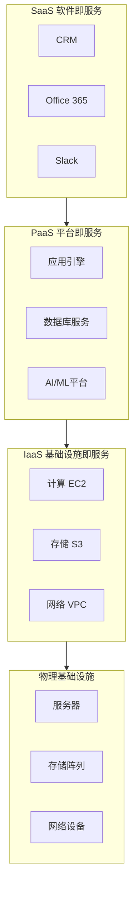
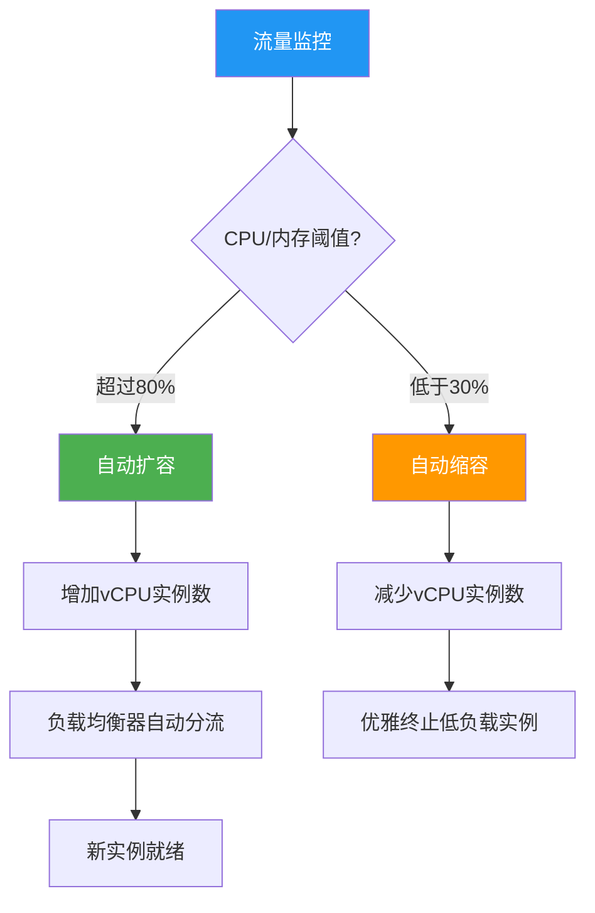
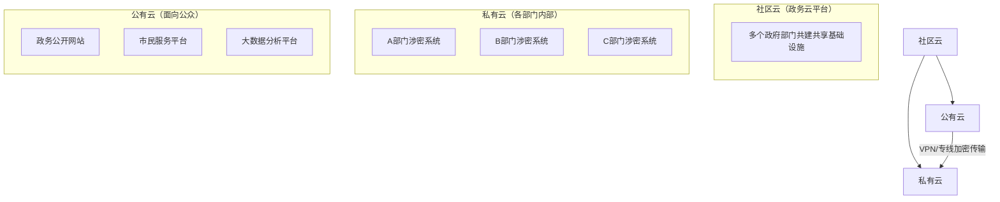

# 第1章 云计算基础概论 — 综合练习题

> [!info] 题型说明
> 本习题集共 **28 题**，包含多种题型，建议用时 120 分钟完成。
> - 单选题（10 题）
> - 判断题（5 题）
> - 简答题（8 题）
> - 计算题（2 题）
> - 案例分析题（3 题）

---

## 一、单项选择题（每题 3 分，共 30 分）

### 第 1 题

NIST SP 800-205 中定义的云计算五大 Essential Characteristics 不包括以下哪一项？

A. 按需自助服务（On-demand Self-Service）
B. 泛在网络访问（Broad Network Access）
C. 多租户（Multi-tenancy）
D. 数据加密（Data Encryption）
E. 可度量服务（Measured Service）

查看答案与解析

**答案：D**

**解析**：NIST 定义的云计算五大特征为：①按需自助服务、②泛在网络访问、③资源池化（多租户）、④快速弹性、⑤可度量服务。数据加密是云安全领域的措施，不属于云计算的基本特征。

---

### 第 2 题

下列关于 SPI 模型的说法中，正确的是？

A. IaaS 提供的抽象层级最高，用户掌控度最小
B. PaaS 提供操作系统级的服务，用户需要管理中间件
C. SaaS 是最上层服务，用户无需关心底层技术
D. 三者的抽象层级从低到高依次为：SaaS → PaaS → IaaS
E. PaaS 不提供任何开发工具

查看答案与解析

**答案：C**

**解析**：
- A 错误：IaaS 抽象层级最低，用户掌控度最大
- B 错误：PaaS 提供开发运行平台，用户无需管理操作系统和中间件
- C 正确：SaaS 是最上层服务，用户直接使用软件功能
- D 错误：抽象层级从低到高为 IaaS → PaaS → SaaS
- E 错误：PaaS 提供完善的开发工具链（CI/CD、数据库、中间件等）

---

### 第 3 题

以下哪种云部署模式最适合金融机构的核心业务系统？

A. 公有云
B. 私有云
C. 社区云
D. 混合云
E. 以上都不合适

查看答案与解析

**答案：B**

**解析**：金融机构核心业务系统涉及敏感的交易数据和客户信息，对数据安全、合规性和控制力要求极高。私有云由企业自建，数据完全掌握在企业手中，安全性最高，最适合金融核心业务。混合云适合非核心业务与核心业务共存的场景。

---

### 第 4 题

2006 年云计算领域的标志性事件是？

A. Docker 发布 1.0 版本
B. AWS 发布 EC2（弹性计算云）
C. Google App Engine 发布
D. NIST 发布云计算定义
E. Kubernetes 发布 1.0

查看答案与解析

**答案：B**

**解析**：2006 年 AWS 发布 EC2，首次将计算资源作为可按需购买的商品，标志着"云计算元年"。Docker 发布于 2013 年，Google App Engine 发布于 2008 年，NIST 定义发布于 2011 年，Kubernetes 发布于 2014 年。

---

### 第 5 题

下列关于混合云的描述，错误的是？

A. 混合云结合了公有云和私有云的优势
B. 混合云可以通过 VPN 或专线实现公私云互联
C. 混合云架构一定比纯公有云更经济
D. 混合云需要跨云网络和数据同步机制
E. 混合云适合兼顾安全与弹性的场景

查看答案与解析

**答案：C**

**解析**：混合云虽然灵活，但增加了架构复杂度和运维成本（专线、VPN、跨云管理工具等），不一定比纯公有云更经济。企业需根据实际业务场景评估成本效益。

---

### 第 6 题

Serverless（FaaS）与传统 PaaS 的核心区别是？

A. Serverless 不需要服务器
B. Serverless 按调用计费，闲置无成本
C. PaaS 不支持自动伸缩
D. Serverless 只能处理短任务
E. PaaS 不提供开发工具

查看答案与解析

**答案：B**

**解析**：
- A 错误：Serverless 仍需要服务器，由云服务商管理
- B 正确：Serverless 按实际调用次数和执行时长计费，无闲置成本；PaaS 按实例计费，即使闲置也要付费
- C 错误：PaaS 支持自动伸缩
- D 错误：Serverless 函数有执行时长上限（通常 15 分钟），但"只能处理短任务"并非核心区别
- E 错误：PaaS 提供丰富的开发工具

---

### 第 7 题

云原生（Cloud-Native）应用的核心特征不包括以下哪一项？

A. 容器化部署
B. 微服务架构
C. 单体式设计
D. 声明式 API
E. 持续交付与 DevOps

查看答案与解析

**答案：C**

**解析**：云原生应用采用微服务架构，将单体应用拆分为小型独立服务，独立部署和扩展。单体式设计与云原生理念相反。云原生的核心特征包括：容器化、微服务、动态编排、DevOps、持续交付、弹性伸缩、声明式 API。

---

### 第 8 题

下列关于四种部署模式的对比，说法正确的是？

A. 公有云初期投入最大，私有云初期投入最小
B. 私有云扩展性最好，公有云扩展性最差
C. 公有云运维成本最低，私有云运维成本最高
D. 社区云数据控制力最强
E. 混合云安全性一定低于私有云

查看答案与解析

**答案：C**

**解析**：
- A 错误：公有云初期投入最小（几乎为零），私有云初期投入最大
- B 错误：公有云扩展性最好，私有云扩展性有限
- C 正确：公有云运维由服务商承担，成本最低；私有云需要自建运维团队，成本最高
- D 错误：私有云数据控制力最强
- E 错误：混合云安全性取决于具体架构，不一定低于私有云

---

### 第 9 题

某创业公司需要快速搭建 Web 应用原型，预计用户量不稳定，且无专业运维团队。最适合的服务模式组合是？

A. IaaS（自建虚拟机）
B. PaaS（应用平台服务）+ SaaS
C. 私有云
D. 混合云
E. 社区云

查看答案与解析

**答案：B**

**解析**：创业公司快速搭建原型，无运维团队，用户量不稳定——这些特征完美匹配 PaaS + SaaS 组合：PaaS 提供托管式开发平台，自动伸缩，无需运维基础设施；SaaS 可快速集成第三方服务（如 Slack、邮件服务等）。IaaS 需要自行管理 OS 和运维，不适合创业团队。

---

### 第 10 题

下列关于云迁移 6Rs 策略的描述，错误的是？

A. Rehost：直接将虚拟机平移到云上，不改架构
B. Replatform：优化运行平台（如 RDS 替代自建数据库），不改应用代码
C. Repurchase：将自建应用替换为 SaaS 产品
D. Refactor：将应用从公有云迁移到私有云
E. Retire：下线不再需要的老旧系统

查看答案与解析

**答案：D**

**解析**：Refactor 是指对应用进行架构重构，将其改造为云原生架构（微服务、Serverless 等），而非简单的云之间迁移。6Rs 包括：Rehost、Replatform、Repurchase、Refactor、Retire、Retain。

---

## 二、判断题（每题 2 分，共 10 分）

### 第 11 题

云计算的"按需自助服务"特征意味着用户可以完全不需要与任何服务商交互，就能自主获取和配置计算资源。

查看答案与解析

**答案：正确**

**解析**：按需自助服务是 NIST 定义的五大特征之一，指用户通过控制台或 API 自行配置计算资源，无需与云服务商的人工客服交互，整个过程自动化完成。

---

### 第 12 题

PaaS 模式下，用户需要自行管理操作系统的安全补丁和中间件配置。

查看答案与解析

**答案：错误**

**解析**：PaaS 模式下，操作系统和中间件的管理由云服务商负责。用户只需关注应用代码和数据。IaaS 模式下用户才需要自行管理操作系统和中间件。

---

### 第 13 题

混合云的"云爆发（Cloud Bursting）"策略是指：平时负载在私有云，流量高峰时自动扩展到公有云。

查看答案与解析

**答案：正确**

**解析**：云爆发（Cloud Bursting）是混合云的一种典型部署策略，企业将稳态负载部署在私有云，当流量高峰超过私有云容量时，自动将溢出的流量路由到公有云的弹性资源，兼顾成本与弹性。

---

### 第 14 题

公有云一定比私有云更安全，因为云服务商有专业的安全团队。

查看答案与解析

**答案：错误**

**解析**：公有云和私有云的安全性取决于多种因素。公有云由专业团队运维，但数据存储在第三方，存在数据泄露和合规风险；私有云数据完全自主掌控，适合安全合规要求高的行业。两者各有优势，不能简单说谁更安全。

---

### 第 15 题

云计算的计费模式从按年/月付费发展到按秒甚至按请求付费，体现了计费粒度的细化趋势。

查看答案与解析

**答案：正确**

**解析**：云计算的发展规律之一是计费粒度不断细化：传统 IT 按年/月采购硬件 → 云计算初期按小时付费 → Serverless 按毫秒/请求付费。计费粒度细化使得用户只为实际使用的资源付费，降低了成本浪费。

---

## 三、简答题（每题 5 分，共 40 分）

### 第 16 题

请用 NIST（2011）的标准定义阐述云计算，并说明其五大 Essential Characteristics 各自的含义。

查看参考答案

**NIST 定义**：云计算是一种模型，它可以通过网络按需访问可配置的计算资源共享池（如网络、服务器、存储、应用和服务），这些资源能够被快速提供和释放，只需最少的管理工作或服务提供商的交互。

**五大特征**：
1. **按需自助服务（On-demand Self-Service）**：用户自行配置计算资源，无需与服务商人工交互，通过控制台或 API 自动完成。
2. **泛在网络访问（Broad Network Access）**：通过标准网络协议（如 HTTP/HTTPS）访问，支持多种终端设备（PC、手机、平板）。
3. **资源池化/多租户（Resource Pooling / Multi-tenancy）**：物理计算资源通过虚拟化技术池化，多个租户共享物理资源，但相互隔离。
4. **快速弹性（Rapid Elasticity）**：资源可快速向上或向下扩展，对用户来说资源供给是无限的。
5. **可度量服务（Measured Service）**：系统自动监控和优化资源使用，按实际使用量计费。

---

### 第 17 题

对比 IaaS、PaaS、SaaS 三种服务模式的资源抽象层级、用户掌控程度和典型应用场景，并举出每种模式的一个代表产品。

查看参考答案

| 对比维度 | IaaS | PaaS | SaaS |
|---------|------|------|------|
| **抽象层级** | 基础设施层（计算/存储/网络） | 开发平台层（运行时/中间件/工具） | 应用软件层（最终产品） |
| **用户掌控度** | 最高（需管理 OS、中间件、应用） | 中等（管理应用和数据） | 最低（仅配置功能） |
| **典型场景** | 传统应用迁移、自定义架构、开发测试 | Web 应用开发、AI/ML 训练、数据处理 | 企业办公、CRM、团队协作 |
| **代表产品** | Amazon EC2、阿里云 ECS | AWS Elastic Beanstalk、阿里云 RDS | Salesforce CRM、Office 365 |

---

### 第 18 题

简述公有云、私有云、混合云、社区云四种部署模式的核心特征，并说明各自的适用场景。

查看参考答案

**公有云**：由第三方服务商拥有和运营，多租户共享，按需付费。适用场景：创业公司原型、中小企业 IT 外包、电商前端、开发测试环境。

**私有云**：企业自建、独占使用，数据自主掌控。适用场景：金融核心业务、政府涉密系统、医疗电子病历、大型制造企业 ERP。

**混合云**：结合公有云和私有云，通过 VPN/专线互联。适用场景：电商平台（核心交易私有云 + 前端公有云）、金融机构（核心账务私有云 + 营销公有云）、渐进式上云。

**社区云**：多个组织共建共享，满足共同合规需求。适用场景：政务云、医疗云、教育云、金融云。

---

### 第 19 题

简述从 2006 年到 2015 年云计算领域的三个关键里程碑及其意义。

查看参考答案

**里程碑一：2006 年 AWS 发布 EC2**
- 意义：开创了云计算商业模式，首次将计算资源作为可按需购买的商品，标志着"云计算元年"。

**里程碑二：2013 年 Docker 发布 1.0**
- 意义：开启容器化时代，提供了轻量级、跨平台的应用打包与部署方案，成为云原生技术栈的核心，大幅提升了开发部署效率。

**里程碑三：2015 年 AWS Lambda 正式商用**
- 意义：Serverless/FaaS 模式兴起，实现了"按调用付费、自动伸缩"的新型计算范式，将用户从服务器管理中彻底解放出来。

---

### 第 20 题

Serverless/FaaS 与传统 PaaS 有什么核心区别？Serverless 适用于哪些场景，不适用于哪些场景？

查看参考答案

**核心区别**：
| 维度 | 传统 PaaS | Serverless/FaaS |
|-----|----------|-----------------|
| 伸缩方式 | 手动或基于指标自动 | 完全自动，按请求量 |
| 付费粒度 | 按实例/小时 | 按毫秒/次调用 |
| 闲置成本 | 需为闲置实例付费 | 无闲置成本 |
| 冷启动 | 无 | 存在（通常 < 100ms） |
| 执行时长 | 无限制 | 有上限（通常 15min） |
| 状态保持 | 可保持状态 | 无状态，需外部存储 |

**适用场景**：事件驱动处理（图片处理、数据转换）、突发流量（电商大促）、定时任务、Webhook 处理、IoT 后端。

**不适用于场景**：长时间持续运行的服务、低延迟要求的实时应用（冷启动影响）、需要保持状态的应用、执行时间超过上限的任务。

---

### 第 21 题

简述云原生（Cloud-Native）的核心特征和技术栈组成。

查看参考答案

**核心特征**（CNCF 定义）：
1. **容器化**：应用打包为容器，实现环境一致性
2. **微服务**：应用拆分为小型独立服务，独立部署和扩展
3. **动态编排**：通过 Kubernetes 等工具自动部署和管理容器
4. **DevOps**：开发与运维一体化，CI/CD 自动化流水线
5. **持续交付**：小批量、高频次发布
6. **弹性伸缩**：根据负载自动增减资源
7. **声明式 API**：通过 YAML 等声明式方式管理基础设施

**技术栈**：
- 应用层：微服务、Serverless、Service Mesh
- 服务治理层：Istio、API Gateway、配置中心
- 编排调度层：Kubernetes、Helm
- 容器运行时层：containerd、Docker、CRI-O
- 基础设施层：虚拟化、存储、网络

---

### 第 22 题

简述多云策略（Multi-Cloud）的主要动机和挑战。

查看参考答案

**主要动机**：
1. **避免供应商锁定**：不依赖单一云服务商，增强议价能力
2. **成本优化**：不同服务商在不同服务上有价格优势
3. **合规要求**：不同地区数据存储合规要求不同
4. **高可用**：跨云冗余，提升业务连续性
5. **技术需求**：不同云有不同技术优势（如 AI、数据分析）
6. **并购整合**：合并不同公司带来的云环境

**主要挑战**：
1. 网络复杂度：跨云网络打通、延迟和带宽管理
2. 数据同步：多云之间的数据一致性保障
3. 身份管理：统一身份认证和权限管理
4. 成本管理：多账单整合和成本分析
5. 技能要求：团队需要掌握多个云平台的技能
6. 安全挑战：安全策略跨云一致性保障

---

### 第 23 题

简述 SPI 三层服务模型的层级关系，并用图示说明各层之间的依赖关系。

查看参考答案

SPI 模型的层级关系为：**SaaS → PaaS → IaaS → 物理基础设施**

每一层都构建在下层之上：
- IaaS 提供最基础的计算、存储、网络资源
- PaaS 基于 IaaS 提供开发运行平台
- SaaS 基于 PaaS 提供最终可用的软件

每上一层，用户的自由度降低，但便利性和抽象程度提高，运维责任从服务商转移到用户。

---

## 四、计算题（每题 10 分，共 20 分）

### 第 24 题：云成本计算

某企业计划将一套业务系统迁移到云上，有两种方案可选：

**方案 A（IaaS）**：租用 4 台云服务器（8 核 16G），每台按月付费 ¥500；自建数据库 RDS 实例 ¥800/月；对象存储 500GB ¥100/月；网络流量预计 ¥200/月。

**方案 B（PaaS）**：应用托管平台 ¥1200/月；托管数据库 ¥600/月；对象存储 500GB ¥100/月；网络流量 ¥200/月；CDN 加速 ¥150/月。

另外，方案 A 需要 1 名运维工程师每月投入 40% 工时（月薪 ¥20,000），方案 B 运维工时减少到 10%。

**请计算两种方案的年度总成本，并给出选型建议。**

查看参考答案

**方案 A（IaaS）年度成本**：
- 云服务器：4 × ¥500 × 12 = ¥24,000
- RDS：¥800 × 12 = ¥9,600
- 对象存储：¥100 × 12 = ¥1,200
- 网络流量：¥200 × 12 = ¥2,400
- 运维成本：¥20,000 × 40% × 12 = ¥96,000
- **年度总成本：¥133,200**

**方案 B（PaaS）年度成本**：
- 应用托管：¥1,200 × 12 = ¥14,400
- 托管数据库：¥600 × 12 = ¥7,200
- 对象存储：¥100 × 12 = ¥1,200
- 网络流量：¥200 × 12 = ¥2,400
- CDN：¥150 × 12 = ¥1,800
- 运维成本：¥20,000 × 10% × 12 = ¥24,000
- **年度总成本：¥49,000**

**选型建议**：方案 B（PaaS）年度总成本仅为方案 A 的约 37%，且运维工作量大幅降低。对于非基础设施定制需求强的业务系统，PaaS 方案更具成本效益。

---

### 第 25 题：云迁移投资回报分析

某企业当前本地数据中心的年度 IT 成本为 ¥1,200,000（含硬件折旧、运维人员工资、电费等）。迁移到公有云后，预计年度云服务费为 ¥720,000，但需要一次性迁移成本 ¥150,000。假设企业所得税税率为 25%，硬件折旧可抵税。

**请计算云迁移的投资回收期（年），并判断是否值得迁移。**

查看参考答案

**年度成本节约**：
- 当前本地成本：¥1,200,000
- 云端成本：¥720,000
- 年度税前节约：¥1,200,000 - ¥720,000 = ¥480,000
- 税后节约：¥480,000 × (1 - 25%) = ¥360,000

**投资回收期**：
- 一次性迁移成本：¥150,000
- 投资回收期 = ¥150,000 ÷ ¥360,000/年 ≈ **0.42 年 ≈ 5 个月**

**结论**：投资回收期约 5 个月，远短于一般 IT 项目的投资回收期（通常 2-3 年），非常值得迁移。企业在不到半年内即可收回迁移成本，之后每年可节省约 ¥360,000。

---

## 五、案例分析题（每题 10 分，共 30 分）

### 第 26 题

某中型制造企业的 ERP 系统需要迁移上云。该系统包含核心生产数据（敏感，要求数据不出境）和面向供应商的门户系统（需要高可用性和弹性）。企业 IT 团队有 3 名工程师，具备基础 Linux 运维能力，但无大规模云平台管理经验。

**请为该企业设计云部署策略，包括：**
1. 选择哪种云部署模式？
2. 选择哪种服务模式（IaaS/PaaS/SaaS）？
3. 请说明迁移策略（从 6Rs 中选择）和理由。

查看参考答案

**1. 部署模式选择：混合云**
- ERP 核心数据部署在 **私有云**（本地数据中心），满足数据主权和安全合规要求
- 面向供应商的门户系统部署在 **公有云**，利用公有云的弹性伸缩和全球可达性
- 通过 VPN/专线实现公私云互联，统一身份认证

**2. 服务模式选择：混合 IaaS + PaaS**
- 私有云部分：采用 IaaS 模式，自建虚拟机承载 ERP 核心系统，保持对 ERP 应用的完全控制
- 公有云部分：采用 PaaS 模式，利用托管数据库（RDS）、托管缓存等 PaaS 服务，降低运维复杂度
- 供应商门户：可采用 SaaS + PaaS 组合，快速集成第三方 SaaS 服务

**3. 迁移策略：**
- 第一阶段：**Rehost** 将非核心测试系统迁移到公有云 IaaS，积累云运维经验
- 第二阶段：**Replatform** 将数据库从自建迁移到 RDS（PaaS），验证云平台稳定性
- 第三阶段：**Repurchase** 将标准 OA/HR 系统替换为 SaaS 产品，降低自建运维负担
- 第四阶段：**Retain** ERP 核心系统在私有云，确保数据安全
- 第五阶段：**Refactor** 供应商门户为云原生架构（微服务 + 容器化），充分利用云的弹性能力

---

### 第 27 题

某电商平台预计在下个月的"双11"促销活动中，流量将是平日的 10-20 倍。平台核心交易系统需要处理高峰流量，同时活动结束后资源利用率将骤降。

**请回答以下问题：**
1. 应选择哪种云部署模式和服务模式？
2. 如何利用云计算的五大特征来应对这种流量波动？
3. 设计一个弹性伸缩方案。

查看参考答案

**1. 部署模式与服务模式选择：**
- **部署模式**：混合云——核心交易数据库部署在私有云（数据安全），前端应用和 CDN 部署在公有云（弹性伸缩）
- **服务模式**：
  - IaaS：核心交易服务器、自建数据库
  - PaaS：托管缓存（Redis/Memcached）、消息队列、CDN 服务
  - Serverless：图片处理、数据分析等事件驱动型任务

**2. 利用五大特征应对流量波动：**
- **按需自助服务**：活动前通过 API 自动扩容，无需人工干预
- **泛在网络访问**：全球 CDN 节点确保用户就近访问，降低延迟
- **资源池化（多租户）**：公有云的资源池可支撑突发流量
- **快速弹性**：活动开始时秒级扩容，活动结束后自动缩容
- **可度量服务**：按实际使用量付费，活动期间高负载，活动后低负载，成本精细化

**3. 弹性伸缩方案：**

- 基于自定义监控指标（QPS、CPU 利用率、内存使用率）设置自动伸缩策略
- 预热实例池：活动前预启动 5-10 倍的实例数
- 数据库读写分离：主库处理写入，只读副本处理查询
- 使用 Serverless 处理突发图片处理请求，按调用付费

---

### 第 28 题

某政府部门计划建设政务云平台，需要满足以下需求：
1. 多个政府部门共建共享基础设施
2. 不同部门的敏感级别不同，涉密数据必须本地存储
3. 面向公众的政务公开网站需要高可用性
4. 严格的安全合规审计要求

**请设计该政务云的架构方案，并说明采用了哪些部署模式的组合。**

查看参考答案

**架构方案：多层混合云架构（社区云 + 私有云 + 公有云）**

**部署模式组合说明：**

1. **社区云**：作为政务云的核心基础设施，由多个政府部门共建共享，满足合规共享和成本共担的需求。通过统一的身份认证和权限管理平台，实现部门间的协同办公。

2. **私有云**：各部门的涉密系统部署在独立的私有云环境中，数据完全本地存储，满足数据主权和安全合规要求。通过专线与社区云互联，实现安全的数据交换。

3. **公有云**：面向公众的政务公开网站、市民服务平台、大数据分析等非敏感应用部署在公有云，利用公有云的弹性伸缩和全球可达性，确保高可用性和用户体验。通过 API 网关和加密通道与内部系统安全互联。

**安全合规措施：**
- 统一的安全审计日志平台
- 数据加密传输（TLS/VPN）和存储加密
- 多因素身份认证（MFA）
- 访问控制与最小权限原则
- 定期安全评估和合规审计

---

## 附录：章节知识点速查表

| 考点 | 重要程度 | 关联题目 |
|-----|---------|---------|
| NIST 五大特征 | ⭐⭐⭐⭐⭐ | 1, 11, 16, 28 |
| SPI 模型 | ⭐⭐⭐⭐⭐ | 2, 9, 17, 23 |
| 四种部署模式 | ⭐⭐⭐⭐ | 3, 8, 12, 18, 26, 27, 28 |
| 云计算发展历程 | ⭐⭐⭐ | 4, 15, 19 |
| Serverless/FaaS | ⭐⭐⭐⭐ | 6, 20 |
| 云原生 | ⭐⭐⭐⭐ | 7, 21 |
| 多云策略 | ⭐⭐⭐ | 22 |
| 6Rs 迁移策略 | ⭐⭐⭐⭐ | 10, 26 |
| 云成本计算 | ⭐⭐⭐⭐ | 24, 25 |