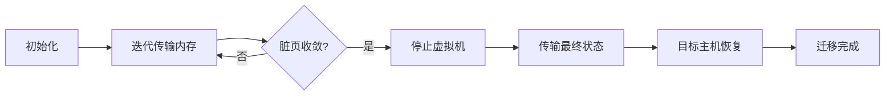

# 第2章 虚拟化技术 — 综合练习题

> [!info] 题型说明
> 本习题集共 **33 题**,包含多种题型,建议用时 120 分钟完成。
> - 单选题(12 题)
> - 多选题(6 题)
> - 判断题(5 题)
> - 简答题(4 题)
> - 计算题(4 题)
> - 实操题(2 题)

---

## 一、单项选择题(每题 3 分,共 36 分)

### 第 1 题

以下哪项不属于虚拟化技术的核心优势?

A. 资源利用率提升
B. 硬件成本降低
C. 应用性能提升
D. 快速部署能力

<details>
<summary>查看答案与解析</summary>

**答案：C**

**解析**：虚拟化技术通过资源池化和隔离,提升了资源利用率(A),减少了硬件采购需求(B),并支持快速部署(D)。但虚拟化引入了Hypervisor层,会带来一定性能损耗(通常5-15%),不会直接提升应用性能。应用性能主要取决于应用本身的优化和底层硬件性能。

</details>

---

### 第 2 题

Type 1 Hypervisor 与 Type 2 Hypervisor 的本质区别是?

A. Type 1 性能更高
B. Type 1 直接运行在裸机上
C. Type 2 不支持硬件辅助虚拟化
D. Type 2 只能运行一个虚拟机

<details>
<summary>查看答案与解析</summary>

**答案：B**

**解析**：
- A 错误：Type 1 通常性能更高,但非本质区别
- B 正确：Type 1(裸机型)直接运行在物理硬件上,无需宿主操作系统;Type 2(托管型)运行在宿主操作系统之上
- C 错误：Type 2 同样支持硬件辅助虚拟化(Intel VT-x/AMD-V)
- D 错误：Type 2 可运行多个虚拟机(如 VMware Workstation)

</details>

---

### 第 3 题

KVM 在 Linux 系统中的角色是?

A. 独立的 Type 2 Hypervisor
B. 将 Linux 内核转化为 Type 1 Hypervisor 的内核模块
C. 用户态的虚拟化管理工具
D. 硬件虚拟化扩展指令集

<details>
<summary>查看答案与解析</summary>

**答案：B**

**解析**：KVM(Kernel-based Virtual Machine)是 Linux 内核模块,加载后使 Linux 内核变为 Hypervisor,虚拟机作为普通 Linux 进程运行。KVM 属于 Type 1 Hypervisor(裸机型),因为它直接访问硬件。用户态管理工具是 qemu-kvm 或 libvirt。

</details>

---

### 第 4 题

CPU 虚拟化中,敏感指令的处理方式是?

A. 直接在虚拟机中执行
B. 通过二进制翻译转换为非敏感指令
C. 由 Hypervisor 陷入处理
D. 忽略这些指令

<details>
<summary>查看答案与解析</summary>

**答案：C**

**解析**：敏感指令(如修改页表基址寄存器)会改变系统全局状态,必须由 Hypervisor 介入处理。x86 架构引入硬件辅助虚拟化(Intel VT-x/AMD-V)后,敏感指令触发 VM Exit,从虚拟机态切换到 Hypervisor 态处理,处理完成后再通过 VM Entry 返回虚拟机。

</details>

---

### 第 5 题

内存虚拟化的三级地址转换不包括以下哪一项?

A. 虚拟机物理地址(GPA)
B. 宿主机虚拟地址(HVA)
C. 宿主机物理地址(HPA)
D. 客户机虚拟地址(GVA)

<details>
<summary>查看答案与解析</summary>

**答案：B**

**解析**：内存虚拟化的三级地址转换为：GVA(客户机虚拟地址) → GPA(虚拟机物理地址) → HPA(宿主机物理地址)。HVA(宿主机虚拟地址)是宿主机进程的虚拟地址空间,不在虚拟机内存地址转换链路中。现代硬件通过 EPT(Extended Page Table)实现 GPA→HPA 的硬件自动转换。

</details>

---

### 第 6 题

I/O 虚拟化的三种模式中,性能最高的是?

A. 全虚拟化(Full Virtualization)
B. 半虚拟化(Para-Virtualization)
C. 硬件直通(Passthrough)
D. 模拟 I/O

<details>
<summary>查看答案与解析</summary>

**答案：C**

**解析**：硬件直通(Passthrough)让虚拟机直接访问物理设备,性能接近裸机,是三种模式中性能最高的。全虚拟化需要 Hypervisor 介入,性能损耗较大;半虚拟化需修改虚拟机内核,性能优于全虚拟化但低于硬件直通。

</details>

---

### 第 7 题

SR-IOV 技术的主要作用是?

A. 提升网络吞吐量
B. 将单个物理网卡虚拟化为多个虚拟功能(VF)
C. 加密网络流量
D. 实现跨主机网络通信

<details>
<summary>查看答案与解析</summary>

**答案：B**

**解析**：SR-IOV(Single Root I/O Virtualization)是一种硬件虚拟化技术,将单个物理网卡虚拟化为多个虚拟功能(VF),每个 VF 可直接分配给虚拟机,实现接近原生性能的网络 I/O,同时避免硬件直通的资源独占问题。

</details>

---

### 第 8 题

虚拟机热迁移(Live Migration)过程中,内存页的迁移顺序通常是?

A. 随机选择
B. 脏页优先
C. 从低地址到高地址
D. 先迁移所有内存页,再迁移脏页

<details>
<summary>查看答案与解析</summary>

**答案：B**

**解析**：热迁移采用迭代预拷贝策略：第一轮传输所有内存页,后续轮次传输脏页(迁移过程中被修改的页)。脏页数量会逐渐收敛,当脏页数量低于阈值或达到最大迭代次数时,停止虚拟机,传输最后的脏页状态。脏页优先可减少停机时间。

</details>

---

### 第 9 题

以下哪种场景不适合使用虚拟机热迁移?

A. 负载均衡
B. 硬件维护
C. 内存密集型写操作应用
D. 节能调度

<details>
<summary>查看答案与解析</summary>

**答案：C**

**解析**：内存密集型写操作应用会产生大量脏页,热迁移过程中脏页无法收敛,导致迁移时间过长甚至失败。热迁移适用于负载均衡(A)、硬件维护(B)、节能调度(D)等场景。对于高频写入应用,建议停机迁移或使用容器化部署。

</details>

---

### 第 10 题

Intel VT-x 技术中,VMCS(虚拟机控制结构)的作用是?

A. 存储虚拟机磁盘镜像
B. 保存虚拟机的状态信息
C. 管理虚拟网络配置
D. 实现虚拟机快照

<details>
<summary>查看答案与解析</summary>

**答案：B**

**解析**：VMCS(Virtual Machine Control Structure)是 Intel VT-x 技术的核心数据结构,用于保存虚拟机的状态信息(寄存器状态、控制字段等),支持 VM Entry 和 VM Exit 的状态切换。每个虚拟机对应一个 VMCS。

</details>

---

### 第 11 题

以下哪项不是半虚拟化的特征?

A. 需要修改虚拟机内核
B. 性能优于全虚拟化
C. 无需硬件虚拟化支持
D. 虚拟机可运行未修改的操作系统

<details>
<summary>查看答案与解析</summary>

**答案：D**

**解析**：半虚拟化(Para-Virtualization)需要修改虚拟机操作系统内核,使其主动调用 Hypervisor 接口,无法运行未修改的操作系统(D 错误)。半虚拟化性能优于全虚拟化(B),且不依赖硬件虚拟化支持(C)。典型代表是 Xen Hypervisor。

</details>

---

### 第 12 题

KVM 与 QEMU 的关系是?

A. KVM 是 QEMU 的子项目
B. QEMU 是 KVM 的管理工具
C. KVM 提供内核态虚拟化,QEMU 提供用户态设备模拟
D. 两者是竞争关系

<details>
<summary>查看答案与解析</summary>

**答案：C**

**解析**：KVM 是 Linux 内核模块,提供 CPU 和内存的硬件虚拟化;QEMU 是用户态模拟器,提供设备模拟(I/O、网卡、磁盘等)。KVM 与 QEMU 结合形成完整的虚拟化解决方案：KVM 处理 CPU/内存虚拟化,QEMU 处理 I/O 设备模拟,通过 `/dev/kvm` 接口通信。

</details>

---

## 二、多项选择题(每题 4 分,共 24 分)

### 第 13 题

以下哪些是 Type 1 Hypervisor 的代表产品?(多选)

A. VMware ESXi
B. VMware Workstation
C. Citrix XenServer
D. Microsoft Hyper-V
E. Oracle VirtualBox

<details>
<summary>查看答案与解析</summary>

**答案：A、C、D**

**解析**：
- A 正确：VMware ESXi 是裸机型 Hypervisor
- B 错误：VMware Workstation 是托管型(Type 2)
- C 正确：XenServer(现名 Citrix Hypervisor)是裸机型
- D 正确：Hyper-V 虽然运行在 Windows 之上,但架构上是 Type 1(微内核架构)
- E 错误：VirtualBox 是托管型(Type 2)

</details>

---

### 第 14 题

硬件辅助虚拟化技术包括?(多选)

A. Intel VT-x / AMD-V
B. Intel EPT / AMD NPT
C. Intel VT-d / AMD-Vi
D. Intel VT-c
E. SR-IOV

<details>
<summary>查看答案与解析</summary>

**答案：A、B、C、D、E**

**解析**：
- A 正确：CPU 虚拟化扩展,支持 VM Entry/VM Exit
- B 正确：内存虚拟化扩展(嵌套页表),加速 GPA→HPA 转换
- C 正确：I/O 虚拟化扩展,支持 DMA 重映射和中断重映射
- D 正确：网络虚拟化扩展,支持虚拟机直接访问网卡
- E 正确：SR-IOV 是 I/O 虚拟化的硬件标准

</details>

---

### 第 15 题

内存虚拟化面临的技术挑战包括?(多选)

A. 内存超配(Overcommit)
B. 地址翻译开销
C. 内存一致性
D. 内存碎片管理
E. 内存加密

<details>
<summary>查看答案与解析</summary>

**答案：A、B、D**

**解析**：
- A 正确：虚拟机物理内存总和可能超过宿主机物理内存,需要内存超配技术(KSM、气球驱动)
- B 正确：三级地址翻译带来性能开销,EPT/NPT 硬件加速解决
- C 错误：内存一致性由硬件缓存一致性协议保证,不是虚拟化特有挑战
- D 正确：虚拟机内存分配需要考虑碎片问题
- E 错误：内存加密是安全需求,不是虚拟化技术挑战

</details>

---

### 第 16 题

虚拟机热迁移的前提条件包括?(多选)

A. 源主机和目标主机 CPU 特性兼容
B. 两主机网络连通
C. 两主机存储共享(或使用共享存储)
D. 目标主机有足够资源
E. 虚拟机必须处于暂停状态

<details>
<summary>查看答案与解析</summary>

**答案：A、B、C、D**

**解析**：
- A 正确：CPU 特性必须兼容,否则虚拟机无法在目标主机恢复
- B 正确：需要网络传输内存状态
- C 正确：虚拟机磁盘镜像需在共享存储上,否则需要存储迁移
- D 正确：目标主机需有足够 CPU、内存资源
- E 错误：热迁移(Live Migration)过程中虚拟机保持运行状态

</details>

---

### 第 17 题

KVM 的核心组件包括?(多选)

A. kvm.ko 内核模块
B. qemu-kvm 用户态进程
C. libvirt 管理库
D. virsh 命令行工具
E. virt-manager 图形界面

<details>
<summary>查看答案与解析</summary>

**答案：A、B**

**解析**：
- A 正确：kvm.ko 是 KVM 核心内核模块,提供 CPU 虚拟化
- B 正确：qemu-kvm 是用户态进程,提供设备模拟
- C、D、E 是管理工具,不是 KVM 核心组件

</details>

---

### 第 18 题

全虚拟化与半虚拟化的对比中,正确的说法有?(多选)

A. 全虚拟化无需修改虚拟机操作系统
B. 半虚拟化性能优于全虚拟化
C. 全虚拟化依赖硬件虚拟化支持
D. 半虚拟化支持热迁移
E. 全虚拟化支持更广泛的操作系统

<details>
<summary>查看答案与解析</summary>

**答案：A、B、E**

**解析**：
- A 正确：全虚拟化可运行未修改的操作系统
- B 正确：半虚拟化减少陷入次数,性能更优
- C 错误：全虚拟化可不依赖硬件虚拟化(如二进制翻译),但性能较低
- D 错误：全虚拟化和半虚拟化都支持热迁移
- E 正确：全虚拟化无需修改操作系统,兼容性更好

</details>

---

## 三、判断题(每题 2 分,共 10 分)

### 第 19 题

虚拟化技术可以在同一台物理服务器上运行多个不同操作系统的虚拟机,实现操作系统级别的隔离。

<details>
<summary>查看答案与解析</summary>

**答案：正确**

**解析**：虚拟化技术通过 Hypervisor 提供硬件级别的隔离,每个虚拟机拥有独立的操作系统、文件系统和进程空间,可以在同一台物理服务器上运行 Windows、Linux 等不同操作系统。

</details>

---

### 第 20 题

Type 2 Hypervisor 的性能一定低于 Type 1 Hypervisor。

<details>
<summary>查看答案与解析</summary>

**答案：错误**

**解析**：Type 2 Hypervisor 运行在宿主操作系统之上,理论上存在额外开销。但现代 Type 2 Hypervisor(如 VMware Workstation)配合硬件虚拟化技术,性能损耗可控制在较小范围。Type 1 Hypervisor 在企业生产环境中性能优势更明显,但不能绝对地说 Type 2 一定低于 Type 1。

</details>

---

### 第 21 题

内存虚拟化中的 KSM(Kernel Same-page Merging)技术通过合并相同的内存页来节省物理内存。

<details>
<summary>查看答案与解析</summary>

**答案：正确**

**解析**：KSM 是 Linux 内核特性,用于内存虚拟化的内存超配场景。它扫描虚拟机的内存页,找出内容相同的页面并合并为单个物理页,多个虚拟机共享该页,从而节省物理内存。KSM 适用于运行多个相同操作系统虚拟机的场景。

</details>

---

### 第 22 题

虚拟机热迁移过程中,内存脏页速率越低,迁移成功率越高。

<details>
<summary>查看答案与解析</summary>

**答案：正确**

**解析**：热迁移采用迭代预拷贝策略,每轮传输脏页。脏页速率越低,脏页收敛越快,停机时间越短,迁移成功率越高。如果脏页速率持续高于网络传输速率,脏页无法收敛,会导致迁移失败。

</details>

---

### 第 23 题

SR-IOV 技术可以让虚拟机直接访问物理网卡,但无法实现虚拟机间的网络隔离。

<details>
<summary>查看答案与解析</summary>

**答案：错误**

**解析**：SR-IOV 将物理网卡虚拟化为多个 VF(Virtual Function),每个 VF 可分配给不同的虚拟机,VF 之间通过硬件实现隔离,仍然保持网络隔离特性。

</details>

---

## 四、简答题(每题 6 分,共 24 分)

### 第 24 题

简述 Type 1 Hypervisor 与 Type 2 Hypervisor 的架构差异,并各举一个实例说明其适用场景。

<details>
<summary>查看参考答案</summary>

**架构差异**：

| 对比维度 | Type 1 Hypervisor(裸机型) | Type 2 Hypervisor(托管型) |
|---------|--------------------------|--------------------------|
| 运行位置 | 直接运行在物理硬件上 | 运行在宿主操作系统之上 |
| 系统层级 | Hypervisor → 硬件 | 宿主OS → Hypervisor → 硬件 |
| 性能损耗 | 较低(无宿主OS开销) | 较高(宿主OS层额外开销) |
| 管理方式 | 专用管理接口 | 通过宿主OS管理 |
| 资源调度 | Hypervisor 直接调度 | 宿主OS调度后由 Hypervisor 调度 |

**Type 1 实例与适用场景**：
- 实例：VMware ESXi、Citrix XenServer、Microsoft Hyper-V
- 适用场景：企业数据中心、生产环境、云计算平台,对性能和稳定性要求高的场景

**Type 2 实例与适用场景**：
- 实例：VMware Workstation、Oracle VirtualBox、Parallels Desktop
- 适用场景：开发测试环境、个人桌面虚拟化、学习和实验,对资源隔离和性能要求不高的场景

</details>

---

### 第 25 题

解释内存虚拟化的三级地址转换(GVA → GPA → HPA)过程,并说明 EPT 技术如何优化这一过程。

<details>
<summary>查看参考答案</summary>

**三级地址转换过程**：

1. **GVA → GPA(客户机虚拟地址 → 虚拟机物理地址)**：
   - 虚拟机操作系统维护自己的页表(客户机页表)
   - 虚拟机 CPU 使用客户机页表将虚拟地址转换为虚拟机物理地址
   - 这一级转换对虚拟机透明,与裸机行为相同

2. **GPA → HPA(虚拟机物理地址 → 宿主机物理地址)**：
   - Hypervisor 维护虚拟机物理地址到宿主机物理地址的映射
   - 传统软件实现需要 Hypervisor 介入,性能开销大
   - 现代硬件通过 EPT/NPT 自动完成

**EPT(Extended Page Table)优化**：

EPT 是 Intel 的硬件内存虚拟化技术(AMD 对应技术为 NPT),通过硬件加速 GPA → HPA 的转换：

- 在硬件层面建立 EPT 表,存储 GPA 到 HPA 的映射
- CPU 使用两级页表：第一级为客户机页表(GVA → GPA),第二级为 EPT(GPA → HPA)
- 地址转换由硬件自动完成,无需 Hypervisor 陷入
- 将内存虚拟化性能损耗从 30-40% 降低到 5-10%

</details>

---

### 第 26 题

简述虚拟机热迁移的基本流程,并说明预拷贝(Pre-copy)与后拷贝(Post-copy)策略的区别。

<details>
<summary>查看参考答案</summary>

**热迁移基本流程**：



1. **初始化阶段**：在目标主机创建虚拟机,建立网络连接
2. **迭代传输阶段**：多轮传输内存页,每轮传输脏页
3. **停机切换阶段**：短暂停止虚拟机,传输最终状态(寄存器、最后脏页)
4. **恢复阶段**：目标主机恢复虚拟机运行
5. **清理阶段**：源主机删除虚拟机

**预拷贝与后拷贝对比**：

| 对比维度 | 预拷贝(Pre-copy) | 后拷贝(Post-copy) |
|---------|-----------------|------------------|
| 内存传输顺序 | 先传输所有页,再传输脏页 | 只传输最小页集,启动后在目标主机按需拉取 |
| 停机时间 | 较短(只传输最后脏页) | 较长(等待按需拉取缺失页) |
| 总迁移时间 | 较长(迭代传输) | 较短(只传输必要页) |
| 失败风险 | 较低(源主机虚拟机仍可用) | 较高(目标主机虚拟机缺页无法恢复) |
| 适用场景 | 内存写频率较低的应用 | 内存大、网络带宽高的场景 |

预拷贝是主流方案,后拷贝适用于特定场景(如大内存虚拟机)。

</details>

---

### 第 27 题

对比全虚拟化、半虚拟化和硬件辅助虚拟化三种 I/O 虚拟化方式的原理与性能差异。

<details>
<summary>查看参考答案</summary>

**三种 I/O 虚拟化方式对比**：

| 对比维度 | 全虚拟化 | 半虚拟化 | 硬件辅助虚拟化 |
|---------|---------|---------|---------------|
| **原理** | Hypervisor 模拟设备,虚拟机使用标准驱动 | 虚拟机使用定制驱动,直接调用 Hypervisor 接口 | 虚拟机直接访问物理设备(直通或 SR-IOV) |
| **驱动要求** | 使用标准操作系统驱动 | 需要修改虚拟机内核,安装半虚拟化驱动 | 需要硬件支持(SR-IOV、VT-d) |
| **陷入次数** | 每次I/O操作都陷入 Hypervisor | 每次I/O操作都陷入 Hypervisor,但开销更小 | 直接访问硬件,陷入次数极少 |
| **性能** | 较低(大量陷入开销) | 中等(优化陷入路径) | 最高(接近裸机性能) |
| **兼容性** | 最高(无需修改操作系统) | 中等(需修改内核) | 较低(依赖硬件特性) |
| **资源隔离** | 由 Hypervisor 保证 | 由 Hypervisor 保证 | 硬件级隔离(SR-IOV) |
| **适用场景** | 兼容性要求高的场景 | 性能与兼容性平衡的场景 | 高性能网络/存储应用 |

**性能排序**：硬件辅助虚拟化 > 半虚拟化 > 全虚拟化

**实际应用**：
- 全虚拟化：开发测试环境、遗留应用迁移
- 半虚拟化：生产环境虚拟机(如 Virtio 驱动)
- 硬件辅助虚拟化：高性能网络应用(VPN、防火墙)、存储密集型应用

</details>

---

## 五、计算题(每题 8 分,共 32 分)

### 第 28 题：虚拟化资源规划

某企业计划虚拟化整合现有 50 台物理服务器,每台物理服务器平均资源使用率为:
- CPU: 4 核,平均使用率 15%
- 内存: 16 GB,平均使用率 40%
- 存储: 500 GB

企业计划采购新的虚拟化服务器,每台服务器配置为:
- CPU: 32 核
- 内存: 256 GB
- 存储: 10 TB(使用共享存储)

假设虚拟化开销为 15%,内存超配比例为 1.5:1,请计算:

1. 至少需要采购多少台虚拟化服务器?
2. 如果每台物理服务器可虚拟化为 8 个虚拟机,总共需要创建多少个虚拟机?
3. 整合后的 CPU 资源利用率提升了多少倍?

<details>
<summary>查看参考答案</summary>

**1. 计算所需服务器数量**

**CPU 资源需求**：
- 原服务器总 CPU 核数: 50 × 4 = 200 核
- 实际使用 CPU 资源: 200 × 15% = 30 核
- 考虑虚拟化开销: 30 ÷ (1 - 15%) = 35.3 核
- 新服务器 CPU 核数: 32 核
- 需要 CPU 服务器数: 35.3 ÷ 32 = **1.1 台** → 向上取整为 2 台

**内存资源需求**：
- 原服务器总内存: 50 × 16 = 800 GB
- 实际使用内存: 800 × 40% = 320 GB
- 内存超配后实际需求: 320 ÷ 1.5 = 213.3 GB
- 考虑虚拟化开销: 213.3 ÷ (1 - 15%) = 251 核 GB
- 新服务器内存: 256 GB
- 需要内存服务器数: 251 ÷ 256 = **0.98 台** → 向上取整为 1 台

**存储资源需求**：
- 总存储需求: 50 × 500 = 25,000 GB = 25 TB
- 新服务器存储: 10 TB
- 需要存储服务器数: 25 ÷ 10 = **2.5 台** → 向上取整为 3 台

**结论**: 取最大值,CPU 和存储都是瓶颈,**至少需要采购 3 台虚拟化服务器**(建议 4 台以提供冗余)。

**2. 计算虚拟机数量**

- 每台物理服务器虚拟化为 8 个虚拟机
- 总虚拟机数: 50 × 8 = **400 个虚拟机**

**3. 计算CPU资源利用率提升**

- 原服务器总 CPU 核数: 200 核
- 整合后使用 CPU 核数: 3 × 32 = 96 核
- 原利用率: 15%
- 整合后利用率: 35.3 ÷ 96 × 100% = 36.8%
- 利用率提升倍数: 36.8% ÷ 15% = **2.45 倍**

**或从物理服务器减少角度**:
- 从 50 台减少到 3 台,服务器数量减少到原来的 6%
- 资源利用率提升倍数: 50 ÷ 3 ≈ **16.7 倍**(从服务器数量角度)

</details>

---

### 第 29 题：热迁移时间计算

某虚拟机配置为 32 GB 内存,运行的应用在迁移过程中内存脏页速率为 500 MB/s,网络传输带宽为 1 Gbps。热迁移策略为:
- 每轮传输所有脏页
- 最大迭代次数: 30 轮
- 停机阈值: 脏页数据量 < 50 MB

请计算:

1. 第一轮传输需要多长时间?
2. 假设脏页速率恒定,热迁移是否会成功?若成功,需要多少轮迭代?
3. 若要成功迁移,网络带宽至少需要多少?

<details>
<summary>查看参考答案</summary>

**1. 第一轮传输时间**

- 第一轮传输数据量: 32 GB = 32 × 1024 = 32,768 MB
- 网络传输速率: 1 Gbps = 1,000 Mbps = 125 MB/s
- 第一轮传输时间: 32,768 ÷ 125 = **262.14 秒 ≈ 4.37 分钟**

**2. 判断迁移是否成功**

每轮迁移过程中,新产生的脏页量为:
- 每轮时间: 传输上一轮脏页的时间
- 第一轮产生脏页: 262.14 秒 × 500 MB/s = 131,070 MB >> 32 GB

由于脏页产生速率(500 MB/s)远大于网络传输速率(125 MB/s),脏页无法收敛,每轮结束后脏页量反而增加,**迁移会失败**。

**数学验证**:
设第 n 轮脏页量为 D_n,传输时间为 T_n:
- T_n = D_n ÷ 125
- D_{n+1} = T_n × 500 = D_n × 500 ÷ 125 = D_n × 4

脏页量每轮增加 4 倍,无法收敛。

**3. 计算最小网络带宽**

要成功迁移,需满足: 网络传输速率 > 脏页产生速率

设网络带宽为 B MB/s,脏页速率为 D = 500 MB/s,则:
- 每轮传输时间: T = 脏页量 ÷ B
- 新产生脏页: T × D = 脏页量 × D ÷ B
- 收敛条件: 新产生脏页 < 原脏页量
- 即: D ÷ B < 1
- B > D = **500 MB/s**

换算为带宽: 500 MB/s × 8 = 4,000 Mbps = **4 Gbps**

因此,网络带宽至少需要 **4 Gbps** 才能保证迁移成功。

</details>

---

### 第 30 题：内存超配计算

某虚拟化主机配置为 128 GB 物理内存,运行 10 个虚拟机,每个虚拟机配置为 16 GB 内存。假设:
- 虚拟机实际内存使用率平均为 40%
- KSM 内存合并率为 20%
- 保留内存为物理内存的 10%

请计算:

1. 内存超配比例是多少?
2. 是否存在内存压力?若有,超出的内存量为多少?
3. 若内存压力过大,可采取哪些措施?

<details>
<summary>查看参考答案</summary>

**1. 计算内存超配比例**

- 虚拟机配置内存总和: 10 × 16 = 160 GB
- 物理内存: 128 GB
- 内存超配比例: 160 ÷ 128 = **1.25:1**

**2. 判断内存压力**

**实际内存需求计算**:
- 虚拟机实际使用内存: 160 × 40% = 64 GB
- KSM 合并节省内存: 64 × 20% = 12.8 GB
- 实际物理内存需求: 64 - 12.8 = 51.2 GB

**可用物理内存**:
- 总物理内存: 128 GB
- 保留内存: 128 × 10% = 12.8 GB
- 可用内存: 128 - 12.8 = 115.2 GB

**内存压力判断**:
- 实际需求(51.2 GB) < 可用内存(115.2 GB)
- **不存在内存压力**,内存使用率为: 51.2 ÷ 115.2 = 44.4%

**3. 内存压力过大时的措施**:
1. 启用内存气球驱动(Balloon Driver):动态回收虚拟机空闲内存
2. 启用 KSM:合并相同内存页,节省物理内存
3. 内存交换(Swapping):将虚拟机内存交换到磁盘(性能损耗大)
4. 减少虚拟机内存配置:根据实际需求调整
5. 增加物理内存:扩展主机内存容量
6. 虚拟机迁移:将部分虚拟机迁移到其他主机

</details>

---

### 第 31 题：虚拟化性能损耗分析

某数据库应用在裸机上运行时,磁盘 I/O 吞吐量为 800 MB/s,响应时间为 5 ms。部署到虚拟机后:

**全虚拟化模式**:
- 磁盘 I/O 吞吐量: 600 MB/s
- 响应时间: 7 ms

**半虚拟化模式(使用 Virtio 驱动)**:
- 磁盘 I/O 吞吐量: 720 MB/s
- 响应时间: 5.5 ms

**硬件直通模式(SR-IOV)**:
- 磁盘 I/O 吞吐量: 780 MB/s
- 响应时间: 5.1 ms

请计算:

1. 三种虚拟化模式的性能损耗百分比(以吞吐量为基准)
2. 若应用要求磁盘 I/O 响应时间不超过 6 ms,哪种模式满足要求?
3. 若考虑资源隔离需求,推荐哪种模式?

<details>
<summary>查看参考答案</summary>

**1. 计算性能损耗百分比**

以吞吐量为基准:

- **全虚拟化**: (800 - 600) ÷ 800 × 100% = **25%**
- **半虚拟化**: (800 - 720) ÷ 800 × 100% = **10%**
- **硬件直通**: (800 - 780) ÷ 800 × 100% = **2.5%**

**2. 判断响应时间是否满足要求**

应用要求: 响应时间 ≤ 6 ms

- 全虚拟化: 7 ms > 6 ms,**不满足要求**
- 半虚拟化: 5.5 ms < 6 ms,**满足要求**
- 硬件直通: 5.1 ms < 6 ms,**满足要求**

**3. 推荐模式**

综合考虑性能和资源隔离:

- **半虚拟化(推荐)**:
  - 性能损耗适中(10%),满足响应时间要求
  - 资源隔离由 Hypervisor 保证,灵活性高
  - 支持虚拟机热迁移
  - 适用于大多数生产环境

- **硬件直通**:
  - 性能最优(损耗 2.5%),满足响应时间要求
  - 但 SR-IOV 的 VF 独占物理设备,灵活性较低
  - 热迁移受限(需硬件支持)
  - 适用于高性能专用场景(如网络功能虚拟化)

**结论**: 若需平衡性能与灵活性,推荐半虚拟化;若性能优先级最高,推荐硬件直通。

</details>

---

## 六、实操题(每题 8 分,共 16 分)

### 第 32 题：KVM 虚拟机管理

使用 libvirt 工具完成以下任务:

1. 创建一个名为 "test-vm" 的虚拟机,配置为:
   - 内存: 4 GB
   - vCPU: 2 核
   - 磁盘: 20 GB qcow2 格式镜像
   - 网络: 桥接网络 br0
   - 操作系统: CentOS 7

2. 启动虚拟机并查看其状态

3. 执行虚拟机热迁移到另一台主机 "192.168.1.100"

请写出相应的命令(假设已安装 libvirt、qemu-kvm)。

<details>
<summary>查看参考答案</summary>

**1. 创建虚拟机**

```bash
# 创建磁盘镜像
qemu-img create -f qcow2 /var/lib/libvirt/images/test-vm.qcow2 20G

# 创建虚拟机(使用 virt-install)
virt-install \
  --name test-vm \
  --memory 4096 \
  --vcpus 2 \
  --disk path=/var/lib/libvirt/images/test-vm.qcow2,format=qcow2,size=20 \
  --network bridge=br0 \
  --os-variant centos7 \
  --cdrom /path/to/CentOS-7-x86_64-Minimal.iso \
  --graphics vnc,listen=0.0.0.0 \
  --noautoconsole
```

**2. 启动虚拟机并查看状态**

```bash
# 启动虚拟机
virsh start test-vm

# 查看虚拟机状态
virsh list --all

# 查看虚拟机详细信息
virsh dominfo test-vm

# 查看虚拟机控制台(可通过 VNC 连接)
virsh vncdisplay test-vm
```

**3. 执行热迁移**

**前提条件**:
- 两台主机间配置无密码 SSH 登录
- 两台主机共享存储或已配置存储迁移
- 两台主机 libvirt 信任关系已配置

```bash
# 迁移到目标主机
virsh migrate test-vm qemu+ssh://192.168.1.100/system \
  --live \
  --persistent \
  --undefinesource \
  --copy-storage-all

# 参数说明:
# --live: 热迁移
# --persistent: 在目标主机持久化配置
# --undefinesource: 源主机删除虚拟机配置
# --copy-storage-all: 复制所有存储(非共享存储场景)
```

**验证迁移结果**:

```bash
# 在源主机查看(应无 test-vm)
virsh list --all

# 在目标主机查看(应有 test-vm 且状态为 running)
virsh list --all
```

</details>

---

### 第 33 题：虚拟机性能监控与调优

某虚拟机运行 MySQL 数据库,性能监控显示 CPU 使用率高、磁盘 I/O 等待时间长。请完成以下任务:

1. 使用 `virt-top` 或 `virsh` 命令监控虚拟机性能指标
2. 使用 `virt-xml` 调整虚拟机配置:
   - CPU 模式设置为 "host-passthrough"(性能优先)
   - 增加 vCPU 数量从 2 核到 4 核
   - 启用磁盘 I/O 多队列
3. 验证配置生效

请写出相应的命令。

<details>
<summary>查看参考答案</summary>

**1. 监控虚拟机性能**

```bash
# 使用 virt-top 实时监控
virt-top

# 使用 virsh 查看虚拟机 CPU 使用率
virsh domcpustats mysql-vm

# 查看虚拟机内存使用情况
virsh dommemstat mysql-vm

# 查看虚拟机块设备统计(磁盘 I/O)
virsh domblkstat mysql-vm

# 查看虚拟机网络统计
virsh domifstat mysql-vm
```

**2. 调整虚拟机配置**

```bash
# 查看当前配置
virsh dumpxml mysql-vm

# CPU 模式设置为 host-passthrough
# 编辑虚拟机配置(需先关闭虚拟机)
virsh shutdown mysql-vm

# 使用 virt-xml 修改配置(假设虚拟机已停止)
# 设置 CPU 模式为 host-passthrough
virt-xml mysql-vm --edit --cpu mode=host-passthrough

# 增加 vCPU 数量从 2 核到 4 核
virt-xml mysql-vm --edit --vcpus 4

# 启用磁盘 I/O 多队列(需要磁盘驱动支持)
# 修改磁盘配置,添加队列数
virt-xml mysql-vm --edit --disk target=vda,iothread=1

# 或者直接编辑 XML 配置
virsh edit mysql-vm
```

**手动编辑 XML 配置示例**:

```xml
<!-- CPU 配置 -->
<cpu mode='host-passthrough' check='none'/>

<!-- vCPU 数量 -->
<vcpu placement='auto'>4</vcpu>

<!-- 磁盘多队列配置 -->
<disk type='file' device='disk'>
  <driver name='qemu' type='qcow2' queues='4'/>
  <source file='/var/lib/libvirt/images/mysql-vm.qcow2'/>
  <target dev='vda' bus='virtio'/>
  <address type='pci' domain='0x0000' bus='0x00' slot='0x04' function='0x0'/>
</disk>
```

**3. 验证配置生效**

```bash
# 启动虚拟机
virsh start mysql-vm

# 验证 CPU 模式
virsh dumpxml mysql-vm | grep "cpu mode"

# 验证 vCPU 数量
virsh vcpucount mysql-vm

# 验证磁盘队列配置
virsh dumpxml mysql-vm | grep -A 5 "disk"

# 进入虚拟机验证 CPU 信息
virsh console mysql-vm
# 在虚拟机内执行:
lscpu
cat /proc/cpuinfo
```

**性能调优建议**:

1. **CPU 调优**:
   - 使用 `host-passthrough` 模式,性能接近裸机
   - 确保 vCPU 数量不超过物理 CPU 核数
   - 绑定 vCPU 到物理 CPU(避免跨 NUMA 节点)

2. **磁盘 I/O 调优**:
   - 使用 Virtio 驱动(半虚拟化)
   - 启用磁盘多队列(提升并发性能)
   - 使用 SSD 或高性能存储
   - 考虑使用 `cache='none'` 模式(数据库场景)

3. **内存调优**:
   - 启用大页内存(Huge Pages)
   - 禁用 KSM(数据库场景性能敏感)
   - 绑定虚拟机到单一 NUMA 节点

</details>

---

## 附录：章节知识点速查表

| 考点 | 重要程度 | 关联题目 |
|-----|---------|---------|
| Hypervisor 类型(Type1/Type2) | ⭐⭐⭐⭐⭐ | 2, 13, 19, 24 |
| KVM 架构与组件 | ⭐⭐⭐⭐⭐ | 3, 12, 17, 32 |
| CPU 虚拟化 | ⭐⭐⭐⭐ | 4, 10, 11 |
| 内存虚拟化 | ⭐⭐⭐⭐⭐ | 5, 15, 21, 25, 30 |
| I/O 虚拟化 | ⭐⭐⭐⭐ | 6, 7, 14, 27, 31 |
| 热迁移 | ⭐⭐⭐⭐⭐ | 8, 9, 16, 22, 26, 29 |
| 虚拟化性能 | ⭐⭐⭐⭐ | 1, 20, 28, 31, 33 |
| 虚拟机管理实操 | ⭐⭐⭐⭐ | 32, 33 |