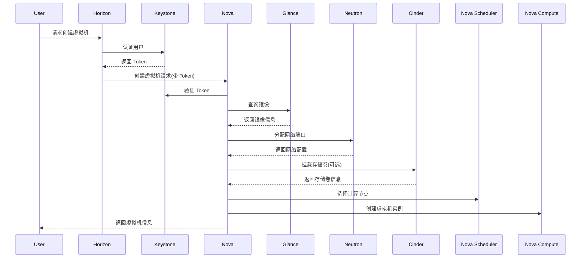
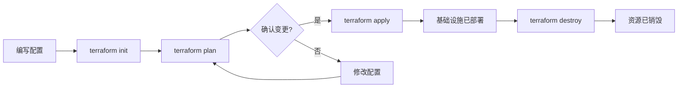
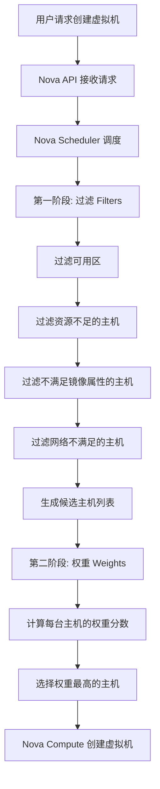

# 第4章 云架构与资源调度 — 综合练习题

> [!info] 题型说明
> 本习题集共 **32 题**,包含多种题型,建议用时 120 分钟完成。
> - 单选题(11 题)
> - 多选题(6 题)
> - 判断题(5 题)
> - 简答题(4 题)
> - 计算题(4 题)
> - 实操题(2 题)

---

## 一、单项选择题(每题 3 分,共 33 分)

### 第 1 题

OpenStack 中负责虚拟机生命周期管理的核心组件是?

A. Nova
B. Neutron
C. Cinder
D. Glance

<details>
<summary>查看答案与解析</summary>

**答案：A**

**解析**：
- **Nova(Compute)**：负责虚拟机生命周期管理(创建、调度、终止)
- Neutron(Network)：提供网络服务
- Cinder(Volume)：提供块存储服务
- Glance(Image)：提供镜像服务

</details>

---

### 第 2 题

以下哪种调度算法优先考虑资源利用率最大化?

A. 轮询调度(Round Robin)
B. 最少连接调度(Least Connections)
C. 装箱调度(Bin Packing)
D. 随机调度(Random)

<details>
<summary>查看答案与解析</summary>

**答案：C**

**解析**：
- **装箱调度(Bin Packing)**：将虚拟机调度到已利用率较高的主机,最大化资源利用率,节省服务器数量
- 轮询调度：依次分配,不考虑负载
- 最少连接调度：分配给连接数最少的主机,考虑负载均衡
- 随机调度：随机选择主机

</details>

---

### 第 3 题

Infrastructure as Code(IaC)的核心优势不包括?

A. 基础设施版本化管理
B. 减少人为配置错误
C. 降低云服务费用
D. 支持自动化部署

<details>
<summary>查看答案与解析</summary>

**答案：C**

**解析**：IaC 的核心优势包括：基础设施版本化管理(A)、减少人为错误(B)、支持自动化部署(D)、环境一致性、可重复性。IaC 本身不会降低云服务费用,费用取决于资源使用量。

</details>

---

### 第 4 题

Terraform 的状态文件(state file)的主要作用是?

A. 存储云服务凭证
B. 记录基础设施的实际状态与元数据
C. 缓存执行计划
D. 存储 Terraform 模块

<details>
<summary>查看答案与解析</summary>

**答案：B**

**解析**：Terraform 状态文件记录基础设施的实际状态(资源 ID、属性等),用于：
- 跟踪资源状态
- 检测配置漂移
- 支持增量更新
- 支持资源销毁

状态文件不存储凭证(凭证应使用变量或密钥管理),不缓存执行计划。

</details>

---

### 第 5 题

OpenStack Nova 调度器默认使用的调度算法是?

A. Filter Scheduler
B. Chance Scheduler
C. Weighted Scheduler
D. Bin Packing Scheduler

<details>
<summary>查看答案与解析</summary>

**答案：A**

**解析**：
- **Filter Scheduler**(过滤器调度器)：OpenStack Nova 默认调度器,通过过滤器和权重选择主机
- Chance Scheduler：随机调度(已弃用)
- Weighted Scheduler：权重调度(Filter Scheduler 的一部分)
- Bin Packing：装箱调度(需配置)

</details>

---

### 第 6 题

以下哪项不是资源调度算法的设计目标?

A. 负载均衡
B. 能耗优化
C. 网络延迟优化
D. 最大化硬件采购成本

<details>
<summary>查看答案与解析</summary>

**答案：D**

**解析**：资源调度算法的设计目标包括：
- 负载均衡(A)：避免单点过载
- 能耗优化(B)：低负载时关闭服务器,节省能耗
- 网络延迟优化(C)：将通信频繁的虚拟机调度到相近主机
- 资源利用率最大化：减少硬件采购成本(D 是反目标)

</details>

---

### 第 7 题

Terraform 中 `terraform plan` 命令的作用是?

A. 创建基础设施资源
B. 销毁基础设施资源
C. 预览基础设施变更
D. 验证配置文件语法

<details>
<summary>查看答案与解析</summary>

**答案：C**

**解析**：
- `terraform init`：初始化工作目录
- `terraform plan`：预览变更计划(不执行)
- `terraform apply`：执行变更计划
- `terraform destroy`：销毁资源
- `terraform validate`：验证配置语法

</details>

---

### 第 8 题

OpenStack 中负责块存储服务的组件是?

A. Nova
B. Neutron
C. Cinder
D. Swift

<details>
<summary>查看答案与解析</summary>

**答案：C**

**解析**：
- Nova：计算服务
- Neutron：网络服务
- **Cinder**：块存储服务(提供持久化存储卷)
- Swift：对象存储服务

</details>

---

### 第 9 题

以下哪种场景适合使用装箱调度(Bin Packing)算法?

A. 高性能计算集群
B. 需要最大化服务器利用率的数据中心
C. 对网络延迟敏感的应用
D. 多租户环境下的安全隔离

<details>
<summary>查看答案与解析</summary>

**答案：B**

**解析**：
- **装箱调度**：将虚拟机集中调度到少数主机,最大化利用率,适合需要节省服务器和能耗的数据中心(B)
- 高性能计算(A)：需要分散部署,避免资源竞争
- 网络延迟敏感应用(C)：需要考虑网络拓扑,使用亲和性调度
- 多租户隔离(D)：需要考虑安全隔离,不适合装箱调度

</details>

---

### 第 10 题

Terraform 的 Provider 是?

A. Terraform 核心二进制文件
B. 与云平台 API 交互的插件
C. Terraform 模块仓库
D. 状态文件存储后端

<details>
<summary>查看答案与解析</summary>

**答案：B**

**解析**：Provider 是 Terraform 插件,负责与云平台 API 交互(如 AWS Provider、Azure Provider、Kubernetes Provider)。Terraform Core 是核心二进制文件,Terraform Registry 是模块仓库,Backend 是状态文件存储后端。

</details>

---

### 第 11 题

OpenStack 中实现软件定义网络(SDN)的组件是?

A. Nova
B. Neutron
C. Cinder
D. Horizon

<details>
<summary>查看答案与解析</summary>

**答案：B**

**解析**：
- Nova：计算服务
- **Neutron**：网络服务,提供 SDN 能力(虚拟网络、路由器、防火墙、负载均衡等)
- Cinder：块存储服务
- Horizon：Web 控制面板

</details>

---

## 二、多项选择题(每题 4 分,共 24 分)

### 第 12 题

OpenStack 的核心组件包括?(多选)

A. Nova
B. Neutron
C. Cinder
D. Glance
E. Keystone

<details>
<summary>查看答案与解析</summary>

**答案：A、B、C、D、E**

**解析**：OpenStack 核心组件：
- **Nova**：计算服务
- **Neutron**：网络服务
- **Cinder**：块存储服务
- **Glance**：镜像服务
- **Keystone**：身份认证服务
- Swift：对象存储服务(可选)
- Horizon：Web 控制面板(可选)
- Heat：编排服务(可选)

</details>

---

### 第 13 题

资源调度算法的分类包括?(多选)

A. 静态调度
B. 动态调度
C. 集中式调度
D. 分布式调度
E. 手动调度

<details>
<summary>查看答案与解析</summary>

**答案：A、B、C、D**

**解析**：
- A 正确：静态调度在虚拟机启动时确定位置,运行期间不调整
- B 正确：动态调度根据负载实时调整虚拟机位置(热迁移)
- C 正确：集中式调度由中央调度器统一决策
- D 正确：分布式调度由各主机协作决策
- E 错误：手动调度不是算法分类

</details>

---

### 第 14 题

Terraform 的核心特性包括?(多选)

A. 声明式配置语言
B. 资源依赖管理
C. 变更计划预览
D. 多云支持
E. 自动化测试

<details>
<summary>查看答案与解析</summary>

**答案：A、B、C、D**

**解析**：
- A 正确：使用 HCL(HashiCorp Configuration Language)声明式配置
- B 正确：自动解析资源依赖关系
- C 正确：`terraform plan` 预览变更
- D 正确：支持 AWS、Azure、GCP、Kubernetes 等
- E 错误：自动化测试不是 Terraform 核心特性(可通过 `terraform test` 实现基础测试)

</details>

---

### 第 15 题

OpenStack Nova Filter Scheduler 的过滤器包括?(多选)

A. AvailabilityZoneFilter
B. RamFilter
C. ComputeFilter
D. ImagePropertiesFilter
E. NetworkFilter

<details>
<summary>查看答案与解析</summary>

**答案：A、B、C、D、E**

**解析**：Nova 过滤器：
- **AvailabilityZoneFilter**：过滤可用区
- **RamFilter**：过滤内存不足的主机
- **ComputeFilter**：过滤不满足计算需求的主机
- **ImagePropertiesFilter**：过滤不满足镜像属性的主机
- **NetworkFilter**：过滤网络不满足的主机

其他常用过滤器: CoreFilter(CPU)、DiskFilter(磁盘)

</details>

---

### 第 16 题

IaC(Infrastructure as Code)的工具包括?(多选)

A. Terraform
B. Ansible
C. CloudFormation
D. Pulumi
E. Kubernetes

<details>
<summary>查看答案与解析</summary>

**答案：A、B、C、D**

**解析**：
- A 正确：Terraform 是多云 IaC 工具
- B 正确：Ansible 支持配置管理和基础设施编排
- C 正确：CloudFormation 是 AWS 原生 IaC 工具
- D 正确：Pulumi 支持通用编程语言(Python、TypeScript、Go)
- E 错误：Kubernetes 是容器编排平台,不是 IaC 工具(但可通过 Terraform 管理)

</details>

---

### 第 17 题

OpenStack Neutron 支持的网络功能包括?(多选)

A. 虚拟网络(VLAN、VXLAN)
B. 路由器
C. 负载均衡器(Load Balancer)
D. 防火墙(Firewall)
E. VPN 网关

<details>
<summary>查看答案与解析</summary>

**答案：A、B、C、D、E**

**解析**：Neutron 提供完整的网络服务:
- **虚拟网络**: VLAN、VXLAN、GRE
- **路由器**: 虚拟路由器、NAT、浮动 IP
- **负载均衡器**: LBaaS(Load Balancer as a Service)
- **防火墙**: FWaaS(Firewall as a Service)
- **VPN 网关**: VPNaaS(VPN as a Service)

</details>

---

## 三、判断题(每题 2 分,共 10 分)

### 第 18 题

OpenStack 只能运行虚拟机,不支持容器编排。

<details>
<summary>查看答案与解析</summary>

**答案：错误**

**解析**：OpenStack 通过多个项目支持容器:
- **Kuryr**: 为 Kubernetes 提供 Neutron 网络集成
- **Zun**: 容器即服务(Container as a Service)
- **Nova**: 通过虚拟机运行容器
- OpenStack 也可与 Kubernetes 集成,提供混合编排能力

</details>

---

### 第 19 题

Terraform 的声明式配置意味着用户需要指定如何创建资源,而不是声明需要什么资源。

<details>
<summary>查看答案与解析</summary>

**答案：错误**

**解析**：Terraform 采用声明式配置,用户只需**声明需要什么资源**(最终状态),Terraform 自动计算如何达到该状态(创建、更新、删除)。与声明式相对的是命令式(Procedural),需要用户指定每个步骤。

</details>

---

### 第 20 题

装箱调度(Bin Packing)算法在低负载场景下可能导致资源碎片化。

<details>
<summary>查看答案与解析</summary>

**答案：错误**

**解析**：装箱调度将虚拟机集中调度到少数主机,最大化利用率。低负载时,装箱调度会关闭空闲服务器,反而减少碎片化。资源碎片化是**分散调度**(Spread Scheduling)的问题,因为虚拟机分散在不同主机,难以利用完整主机资源。

</details>

---

### 第 21 题

OpenStack Keystone 提供身份认证服务,支持多种认证后端(SQL、LDAP、SSO)。

<details>
<summary>查看答案与解析</summary>

**答案：正确**

**解析**：Keystone 是 OpenStack 的身份认证服务,提供:
- 用户认证:支持 SQL 数据库、LDAP、SSO、OAuth 等
- 服务目录:注册 OpenStack 服务端点
- 角色权限管理:基于角色的访问控制(RBAC)
- 多租户支持:项目和域隔离

</details>

---

### 第 22 题

Terraform 状态文件应提交到 Git 仓库,便于团队协作。

<details>
<summary>查看答案与解析</summary>

**答案：错误**

**解析**：Terraform 状态文件包含敏感信息(资源 ID、密码等),不应提交到 Git 仓库。推荐使用:
- **远程 Backend**: Terraform Cloud、S3 + DynamoDB、Consul 等
- 加密存储:使用 KMS 加密状态文件
- 状态隔离:使用 Workspaces 分离环境

配置文件应提交到 Git,状态文件应使用远程 Backend。

</details>

---

## 四、简答题(每题 6 分,共 24 分)

### 第 23 题

简述 OpenStack 的核心组件及其职责,并说明组件间的协作关系。

<details>
<summary>查看参考答案</summary>

**OpenStack 核心组件**:

| 组件 | 职责 | 典型功能 |
|------|------|---------|
| **Nova** | 计算服务 | 虚拟机生命周期管理、调度、API |
| **Neutron** | 网络服务 | 虚拟网络、路由器、防火墙、负载均衡 |
| **Cinder** | 块存储服务 | 持久化存储卷、快照、备份 |
| **Glance** | 镜像服务 | 镜像注册、存储、查询 |
| **Keystone** | 身份认证服务 | 用户认证、服务目录、权限管理 |
| **Swift** | 对象存储服务 | 对象存储、分布式存储 |
| **Horizon** | Web 控制面板 | 用户界面、管理界面 |
| **Heat** | 编排服务 | 基础设施编排、模板管理 |

**组件协作关系(创建虚拟机流程)**:



**协作要点**:
1. **Keystone** 是核心:所有服务都需要认证
2. **Nova** 是协调中心:调度和创建虚拟机
3. **Glance、Neutron、Cinder** 提供资源:镜像、网络、存储
4. **消息队列**:组件间通过 RabbitMQ 异步通信

</details>

---

### 第 24 题

对比装箱调度(Bin Packing)与分散调度(Spread Scheduling)的原理、优缺点和适用场景。

<details>
<summary>查看参考答案</summary>

**两种调度算法对比**:

| 对比维度 | 装箱调度(Bin Packing) | 分散调度(Spread Scheduling) |
|---------|---------------------|---------------------------|
| **原理** | 将虚拟机集中调度到已利用率高的主机 | 将虚拟机均匀分散到不同主机 |
| **目标** | 最大化资源利用率,最小化服务器数量 | 最大化可用性,避免单点故障 |
| **资源利用率** | 高(服务器集中使用) | 低(服务器分散使用) |
| **能耗** | 低(可关闭空闲服务器) | 高(所有服务器运行) |
| **故障影响** | 高(单主机故障影响多个虚拟机) | 低(故障影响少量虚拟机) |
| **网络延迟** | 高(虚拟机集中,通信距离短) | 高(虚拟机分散,通信距离长) |
| **资源碎片** | 少(集中管理) | 多(分散管理) |
| **适用场景** | 成本敏感型数据中心、测试环境 | 生产环境、高可用性要求 |

**装箱调度适用场景**:
- 成本敏感型数据中心(减少服务器采购)
- 能耗优化场景(关闭空闲服务器)
- 测试和开发环境
- 批处理任务

**分散调度适用场景**:
- 生产环境高可用性要求
- 多租户环境(隔离故障域)
- 关键业务系统
- 对单点故障敏感的应用

**混合策略**:
生产环境通常采用混合策略:
- 核心服务分散部署(高可用性)
- 非核心服务装箱部署(成本优化)
- 配合反亲和性规则(避免单主机故障影响所有副本)

</details>

---

### 第 25 题

解释 Terraform 的工作流程(init、plan、apply、destroy),并说明状态文件的作用。

<details>
<summary>查看参考答案</summary>

**Terraform 工作流程**:



**1. terraform init(初始化)**:
- 初始化工作目录
- 下载 Provider 插件(如 AWS Provider、Azure Provider)
- 初始化 Backend(状态文件存储后端)
- 下载模块依赖

**2. terraform plan(计划)**:
- 对比配置文件与状态文件
- 计算需要执行的变更(创建、更新、删除)
- 生成执行计划
- **不执行实际变更**,仅预览

**3. terraform apply(应用)**:
- 执行执行计划
- 调用云平台 API 创建/更新/删除资源
- 更新状态文件
- 输出执行结果

**4. terraform destroy(销毁)**:
- 销毁所有资源
- 用于环境清理和测试

**状态文件(terraform.tfstate)的作用**:

| 功能 | 说明 |
|------|------|
| **记录资源状态** | 存储资源的实际 ID、属性、依赖关系 |
| **检测配置漂移** | 对比配置文件与状态文件,发现手动修改 |
| **支持增量更新** | 只更新发生变化的资源,避免全量重建 |
| **资源销毁** | 记录资源 ID,支持精确销毁 |
| **团队协作** | 远程 Backend 支持状态共享和锁定 |

**状态文件管理最佳实践**:
- 使用远程 Backend(S3、Terraform Cloud、Consul)
- 启用状态文件加密(KMS、Consul encryption)
- 使用 Workspaces 隔离环境(dev、staging、prod)
- 启用状态锁定,防止并发修改

</details>

---

### 第 26 题

简述 OpenStack Nova Filter Scheduler 的调度流程,并说明过滤器(Filter)与权重(Weight)的作用。

<details>
<summary>查看参考答案</summary>

**Nova Filter Scheduler 调度流程**:



**调度流程详解**:

**第一阶段: 过滤(Filters)**

过滤不满足条件的主机,生成候选主机列表:

1. **AvailabilityZoneFilter**: 过滤不在指定可用区的主机
2. **RamFilter**: 过滤内存不足的主机(支持超配)
3. **CoreFilter**: 过滤 CPU 核数不足的主机
4. **DiskFilter**: 过滤磁盘空间不足的主机
5. **ComputeFilter**: 过滤不满足计算需求的主机
6. **ImagePropertiesFilter**: 过滤不满足镜像属性的主机(如架构、虚拟化类型)
7. **NetworkFilter**: 过滤网络不满足的主机

**第二阶段: 权重(Weights)**

为候选主机计算权重分数,选择最优主机:

**权重计算公式**:
```
Weight = w1 × CPU_weight + w2 × RAM_weight + w3 × Disk_weight + ...
```

**常用权重因子**:
- **CPU 权重**: CPU 利用率、可用核数
- **内存权重**: 内存利用率、可用内存
- **磁盘权重**: 磁盘利用率、可用空间
- **网络权重**: 网络带宽、延迟
- **亲和性权重**: 是否满足亲和性/反亲和性规则

**权重策略**:
- **RamWeightStrategy**: 优先选择内存利用率低的主机(负载均衡)
- **CPUWeightStrategy**: 优先选择 CPU 利用率低的主机
- **自定义权重**: 根据业务需求自定义权重因子

**过滤器与权重的作用**:

| 维度 | 过滤器(Filter) | 权重(Weight) |
|------|----------------|-------------|
| **作用** | 排除不满足硬性条件的主机 | 在满足条件的主机中选择最优 |
| **决策类型** | 硬约束(必须满足) | 软约束(评分排序) |
| **输出** | 候选主机列表 | 最优主机 |
| **示例** | 内存不足的主机被排除 | 内存利用率低的主机得分高 |

**配置示例**:

```ini
# /etc/nova/nova.conf
[DEFAULT]
# 启用的过滤器
scheduler_available_filters = nova.scheduler.filters.all_filters
scheduler_default_filters = AvailabilityZoneFilter,RamFilter,ComputeFilter,ImagePropertiesFilter

# 权重配置
scheduler_weight_classes = nova.scheduler.weights.ram.RamWeigher
ram_weight_multiplier = 1.0  # 正数: 优先选择内存利用率低的(负载均衡)
                             # 负数: 优先选择内存利用率高的(装箱调度)
```

</details>

---

## 五、计算题(每题 8 分,共 32 分)

### 第 27 题：资源调度优化

某数据中心有 10 台物理服务器,每台配置为:
- CPU: 32 核
- 内存: 128 GB
- 磁盘: 4 TB

当前运行 80 个虚拟机,每个虚拟机配置为:
- vCPU: 4 核
- 内存: 8 GB
- 磁盘: 100 GB

假设:
- CPU 超配比例: 2:1
- 内存超配比例: 1.5:1
- 磁盘超配比例: 1:1(不超配)

请计算:

1. 当前资源利用率为多少?
2. 若采用装箱调度,最少需要多少台服务器?
3. 若采用分散调度(每台服务器最多运行 10 个虚拟机),需要多少台服务器?

<details>
<summary>查看参考答案</summary>

**1. 计算当前资源利用率**

**CPU 资源**:
- 物理服务器总 CPU 核数: 10 × 32 = 320 核
- 虚拟机总 vCPU 核数: 80 × 4 = 320 核
- CPU 超配能力: 320 × 2 = 640 核
- CPU 利用率: 320 ÷ 640 × 100% = **50%**

**内存资源**:
- 物理服务器总内存: 10 × 128 = 1,280 GB
- 虚拟机总内存: 80 × 8 = 640 GB
- 内存超配能力: 1,280 × 1.5 = 1,920 GB
- 内存利用率: 640 ÷ 1,920 × 100% = **33.3%**

**磁盘资源**:
- 物理服务器总磁盘: 10 × 4 = 40 TB = 40,000 GB
- 虚拟机总磁盘: 80 × 100 = 8,000 GB
- 磁盘利用率: 8,000 ÷ 40,000 × 100% = **20%**

**2. 计算装箱调度所需服务器数量**

装箱调度将虚拟机集中到少数服务器,最大化利用率。

**CPU 限制**:
- 每台服务器 CPU 超配能力: 32 × 2 = 64 vCPU
- 每台服务器可运行虚拟机数: 64 ÷ 4 = 16 个
- 总虚拟机数: 80 个
- CPU 限制所需服务器: 80 ÷ 16 = **5 台**

**内存限制**:
- 每台服务器内存超配能力: 128 × 1.5 = 192 GB
- 每台服务器可运行虚拟机数: 192 ÷ 8 = 24 个
- 内存限制所需服务器: 80 ÷ 24 = **3.3 台** → 4 台

**磁盘限制**:
- 每台服务器磁盘容量: 4,000 GB
- 每台服务器可运行虚拟机数: 4,000 ÷ 100 = 40 个
- 磁盘限制所需服务器: 80 ÷ 40 = **2 台**

**结论**: CPU 是瓶颈,**最少需要 5 台服务器**。

**3. 计算分散调度所需服务器数量**

分散调度将虚拟机均匀分布,每台服务器最多 10 个虚拟机。

- 每台服务器最多虚拟机数: 10 个
- 总虚拟机数: 80 个
- 所需服务器: 80 ÷ 10 = **8 台**

**验证资源是否满足**:

**单台服务器资源需求**:
- vCPU: 10 × 4 = 40 vCPU(超配能力 64 vCPU)✓
- 内存: 10 × 8 = 80 GB(超配能力 192 GB)✓
- 磁盘: 10 × 100 = 1,000 GB(容量 4,000 GB)✓

**结论**: 分散调度需要 **8 台服务器**。

**对比分析**:
- 当前部署: 10 台服务器,利用率 20-50%
- 装箱调度: 5 台服务器,利用率提升 100%
- 分散调度: 8 台服务器,利用率提升 25%

装箱调度节省 50% 服务器,分散调度节省 20% 服务器,但分散调度提供更高的可用性。

</details>

---

### 第 28 题：Terraform 配置管理

某团队使用 Terraform 管理 AWS 基础设施,配置文件如下:

```hcl
resource "aws_instance" "web_server" {
  count         = 3
  ami           = "ami-0c55b159cbfafe1f0"
  instance_type = "t3.medium"

  tags = {
    Name = "WebServer-${count.index + 1}"
  }
}
```

假设:
- EC2 实例价格: t3.medium = $0.05/小时
- 每月 730 小时
- 当前已部署 3 个实例

请计算:

1. 当前每月 EC2 实例费用是多少?
2. 若修改配置,将 `count` 从 3 改为 5,`terraform plan` 会显示什么变更?
3. 若修改配置后执行 `terraform apply`,新增实例的费用和总费用是多少?
4. 若团队有 5 个环境(dev、test、staging、prod、dr),每个环境使用相同配置,全年总费用是多少?

<details>
<summary>查看参考答案</summary>

**1. 计算当前每月费用**

- 实例数量: 3 个
- 实例类型: t3.medium = $0.05/小时
- 每月小时数: 730 小时
- 单实例月费用: $0.05 × 730 = $36.50
- 总月费用: $36.50 × 3 = **$109.50**

**2. terraform plan 变更预览**

将 `count` 从 3 改为 5,`terraform plan` 显示:

```
Terraform will perform the following actions:

  # aws_instance.web_server[3] will be created
  + resource "aws_instance" "web_server" {
      + ami           = "ami-0c55b159cbfafe1f0"
      + instance_type = "t3.medium"
      + tags          = {
          + "Name" = "WebServer-4"
        }
    }

  # aws_instance.web_server[4] will be created
  + resource "aws_instance" "web_server" {
      + ami           = "ami-0c55b159cbfafe1f0"
      + instance_type = "t3.medium"
      + tags          = {
          + "Name" = "WebServer-5"
        }
    }

Plan: 2 to add, 0 to change, 0 to destroy.
```

**解析**: Terraform 使用索引管理资源,`count` 从 3 改为 5,会新增 `web_server[3]` 和 `web_server[4]`,原有实例不变。

**3. 计算新增实例和总费用**

**新增实例费用**:
- 新增实例数: 2 个
- 新增实例月费用: $36.50 × 2 = $73.00

**总费用**:
- 总实例数: 5 个
- 总月费用: $36.50 × 5 = **$182.50**

**4. 计算 5 个环境全年总费用**

**单环境费用**:
- 单环境实例数: 5 个
- 单环境月费用: $36.50 × 5 = $182.50

**多环境费用**:
- 环境数量: 5 个
- 月总费用: $182.50 × 5 = $912.50
- 年总费用: $912.50 × 12 = **$10,950**

**成本优化建议**:

1. **使用 Workspaces 或模块**:
   - 使用 Terraform Workspaces 管理多环境
   - 或使用模块复用配置

2. **使用 Spot 实例**(非生产环境):
   - Spot 实例折扣高达 90%
   - dev、test 环境可使用 Spot 实例

3. **自动停止非生产环境实例**:
   - 非工作时间自动停止实例
   - 可节省约 50% 费用(dev、test 环境)

4. **使用更小的实例类型**:
   - dev、test 环境可使用 t3.micro($0.01/小时)
   - 年节省: ($0.05 - $0.01) × 730 × 12 × 2 环境 × 5 实例 = $3,504

</details>

---

### 第 29 题：OpenStack 资源配额计算

某 OpenStack 云平台配置如下:

**物理资源**:
- 计算节点: 20 台
- 每台 CPU: 48 核
- 每台内存: 256 GB

**配额设置**:
- CPU 超配比例: 2:1
- 内存超配比例: 1.5:1

**项目配额**:
- Project A: vCPU 200 核,内存 400 GB
- Project B: vCPU 150 核,内存 300 GB
- Project C: vCPU 100 核,内存 200 GB

请计算:

1. 云平台总 vCPU 和内存容量是多少?
2. 当前配额总和是否超过平台容量?
3. 若 Project A 实际使用 150 核 vCPU 和 300 GB 内存,Project B 使用 100 核和 200 GB,Project C 使用 50 核和 100 GB,平台的实际资源利用率是多少?

<details>
<summary>查看参考答案</summary>

**1. 计算平台总容量**

**物理资源**:
- 计算节点数: 20 台
- 总物理 CPU 核数: 20 × 48 = 960 核
- 总物理内存: 20 × 256 = 5,120 GB

**超配后容量**:
- 总 vCPU 容量: 960 × 2 = **1,920 vCPU 核**
- 总内存容量: 5,120 × 1.5 = **7,680 GB**

**2. 判断配额是否超容量**

**配额总和**:
- vCPU 配额总和: 200 + 150 + 100 = 450 核
- 内存配额总和: 400 + 300 + 200 = 900 GB

**对比容量**:
- vCPU: 450 核 < 1,920 核 ✓
- 内存: 900 GB < 7,680 GB ✓

**结论**: 配额总和未超过平台容量,还有充足余量。

**3. 计算实际资源利用率**

**实际使用**:
- Project A: 150 vCPU, 300 GB
- Project B: 100 vCPU, 200 GB
- Project C: 50 vCPU, 100 GB
- 总计: 300 vCPU, 600 GB

**利用率**:
- vCPU 利用率: 300 ÷ 1,920 × 100% = **15.6%**
- 内存利用率: 600 ÷ 7,680 × 100% = **7.8%**

**配额利用率**:
- Project A 配额利用率:
  - vCPU: 150 ÷ 200 × 100% = 75%
  - 内存: 300 ÷ 400 × 100% = 75%
- Project B 配额利用率:
  - vCPU: 100 ÷ 150 × 100% = 66.7%
  - 内存: 200 ÷ 300 × 100% = 66.7%
- Project C 配额利用率:
  - vCPU: 50 ÷ 100 × 100% = 50%
  - 内存: 100 ÷ 200 × 100% = 50%

**结论**: 平台资源利用率较低(vCPU 15.6%, 内存 7.8%),配额利用率中等(50-75%),可进一步优化资源分配或增加项目配额。

</details>

---

### 第 30 题：调度算法性能分析

某云平台使用两种调度算法:

**装箱调度(Bin Packing)**:
- 服务器利用率目标: 85%
- 虚拟机迁移开销: 5 分钟/次
- 冷却时间: 10 分钟(服务器启动)

**分散调度(Spread Scheduling)**:
- 服务器利用率目标: 50%
- 虚拟机迁移开销: 5 分钟/次
- 无需服务器启停

假设:
- 总虚拟机数: 100 个
- 单台服务器可运行虚拟机数: 20 个(装箱调度)或 10 个(分散调度)
- 每小时负载波动导致 10% 虚拟机需要迁移

请计算:

1. 两种调度算法各需要多少台服务器?
2. 每小时平均迁移次数是多少?
3. 若服务器能耗为 500W/台,空闲能耗为 100W/台,两种算法的小时能耗差异是多少?

<details>
<summary>查看参考答案</summary>

**1. 计算所需服务器数量**

**装箱调度**:
- 单台服务器虚拟机数: 20 个
- 总虚拟机数: 100 个
- 所需服务器: 100 ÷ 20 = **5 台**

**分散调度**:
- 单台服务器虚拟机数: 10 个
- 总虚拟机数: 100 个
- 所需服务器: 100 ÷ 10 = **10 台**

**2. 计算每小时平均迁移次数**

每小时 10% 虚拟机需要迁移:
- 迁移虚拟机数: 100 × 10% = 10 个/小时

两种算法迁移次数相同(取决于负载波动,与调度策略无关):
- 每小时平均迁移次数: **10 次**

**3. 计算小时能耗差异**

**装箱调度能耗**:
- 运行服务器: 5 台
- 单台运行能耗: 500W = 0.5 kW
- 总运行能耗: 5 × 0.5 = 2.5 kW
- 小时能耗: 2.5 kW × 1 h = **2.5 kWh**

**分散调度能耗**:
- 运行服务器: 10 台
- 单台运行能耗: 500W = 0.5 kW
- 总运行能耗: 10 × 0.5 = 5 kW
- 小时能耗: 5 kW × 1 h = **5 kWh**

**能耗差异**:
- 能耗节省: 5 - 2.5 = **2.5 kWh/小时**
- 能耗节省比例: 2.5 ÷ 5 × 100% = **50%**

**年能耗节省**:
- 年节省能耗: 2.5 × 24 × 365 = 21,900 kWh
- 电费(假设 $0.10/kWh): 21,900 × 0.10 = **$2,190/年**

**结论**: 装箱调度节省 50% 能耗,但降低了可用性;分散调度提供更高可用性,但能耗更高。生产环境应根据业务需求选择合适的调度策略。

</details>

---

## 六、实操题(每题 8 分,共 16 分)

### 第 31 题：Terraform 基础设施编排

使用 Terraform 编排以下 AWS 基础设施:

1. **VPC**: CIDR 为 10.0.0.0/16
2. **子网**: 2 个公有子网(CIDR: 10.0.1.0/24 和 10.0.2.0/24)
3. **EC2 实例**: 2 个 t3.micro 实例,分布在两个子网
4. **安全组**: 允许 SSH(22)和 HTTP(80)访问
5. **输出**: 实例的公有 IP 地址

编写 Terraform 配置文件(main.tf、variables.tf、outputs.tf)和执行命令。

<details>
<summary>查看参考答案</summary>

**main.tf**:

```hcl
# 配置 AWS Provider
provider "aws" {
  region = var.aws_region
}

# 创建 VPC
resource "aws_vpc" "main" {
  cidr_block           = "10.0.0.0/16"
  enable_dns_hostnames = true
  enable_dns_support   = true

  tags = {
    Name = "${var.project_name}-vpc"
    Environment = var.environment
  }
}

# 创建互联网网关
resource "aws_internet_gateway" "main" {
  vpc_id = aws_vpc.main.id

  tags = {
    Name = "${var.project_name}-igw"
  }
}

# 创建公有子网 1
resource "aws_subnet" "public_1" {
  vpc_id                  = aws_vpc.main.id
  cidr_block              = "10.0.1.0/24"
  availability_zone       = "${var.aws_region}a"
  map_public_ip_on_launch = true

  tags = {
    Name = "${var.project_name}-public-subnet-1"
    Type = "Public"
  }
}

# 创建公有子网 2
resource "aws_subnet" "public_2" {
  vpc_id                  = aws_vpc.main.id
  cidr_block              = "10.0.2.0/24"
  availability_zone       = "${var.aws_region}b"
  map_public_ip_on_launch = true

  tags = {
    Name = "${var.project_name}-public-subnet-2"
    Type = "Public"
  }
}

# 创建路由表
resource "aws_route_table" "public" {
  vpc_id = aws_vpc.main.id

  route {
    cidr_block = "0.0.0.0/0"
    gateway_id = aws_internet_gateway.main.id
  }

  tags = {
    Name = "${var.project_name}-public-rt"
  }
}

# 路由表关联子网 1
resource "aws_route_table_association" "public_1" {
  subnet_id      = aws_subnet.public_1.id
  route_table_id = aws_route_table.public.id
}

# 路由表关联子网 2
resource "aws_route_table_association" "public_2" {
  subnet_id      = aws_subnet.public_2.id
  route_table_id = aws_route_table.public.id
}

# 创建安全组
resource "aws_security_group" "web" {
  name        = "${var.project_name}-web-sg"
  description = "Allow SSH and HTTP traffic"
  vpc_id      = aws_vpc.main.id

  ingress {
    description = "SSH"
    from_port   = 22
    to_port     = 22
    protocol    = "tcp"
    cidr_blocks = ["0.0.0.0/0"]
  }

  ingress {
    description = "HTTP"
    from_port   = 80
    to_port     = 80
    protocol    = "tcp"
    cidr_blocks = ["0.0.0.0/0"]
  }

  egress {
    from_port   = 0
    to_port     = 0
    protocol    = "-1"
    cidr_blocks = ["0.0.0.0/0"]
  }

  tags = {
    Name = "${var.project_name}-web-sg"
  }
}

# 创建 EC2 实例 1
resource "aws_instance" "web_1" {
  ami                    = var.ami_id
  instance_type          = "t3.micro"
  subnet_id              = aws_subnet.public_1.id
  vpc_security_group_ids = [aws_security_group.web.id]
  associate_public_ip_address = true

  tags = {
    Name = "${var.project_name}-web-1"
  }
}

# 创建 EC2 实例 2
resource "aws_instance" "web_2" {
  ami                    = var.ami_id
  instance_type          = "t3.micro"
  subnet_id              = aws_subnet.public_2.id
  vpc_security_group_ids = [aws_security_group.web.id]
  associate_public_ip_address = true

  tags = {
    Name = "${var.project_name}-web-2"
  }
}
```

**variables.tf**:

```hcl
variable "aws_region" {
  description = "AWS region"
  type        = string
  default     = "us-east-1"
}

variable "project_name" {
  description = "Project name for resource tagging"
  type        = string
  default     = "myapp"
}

variable "environment" {
  description = "Environment name"
  type        = string
  default     = "dev"
}

variable "ami_id" {
  description = "AMI ID for EC2 instances"
  type        = string
  default     = "ami-0c55b159cbfafe1f0"  # Amazon Linux 2 AMI
}
```

**outputs.tf**:

```hcl
output "instance_1_public_ip" {
  description = "Public IP of instance 1"
  value       = aws_instance.web_1.public_ip
}

output "instance_2_public_ip" {
  description = "Public IP of instance 2"
  value       = aws_instance.web_2.public_ip
}

output "vpc_id" {
  description = "VPC ID"
  value       = aws_vpc.main.id
}

output "subnet_ids" {
  description = "List of subnet IDs"
  value       = [aws_subnet.public_1.id, aws_subnet.public_2.id]
}
```

**执行命令**:

```bash
# 初始化 Terraform
terraform init

# 验证配置语法
terraform validate

# 格式化配置文件
terraform fmt

# 预览变更计划
terraform plan

# 应用变更
terraform apply

# 查看输出
terraform output

# 销毁资源
terraform destroy
```

**使用变量文件**:

```bash
# 创建 terraform.tfvars
cat > terraform.tfvars <<EOF
aws_region   = "us-east-1"
project_name = "myapp"
environment  = "prod"
ami_id       = "ami-0c55b159cbfafe1f0"
EOF

# 应用配置
terraform apply -var-file="terraform.tfvars"
```

</details>

---

### 第 32 题：OpenStack 资源创建与管理

使用 OpenStack CLI 命令完成以下任务:

1. 创建一个名为 "my-project" 的项目(租户)
2. 创建一个用户 "dev-user",密码 "DevPass123",并加入 "my-project"
3. 创建一个网络 "web-network",子网 "web-subnet"(CIDR: 192.168.1.0/24)
4. 创建一个路由器 "web-router",连接外部网络和内部网络
5. 创建一个安全组 "web-sg",允许 SSH 和 HTTP 访问
6. 创建一个虚拟机实例 "web-server",使用 m1.small 规格,绑定浮动 IP

请写出相应的 OpenStack CLI 命令。

<details>
<summary>查看参考答案</summary>

**1. 创建项目(租户)**

```bash
# 创建项目
openstack project create \
  --domain default \
  --description "My Project" \
  my-project

# 查看项目列表
openstack project list
```

**2. 创建用户并加入项目**

```bash
# 创建用户
openstack user create \
  --domain default \
  --password DevPass123 \
  --email dev-user@example.com \
  dev-user

# 分配角色(假设角色为 "member")
openstack role add \
  --project my-project \
  --user dev-user \
  member

# 查看用户列表
openstack user list
```

**3. 创建网络和子网**

```bash
# 创建网络
openstack network create \
  --project my-project \
  web-network

# 创建子网
openstack subnet create \
  --project my-project \
  --network web-network \
  --subnet-range 192.168.1.0/24 \
  --gateway 192.168.1.1 \
  --dns-nameserver 8.8.8.8 \
  web-subnet

# 查看网络列表
openstack network list
```

**4. 创建路由器并连接网络**

```bash
# 创建路由器
openstack router create \
  --project my-project \
  web-router

# 设置路由器外部网关(假设外部网络为 "public")
openstack router set \
  --external-gateway public \
  web-router

# 连接子网到路由器
openstack router add subnet web-router web-subnet

# 查看路由器列表
openstack router list
```

**5. 创建安全组并添加规则**

```bash
# 创建安全组
openstack security group create \
  --project my-project \
  --description "Web Server Security Group" \
  web-sg

# 添加 SSH 规则(端口 22)
openstack security group rule create \
  --project my-project \
  --protocol tcp \
  --dst-port 22:22 \
  --remote-ip 0.0.0.0/0 \
  web-sg

# 添加 HTTP 规则(端口 80)
openstack security group rule create \
  --project my-project \
  --protocol tcp \
  --dst-port 80:80 \
  --remote-ip 0.0.0.0/0 \
  web-sg

# 添加 ICMP 规则(ping)
openstack security group rule create \
  --project my-project \
  --protocol icmp \
  web-sg

# 查看安全组规则
openstack security group rule list web-sg
```

**6. 创建虚拟机实例并绑定浮动 IP**

```bash
# 查看可用镜像
openstack image list

# 查看可用规格
openstack flavor list

# 查看可用密钥对(如果没有,需创建)
openstack keypair create --private-key ~/.ssh/mykey.pem mykey
chmod 600 ~/.ssh/mykey.pem

# 创建虚拟机实例
openstack server create \
  --project my-project \
  --flavor m1.small \
  --image cirros \
  --nic net-id=web-network \
  --security-group web-sg \
  --key-name mykey \
  web-server

# 查看实例状态
openstack server list

# 创建浮动 IP
openstack floating ip create public

# 绑定浮动 IP 到实例(假设浮动 IP 为 203.0.113.10)
openstack server add floating ip web-server 203.0.113.10

# 查看实例详情
openstack server show web-server
```

**完整流程脚本**:

```bash
#!/bin/bash

# 设置环境变量
export OS_PROJECT_DOMAIN_NAME=Default
export OS_USER_DOMAIN_NAME=Default
export OS_PROJECT_NAME=admin
export OS_USERNAME=admin
export OS_PASSWORD=admin_password
export OS_AUTH_URL=http://controller:5000/v3
export OS_IDENTITY_API_VERSION=3

# 1. 创建项目
openstack project create --domain default --description "My Project" my-project

# 2. 创建用户并分配角色
openstack user create --domain default --password DevPass123 --email dev-user@example.com dev-user
openstack role add --project my-project --user dev-user member

# 3. 创建网络和子网
openstack network create --project my-project web-network
openstack subnet create --project my-project --network web-network --subnet-range 192.168.1.0/24 --gateway 192.168.1.1 --dns-nameserver 8.8.8.8 web-subnet

# 4. 创建路由器并连接网络
openstack router create --project my-project web-router
openstack router set --external-gateway public web-router
openstack router add subnet web-router web-subnet

# 5. 创建安全组并添加规则
openstack security group create --project my-project --description "Web Server Security Group" web-sg
openstack security group rule create --project my-project --protocol tcp --dst-port 22:22 --remote-ip 0.0.0.0/0 web-sg
openstack security group rule create --project my-project --protocol tcp --dst-port 80:80 --remote-ip 0.0.0.0/0 web-sg

# 6. 创建虚拟机实例并绑定浮动 IP
openstack server create --project my-project --flavor m1.small --image cirros --nic net-id=web-network --security-group web-sg web-server
FLOATING_IP=$(openstack floating ip create public -f value -c floating_ip_address)
openstack server add floating ip web-server $FLOATING_IP

echo "Web server is accessible at: $FLOATING_IP"
```

</details>

---

## 附录：章节知识点速查表

| 考点 | 重要程度 | 关联题目 |
|-----|---------|---------|
| OpenStack 核心组件 | ⭐⭐⭐⭐⭐ | 1, 8, 11, 12, 23 |
| 资源调度算法 | ⭐⭐⭐⭐⭐ | 2, 6, 9, 24, 27, 30 |
| IaC 与 Terraform | ⭐⭐⭐⭐⭐ | 3, 4, 7, 10, 14, 16, 22, 25, 28, 31 |
| Nova 调度器 | ⭐⭐⭐⭐ | 5, 15, 26 |
| OpenStack 网络 | ⭐⭐⭐⭐ | 17, 32 |
| 资源配额管理 | ⭐⭐⭐⭐ | 29 |
| OpenStack 实操 | ⭐⭐⭐⭐⭐ | 32 |