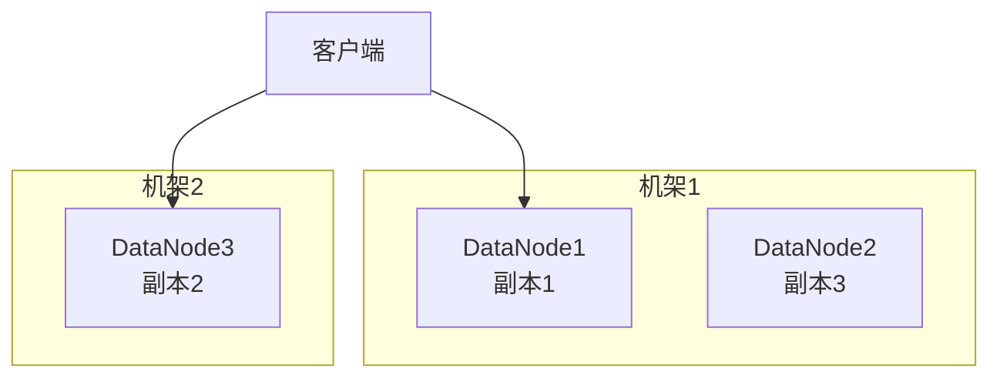
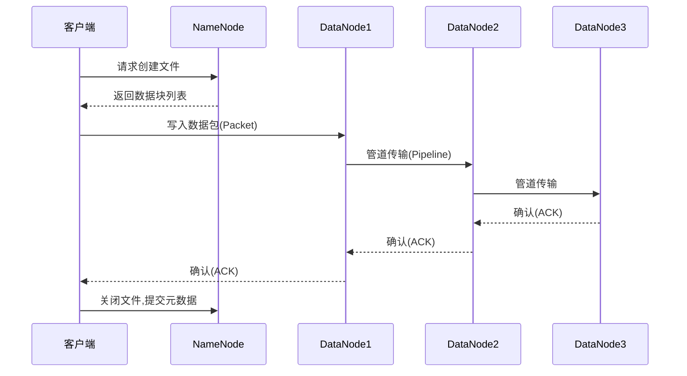
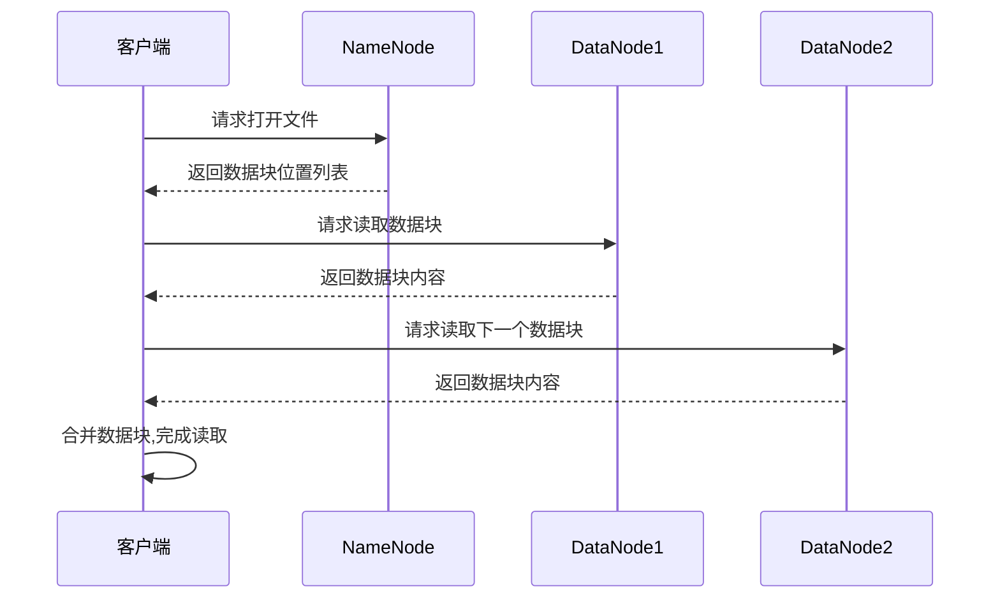
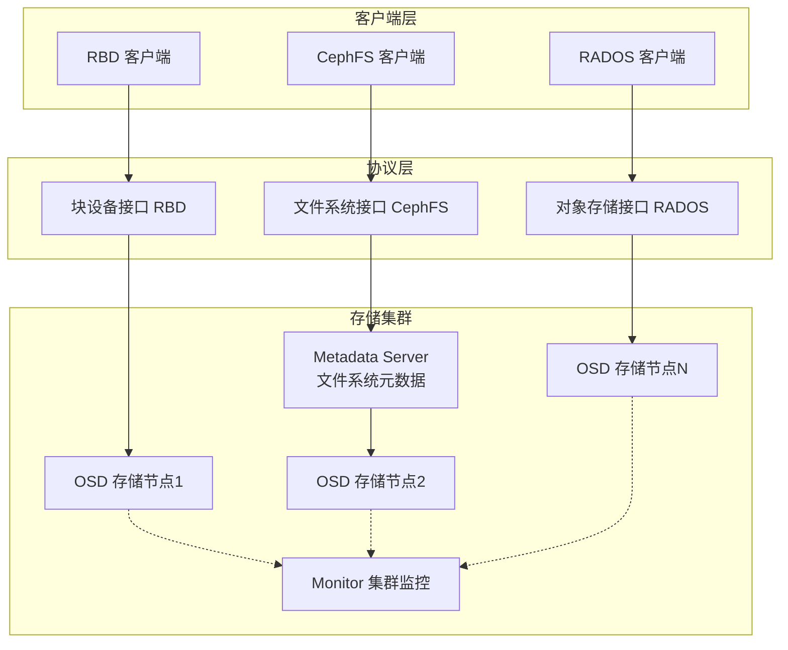
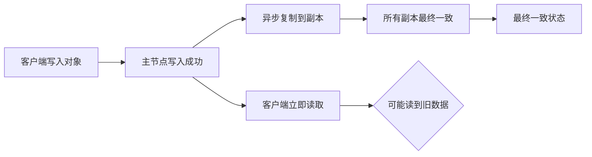
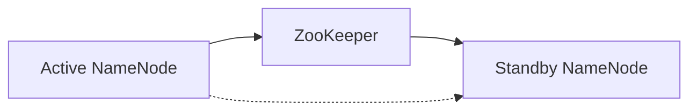
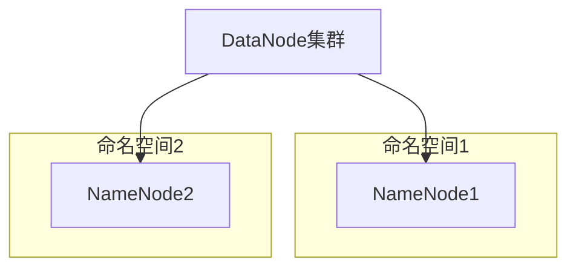

# 第5章 云存储技术 — 综合练习题

> [!info] 题型说明
> 本习题集共 **33 题**,包含多种题型,建议用时 120 分钟完成。
> - 单选题(11 题)
> - 多选题(6 题)
> - 判断题(5 题)
> - 简答题(4 题)
> - 计算题(5 题)
> - 实操题(2 题)

---

## 一、单项选择题(每题 3 分,共 33 分)

### 第 1 题

以下哪种存储类型最适合数据库应用?

A. 对象存储(S3/OSS)
B. 块存储(EBS/Cinder)
C. 文件存储(EFS/CephFS)
D. 归档存储(Glacier)

<details>
<summary>查看答案与解析</summary>

**答案：B**

**解析**：块存储提供低延迟、高性能的块设备,支持随机读写,最适合数据库应用。对象存储适合静态文件和大数据分析,文件存储适合共享文件场景,归档存储用于冷数据备份。

</details>

---

### 第 2 题

HDFS 的默认数据块大小是多少?

A. 64 MB
B. 128 MB
C. 256 MB
D. 512 MB

<details>
<summary>查看答案与解析</summary>

**答案：B**

**解析**：HDFS 默认数据块大小为 128 MB(Hadoop 2.x 及以后),早期版本为 64 MB。大块大小减少了 NameNode 内存开销,适合大文件存储。实际生产环境可能配置为 256 MB 或更大。

</details>

---

### 第 3 题

对象存储的访问方式是?

A. 通过文件系统挂载
B. 通过块设备接口
C. 通过 RESTful API(HTTP/HTTPS)
D. 通过数据库查询

<details>
<summary>查看答案与解析</summary>

**答案：C**

**解析**：对象存储通过 RESTful API(HTTP/HTTPS)访问,使用 GET/PUT/DELETE 等方法操作对象。不支持文件系统挂载(A)或块设备接口(B)。典型接口包括 AWS S3 API、阿里云 OSS API。

</details>

---

### 第 4 题

Ceph 存储系统的核心组件不包括以下哪一项?

A. MON(Monitor)
B. OSD(Object Storage Device)
C. MDS(Metadata Server)
D. NFS(Network File System)

<details>
<summary>查看答案与解析</summary>

**答案：D**

**解析**：Ceph 核心组件：
- **MON(Monitor)**：集群监控和管理
- **OSD(Object Storage Device)**：存储数据和副本
- **MDS(Metadata Server)**：提供 CephFS 元数据服务

NFS 是网络文件系统协议,不是 Ceph 组件,但 Ceph 可以通过 NFS 网关提供 NFS 访问。

</details>

---

### 第 5 题

HDFS 的副本放置策略(默认副本数为 3)是?

A. 所有副本放在同一节点
B. 第一个副本在客户端所在节点,其余随机分布
C. 第一个副本在本地机架,第二个在本地机架其他节点,第三个在其他机架
D. 所有副本随机分布

<details>
<summary>查看答案与解析</summary>

**答案：C**

**解析**：HDFS 默认副本放置策略(副本数为 3)：
1. 第一个副本：优先放在客户端所在节点(若客户端在集群内),否则随机选择
2. 第二个副本：放在与第一个副本不同机架的随机节点
3. 第三个副本：放在与第二个副本相同机架的不同节点

这样既保证数据可靠性(跨机架),又减少跨机架网络流量。

</details>

---

### 第 6 题

以下哪项不是对象存储的生命周期管理策略?

A. 自动转移到低频访问存储类
B. 自动归档到冷存储
C. 自动删除过期对象
D. 自动扩容存储空间

<details>
<summary>查看答案与解析</summary>

**答案：D**

**解析**：对象存储生命周期管理策略包括：
- 自动转移存储类(A):如从标准存储转移到低频访问存储
- 自动归档(B):转移到归档存储(如 Glacier)
- 自动删除(C):过期对象自动删除
- 版本控制:保留多个版本

自动扩容存储空间(D)是对象存储的服务特性,不是生命周期策略。对象存储天然支持无限扩容。

</details>

---

### 第 7 题

HDFS 的 NameNode 的主要作用是?

A. 存储实际数据
B. 管理文件系统元数据
C. 执行 MapReduce 任务
D. 监控集群健康状态

<details>
<summary>查看答案与解析</summary>

**答案：B**

**解析**：
- **NameNode**：管理文件系统元数据(文件名、目录结构、数据块位置)
- DataNode：存储实际数据块
- ResourceManager：管理 MapReduce 任务
- ZooKeeper：监控集群状态(非 HDFS 组件)

NameNode 是 HDFS 的主节点,单点故障风险,通常配置 Secondary NameNode 或高可用集群。

</details>

---

### 第 8 题

数据去重(Deduplication)技术的核心原理是?

A. 压缩数据以减少存储空间
B. 消除重复数据块,只存储唯一数据
C. 加密数据以提高安全性
D. 分片数据以提高性能

<details>
<summary>查看答案与解析</summary>

**答案：B**

**解析**：数据去重技术通过识别和消除重复数据块,只存储唯一数据,减少存储空间占用。常见方法：
- 文件级去重:识别相同文件
- 块级去重:将文件分块,识别重复块
- 字节级去重:识别重复字节序列

去重可节省 30-90% 存储空间,取决于数据重复率。

</details>

---

### 第 9 题

Ceph 的 CRUSH 算法的主要作用是?

A. 数据压缩
B. 数据加密
C. 数据分布和定位
D. 数据去重

<details>
<summary>查看答案与解析</summary>

**答案：C**

**解析**：CRUSH(Controlled Replication Under Scalable Hashing)算法是 Ceph 的核心数据分布算法,用于：
- 数据分布:计算数据对象应存储的 OSD 位置
- 无元数据查询:通过算法直接计算位置,无需查询中心化元数据
- 容错性:节点故障时自动重新分布数据

CRUSH 提供了无元数据查询的高性能和可扩展性。

</details>

---

### 第 10 题

S3 存储桶(Bucket)的命名规则不包括以下哪一项?

A. 全局唯一(跨所有 AWS 账户)
B. 长度 3-63 个字符
C. 只能包含小写字母、数字、点号和连字符
D. 必须以数字开头

<details>
<summary>查看答案与解析</summary>

**答案：D**

**解析**：S3 存储桶命名规则：
- 全局唯一(A):跨所有 AWS 区域和账户唯一
- 长度 3-63 个字符(B)
- 只能包含小写字母、数字、点号(.)和连字符(-)(C)
- 必须以字母或数字开头,不能以点号或连字符开头

D 错误:可以以字母或数字开头,不强制以数字开头。

</details>

---

### 第 11 题

以下哪种存储类型最适合存储海量图片和视频文件?

A. 块存储
B. 对象存储
C. 文件存储
D. 内存存储

<details>
<summary>查看答案与解析</summary>

**答案：B**

**解析**：对象存储最适合海量图片和视频文件：
- 无限扩容能力
- 支持海量文件(亿级)
- 低成本
- 通过 HTTP 直接访问
- 支持 CDN 加速

块存储适合数据库,文件存储适合共享文件,内存存储用于缓存。

</details>

---

## 二、多项选择题(每题 4 分,共 24 分)

### 第 12 题

云存储的三种主要类型包括?(多选)

A. 块存储(Block Storage)
B. 文件存储(File Storage)
C. 对象存储(Object Storage)
D. 内存存储(Memory Storage)
E. 缓存存储(Cache Storage)

<details>
<summary>查看答案与解析</summary>

**答案：A、B、C**

**解析**：云存储三种主要类型：
- **块存储**:提供块设备接口(如 EBS、Cinder)
- **文件存储**:提供文件系统接口(如 EFS、CephFS)
- **对象存储**:通过 API 访问(如 S3、OSS)

内存存储和缓存存储是特定用途存储,不是云存储主要分类。

</details>

---

### 第 13 题

HDFS 的高可用方案包括?(多选)

A. Secondary NameNode
B. NameNode HA(Active-Standby)
C. Federation(联邦)
D. RAID 磁盘阵列
E. DataNode 副本

<details>
<summary>查看答案与解析</summary>

**答案：B、C**

**解析**：HDFS 高可用方案：
- **NameNode HA**: Active-Standby 模式,主节点故障时自动切换
- **Federation**: 多个 NameNode 管理不同命名空间,提高扩展性

Secondary NameNode(A)用于合并 EditLog 和 Fsimage,不是 HA 方案。RAID(D)和 DataNode 副本(E)提高数据可靠性,不解决 NameNode 单点故障。

</details>

---

### 第 14 题

对象存储的特性包括?(多选)

A. 无限扩容能力
B. 通过 HTTP/HTTPS 访问
C. 强一致性
D. 支持版本控制
E. 低成本

<details>
<summary>查看答案与解析</summary>

**答案：A、B、D、E**

**解析**：对象存储特性：
- **无限扩容(A)**:支持海量对象存储
- **HTTP 访问(B)**:通过 RESTful API 访问
- **支持版本控制(D)**:保留多个版本
- **低成本(E)**:按实际使用量付费

C 错误:对象存储通常提供**最终一致性**(Eventual Consistency),而非强一致性。新对象写入后,可能需要短暂延迟才能全局可见。

</details>

---

### 第 15 题

Ceph 支持的存储接口包括?(多选)

A. RADOS(对象存储)
B. RBD(块存储)
C. CephFS(文件存储)
D. NFS(网络文件系统)
E. iSCSI(互联网 SCSI)

<details>
<summary>查看答案与解析</summary>

**答案：A、B、C、D、E**

**解析**：Ceph 统一存储架构支持多种接口：
- **RADOS**:原生对象存储接口
- **RBD**:块设备接口(支持 QEMU、Libvirt)
- **CephFS**:POSIX 兼容文件系统
- **NFS**:通过 NFS-Ganesha 网关提供 NFS 接口
- **iSCSI**:通过 TGT 或 iSCSI Gateway 提供 iSCSI 接口

Ceph 的统一架构提供多种存储接口。

</details>

---

### 第 16 题

数据去重的实现方式包括?(多选)

A. 文件级去重
B. 块级去重
C. 字节级去重
D. 行级去重
E. 列级去重

<details>
<summary>查看答案与解析</summary>

**答案：A、B、C**

**解析**：数据去重实现方式：
- **文件级去重**:识别相同文件(如哈希比对)
- **块级去重**:将文件分块(固定或变长),识别重复块
- **字节级去重**:识别重复字节序列(如 Delta 编码)

行级和列级去重是数据库优化技术,不是存储去重方式。

</details>

---

### 第 17 题

HDFS 的核心特性包括?(多选)

A. 高容错性
B. 高吞吐量
C. 低延迟随机读写
D. 大文件存储
E. 流式数据访问

<details>
<summary>查看答案与解析</summary>

**答案：A、B、D、E**

**解析**：HDFS 核心特性：
- **高容错性(A)**:多副本机制
- **高吞吐量(B)**:适合批量数据处理
- **大文件存储(D)**:支持 TB、PB 级文件
- **流式数据访问(E)**:适合"一次写入,多次读取"场景

C 错误:HDFS 不适合低延迟随机读写,适合批量顺序读写。随机读写应使用 HBase 或 Kudu。

</details>

---

## 三、判断题(每题 2 分,共 10 分)

### 第 18 题

HDFS 的 NameNode 故障会导致集群无法写入数据,但可以读取数据。

<details>
<summary>查看答案与解析</summary>

**答案：错误**

**解析**：NameNode 存储文件系统元数据(文件名、目录结构、数据块位置)。NameNode 故障后,客户端无法获取文件元数据,既不能写入也不能读取数据。这就是 NameNode 单点故障风险,需要配置 HA(高可用)。

</details>

---

### 第 19 题

对象存储的对象名(Object Key)在存储桶内必须唯一。

<details>
<summary>查看答案与解析</summary>

**答案：正确**

**解析**：对象存储中,每个对象由存储桶名(Bucket Name)和对象名(Object Key)唯一标识。同一存储桶内,对象名必须唯一。上传相同对象名会覆盖原对象(除非启用版本控制)。

</details>

---

### 第 20 题

Ceph 的 CRUSH 算法使用中心化元数据服务器查询数据位置。

<details>
<summary>查看答案与解析</summary>

**答案：错误**

**解析**：CRUSH 算法是去中心化的,客户端通过算法计算数据位置,无需查询中心化元数据服务器。这避免了元数据服务器的性能瓶颈,提供了极高的可扩展性。

</details>

---

### 第 21 题

数据去重技术会增加存储系统的写入性能。

<details>
<summary>查看答案与解析</summary>

**答案：错误**

**解析**：数据去重需要计算数据块哈希、查找重复块,会增加写入延迟,降低写入性能。但去重可以减少存储空间占用,间接提高读性能(更少数据传输)。现代去重系统使用 SSD 缓存和并行处理降低性能影响。

</details>

---

### 第 22 题

HDFS 适合存储大量小文件(如 KB 级文件)。

<details>
<summary>查看答案与解析</summary>

**答案：错误**

**解析**：HDFS 不适合大量小文件存储。每个文件、目录和数据块都在 NameNode 内存中占用元数据对象,大量小文件会耗尽 NameNode 内存。HDFS 适合大文件(GB、TB 级),小文件存储应使用 HArchive、HBase 或对象存储。

</details>

---

## 四、简答题(每题 6 分,共 24 分)

### 第 23 题

对比块存储、文件存储和对象存储的架构、访问方式和适用场景。

<details>
<summary>查看参考答案</summary>

**三种存储类型对比**:

| 对比维度 | 块存储 | 文件存储 | 对象存储 |
|---------|--------|---------|---------|
| **架构** | 提供原始块设备(LUN) | 提供文件系统接口(NFS、CIFS) | 扁平化对象存储(存储桶+对象) |
| **访问方式** | 块设备接口(SCSI、iSCSI、FC) | 文件系统挂载(NFS、CIFS、POSIX) | RESTful API(HTTP/HTTPS) |
| **协议** | iSCSI、FC、NBD | NFS、CIFS/SMB、POSIX | S3、Swift、OSS API |
| **延迟** | 最低(ms 级) | 中等(10-100ms) | 较高(100ms-1s) |
| **扩容能力** | 受限(单个 LUN 容量限制) | 受限(文件系统大小限制) | 无限(支持海量对象) |
| **共享性** | 单实例挂载(通常) | 多客户端共享 | 全局访问(HTTP) |
| **典型应用** | 数据库、虚拟机磁盘 | 共享文件、用户目录、应用数据 | 图片、视频、备份、大数据分析 |
| **代表产品** | AWS EBS、OpenStack Cinder | AWS EFS、Azure Files | AWS S3、阿里云 OSS |

**适用场景详解**:

**块存储适用场景**:
- 数据库:高性能随机读写,低延迟
- 虚拟机磁盘:需要块设备接口
- 高性能计算:低延迟要求
- 企业关键应用:高性能、可靠性

**文件存储适用场景**:
- 共享文件:多客户端共享访问
- 用户目录:用户文件存储
- 应用数据:应用配置和数据文件
- 开发环境:代码库、构建产物

**对象存储适用场景**:
- 海量文件:图片、视频、文档
- 备份归档:数据备份、长期归档
- 大数据分析:数据湖、分析输入
- 静态资源:网站静态文件、CDN 源
- 日志存储:应用日志、系统日志

</details>

---

### 第 24 题

解释 HDFS 的副本放置策略和数据读写流程。

<details>
<summary>查看参考答案</summary>

**HDFS 副本放置策略**(默认副本数 3):



**放置策略(默认)**:
1. **第一个副本**:优先放在客户端所在节点(若客户端在集群内),否则随机选择
2. **第二个副本**:放在与第一个副本不同机架的随机节点(跨机架容错)
3. **第三个副本**:放在与第二个副本相同机架的不同节点(同机架多副本)

**策略目标**:
- 数据可靠性:跨机架容错
- 网络优化:减少跨机架流量
- 读取性能:就近读取(客户端本地副本)

**数据写入流程**:



**写入步骤**:
1. 客户端向 NameNode 请求创建文件
2. NameNode 检查权限,返回数据块位置列表
3. 客户端将数据切分为数据包(Packet)
4. 客户端建立到 DataNode 的管道(Pipeline):Client → DN1 → DN2 → DN3
5. 数据流式传输到管道中的 DataNode
6. 所有副本写入成功后,DataNode 返回确认(ACK)
7. 数据块写入完成,重复步骤 2-6 直到文件写入完成
8. 客户端通知 NameNode 文件关闭,元数据持久化

**数据读取流程**:



**读取步骤**:
1. 客户端向 NameNode 请求打开文件
2. NameNode 返回文件的数据块位置列表(包含所有副本位置)
3. 客户端选择最近的 DataNode(网络拓扑距离最短)
4. 客户端直接从 DataNode 读取数据块
5. 重复步骤 3-4 直到读取所有数据块
6. 客户端合并数据块,完成文件读取

**优化**:
- 就近读取:客户端优先选择本地或同机架副本
- 缓存机制:客户端缓存数据块位置,减少 NameNode 查询
- 预读取:提前读取后续数据块

</details>

---

### 第 25 题

简述 Ceph 的架构组成和 CRUSH 算法的原理与优势。

<details>
<summary>查看参考答案</summary>

**Ceph 架构组成**:



**核心组件**:

| 组件 | 功能 | 说明 |
|------|------|------|
| **MON(Monitor)** | 集群监控 | 维护集群状态映射(节点状态、数据分布),通常 3-5 个节点,多数派选举 |
| **OSD(Object Storage Device)** | 数据存储 | 存储对象数据和副本,处理数据读写、复制、恢复,通常数十到数千节点 |
| **MDS(Metadata Server)** | 文件系统元数据 | 为 CephFS 提供元数据服务(目录结构、文件属性),可多个节点负载均衡 |
| **RADOS** | 对象存储层 | Ceph 核心存储引擎,提供对象存储能力 |
| **RBD(RADOS Block Device)** | 块设备接口 | 提供块设备接口,支持 QEMU、Libvirt |
| **CephFS** | 文件系统接口 | 提供 POSIX 兼容文件系统 |

**CRUSH 算法原理**:

CRUSH(Controlled Replication Under Scalable Hashing)是 Ceph 的数据分布算法:

**工作原理**:
1. **无元数据查询**:客户端通过算法计算数据位置,无需查询中心化元数据服务器
2. **确定性映射**:相同对象 ID 和集群拓扑,总是计算出相同位置
3. **层级拓扑**:考虑机架、主机、故障域等物理拓扑
4. **权重分配**:根据 OSD 容量分配权重,实现负载均衡

**数据定位过程**:
```
Object ID → Hash → Placement Group(PG) → CRUSH 算法 → OSD 集合
```

**CRUSH 映射规则示例**:
```
# 选择 3 个 OSD 存储副本
rule replicated_rule {
    steps:
        take default  # 从默认根开始
        chooseleaf firstn 0 type host  # 选择不同主机
        emit  # 输出 OSD 列表
}
```

**CRUSH 算法优势**:

| 优势 | 说明 |
|------|------|
| **无元数据查询** | 客户端直接计算位置,避免元数据服务器瓶颈 |
| **高可扩展性** | 支持数千节点、PB 级存储,无中心化限制 |
| **故障域隔离** | 自动跨机架、跨主机分布副本,提高可靠性 |
| **自动重平衡** | 节点故障或新增时,自动重新分布数据 |
| **权重管理** | 根据容量权重分配数据,实现负载均衡 |
| **灵活性** | 支持自定义故障域(机架、主机、数据中心) |

**与传统存储对比**:

| 对比维度 | 传统存储(元数据服务器) | Ceph(CRUSH) |
|---------|---------------------|------------|
| 元数据管理 | 中心化元数据服务器 | 分布式算法计算 |
| 扩展性 | 受限于元数据服务器性能 | 理论上无限扩展 |
| 故障恢复 | 依赖元数据服务器 | 自动计算新位置 |
| 查询延迟 | 元数据服务器查询延迟 | 本地计算,零延迟 |

</details>

---

### 第 26 题

解释对象存储的生命周期管理策略和数据一致性模型。

<details>
<summary>查看参考答案</summary>

**对象存储生命周期管理策略**:

生命周期管理(Lifecycle Management)自动化管理对象的生命周期,降低存储成本:


**生命周期策略类型**:

| 策略类型 | 说明 | 典型规则 |
|---------|------|---------|
| **存储类转移** | 自动转移到更低成本的存储类 | 标准存储 → 低频访问 → 归档 |
| **过期删除** | 自动删除过期对象 | 日志文件 30 天后删除 |
| **版本控制** | 保留多个版本 | 保留最近 N 个版本 |
| **未完成分片清理** | 清理上传失败的分片 | 分片上传 7 天未完成自动清理 |

**生命周期配置示例(S3)**:

```xml
<LifecycleConfiguration>
  <Rule>
    <ID>MoveToIA</ID>
    <Prefix>logs/</Prefix>
    <Status>Enabled</Status>
    <Transition>
      <Days>30</Days>
      <StorageClass>STANDARD_IA</StorageClass>
    </Transition>
    <Transition>
      <Days>90</Days>
      <StorageClass>GLACIER</StorageClass>
    </Transition>
    <Expiration>
      <Days>365</Days>
    </Expiration>
  </Rule>
</LifecycleConfiguration>
```

**应用场景**:
- **日志文件**:30 天后转移到低频访问,90 天后归档,1 年后删除
- **备份文件**:转移到归档存储,长期保存
- **用户上传文件**:未使用文件自动清理
- **临时文件**:短期存储后自动删除

**对象存储数据一致性模型**:

对象存储通常采用**最终一致性**(Eventual Consistency)模型:



**一致性类型**:

| 一致性类型 | 说明 | 对象存储行为 |
|-----------|------|-------------|
| **强一致性** | 写入后立即全局可见 | 不支持(性能代价高) |
| **最终一致性** | 写入后短暂延迟全局可见 | ✅ 默认一致性模型 |
| **写后读一致性** | 写入者立即读到新数据 | ✅ 支持(同一客户端) |

**对象存储一致性保证**:

1. **写后读一致性(Write-After-Write Consistency)**:
   - 同一客户端写入对象后,立即读取可看到新数据
   - 客户端通过条件写入(如 If-Match)实现幂等性

2. **覆盖一致性**:
   - 覆盖写入(相同对象名)保证原子性,不会读到部分写入
   - 不同客户端可能短暂读到旧数据

3. **跨区域复制(CRR)**:
   - 异步复制到其他区域,延迟几分钟到几小时
   - 灾难恢复场景使用

**一致性挑战与应对**:

| 挑战 | 应对策略 |
|------|---------|
| 读取到旧数据 | 客户端缓存对象版本号,验证一致性 |
| 覆盖写入冲突 | 使用版本控制,保留多个版本 |
| 跨区域延迟 | 就近区域访问,或使用强一致性存储服务 |
| 列表一致性 | 列表 API 不保证实时性,使用前缀查询 |

**强一致性对象存储**:
部分云服务商提供强一致性对象存储(如 AWS S3 强一致性,2020 年后默认启用):
- 所有读取请求都返回最新写入的数据
- 跨区域复制仍为异步
- 性能略有降低

</details>

---

## 五、计算题(每题 7 分,共 35 分)

### 第 27 题：HDFS 存储容量计算

某 HDFS 集群配置如下:
- DataNode 数量: 20 台
- 每台 DataNode 磁盘容量: 10 TB
- 副本系数: 3
- HDFS 数据块大小: 128 MB
- 预留空间: 10%

请计算:

1. 集群原始存储容量是多少?
2. HDFS 有效存储容量是多少(考虑副本)?
3. 假设集群已存储 5,000 个文件,每个文件平均大小 1 GB,NameNode 元数据内存开销为 150 字节/对象(文件+数据块),NameNode 需要多少内存?
4. 若要存储 100 PB 数据,需要增加多少台 DataNode?

<details>
<summary>查看参考答案</summary>

**1. 计算集群原始存储容量**

- DataNode 数量: 20 台
- 单台磁盘容量: 10 TB
- 总容量: 20 × 10 = **200 TB**

**2. 计算 HDFS 有效存储容量**

**考虑预留空间**:
- 预留空间比例: 10%
- 可用容量: 200 × (1 - 10%) = 180 TB

**考虑副本系数**:
- 副本系数: 3
- 有效容量: 180 ÷ 3 = **60 TB**

用户可实际存储 60 TB 数据。

**3. 计算 NameNode 内存需求**

**计算元数据对象数**:

每个文件的元数据对象:
- 1 个文件对象(文件名、权限、时间戳等)
- 数据块数量: 文件大小 ÷ 数据块大小 = 1 GB ÷ 128 MB = 8 个数据块
- 每个数据块对应 1 个数据块对象

单个文件元数据对象数: 1 + 8 = 9 个对象

**总元数据对象数**:
- 文件数: 5,000 个
- 总对象数: 5,000 × 9 = 45,000 个对象

**NameNode 内存需求**:
- 单对象内存开销: 150 字节
- 总内存: 45,000 × 150 = 6,750,000 字节 ≈ **6.4 MB**

这只是示例,实际生产环境:
- 文件数通常为百万级
- NameNode 内存通常为 64-128 GB

**4. 计算需要增加的 DataNode 数量**

**目标存储容量**:
- 目标数据量: 100 PB = 100 × 1024 = 102,400 TB
- 考虑副本: 102,400 × 3 = 307,200 TB(原始容量)

**单台 DataNode 有效容量**:
- 单台原始容量: 10 TB
- 预留空间: 10 TB × (1 - 10%) = 9 TB
- 考虑副本: 9 TB ÷ 3 = 3 TB(有效容量)

**所需 DataNode 数量**:
- 有效容量需求: 102,400 TB
- 所需 DataNode: 102,400 ÷ 3 ≈ 34,133 台

**需增加的 DataNode 数量**:
- 现有: 20 台
- 需增加: 34,133 - 20 = **34,113 台**

**验证**:
- 总容量: 34,133 × 10 = 341,330 TB
- 可用容量: 341,330 × 90% = 307,197 TB
- 有效容量: 307,197 ÷ 3 ≈ 102,399 TB ≈ 100 PB ✓

</details>

---

### 第 28 题：对象存储成本计算

某企业使用 AWS S3 存储数据,配置如下:

**数据量**:
- 标准存储: 10 TB
- 低频访问存储(IA): 5 TB
- 归档存储(Glacier): 20 TB

**访问频率**:
- 标准存储: 每月 1,000,000 次 GET 请求,100,000 次 PUT 请求
- 低频访问存储: 每月 100,000 次 GET 请求,10,000 次 PUT 请求
- 归档存储: 每月 10 次 GET 请求(检索),无 PUT 请求

**AWS S3 价格(示例)**:
- 标准存储: $0.023/GB/月
- 低频访问存储: $0.0125/GB/月
- 归档存储: $0.004/GB/月
- PUT 请求: $0.005/1,000 次
- GET 请求: $0.0004/1,000 次
- Glacier 检索: $0.01/GB

请计算:

1. 每月存储费用是多少?
2. 每月请求费用是多少?
3. 若启用生命周期管理,标准存储数据 30 天后转移到低频访问,90 天后转移到归档,年节省多少费用?(假设标准存储数据访问频率低)

<details>
<summary>查看参考答案</summary>

**1. 计算每月存储费用**

**标准存储费用**:
- 存储量: 10 TB = 10 × 1024 = 10,240 GB
- 费用: 10,240 × $0.023 = **$235.52**

**低频访问存储费用**:
- 存储量: 5 TB = 5 × 1024 = 5,120 GB
- 费用: 5,120 × $0.0125 = **$64.00**

**归档存储费用**:
- 存储量: 20 TB = 20 × 1024 = 20,480 GB
- 费用: 20,480 × $0.004 = **$81.92**

**总存储费用**:
- 总费用: $235.52 + $64.00 + $81.92 = **$381.44/月**

**2. 计算每月请求费用**

**标准存储请求费用**:
- GET 请求: 1,000,000 ÷ 1,000 × $0.0004 = $0.40
- PUT 请求: 100,000 ÷ 1,000 × $0.005 = $0.50
- 小计: $0.40 + $0.50 = **$0.90**

**低频访问存储请求费用**:
- GET 请求: 100,000 ÷ 1,000 × $0.0004 = $0.04
- PUT 请求: 10,000 ÷ 1,000 × $0.005 = $0.05
- 小计: $0.04 + $0.05 = **$0.09**

**归档存储请求费用**:
- GET 请求: 10 ÷ 1,000 × $0.0004 ≈ $0.00
- Glacier 检索: 10 次 × 1 GB × $0.01 = $0.10
- 小计: **$0.10**

**总请求费用**:
- 总费用: $0.90 + $0.09 + $0.10 = **$1.09/月**

**3. 计算生命周期管理节省费用**

**场景**:标准存储 10 TB 数据 30 天后转移到低频访问,90 天后转移到归档

假设:
- 每月新增 10 TB 数据
- 数据在标准存储保留 1 个月,低频访问保留 2 个月,归档保留剩余时间

**无生命周期管理**:
- 标准存储: 10 TB × 12 个月 = $235.52 × 12 = **$2,826.24/年**

**有生命周期管理**:
- 标准存储: 10 TB × 1 个月 = $235.52 × 1 = $235.52
- 低频访问存储: 10 TB × 2 个月 = $64.00 × 2 = $128.00
- 归档存储: 10 TB × 9 个月 = $81.92 × 0.4(按实际比例) ≈ $73.73

单批数据年费用: $235.52 + $128.00 + $73.73 = **$437.25**

**年节省费用**:
- 无生命周期管理: $2,826.24
- 有生命周期管理: $437.25
- 年节省: $2,826.24 - $437.25 = **$2,388.99**

**节省比例**: $2,388.99 ÷ $2,826.24 × 100% = **84.5%**

**注意**: 实际节省取决于数据访问频率。频繁访问的数据不适合转移到低频访问存储,因为低频访问存储的请求费用更高。

</details>

---

### 第 29 题：数据去重效果计算

某存储系统启用数据去重功能,测试数据如下:

**原始数据**:
- 文件 1: 10 GB,哈希值 A
- 文件 2: 10 GB,哈希值 A(与文件 1 内容相同)
- 文件 3: 5 GB,哈希值 B
- 文件 4: 5 GB,哈希值 C
- 文件 5: 20 GB,哈希值 D(其中 15 GB 与文件 3 重复,采用块级去重)

假设:
- 文件级去重: 识别相同文件
- 块级去重: 文件分块(固定 4 KB 块),识别重复块
- 元数据开销: 1%

请计算:

1. 无去重时的总存储空间是多少?
2. 文件级去重后的存储空间是多少?节省比例?
3. 块级去重后的存储空间是多少?节省比例?
4. 若系统采用变长块去重(平均块大小 8 KB),节省比例会提高还是降低?

<details>
<summary>查看参考答案</summary>

**1. 无去重时的总存储空间**

- 文件 1: 10 GB
- 文件 2: 10 GB
- 文件 3: 5 GB
- 文件 4: 5 GB
- 文件 5: 20 GB
- 总空间: 10 + 10 + 5 + 5 + 20 = **50 GB**

**2. 文件级去重后的存储空间**

**文件级去重识别**:
- 文件 1(哈希 A): 保留,10 GB
- 文件 2(哈希 A): 与文件 1 相同,去重,0 GB(引用文件 1)
- 文件 3(哈希 B): 保留,5 GB
- 文件 4(哈希 C): 保留,5 GB
- 文件 5(哈希 D): 保留,20 GB

**去重后空间**:
- 数据空间: 10 + 0 + 5 + 5 + 20 = 40 GB
- 元数据开销: 40 × 1% = 0.4 GB
- 总空间: 40 + 0.4 = **40.4 GB**

**节省比例**:
- 节省空间: 50 - 40.4 = 9.6 GB
- 节省比例: 9.6 ÷ 50 × 100% = **19.2%**

**3. 块级去重后的存储空间**

**文件 5 块级去重分析**:
- 文件 5 大小: 20 GB
- 与文件 3 重复: 15 GB
- 文件 5 独有部分: 20 - 15 = 5 GB

**块级去重识别**:
- 文件 1: 10 GB(保留)
- 文件 2: 10 GB(全部与文件 1 重复)
- 文件 3: 5 GB(保留)
- 文件 4: 5 GB(保留)
- 文件 5: 15 GB(与文件 3 重复),5 GB(独有)

**去重后空间**:
- 唯一数据块: 10 + 5 + 5 + 5 = 25 GB
- 元数据开销: 25 × 1% = 0.25 GB
- 总空间: 25 + 0.25 = **25.25 GB**

**节省比例**:
- 节省空间: 50 - 25.25 = 24.75 GB
- 节省比例: 24.75 ÷ 50 × 100% = **49.5%**

**4. 变长块去重的影响**

**变长块去重特点**:
- 平均块大小: 8 KB(大于固定块 4 KB)
- 块数量: 更少(数据量 ÷ 平均块大小)
- 块边界: 根据内容动态调整(如 CDC 算法)

**影响分析**:

| 对比维度 | 固定块去重(4 KB) | 变长块去重(8 KB) |
|---------|-----------------|-----------------|
| 块大小 | 固定 4 KB | 平均 8 KB(变长) |
| 块数量 | 多 | 少 |
| 去重粒度 | 细粒度 | 粗粒度 |
| 元数据开销 | 高(更多块) | 低(更少块) |
| 去重效果 | 更高(识别更多重复) | 较低(识别较少重复) |
| 性能 | 较低(更多哈希计算) | 较高(更少哈希计算) |

**结论**: 变长块去重(平均 8 KB)会**降低节省比例**,因为:
1. 块大小更大,粒度更粗,识别重复的能力降低
2. 数据插入或删除导致后续块边界变化,降低重复识别率

但变长块去重有以下优势:
1. 元数据开销更低
2. 计算性能更高
3. 对数据修改更友好(局部性)

**实际应用**:
- 固定块去重:适合数据变化少、重复率高的场景(备份)
- 变长块去重:适合数据变化频繁的场景(主存储)

</details>

---

### 第 30 题：Ceph 存储容量规划

某企业计划部署 Ceph 存储集群,需求如下:

**存储需求**:
- 有效存储容量: 500 TB
- 副本数: 3
- 预留空间: 20%(用于恢复、扩展)

**服务器配置**:
- 单台服务器磁盘数: 12 块
- 单块磁盘容量: 10 TB
- 服务器数量: 待定

**OSD 资源消耗**(单个 OSD):
- 内存: 4 GB
- CPU: 0.5 核

请计算:

1. 需要多少台存储服务器?
2. 总 OSD 数量是多少?
3. OSD 总内存和 CPU 需求是多少?
4. 若配置 3 个 MON 节点(每个 MON 2 GB 内存,1 核 CPU),集群总资源需求是多少?

<details>
<summary>查看参考答案</summary>

**1. 计算所需存储服务器数量**

**有效容量需求**:
- 有效容量: 500 TB

**考虑副本和预留空间**:
- 原始容量需求: 500 × 3 = 1,500 TB(副本)
- 考虑预留: 1,500 ÷ (1 - 20%) = 1,875 TB

**单台服务器容量**:
- 磁盘数: 12 块
- 单盘容量: 10 TB
- 单台容量: 12 × 10 = 120 TB

**所需服务器数量**:
- 所需服务器: 1,875 ÷ 120 = 15.625 → 向上取整为 **16 台**

**验证**:
- 总容量: 16 × 120 = 1,920 TB
- 可用容量: 1,920 × 80% = 1,536 TB
- 有效容量: 1,536 ÷ 3 = 512 TB > 500 TB ✓

**2. 计算总 OSD 数量**

- 单台服务器 OSD 数: 12 个
- 服务器数量: 16 台
- 总 OSD 数: 16 × 12 = **192 个 OSD**

**3. 计算 OSD 资源需求**

**内存需求**:
- 单 OSD 内存: 4 GB
- 总内存: 192 × 4 = **768 GB**

**CPU 需求**:
- 单 OSD CPU: 0.5 核
- 总 CPU: 192 × 0.5 = **96 核**

**单台服务器资源需求**:
- 内存: 12 × 4 = 48 GB
- CPU: 12 × 0.5 = 6 核

**4. 计算集群总资源需求**

**MON 节点资源**:
- MON 节点数: 3 个
- 单 MON 内存: 2 GB
- 单 MON CPU: 1 核
- 总 MON 内存: 3 × 2 = 6 GB
- 总 MON CPU: 3 × 1 = 3 核

**OSD 节点资源**:
- OSD 内存: 768 GB
- OSD CPU: 96 核

**集群总资源需求**:

| 资源类型 | OSD 节点 | MON 节点 | 总计 |
|---------|---------|---------|------|
| 内存 | 768 GB | 6 GB | **774 GB** |
| CPU | 96 核 | 3 核 | **99 核** |

**推荐配置**:

**OSD 节点(16 台)**:
- 内存: 64 GB/台(预留 16 GB 系统内存)
- CPU: 16 核/台(预留 10 核系统使用)
- 磁盘: 12 × 10 TB

**MON 节点(3 台)**:
- 内存: 8 GB/台(预留 6 GB 系统内存)
- CPU: 4 核/台(预留 3 核系统使用)
- 磁盘: 2 × 1 TB SSD(存储 MON 数据)

**注意**: 实际部署还需考虑:
1. 网络带宽:推荐 25 Gbps 或更高
2. SSD 缓存:提升随机读写性能
3. 日志存储:分离日志磁盘
4. MON 部署:建议独立服务器或与 OSD 分离

</details>

---

### 第 31 题：HDFS 性能分析

某 HDFS 集群配置如下:

**集群配置**:
- NameNode: 1 台(单点)
- DataNode: 10 台
- 单台 DataNode 磁盘带宽: 200 MB/s

**副本系数**: 3

**写入性能测试**:
- 单客户端写入吞吐量: 100 MB/s
- 并发 10 个客户端写入吞吐量: 500 MB/s

请计算:

1. 理论上集群最大写入吞吐量是多少?(考虑副本)
2. 实测并发吞吐量与理论值差异的原因?
3. 若 NameNode 成为性能瓶颈,如何优化?

<details>
<summary>查看参考答案</summary>

**1. 计算理论最大写入吞吐量**

**单台 DataNode 吞吐量**:
- 磁盘带宽: 200 MB/s

**集群总磁盘带宽**:
- DataNode 数量: 10 台
- 总带宽: 10 × 200 = 2,000 MB/s

**考虑副本系数**:
- 副本系数: 3
- 写入数据需写入 3 个副本
- 理论最大吞吐量: 2,000 ÷ 3 = **666.67 MB/s**

**注**: 这是理论值,假设网络带宽充足,无其他瓶颈。

**2. 分析实测与理论差异**

**实测并发吞吐量**: 500 MB/s
**理论吞吐量**: 666.67 MB/s
**差异**: 166.67 MB/s

**差异原因分析**:

| 瓶颈因素 | 说明 |
|---------|------|
| **NameNode 瓶颈** | 单 NameNode 处理元数据请求,并发高时延迟增加 |
| **网络瓶颈** | 管道传输需要跨 DataNode 网络传输,网络带宽不足 |
| **客户端瓶颈** | 客户端数据生成速度不足,无法满带宽写入 |
| **磁盘瓶颈** | DataNode 磁盘随机写入性能低于顺序写入 |
| **小文件问题** | 大量小文件增加 NameNode 压力 |

**详细分析**:

**NameNode 瓶颈**:
- NameNode 单线程处理元数据请求
- 并发写入时,创建文件、分配数据块请求排队
- 典型 NameNode 可处理 50,000 次/秒请求

**网络瓶颈**:
- 写入管道: Client → DN1 → DN2 → DN3
- 需要跨机架网络传输(第二个副本跨机架)
- 网络带宽需大于磁盘带宽

**磁盘瓶颈**:
- 实际磁盘写入性能受缓存、并发影响
- 数据块写入需要刷盘(保证可靠性)
- 磁盘随机写入性能低于顺序写入

**3. NameNode 瓶颈优化方案**

**方案一: NameNode HA(高可用)**



- **Active-Standby 模式**:主节点故障自动切换
- **负载均衡**:多个 NameNode 共享负载(通过 Federation)
- **效果**:提升可用性,但不直接提升性能(单 Active 处理请求)

**方案二: HDFS Federation(联邦)**



- **多个 NameNode**:管理不同命名空间(目录)
- **水平扩展**:添加 NameNode 提升元数据处理能力
- **隔离性**:不同业务使用不同命名空间
- **效果**:显著提升并发处理能力

**方案三: 客户端优化**

| 优化项 | 说明 |
|-------|------|
| **批量创建文件** | 减少 NameNode 请求次数 |
| **增大数据块大小** | 减少数据块数量,降低元数据压力 |
| **客户端缓存** | 缓存数据块位置,减少 NameNode 查询 |
| **HDFS Proxy** | 通过代理层缓存元数据 |

**方案四: 架构优化**

| 优化项 | 说明 |
|-------|------|
| **元数据缓存** | NameNode 使用更大内存,缓存更多元数据 |
| **SSD 存储 EditLog** | 使用 SSD 存储 EditLog,提升写入性能 |
| **异步持久化** | EditLog 异步持久化,降低延迟 |

**推荐优化方案**:

1. **短期**:增大 NameNode 内存,优化客户端请求模式
2. **中期**:部署 NameNode HA,提升可用性
3. **长期**:部署 HDFS Federation,水平扩展元数据处理能力

**性能优化效果预估**:

| 方案 | 吞吐量提升 | 实施难度 |
|-----|----------|---------|
| 增大 NameNode 内存 | 10-20% | 低 |
| NameNode HA | 0%(仅提升可用性) | 中 |
| HDFS Federation | 50-100% | 高 |
| 客户端优化 | 20-30% | 低 |

**结论**: 实测吞吐量(500 MB/s)与理论值(666.67 MB/s)差异主要由 NameNode 瓶颈和网络瓶颈导致。优化 NameNode(Federation)和升级网络(10 Gbps → 25 Gbps)可显著提升性能。

</details>

---

## 六、实操题(每题 4 分,共 8 分)

### 第 32 题：HDFS 命令操作

使用 HDFS 命令完成以下任务:

1. 创建目录 `/user/hadoop/data`
2. 上传本地文件 `localfile.txt` 到 HDFS 的 `/user/hadoop/data/` 目录
3. 查看 HDFS 文件 `/user/hadoop/data/localfile.txt` 的内容
4. 下载 HDFS 文件到本地
5. 查看 HDFS 目录 `/user/hadoop/data` 的文件列表和详细信息
6. 设置文件的副本数为 2
7. 删除目录 `/user/hadoop/data`

请写出相应的 HDFS 命令。

<details>
<summary>查看参考答案</summary>

**1. 创建目录**

```bash
# 创建目录(递归创建父目录)
hdfs dfs -mkdir -p /user/hadoop/data

# 查看目录结构
hdfs dfs -ls /user/hadoop
```

**2. 上传文件**

```bash
# 上传本地文件到 HDFS
hdfs dfs -put localfile.txt /user/hadoop/data/

# 或使用 -copyFromLocal
hdfs dfs -copyFromLocal localfile.txt /user/hadoop/data/

# 查看上传结果
hdfs dfs -ls /user/hadoop/data
```

**3. 查看文件内容**

```bash
# 查看文件内容(输出到控制台)
hdfs dfs -cat /user/hadoop/data/localfile.txt

# 查看文件前几行
hdfs dfs -head /user/hadoop/data/localfile.txt

# 查看文件后几行
hdfs dfs -tail /user/hadoop/data/localfile.txt
```

**4. 下载文件**

```bash
# 下载 HDFS 文件到本地
hdfs dfs -get /user/hadoop/data/localfile.txt ./localfile_downloaded.txt

# 或使用 -copyToLocal
hdfs dfs -copyToLocal /user/hadoop/data/localfile.txt ./

# 使用 -getmerge 合并多个文件后下载
hdfs dfs -getmerge /user/hadoop/data/*.txt ./merged.txt
```

**5. 查看文件列表**

```bash
# 列出文件和目录
hdfs dfs -ls /user/hadoop/data

# 列出详细信息(包括权限、所有者、大小、日期)
hdfs dfs -ls -h /user/hadoop/data

# 递归列出所有文件
hdfs dfs -ls -R /user/hadoop

# 查看文件统计信息(目录数、文件数、总大小)
hdfs dfs -count -h /user/hadoop/data

# 查看磁盘使用量
hdfs dfs -du -h /user/hadoop/data
```

**6. 设置副本数**

```bash
# 设置文件副本数为 2
hdfs dfs -setrep -w 2 /user/hadoop/data/localfile.txt

# 递归设置目录下所有文件副本数
hdfs dfs -setrep -R -w 2 /user/hadoop/data/

# 参数说明:
# -w: 等待副本复制完成
# -R: 递归设置目录下所有文件
```

**7. 删除目录**

```bash
# 删除空目录
hdfs dfs -rmdir /user/hadoop/data

# 删除非空目录(递归删除)
hdfs dfs -rm -r /user/hadoop/data

# 删除目录并跳过回收站
hdfs dfs -rm -r -skipTrash /user/hadoop/data

# 查看删除结果
hdfs dfs -ls /user/hadoop
```

**其他常用命令**:

```bash
# 检查 HDFS 文件系统状态
hdfs dfsadmin -report

# 查看 HDFS 数据块信息
hdfs fsck /user/hadoop/data/localfile.txt

# 查看 HDFS 数据块详细信息(包括位置)
hdfs fsck /user/hadoop/data/localfile.txt -files -blocks -locations

# 设置目录配额(限制文件数)
hdfs dfsadmin -setQuota 1000 /user/hadoop/data

# 设置空间配额(限制空间大小)
hdfs dfsadmin -setSpaceQuota 1T /user/hadoop/data

# 查看 HDFS 安全模式状态
hdfs dfsadmin -safemode get

# 离开安全模式
hdfs dfsadmin -safemode leave
```

**HDFS Shell 命令分类**:

| 命令类型 | 常用命令 |
|---------|---------|
| 文件操作 | `put`, `get`, `cat`, `ls`, `mkdir`, `rm`, `mv`, `cp` |
| 目录操作 | `mkdir`, `rmdir`, `ls`, `count`, `du` |
| 副本管理 | `setrep`, `fsck` |
| 权限管理 | `chmod`, `chown`, `chgrp` |
| 系统管理 | `dfsadmin`, `fsck` |

</details>

---

### 第 33 题：对象存储 S3 API 操作

使用 AWS CLI 或 AWS SDK(Python boto3)完成以下 S3 操作:

1. 创建存储桶 "my-app-bucket-2024"
2. 上传文件 "config.json" 到存储桶根目录
3. 上传文件 "images/logo.png" 到存储桶的 "images/" 目录
4. 列出存储桶中的所有对象
5. 下载对象到本地
6. 设置对象生命周期策略:30 天后转移到低频访问存储
7. 删除存储桶及所有对象

请写出相应的命令或代码。

<details>
<summary>查看参考答案</summary>

**使用 AWS CLI**:

**1. 创建存储桶**

```bash
# 创建存储桶(必须全局唯一)
aws s3 mb s3://my-app-bucket-2024

# 指定区域创建存储桶
aws s3 mb s3://my-app-bucket-2024 --region us-east-1

# 查看存储桶列表
aws s3 ls
```

**2. 上传文件**

```bash
# 上传单个文件到存储桶根目录
aws s3 cp config.json s3://my-app-bucket-2024/config.json

# 上传文件到指定目录
aws s3 cp images/logo.png s3://my-app-bucket-2024/images/logo.png

# 同步本地目录到 S3(批量上传)
aws s3 sync ./local-dir s3://my-app-bucket-2024/

# 上传并设置元数据(如 Content-Type)
aws s3 cp config.json s3://my-app-bucket-2024/config.json \
  --metadata "ContentType=application/json"
```

**3. 列出对象**

```bash
# 列出存储桶中的所有对象
aws s3 ls s3://my-app-bucket-2024

# 递归列出所有对象
aws s3 ls s3://my-app-bucket-2024 --recursive

# 列出指定目录的对象
aws s3 ls s3://my-app-bucket-2024/images/

# 以人类可读格式显示文件大小
aws s3 ls s3://my-app-bucket-2024 --recursive --human-readable --summarize
```

**4. 下载对象**

```bash
# 下载单个对象
aws s3 cp s3://my-app-bucket-2024/config.json ./downloaded-config.json

# 下载整个存储桶到本地
aws s3 sync s3://my-app-bucket-2024 ./local-dir

# 下载指定目录
aws s3 sync s3://my-app-bucket-2024/images/ ./local-images/
```

**5. 设置生命周期策略**

创建生命周期配置文件 `lifecycle.json`:

```json
{
  "Rules": [
    {
      "ID": "MoveToIAAfter30Days",
      "Status": "Enabled",
      "Filter": {
        "Prefix": ""
      },
      "Transitions": [
        {
          "Days": 30,
          "StorageClass": "STANDARD_IA"
        }
      ]
    }
  ]
}
```

应用生命周期策略:

```bash
# 应用生命周期策略
aws s3api put-bucket-lifecycle-configuration \
  --bucket my-app-bucket-2024 \
  --lifecycle-configuration file://lifecycle.json

# 查看生命周期策略
aws s3api get-bucket-lifecycle-configuration \
  --bucket my-app-bucket-2024
```

**6. 删除存储桶**

```bash
# 删除存储桶(存储桶必须为空)
aws s3 rb s3://my-app-bucket-2024

# 删除存储桶及所有对象(强制删除)
aws s3 rb s3://my-app-bucket-2024 --force

# 清空存储桶(保留存储桶)
aws s3 rm s3://my-app-bucket-2024 --recursive
```

---

**使用 Python boto3 SDK**:

**安装 boto3**:

```bash
pip install boto3
```

**Python 代码示例**:

```python
import boto3
import json

# 创建 S3 客户端
s3 = boto3.client('s3', region_name='us-east-1')

# 1. 创建存储桶
bucket_name = 'my-app-bucket-2024'
s3.create_bucket(Bucket=bucket_name)
print(f"存储桶 {bucket_name} 创建成功")

# 2. 上传文件到根目录
s3.upload_file('config.json', bucket_name, 'config.json')
print("文件 config.json 上传成功")

# 3. 上传文件到指定目录
s3.upload_file('images/logo.png', bucket_name, 'images/logo.png')
print("文件 images/logo.png 上传成功")

# 4. 列出存储桶中的所有对象
response = s3.list_objects_v2(Bucket=bucket_name)
print("\n存储桶中的对象:")
for obj in response.get('Contents', []):
    print(f"  {obj['Key']} - {obj['Size']} bytes")

# 5. 下载对象
s3.download_file(bucket_name, 'config.json', 'downloaded-config.json')
print("\n文件 config.json 下载成功")

# 6. 设置生命周期策略
lifecycle_config = {
    'Rules': [
        {
            'ID': 'MoveToIAAfter30Days',
            'Status': 'Enabled',
            'Filter': {'Prefix': ''},
            'Transitions': [
                {
                    'Days': 30,
                    'StorageClass': 'STANDARD_IA'
                }
            ]
        }
    ]
}

s3.put_bucket_lifecycle_configuration(
    Bucket=bucket_name,
    LifecycleConfiguration=lifecycle_config
)
print("\n生命周期策略设置成功")

# 7. 删除存储桶及所有对象
# 先删除所有对象
response = s3.list_objects_v2(Bucket=bucket_name)
for obj in response.get('Contents', []):
    s3.delete_object(Bucket=bucket_name, Key=obj['Key'])
    print(f"删除对象: {obj['Key']}")

# 再删除存储桶
s3.delete_bucket(Bucket=bucket_name)
print(f"\n存储桶 {bucket_name} 删除成功")
```

**其他常用 boto3 操作**:

```python
# 设置对象 ACL(访问控制列表)
s3.put_object_acl(Bucket=bucket_name, Key='config.json', ACL='public-read')

# 生成预签名 URL(临时访问链接)
url = s3.generate_presigned_url(
    'get_object',
    Params={'Bucket': bucket_name, 'Key': 'config.json'},
    ExpiresIn=3600  # 1 小时有效
)
print(f"预签名 URL: {url}")

# 复制对象
s3.copy_object(
    Bucket=bucket_name,
    CopySource={'Bucket': bucket_name, 'Key': 'config.json'},
    Key='config-backup.json'
)

# 设置存储类(如直接上传到低频访问存储)
s3.upload_file(
    'archive.tar.gz',
    bucket_name,
    'archive.tar.gz',
    ExtraArgs={'StorageClass': 'STANDARD_IA'}
)

# 获取对象元数据
response = s3.head_object(Bucket=bucket_name, Key='config.json')
print(f"对象元数据: {response['Metadata']}")
```

**错误处理示例**:

```python
from botocore.exceptions import ClientError

try:
    s3.create_bucket(Bucket=bucket_name)
except ClientError as e:
    if e.response['Error']['Code'] == 'BucketAlreadyExists':
        print(f"存储桶 {bucket_name} 已存在")
    else:
        print(f"错误: {e}")
```

</details>

---

## 附录：章节知识点速查表

| 考点 | 重要程度 | 关联题目 |
|-----|---------|---------|
| 云存储类型 | ⭐⭐⭐⭐⭐ | 1, 12, 23 |
| HDFS 架构 | ⭐⭐⭐⭐⭐ | 2, 5, 7, 13, 17, 22, 24, 27, 31 |
| 对象存储 | ⭐⭐⭐⭐⭐ | 3, 6, 10, 11, 14, 19, 26, 28, 33 |
| Ceph 存储 | ⭐⭐⭐⭐⭐ | 4, 9, 15, 20, 25, 30 |
| 数据去重 | ⭐⭐⭐⭐ | 8, 16, 21, 29 |
| 存储容量计算 | ⭐⭐⭐⭐ | 27, 28, 29, 30, 31 |
| HDFS 命令 | ⭐⭐⭐⭐ | 32 |
| S3 API 操作 | ⭐⭐⭐⭐ | 33 |