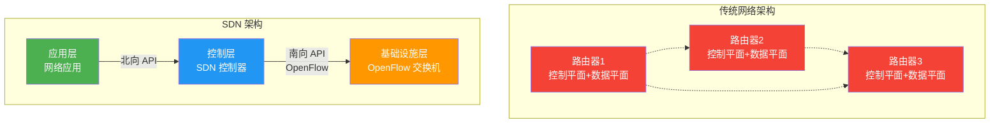
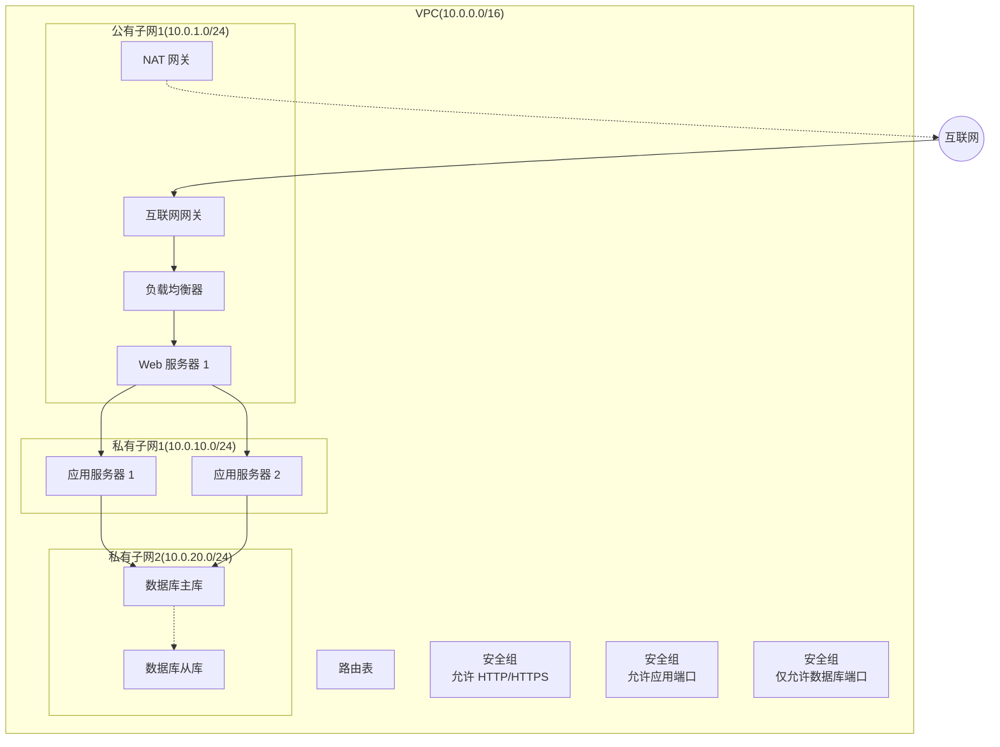
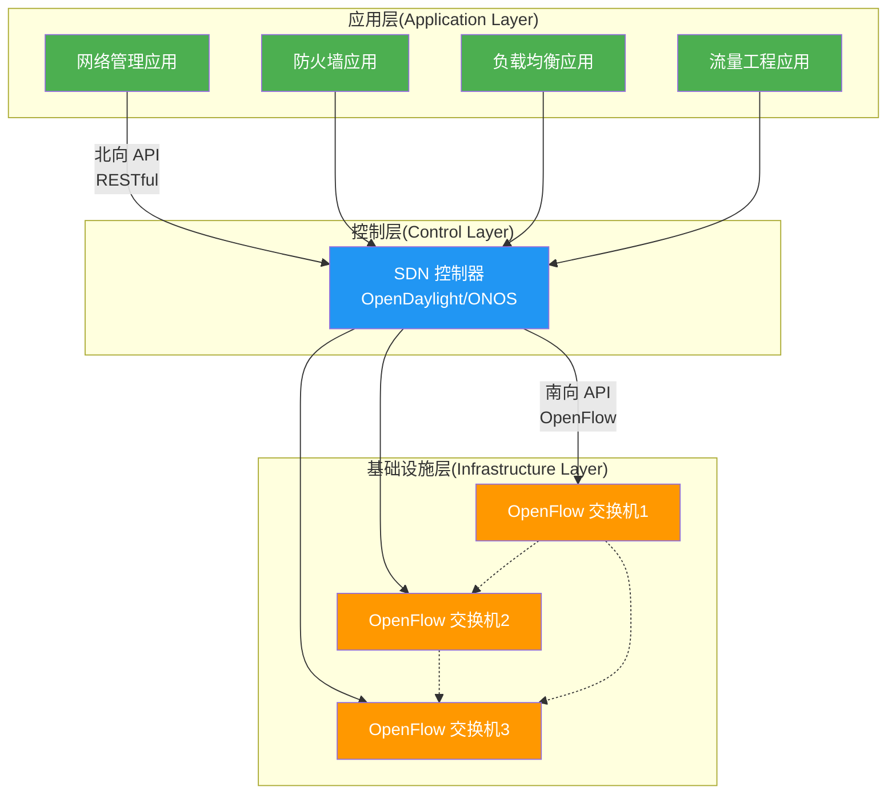
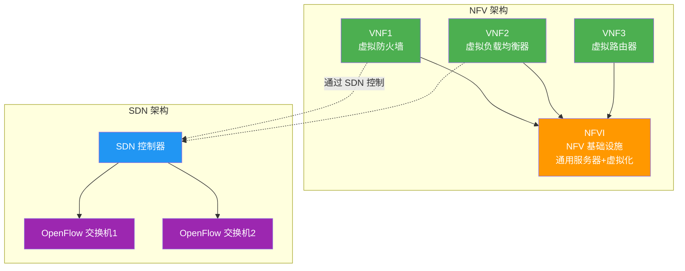
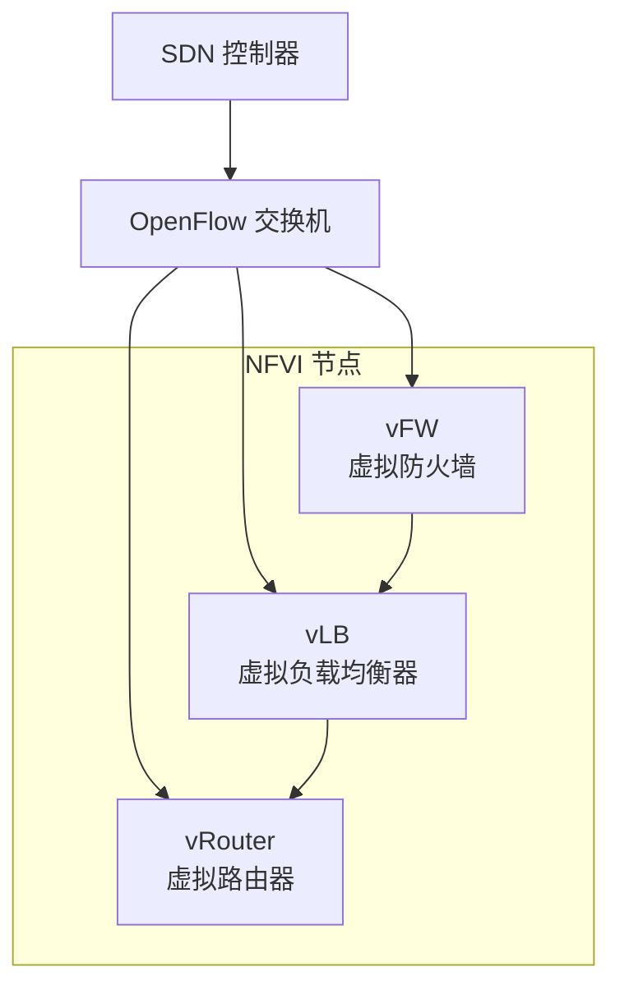

# 第6章 云网络技术 — 综合练习题

> [!info] 题型说明
> 本习题集共 **32 题**,包含多种题型,建议用时 120 分钟完成。
> - 单选题(11 题)
> - 多选题(6 题)
> - 判断题(5 题)
> - 简答题(4 题)
> - 计算题(4 题)
> - 实操题(2 题)

---

## 一、单项选择题(每题 3 分,共 33 分)

### 第 1 题

VPC(Virtual Private Cloud)的核心作用是?

A. 提供公网 IP 地址
B. 在公有云中创建逻辑隔离的虚拟网络
C. 提供对象存储服务
D. 管理虚拟机生命周期

<details>
<summary>查看答案与解析</summary>

**答案：B**

**解析**：VPC(Virtual Private Cloud)在公有云中创建逻辑隔离的虚拟网络,用户可自定义 IP 地址范围、子网、路由表、网关等网络配置,实现与传统数据中心类似的网络架构。VPC 不提供公网 IP(需配置弹性 IP 或 NAT 网关),也不提供存储和计算服务。

</details>

---

### 第 2 题

SDN(Software Defined Networking)的核心特征是?

A. 使用硬件路由器
B. 控制平面与数据平面分离
C. 增加网络带宽
D. 使用光纤通信

<details>
<summary>查看答案与解析</summary>

**答案：B**

**解析**：SDN 的核心特征是**控制平面与数据平面分离**:
- **控制平面**(Control Plane):集中式 SDN 控制器,制定路由策略
- **数据平面**(Data Plane):分布式网络设备,执行转发规则

传统网络设备控制平面和数据平面紧耦合,SDN 实现解耦,提供网络可编程性。

</details>

---

### 第 3 题

OpenFlow 协议的作用是?

A. 配置防火墙规则
B. SDN 控制器与交换机之间的通信协议
C. 加密网络流量
D. 分配 IP 地址

<details>
<summary>查看答案与解析</summary>

**答案：B**

**解析**：OpenFlow 是 SDN 架构中南向接口(Southbound API),用于 SDN 控制器与 OpenFlow 交换机之间的通信。控制器通过 OpenFlow 协议向交换机下发流表(Flow Table),控制数据包的转发规则。

</details>

---

### 第 4 题

NFV(Network Function Virtualization)的主要目标是?

A. 替代 SDN
B. 将网络功能虚拟化为软件实例
C. 提高网络带宽
D. 降低网络延迟

<details>
<summary>查看答案与解析</summary>

**答案：B**

**解析**：NFV 将传统硬件网络设备(防火墙、负载均衡器、路由器等)虚拟化为软件实例(VNF: Virtual Network Function),运行在通用服务器上,实现网络功能的灵活部署和弹性伸缩。NFV 与 SDN 互补:SDN 提供网络可编程性,NFV 提供网络功能虚拟化。

</details>

---

### 第 5 题

VPC 中子网(Subnet)的主要作用是?

A. 提供公网访问
B. 划分 IP 地址范围,实现网络分段
C. 提供存储服务
D. 管理虚拟机镜像

<details>
<summary>查看答案与解析</summary>

**答案：B**

**解析**：子网是 VPC 内的 IP 地址范围划分,实现网络分段和隔离。每个子网有独立的 CIDR 块(如 10.0.1.0/24),可配置不同的路由表和网络 ACL。子网可以设置为公有子网(可访问公网)或私有子网(仅内部访问)。

</details>

---

### 第 6 题

以下哪项不是 VPC 的核心组件?

A. 子网(Subnet)
B. 路由表(Route Table)
C. 安全组(Security Group)
D. 对象存储桶(S3 Bucket)

<details>
<summary>查看答案与解析</summary>

**答案：D**

**解析**：VPC 核心组件包括:
- **子网**(Subnet): IP 地址范围划分
- **路由表**(Route Table): 定义流量路由规则
- **安全组**(Security Group): 虚拟防火墙
- **网络 ACL**(Network ACL): 子网级访问控制
- **互联网网关**(Internet Gateway): 公网访问
- **NAT 网关**(NAT Gateway): 私有子网访问公网

对象存储桶(S3 Bucket)是存储服务,不是 VPC 组件。

</details>

---

### 第 7 题

SDN 架构中的北向 API(Northbound API)的作用是?

A. 控制器与交换机通信
B. 应用程序与控制器通信
C. 交换机之间的通信
D. 数据包转发

<details>
<summary>查看答案与解析</summary>

**答案：B**

**解析**：SDN 架构分为三层:
- **北向 API**(Northbound API): 应用程序与 SDN 控制器通信(如 RESTful API)
- **控制平面**: SDN 控制器(如 OpenDaylight、ONOS)
- **南向 API**(Southbound API): 控制器与网络设备通信(如 OpenFlow)

北向 API 提供网络可编程接口,应用层通过北向 API 配置网络策略。

</details>

---

### 第 8 题

SD-WAN 的主要优势不包括?

A. 降低广域网成本
B. 提供应用级路由策略
C. 替代所有网络设备
D. 支持混合链路(MPLS、Internet、LTE)

<details>
<summary>查看答案与解析</summary>

**答案：C**

**解析**：SD-WAN(Software-Defined Wide Area Network)的主要优势:
- **降低广域网成本**(A):使用 Internet 链路替代昂贵的 MPLS
- **应用级路由策略**(B):根据应用类型选择最优链路
- **混合链路支持**(D):同时使用 MPLS、Internet、LTE 等多种链路
- **集中管理**:云端控制器集中管理所有分支网络

SD-WAN 不替代所有网络设备,仍需要路由器、交换机等,只是通过软件定义方式管理。

</details>

---

### 第 9 题

VPC 对等连接(Peering Connection)的作用是?

A. 连接 VPC 与互联网
B. 连接两个 VPC,实现内部通信
C. 连接 VPC 与本地数据中心
D. 提供公网 IP 地址

<details>
<summary>查看答案与解析</summary>

**答案：B**

**解析**：VPC 对等连接用于连接两个 VPC,实现内部通信,流量不经过公网。连接 VPC 与互联网使用互联网网关(A),连接 VPC 与本地数据中心使用 VPN 或专线(C),提供公网 IP 使用弹性 IP 或 NAT 网关(D)。

</details>

---

### 第 10 题

以下哪种网络设备最适合部署在 DMZ(非军事区)?

A. 核心路由器
B. 防火墙
C. 接入交换机
D. 负载均衡器

<details>
<summary>查看答案与解析</summary>

**答案：B**

**解析**：DMZ(非军事区)是位于公网和内网之间的隔离区域,部署对外提供服务的服务器(如 Web 服务器)。防火墙部署在 DMZ 边界,控制公网与 DMZ、DMZ 与内网的访问策略,保护内网安全。

</details>

---

### 第 11 题

云网络中安全组(Security Group)与网络 ACL 的主要区别是?

A. 安全组是有状态的,网络 ACL 是无状态的
B. 安全组作用于子网,网络 ACL 作用于实例
C. 安全组只允许入站流量,网络 ACL 只允许出站流量
D. 两者功能完全相同

<details>
<summary>查看答案与解析</summary>

**答案：A**

**解析**：

| 对比维度 | 安全组(Security Group) | 网络 ACL |
|---------|----------------------|----------|
| **作用范围** | 实例级(虚拟机、网卡) | 子网级 |
| **有状态性** | **有状态**(自动允许返回流量) | **无状态**(需显式配置双向规则) |
| **规则顺序** | 无顺序(所有规则都评估) | 有顺序(按规则序号评估) |
| **默认行为** | 拒绝所有入站,允许所有出站 | 拒绝所有入站,拒绝所有出站 |

安全组有状态:允许入站 SSH(端口 22),自动允许对应的出站响应流量,无需配置出站规则。

</details>

---

## 二、多项选择题(每题 4 分,共 24 分)

### 第 12 题

VPC 的核心组件包括?(多选)

A. 子网(Subnet)
B. 路由表(Route Table)
C. 互联网网关(Internet Gateway)
D. 安全组(Security Group)
E. 弹性 IP(Elastic IP)

<details>
<summary>查看答案与解析</summary>

**答案：A、B、C、D、E**

**解析**：VPC 核心组件包括:
- **子网**(A): IP 地址范围划分
- **路由表**(B): 定义路由规则
- **互联网网关**(C): 提供 VPC 与互联网的连接
- **安全组**(D): 实例级防火墙
- **弹性 IP**(E): 公网 IP 地址(可选)

其他组件: NAT 网关、VPN 网关、网络 ACL、VPC 对等连接等。

</details>

---

### 第 13 题

SDN 架构的三层模型包括?(多选)

A. 应用层(Application Layer)
B. 控制层(Control Layer)
C. 基础设施层(Infrastructure Layer)
D. 数据层(Data Layer)
E. 物理层(Physical Layer)

<details>
<summary>查看答案与解析</summary>

**答案：A、B、C**

**解析**：SDN 三层架构:
- **应用层**(Application Layer):网络应用程序(防火墙、负载均衡等)
- **控制层**(Control Layer):SDN 控制器(集中式网络控制)
- **基础设施层**(Infrastructure Layer):网络设备(交换机、路由器)

通过北向 API(应用层 ↔ 控制层)和南向 API(控制层 ↔ 基础设施层)通信。

</details>

---

### 第 14 题

NFV 虚拟网络功能(VNF)包括?(多选)

A. 虚拟防火墙(vFW)
B. 虚拟负载均衡器(vLB)
C. 虚拟路由器(vRouter)
D. 虚拟交换机(vSwitch)
E. 虚拟存储(vStorage)

<details>
<summary>查看答案与解析</summary>

**答案：A、B、C、D**

**解析**：NFV 将网络功能虚拟化为 VNF(Virtual Network Function):
- **虚拟防火墙**(vFW):软件防火墙
- **虚拟负载均衡器**(vLB):软件负载均衡器
- **虚拟路由器**(vRouter):软件路由器(如 Cisco CSR、vMX)
- **虚拟交换机**(vSwitch):软件交换机(如 Open vSwitch)

虚拟存储(vStorage)是存储虚拟化,不是网络功能。

</details>

---

### 第 15 题

SD-WAN 的应用场景包括?(多选)

A. 企业分支互联
B. 云连接(连接公有云)
C. 混合链路负载均衡
D. 数据中心互联
E. 家庭宽带接入

<details>
<summary>查看答案与解析</summary>

**答案：A、B、C、D**

**解析**：SD-WAN 应用场景:
- **企业分支互联**(A):连接总部与分支机构
- **云连接**(B):连接企业网络与公有云
- **混合链路负载均衡**(C):同时使用 MPLS、Internet、LTE
- **数据中心互联**(D):连接多个数据中心

家庭宽带接入(E)使用家庭路由器,不需要 SD-WAN。

</details>

---

### 第 16 题

OpenFlow 流表的匹配字段包括?(多选)

A. 源 MAC 地址
B. 目的 IP 地址
C. TCP 源端口
D. 输入端口
E. VLAN ID

<details>
<summary>查看答案与解析</summary>

**答案：A、B、C、D、E**

**解析**：OpenFlow 流表的匹配字段(Match Fields)包括:
- **二层字段**: 源/目的 MAC 地址(A)、VLAN ID(E)、以太网类型
- **三层字段**: 源/目的 IP 地址(B)、IP 协议类型
- **四层字段**: TCP/UDP 源/目的端口(C)、ICMP 类型
- **其他字段**: 输入端口(D)、元数据

流表根据匹配字段执行动作(Action):转发、丢弃、修改、上交控制器等。

</details>

---

### 第 17 题

VPC 网络设计最佳实践包括?(多选)

A. 使用 CIDR 规划 IP 地址范围
B. 分离公有子网和私有子网
C. 使用安全组和网络 ACL 多层防护
D. 启用 VPC 流日志监控网络流量
E. 所有子网都配置公网访问

<details>
<summary>查看答案与解析</summary>

**答案：A、B、C、D**

**解析**：VPC 网络设计最佳实践:
- **CIDR 规划**(A):预留足够 IP 地址,考虑未来扩展
- **子网分离**(B):公有子网部署对外服务,私有子网部署数据库等
- **多层防护**(C):安全组(实例级)+ 网络 ACL(子网级)
- **流日志监控**(D):记录网络流量,安全审计和故障排查

E 错误:不应所有子网都配置公网访问,私有子网应通过 NAT 网关访问公网。

</details>

---

## 三、判断题(每题 2 分,共 10 分)

### 第 18 题

VPC 是物理隔离的网络,不与其他用户共享底层基础设施。

<details>
<summary>查看答案与解析</summary>

**答案：错误**

**解析**：VPC 是**逻辑隔离**的虚拟网络,底层物理网络基础设施(交换机、路由器)仍然是共享的。VPC 通过 VLAN、VXLAN、VPN 等技术实现多租户隔离。物理隔离需要专有云或本地数据中心。

</details>

---

### 第 19 题

SDN 控制器是集中式的,因此存在单点故障风险。

<details>
<summary>查看答案与解析</summary>

**答案：正确**

**解析**：SDN 控制器采用集中式架构,存在单点故障风险。生产环境通常部署高可用(HA)控制器集群(如 3 节点、5 节点),使用 ZooKeeper、Raft 等协议实现主备切换,避免单点故障。

</details>

---

### 第 20 题

NFV 和 SDN 是竞争关系,不能同时使用。

<details>
<summary>查看答案与解析</summary>

**答案：错误**

**解析**：NFV 和 SDN 是**互补关系**,通常一起部署:
- **SDN**:提供网络可编程性和集中控制
- **NFV**:将网络功能虚拟化为软件实例

典型架构:SDN 控制器管理 VNF(虚拟防火墙、虚拟负载均衡器)之间的网络连接,实现网络功能的灵活编排。

</details>

---

### 第 21 题

安全组规则修改后立即生效,无需重启实例。

<details>
<summary>查看答案与解析</summary>

**答案：正确**

**解析**：安全组是分布式虚拟防火墙,规则存储在 Hypervisor 或虚拟交换机中。修改安全组规则后,控制器立即将新规则下发到所有相关实例,无需重启实例。这是安全组与传统硬件防火墙的区别之一。

</details>

---

### 第 22 题

VPC 对等连接支持跨区域(Cross-Region)连接。

<details>
<summary>查看答案与解析</summary>

**答案：错误**

**解析**：VPC 对等连接仅支持同区域(同 Region)内的 VPC 互联。跨区域的 VPC 连接需要使用 VPC 终端节点服务(VPC Endpoint Service)或 VPN 连接。部分云服务商提供跨区域对等连接功能,但延迟和成本较高。

</details>

---

## 四、简答题(每题 6 分,共 24 分)

### 第 23 题

对比 SDN 与传统网络的架构差异,并说明 SDN 的核心优势。

<details>
<summary>查看参考答案</summary>

**SDN 与传统网络架构对比**:

| 对比维度 | 传统网络 | SDN |
|---------|---------|-----|
| **架构模式** | 分布式控制,设备独立决策 | 集中式控制,控制器统一决策 |
| **控制平面** | 嵌入在每台设备中(紧耦合) | 独立的 SDN 控制器(解耦) |
| **数据平面** | 与控制平面紧耦合 | 与控制平面分离(南向 API) |
| **可编程性** | 低(依赖设备厂商 CLI) | 高(北向 API、RESTful 接口) |
| **配置方式** | 逐台设备手动配置 | 集中控制器统一配置 |
| **故障恢复** | 依赖分布式协议(如 OSPF) | 控制器集中计算路径 |
| **网络创新** | 难(依赖厂商新功能) | 易(软件定义网络功能) |
| **成本** | 高(专有硬件设备) | 低(通用服务器+软件) |

**架构示意图**:



**SDN 核心优势**:

1. **网络可编程性**:
   - 北向 API 提供网络编程接口
   - 应用层可自定义网络策略
   - 自动化网络配置(如 Ansible、Python SDK)

2. **集中控制**:
   - 全局网络视图(Global Network View)
   - 统一配置和管理
   - 简化网络运维

3. **设备解耦**:
   - 控制平面与数据平面分离
   - 使用通用硬件(白盒交换机)
   - 降低设备成本

4. **快速创新**:
   - 软件定义网络功能
   - 无需等待厂商新功能
   - 快速部署新服务(如网络切片)

5. **流量工程**:
   - 集中计算最优路径
   - 灵活的流量调度策略
   - 提升网络利用率

6. **网络虚拟化**:
   - 创建虚拟网络(如 VXLAN)
   - 多租户隔离
   - 云计算场景应用广泛

**典型 SDN 控制器**:
- **OpenDaylight**:开源 SDN 平台
- **ONOS**:高性能 SDN 控制器
- **Floodlight**:轻量级 OpenFlow 控制器
- **VMware NSX**:商业化 SDN 解决方案
- **Cisco ACI**:思科 SDN 解决方案

</details>

---

### 第 24 题

解释 VPC 的网络架构组成,并设计一个典型的三层 Web 应用 VPC 网络拓扑。

<details>
<summary>查看参考答案</summary>

**VPC 网络架构组成**:



**核心组件说明**:

| 组件 | 作用 | 配置示例 |
|------|------|---------|
| **VPC** | 虚拟私有云,逻辑隔离网络 | CIDR: 10.0.0.0/16 |
| **公有子网** | 可访问公网的子网 | CIDR: 10.0.1.0/24 |
| **私有子网** | 仅内部访问的子网 | CIDR: 10.0.10.0/24, 10.0.20.0/24 |
| **互联网网关** | 连接 VPC 与互联网 | 绑定到 VPC |
| **NAT 网关** | 私有子网访问公网(出站) | 部署在公有子网 |
| **路由表** | 定义流量路由规则 | 公有子网: 0.0.0.0/0 → IGW<br/>私有子网: 0.0.0.0/0 → NAT |
| **安全组** | 实例级防火墙 | Web: 允许 80, 443<br/>App: 允许 8080<br/>DB: 允许 3306 |

**三层 Web 应用 VPC 设计**:

**1. 公有子网(Web 层)**:
- 部署负载均衡器、Web 服务器、堡垒机
- 配置互联网网关,允许公网访问
- 安全组:允许 HTTP(80)、HTTPS(443)、SSH(22,仅堡垒机)

**2. 私有子网(App 层)**:
- 部署应用服务器
- 无公网 IP,通过 NAT 网关访问公网(下载更新)
- 安全组:仅允许 Web 层访问应用端口(如 8080)

**3. 私有子网(DB 层)**:
- 部署数据库服务器
- 无公网访问,完全隔离
- 安全组:仅允许 App 层访问数据库端口(如 3306、5432)

**安全策略**:

| 层级 | 安全组规则 | 网络 ACL 规则 |
|------|-----------|--------------|
| **Web 层** | 入站: 80(HTTP)、443(HTTPS)、22(SSH,堡垒机)<br/>出站: 全部允许 | 入站: 80、443、22<br/>出站: 全部允许 |
| **App 层** | 入站: 8080(来自 Web 层)<br/>出站: 全部允许 | 入站: 8080(来自 Web 层)<br/>出站: 3306(到 DB 层) |
| **DB 层** | 入站: 3306(来自 App 层)<br/>出站: 全部允许 | 入站: 3306(来自 App 层)<br/>出站: 无 |

**高可用设计**:
- 每个子网分布在多个可用区(AZ)
- 负载均衡器跨可用区
- 数据库主从复制

**网络连接方案**:
- **公网访问**: 通过互联网网关
- **私有子网访问公网**: 通过 NAT 网关
- **本地数据中心连接**: 通过 VPN 或 Direct Connect
- **跨 VPC 连接**: 通过 VPC 对等连接

</details>

---

### 第 25 题

解释 SDN 架构的三层模型(应用层、控制层、基础设施层)和南北向接口的作用。

<details>
<summary>查看参考答案</summary>

**SDN 三层架构模型**:



**1. 应用层(Application Layer)**:

**作用**:网络应用程序,实现网络业务逻辑

**典型应用**:
- **网络管理应用**:网络拓扑可视化、设备监控
- **防火墙应用**:定义安全策略,下发 ACL 规则
- **负载均衡应用**:定义负载均衡策略,配置流量分发
- **流量工程应用**:计算最优路径,优化网络利用率

**接口**:通过**北向 API**(Northbound API)与控制层通信

**2. 控制层(Control Layer)**:

**作用**:SDN 控制器,集中控制网络设备

**核心功能**:
- **网络拓扑发现**:发现网络设备和链路
- **路径计算**:计算源到目的的最优路径
- **流表下发**:向交换机下发流表规则
- **状态管理**:维护网络状态和策略

**典型控制器**:
- **OpenDaylight**:开源 SDN 平台,支持多种南向协议
- **ONOS**:高性能 SDN 控制器,支持分布式部署
- **Floodlight**:轻量级 OpenFlow 控制器
- **Ryu**:Python 实现的 SDN 控制器

**接口**:
- **北向 API**:与应用层通信(RESTful API、Java API)
- **南向 API**:与基础设施层通信(OpenFlow、Netconf)

**3. 基础设施层(Infrastructure Layer)**:

**作用**:网络设备,执行数据包转发

**核心功能**:
- **流表匹配**:根据流表规则匹配数据包
- **数据包转发**:执行转发、丢弃、修改等动作
- **状态上报**:向控制器上报设备状态、端口状态

**典型设备**:
- **OpenFlow 交换机**:支持 OpenFlow 协议的交换机
- **白盒交换机**:通用硬件+OpenFlow 软件
- **传统交换机**:通过 Netconf 等协议支持 SDN

**接口**:通过**南向 API**(Southbound API)与控制层通信

---

**南北向接口详解**:

**北向 API(Northbound API)**:

**作用**:应用层与控制层之间的通信接口

**典型实现**:
- **RESTful API**:HTTP/HTTPS 接口,易于使用
- **Java API**:控制器提供的编程接口(如 OpenDaylight)
- **Python SDK**:编程语言封装的 API

**示例**:
```bash
# 通过 RESTful API 查询网络拓扑
curl -X GET http://controller:8080/api/v1/topology

# 通过 RESTful API 创建流表
curl -X POST http://controller:8080/api/v1/flows \
  -H "Content-Type: application/json" \
  -d '{"src_ip": "10.0.1.1", "dst_ip": "10.0.2.1", "action": "forward"}'
```

**南向 API(Southbound API)**:

**作用**:控制层与基础设施层之间的通信接口

**典型协议**:
- **OpenFlow**:最广泛使用的 SDN 南向协议
- **Netconf**:基于 XML 的网络配置协议
- **OF-Config**:OpenFlow 配置协议
- **P4:可编程数据平面语言

**OpenFlow 协议示例**:
```
# OpenFlow 流表消息
Match: 
  - src_ip: 10.0.1.1
  - dst_ip: 10.0.2.1
  - protocol: TCP
  - dst_port: 80

Actions:
  - output: port 2
  - set_vlan_vid: 100
```

---

**SDN 架构优势**:

| 优势 | 说明 |
|------|------|
| **集中控制** | 控制器拥有全局网络视图,优化路由决策 |
| **网络可编程** | 应用层通过北向 API 定义网络策略 |
| **设备解耦** | 控制平面与数据平面分离,使用通用硬件 |
| **快速创新** | 软件定义网络功能,无需等待硬件升级 |
| **自动化** | 通过 API 自动化网络配置和运维 |

</details>

---

### 第 26 题

解释 NFV 与 SDN 的关系,并说明 VNF(Virtual Network Function)的典型应用。

<details>
<summary>查看参考答案</summary>

**NFV 与 SDN 的关系**:



**NFV 与 SDN 对比**:

| 对比维度 | NFV(Network Function Virtualization) | SDN(Software Defined Networking) |
|---------|-------------------------------------|--------------------------------|
| **核心目标** | 将网络功能虚拟化为软件实例 | 将控制平面与数据平面分离 |
| **解决痛点** | 网络功能依赖专有硬件,成本高 | 网络配置复杂,缺乏可编程性 |
| **技术手段** | 虚拟化技术(VM、容器) | 控制平面集中化,南向协议 |
| **典型产物** | VNF(虚拟防火墙、虚拟路由器) | SDN 控制器、OpenFlow 交换机 |
| **依赖关系** | 可独立部署,不依赖 SDN | 可独立部署,不依赖 NFV |
| **互补关系** | VNF 通过 SDN 实现互联 | SDN 管理 VNF 之间的网络 |

**NFV 与 SDN 互补架构**:

```
应用层: 网络应用(防火墙应用、负载均衡应用)
         ↓ 北向 API
控制层: SDN 控制器(管理 VNF 之间的网络连接)
         ↓ 南向 API
基础设施层: NFVI(运行 VNF 的服务器)
             VNF(虚拟防火墙、虚拟负载均衡器)
             OpenFlow 交换机(连接 VNF)
```

**VNF(Virtual Network Function)典型应用**:

**1. 虚拟防火墙(vFW - Virtual Firewall)**:
- **功能**:包过滤、状态检测、入侵防御
- **典型产品**:思科 ASAv、Palo Alto VM-Series、Fortinet FortiGate-VM
- **应用场景**:云数据中心、企业分支、DMZ 部署

**2. 虚拟负载均衡器(vLB - Virtual Load Balancer)**:
- **功能**:流量分发、健康检查、SSL 卸载
- **典型产品**:F5 BIG-IP VE、Citrix ADC VPX、AWS ELB
- **应用场景**:Web 应用、微服务、API 网关

**3. 虚拟路由器(vRouter - Virtual Router)**:
- **功能**:路由转发、NAT、VPN 网关
- **典型产品**:Cisco CSR 1000v、Juniper vMX、VyOS
- **应用场景**:企业分支路由、云路由、SD-WAN

**4. 虚拟宽带网络网关(vBNG - Virtual Broadband Network Gateway)**:
- **功能**:用户接入、认证、计费
- **典型产品**:Cisco vBNG、Juniper BNG
- **应用场景**:电信运营商宽带接入

**5. 虚拟 IP 多媒体子系统(vIMS - Virtual IP Multimedia Subsystem)**:
- **功能**:VoIP、视频会议、即时消息
- **典型产品**:爱立信 vIMS、华为 vIMS
- **应用场景**:电信运营商核心网

**6. 虚拟演进分组核心网(vEPC - Virtual Evolved Packet Core)**:
- **功能**:4G/5G 核心网功能(MME、SGW、PGW)
- **典型产品**:爱立信 vEPC、华为 vEPC、Intel FlexRAN
- **应用场景**:电信运营商 4G/5G 核心网

**VNF 部署架构**:



**VNF 编排与管理**:

| 组件 | 作用 |
|------|------|
| **VNFM(VNF Manager)** | VNF 生命周期管理(创建、扩容、删除) |
| **NFVO(NFV Orchestrator)** | 网络服务编排,协调多个 VNF |
| **NFVI(NFV Infrastructure)** | 提供 VNF 运行的虚拟化基础设施 |
| **VIM(Virtual Infrastructure Manager)** | 管理 NFVI(如 OpenStack) |

**NFV 与 SDN 协同优势**:

1. **快速部署**:VNF 通过 SDN 快速互联,分钟级部署
2. **弹性伸缩**:VNF 可根据负载自动扩缩容
3. **服务链(Service Chaining)**:VNF 通过 SDN 灵活串联(如流量:防火墙 → 负载均衡 → 服务器)
4. **成本降低**:使用通用服务器替代专有硬件,降低成本
5. **网络创新**:软件定义网络功能,快速迭代

</details>

---

## 五、计算题(每题 8 分,共 32 分)

### 第 27 题：VPC IP 地址规划

某企业计划在 AWS 上部署三层 Web 应用,需要设计 VPC 网络架构:

**需求**:
- VPC CIDR: 10.0.0.0/16
- 公有子网(Web 层): 支持 500 个实例
- 私有子网(App 层): 支持 1000 个实例
- 私有子网(DB 层): 支持 200 个实例
- 预留 20% IP 地址用于未来扩展

请计算:

1. 每个子网的最小 CIDR 块是多少?
2. 设计完整的子网 CIDR 分配方案?
3. 若部署在 3 个可用区(AZ),如何分配子网?

<details>
<summary>查看参考答案</summary>

**1. 计算每个子网最小 CIDR 块**

**公有子网(Web 层)**:
- 需求实例数: 500 个
- 预留 20%: 500 × (1 + 20%) = 600 个 IP
- 最小 CIDR 块: 600 < 2^10 = 1024,需 **/22** 块(主机位 10 位)

**私有子网(App 层)**:
- 需求实例数: 1000 个
- 预留 20%: 1000 × 1.2 = 1200 个 IP
- 最小 CIDR 块: 1200 < 2^11 = 2048,需 **/21** 块(主机位 11 位)

**私有子网(DB 层)**:
- 需求实例数: 200 个
- 预留 20%: 200 × 1.2 = 240 个 IP
- 最小 CIDR 块: 240 < 2^8 = 256,需 **/24** 块(主机位 8 位)

**2. 子网 CIDR 分配方案**

VPC CIDR: 10.0.0.0/16(总 IP: 65,536 个)

**方案一:连续分配**

| 子网类型 | CIDR 块 | IP 范围 | 可用 IP 数 | 用途 |
|---------|---------|---------|-----------|------|
| 公有子网(Web) | 10.0.0.0/22 | 10.0.0.0 - 10.0.3.255 | 1,022 | Web 层 |
| 私有子网(App) | 10.0.8.0/21 | 10.0.8.0 - 10.0.15.255 | 2,046 | App 层 |
| 私有子网(DB) | 10.0.16.0/24 | 10.0.16.0 - 10.0.16.255 | 254 | DB 层 |

**注**:
- 每个子网保留 5 个 IP(AWS 保留):子网地址、网关、广播地址等
- 实际可用 IP = 总 IP - 5

**方案二:预留扩展空间**

| 子网类型 | CIDR 块 | IP 范围 | 用途 |
|---------|---------|---------|------|
| 公有子网(Web) | 10.0.0.0/20 | 10.0.0.0 - 10.0.15.255 | Web 层(预留扩展) |
| 私有子网(App) | 10.0.16.0/20 | 10.0.16.0 - 10.0.31.255 | App 层(预留扩展) |
| 私有子网(DB) | 10.0.32.0/20 | 10.0.32.0 - 10.0.47.255 | DB 层(预留扩展) |

方案二预留更大扩展空间,适合长期发展。

**3. 多可用区子网分配**

假设部署在 3 个可用区(AZ-A, AZ-B, AZ-C),每个 AZ 需要独立的子网。

**Web 层(公有子网)**:
- 总需求: 500 个实例
- 每 AZ: 500 ÷ 3 ≈ 167 个实例
- 预留 20%: 167 × 1.2 ≈ 200 个 IP
- 每 AZ 最小 CIDR: /24(256 个 IP)

| 可用区 | 子网 CIDR | IP 范围 | 可用 IP |
|-------|----------|---------|---------|
| AZ-A | 10.0.1.0/24 | 10.0.1.0 - 10.0.1.255 | 251 |
| AZ-B | 10.0.2.0/24 | 10.0.2.0 - 10.0.2.255 | 251 |
| AZ-C | 10.0.3.0/24 | 10.0.3.0 - 10.0.3.255 | 251 |

**App 层(私有子网)**:
- 总需求: 1000 个实例
- 每 AZ: 1000 ÷ 3 ≈ 334 个实例
- 预留 20%: 334 × 1.2 ≈ 400 个 IP
- 每 AZ 最小 CIDR: /23(512 个 IP)

| 可用区 | 子网 CIDR | IP 范围 | 可用 IP |
|-------|----------|---------|---------|
| AZ-A | 10.0.10.0/23 | 10.0.10.0 - 10.0.11.255 | 509 |
| AZ-B | 10.0.12.0/23 | 10.0.12.0 - 10.0.13.255 | 509 |
| AZ-C | 10.0.14.0/23 | 10.0.14.0 - 10.0.15.255 | 509 |

**DB 层(私有子网)**:
- 总需求: 200 个实例
- 每 AZ: 200 ÷ 3 ≈ 67 个实例
- 预留 20%: 67 × 1.2 ≈ 80 个 IP
- 每 AZ 最小 CIDR: /25(128 个 IP)

| 可用区 | 子网 CIDR | IP 范围 | 可用 IP |
|-------|----------|---------|---------|
| AZ-A | 10.0.20.0/25 | 10.0.20.0 - 10.0.20.127 | 123 |
| AZ-B | 10.0.20.128/25 | 10.0.20.128 - 10.0.20.255 | 123 |
| AZ-C | 10.0.21.0/25 | 10.0.21.0 - 10.0.21.127 | 123 |

**完整 VPC 子网分配表**:

| 层级 | 可用区 | 子网 CIDR | 类型 | 用途 |
|------|-------|----------|------|------|
| Web | AZ-A | 10.0.1.0/24 | 公有 | Web 服务器 |
| Web | AZ-B | 10.0.2.0/24 | 公有 | Web 服务器 |
| Web | AZ-C | 10.0.3.0/24 | 公有 | Web 服务器 |
| App | AZ-A | 10.0.10.0/23 | 私有 | 应用服务器 |
| App | AZ-B | 10.0.12.0/23 | 私有 | 应用服务器 |
| App | AZ-C | 10.0.14.0/23 | 私有 | 应用服务器 |
| DB | AZ-A | 10.0.20.0/25 | 私有 | 数据库 |
| DB | AZ-B | 10.0.20.128/25 | 私有 | 数据库 |
| DB | AZ-C | 10.0.21.0/25 | 私有 | 数据库 |

</details>

---

### 第 28 题：SDN 流表计算

某 OpenFlow 交换机收到以下数据包:

**数据包信息**:
- 源 MAC: aa:bb:cc:dd:ee:01
- 目的 MAC: aa:bb:cc:dd:ee:02
- 源 IP: 10.0.1.10
- 目的 IP: 10.0.2.20
- 协议: TCP
- 源端口: 12345
- 目的端口: 80
- 输入端口: 1

交换机流表如下:

| 优先级 | 匹配字段 | 动作 |
|-------|---------|------|
| 100 | dst_ip=10.0.2.20, dst_port=80 | output:2 |
| 50 | dst_ip=10.0.2.0/24 | output:3 |
| 10 | dst_ip=0.0.0.0/0(默认) | output:4 |

请回答:

1. 该数据包匹配哪条流表规则?
2. 数据包的转发动作是什么?
3. 若数据包的目的 IP 改为 10.0.2.30,匹配哪条规则?
4. 如何添加流表规则,将 HTTP 流量镜像到监控端口 5?

<details>
<summary>查看参考答案</summary>

**1. 数据包匹配流表规则**

数据包信息:
- 目的 IP: 10.0.2.20
- 目的端口: 80

匹配过程:
- **规则 100**:dst_ip=10.0.2.20, dst_port=80 → **完全匹配** ✓
- 规则 50:dst_ip=10.0.2.0/24 → 部分匹配(优先级低于 100)
- 规则 10:dst_ip=0.0.0.0/0 → 默认规则(优先级最低)

**结论**: 匹配**规则 100**(优先级最高,完全匹配)

**2. 数据包转发动作**

规则 100 动作: **output:2**(转发到端口 2)

数据包从输入端口 1 进入,根据流表规则转发到端口 2。

**3. 目的 IP 改为 10.0.2.30 的匹配**

数据包信息:
- 目的 IP: 10.0.2.30
- 目的端口: 80

匹配过程:
- 规则 100:dst_ip=10.0.2.20 → **不匹配**(IP 不同)
- **规则 50**:dst_ip=10.0.2.0/24 → **匹配**(10.0.2.30 在 10.0.2.0/24 范围内)✓
- 规则 10:dst_ip=0.0.0.0/0 → 匹配(但优先级低于 50)

**结论**: 匹配**规则 50**(优先级最高)

转发动作: **output:3**(转发到端口 3)

**4. 添加 HTTP 流量镜像规则**

需求:将 HTTP 流量镜像到监控端口 5

**原始流表**(仅转发):
```
优先级: 100
匹配: dst_ip=10.0.2.20, dst_port=80
动作: output:2
```

**添加镜像后的流表**:
```
优先级: 100
匹配: dst_ip=10.0.2.20, dst_port=80
动作: output:2, output:5(镜像到端口 5)
```

**OpenFlow 流表配置**(使用 ovs-ofctl):

```bash
# 删除原流表
ovs-ofctl del-flows br0 "priority=100,tcp,dst_ip=10.0.2.20,tcp_dst=80"

# 添加带镜像的流表
ovs-ofctl add-flow br0 \
  "priority=100,tcp,dst_ip=10.0.2.20,tcp_dst=80,actions=output:2,output:5"
```

**镜像规则说明**:
- 数据包同时转发到端口 2(正常转发)和端口 5(镜像)
- 端口 5 连接监控设备(如 IDS、流量分析器)
- 不影响正常流量转发

**其他镜像方式**:

**方式 1: 使用组表(Group Table)**
```
组 ID: 1
组类型: all(复制到所有端口)
桶(bucket): output:2, output:5

流表:
匹配: dst_ip=10.0.2.20, dst_port=80
动作: group:1
```

**方式 2: 使用流表动作列表**
```
动作: output:2, output:5
```

**实际应用**:
- **网络监控**:镜像流量到 IDS(入侵检测系统)
- **流量分析**:镜像流量到流量分析器
- **故障排查**:镜像流量到抓包设备(Wireshark)

</details>

---

### 第 29 题：SD-WAN 成本计算

某企业有 1 个总部和 10 个分支,现有网络架构:

**现有网络(MPLS)**:
- MPLS 带宽: 每分支 100 Mbps
- MPLS 价格: $500/月/Mbps
- 总部 MPLS 带宽: 500 Mbps
- 总部 MPLS 价格: $400/月/Mbps

**SD-WAN 方案**:
- 混合链路: 50 Mbps MPLS + 200 Mbps Internet
- Internet 价格: $50/月/Mbps
- SD-WAN 设备: 每分支 $2000(一次性)
- SD-WAN 许可: 每分支 $100/月

请计算:

1. 现有 MPLS 网络的月成本是多少?
2. SD-WAN 方案的月成本是多少(不考虑一次性设备成本)?
3. SD-WAN 方案年节省多少费用?
4. 多久能收回 SD-WAN 设备投资?

<details>
<summary>查看参考答案</summary>

**1. 现有 MPLS 网络月成本**

**分支 MPLS 成本**:
- 分支数量: 10 个
- 每分支带宽: 100 Mbps
- 每分支价格: $500/月/Mbps
- 单分支成本: 100 × $500 = $50,000/月
- 总分支成本: 10 × $50,000 = $500,000/月

**总部 MPLS 成本**:
- 总部带宽: 500 Mbps
- 总部价格: $400/月/Mbps
- 总部成本: 500 × $400 = $200,000/月

**总月成本**:
- 总成本: $500,000 + $200,000 = **$700,000/月**

**2. SD-WAN 方案月成本**

**分支 SD-WAN 成本**:
- 每分支 MPLS 带宽: 50 Mbps
- 每分支 Internet 带宽: 200 Mbps
- 单分支 MPLS 成本: 50 × $500 = $25,000/月
- 单分支 Internet 成本: 200 × $50 = $10,000/月
- 单分支 SD-WAN 许可: $100/月
- 单分支总成本: $25,000 + $10,000 + $100 = $35,100/月
- 总分支成本: 10 × $35,100 = $351,000/月

**总部 SD-WAN 成本**:
- 总部带宽需求: 10 分支 × 250 Mbps = 2,500 Mbps
- 假设总部使用 Internet: 2,500 Mbps
- 总部 Internet 成本: 2,500 × $50 = $125,000/月
- 总部 SD-WAN 许可: $100/月
- 总部总成本: $125,000 + $100 = $125,100/月

**总月成本**:
- 总成本: $351,000 + $125,100 = **$476,100/月**

**3. SD-WAN 方案年节省费用**

**月节省**:
- 现有 MPLS: $700,000/月
- SD-WAN: $476,100/月
- 月节省: $700,000 - $476,100 = $223,900/月

**年节省**:
- 年节省: $223,900 × 12 = **$2,686,800/年**

**节省比例**:
- 节省比例: $223,900 ÷ $700,000 × 100% = **32%**

**4. SD-WAN 设备投资回收期**

**一次性设备投资**:
- 每分支设备: $2,000
- 分支数量: 10 个
- 总部设备: $2,000
- 总投资: 10 × $2,000 + $2,000 = **$22,000**

**投资回收期**:
- 月节省: $223,900/月
- 回收期: $22,000 ÷ $223,900 = **0.098 月 ≈ 3 天**

**结论**: SD-WAN 方案不到 1 个月即可收回设备投资,年节省 $268 万,节省比例 32%。

**其他优势**:
1. **带宽增加**:每分支从 100 Mbps 提升到 250 Mbps(提升 150%)
2. **成本降低**:月成本从 $700,000 降低到 $476,100(节省 32%)
3. **高可用性**:混合链路(MPLS + Internet)提供冗余
4. **灵活路由**:应用级路由策略,关键流量走 MPLS,非关键流量走 Internet
5. **集中管理**:云端控制器集中管理所有分支

</details>

---

### 第 30 题：网络带宽规划

某云上应用需要处理 100,000 并发用户,每个用户请求:

- 请求大小: 10 KB
- 响应大小: 50 KB
- 每用户每秒请求数: 2 次

假设:
- HTTP 压缩率: 50%
- 网络 overhead: 20%
- 负载均衡器带宽利用率: 70%

请计算:

1. 应用需要多少入站带宽(Mbps)?
2. 应用需要多少出站带宽(Mbps)?
3. 负载均衡器需要多少总带宽?
4. 若部署在 3 个可用区,每个可用区的带宽需求是多少?

<details>
<summary>查看参考答案</summary>

**1. 计算入站带宽(请求流量)**

**总请求流量**:
- 并发用户: 100,000
- 每用户每秒请求数: 2 次
- 每请求大小: 10 KB
- 总请求大小: 100,000 × 2 × 10 KB = 2,000,000 KB/s = 2,000 MB/s

**考虑压缩和网络 overhead**:
- HTTP 压缩率: 50%
- 网络 overhead: 20%
- 实际流量: 2,000 × (1 - 50%) × (1 + 20%) = 1,200 MB/s

**转换为 Mbps**:
- 1 MB/s = 8 Mbps
- 入站带宽: 1,200 × 8 = **9,600 Mbps = 9.6 Gbps**

**2. 计算出站带宽(响应流量)**

**总响应流量**:
- 并发用户: 100,000
- 每用户每秒请求数: 2 次
- 每响应大小: 50 KB
- 总响应大小: 100,000 × 2 × 50 KB = 10,000,000 KB/s = 10,000 MB/s

**考虑压缩和网络 overhead**:
- HTTP 压缩率: 50%
- 网络 overhead: 20%
- 实际流量: 10,000 × (1 - 50%) × (1 + 20%) = 6,000 MB/s

**转换为 Mbps**:
- 出站带宽: 6,000 × 8 = **48,000 Mbps = 48 Gbps**

**3. 计算负载均衡器总带宽**

**总带宽需求**:
- 入站带宽: 9.6 Gbps
- 出站带宽: 48 Gbps
- 总带宽: 9.6 + 48 = **57.6 Gbps**

**考虑负载均衡器利用率**:
- 利用率: 70%
- 所需总带宽: 57.6 ÷ 0.7 = **82.3 Gbps**

**负载均衡器选型**:
- 单个 AWS ALB(Application Load Balancer): 最大 10 Gbps
- 所需 ALB 数量: 82.3 ÷ 10 ≈ **9 个 ALB**

或使用 AWS NLB(Network Load Balancer):支持更高带宽。

**4. 多可用区带宽分配**

假设部署在 3 个可用区,流量均匀分布:

**每个可用区带宽需求**:
- 入站带宽: 9.6 ÷ 3 = **3.2 Gbps/可用区**
- 出站带宽: 48 ÷ 3 = **16 Gbps/可用区**
- 总带宽: 57.6 ÷ 3 = **19.2 Gbps/可用区**

**负载均衡器分配**:
- 每可用区 ALB 数量: 9 ÷ 3 = **3 个 ALB/可用区**
- 每 ALB 带宽: 19.2 ÷ 3 = **6.4 Gbps/ALB**

**完整带宽规划表**:

| 可用区 | 入站带宽 | 出站带宽 | 总带宽 | ALB 数量 |
|-------|---------|---------|--------|---------|
| AZ-A | 3.2 Gbps | 16 Gbps | 19.2 Gbps | 3 |
| AZ-B | 3.2 Gbps | 16 Gbps | 19.2 Gbps | 3 |
| AZ-C | 3.2 Gbps | 16 Gbps | 19.2 Gbps | 3 |
| **总计** | **9.6 Gbps** | **48 Gbps** | **57.6 Gbps** | **9** |

**优化建议**:

1. **启用 CDN**:静态资源(图片、CSS、JS)通过 CDN 分发,减少负载均衡器带宽
2. **启用 HTTP/2**:多路复用,减少连接数
3. **启用缓存**:Redis/Memcached 缓存热点数据,减少响应大小
4. **数据压缩**:启用 Gzip/Brotli 压缩,减少传输量
5. **连接池**:后端服务器使用连接池,减少连接建立开销

**带宽成本估算(以 AWS 为例)**:

| 费用项 | 数量 | 单价 | 月费用 |
|-------|------|------|--------|
| 数据传输(出站) | 48 Gbps × 730h ≈ 12,600 TB | $0.086/GB(前 10TB) | ~$90,000/月 |
| 负载均衡器 | 9 个 ALB | $0.022/小时 | $144/月 |
| 负载均衡器数据 | 57.6 Gbps | $0.008/GB | ~$5,000/月 |

**注**: 数据传输费用按阶梯计价,前 10TB 最贵,后续递减。

</details>

---

## 六、实操题(每题 8 分,共 16 分)

### 第 31 题：VPC 网络配置

使用 AWS CLI 或 Terraform 创建以下 VPC 网络架构:

**VPC 配置**:
- CIDR: 10.0.0.0/16
- 名称: my-vpc

**子网配置**:
- 公有子网: 10.0.1.0/24,名称: public-subnet
- 私有子网: 10.0.10.0/24,名称: private-subnet

**互联网网关**: 绑定到 VPC

**路由表**:
- 公有路由表: 0.0.0.0/0 → 互联网网关
- 私有路由表: 仅本地路由

**安全组**:
- 名称: web-sg
- 入站规则: 允许 HTTP(80)、HTTPS(443)、SSH(22)
- 出站规则: 允许所有流量

请写出相应的命令或配置文件。

<details>
<summary>查看参考答案</summary>

**方案一:使用 AWS CLI**

```bash
# 1. 创建 VPC
VPC_ID=$(aws ec2 create-vpc \
  --cidr-block 10.0.0.0/16 \
  --tag-specifications "ResourceType=vpc,Tags=[{Key=Name,Value=my-vpc}]" \
  --query 'Vpc.VpcId' \
  --output text)

echo "VPC ID: $VPC_ID"

# 2. 创建公有子网
PUBLIC_SUBNET_ID=$(aws ec2 create-subnet \
  --vpc-id $VPC_ID \
  --cidr-block 10.0.1.0/24 \
  --tag-specifications "ResourceType=subnet,Tags=[{Key=Name,Value=public-subnet}]" \
  --query 'Subnet.SubnetId' \
  --output text)

echo "Public Subnet ID: $PUBLIC_SUBNET_ID"

# 3. 创建私有子网
PRIVATE_SUBNET_ID=$(aws ec2 create-subnet \
  --vpc-id $VPC_ID \
  --cidr-block 10.0.10.0/24 \
  --tag-specifications "ResourceType=subnet,Tags=[{Key=Name,Value=private-subnet}]" \
  --query 'Subnet.SubnetId' \
  --output text)

echo "Private Subnet ID: $PRIVATE_SUBNET_ID"

# 4. 创建互联网网关
IGW_ID=$(aws ec2 create-internet-gateway \
  --tag-specifications "ResourceType=internet-gateway,Tags=[{Key=Name,Value=my-igw}]" \
  --query 'InternetGateway.InternetGatewayId' \
  --output text)

echo "Internet Gateway ID: $IGW_ID"

# 5. 绑定互联网网关到 VPC
aws ec2 attach-internet-gateway \
  --vpc-id $VPC_ID \
  --internet-gateway-id $IGW_ID

# 6. 创建公有路由表
PUBLIC_RT_ID=$(aws ec2 create-route-table \
  --vpc-id $VPC_ID \
  --tag-specifications "ResourceType=route-table,Tags=[{Key=Name,Value=public-rt}]" \
  --query 'RouteTable.RouteTableId' \
  --output text)

echo "Public Route Table ID: $PUBLIC_RT_ID"

# 7. 添加公网路由(0.0.0.0/0 → IGW)
aws ec2 create-route \
  --route-table-id $PUBLIC_RT_ID \
  --destination-cidr-block 0.0.0.0/0 \
  --gateway-id $IGW_ID

# 8. 关联公有子网到公有路由表
aws ec2 associate-route-table \
  --route-table-id $PUBLIC_RT_ID \
  --subnet-id $PUBLIC_SUBNET_ID

# 9. 创建安全组
SG_ID=$(aws ec2 create-security-group \
  --group-name web-sg \
  --description "Web Server Security Group" \
  --vpc-id $VPC_ID \
  --query 'GroupId' \
  --output text)

echo "Security Group ID: $SG_ID"

# 10. 添加入站规则(HTTP)
aws ec2 authorize-security-group-ingress \
  --group-id $SG_ID \
  --protocol tcp \
  --port 80 \
  --cidr 0.0.0.0/0

# 11. 添加入站规则(HTTPS)
aws ec2 authorize-security-group-ingress \
  --group-id $SG_ID \
  --protocol tcp \
  --port 443 \
  --cidr 0.0.0.0/0

# 12. 添加入站规则(SSH)
aws ec2 authorize-security-group-ingress \
  --group-id $SG_ID \
  --protocol tcp \
  --port 22 \
  --cidr 0.0.0.0/0

# 13. 添加出站规则(允许所有流量)
aws ec2 authorize-security-group-egress \
  --group-id $SG_ID \
  --ip-permissions '[{"IpProtocol": "-1", "FromPort": -1, "ToPort": -1, "IpRanges": [{"CidrIp": "0.0.0.0/0"}]}]'

echo "VPC 网络配置完成"
```

---

**方案二:使用 Terraform**

**main.tf**:

```hcl
# 配置 AWS Provider
provider "aws" {
  region = var.aws_region
}

# 创建 VPC
resource "aws_vpc" "main" {
  cidr_block           = "10.0.0.0/16"
  enable_dns_hostnames = true
  enable_dns_support   = true

  tags = {
    Name = "my-vpc"
  }
}

# 创建公有子网
resource "aws_subnet" "public" {
  vpc_id                  = aws_vpc.main.id
  cidr_block              = "10.0.1.0/24"
  map_public_ip_on_launch = true

  tags = {
    Name = "public-subnet"
  }
}

# 创建私有子网
resource "aws_subnet" "private" {
  vpc_id     = aws_vpc.main.id
  cidr_block = "10.0.10.0/24"

  tags = {
    Name = "private-subnet"
  }
}

# 创建互联网网关
resource "aws_internet_gateway" "main" {
  vpc_id = aws_vpc.main.id

  tags = {
    Name = "my-igw"
  }
}

# 创建公有路由表
resource "aws_route_table" "public" {
  vpc_id = aws_vpc.main.id

  route {
    cidr_block = "0.0.0.0/0"
    gateway_id = aws_internet_gateway.main.id
  }

  tags = {
    Name = "public-rt"
  }
}

# 关联公有子网到公有路由表
resource "aws_route_table_association" "public" {
  subnet_id      = aws_subnet.public.id
  route_table_id = aws_route_table.public.id
}

# 创建安全组
resource "aws_security_group" "web_sg" {
  name        = "web-sg"
  description = "Web Server Security Group"
  vpc_id      = aws_vpc.main.id

  # 入站规则(HTTP)
  ingress {
    description = "HTTP"
    from_port   = 80
    to_port     = 80
    protocol    = "tcp"
    cidr_blocks = ["0.0.0.0/0"]
  }

  # 入站规则(HTTPS)
  ingress {
    description = "HTTPS"
    from_port   = 443
    to_port     = 443
    protocol    = "tcp"
    cidr_blocks = ["0.0.0.0/0"]
  }

  # 入站规则(SSH)
  ingress {
    description = "SSH"
    from_port   = 22
    to_port     = 22
    protocol    = "tcp"
    cidr_blocks = ["0.0.0.0/0"]
  }

  # 出站规则(允许所有流量)
  egress {
    from_port   = 0
    to_port     = 0
    protocol    = "-1"
    cidr_blocks = ["0.0.0.0/0"]
  }

  tags = {
    Name = "web-sg"
  }
}

# 输出 VPC ID
output "vpc_id" {
  value = aws_vpc.main.id
}

# 输出子网 ID
output "public_subnet_id" {
  value = aws_subnet.public.id
}

output "private_subnet_id" {
  value = aws_subnet.private.id
}

# 输出安全组 ID
output "security_group_id" {
  value = aws_security_group.web_sg.id
}
```

**variables.tf**:

```hcl
variable "aws_region" {
  description = "AWS region"
  type        = string
  default     = "us-east-1"
}
```

**执行命令**:

```bash
# 初始化 Terraform
terraform init

# 预览变更
terraform plan

# 应用变更
terraform apply

# 查看输出
terraform output
```

</details>

---

### 第 32 题：OpenFlow 流表配置

使用 Open vSwitch(OVS)和 Mininet 搭建 SDN 测试环境,完成以下任务:

1. 创建网络拓扑:1 个交换机 s1,3 台主机 h1、h2、h3
2. 配置流表:允许 h1 和 h2 通信,阻止 h1 和 h3 通信
3. 验证流表效果

请写出相应的 Mininet Python 脚本和 ovs-ofctl 命令。

<details>
<summary>查看参考答案</summary>

**1. Mininet Python 脚本**

创建文件 `sdn_test.py`:

```python
#!/usr/bin/env python3
from mininet.net import Mininet
from mininet.node import Controller, OVSSwitch
from mininet.cli import CLI
from mininet.log import setLogLevel

def sdn_test():
    # 创建 Mininet 网络
    net = Mininet(controller=Controller, switch=OVSSwitch)

    # 启动网络
    net.start()

    # 添加控制器
    c0 = net.addController('c0')

    # 添加交换机
    s1 = net.addSwitch('s1')

    # 添加主机
    h1 = net.addHost('h1', ip='10.0.1.1/24')
    h2 = net.addHost('h2', ip='10.0.1.2/24')
    h3 = net.addHost('h3', ip='10.0.1.3/24')

    # 连接主机到交换机
    net.addLink(h1, s1)
    net.addLink(h2, s1)
    net.addLink(h3, s1)

    # 启动控制器和交换机
    c0.start()
    s1.start([c0])

    # 等待网络稳定
    import time
    time.sleep(1)

    print("\n网络拓扑创建完成")
    print("主机信息:")
    print(f"  h1: {h1.IP()}")
    print(f"  h2: {h2.IP()}")
    print(f"  h3: {h3.IP()}")

    # 进入 CLI 模式
    CLI(net)

    # 停止网络
    net.stop()

if __name__ == '__main__':
    setLogLevel('info')
    sdn_test()
```

**运行 Mininet 脚本**:

```bash
# 运行脚本
sudo python3 sdn_test.py

# 在 Mininet CLI 中测试连通性
mininet> pingall
# 初始时,所有主机可通信(默认规则)
```

**2. 配置 OpenFlow 流表**

**查看交换机端口映射**:

```bash
# 在 Mininet CLI 中查看
mininet> sh ovs-ofctl show s1

# 输出示例:
# s1: 00:00:00:00:00:00
#   1(s1-eth1): addr:xx:xx:xx:xx:xx:xx
#   2(s1-eth2): addr:xx:xx:xx:xx:xx:xx
#   3(s1-eth3): addr:xx:xx:xx:xx:xx:xx

# 端口映射:
# 端口 1: h1
# 端口 2: h2
# 端口 3: h3
```

**添加流表规则**:

```bash
# 在 Mininet CLI 中执行

# 清空现有流表
mininet> sh ovs-ofctl del-flows s1

# 添加规则:允许 h1 ↔ h2 通信
# h1(端口 1)→ h2(端口 2)
mininet> sh ovs-ofctl add-flow s1 "priority=100,in_port=1,actions=output:2"

# h2(端口 2)→ h1(端口 1)
mininet> sh ovs-ofctl add-flow s1 "priority=100,in_port=2,actions=output:1"

# 添加规则:阻止 h1 ↔ h3 通信
# 不添加 h1 ↔ h3 的规则,默认丢弃

# 添加默认规则:允许 h2 ↔ h3 通信(可选)
# h2(端口 2)→ h3(端口 3)
mininet> sh ovs-ofctl add-flow s1 "priority=50,in_port=2,actions=output:3"

# h3(端口 3)→ h2(端口 2)
mininet> sh ovs-ofctl add-flow s1 "priority=50,in_port=3,actions=output:2"

# 添加默认规则:丢弃所有其他流量
mininet> sh ovs-ofctl add-flow s1 "priority=1,actions=drop"
```

**3. 验证流表效果**

```bash
# 在 Mininet CLI 中测试连通性
mininet> pingall

# 预期结果:
# h1 → h2: 可达(规则允许)
# h1 → h3: 不可达(规则阻止)
# h2 → h3: 可达(默认规则允许)

# 输出示例:
# *** Ping: testing ping reachability
# h1 -> h2 X h2 -> h1 h3 h3 -> X h2
# *** Results: 66% dropped (2/6 received)
```

**查看流表统计**:

```bash
# 查看流表
mininet> sh ovs-ofctl dump-flows s1

# 输出示例:
#  priority=100,in_port=1 actions=output:2
#  priority=100,in_port=2 actions=output:1
#  priority=50,in_port=2 actions=output:3
#  priority=50,in_port=3 actions=output:2
#  priority=1 actions=drop
```

**使用抓包验证**:

```bash
# 在 h1 上抓包
mininet> h1 tcpdump -i h1-eth0

# 在另一个终端,从 h2 ping h1
mininet> h2 ping h1

# 可以看到 ICMP 请求和响应

# 从 h3 ping h1
mininet> h3 ping h1

# 看不到 ICMP 响应(被流表阻止)
```

**完整流表配置脚本**:

```bash
#!/bin/bash
# OpenFlow 流表配置脚本

SWITCH="s1"

# 清空现有流表
ovs-ofctl del-flows $SWITCH

# 添加规则:允许 h1(端口 1)↔ h2(端口 2)
ovs-ofctl add-flow $SWITCH "priority=100,in_port=1,actions=output:2"
ovs-ofctl add-flow $SWITCH "priority=100,in_port=2,actions=output:1"

# 添加规则:允许 h2(端口 2)↔ h3(端口 3)
ovs-ofctl add-flow $SWITCH "priority=50,in_port=2,actions=output:3"
ovs-ofctl add-flow $SWITCH "priority=50,in_port=3,actions=output:2"

# 添加默认规则:丢弃所有其他流量
ovs-ofctl add-flow $SWITCH "priority=1,actions=drop"

# 查看流表
ovs-ofctl dump-flows $SWITCH

echo "流表配置完成"
```

**进阶:使用 MAC 地址匹配**

```bash
# 获取主机 MAC 地址
# h1 MAC: 00:00:00:00:00:01
# h2 MAC: 00:00:00:00:00:02
# h3 MAC: 00:00:00:00:00:03

# 添加规则:允许 h1 ↔ h2(基于 MAC 地址)
ovs-ofctl add-flow $SWITCH \
  "priority=100,dl_src=00:00:00:00:00:01,dl_dst=00:00:00:00:00:02,actions=output:2"

ovs-ofctl add-flow $SWITCH \
  "priority=100,dl_src=00:00:00:00:00:02,dl_dst=00:00:00:00:00:01,actions=output:1"

# 添加规则:阻止 h1 ↔ h3(不添加规则即可)
```

</details>

---

## 附录：章节知识点速查表

| 考点 | 重要程度 | 关联题目 |
|-----|---------|---------|
| VPC 架构 | ⭐⭐⭐⭐⭐ | 1, 5, 6, 9, 12, 17, 24, 27, 31 |
| SDN 架构 | ⭐⭐⭐⭐⭐ | 2, 3, 7, 13, 19, 23, 25 |
| NFV 与 VNF | ⭐⭐⭐⭐⭐ | 4, 14, 26 |
| SD-WAN | ⭐⭐⭐⭐ | 8, 15, 29 |
| OpenFlow | ⭐⭐⭐⭐ | 16, 28, 32 |
| 网络安全 | ⭐⭐⭐⭐ | 10, 11, 17, 31 |
| 网络带宽规划 | ⭐⭐⭐⭐ | 30 |