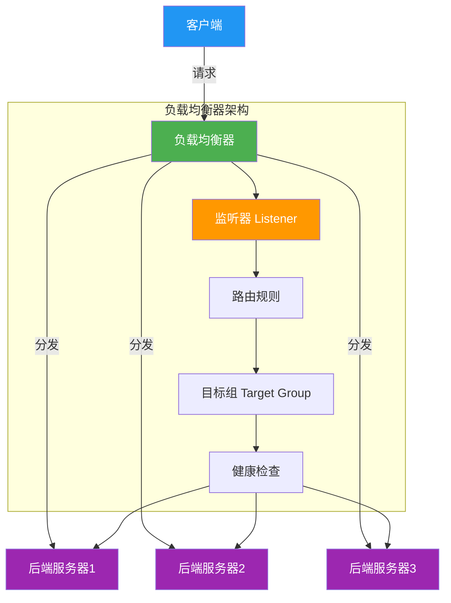
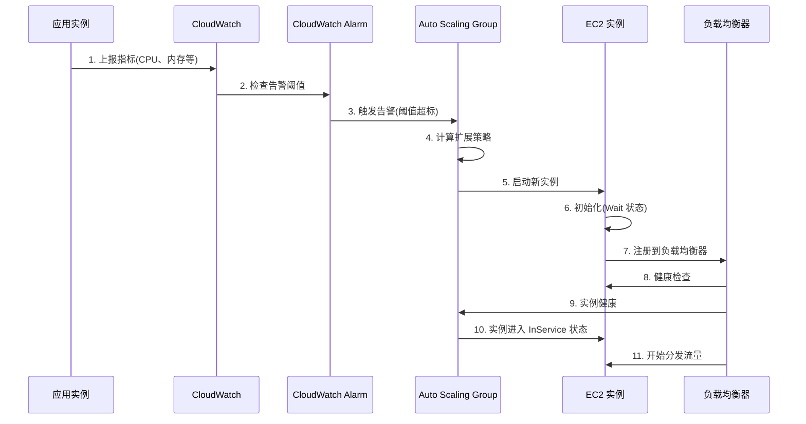
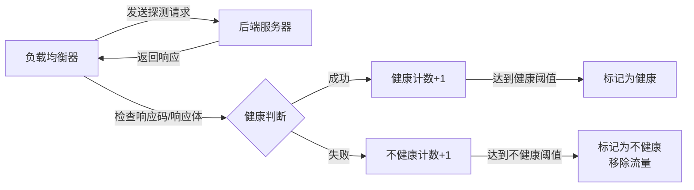

# 第7章 弹性伸缩与负载均衡 — 综合练习题

> [!info] 题型说明
> 本习题集共 **32 题**,包含多种题型,建议用时 120 分钟完成。
> - 单选题(11 题)
> - 多选题(6 题)
> - 判断题(5 题)
> - 简答题(4 题)
> - 计算题(4 题)
> - 实操题(2 题)

---

## 一、单项选择题(每题 3 分,共 33 分)

### 第 1 题

Auto Scaling 的核心作用是?

A. 提升单个实例的性能
B. 根据负载自动调整实例数量
C. 替换故障实例
D. 提供负载均衡功能

<details>
<summary>查看答案与解析</summary>

**答案：B**

**解析**：Auto Scaling 的核心作用是根据负载(如 CPU、内存、请求量)自动调整实例数量,实现横向扩展(Scale Out)和收缩(Scale In)。虽然 Auto Scaling 也会替换故障实例(C),但核心是弹性伸缩。

</details>

---

### 第 2 题

以下哪种负载均衡算法会将请求分发到当前连接数最少的服务器?

A. 轮询(Round Robin)
B. 最少连接(Least Connections)
C. 源地址哈希(Source Hashing)
D. 加权轮询(Weighted Round Robin)

<details>
<summary>查看答案与解析</summary>

**答案：B**

**解析**：
- **最少连接(Least Connections)**:将请求分发到当前连接数最少的服务器,适合长连接场景
- 轮询(Round Robin):按顺序分发,不考虑负载
- 源地址哈希(Source Hashing):根据客户端 IP 哈希分发,会话保持
- 加权轮询(Weighted Round Robin):根据权重分发,适合异构服务器

</details>

---

### 第 3 题

AWS Auto Scaling 的冷却时间(Cooldown)的作用是?

A. 防止实例过热
B. 防止频繁的扩缩容操作
C. 延迟扩容操作
D. 限制最大实例数

<details>
<summary>查看答案与解析</summary>

**答案：B**

**解析**：冷却时间(Cooldown)是 Auto Scaling 在执行扩容或缩容后等待的时间,防止短时间内多次扩缩容导致资源浪费或服务不稳定。例如:扩容后等待 5 分钟再评估是否需要继续扩容。

</details>

---

### 第 4 题

负载均衡器的健康检查(Health Check)作用是?

A. 监控服务器 CPU 使用率
B. 检测后端服务器是否健康,自动移除故障服务器
C. 加密客户端与服务器之间的流量
D. 加速内容传输

<details>
<summary>查看答案与解析</summary>

**答案：B**

**解析**：健康检查通过定期向后端服务器发送探测请求(如 HTTP GET /health),检测服务器是否健康。如果服务器连续多次健康检查失败,负载均衡器会自动将其从后端池中移除,流量分发到其他健康服务器。

</details>

---

### 第 5 题

以下哪种场景不适合使用 Auto Scaling?

A. Web 应用流量波动大
B. 批处理任务定期执行
C. 数据库主库(单实例)
D. 微服务架构

<details>
<summary>查看答案与解析</summary>

**答案：C**

**解析**：
- Web 应用流量波动大(A):适合 Auto Scaling,根据流量自动扩缩容
- 批处理任务定期执行(B):适合 Auto Scaling,定时扩容
- **数据库主库(C)**:单实例架构,不适合 Auto Scaling(数据库扩展应使用读写分离、分片)
- 微服务架构(D):适合 Auto Scaling,每个微服务独立伸缩

</details>

---

### 第 6 题

负载均衡器的会话保持(Session Affinity)机制的作用是?

A. 加密会话数据
B. 将同一客户端的请求始终分发到同一后端服务器
C. 限制客户端请求数
D. 缓存会话数据

<details>
<summary>查看答案与解析</summary>

**答案：B**

**解析**：会话保持(也称为会话粘滞,Sticky Session)将同一客户端的请求始终分发到同一后端服务器,确保会话状态一致性。适用于有状态应用(如购物车、登录状态)。实现方式:源 IP 哈希、Cookie 插入等。

</details>

---

### 第 7 题

以下哪项不是 Auto Scaling 的扩展策略类型?

A. 简单扩展(Simple Scaling)
B. 步进扩展(Step Scaling)
C. 目标跟踪扩展(Target Tracking Scaling)
D. 手动扩展(Manual Scaling)

<details>
<summary>查看答案与解析</summary>

**答案：D**

**解析**：Auto Scaling 扩展策略类型:
- **简单扩展**(Simple Scaling):根据阈值触发扩容或缩容,需冷却时间
- **步进扩展**(Step Scaling):根据指标值范围触发不同扩展量
- **目标跟踪扩展**(Target Tracking Scaling):设定目标指标(如 CPU 50%),自动调整实例数维持目标

手动扩展不是策略类型,是手动调整实例数的行为。

</details>

---

### 第 8 题

AWS CloudWatch 的主要作用是?

A. 提供计算资源
B. 监控 AWS 资源和应用指标
C. 配置网络
D. 管理数据库

<details>
<summary>查看答案与解析</summary>

**答案：B**

**解析**：CloudWatch 是 AWS 的监控服务,用于:
- 监控 AWS 资源(EC2、RDS、ELB 等)的指标(CPU、内存、网络、磁盘)
- 监控自定义应用指标
- 设置告警,触发 Auto Scaling 或通知
- 存储日志和事件

CloudWatch 是 Auto Scaling 触发扩展的主要数据源。

</details>

---

### 第 9 题

负载均衡器监听器(Listener)的作用是?

A. 监听服务器故障
B. 定义监听的协议和端口
C. 监听客户端请求
D. 监听网络流量

<details>
<summary>查看答案与解析</summary>

**答案：B**

**解析**：负载均衡器监听器(Listener)定义:
- 监听协议(HTTP、HTTPS、TCP、TLS)
- 监听端口(如 80、443)
- SSL 证书配置(HTTPS 监听器)
- 路由规则(基于路径、主机名的路由)

监听器接收客户端请求,根据路由规则分发到目标组(Target Group)。

</details>

---

### 第 10 题

以下哪种负载均衡算法最适合服务器性能差异较大的场景?

A. 轮询(Round Robin)
B. 最少连接(Least Connections)
C. 加权轮询(Weighted Round Robin)
D. 随机(Random)

<details>
<summary>查看答案与解析</summary>

**答案：C**

**解析**：加权轮询(Weighted Round Robin)根据服务器性能(权重)分发请求:
- 性能强的服务器权重高,接收更多请求
- 性能弱的服务器权重低,接收较少请求
- 适合异构服务器集群(如 4 核服务器和 16 核服务器混合)

轮询(A)和随机(D)不考虑性能差异,最少连接(B)适合长连接场景。

</details>

---

### 第 11 题

Auto Scaling 组(ASG)的最小/最大/期望容量设置的目的是?

A. 限制实例性能
B. 控制实例数量范围,平衡成本与可用性
C. 限制实例存储
D. 控制实例启动时间

<details>
<summary>查看答案与解析</summary>

**答案：B**

**解析**：ASG 容量设置:
- **最小容量**(Min Size):最低实例数,保证可用性
- **最大容量**(Max Size):最高实例数,控制成本
- **期望容量**(Desired Capacity):目标实例数,ASG 会调整到该数量

这些设置平衡成本与可用性,避免过度扩容导致成本失控。

</details>

---

## 二、多项选择题(每题 4 分,共 24 分)

### 第 12 题

Auto Scaling 的触发指标包括?(多选)

A. CPU 利用率
B. 内存利用率
C. 网络流量
D. 请求队列长度
E. 磁盘空间

<details>
<summary>查看答案与解析</summary>

**答案：A、B、C、D、E**

**解析**：Auto Scaling 可根据多种指标触发扩展:
- **CPU 利用率**(A):最常用指标
- **内存利用率**(B):适合内存密集型应用
- **网络流量**(C):适合网络密集型应用
- **请求队列长度**(D):适合请求处理场景
- **磁盘空间**(E):适合存储密集型应用

其他指标:响应时间、错误率、自定义指标等。

</details>

---

### 第 13 题

负载均衡算法的类型包括?(多选)

A. 轮询(Round Robin)
B. 最少连接(Least Connections)
C. 源地址哈希(Source Hashing)
D. 加权轮询(Weighted Round Robin)
E. 随机(Random)

<details>
<summary>查看答案与解析</summary>

**答案：A、B、C、D、E**

**解析**：负载均衡算法类型:
- **轮询**(Round Robin):按顺序分发
- **最少连接**(Least Connections):分发到连接数最少的服务器
- **源地址哈希**(Source Hashing):根据客户端 IP 哈希分发
- **加权轮询**(Weighted Round Robin):根据权重分发
- **随机**(Random):随机选择服务器

</details>

---

### 第 14 题

AWS 负载均衡器的类型包括?(多选)

A. ALB(Application Load Balancer)
B. NLB(Network Load Balancer)
C. CLB(Classic Load Balancer)
D. GLB(Gateway Load Balancer)
E. PLB(Proxy Load Balancer)

<details>
<summary>查看答案与解析</summary>

**答案：A、B、C、D**

**解析**：AWS 负载均衡器类型:
- **ALB**(Application Load Balancer):应用层(HTTP/HTTPS)负载均衡,支持路径路由、主机路由
- **NLB**(Network Load Balancer):传输层(TCP/UDP)负载均衡,超高性能,低延迟
- **CLB**(Classic Load Balancer):经典负载均衡器(已弃用)
- **GLB**(Gateway Load Balancer):网关负载均衡器,用于第三方网络设备

PLB(E)不是 AWS 负载均衡器类型。

</details>

---

### 第 15 题

Auto Scaling 的扩展策略类型包括?(多选)

A. 简单扩展(Simple Scaling)
B. 步进扩展(Step Scaling)
C. 目标跟踪扩展(Target Tracking Scaling)
D. 预测性扩展(Predictive Scaling)
E. 手动扩展(Manual Scaling)

<details>
<summary>查看答案与解析</summary>

**答案：A、B、C、D**

**解析**：Auto Scaling 扩展策略类型:
- **简单扩展**(A):根据阈值触发,需冷却时间
- **步进扩展**(B):根据指标范围触发不同扩展量
- **目标跟踪扩展**(C):设定目标指标,自动调整实例数
- **预测性扩展**(D):基于历史数据预测负载,提前扩容

手动扩展(E)不是策略类型,是手动操作。

</details>

---

### 第 16 题

负载均衡器健康检查的配置项包括?(多选)

A. 检查协议(HTTP/TCP/HTTPS)
B. 检查路径(如 /health)
C. 健康阈值(连续成功次数)
D. 不健康阈值(连续失败次数)
E. 检查间隔(秒)

<details>
<summary>查看答案与解析</summary>

**答案：A、B、C、D、E**

**解析**：健康检查配置项:
- **检查协议**(A):HTTP、HTTPS、TCP
- **检查路径**(B):如 /health、/status
- **健康阈值**(C):连续成功次数后标记为健康
- **不健康阈值**(D):连续失败次数后标记为不健康
- **检查间隔**(E):两次检查之间的时间间隔(如 30 秒)
- 其他:超时时间、返回码等

</details>

---

### 第 17 题

Auto Scaling 的应用场景包括?(多选)

A. Web 应用流量波动
B. 批处理任务定时执行
C. 视频转码任务队列
D. 数据库读写分离
E. 微服务弹性伸缩

<details>
<summary>查看答案与解析</summary>

**答案：A、B、C、E**

**解析**：Auto Scaling 应用场景:
- **Web 应用流量波动**(A):根据流量自动扩缩容
- **批处理任务定时执行**(B):定时扩容,任务完成后缩容
- **视频转码任务队列**(C):根据队列长度扩容
- **微服务弹性伸缩**(E):每个微服务独立伸缩

数据库读写分离(D)不使用 Auto Scaling,使用数据库自身的扩展机制。

</details>

---

## 三、判断题(每题 2 分,共 10 分)

### 第 18 题

Auto Scaling 可以完全替代负载均衡器。

<details>
<summary>查看答案与解析</summary>

**答案：错误**

**解析**：Auto Scaling 和负载均衡器是互补关系,不能互相替代:
- **Auto Scaling**:根据负载调整实例数量
- **负载均衡器**:分发流量到多个实例

Auto Scaling 扩容的实例需要负载均衡器分发流量,两者配合使用。

</details>

---

### 第 19 题

负载均衡器的健康检查失败后,服务器会立即被移除。

<details>
<summary>查看答案与解析</summary>

**答案：错误**

**解析**：健康检查失败后,需要连续失败达到**不健康阈值**(如 3 次)才会被标记为不健康并移除。单次失败不会立即移除,避免误判。

</details>

---

### 第 20 题

Auto Scaling 的冷却时间仅在扩容后生效。

<details>
<summary>查看答案与解析</summary>

**答案：错误**

**解析**：冷却时间在**扩容和缩容后都生效**。例如:扩容后等待 5 分钟冷却,缩容后也等待 5 分钟冷却,防止频繁操作。

</details>

---

### 第 21 题

负载均衡器可以解决所有单点故障问题。

<details>
<summary>查看答案与解析</summary>

**答案：错误**

**解析**：负载均衡器可以解决后端服务器的单点故障,但**负载均衡器本身也是单点**,需要配置多可用区部署或使用云服务商的托管负载均衡器(如 AWS ALB、Azure Load Balancer)来避免负载均衡器的单点故障。

</details>

---

### 第 22 题

目标跟踪扩展策略会自动计算所需的实例数量。

<details>
<summary>查看答案与解析</summary>

**答案：正确**

**解析**：目标跟踪扩展策略(Target Tracking Scaling)设定目标指标(如 CPU 50%),Auto Scaling 自动计算需要多少实例才能维持目标指标,无需手动设置扩展规则。例如:CPU 超过 50%,自动扩容;CPU 低于 50%,自动缩容。

</details>

---

## 四、简答题(每题 6 分,共 24 分)

### 第 23 题

对比 Auto Scaling 的三种扩展策略(简单扩展、步进扩展、目标跟踪扩展)的原理与适用场景。

<details>
<summary>查看参考答案</summary>

**三种扩展策略对比**:

| 对比维度 | 简单扩展(Simple Scaling) | 步进扩展(Step Scaling) | 目标跟踪扩展(Target Tracking) |
|---------|------------------------|----------------------|----------------------------|
| **原理** | 根据阈值触发扩展(如 CPU > 70%) | 根据指标范围触发不同扩展量 | 设定目标指标,自动调整实例数 |
| **触发条件** | 单一阈值 | 多个阈值范围(步进) | 目标指标偏离 |
| **扩展粒度** | 固定实例数 | 根据指标范围变化 | 自动计算所需实例数 |
| **冷却时间** | 需要 | 需要 | 不需要(智能调整) |
| **配置复杂度** | 简单 | 中等 | 最简单 |
| **响应速度** | 慢(需冷却) | 中等 | 快(自动计算) |
| **适用场景** | 负载变化简单 | 负载变化有规律 | 负载变化复杂 |

**详细说明**:

**1. 简单扩展(Simple Scaling)**:

**原理**:
- 设置单一阈值(如 CPU > 70%)
- 触发条件满足时,增加固定实例数(如 +1)
- 需要冷却时间,防止频繁扩展

**示例配置**:
```
触发条件: CPU > 70%
动作: 增加 1 个实例
冷却时间: 5 分钟
```

**适用场景**:
- 负载变化简单,扩展需求固定
- 成本敏感场景(控制扩展速度)
- 示例:内部工具、低流量应用

**缺点**:
- 响应慢(需冷却时间)
- 可能过度扩展或扩展不足

---

**2. 步进扩展(Step Scaling)**:

**原理**:
- 设置多个阈值范围(步进)
- 不同范围触发不同的扩展量
- 根据负载严重程度调整扩展速度

**示例配置**:
```
触发条件                    扩展量
CPU > 60% 且 <= 70%    →   +1
CPU > 70% 且 <= 80%    →   +2
CPU > 80%              →   +3
```

**适用场景**:
- 负载变化有规律,可根据严重程度调整
- 需要快速响应的场景
- 示例:电商网站、SaaS 应用

**优点**:
- 响应快(负载高时快速扩展)
- 扩展更精细

---

**3. 目标跟踪扩展(Target Tracking Scaling)**:

**原理**:
- 设定目标指标(如 CPU 50%)
- Auto Scaling 自动计算所需实例数
- 实时调整实例数,维持目标指标

**示例配置**:
```
目标指标: CPU = 50%
Auto Scaling 自动调整实例数,使平均 CPU 维持在 50%
```

**计算逻辑**:
```
所需实例数 = 当前实例数 × 当前指标 ÷ 目标指标

示例:
当前实例数: 5
当前 CPU: 80%
目标 CPU: 50%
所需实例数 = 5 × 80% ÷ 50% = 8 个实例
```

**适用场景**:
- 负载变化复杂,难以预测
- 需要自动优化的场景
- 示例:Web 应用、微服务、API 服务

**优点**:
- 配置最简单(只需设置目标)
- 自动计算,无需手动调参
- 响应快(无冷却时间)

**缺点**:
- 可能过度扩展(需设置最大实例数限制)
- 成本控制需谨慎

---

**选型建议**:

| 场景 | 推荐策略 | 理由 |
|------|---------|------|
| 简单应用,固定扩展需求 | 简单扩展 | 配置简单,成本可控 |
| 电商大促,需快速响应 | 步进扩展 | 根据负载严重程度快速扩展 |
| 复杂应用,难以预测负载 | 目标跟踪扩展 | 自动优化,简化运维 |
| 成本敏感,控制扩展速度 | 简单扩展 + 冷却时间 | 避免过度扩展 |

**最佳实践**:
1. 先使用目标跟踪扩展(配置最简单)
2. 监控实际扩展效果,优化目标指标
3. 如需精细控制,改用步进扩展
4. 设置最大实例数限制,防止成本失控

</details>

---

### 第 24 题

解释负载均衡器的架构组成,并说明 L4 负载均衡与 L7 负载均衡的区别。

<details>
<summary>查看参考答案</summary>

**负载均衡器架构组成**:



**核心组件说明**:

| 组件 | 作用 |
|------|------|
| **监听器(Listener)** | 定义监听协议和端口(HTTP 80、HTTPS 443、TCP 3306) |
| **路由规则** | 定义请求分发规则(路径路由、主机路由、权重) |
| **目标组(Target Group)** | 后端服务器池,包含实例列表和端口 |
| **健康检查** | 定期检测后端服务器健康状态,移除故障服务器 |
| **负载均衡算法** | 决定请求分发到哪个后端服务器 |

---

**L4 负载均衡 vs L7 负载均衡**:

| 对比维度 | L4 负载均衡(传输层) | L7 负载均衡(应用层) |
|---------|-------------------|-------------------|
| **工作层** | OSI 第 4 层(传输层) | OSI 第 7 层(应用层) |
| **协议支持** | TCP、UDP | HTTP、HTTPS、gRPC |
| **路由依据** | IP 地址 + 端口号 | URL 路径、主机名、Header、Cookie |
| **性能** | 极高(数据包转发) | 较高(解析应用层协议) |
| **功能** | 简单转发 | 路径路由、主机路由、SSL 卸载、重定向 |
| **健康检查** | TCP 连接检查 | HTTP 健康检查(返回码、响应体) |
| **会话保持** | 源 IP 哈希 | Cookie 插入、应用层会话 |
| **典型产品** | AWS NLB、LVS、F5 LTM | AWS ALB、Nginx、HAProxy |
| **适用场景** | 数据库、游戏服务器、非 HTTP 协议 | Web 应用、微服务、API 网关 |

---

**L4 负载均衡详细说明**:

**工作原理**:
- 基于 IP 地址和端口号转发
- 不解析应用层协议,直接转发数据包
- 性能极高,延迟极低(微秒级)

**路由方式**:
```
客户端请求: 203.0.113.10:80
负载均衡器: 根据算法选择后端服务器
转发到: 10.0.1.10:80 或 10.0.1.11:80
```

**适用场景**:
- 数据库负载均衡(MySQL、PostgreSQL)
- 游戏服务器(非 HTTP 协议)
- 高性能网络应用
- 需要极低延迟的场景

**示例配置**(AWS NLB):
```bash
aws elbv2 create-load-balancer \
  --name my-nlb \
  --type network \
  --subnets subnet-12345
```

---

**L7 负载均衡详细说明**:

**工作原理**:
- 解析应用层协议(HTTP、HTTPS)
- 根据 URL 路径、主机名、Header 等路由
- 支持路径路由、主机路由、重定向等功能

**路由方式**:
```
客户端请求: http://api.example.com/v1/users
负载均衡器: 解析路径 /v1/users
路由规则: /v1/* → 目标组 A
转发到: 目标组 A 的后端服务器
```

**路由规则示例**:
```yaml
路由规则:
  - 路径: /api/*
    目标组: api-target-group
  - 路径: /static/*
    目标组: static-target-group
  - 主机: admin.example.com
    目标组: admin-target-group
```

**适用场景**:
- Web 应用(HTTP/HTTPS)
- 微服务架构(路径路由)
- API 网关
- 需要复杂路由规则的场景

**示例配置**(AWS ALB):
```bash
aws elbv2 create-load-balancer \
  --name my-alb \
  --type application \
  --subnets subnet-12345

# 添加监听器(HTTP 80)
aws elbv2 create-listener \
  --load-balancer-arn arn:aws:elasticloadbalancing:... \
  --protocol HTTP \
  --port 80 \
  --default-actions Type=forward,TargetGroupArn=arn:aws:...
```

---

**选型建议**:

| 场景 | 推荐类型 | 理由 |
|------|---------|------|
| Web 应用(HTTP/HTTPS) | L7 负载均衡 | 支持路径路由、SSL 卸载 |
| 微服务架构 | L7 负载均衡 | 支持路径路由,服务隔离 |
| 数据库负载均衡 | L4 负载均衡 | 极高性能,低延迟 |
| 游戏服务器 | L4 负载均衡 | 支持 TCP/UDP,低延迟 |
| 混合场景 | L4 + L7 | L7 处理 HTTP,L4 处理非 HTTP |

**最佳实践**:
1. Web 应用优先使用 L7 负载均衡
2. 数据库和非 HTTP 协议使用 L4 负载均衡
3. 微服务使用 L7 负载均衡(路径路由)
4. 配置健康检查,确保故障服务器自动移除

</details>

---

### 第 25 题

解释 Auto Scaling 的完整工作流程,从指标监控到实例扩展的详细步骤。

<details>
<summary>查看参考答案</summary>

**Auto Scaling 完整工作流程**:



---

**详细步骤说明**:

**阶段 1: 指标监控(CloudWatch)**

**步骤 1**: 应用实例定期上报指标
- EC2 实例内置 CloudWatch Agent,定期上报指标
- 指标包括:CPU 利用率、网络流量、磁盘 I/O、状态检查
- 自定义指标:应用 QPS、响应时间、错误率

**上报方式**:
```bash
# CloudWatch Agent 配置
{
  "metrics": {
    "metrics_collected": {
      "cpu": {
        "measurement": ["cpu_usage_active"],
        "metrics_collection_interval": 60
      },
      "mem": {
        "measurement": ["mem_used_percent"],
        "metrics_collection_interval": 60
      }
    }
  }
}
```

**步骤 2**: CloudWatch 存储和聚合指标
- CloudWatch 存储指标数据点
- 按时间窗口聚合(如 5 分钟平均值)

---

**阶段 2: 告警触发(CloudWatch Alarm)**

**步骤 3**: 检查告警阈值
- CloudWatch Alarm 定期检查指标
- 判断指标是否超过阈值(如 CPU > 70%)

**告警状态**:
- **OK**: 指标在正常范围
- **ALARM**: 指标超过阈值,触发告警
- **INSUFFICIENT_DATA**: 数据不足

**告警规则示例**:
```bash
aws cloudwatch put-metric-alarm \
  --alarm-name "HighCPU" \
  --metric-name "CPUUtilization" \
  --namespace "AWS/EC2" \
  --statistic "Average" \
  --period 300 \
  --threshold 70 \
  --comparison-operator "GreaterThanThreshold" \
  --evaluation-periods 2 \
  --alarm-actions "arn:aws:autoscaling:..."
```

---

**阶段 3: 扩展决策(Auto Scaling Group)**

**步骤 4**: 计算扩展策略
- ASG 接收告警触发
- 根据扩展策略计算扩展量
- 检查冷却时间是否过期

**扩展策略计算**(目标跟踪示例):
```
当前实例数: 5
当前 CPU: 80%
目标 CPU: 50%
所需实例数 = 5 × 80% ÷ 50% = 8 个实例
扩展量 = 8 - 5 = 3 个实例
```

**检查限制**:
- 当前实例数 + 扩展量 ≤ 最大容量
- 冷却时间已过期
- 没有正在进行的扩展活动

---

**阶段 4: 实例启动(EC2)**

**步骤 5**: 启动新实例
- ASG 调用 EC2 API 启动实例
- 使用启动配置(Launch Configuration)或启动模板(Launch Template)
- 实例进入 Pending 状态

**启动模板示例**:
```json
{
  "ImageId": "ami-12345678",
  "InstanceType": "t3.medium",
  "KeyName": "my-key-pair",
  "SecurityGroupIds": ["sg-12345678"],
  "UserData": "IyEvbi9iaW4v... (Base64 编码)"
}
```

**步骤 6**: 实例初始化(Wait 状态)
- 实例启动操作系统
- 执行 UserData 脚本(安装依赖、启动应用)
- 实例等待 ASG 生命周期钩子(Lifecycle Hook)

---

**阶段 5: 注册到负载均衡器(ELB)**

**步骤 7**: 注册到负载均衡器
- ASG 将实例注册到目标组(Target Group)
- 实例进入 Initializing 状态

**步骤 8**: 健康检查
- 负载均衡器开始健康检查
- 定期发送探测请求(如 HTTP GET /health)
- 等待健康检查通过

**健康检查配置**:
```json
{
  "HealthCheckIntervalSeconds": 30,
  "HealthCheckPath": "/health",
  "HealthCheckPort": "80",
  "HealthCheckProtocol": "HTTP",
  "HealthCheckTimeoutSeconds": 5,
  "HealthyThresholdCount": 3,
  "UnhealthyThresholdCount": 2
}
```

**步骤 9**: 实例健康
- 连续健康检查成功达到阈值(如 3 次)
- 实例标记为健康状态

---

**阶段 6: 实例进入服务(InService)**

**步骤 10**: 实例进入 InService 状态
- ASG 将实例状态改为 InService
- 实例正式加入服务

**步骤 11**: 开始分发流量
- 负载均衡器开始向新实例分发流量
- 扩展完成

---

**扩展时间线示例**:

| 时间 | 事件 | 状态 |
|------|------|------|
| 00:00 | CloudWatch 检测到 CPU > 70% | ALARM |
| 00:01 | CloudWatch Alarm 触发 ASG | - |
| 00:02 | ASG 计算扩展策略,决定增加 2 个实例 | - |
| 00:03 | EC2 启动实例 1 和实例 2 | Pending |
| 00:05 | 实例操作系统启动完成 | Pending |
| 00:07 | UserData 脚本执行完成 | Pending |
| 00:08 | 实例注册到负载均衡器 | Initializing |
| 00:08-00:10 | 健康检查(3 次成功) | - |
| 00:10 | 实例健康,进入 InService | InService |
| 00:11 | 负载均衡器开始分发流量 | - |

**总耗时**: 约 10-15 分钟(取决于实例初始化时间)

---

**缩容流程**(Scale In):

缩容流程类似,但需考虑:
1. **实例保护**:避免终止关键实例
2. **优雅终止**:等待连接 draining
3. **冷却时间**:避免频繁缩容

</details>

---

### 第 26 题

解释负载均衡器的健康检查机制和会话保持机制,并说明各自的配置要点。

<details>
<summary>查看参考答案</summary>

**一、健康检查机制**

**健康检查作用**:
- 定期检测后端服务器健康状态
- 自动移除故障服务器,保证服务可用性
- 自动恢复服务器,无需人工干预

**健康检查流程**:



**健康检查配置项**:

| 配置项 | 说明 | 典型值 |
|-------|------|--------|
| **检查协议** | HTTP、HTTPS、TCP | HTTP |
| **检查路径** | 探测请求的路径 | /health、/status |
| **检查端口** | 探测请求的端口 | 80、8080 |
| **检查间隔** | 两次检查之间的时间间隔 | 30 秒 |
| **超时时间** | 单次检查的超时时间 | 5 秒 |
| **健康阈值** | 连续成功次数后标记为健康 | 3 次 |
| **不健康阈值** | 连续失败次数后标记为不健康 | 2 次 |
| **返回码** | 判定为健康的 HTTP 状态码 | 200-299 |

**健康检查示例配置**:

**AWS ALB 目标组健康检查**:
```json
{
  "HealthCheckEnabled": true,
  "HealthCheckIntervalSeconds": 30,
  "HealthCheckPath": "/health",
  "HealthCheckPort": "8080",
  "HealthCheckProtocol": "HTTP",
  "HealthCheckTimeoutSeconds": 5,
  "HealthyThresholdCount": 3,
  "UnhealthyThresholdCount": 2,
  "Matcher": {
    "HttpCode": "200-299"
  }
}
```

**Nginx 健康检查**:
```nginx
upstream backend {
  server 10.0.1.10:8080 max_fails=2 fail_timeout=30s;
  server 10.0.1.11:8080 max_fails=2 fail_timeout=30s;
  
  # 主动健康检查(需 Nginx Plus)
  health_check interval=30s fails=2 passes=3;
}
```

**健康检查最佳实践**:

1. **检查路径设计**:
   - 路径: /health、/status、/ping
   - 响应: 简单的 JSON 或文本
   - 示例: `{"status": "healthy", "timestamp": "2024-01-01T00:00:00Z"}`

2. **健康检查逻辑**:
   - 检查关键依赖:数据库、缓存、外部服务
   - 返回详细的健康状态
   - 示例:
   ```python
   @app.route('/health')
   def health():
       db_ok = check_database()
       cache_ok = check_redis()
       if db_ok and cache_ok:
           return {"status": "healthy"}, 200
       else:
           return {"status": "unhealthy"}, 503
   ```

3. **配置建议**:
   - 检查间隔: 30 秒(避免过于频繁)
   - 健康阈值: 3 次(避免误判)
   - 不健康阈值: 2 次(快速检测故障)
   - 超时时间: 5 秒(避免阻塞)

---

**二、会话保持机制**

**会话保持作用**:
- 将同一客户端的请求始终分发到同一后端服务器
- 保证会话状态一致性(如购物车、登录状态)
- 避免会话丢失

**会话保持类型**:

| 类型 | 实现方式 | 优点 | 缺点 |
|------|---------|------|------|
| **源 IP 哈希** | 根据客户端 IP 哈希分发 | 简单,无需修改应用 | 客户端 IP 变化时会话丢失 |
| **Cookie 插入** | 负载均衡器插入 Cookie | 稳定,客户端 IP 变化不影响 | 需客户端支持 Cookie |
| **应用层会话** | 应用自定义会话 ID | 最灵活,可控性强 | 需应用实现 |

**1. 源 IP 哈希(Source IP Hashing)**:

**原理**:
```
客户端 IP: 203.0.113.10
哈希值: hash(203.0.113.10) % N (N 为后端服务器数)
分发到: 服务器 2
```

**优点**:
- 实现简单,无需修改应用
- 性能高(哈希计算开销小)

**缺点**:
- 客户端 IP 变化时会话丢失(如移动网络切换)
- 负载不均衡(某些 IP 流量大)

**适用场景**:
- 客户端 IP 固定(如企业内网)
- 无需 Cookie 支持的场景

**配置示例**(AWS ALB):
```bash
aws elbv2 modify-target-group-attributes \
  --target-group-arn arn:aws:... \
  --attributes Key=stickiness.enabled,Value=true \
               Key=stickiness.type,Value=source_ip
```

**2. Cookie 插入(Cookie Insertion)**:

**原理**:
```
首次请求:
客户端 → 负载均衡器 → 服务器 2
负载均衡器插入 Cookie: ServerID=server2

后续请求:
客户端 → 负载均衡器(携带 Cookie: ServerID=server2)
负载均衡器根据 Cookie 分发到服务器 2
```

**优点**:
- 稳定,客户端 IP 变化不影响
- 负载均衡性好

**缺点**:
- 需客户端支持 Cookie
- Cookie 泄露风险(需加密)

**适用场景**:
- Web 应用(浏览器客户端)
- 需要稳定会话的场景

**配置示例**(AWS ALB):
```bash
aws elbv2 modify-target-group-attributes \
  --target-group-arn arn:aws:... \
  --attributes Key=stickiness.enabled,Value=true \
               Key=stickiness.type,Value=lb_cookie \
               Key=stickiness.duration_seconds,Value=86400
```

**Cookie 配置项**:
- Cookie 名称:AWSALB(默认)、自定义
- Cookie 有效期:1 小时 - 7 天
- Cookie 路径:/(默认)

**3. 应用层会话(Application-Layer Session)**:

**原理**:
```
应用生成会话 ID: session_id=abc123
负载均衡器根据会话 ID 路由(需支持)
```

**优点**:
- 最灵活,完全可控
- 支持复杂会话逻辑

**缺点**:
- 需应用实现会话管理
- 复杂度高

**适用场景**:
- 复杂业务逻辑
- 需要自定义会话管理

**最佳实践**:
- 推荐使用 Cookie 插入(稳定性最好)
- 配合分布式会话存储(Redis、Memcached)
- 避免会话过大(影响性能)

---

**会话保持配置要点**:

| 配置项 | 说明 | 建议值 |
|-------|------|--------|
| **会话保持类型** | 源 IP、Cookie、应用层 | Cookie(稳定性最好) |
| **会话有效期** | 会话保持持续时间 | 1 小时 - 24 小时 |
| **会话存储** | 分布式会话存储 | Redis、Memcached |
| **故障转移** | 服务器故障时是否转移会话 | 是(配合会话存储) |

**会话保持配置示例**(Nginx):
```nginx
upstream backend {
  ip_hash;  # 源 IP 哈希
  
  server 10.0.1.10:8080;
  server 10.0.1.11:8080;
}

# 或使用 Cookie 插入(需第三方模块)
upstream backend {
  server 10.0.1.10:8080;
  server 10.0.1.11:8080;
  
  sticky cookie srv_id expires=1h domain=.example.com path=/;
}
```

**会话保持最佳实践**:
1. 使用 Cookie 插入(稳定性最好)
2. 配合分布式会话存储(Redis)
3. 设置合理的会话有效期
4. 监控会话分布,避免单服务器过载
5. 配置健康检查,确保故障服务器移除

</details>

---

## 五、计算题(每题 8 分,共 32 分)

### 第 27 题：Auto Scaling 扩展计算

某 Web 应用当前运行 5 个实例,监控指标如下:

- 当前 CPU 利用率: 80%
- 当前请求量: 10,000 QPS
- 目标 CPU 利用率: 50%

假设请求量与 CPU 利用率成正比,请计算:

1. 如果使用目标跟踪扩展策略,需要多少个实例才能将 CPU 降至 50%?
2. 如果请求量增加到 15,000 QPS,需要多少个实例?
3. 若 Auto Scaling 组最小容量为 2,最大容量为 20,是否需要调整?
4. 如果每个实例成本为 $0.10/小时,当前配置的月成本是多少?

<details>
<summary>查看参考答案</summary>

**1. 计算目标跟踪扩展所需实例数**

目标跟踪扩展策略根据目标指标自动计算所需实例数:

```
所需实例数 = 当前实例数 × 当前指标 ÷ 目标指标
```

**计算**:
- 当前实例数: 5
- 当前 CPU: 80%
- 目标 CPU: 50%
- 所需实例数 = 5 × 80% ÷ 50% = **8 个实例**

**验证**:
- 扩展后实例数: 8
- 预期 CPU: 80% × 5 ÷ 8 = 50% ✓

**2. 计算请求量增加后的实例数**

请求量与 CPU 利用率成正比:
- 请求量增加: 10,000 QPS → 15,000 QPS
- 增长比例: 15,000 ÷ 10,000 = 1.5 倍

**计算新实例数**:
- 当前实例数: 8(已扩展)
- 新请求量对应 CPU: 50% × 1.5 = 75%
- 所需实例数 = 8 × 75% ÷ 50% = **12 个实例**

或直接计算:
- 所需实例数 = 8 × 15,000 ÷ 10,000 = **12 个实例**

**3. 判断容量限制是否需要调整**

**当前配置**:
- 最小容量: 2
- 最大容量: 20
- 当前需求: 12 个实例

**判断**:
- 最小容量: 12 > 2,满足 ✓
- 最大容量: 12 < 20,满足 ✓

**结论**: 不需要调整容量限制。

**建议**: 若请求量持续增长,建议增加最大容量到 30,预留扩展空间。

**4. 计算月成本**

**当前实例数**: 12 个(假设持续运行)

**单实例成本**:
- 每小时: $0.10
- 每天: $0.10 × 24 = $2.40
- 每月: $2.40 × 30 = $72

**总成本**:
- 月成本: $72 × 12 = **$864/月**

**成本优化建议**:
1. 使用 Spot 实例(折扣高达 90%): 成本降低到 $86.4/月
2. 使用预留实例(折扣 30-60%): 成本降低到 $345-604/月
3. 缩容策略:夜间流量低时自动缩容

**完整计算汇总表**:

| 场景 | 实例数 | CPU 利用率 | 月成本 |
|------|--------|-----------|--------|
| 当前状态 | 5 | 80% | $360 |
| 目标跟踪扩展后 | 8 | 50% | $576 |
| 请求量增加后 | 12 | 50% | $864 |
| Spot 实例(优化) | 12 | 50% | $86.4 |
| 预留实例(优化) | 12 | 50% | $345-604 |

</details>

---

### 第 28 题：负载均衡性能计算

某负载均衡器配置如下:

- 后端服务器数: 10 台
- 单台服务器处理能力: 1,000 QPS
- 健康检查间隔: 30 秒
- 健康阈值: 3 次
- 不健康阈值: 2 次

假设:
- 服务器故障率为 5%
- 请求均匀分布

请计算:

1. 系统理论最大处理能力是多少 QPS?
2. 如果 1 台服务器故障,系统处理能力是多少?
3. 从服务器故障到被移除的最长时间是多少?
4. 如果配置了连接 draining(超时 300 秒),故障服务器的连接何时完全终止?

<details>
<summary>查看参考答案</summary>

**1. 计算系统理论最大处理能力**

**单台服务器处理能力**: 1,000 QPS

**系统最大处理能力**:
- 后端服务器数: 10 台
- 系统最大 QPS = 10 × 1,000 = **10,000 QPS**

**2. 计算 1 台服务器故障后的处理能力**

**故障后服务器数**: 10 - 1 = 9 台

**系统处理能力**:
- 处理能力 = 9 × 1,000 = **9,000 QPS**
- 处理能力下降: 10,000 - 9,000 = 1,000 QPS(下降 10%)

**3. 计算服务器故障到被移除的最长时间**

**健康检查配置**:
- 检查间隔: 30 秒
- 不健康阈值: 2 次

**计算最长时间**:
- 服务器故障时刻: T0
- 第一次健康检查: T0 + 30 秒(检测到失败)
- 第二次健康检查: T0 + 60 秒(检测到失败)
- 达到不健康阈值: T0 + 60 秒
- 标记为不健康并移除: T0 + 60 秒

**结论**: 最长时间为 **60 秒**(2 次健康检查)。

**最短时间**:
- 服务器刚完成一次健康检查后故障
- 等待下次检查: 30 秒
- 第二次检查失败: 30 + 30 = 60 秒

因此最长时间和最短时间相同,都是 60 秒。

**4. 计算连接 draining 完全终止时间**

**连接 draining 配置**:
- 超时时间: 300 秒

**时间线**:
- T0 + 60 秒: 服务器被标记为不健康
- T0 + 60 秒: 负载均衡器停止向该服务器分发新请求
- T0 + 60 秒 - T0 + 360 秒: 等待现有连接完成(最长 300 秒)
- T0 + 360 秒: 强制终止所有连接

**结论**: 连接 draining 完全终止时间为 **T0 + 360 秒**(故障后 6 分钟)。

**完整时间线**:

| 时间 | 事件 |
|------|------|
| T0 | 服务器故障 |
| T0 + 30 秒 | 第 1 次健康检查失败 |
| T0 + 60 秒 | 第 2 次健康检查失败,达到不健康阈值 |
| T0 + 60 秒 | 服务器被标记为不健康,停止分发新请求 |
| T0 + 60 秒 - T0 + 360 秒 | 连接 draining,等待现有连接完成 |
| T0 + 360 秒 | 强制终止所有连接,完全移除服务器 |

**优化建议**:
1. 缩短健康检查间隔(如 10 秒),加快故障检测
2. 减少不健康阈值(如 1 次),快速移除故障服务器
3. 缩短连接 draining 时间(如 60 秒),加快故障转移
4. 配置 Auto Scaling,自动替换故障实例

</details>

---

### 第 29 题：扩展策略成本分析

某应用使用 Auto Scaling,配置如下:

**简单扩展策略**:
- 扩展触发条件: CPU > 70%
- 扩展动作: 增加 2 个实例
- 冷却时间: 10 分钟
- 实例成本: $0.10/小时

**步进扩展策略**:
- CPU > 60% 且 ≤ 70%: 增加 1 个实例
- CPU > 70% 且 ≤ 80%: 增加 2 个实例
- CPU > 80%: 增加 3 个实例
- 冷却时间: 5 分钟

假设某天负载变化如下:
- 08:00 - 12:00: CPU 65%,持续 4 小时
- 12:00 - 14:00: CPU 75%,持续 2 小时
- 14:00 - 16:00: CPU 85%,持续 2 小时

初始实例数: 5 个

请计算:

1. 使用简单扩展策略,一天需要多少实例小时?
2. 使用步进扩展策略,一天需要多少实例小时?
3. 哪种策略成本更低?节省多少?

<details>
<summary>查看参考答案</summary>

**1. 计算简单扩展策略实例小时**

**初始状态**:
- 初始实例数: 5 个
- 时间: 00:00 - 08:00(假设 CPU < 70%)

**08:00 - 12:00 (CPU 65%)**:
- CPU 65% < 70%,未触发扩展
- 实例数: 5 个
- 持续时间: 4 小时
- 实例小时: 5 × 4 = 20 小时

**12:00 - 14:00 (CPU 75%)**:
- CPU 75% > 70%,触发扩展
- 扩展动作: 增加 2 个实例
- 实例数: 5 + 2 = 7 个
- 冷却时间: 10 分钟
- 有效运行时间: 2 小时 - 0.17 小时 ≈ 1.83 小时(冷却时间内不触发新扩展)
- 实例小时: 7 × 1.83 ≈ 12.8 小时

**冷却时间(10 分钟)**:
- 冷却期间不触发新扩展
- 实例数: 7 个
- 时间: 10 分钟 = 0.17 小时
- 已计入上述计算

**14:00 - 16:00 (CPU 85%)**:
- CPU 85% > 70%,再次触发扩展
- 但冷却时间已过,可触发新扩展
- 扩展动作: 增加 2 个实例
- 实例数: 7 + 2 = 9 个
- 持续时间: 2 小时
- 实例小时: 9 × 2 = 18 小时

**16:00 - 24:00 (假设 CPU < 70%)**:
- CPU 降低,不触发缩容(简单扩展通常只配置扩容)
- 实例数: 9 个
- 持续时间: 8 小时
- 实例小时: 9 × 8 = 72 小时

**总实例小时**:
- 总计 = 20 + 12.8 + 18 + 72 = **122.8 小时**

---

**2. 计算步进扩展策略实例小时**

**08:00 - 12:00 (CPU 65%)**:
- CPU 65% 在 60%-70% 范围,触发扩展
- 扩展动作: 增加 1 个实例
- 实例数: 5 + 1 = 6 个
- 持续时间: 4 小时
- 冷却时间: 5 分钟(不显著影响)
- 实例小时: 6 × 4 = 24 小时

**12:00 - 14:00 (CPU 75%)**:
- CPU 75% 在 70%-80% 范围,触发扩展
- 扩展动作: 增加 2 个实例
- 实例数: 6 + 2 = 8 个
- 持续时间: 2 小时
- 实例小时: 8 × 2 = 16 小时

**14:00 - 16:00 (CPU 85%)**:
- CPU 85% > 80%,触发扩展
- 扩展动作: 增加 3 个实例
- 实例数: 8 + 3 = 11 个
- 持续时间: 2 小时
- 实例小时: 11 × 2 = 22 小时

**16:00 - 24:00 (假设 CPU < 60%)**:
- CPU 降低,可能触发缩容(假设缩容到初始 5 个)
- 实例数: 5 个
- 持续时间: 8 小时
- 实例小时: 5 × 8 = 40 小时

**总实例小时**:
- 总计 = 24 + 16 + 22 + 40 = **102 小时**

---

**3. 成本对比与节省**

**简单扩展策略成本**:
- 实例小时: 122.8 小时
- 成本: 122.8 × $0.10 = **$12.28/天**

**步进扩展策略成本**:
- 实例小时: 102 小时
- 成本: 102 × $0.10 = **$10.20/天**

**节省成本**:
- 节省: $12.28 - $10.20 = **$2.08/天**
- 年节省: $2.08 × 365 = **$759.20/年**
- 节省比例: $2.08 ÷ $12.28 × 100% = **16.9%**

**结论**:
- 步进扩展策略成本更低,节省 16.9%
- 原因:步进扩展根据负载严重程度精细调整扩展量,避免过度扩展
- 简单扩展策略在 CPU 65% 时不扩展,导致后续需要更多扩展

**优化建议**:
1. 使用目标跟踪扩展策略,自动优化实例数
2. 配置缩容策略,避免夜间资源浪费
3. 设置最大实例数限制,防止成本失控

</details>

---

### 第 30 题：负载均衡流量分配

某应用使用负载均衡器分发流量到 3 台服务器:

- 服务器 A: 处理能力 500 QPS
- 服务器 B: 处理能力 1,000 QPS
- 服务器 C: 处理能力 1,500 QPS

总请求量: 2,500 QPS

请计算:

1. 使用轮询算法,每台服务器分配多少 QPS?是否合理?
2. 使用加权轮询算法(权重与处理能力成正比),如何分配权重和流量?
3. 若服务器 A 故障,剩余服务器是否能承载全部流量?
4. 需要多少台服务器 C 才能承载 10,000 QPS?

<details>
<summary>查看参考答案</summary>

**1. 轮询算法流量分配**

**轮询算法**: 按顺序均匀分发请求,不考虑服务器性能差异

**流量分配**:
- 总请求量: 2,500 QPS
- 服务器数: 3 台
- 每台服务器: 2,500 ÷ 3 ≈ **833 QPS**

**判断是否合理**:
- 服务器 A: 分配 833 QPS > 处理能力 500 QPS ❌ **过载**
- 服务器 B: 分配 833 QPS < 处理能力 1,000 QPS ✓
- 服务器 C: 分配 833 QPS < 处理能力 1,500 QPS ✓

**结论**: 不合理,服务器 A 过载,会导致性能下降或故障。

---

**2. 加权轮询算法流量分配**

**权重计算**: 权重与处理能力成正比

**权重设置**:
- 服务器 A 处理能力: 500 QPS
- 服务器 B 处理能力: 1,000 QPS
- 服务器 C 处理能力: 1,500 QPS
- 总处理能力: 500 + 1,000 + 1,500 = 3,000 QPS

**权重比例**:
- 服务器 A 权重: 500 ÷ 3,000 = 1/6
- 服务器 B 权重: 1,000 ÷ 3,000 = 1/3
- 服务器 C 权重: 1,500 ÷ 3,000 = 1/2

**权重值**(简化为整数):
- 服务器 A 权重: **1**
- 服务器 B 权重: **2**
- 服务器 C 权重: **3**

**流量分配**:
- 总请求量: 2,500 QPS
- 总权重: 1 + 2 + 3 = 6
- 服务器 A: 2,500 × 1 ÷ 6 ≈ **417 QPS** < 500 QPS ✓
- 服务器 B: 2,500 × 2 ÷ 6 ≈ **833 QPS** < 1,000 QPS ✓
- 服务器 C: 2,500 × 3 ÷ 6 ≈ **1,250 QPS** < 1,500 QPS ✓

**结论**: 加权轮询合理分配流量,所有服务器均未过载。

---

**3. 服务器 A 故障后流量承载能力**

**服务器 A 故障后剩余处理能力**:
- 服务器 B: 1,000 QPS
- 服务器 C: 1,500 QPS
- 总处理能力: 1,000 + 1,500 = **2,500 QPS**

**总请求量**: 2,500 QPS

**判断**:
- 总处理能力 = 总请求量 = 2,500 QPS
- **勉强承载**,但无冗余,风险较高

**风险**:
- 如果服务器 B 或 C 再故障,系统将无法承载全部流量
- 负载 100%,性能可能下降

**建议**: 增加服务器,预留冗余。

---

**4. 计算 10,000 QPS 所需服务器 C 数量**

**单台服务器 C 处理能力**: 1,500 QPS

**所需服务器数**:
- 所需实例数 = 10,000 ÷ 1,500 ≈ 6.67 → 向上取整为 **7 台**

**验证**:
- 总处理能力: 7 × 1,500 = 10,500 QPS > 10,000 QPS ✓

**混合服务器方案**:
- 服务器 A: 500 QPS
- 服务器 B: 1,000 QPS
- 服务器 C: 1,500 QPS

**计算混合方案**:
- 假设使用 n 台服务器 C,以及部分 A 和 B
- 优先使用高性能服务器 C,降低成本

**最优方案**:
- 使用 7 台服务器 C:成本 = 7 × 单价 C
- 或混合:1 台 A + 2 台 B + 5 台 C
  - 处理能力: 500 + 2,000 + 7,500 = 10,000 QPS ✓
  - 总实例数: 1 + 2 + 5 = 8 台

**成本优化**:
- 假设成本与性能成正比:
  - 服务器 A 成本: $100/月
  - 服务器 B 成本: $200/月
  - 服务器 C 成本: $300/月

**方案 1: 全部使用服务器 C**:
- 成本: 7 × $300 = $2,100/月

**方案 2: 混合服务器**:
- 成本: 1 × $100 + 2 × $200 + 5 × $300 = $2,000/月

**结论**: 混合方案成本更低($2,000 vs $2,100),但实例数更多(8 台 vs 7 台)。根据运维复杂度和成本权衡选择。

</details>

---

## 六、实操题(每题 8 分,共 16 分)

### 第 31 题：Auto Scaling 配置

使用 AWS CLI 或 Terraform 配置 Auto Scaling:

**需求**:
- Auto Scaling 组名称: web-asg
- 最小实例数: 2
- 最大实例数: 10
- 期望实例数: 3
- 实例类型: t3.medium
- 镜像: ami-12345678
- 目标跟踪扩展策略: CPU 50%
- 健康检查类型: ELB

请写出相应的命令或配置文件。

<details>
<summary>查看参考答案</summary>

**方案一:使用 AWS CLI**

```bash
# 1. 创建启动配置
aws autoscaling create-launch-configuration \
  --launch-configuration-name web-lc \
  --image-id ami-12345678 \
  --instance-type t3.medium \
  --key-name my-key-pair \
  --security-groups sg-12345678 \
  --iam-instance-profile WebServerRole

# 2. 创建 Auto Scaling 组
aws autoscaling create-auto-scaling-group \
  --auto-scaling-group-name web-asg \
  --launch-configuration-name web-lc \
  --min-size 2 \
  --max-size 10 \
  --desired-capacity 3 \
  --vpc-zone-identifier "subnet-12345678,subnet-87654321" \
  --health-check-type ELB \
  --health-check-grace-period 300 \
  --target-group-arns arn:aws:elasticloadbalancing:...

# 3. 创建目标跟踪扩展策略
aws autoscaling put-scaling-policy \
  --auto-scaling-group-name web-asg \
  --policy-name cpu-target-tracking \
  --policy-type TargetTrackingScaling \
  --target-tracking-configuration file://target-tracking.json

# target-tracking.json 内容:
{
  "TargetTrackingConfiguration": {
    "PredefinedMetricSpecification": {
      "PredefinedMetricType": "ASGAverageCPUUtilization"
    },
    "TargetValue": 50.0,
    "ScaleOutCooldown": 300,
    "ScaleInCooldown": 300
  }
}

# 4. 查看 Auto Scaling 组状态
aws autoscaling describe-auto-scaling-groups \
  --auto-scaling-group-name web-asg

# 5. 查看实例状态
aws autoscaling describe-auto-scaling-instances
```

---

**方案二:使用 Terraform**

**main.tf**:

```hcl
# 数据源:获取可用区
data "aws_availability_zones" "available" {
  state = "available"
}

# 创建启动模板
resource "aws_launch_template" "web" {
  name_prefix   = "web-lt"
  image_id      = "ami-12345678"
  instance_type = "t3.medium"
  key_name      = "my-key-pair"

  network_interfaces {
    associate_public_ip_address = true
    security_groups             = [aws_security_group.web.id]
  }

  tag_specifications {
    resource_type = "instance"
    tags = {
      Name = "web-server"
    }
  }

  lifecycle {
    create_before_destroy = true
  }
}

# 创建 Auto Scaling 组
resource "aws_autoscaling_group" "web" {
  name                = "web-asg"
  min_size            = 2
  max_size            = 10
  desired_capacity    = 3
  health_check_type   = "ELB"
  health_check_grace_period = 300
  
  vpc_zone_identifier = [
    aws_subnet.public_a.id,
    aws_subnet.public_b.id
  ]

  launch_template {
    id      = aws_launch_template.web.id
    version = "$Latest"
  }

  target_group_arns = [
    aws_lb_target_group.web.arn
  ]

  tag {
    key                 = "Name"
    value               = "web-asg"
    propagate_at_launch = true
  }
}

# 创建目标跟踪扩展策略
resource "aws_autoscaling_policy" "cpu_target_tracking" {
  name                   = "cpu-target-tracking"
  scaling_adjustment_type = "ChangeInCapacity"
  adjustment_type        = "ChangeInCapacity"
  policy_type            = "TargetTrackingScaling"
  autoscaling_group_name = aws_autoscaling_group.web.name

  target_tracking_configuration {
    predefined_metric_specification {
      predefined_metric_type = "ASGAverageCPUUtilization"
    }
    target_value = 50.0
  }
}

# 输出 Auto Scaling 组名称
output "asg_name" {
  value = aws_autoscaling_group.web.name
}
```

**执行命令**:

```bash
# 初始化 Terraform
terraform init

# 预览变更
terraform plan

# 应用变更
terraform apply

# 查看输出
terraform output

# 验证 Auto Scaling 组
aws autoscaling describe-auto-scaling-groups \
  --auto-scaling-group-name web-asg
```

</details>

---

### 第 32 题：负载均衡器配置

使用 AWS CLI 或 Terraform 配置 Application Load Balancer:

**需求**:
- ALB 名称: web-alb
- 监听器: HTTP 80
- 目标组: web-targets
- 健康检查路径: /health
- 健康检查间隔: 30 秒
- 健康阈值: 3
- 不健康阈值: 2
- 会话保持: 启用,Cookie,有效期 1 小时

请写出相应的命令或配置文件。

<details>
<summary>查看参考答案</summary>

**方案一:使用 AWS CLI**

```bash
# 1. 创建 ALB
ALB_ARN=$(aws elbv2 create-load-balancer \
  --name web-alb \
  --subnets subnet-12345678 subnet-87654321 \
  --security-groups sg-12345678 \
  --query 'LoadBalancers[0].LoadBalancerArn' \
  --output text)

echo "ALB ARN: $ALB_ARN"

# 2. 创建目标组
TG_ARN=$(aws elbv2 create-target-group \
  --name web-targets \
  --protocol HTTP \
  --port 80 \
  --vpc-id vpc-12345678 \
  --health-check-path /health \
  --health-check-interval-seconds 30 \
  --health-check-timeout-seconds 5 \
  --healthy-threshold-count 3 \
  --unhealthy-threshold-count 2 \
  --query 'TargetGroups[0].TargetGroupArn' \
  --output text)

echo "Target Group ARN: $TG_ARN"

# 3. 启用会话保持
aws elbv2 modify-target-group-attributes \
  --target-group-arn $TG_ARN \
  --attributes Key=stickiness.enabled,Value=true \
               Key=stickiness.type,Value=lb_cookie \
               Key=stickiness.duration_seconds,Value=3600

# 4. 创建监听器
LISTENER_ARN=$(aws elbv2 create-listener \
  --load-balancer-arn $ALB_ARN \
  --protocol HTTP \
  --port 80 \
  --default-actions Type=forward,TargetGroupArn=$TG_ARN \
  --query 'Listeners[0].ListenerArn' \
  --output text)

echo "Listener ARN: $LISTENER_ARN"

# 5. 注册目标(假设有 EC2 实例)
aws elbv2 register-targets \
  --target-group-arn $TG_ARN \
  --targets Id=i-12345678 Id=i-87654321

# 6. 查看 ALB DNS 名称
aws elbv2 describe-load-balancers \
  --load-balancer-arns $ALB_ARN \
  --query 'LoadBalancers[0].DNSName' \
  --output text
```

---

**方案二:使用 Terraform**

**main.tf**:

```hcl
# 创建 ALB
resource "aws_lb" "web" {
  name               = "web-alb"
  internal           = false
  load_balancer_type = "application"
  security_groups    = [aws_security_group.alb.id]
  subnets            = [
    aws_subnet.public_a.id,
    aws_subnet.public_b.id
  ]

  enable_deletion_protection = false

  tags = {
    Environment = "production"
  }
}

# 创建目标组
resource "aws_lb_target_group" "web" {
  name     = "web-targets"
  port     = 80
  protocol = "HTTP"
  vpc_id   = aws_vpc.main.id

  health_check {
    enabled             = true
    healthy_threshold   = 3
    interval            = 30
    matcher             = "200"
    path                = "/health"
    port                = "traffic-port"
    protocol            = "HTTP"
    timeout             = 5
    unhealthy_threshold = 2
  }

  stickiness {
    type            = "lb_cookie"
    cookie_duration = 3600
    enabled         = true
  }
}

# 创建监听器
resource "aws_lb_listener" "web" {
  load_balancer_arn = aws_lb.web.arn
  port              = "80"
  protocol          = "HTTP"

  default_action {
    type             = "forward"
    target_group_arn = aws_lb_target_group.web.arn
  }
}

# 创建监听器规则(可选)
resource "aws_lb_listener_rule" "api" {
  listener_arn = aws_lb_listener.web.arn

  action {
    type             = "forward"
    target_group_arn = aws_lb_target_group.api.arn
  }

  condition {
    path_pattern {
      values = ["/api/*"]
    }
  }
}

# 输出 ALB DNS 名称
output "alb_dns_name" {
  value = aws_lb.web.dns_name
}

# 输出目标组 ARN
output "target_group_arn" {
  value = aws_lb_target_group.web.arn
}
```

**执行命令**:

```bash
# 初始化 Terraform
terraform init

# 预览变更
terraform plan

# 应用变更
terraform apply

# 查看输出
terraform output

# 测试 ALB
curl http://$(terraform output -raw alb_dns_name)/health
```

**验证配置**:

```bash
# 查看 ALB
aws elbv2 describe-load-balancers --names web-alb

# 查看目标组
aws elbv2 describe-target-groups --names web-targets

# 查看目标健康状态
aws elbv2 describe-target-health \
  --target-group-arn arn:aws:elasticloadbalancing:...

# 测试会话保持
curl -c cookies.txt http://web-alb-123456.us-east-1.elb.amazonaws.com/
curl -b cookies.txt http://web-alb-123456.us-east-1.elb.amazonaws.com/
# 检查 Cookie: AWSALB=...
```

</details>

---

## 附录：章节知识点速查表

| 考点 | 重要程度 | 关联题目 |
|-----|---------|---------|
| Auto Scaling 基础 | ⭐⭐⭐⭐⭐ | 1, 3, 5, 7, 11, 15, 23, 25, 27, 29, 31 |
| 负载均衡算法 | ⭐⭐⭐⭐⭐ | 2, 6, 10, 13, 30 |
| 负载均衡器架构 | ⭐⭐⭐⭐⭐ | 4, 9, 14, 24, 26, 28, 32 |
| 健康检查 | ⭐⭐⭐⭐ | 4, 16, 26, 28 |
| CloudWatch 监控 | ⭐⭐⭐⭐ | 8, 12, 25 |
| 扩展策略 | ⭐⭐⭐⭐⭐ | 7, 15, 23, 29 |
| 会话保持 | ⭐⭐⭐⭐ | 6, 26 |
| Auto Scaling 实操 | ⭐⭐⭐⭐⭐ | 31 |
| 负载均衡器实操 | ⭐⭐⭐⭐⭐ | 32 |