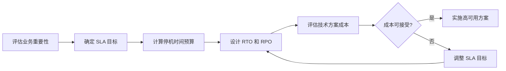
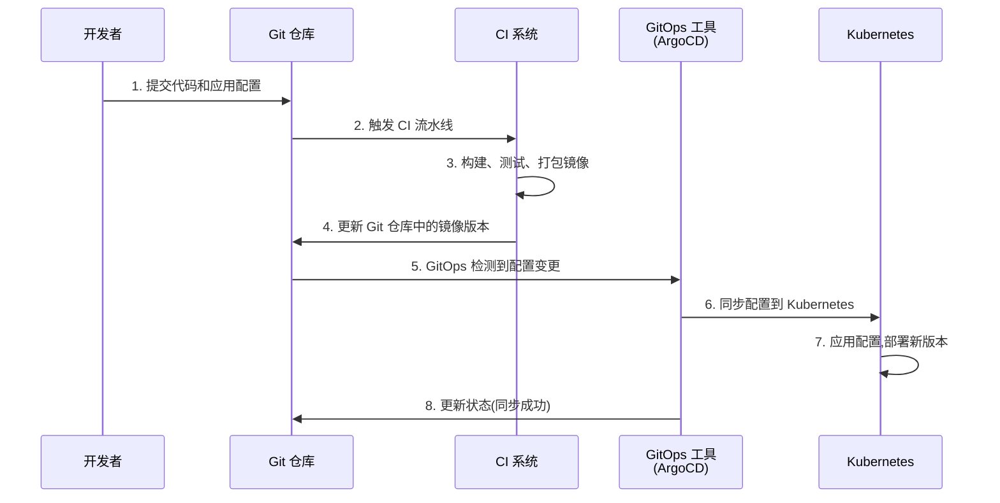

# 第8章 高可用与云运维 — 综合练习题

> [!info] 题型说明
> 本习题集共 **32 题**,包含多种题型,建议用时 120 分钟完成。
> - 单选题(11 题)
> - 多选题(6 题)
> - 判断题(5 题)
> - 简答题(4 题)
> - 计算题(4 题)
> - 实操题(2 题)

---

## 一、单项选择题(每题 3 分,共 33 分)

### 第 1 题

高可用(High Availability, HA)的核心指标 SLA(99.99%)表示?

A. 年停机时间不超过 52.6 分钟
B. 年停机时间不超过 5.26 分钟
C. 年停机时间不超过 1 小时
D. 年停机时间不超过 10 分钟

<details>
<summary>查看答案与解析</summary>

**答案：A**

**解析**：SLA 计算公式:

```
可用性 = (总时间 - 停机时间) ÷ 总时间 × 100%
停机时间 = 总时间 × (1 - 可用性)
```

**99.99% 可用性计算**:
- 年总时间: 365 × 24 × 60 = 525,600 分钟
- 年停机时间: 525,600 × (1 - 99.99%) = 525,600 × 0.0001 = **52.56 分钟 ≈ 52.6 分钟**

**SLA 对照表**:
- 99.9%(3 个 9): 8.76 小时/年
- 99.99%(4 个 9): 52.6 分钟/年
- 99.999%(5 个 9): 5.26 分钟/年

</details>

---

### 第 2 题

RTO(Recovery Time Objective)表示?

A. 数据恢复点
B. 系统恢复时间目标
C. 数据丢失量
D. 系统停机成本

<details>
<summary>查看答案与解析</summary>

**答案：B**

**解析**：
- **RTO(Recovery Time Objective)**:系统恢复时间目标,指系统从故障到恢复正常服务所需的时间
- RPO(Recovery Point Objective):数据恢复点,指可接受的数据丢失量(时间维度)

例如:RTO = 1 小时,表示系统故障后 1 小时内必须恢复。

</details>

---

### 第 3 题

Kubernetes 中负责 Pod 调度的组件是?

A. kubelet
B. kube-apiserver
C. kube-scheduler
D. kube-controller-manager

<details>
<summary>查看答案与解析</summary>

**答案：C**

**解析**：Kubernetes 核心组件:
- **kube-scheduler**(C):负责 Pod 调度,选择合适的节点运行 Pod
- kubelet(A):节点代理,管理节点上的容器
- kube-apiserver(B):API 服务器,集群入口
- kube-controller-manager(D):控制器管理器,维护集群状态

</details>

---

### 第 4 题

以下哪种部署策略可以在不停机的情况下更新应用?

A. 重建部署(Recreate)
B. 滚动更新(Rolling Update)
C. 蓝绿部署(Blue-Green)
D. 金丝雀发布(Canary)

<details>
<summary>查看答案与解析</summary>

**答案：B、C、D**

**解析**：本题答案有误,正确答案是 **B、C、D**(多选)

**部署策略对比**:
- **重建部署(Recreate)**:先停止旧版本,再启动新版本,有停机时间
- **滚动更新(Rolling Update)**:逐步替换旧 Pod,无停机时间
- **蓝绿部署(Blue-Green)**:新版本并行部署,切换流量,无停机时间
- **金丝雀发布(Canary)**:先部署少量新版本,逐步扩大,无停机时间

**注意**:如果题目要求单选,应选 **B(滚动更新)**,这是 Kubernetes 默认部署策略。

</details>

---

### 第 5 题

CI/CD 中的 CD 是指?

A. Continuous Development
B. Continuous Deployment
C. Continuous Delivery
D. Continuous Debugging

<details>
<summary>查看答案与解析</summary>

**答案：B、C**

**解析**：CD 有两个含义:
- **Continuous Deployment**(持续部署):代码自动部署到生产环境
- **Continuous Delivery**(持续交付):代码随时可部署,但需手动触发

两者区别:Continuous Deployment 是全自动的,Continuous Delivery 需手动批准。

本题若单选,建议选 **C(Continuous Delivery)**,这是更通用的定义。

</details>

---

### 第 6 题

Kubernetes Deployment 的作用是?

A. 存储 Pod 配置
B. 管理 Pod 的副本数和更新策略
C. 提供服务发现
D. 存储持久化数据

<details>
<summary>查看答案与解析</summary>

**答案：B**

**解析**：
- **Deployment**(B):管理 Pod 的副本数、更新策略(滚动更新、重建部署)
- ConfigMap(A):存储配置
- Service(C):提供服务发现和负载均衡
- PersistentVolume(D):存储持久化数据

Deployment 是 Kubernetes 最常用的控制器,支持声明式更新和回滚。

</details>

---

### 第 7 题

以下哪项不是 Ansible 的特点?

A. 无代理(Agentless)
B. 使用 SSH 连接
C. 声明式配置
D. 需要在目标主机安装客户端

<details>
<summary>查看答案与解析</summary>

**答案：D**

**解析**：Ansible 特点:
- **无代理(Agentless)**(A):无需在目标主机安装客户端
- **使用 SSH 连接**(B):通过 SSH 协议管理目标主机
- **声明式配置**(C):使用 YAML 描述期望状态

D 错误:Ansible 不需要在目标主机安装客户端,只需 SSH 访问权限。

</details>

---

### 第 8 题

GitOps 的核心思想是?

A. 使用 Git 存储代码
B. 使用 Git 作为单一事实来源,驱动基础设施和应用部署
C. 使用 Git 进行代码审查
D. 使用 Git 管理文档

<details>
<summary>查看答案与解析</summary>

**答案：B**

**解析**：GitOps 核心思想:
- **Git 作为单一事实来源**(Single Source of Truth)
- Git 仓库存储基础设施和应用配置(Kubernetes YAML、Terraform 等)
- Git 提交触发自动化部署
- Git 提交历史记录变更,支持审计和回滚

GitOps 不仅仅是使用 Git 存储代码(A),而是用 Git 驱动整个运维流程。

</details>

---

### 第 9 题

Kubernetes Pod 的生命周期不包括以下哪个阶段?

A. Pending
B. Running
C. Succeeded
D. Stopped

<details>
<summary>查看答案与解析</summary>

**答案：D**

**解析**：Kubernetes Pod 生命周期阶段:
- **Pending**:Pod 已创建,等待调度和启动
- **Running**:Pod 已调度到节点,至少一个容器运行
- **Succeeded**:Pod 中所有容器成功终止(如批处理任务)
- **Failed**:Pod 中所有容器终止,至少一个容器失败
- **Unknown**:无法获取 Pod 状态

**注意**:没有 "Stopped" 阶段,Pod 终止后进入 Succeeded 或 Failed 状态。

</details>

---

### 第 10 题

高可用架构的"异地多活"是指?

A. 在同一城市部署多个数据中心
B. 在不同城市部署多个数据中心,同时提供服务
C. 在同一数据中心部署多个可用区
D. 在不同国家部署备份中心

<details>
<summary>查看答案与解析</summary>

**答案：B**

**解析**：高可用架构类型:
- **同可用区(AZ)**:单可用区部署,可用性最低
- **多可用区(Multi-AZ)**:同一区域不同可用区,提高可用性
- **同城多机房**:同一城市不同数据中心,应对机房级故障
- **异地多活**:不同城市部署多个数据中心,**同时提供服务**,实现灾难容灾

异地多活的特点:
- 多个数据中心同时对外提供服务
- 数据实时同步或异步复制
- 单个城市灾难时,其他城市继续服务

</details>

---

### 第 11 题

Prometheus 的主要作用是?

A. 容器编排
B. 系统监控和告警
C. 日志收集
D. 配置管理

<details>
<summary>查看答案与解析</summary>

**答案：B**

**解析**：
- **Prometheus**(B):开源监控系统,收集指标、存储时序数据、提供告警
- Kubernetes(A):容器编排
- ELK/Fluentd(C):日志收集
- Ansible/Puppet(D):配置管理

Prometheus 是云原生监控的事实标准,配合 Grafana 可视化。

</details>

---

## 二、多项选择题(每题 4 分,共 24 分)

### 第 12 题

高可用架构的设计原则包括?(多选)

A. 消除单点故障
B. 故障隔离
C. 自动故障转移
D. 数据备份
E. 手动恢复

<details>
<summary>查看答案与解析</summary>

**答案：A、B、C、D**

**解析**：高可用架构设计原则:
- **消除单点故障**(A):冗余部署关键组件
- **故障隔离**(B):避免故障扩散(如熔断器)
- **自动故障转移**(C):故障时自动切换到备用节点
- **数据备份**(D):定期备份数据,应对数据丢失

手动恢复(E)不是高可用设计原则,应追求自动化。

</details>

---

### 第 13 题

Kubernetes 的核心组件包括?(多选)

A. kube-apiserver
B. kube-scheduler
C. kube-controller-manager
D. kubelet
E. kube-proxy

<details>
<summary>查看答案与解析</summary>

**答案：A、B、C、D、E**

**解析**：Kubernetes 核心组件:

**控制平面(Master 节点)**:
- **kube-apiserver**(A):API 服务器
- **kube-scheduler**(B):调度器
- **kube-controller-manager**(C):控制器管理器

**工作节点(Node 节点)**:
- **kubelet**(D):节点代理
- **kube-proxy**(E):网络代理

其他组件:etcd(键值存储)、cloud-controller-manager

</details>

---

### 第 14 题

CI/CD 流水线的阶段包括?(多选)

A. 代码构建(Build)
B. 单元测试(Test)
C. 部署(Deploy)
D. 监控(Monitor)
E. 文档生成(Doc)

<details>
<summary>查看答案与解析</summary>

**答案：A、B、C、D**

**解析**：CI/CD 流水线典型阶段:
- **代码构建**(A):编译、打包应用
- **单元测试**(B):运行单元测试、集成测试
- **部署**(C):部署到测试、预生产、生产环境
- **监控**(D):部署后监控应用健康

文档生成(E)不是必需阶段,可选。

</details>

---

### 第 15 题

高可用数据库架构的方案包括?(多选)

A. 主从复制
B. 读写分离
C. 分片(Sharding)
D. 多主复制
E. 单机部署

<details>
<summary>查看答案与解析</summary>

**答案：A、B、C、D**

**解析**：高可用数据库架构方案:
- **主从复制**(A):主库写入,从库读取,故障时可切换
- **读写分离**(B):读请求分发到从库,降低主库压力
- **分片(Sharding)**(C):数据分散到多个节点,提高扩展性
- **多主复制**(D):多个主库同时写入,提高可用性

单机部署(E)不是高可用方案,存在单点故障。

</details>

---

### 第 16 题

Kubernetes 的控制器类型包括?(多选)

A. Deployment
B. StatefulSet
C. DaemonSet
D. Job
E. CronJob

<details>
<summary>查看答案与解析</summary>

**答案：A、B、C、D、E**

**解析**：Kubernetes 控制器类型:
- **Deployment**(A):管理无状态应用,支持滚动更新
- **StatefulSet**(B):管理有状态应用,保持 Pod 标识
- **DaemonSet**(C):在每个节点运行一个 Pod(如日志收集)
- **Job**(D):一次性任务
- **CronJob**(E):定时任务

</details>

---

### 第 17 题

GitOps 的核心工具包括?(多选)

A. ArgoCD
B. Flux
C. Jenkins
D. Spinnaker
E. GitLab CI

<details>
<summary>查看答案与解析</summary>

**答案：A、B**

**解析**：GitOps 核心工具:
- **ArgoCD**(A):Kubernetes 原生 GitOps 工具
- **Flux**(B):CNCF 孵化项目,支持多租户

Jenkins(C)、Spinnaker(D)、GitLab CI(E)是 CI/CD 工具,不是专门的 GitOps 工具。

</details>

---

## 三、判断题(每题 2 分,共 10 分)

### 第 18 题

高可用架构可以保证系统永不宕机。

<details>
<summary>查看答案与解析</summary>

**答案：错误**

**解析**：高可用架构无法保证系统永不宕机,只能**降低停机概率和缩短停机时间**。即使是 99.999% 可用性(5 个 9),每年仍有 5.26 分钟的停机时间。完全消除停机时间是不现实的。

</details>

---

### 第 19 题

Kubernetes 可以自动恢复故障的 Pod。

<details>
<summary>查看答案与解析</summary>

**答案：正确**

**解析**：Kubernetes 的 Deployment/ReplicaSet 控制器会监控 Pod 状态,当 Pod 故障时,自动创建新 Pod 替换,维持期望副本数。这是 Kubernetes 自愈能力的体现。

</details>

---

### 第 20 题

CI/CD 流水线中的自动化测试可以完全替代人工测试。

<details>
<summary>查看答案与解析</summary>

**答案：错误**

**解析**：自动化测试可以提高测试效率,但**不能完全替代人工测试**:
- 自动化测试:单元测试、集成测试、回归测试
- 人工测试:用户体验测试、探索性测试、安全渗透测试

人工测试发现的问题类型与自动化测试不同,两者应结合使用。

</details>

---

### 第 21 题

GitOps 要求所有配置都存储在 Git 仓库中。

<details>
<summary>查看答案与解析</summary>

**答案：正确**

**解析**：GitOps 核心原则:Git 仓库是**单一事实来源**(Single Source of Truth),所有基础设施和应用配置都应存储在 Git 中:
- Kubernetes YAML 文件
- Terraform 配置
- Helm Charts
- 配置文件(ConfigMap、Secret)

任何配置变更都应通过 Git 提交触发,避免手动修改。

</details>

---

### 第 22 题

蓝绿部署需要两倍的服务器资源。

<details>
<summary>查看答案与解析</summary>

**答案：正确**

**解析**：蓝绿部署需要同时运行两个完整的生产环境:
- 蓝环境(Blue):当前版本
- 绿环境(Green):新版本

切换流量时,从蓝环境切换到绿环境,需要两倍资源。优点是无停机时间,缺点是资源成本高。

</details>

---

## 四、简答题(每题 6 分,共 24 分)

### 第 23 题

解释 SLA、RTO、RPO 三个指标的含义,并说明如何根据业务需求设定这些指标。

<details>
<summary>查看参考答案</summary>

**三个指标定义**:

| 指标 | 全称 | 含义 | 单位 |
|------|------|------|------|
| **SLA** | Service Level Agreement | 服务可用性目标,系统正常运行时间的百分比 | 百分比(如 99.9%) |
| **RTO** | Recovery Time Objective | 系统恢复时间目标,从故障到恢复服务的时间 | 时间(小时、分钟) |
| **RPO** | Recovery Point Objective | 数据恢复点目标,可接受的数据丢失量 | 时间(小时、分钟) |

---

**SLA(Service Level Agreement)详解**:

**定义**:服务可用性目标,通常用"几个 9"表示。

**SLA 等级对照表**:

| SLA 等级 | 可用性 | 年停机时间 | 月停机时间 | 典型应用 |
|---------|--------|-----------|-----------|---------|
| 99%(2 个 9) | 99.00% | 87.6 小时 | 7.3 小时 | 内部工具 |
| 99.9%(3 个 9) | 99.90% | 8.76 小时 | 43.8 分钟 | 一般业务 |
| 99.99%(4 个 9) | 99.99% | 52.6 分钟 | 4.4 分钟 | 核心业务 |
| 99.999%(5 个 9) | 99.999% | 5.26 分钟 | 26 秒 | 金融交易 |

**计算公式**:
```
可用性 = (总时间 - 停机时间) ÷ 总时间 × 100%
停机时间 = 总时间 × (1 - 可用性)
```

---

**RTO(Recovery Time Objective)详解**:

**定义**:系统从故障到恢复服务的时间目标。

**影响因素**:
- 故障检测时间
- 故障诊断时间
- 修复时间
- 数据恢复时间

**典型 RTO 目标**:
- 关键系统:RTO < 15 分钟
- 重要系统:RTO < 1 小时
- 一般系统:RTO < 4 小时

---

**RPO(Recovery Point Objective)详解**:

**定义**:可接受的数据丢失量(时间维度)。

**影响因素**:
- 备份频率
- 数据复制方式(同步/异步)
- 数据变更频率

**典型 RPO 目标**:
- 金融交易:RPO = 0(实时同步)
- 核心业务:RPO < 5 分钟
- 一般业务:RPO < 1 小时

---

**如何根据业务需求设定指标**:

**1. 业务重要性评估**:

| 业务等级 | SLA 目标 | RTO 目标 | RPO 目标 | 示例 |
|---------|---------|---------|---------|------|
| **关键业务** | 99.99% | < 15 分钟 | = 0 | 交易系统、支付系统 |
| **重要业务** | 99.9% | < 1 小时 | < 5 分钟 | ERP、CRM |
| **一般业务** | 99% | < 4 小时 | < 1 小时 | OA、内部工具 |

**2. 成本与可用性权衡**:

```
高可用性 → 高成本
低可用性 → 低成本
```

**成本增长规律**:
- 99% → 99.9%:成本增加约 50%
- 99.9% → 99.99%:成本增加约 200%
- 99.99% → 99.999%:成本增加约 500%

**3. 技术方案选择**:

| SLA 目标 | 技术方案 |
|---------|---------|
| 99% | 单机 + 定期备份 |
| 99.9% | 主从复制 + 自动故障转移 |
| 99.99% | 多可用区部署 + 异步复制 |
| 99.999% | 异地多活 + 同步复制 |

**4. 设定流程**:



---

**实际案例**:

**案例 1:电商交易平台**
- SLA:99.99%(年停机时间 < 52.6 分钟)
- RTO:< 15 分钟
- RPO:= 0(数据不丢失)

**技术方案**:
- 多可用区部署
- 数据库主从同步复制
- 自动故障转移
- 实时数据备份

**案例 2:企业 OA 系统**
- SLA:99%(年停机时间 < 87.6 小时)
- RTO:< 4 小时
- RPO:< 1 小时

**技术方案**:
- 单机部署 + 备份
- 每小时自动备份
- 手动故障恢复

</details>

---

### 第 24 题

对比 Kubernetes 的 Deployment、StatefulSet、DaemonSet 三种控制器的使用场景和特点。

<details>
<summary>查看参考答案</summary>

**三种控制器对比**:

| 对比维度 | Deployment | StatefulSet | DaemonSet |
|---------|-----------|------------|-----------|
| **应用类型** | 无状态应用 | 有状态应用 | 系统守护进程 |
| **Pod 标识** | 随机,不固定 | 固定,有序号 | 每节点一个 |
| **存储** | 共享或无状态 | 独立持久化存储 | 本地存储 |
| **启动顺序** | 并行启动 | 有序启动 | 并行启动 |
| **更新策略** | 滚动更新、重建 | 滚动更新、OnDelete | 滚动更新、OnDelete |
| **典型应用** | Web 服务、API | 数据库、缓存 | 日志收集、监控 |
| **Pod 名称** | 随机名称(如 web-abc123) | 固定名称(如 db-0, db-1) | 节点名称(如 node-1) |

---

**Deployment 详细说明**:

**特点**:
- 管理**无状态应用**(Stateless Application)
- Pod 标识不固定,可随时替换
- 支持滚动更新和回滚
- 适合横向扩展

**使用场景**:
- Web 服务器(Nginx、Apache)
- API 服务(RESTful API、gRPC)
- 微服务架构的服务实例
- 前端应用(React、Vue)

**示例**:

```yaml
apiVersion: apps/v1
kind: Deployment
metadata:
  name: web-server
spec:
  replicas: 3
  selector:
    matchLabels:
      app: web
  template:
    metadata:
      labels:
        app: web
    spec:
      containers:
      - name: nginx
        image: nginx:1.20
        ports:
        - containerPort: 80
```

---

**StatefulSet 详细说明**:

**特点**:
- 管理**有状态应用**(Stateful Application)
- Pod 标识固定,有序号(如 db-0, db-1, db-2)
- 每个 Pod 独立的持久化存储
- 有序启动和停止(按序号)

**使用场景**:
- 数据库(MySQL、PostgreSQL、MongoDB)
- 缓存集群(Redis Cluster)
- 消息队列(Kafka、RabbitMQ)
- 分布式存储(Ceph、GlusterFS)

**示例**:

```yaml
apiVersion: apps/v1
kind: StatefulSet
metadata:
  name: mysql
spec:
  serviceName: mysql-headless
  replicas: 3
  selector:
    matchLabels:
      app: mysql
  template:
    metadata:
      labels:
        app: mysql
    spec:
      containers:
      - name: mysql
        image: mysql:8.0
        ports:
        - containerPort: 3306
        volumeMounts:
        - name: data
          mountPath: /var/lib/mysql
  volumeClaimTemplates:
  - metadata:
      name: data
    spec:
      accessModes: ["ReadWriteOnce"]
      resources:
        requests:
          storage: 10Gi
```

**关键配置**:
- `serviceName`:无头服务(Headless Service),用于 Pod 发现
- `volumeClaimTemplates`:为每个 Pod 创建独立 PVC

---

**DaemonSet 详细说明**:

**特点**:
- 在**每个节点**运行一个 Pod 副本
- 新节点加入时自动创建 Pod
- 节点移除时自动删除 Pod
- 适合系统级守护进程

**使用场景**:
- 日志收集(Fluentd、Filebeat)
- 监控代理(Prometheus Node Exporter)
- 网络插件(Calico、Weave Net)
- 存储插件(Ceph RBD、GlusterFS)

**示例**:

```yaml
apiVersion: apps/v1
kind: DaemonSet
metadata:
  name: fluentd
spec:
  selector:
    matchLabels:
      app: fluentd
  template:
    metadata:
      labels:
        app: fluentd
    spec:
      containers:
      - name: fluentd
        image: fluentd:v1.14
        volumeMounts:
        - name: varlog
          mountPath: /var/log
      volumes:
      - name: varlog
        hostPath:
          path: /var/log
```

---

**选型指南**:

| 应用特征 | 推荐控制器 |
|---------|-----------|
| 无状态,可随时替换 | Deployment |
| 需要固定标识或持久化存储 | StatefulSet |
| 需要在每个节点运行 | DaemonSet |
| 批处理任务 | Job |
| 定时任务 | CronJob |

**注意事项**:
1. **Deployment 不适合有状态应用**:Pod 重启后数据丢失
2. **StatefulSet 需要无头服务**:用于 Pod 间通信
3. **DaemonSet 可能占用节点资源**:需设置资源限制

</details>

---

### 第 25 题

解释 CI/CD 流水线的完整流程,并说明每个阶段的作用。

<details>
<summary>查看参考答案</summary>

**CI/CD 流水线完整流程**:


---

**阶段详解**:

**阶段 1: 代码提交(Code Commit)**

**作用**:触发流水线的起点

**流程**:
- 开发者提交代码到 Git 仓库(GitHub、GitLab、Bitbucket)
- Webhook 触发 CI/CD 系统(Jenkins、GitLab CI、GitHub Actions)
- 拉取代码到构建环境

**最佳实践**:
- 配置分支保护规则(如 main 分支需 PR)
- 要求代码审查(Code Review)
- 签名提交(GPG 签名)

---

**阶段 2: 代码构建(Build)**

**作用**:编译代码,生成可执行文件或包

**流程**:
- 安装依赖(npm install、pip install、mvn install)
- 编译代码(gcc、javac、go build)
- 生成构建产物(jar、war、binary)

**示例**:
```bash
# Node.js 项目
npm install
npm run build

# Java 项目
mvn clean package

# Go 项目
go build -o app main.go
```

**最佳实践**:
- 缓存依赖(加速构建)
- 固定依赖版本(避免版本冲突)

---

**阶段 3: 单元测试(Unit Test)**

**作用**:验证代码逻辑正确性

**流程**:
- 运行单元测试框架(Jest、JUnit、pytest)
- 生成测试报告(覆盖率、失败用例)

**示例**:
```bash
# Node.js 项目
npm test

# Java 项目
mvn test

# Python 项目
pytest tests/
```

**最佳实践**:
- 设置覆盖率阈值(如 > 80%)
- 失败时阻止流水线继续

---

**阶段 4: 集成测试(Integration Test)**

**作用**:验证模块间交互正确性

**流程**:
- 启动依赖服务(数据库、缓存)
- 运行集成测试
- 清理测试环境

**示例**:
```bash
# 使用 Docker Compose 启动测试环境
docker-compose -f docker-compose.test.yml up -d
pytest tests/integration/
docker-compose -f docker-compose.test.yml down
```

**最佳实践**:
- 使用容器化测试环境(一致性)
- 隔离测试数据(避免污染)

---

**阶段 5: 代码质量检查(Code Quality Check)**

**作用**:检查代码规范和潜在问题

**流程**:
- 静态代码分析(SonarQube、ESLint、Pylint)
- 安全漏洞扫描(Snyk、OWASP Dependency-Check)
- 代码重复检测

**示例**:
```bash
# SonarQube 扫描
sonar-scanner \
  -Dsonar.projectKey=myapp \
  -Dsonar.sources=. \
  -Dsonar.host.url=http://sonarqube:9000
```

**最佳实践**:
- 设置质量门禁(Quality Gate)
- 阻止低质量代码合并

---

**阶段 6: 构建镜像(Build Image)**

**作用**:打包应用为容器镜像

**流程**:
- 构建 Docker 镜像
- 推送镜像到仓库(Docker Hub、ECR、Harbor)

**示例**:
```bash
# 构建镜像
docker build -t myapp:v1.0 .

# 推送镜像
docker push registry.example.com/myapp:v1.0
```

**最佳实践**:
- 使用多阶段构建(减小镜像体积)
- 固定基础镜像版本(避免不确定变更)
- 使用镜像缓存(加速构建)

---

**阶段 7: 镜像扫描(Image Scan)**

**作用**:检测镜像中的安全漏洞

**流程**:
- 扫描镜像层(Trivy、Clair、Anchore)
- 检查已知漏洞(CVE)
- 生成漏洞报告

**示例**:
```bash
# Trivy 扫描
trivy image myapp:v1.0
```

**最佳实践**:
- 阻止高危漏洞镜像部署
- 定期扫描基础镜像

---

**阶段 8: 部署到测试环境(Deploy to Test)**

**作用**:在测试环境验证功能

**流程**:
- 使用 Kubernetes/Helm/Terraform 部署
- 运行端到端测试
- 执行性能测试

**示例**:
```bash
# 使用 Helm 部署
helm upgrade --install myapp ./helm-chart \
  --namespace test \
  --set image.tag=v1.0
```

**最佳实践**:
- 使用与生产相同的基础设施(Infrastructure as Code)
- 自动化端到端测试(Selenium、Cypress)

---

**阶段 9: 部署到预生产(Deploy to Staging)**

**作用**:在预生产环境验证(接近生产)

**流程**:
- 部署到预生产环境
- 运行冒烟测试(Smoke Test)
- 执行用户验收测试(UAT)

**最佳实践**:
- 预生产环境与生产配置一致
- 使用真实数据副本(脱敏)

---

**阶段 10: 手动批准(Manual Approval)**

**作用**:人工审核后部署生产

**流程**:
- 人工审核测试结果
- 批准或拒绝部署

**最佳实践**:
- 设置批准规则(如需 2 人批准)
- 记录批准日志(审计)

---

**阶段 11: 部署到生产(Deploy to Production)**

**作用**:将应用部署到生产环境

**流程**:
- 使用蓝绿部署或金丝雀发布
- 切换流量到新版本
- 监控应用健康

**示例**:
```bash
# Kubernetes 滚动更新
kubectl set image deployment/myapp \
  myapp=registry.example.com/myapp:v1.0
```

**最佳实践**:
- 使用零停机部署(滚动更新)
- 配置自动回滚(失败时回退)

---

**阶段 12: 监控告警(Monitoring & Alerting)**

**作用**:监控应用健康,及时发现问题

**流程**:
- 收集指标(Prometheus、CloudWatch)
- 可视化监控(Grafana)
- 配置告警规则

**最佳实践**:
- 监控关键指标(错误率、响应时间)
- 配置 PagerDuty/邮件/短信告警

</details>

---

### 第 26 题

解释 GitOps 的工作流程,并说明与传统的 CI/CD 流程的区别。

<details>
<summary>查看参考答案</summary>

**GitOps 工作流程**:



---

**GitOps 详细流程**:

**步骤 1: 提交代码和应用配置**

开发者提交:
- 应用代码(Go、Java、Python)
- Kubernetes YAML 文件(Deployment、Service、ConfigMap)
- Helm Charts(可选)

**示例提交**:
```bash
git add .
git commit -m "Update application to v2.0"
git push origin main
```

---

**步骤 2: 触发 CI 流水线**

Git 仓库 Webhook 触发 CI 系统(Jenkins、GitLab CI、GitHub Actions)。

---

**步骤 3: 构建、测试、打包镜像**

CI 流水线:
- 运行单元测试、集成测试
- 构建 Docker 镜像
- 推送镜像到仓库

---

**步骤 4: 更新 Git 仓库中的镜像版本**

关键步骤:**更新 Kubernetes YAML 文件中的镜像版本**

**示例**:
```yaml
# deployment.yaml
apiVersion: apps/v1
kind: Deployment
metadata:
  name: myapp
spec:
  template:
    spec:
      containers:
      - name: myapp
        image: registry.example.com/myapp:v2.0  # 更新版本
```

提交更新:
```bash
git commit -am "Update image to v2.0"
git push origin main
```

---

**步骤 5: GitOps 工具检测到配置变更**

GitOps 工具(ArgoCD、Flux)持续监控 Git 仓库:
- 定期拉取 Git 仓库(如每 3 分钟)
- 检测到 Kubernetes YAML 文件变更
- 比较 Git 配置与集群实际状态

---

**步骤 6: 同步配置到 Kubernetes**

GitOps 工具将 Git 配置应用到 Kubernetes:
- 调用 Kubernetes API
- 创建/更新/删除资源
- 等待资源就绪

---

**步骤 7: 应用配置,部署新版本**

Kubernetes 执行部署:
- 创建新 Pod
- 执行滚动更新
- 终止旧 Pod

---

**步骤 8: 更新状态(同步成功)**

GitOps 工具更新状态:
- ArgoCD UI 显示"Synced"状态
- Git 提交状态(CI/CD 状态)

---

**GitOps vs 传统 CI/CD 对比**:

| 对比维度 | 传统 CI/CD | GitOps |
|---------|-----------|--------|
| **配置存储** | CI 系统配置(Jenkinsfile) | Git 仓库(Kubernetes YAML) |
| **部署触发** | CI 流水线推送配置到集群 | GitOps 工具拉取配置并应用 |
| **配置来源** | CI 系统是配置来源 | **Git 是单一事实来源** |
| **变更追踪** | CI 系统日志 | Git 提交历史 |
| **回滚方式** | CI 系统重新部署 | Git 回退提交,自动同步 |
| **权限控制** | CI 系统权限 | Git 仓库权限 |
| **审计日志** | CI 系统日志 | Git 提交历史(更完善) |
| **漂移检测** | 无 | GitOps 工具自动检测配置漂移 |

---

**GitOps 核心优势**:

**1. Git 作为单一事实来源**:
- 所有配置存储在 Git
- 避免配置分散(不在 CI 系统、脚本中)
- 变更可追溯

**2. 声明式配置**:
- 描述期望状态(Kubernetes YAML)
- GitOps 工具自动达到期望状态
- 无需编写部署脚本

**3. 自动漂移检测**:
- GitOps 工具持续监控集群
- 检测手动修改(配置漂移)
- 自动修复到 Git 定义的状态

**4. 安全性提升**:
- 集群不需要 CI 系统的写权限
- 只需 GitOps 工具的写权限
- 减少攻击面

**5. 审计与合规**:
- Git 提交历史记录所有变更
- 支持代码审查和批准
- 满足合规要求

---

**GitOps 实施建议**:

**1. 目录结构**:
```
gitops-repo/
├── apps/
│   ├── frontend/
│   │   ├── base/
│   │   │   ├── deployment.yaml
│   │   │   ├── service.yaml
│   │   │   └── kustomization.yaml
│   │   └── overlays/
│   │       ├── dev/
│   │       └── prod/
│   └── backend/
├── infrastructure/
│   └── nginx-ingress/
└── argocd/
    └── applications/
```

**2. 分支策略**:
- `main` 分支:生产环境配置
- `dev` 分支:开发环境配置
- PR 合并触发部署

**3. 工具选择**:
- **ArgoCD**:功能丰富,适合企业级
- **Flux**:轻量级,适合小型团队

</details>

---

## 五、计算题(每题 8 分,共 32 分)

### 第 27 题：SLA 可用性计算

某系统的可用性目标为 99.95%,请计算:

1. 年允许停机时间是多少?
2. 若系统采用主备架构,切换时间为 5 分钟,全年最多允许多少次故障?
3. 若采用多可用区部署,单可用区故障概率为 0.1%,两个可用区同时故障的概率是多少?
4. 若要达到 99.999% 可用性,年停机时间是多少?

<details>
<summary>查看参考答案</summary>

**1. 计算年允许停机时间**

**SLA**: 99.95%

**计算**:
- 年总时间: 365 × 24 × 60 = 525,600 分钟
- 年停机时间: 525,600 × (1 - 99.95%) = 525,600 × 0.0005 = **262.8 分钟 ≈ 4.38 小时**

---

**2. 计算允许故障次数**

**主备架构切换时间**: 5 分钟/次

**年允许停机时间**: 262.8 分钟

**允许故障次数**:
- 最大故障次数 = 262.8 ÷ 5 = **52.56 次 ≈ 52 次**

**注**:假设每次故障都能成功切换,无额外停机时间。

---

**3. 计算多可用区故障概率**

**单可用区故障概率**: 0.1% = 0.001

**两个可用区同时故障概率**(假设独立):
- P(同时故障) = 0.001 × 0.001 = **0.000001 = 0.0001%**

**可用性提升**:
- 单可用区可用性: 1 - 0.001 = 99.9%
- 多可用区可用性: 1 - 0.000001 = 99.9999%

**结论**:多可用区部署显著提升可用性(从 99.9% 提升到 99.9999%)。

---

**4. 计算 99.999% 可用性停机时间**

**SLA**: 99.999%(5 个 9)

**计算**:
- 年停机时间: 525,600 × (1 - 99.999%) = 525,600 × 0.00001 = **5.256 分钟 ≈ 5.26 分钟**

**对比**:

| SLA | 可用性 | 年停机时间 |
|-----|--------|-----------|
| 99.95% | 99.95% | 4.38 小时 |
| 99.999% | 99.999% | 5.26 分钟 |

**结论**:从 99.95% 提升到 99.999%,可用性提升约 50 倍(4.38 小时 → 5.26 分钟)。

</details>

---

### 第 28 题：Kubernetes 资源规划

某应用部署在 Kubernetes 集群,需求如下:

**应用配置**:
- 每个实例:CPU 1 核,内存 2 GB
- 最小实例数:3 个
- 最大实例数:10 个
- HPA 目标 CPU: 50%

**节点配置**:
- 每个节点:CPU 8 核,内存 16 GB
- 系统预留:CPU 1 核,内存 2 GB

请计算:

1. 单个节点最多可运行多少个实例?
2. 若当前运行 5 个实例,CPU 利用率为 80%,HPA 会扩展到多少个实例?
3. 若要支持最大实例数,至少需要多少个节点?
4. 若节点故障率为 5%,至少需要多少个节点才能保证最小实例数?

<details>
<summary>查看参考答案</summary>

**1. 计算单节点最大实例数**

**节点可用资源**:
- CPU: 8 - 1 = 7 核
- 内存: 16 - 2 = 14 GB

**单实例资源**:
- CPU: 1 核
- 内存: 2 GB

**CPU 限制**:
- 最大实例数: 7 ÷ 1 = **7 个**

**内存限制**:
- 最大实例数: 14 ÷ 2 = **7 个**

**结论**:单个节点最多可运行 **7 个实例**(CPU 和内存均为瓶颈)。

---

**2. 计算 HPA 扩展实例数**

**HPA 目标跟踪策略**:目标 CPU 50%

**计算公式**:
```
所需实例数 = 当前实例数 × 当前 CPU ÷ 目标 CPU
```

**当前状态**:
- 当前实例数: 5 个
- 当前 CPU: 80%
- 目标 CPU: 50%

**计算**:
- 所需实例数 = 5 × 80% ÷ 50% = **8 个实例**

**扩展量**:
- 扩展实例数 = 8 - 5 = **3 个实例**

---

**3. 计算所需节点数**

**最大实例数**: 10 个

**单节点最大实例数**: 7 个

**计算**:
- 所需节点数 = 10 ÷ 7 = 1.43 → 向上取整为 **2 个节点**

**验证**:
- 总容量: 2 × 7 = 14 个实例 > 10 个实例 ✓

---

**4. 计算考虑节点故障的节点数**

**需求**:保证最小实例数 3 个

**节点故障率**: 5% = 0.05

**单节点可用实例数**: 7 个

**计算**(假设节点故障独立):

设所需节点数为 N,期望可用实例数 ≥ 3:

**方案 1:保守估计(单节点故障)**

假设最多 1 个节点故障:
- 可用节点数: N - 1
- 可用实例数: (N - 1) × 7 ≥ 3
- N - 1 ≥ 0.43 → N ≥ 1.43 → N = **2 个节点**

**方案 2:考虑故障概率**

使用概率模型:
- 单节点可用性: 1 - 5% = 95%
- 要求可用实例数 ≥ 3 的概率 > 99%

计算:
- P(至少 3 个实例) > 99%
- 最小需要 **2 个节点**(单节点可运行 7 个实例,即使 1 个节点故障,另 1 个节点可运行 7 个实例 > 3)

**结论**:至少需要 **2 个节点**即可保证最小实例数。

---

**完整资源规划表**:

| 场景 | 实例数 | 所需节点数 | 备注 |
|------|--------|-----------|------|
| 最小实例数 | 3 | 1 | 单节点可运行 7 个实例 |
| 期望实例数 | 5 | 1 | 单节点可运行 7 个实例 |
| HPA 扩展后 | 8 | 2 | 需 2 个节点 |
| 最大实例数 | 10 | 2 | 2 个节点可运行 14 个实例 |

</details>

---

### 第 29 题：CI/CD 流水线时间优化

某应用的 CI/CD 流水线各阶段耗时如下:

| 阶段 | 耗时(分钟) | 依赖 |
|------|-----------|------|
| 代码构建 | 5 | 无 |
| 单元测试 | 10 | 代码构建 |
| 集成测试 | 15 | 单元测试 |
| 代码质量检查 | 8 | 无 |
| 镜像构建 | 3 | 代码构建、代码质量检查 |
| 部署测试环境 | 5 | 镜像构建 |
| 端到端测试 | 20 | 部署测试环境 |
| 部署生产环境 | 3 | 端到端测试 |

请计算:

1. 流水线总耗时是多少?
2. 若代码质量检查可与单元测试并行,总耗时是多少?
3. 若集成测试和端到端测试可并行执行(使用测试环境隔离),总耗时是多少?
4. 如何进一步优化流水线?

<details>
<summary>查看参考答案</summary>

**1. 计算流水线总耗时**

**流水线依赖关系**:
```
代码构建(5) → 单元测试(10) → 集成测试(15) → 镜像构建(3) → 部署测试环境(5) → 端到端测试(20) → 部署生产环境(3)
代码质量检查(8) ↘
```

**串行执行路径**:
1. 代码构建: 5 分钟
2. 单元测试: 10 分钟
3. 集成测试: 15 分钟
4. 镜像构建: 3 分钟(需等待代码构建和代码质量检查完成)
5. 部署测试环境: 5 分钟
6. 端到端测试: 20 分钟
7. 部署生产环境: 3 分钟

**总耗时**: 5 + 10 + 15 + 3 + 5 + 20 + 3 = **61 分钟**

**注意**:代码质量检查(8 分钟)与代码构建并行,不影响总耗时。

---

**2. 代码质量检查与单元测试并行**

**依赖关系**:
```
代码构建(5) → 单元测试(10) → 集成测试(15) → ...
             ↘ 代码质量检查(8) → ...
```

**并行执行**:
- 单元测试(10 分钟)和代码质量检查(8 分钟)并行
- 并行耗时: max(10, 8) = **10 分钟**(取较长者)

**总耗时**: 5 + 10 + 15 + 3 + 5 + 20 + 3 = **61 分钟**

**结论**:代码质量检查与单元测试并行不影响总耗时,因为单元测试耗时更长(10 > 8)。

---

**3. 集成测试和端到端测试并行**

**依赖关系**:
```
代码构建(5) → 单元测试(10) → 集成测试(15) → 镜像构建(3) → 部署测试环境(5) → 端到端测试(20)
                                 ↘ (并行执行)
```

**假设**:使用测试环境隔离,集成测试和端到端测试可同时运行。

**关键路径分析**:
- 路径 1: 代码构建 → 单元测试 → 集成测试 → 镜像构建 → 部署测试环境 → 部署生产环境
  - 耗时: 5 + 10 + 15 + 3 + 5 + 3 = 41 分钟
- 路径 2: 镜像构建 → 部署测试环境 → 端到端测试 → 部署生产环境
  - 耗时: 3 + 5 + 20 + 3 = 31 分钟

**总耗时**: max(41, 31) = **41 分钟**

**注意**:这需要额外的测试环境,实际部署可能更复杂。

---

**4. 流水线优化建议**

**优化策略**:

| 优化项 | 方法 | 预期效果 |
|-------|------|---------|
| **缓存依赖** | 缓存 npm、Maven、pip 依赖 | 构建 +5 分钟 → +2 分钟 |
| **并行测试** | 并行运行单元测试(如 Jest 并行模式) | 单元测试 10 分钟 → 3 分钟 |
| **增量构建** | 只构建变更的模块 | 镜像构建 3 分钟 → 1 分钟 |
| **测试环境复用** | 复用测试环境,避免每次部署 | 部署测试环境 5 分钟 → 0 分钟 |
| **跳过不必要阶段** | 小改动跳过集成测试 | 集成测试 15 分钟 → 0 分钟(小改动) |

**优化后流水线**:

```
代码构建(2) → 单元测试(3) → [集成测试(15) 或 跳过] → 镜像构建(1) → 部署测试环境(0) → 端到端测试(20) → 部署生产环境(3)

总耗时: 2 + 3 + 0(跳过) + 1 + 0 + 20 + 3 = 29 分钟(小改动)
总耗时: 2 + 3 + 15 + 1 + 0 + 20 + 3 = 44 分钟(大改动)
```

**节省时间**: 61 分钟 → 29 分钟,节省 **52.5%**

</details>

---

### 第 30 题：数据库高可用架构成本计算

某企业计划部署数据库高可用架构,有两种方案:

**方案 A: 主从复制(单可用区)**
- 1 个主库 + 2 个从库
- 主库故障时手动切换,切换时间 30 分钟
- 单库成本: $500/月
- RPO: 5 分钟(异步复制延迟)

**方案 B: 多可用区部署**
- 1 个主库 + 1 个备库(跨可用区)
- 自动故障转移,切换时间 2 分钟
- 主库成本: $800/月,备库成本: $800/月
- RPO: 0(同步复制)

请计算:

1. 两种方案的月成本是多少?
2. 若主库故障频率为 1 次/月,方案 A 的年停机时间是多少?
3. 若 SLA 要求 99.9%,哪种方案满足要求?
4. 若考虑成本和可用性,推荐哪种方案?

<details>
<summary>查看参考答案</summary>

**1. 计算月成本**

**方案 A(主从复制)**:
- 主库: $500/月
- 从库 1: $500/月
- 从库 2: $500/月
- 总成本: $500 × 3 = **$1,500/月**

**方案 B(多可用区)**:
- 主库: $800/月
- 备库: $800/月
- 总成本: $800 × 2 = **$1,600/月**

**成本差异**:方案 B 比方案 A 高 $100/月。

---

**2. 计算方案 A 年停机时间**

**主库故障频率**: 1 次/月

**单次停机时间**: 切换时间 30 分钟

**年停机时间**:
- 年故障次数: 1 × 12 = 12 次
- 年停机时间: 12 × 30 = **360 分钟 = 6 小时**

**SLA 计算**:
- 年总时间: 365 × 24 = 8,760 小时
- 可用性: (8,760 - 6) ÷ 8,760 × 100% = **99.93%**

---

**3. 判断是否满足 SLA**

**SLA 要求**: 99.9%

**方案 A**:
- 可用性: 99.93% > 99.9% ✓
- **满足 SLA 要求**

**方案 B**:
- 切换时间: 2 分钟
- 年停机时间: 12 × 2 = 24 分钟 = 0.4 小时
- 可用性: (8,760 - 0.4) ÷ 8,760 × 100% = **99.995%**
- **满足 SLA 要求**

**结论**:两种方案都满足 SLA 要求。

---

**4. 推荐方案**

**对比分析**:

| 对比维度 | 方案 A(主从复制) | 方案 B(多可用区) |
|---------|----------------|----------------|
| **月成本** | $1,500 | $1,600 |
| **年成本** | $18,000 | $19,200 |
| **RTO** | 30 分钟 | 2 分钟 |
| **RPO** | 5 分钟 | 0 |
| **可用性** | 99.93% | 99.995% |
| **数据丢失风险** | 有(5 分钟数据) | 无 |
| **运维复杂度** | 高(手动切换) | 低(自动切换) |

**推荐**:根据业务需求选择:

**场景 1:成本敏感,允许少量数据丢失**
- **推荐方案 A**
- 成本更低($18,000 vs $19,200)
- 可用性满足 SLA(99.93% > 99.9%)
- 适合一般业务系统

**场景 2:数据零丢失,自动化运维**
- **推荐方案 B**
- 成本仅高 $100/月
- RPO = 0,数据零丢失
- 自动故障转移,运维简单
- 适合核心业务系统(如交易系统)

**综合建议**:
- 若预算充足,推荐方案 B(成本差异小,可用性和数据安全显著提升)
- 若预算紧张,方案 A 可接受,但需优化切换流程(减少切换时间)

</details>

---

## 六、实操题(每题 8 分,共 16 分)

### 第 31 题：Kubernetes Deployment 配置

使用 Kubernetes YAML 文件创建一个高可用 Web 应用:

**需求**:
- 应用名称: web-app
- 副本数: 3
- 容器镜像: nginx:1.20
- 容器端口: 80
- 资源限制: CPU 500m,内存 512Mi
- 健康检查: HTTP GET /health,端口 80
- 滚动更新策略: 最大不可用 1 个,最大激增 1 个

请编写完整的 Deployment 和 Service YAML 文件。

<details>
<summary>查看参考答案</summary>

**deployment.yaml**:

```yaml
apiVersion: apps/v1
kind: Deployment
metadata:
  name: web-app
  labels:
    app: web
spec:
  replicas: 3
  selector:
    matchLabels:
      app: web
  strategy:
    type: RollingUpdate
    rollingUpdate:
      maxUnavailable: 1
      maxSurge: 1
  template:
    metadata:
      labels:
        app: web
    spec:
      containers:
      - name: nginx
        image: nginx:1.20
        ports:
        - containerPort: 80
        resources:
          requests:
            cpu: 250m
            memory: 256Mi
          limits:
            cpu: 500m
            memory: 512Mi
        livenessProbe:
          httpGet:
            path: /health
            port: 80
          initialDelaySeconds: 30
          periodSeconds: 10
          timeoutSeconds: 5
          failureThreshold: 3
        readinessProbe:
          httpGet:
            path: /health
            port: 80
          initialDelaySeconds: 5
          periodSeconds: 5
          timeoutSeconds: 3
          failureThreshold: 3
```

**service.yaml**:

```yaml
apiVersion: v1
kind: Service
metadata:
  name: web-app-service
spec:
  selector:
    app: web
  ports:
  - protocol: TCP
    port: 80
    targetPort: 80
  type: LoadBalancer
```

**部署命令**:

```bash
# 应用 Deployment
kubectl apply -f deployment.yaml

# 应用 Service
kubectl apply -f service.yaml

# 查看 Deployment 状态
kubectl get deployments web-app

# 查看 Pod 状态
kubectl get pods -l app=web

# 查看 Service
kubectl get svc web-app-service

# 查看 Deployment 详情
kubectl describe deployment web-app
```

</details>

---

### 第 32 题：Ansible Playbook 编写

使用 Ansible 编写 Playbook,自动化部署 Nginx:

**需求**:
- 目标主机: webservers 组
- 安装 Nginx 最新版本
- 启动 Nginx 服务并设置开机自启
- 配置防火墙,允许 HTTP(80)和 HTTPS(443)
- 部署自定义 Nginx 配置文件
- 验证 Nginx 是否正常运行

请编写完整的 Ansible Playbook 和相关文件。

<details>
<summary>查看参考答案</summary>

**inventory.ini**:

```ini
[webservers]
web1.example.com
web2.example.com

[webservers:vars]
ansible_user=root
ansible_ssh_private_key_file=~/.ssh/id_rsa
```

**nginx.conf.j2**(Jinja2 模板):

```nginx
# {{ ansible_managed }}
user nginx;
worker_processes auto;
error_log /var/log/nginx/error.log;
pid /run/nginx.pid;

events {
    worker_connections 1024;
}

http {
    log_format main '$remote_addr - $remote_user [$time_local] "$request" '
                    '$status $body_bytes_sent "$http_referer" '
                    '"$http_user_agent" "$http_x_forwarded_for"';

    access_log  /var/log/nginx/access.log  main;

    sendfile            on;
    tcp_nopush          on;
    tcp_nodelay         on;
    keepalive_timeout   65;
    types_hash_max_size 2048;

    include             /etc/nginx/mime.types;
    default_type        application/octet-stream;

    include /etc/nginx/conf.d/*.conf;

    server {
        listen       80 default_server;
        listen       [::]:80 default_server;
        server_name  _;
        root         /usr/share/nginx/html;

        location / {
        }

        error_page 404 /404.html;
            location = /40x.html {
        }

        error_page 500 502 503 504 /50x.html;
            location = /50x.html {
        }
    }
}
```

**deploy_nginx.yml**(Playbook):

```yaml
---
- name: Deploy Nginx Web Server
  hosts: webservers
  become: yes

  tasks:
    - name: Install Nginx
      package:
        name: nginx
        state: latest
      tags:
        - install

    - name: Start and enable Nginx service
      systemd:
        name: nginx
        state: started
        enabled: yes
      tags:
        - service

    - name: Allow HTTP through firewall (firewalld)
      firewalld:
        service: http
        permanent: yes
        state: enabled
        immediate: yes
      when: ansible_os_family == "RedHat"
      tags:
        - firewall

    - name: Allow HTTPS through firewall (firewalld)
      firewalld:
        service: https
        permanent: yes
        state: enabled
        immediate: yes
      when: ansible_os_family == "RedHat"
      tags:
        - firewall

    - name: Allow HTTP through firewall (UFW)
      ufw:
        rule: allow
        port: '80'
        proto: tcp
      when: ansible_os_family == "Debian"
      tags:
        - firewall

    - name: Allow HTTPS through firewall (UFW)
      ufw:
        rule: allow
        port: '443'
        proto: tcp
      when: ansible_os_family == "Debian"
      tags:
        - firewall

    - name: Deploy Nginx configuration
      template:
        src: nginx.conf.j2
        dest: /etc/nginx/nginx.conf
        owner: root
        group: root
        mode: '0644'
        backup: yes
      notify:
        - Restart Nginx
      tags:
        - config

    - name: Create custom index.html
      copy:
        content: |
          <!DOCTYPE html>
          <html>
          <head>
              <title>Welcome to {{ ansible_hostname }}</title>
          </head>
          <body>
              <h1>Nginx is running on {{ ansible_hostname }}</h1>
              <p>Deployed by Ansible</p>
          </body>
          </html>
        dest: /usr/share/nginx/html/index.html
        owner: nginx
        group: nginx
        mode: '0644'
      tags:
        - content

    - name: Check Nginx is running
      uri:
        url: http://localhost
        status_code: 200
      register: nginx_check
      tags:
        - verify

    - name: Report Nginx status
      debug:
        msg: "Nginx is running successfully on {{ ansible_hostname }}"
      when: nginx_check.status == 200
      tags:
        - verify

  handlers:
    - name: Restart Nginx
      systemd:
        name: nginx
        state: restarted
```

**执行命令**:

```bash
# 检查语法
ansible-playbook --syntax-check deploy_nginx.yml

# 测试运行(不实际执行)
ansible-playbook --check deploy_nginx.yml

# 执行 Playbook
ansible-playbook -i inventory.ini deploy_nginx.yml

# 执行特定标签
ansible-playbook -i inventory.ini deploy_nginx.yml --tags install

# 查看执行结果
ansible webservers -i inventory.ini -m command -a "systemctl status nginx"
```

</details>

---

## 附录：章节知识点速查表

| 考点 | 重要程度 | 关联题目 |
|-----|---------|---------|
| SLA/RTO/RPO | ⭐⭐⭐⭐⭐ | 1, 2, 23, 27, 30 |
| Kubernetes 架构 | ⭐⭐⭐⭐⭐ | 3, 6, 9, 13, 16, 24, 28, 31 |
| CI/CD 流水线 | ⭐⭐⭐⭐⭐ | 5, 14, 20, 25, 29 |
| 部署策略 | ⭐⭐⭐⭐ | 4, 22 |
| 高可用架构 | ⭐⭐⭐⭐⭐ | 10, 12, 15, 18, 27, 30 |
| Ansible 自动化 | ⭐⭐⭐⭐ | 7, 32 |
| GitOps | ⭐⭐⭐⭐⭐ | 8, 17, 21, 26 |
| 监控告警 | ⭐⭐⭐⭐ | 11 |